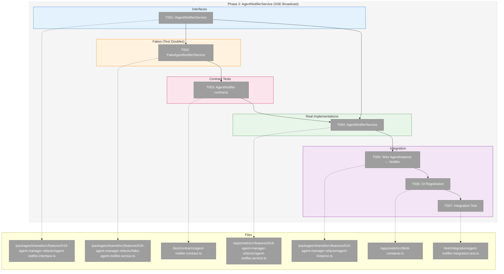
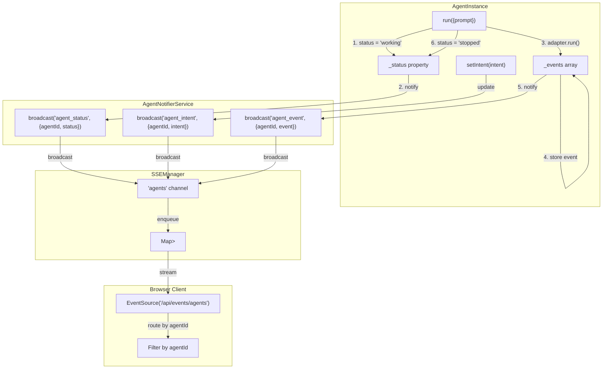
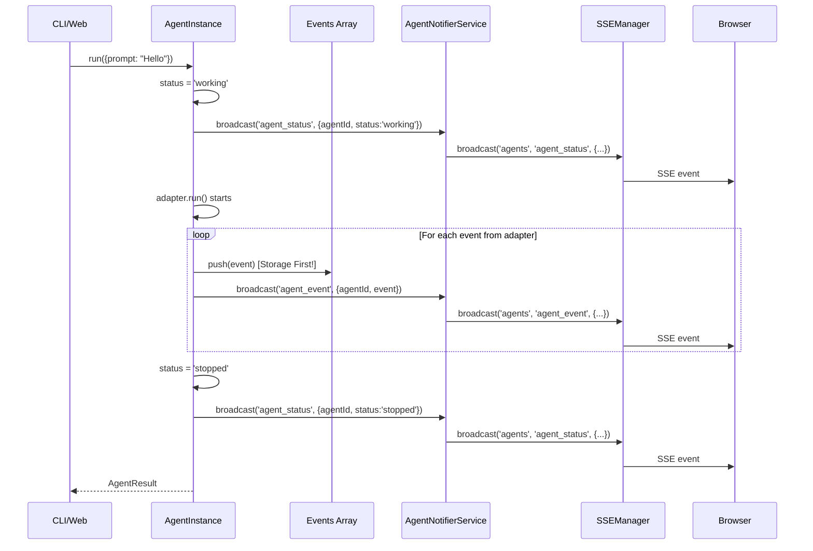

# Phase 2: AgentNotifierService (SSE Broadcast) – Tasks & Alignment Brief

**Spec**: [../agent-manager-refactor-spec.md](../agent-manager-refactor-spec.md)
**Plan**: [../agent-manager-refactor-plan.md](../agent-manager-refactor-plan.md)
**Date**: 2026-01-29

---

## Executive Briefing

### Purpose
This phase creates the real-time event broadcasting infrastructure that enables all UI components to receive agent status updates, intent changes, and content events through a single SSE connection. Without this, web clients would need to poll for updates, and menu items couldn't show agent status at a glance.

### What We're Building
An **AgentNotifierService** that:
- Attaches to AgentInstance to receive events as they occur
- Broadcasts all agent events to a single SSE channel (`/api/events/agents`)
- Includes `agentId` in every event for client-side filtering
- Follows the storage-first pattern: persist events THEN broadcast

### User Value
Users can:
- See real-time status updates for all agents in any UI component
- Menu items show agent status at a glance (working/stopped/error indicators)
- Multiple agents can run concurrently with isolated event streams
- Page refresh doesn't lose context—events rehydrate from storage, SSE catches up

### Example
**Before**: No unified event stream—each component polls or manages its own state
**After**:
```typescript
// Single SSE connection for all agents
const { isConnected } = useAgentSSE('agents', {
  onStatusChange: (agentId, status) => {
    // Update correct agent in state by ID
    updateAgent(agentId, { status });
  },
  onIntentChange: (agentId, intent) => {
    updateAgent(agentId, { intent });
  },
  onEvent: (agentId, event) => {
    appendEvent(agentId, event);
  },
});

// Events include agentId for routing:
// { type: 'agent_status', agentId: 'agent-123', status: 'working' }
// { type: 'agent_intent', agentId: 'agent-123', intent: 'Analyzing code...' }
// { type: 'agent_event', agentId: 'agent-123', event: { type: 'text_delta', ... } }
```

---

## Objectives & Scope

### Objective
Implement AgentNotifierService and integrate it with AgentInstance for real-time event broadcasting, achieving AC-13 through AC-18 from the specification.

### Behavior Checklist
- [ ] AgentNotifierService provides single SSE endpoint for all agents (AC-13)
- [ ] Events include agentId for client-side filtering (AC-14)
- [ ] Status changes are broadcast (AC-15)
- [ ] Intent changes are broadcast (AC-16)
- [ ] Agent events are broadcast after storage (AC-17, storage-first per PL-01)
- [ ] SSE survives page refresh with reconnection (AC-18)
- [ ] FakeAgentNotifierService provides test helpers (AC-28)

### Goals

- ✅ Define IAgentNotifierService interface with subscribe, broadcast methods
- ✅ Create FakeAgentNotifierService with broadcast tracking and connection simulation
- ✅ Write contract tests that run against BOTH Fake and Real implementations
- ✅ Implement AgentNotifierService using existing SSEManager with 'agents' channel
- ✅ Wire AgentInstance events to AgentNotifierService (emit on status/intent/event changes)
- ✅ Integration test verifying SSE receives agent events end-to-end
- ✅ Register service in DI container using factory pattern

### Non-Goals

- ❌ Web hooks for agent subscriptions (Phase 4)
- ❌ Storage persistence of events (Phase 3—this phase assumes in-memory events from Phase 1)
- ❌ Per-agent SSE channels (ADR-0007 mandates single channel with client-side routing)
- ❌ Complex reconnection logic (EventSource handles auto-reconnect; sinceId for catch-up is Phase 3)
- ❌ Modifying SSEManager itself (use existing broadcast API)
- ❌ UI components (Phase 4—this phase is headless infrastructure)

---

## Architecture Map

### Component Diagram
<!-- Status: grey=pending, orange=in-progress, green=completed, red=blocked -->
<!-- Updated by plan-6 during implementation -->



### Task-to-Component Mapping

<!-- Status: ⬜ Pending | 🟧 In Progress | ✅ Complete | 🔴 Blocked -->

| Task | Component(s) | Files | Status | Comment |
|------|-------------|-------|--------|---------|
| T000 | Web Feature Folder | /apps/web/src/features/019-agent-manager-refactor/ | ✅ Complete | PlanPak folder + index.ts |
| T001 | IAgentNotifierService | /packages/shared/src/features/019-agent-manager-refactor/agent-notifier.interface.ts | ✅ Complete | Define broadcast interface |
| T001a | ISSEBroadcaster | /packages/shared/src/features/019-agent-manager-refactor/sse-broadcaster.interface.ts | ✅ Complete | Minimal broadcast abstraction |
| T002 | FakeAgentNotifierService | /packages/shared/src/features/019-agent-manager-refactor/fake-agent-notifier.service.ts | ✅ Complete | Test double with helpers |
| T002a | FakeSSEBroadcaster | /packages/shared/src/features/019-agent-manager-refactor/fake-sse-broadcaster.ts | ✅ Complete | Test double for broadcaster |
| T003 | Contract Tests | /test/contracts/agent-notifier.contract.ts, .test.ts | ✅ Complete | Contract tests for notifier |
| T004 | AgentNotifierService | /apps/web/src/features/019-agent-manager-refactor/agent-notifier.service.ts | ✅ Complete | Real impl receives ISSEBroadcaster |
| T004a | SSEManagerBroadcaster | /apps/web/src/features/019-agent-manager-refactor/sse-manager-broadcaster.ts | ✅ Complete | Adapter wrapping SSEManager |
| T005 | AgentInstance + AgentManagerService Integration | /packages/shared/src/features/019-agent-manager-refactor/agent-instance.ts, agent-manager.service.ts | ✅ Complete | DI wiring: notifier injected via constructor |
| T006 | DI Registration | /apps/web/src/lib/di-container.ts, /packages/shared/src/di-tokens.ts | ✅ Complete | Register in container (cross-cutting) |
| T007 | Integration Test | /test/integration/agent-notifier.integration.test.ts | ✅ Complete | End-to-end SSE test |

---

## Tasks

| Status | ID | Task | CS | Type | Dependencies | Absolute Path(s) | Validation | Subtasks | Notes |
|--------|------|------|----|------|--------------|------------------|------------|----------|-------|
| [x] | T000 | Create web feature folder for Plan 019 | 1 | Setup | – | /home/jak/substrate/015-better-agents/apps/web/src/features/019-agent-manager-refactor/ | Directory exists; barrel export index.ts created | – | plan-scoped, PlanPak |
| [x] | T001 | Define IAgentNotifierService interface | 2 | Interface | – | /home/jak/substrate/015-better-agents/packages/shared/src/features/019-agent-manager-refactor/agent-notifier.interface.ts | Exports: IAgentNotifierService, AgentSSEEvent types; methods: broadcast() | – | plan-scoped |
| [x] | T001a | Define ISSEBroadcaster interface | 1 | Interface | – | /home/jak/substrate/015-better-agents/packages/shared/src/features/019-agent-manager-refactor/sse-broadcaster.interface.ts | Exports: ISSEBroadcaster with broadcast(channel, eventType, data) method | – | plan-scoped, Per DYK-08 |
| [x] | T002 | Write FakeAgentNotifierService with test helpers | 2 | Fake | T001, T001a | /home/jak/substrate/015-better-agents/packages/shared/src/features/019-agent-manager-refactor/fake-agent-notifier.service.ts | Has: getBroadcasts(), reset(); implements IAgentNotifierService; receives ISSEBroadcaster | – | plan-scoped |
| [x] | T002a | Write FakeSSEBroadcaster with test helpers | 1 | Fake | T001a | /home/jak/substrate/015-better-agents/packages/shared/src/features/019-agent-manager-refactor/fake-sse-broadcaster.ts | Has: getBroadcasts(), getLastBroadcast(), reset(); implements ISSEBroadcaster | – | plan-scoped, Per DYK-08 |
| [x] | T003 | Write contract tests for IAgentNotifierService | 2 | Test | T002, T002a | /home/jak/substrate/015-better-agents/test/contracts/agent-notifier.contract.ts, /home/jak/substrate/015-better-agents/test/contracts/agent-notifier.contract.test.ts | Tests cover AC-14, AC-15, AC-16; run against Fake AND Real; both use FakeSSEBroadcaster | – | plan-scoped |
| [x] | T004 | Implement AgentNotifierService to pass contracts | 3 | Core | T003, T001a | /home/jak/substrate/015-better-agents/apps/web/src/features/019-agent-manager-refactor/agent-notifier.service.ts | All contract tests pass; receives ISSEBroadcaster via constructor; events include agentId | – | plan-scoped, Per ADR-0007 IMP-001, Lives in apps/web |
| [x] | T004a | Create SSEManagerBroadcaster adapter | 1 | Adapter | T001a | /home/jak/substrate/015-better-agents/apps/web/src/features/019-agent-manager-refactor/sse-manager-broadcaster.ts | Wraps SSEManager, implements ISSEBroadcaster; used in production DI | – | plan-scoped, Per DYK-08 |
| [x] | T005 | Wire AgentInstance events to AgentNotifierService via DI | 3 | Integration | T004, T002 | /home/jak/substrate/015-better-agents/packages/shared/src/features/019-agent-manager-refactor/agent-instance.ts, /home/jak/substrate/015-better-agents/packages/shared/src/features/019-agent-manager-refactor/agent-manager.service.ts, /home/jak/substrate/015-better-agents/test/contracts/agent-instance.contract.test.ts, /home/jak/substrate/015-better-agents/test/integration/agent-instance.integration.test.ts | Add required notifier param to AgentInstance constructor (Per DYK-10); implement _setStatus() and _captureEvent() helpers (Per DYK-09); update Phase 1 tests to pass FakeAgentNotifierService; AgentManagerService receives notifier via DI | – | plan-scoped, Per DYK-06, Per DYK-09, Per DYK-10, Per Critical Finding 05 |
| [x] | T006 | Register AgentNotifierService in DI container | 2 | DI | T004, T004a | /home/jak/substrate/015-better-agents/packages/shared/src/di-tokens.ts, /home/jak/substrate/015-better-agents/apps/web/src/lib/di-container.ts | Add AGENT_NOTIFIER_SERVICE token; factory creates AgentNotifierService with SSEManagerBroadcaster; FakeAgentNotifierService with FakeSSEBroadcaster in test container | – | cross-cutting, Per ADR-0004 |
| [x] | T007 | Integration test: AgentInstance → SSE broadcast | 3 | Integration | T005, T006 | /home/jak/substrate/015-better-agents/test/integration/agent-notifier.integration.test.ts | Create agent via manager, run prompt, verify notifier received status/intent/event broadcasts in correct order | – | plan-scoped |

---

## Alignment Brief

### Prior Phases Review

#### Phase 1 Summary: AgentManagerService + AgentInstance Core

**Status**: ✅ Complete (2026-01-29)
**Test Results**: 44 contract tests + 9 integration tests passed

**Deliverables Created** (14 files):
1. `packages/shared/src/features/019-agent-manager-refactor/agent-manager.interface.ts` — IAgentManagerService interface
2. `packages/shared/src/features/019-agent-manager-refactor/agent-instance.interface.ts` — IAgentInstance interface, AgentType, AgentInstanceStatus, AdapterFactory types
3. `packages/shared/src/features/019-agent-manager-refactor/agent-manager.service.ts` — Real implementation with Map registry
4. `packages/shared/src/features/019-agent-manager-refactor/agent-instance.ts` — Real implementation wrapping IAgentAdapter
5. `packages/shared/src/features/019-agent-manager-refactor/fake-agent-manager.service.ts` — FakeAgentManagerService
6. `packages/shared/src/features/019-agent-manager-refactor/fake-agent-instance.ts` — FakeAgentInstance (composes FakeAgentAdapter)
7. `packages/shared/src/features/019-agent-manager-refactor/index.ts` — Barrel export
8. `packages/shared/src/utils/validate-agent-id.ts` — Security validation utility
9. `packages/shared/src/di-tokens.ts` — Added AGENT_MANAGER_SERVICE token
10. `packages/shared/package.json` — Added export path for feature folder
11. `apps/web/src/lib/di-container.ts` — Registered services
12. `test/contracts/agent-manager.contract.ts` + `.test.ts` — Contract tests (10 tests × 2 implementations)
13. `test/contracts/agent-instance.contract.ts` + `.test.ts` — Contract tests (12 tests × 2 implementations)
14. `test/integration/agent-instance.integration.test.ts` — 9 integration tests

**Key Architectural Decisions**:
- **DYK-01**: AdapterFactory injected, not concrete adapter—enables FakeAgentAdapter injection
- **DYK-02**: Status is exactly 3 states (`working`|`stopped`|`error`)—no 'question' state
- **DYK-03**: FakeAgentInstance composes FakeAgentAdapter internally
- **DYK-05**: Contract tests run against BOTH Fake and Real implementations

**Dependencies Exported for Phase 2**:
```typescript
// Types Phase 2 will use
export interface IAgentInstance {
  readonly id, name, type, workspace, status, intent, sessionId
  run(options): Promise<AgentResult>
  terminate(): Promise<AgentResult>
  getEvents(options?): AgentStoredEvent[]
  setIntent(intent: string): void
}

export type AgentStoredEvent = AgentEvent & { eventId: string }
export type AgentInstanceStatus = 'working' | 'stopped' | 'error'
```

**Critical Finding Applied**:
- CF-04 (double-run guard): Synchronous status check in `AgentInstance.run()` prevents concurrent runs

**What Phase 2 Builds Upon**:
- AgentInstance already captures events in `_events` array
- AgentInstance already transitions status (`stopped` → `working` → `stopped|error`)
- AgentInstance has `setIntent()` method for intent updates
- DI container pattern established with factory registration

### Critical Findings Affecting This Phase

| # | Finding | Impact | Tasks Addressing |
|---|---------|--------|------------------|
| 05 | Storage-first pattern required—persist BEFORE SSE broadcast (PL-01) | Event capture order: store event → broadcast notification | T005, T007 |
| 08 | SSEManager supports channel-based broadcasting (I1-04) | Use existing `sseManager.broadcast('agents', eventType, data)` | T004 |

### DYK Decisions (Phase 2)

| ID | Decision | Rationale | Tasks Affected |
|----|----------|-----------|----------------|
| DYK-06 | Notifier injected via DI: AgentManagerService receives IAgentNotifierService from container, passes to AgentInstance constructor | Follows ADR-0004 patterns, keeps everything fakeable, clean separation of concerns | T005, T006 |
| DYK-07 | Interface in shared, implementation in web: IAgentNotifierService in packages/shared, AgentNotifierService in apps/web | Correct dependency direction (web→shared), real impl can import SSEManager, Fake stays in shared for tests | T001, T004 |
| DYK-08 | ISSEBroadcaster abstraction: AgentNotifierService receives ISSEBroadcaster (not SSEManager directly), enabling contract tests against both Fake and Real | Preserves "contract tests run against both" pattern, FakeSSEBroadcaster for tests, SSEManagerBroadcaster for production | T001a, T002a, T003, T004, T004a |
| DYK-09 | Helper methods for storage-first: `_setStatus()` and `_captureEvent()` encapsulate storage-then-broadcast pattern, ensuring correct order is enforced | Single point of change, self-documenting, impossible to broadcast without storing first | T005 |
| DYK-10 | Notifier is required parameter (not optional): AgentInstance constructor requires IAgentNotifierService; Phase 1 tests updated to pass FakeAgentNotifierService | Explicit dependencies, no hidden optionality, consistent test patterns across phases | T005 |

### ADR Decision Constraints

- **ADR-0007: SSE Single-Channel Event Routing Pattern** (Accepted)
  - **Decision**: Single global SSE channel with client-side routing by `agentId`
  - **Constrains**: T001 (interface must include agentId in events), T004 (implementation uses 'agents' channel)
  - **IMP-001**: Events include `agentId` for routing
  - **IMP-003**: API response fallback catches completion if SSE missed events
  - Tag affected tasks with "Per ADR-0007"

- **ADR-0004: DI Container Architecture** (Accepted)
  - **Decision**: Use `useFactory` pattern, no `@injectable` decorators (RSC compatibility)
  - **Constrains**: T006 (DI Registration)
  - **Addressed by**: T006 uses factory pattern per ADR-0004 IMP-003

### PlanPak Placement Rules

- **Plan-scoped files**: `packages/shared/src/features/019-agent-manager-refactor/` (flat, descriptive names)
  - T001, T002, T004, T005 output here
- **Cross-cutting files**: Traditional shared location
  - T006 edits `di-tokens.ts` and `di-container.ts`
- **Dependency direction**: Plan code may import from shared/core; shared/core must never import from plan folders

### Invariants & Guardrails

1. **Storage-First (PL-01)**: Events MUST be stored before SSE broadcast—never reverse this order
2. **Single Channel (ADR-0007)**: All agent events go through `'agents'` channel, not per-agent channels
3. **AgentId Required**: Every SSE event payload MUST include `agentId` for client filtering
4. **Event Types**: `agent_status`, `agent_intent`, `agent_event` are the three broadcast types
5. **Status Values**: Only `'working'|'stopped'|'error'` (per Phase 1 DYK-02)

### Inputs to Read

| File | Purpose |
|------|---------|
| `/home/jak/substrate/015-better-agents/packages/shared/src/features/019-agent-manager-refactor/agent-instance.ts` | AgentInstance to extend with notifier integration |
| `/home/jak/substrate/015-better-agents/packages/shared/src/features/019-agent-manager-refactor/agent-instance.interface.ts` | IAgentInstance, AgentStoredEvent types |
| `/home/jak/substrate/015-better-agents/apps/web/src/lib/sse-manager.ts` | SSEManager.broadcast() API to use |
| `/home/jak/substrate/015-better-agents/apps/web/app/api/events/[channel]/route.ts` | Existing SSE route pattern |
| `/home/jak/substrate/015-better-agents/docs/adr/adr-0007-sse-single-channel-routing.md` | Single channel routing constraints |

### Visual Alignment: Flow Diagram



### Visual Alignment: Sequence Diagram



### Test Plan (TDD)

Per constitution Principle 3 (TDD) and Principle 4 (Fakes over mocks):

#### Contract Tests (run against BOTH Fake and Real)

| Test Name | AC | Purpose | Fixtures |
|-----------|------|---------|----------|
| `events include agentId for filtering` | AC-14 | Verify all broadcasts include agentId | Any agent event |
| `broadcasts status changes` | AC-15 | Verify status events broadcast | Agent status transition |
| `broadcasts intent changes` | AC-16 | Verify intent events broadcast | setIntent() call |
| `broadcast called for each event type` | AC-17 | Verify event routing | Multiple event types |

#### Fake Test Helpers Required

**FakeAgentNotifierService**:
- `getBroadcasts()`: Return all broadcast calls for inspection
- `simulateConnection(callback)`: Register a subscriber to receive broadcasts
- `getSubscribers()`: Get count of active subscribers
- `reset()`: Clear all state for test isolation
- `getLastBroadcast()`: Convenience for single-event tests

#### Integration Test Plan

| Test Name | Purpose | Components |
|-----------|---------|------------|
| `agent status change triggers SSE broadcast` | End-to-end status flow | AgentInstance → Notifier → SSEManager |
| `agent run captures events and broadcasts` | End-to-end event flow | AgentInstance.run() → events captured → broadcasts |
| `storage-first order verified` | Events stored BEFORE broadcast | Call order tracking |
| `multiple agents broadcast to same channel` | Concurrent agent support | 2 agents, verify both broadcast |

### Step-by-Step Implementation Outline

| Step | Task(s) | Action |
|------|---------|--------|
| 1 | T001 | Define IAgentNotifierService interface with AgentSSEEvent types |
| 2 | T002 | Create FakeAgentNotifierService with test helpers |
| 3 | T003 | Write contract tests (RED phase—tests should initially pass with Fake only) |
| 4 | T004 | Implement AgentNotifierService using SSEManager (GREEN phase—all tests pass) |
| 5 | T005 | Wire AgentInstance to call notifier on status/intent/event changes |
| 6 | T006 | Register in DI container with factory pattern |
| 7 | T007 | Integration test verifying end-to-end flow |
| 8 | – | REFACTOR: Clean up, optimize, document |

### Commands to Run

```bash
# Run all tests (verify baseline)
just test

# Run specific contract tests during development
pnpm test -- test/contracts/agent-notifier.contract.test.ts

# Run integration tests only
pnpm test -- test/integration/agent-notifier.integration.test.ts

# TypeScript compilation check
just typecheck

# Lint check
just lint

# Quick quality gate (fix, format, test)
just fft

# Full quality check before completion
just check
```

### Risks & Unknowns

| Risk | Severity | Likelihood | Mitigation |
|------|----------|------------|------------|
| SSEManager not available in test context | Medium | Medium | FakeAgentNotifierService doesn't need real SSEManager; Real impl only runs in web context |
| Circular dependency: AgentInstance → Notifier → AgentInstance | High | Low | Notifier receives events, doesn't call back to instance |
| Event order verification in async tests | Medium | Medium | Use call tracking arrays with timestamps |

### Ready Check

- [ ] IAgentNotifierService interface defined and reviewed (T001)
- [ ] FakeAgentNotifierService implemented with required helpers (T002)
- [ ] Contract tests written and passing for Fake (T003)
- [ ] AgentNotifierService passing all contract tests (T004)
- [ ] AgentInstance wired to notifier (T005)
- [ ] ADR-0007 constraints applied—single channel, agentId in events (T004)
- [ ] ADR-0004 constraints applied—factory registration (T006)

**GO / NO-GO**: Await human confirmation before proceeding to implementation.

---

## Phase Footnote Stubs

_Populated by plan-6 during implementation when significant decisions or deviations occur._

| # | Date | Task | Type | Description | References |
|---|------|------|------|-------------|------------|
| | | | | | |

**Types**: `deviation` | `discovery` | `decision` | `blocker` | `debt`

---

## Evidence Artifacts

Implementation will produce:
- `execution.log.md` in this directory — detailed narrative of implementation
- Test results from `just test`
- TypeScript compilation output from `just typecheck`

---

## Discoveries & Learnings

_Populated during implementation by plan-6. Log anything of interest to your future self._

| Date | Task | Type | Discovery | Resolution | References |
|------|------|------|-----------|------------|------------|
| | | | | | |

**Types**: `gotcha` | `research-needed` | `unexpected-behavior` | `workaround` | `decision` | `debt` | `insight`

**What to log**:
- Things that didn't work as expected
- External research that was required
- Implementation troubles and how they were resolved
- Gotchas and edge cases discovered
- Decisions made during implementation
- Technical debt introduced (and why)
- Insights that future phases should know about

_See also: `execution.log.md` for detailed narrative._

---

## Directory Layout

```
docs/plans/019-agent-manager-refactor/
├── agent-manager-refactor-plan.md
├── agent-manager-refactor-spec.md
├── prior-learnings.md
├── research-dossier.md
└── tasks/
    ├── phase-1-agentmanagerservice-agentinstance-core/
    │   ├── tasks.md
    │   └── execution.log.md
    └── phase-2-agentnotifierservice-sse-broadcast/
        ├── tasks.md              # This file
        └── execution.log.md      # Created by plan-6 during implementation
```

---

## Critical Insights Discussion

**Session**: 2026-01-29 02:21 UTC
**Context**: Phase 2 Tasks Dossier - AgentNotifierService (SSE Broadcast)
**Analyst**: AI Clarity Agent
**Reviewer**: Development Team
**Format**: Water Cooler Conversation (5 Critical Insights)

### Insight 1: The Notifier Injection Gap

**Did you know**: The current AgentInstance class has no way to receive a notifier - the constructor only takes config and adapterFactory.

**Implications**:
- T005 says "wire AgentInstance to notifier" but there's no injection point
- Need to decide HOW to pass the notifier to AgentInstance
- Options ranged from constructor injection to EventEmitter patterns

**Options Considered**:
- Option A: Constructor Injection - AgentManagerService passes notifier to AgentInstance
- Option B: External Wiring via callbacks - AgentManagerService subscribes to instance events
- Option C: EventEmitter Pattern - AgentInstance emits events, manager forwards to notifier

**AI Recommendation**: Option A - Constructor Injection
- Reasoning: Simplest change, explicit dependency, follows existing DI patterns.

**Discussion Summary**: User agreed with DI approach - "use DI properly, then we can fake it etc."

**Decision**: Constructor injection via DI - AgentManagerService receives notifier from container, passes to AgentInstance

**Action Items**: None - captured in DYK-06

**Affects**: T005, T006, agent-instance.ts, agent-manager.service.ts

---

### Insight 2: SSEManager Lives in apps/web - Dependency Inversion Problem

**Did you know**: SSEManager is in `apps/web` but AgentNotifierService was planned for `packages/shared` - shared packages can't import from app packages.

**Implications**:
- Import path `packages/shared` → `apps/web` is invalid (wrong direction)
- Need to split interface from implementation, or use abstraction layer
- Affects where real implementation lives

**Options Considered**:
- Option A: Interface in Shared, Implementation in Web - correct monorepo pattern
- Option B: Abstract Broadcaster Interface - extra abstraction layer
- Option C: Move SSEManager to Shared - pollutes shared with web concerns

**AI Recommendation**: Option A - Interface in Shared, Impl in Web
- Reasoning: Correct dependency direction, follows monorepo best practices.

**Discussion Summary**: User chose Option A - clean separation, correct direction.

**Decision**: IAgentNotifierService in packages/shared, AgentNotifierService in apps/web

**Action Items**: None - captured in DYK-07, T004 path updated

**Affects**: T001, T004

---

### Insight 3: Contract Tests Can't Run Against Real Without SSEManager

**Did you know**: Contract test pattern ("run against BOTH Fake and Real") breaks because real AgentNotifierService needs SSEManager which needs Next.js runtime.

**Implications**:
- Vitest runs in Node.js, no Next.js context
- Real implementation can't be instantiated without mocking
- Either break contract test pattern or add abstraction

**Options Considered**:
- Option A: Inject SSEManager as dependency - more DI complexity
- Option B: Contract tests only test Fake - breaks pattern
- Option C: ISSEBroadcaster Interface - minimal abstraction, both can be tested

**AI Recommendation**: Option C - ISSEBroadcaster Interface
- Reasoning: Preserves contract test pattern, minimal surface (one method), clean dependency.

**Discussion Summary**: User agreed - "definitely we can inject and fake etc to get this right."

**Decision**: Create ISSEBroadcaster interface, AgentNotifierService receives it via constructor

**Action Items**: Added T001a (interface), T002a (fake), T004a (adapter)

**Affects**: T001a, T002a, T003, T004, T004a - captured in DYK-08

---

### Insight 4: Storage-First Timing Is Tricky

**Did you know**: The storage-first pattern (persist BEFORE broadcast) creates subtle timing issues - current onEvent callback stores but doesn't broadcast.

**Implications**:
- Need to add notifier calls after each state change
- Order MUST be: store → broadcast (never reverse)
- Status changes, intent changes, and events all need this pattern

**Options Considered**:
- Option A: Add notifier calls inline - explicit but spread throughout run()
- Option B: Helper methods - `_setStatus()`, `_captureEvent()` encapsulate pattern
- Option C: Setter with side effects - automatic but hidden (code smell)

**AI Recommendation**: Option B - Helper Methods
- Reasoning: Encapsulates pattern, single point of change, self-documenting.

**Discussion Summary**: User chose Option B - helper methods for clean encapsulation.

**Decision**: Implement `_setStatus()` and `_captureEvent()` helper methods

**Action Items**: None - captured in DYK-09, T005 updated

**Affects**: T005

---

### Insight 5: Notifier Parameter Breaks Phase 1 Tests

**Did you know**: Adding notifier to AgentInstance constructor breaks all Phase 1 tests - they don't pass the third parameter.

**Implications**:
- 12+ test files need updates
- Either make notifier optional or update all tests
- Consistency vs. convenience tradeoff

**Options Considered**:
- Option A: Optional with No-Op Default - zero breaking changes
- Option B: Update All Phase 1 Tests - explicit, consistent
- Option C: No-Op Notifier as Default Export - explicit no-op class

**AI Recommendation**: Option A - Optional with No-Op Default
- Reasoning: Non-breaking, makes sense semantically (CLI doesn't need notifier).

**Discussion Summary**: User chose Option B - "Going explicit" - update all tests to pass FakeAgentNotifierService.

**Decision**: Notifier is required parameter; update Phase 1 tests

**Action Items**: T005 includes updating Phase 1 contract and integration tests

**Affects**: T005, Phase 1 test files - captured in DYK-10

---

## Session Summary

**Insights Surfaced**: 5 critical insights identified and discussed
**Decisions Made**: 5 decisions reached through collaborative discussion
**Action Items Created**: 3 new tasks added (T001a, T002a, T004a)
**Areas Requiring Updates**:
- T004 moved to apps/web
- T005 expanded to include Phase 1 test updates, CS bumped to 3
- DYK decisions table populated (DYK-06 through DYK-10)

**Shared Understanding Achieved**: ✓

**Confidence Level**: High - All architectural questions resolved, clear implementation path

**Next Steps**:
- Proceed to implementation with `just fft` baseline check
- Follow task order: T001 → T001a → T002 → T002a → T003 → T004 → T004a → T005 → T006 → T007

**Notes**:
- User consistently chose explicit/proper DI patterns over convenience
- ISSEBroadcaster abstraction was key insight - enables full testability
- Phase 2 now has 10 tasks (7 original + 3 new) with clear dependencies
