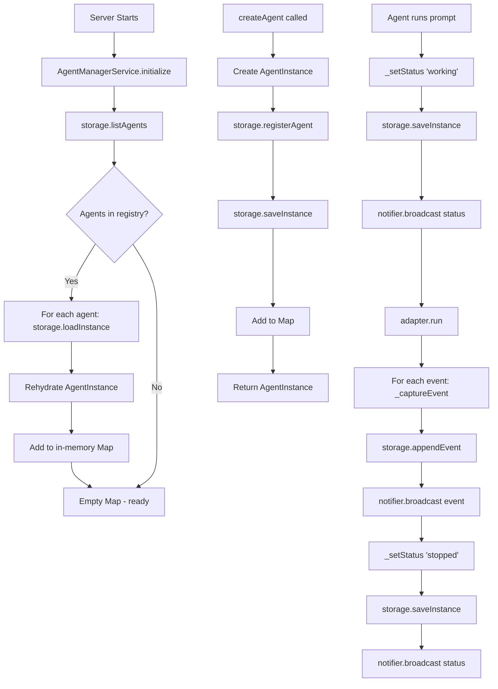
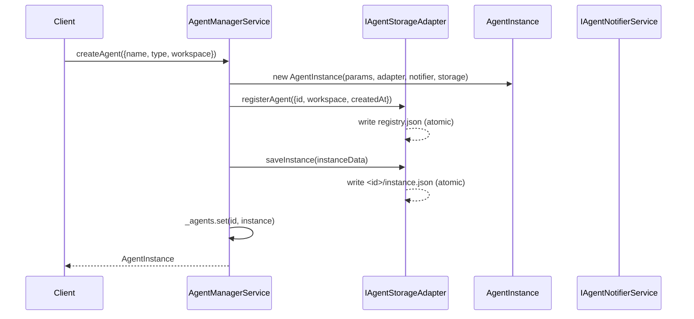
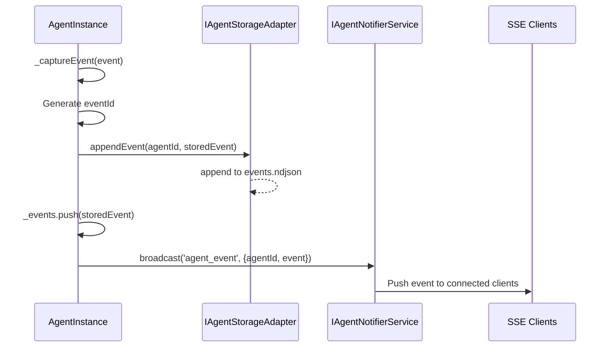

# Phase 3: Storage Layer – Tasks & Alignment Brief

**Spec**: [../../agent-manager-refactor-spec.md](../../agent-manager-refactor-spec.md)
**Plan**: [../../agent-manager-refactor-plan.md](../../agent-manager-refactor-plan.md)
**Phase**: 3 of 5
**Date**: 2026-01-29

---

## Executive Briefing

### Purpose

This phase implements persistent storage at `~/.config/chainglass/agents/` for agent registry and instance metadata. Without persistence, agents exist only in memory and are lost when the server restarts—breaking cross-session continuity and preventing CLI/web coexistence.

### What We're Building

An `IAgentStorageAdapter` abstraction with:
- **Registry storage**: Central `registry.json` tracking all agent IDs and workspace references
- **Instance storage**: Per-agent `instance.json` containing metadata (name, type, status, intent)
- **Event storage**: Per-agent `events.ndjson` in append-only NDJSON format
- **DI integration**: Storage adapter injected into AgentManagerService and AgentInstance

### User Value

Users can restart the server and find their agents intact. CLI and web can share the same agent registry. Conversation history persists across browser refreshes.

### Example

**Before (Phase 2)**: Server restarts → all agents gone, must recreate
**After (Phase 3)**:
```
~/.config/chainglass/agents/
├── registry.json                    # {"agents":{"abc123":{"workspace":"/project"}}}
├── abc123/
│   ├── instance.json               # {"id":"abc123","name":"chat","status":"stopped",...}
│   └── events.ndjson               # {"eventId":"...","type":"text","content":"Hello"}\n
```
Server restarts → `AgentManagerService.initialize()` loads agents → users resume work

---

## Objectives & Scope

### Objective

Implement persistent storage layer per plan AC-05, AC-19, AC-20, AC-21, AC-22, AC-23.

**Behavior Checklist**:
- [x] Agents survive process restart (AC-05)
- [x] Storage at `~/.config/chainglass/agents/` (AC-19)
- [x] Registry tracks all agents with workspace refs (AC-20)
- [x] Events stored in NDJSON format (AC-21)
- [x] Instance metadata stored as JSON (AC-22)
- [x] Path traversal prevention (AC-23)

### Goals

- ✅ Define IAgentStorageAdapter interface with registry/instance/event operations
- ✅ Implement FakeAgentStorageAdapter for contract tests
- ✅ Implement AgentStorageAdapter with atomic writes
- ✅ Integrate storage into AgentManagerService (load on init, persist on create)
- ✅ Integrate storage into AgentInstance (persist status/events)
- ✅ Register in DI container (production and test)
- ✅ Contract tests verifying Fake/Real parity
- ✅ Integration tests verifying restart survival

### Non-Goals

- ❌ SSE route implementation (Phase 4: Web Integration)
- ❌ React hooks for agent management (Phase 4)
- ❌ CLI commands (Phase 4)
- ❌ Migration from old storage locations (Phase 5: Consolidation)
- ❌ Distributed locking for multi-process access (simple file-based sufficient)
- ❌ Event compaction or archival (defer to future)
- ❌ Cross-machine sync (agents are per-machine by design)

---

## Architecture Map

### Component Diagram

```mermaid
flowchart TD
    classDef pending fill:#9E9E9E,stroke:#757575,color:#fff
    classDef inprogress fill:#FF9800,stroke:#F57C00,color:#fff
    classDef completed fill:#4CAF50,stroke:#388E3C,color:#fff
    classDef blocked fill:#F44336,stroke:#D32F2F,color:#fff

    style Phase fill:#F5F5F5,stroke:#E0E0E0
    style Shared fill:#F5F5F5,stroke:#E0E0E0
    style Web fill:#F5F5F5,stroke:#E0E0E0
    style Tests fill:#F5F5F5,stroke:#E0E0E0

    subgraph Phase["Phase 3: Storage Layer"]
        T001["T001: Define IAgentStorageAdapter ✓"]:::completed
        T002["T002: Write FakeAgentStorageAdapter ✓"]:::completed
        T003["T003: Write contract tests ✓"]:::completed
        T004["T004: Implement AgentStorageAdapter ✓"]:::completed
        T005["T005: Integrate with AgentManagerService ✓"]:::completed
        T006["T006: Integrate with AgentInstance ✓"]:::completed
        T007["T007: Update FakeAgentInstance ✓"]:::completed
        T008["T008: Register in DI container ✓"]:::completed
        T009["T009: Integration test: persistence ✓"]:::completed
        T010["T010: Integration test: events ✓"]:::completed

        T001 --> T002
        T001 --> T003
        T002 --> T003
        T003 --> T004
        T003 --> T005
        T003 --> T006
        T004 --> T008
        T005 --> T008
        T006 --> T007
        T007 --> T008
        T008 --> T009
        T008 --> T010
    end

    subgraph Shared["packages/shared/src/features/019-agent-manager-refactor"]
        F1["agent-storage.interface.ts ✓"]:::completed
        F2["fake-agent-storage.adapter.ts ✓"]:::completed
        F3["agent-manager.service.ts ✓"]:::completed
        F4["agent-instance.ts ✓"]:::completed
        F5["fake-agent-instance.ts ✓"]:::completed
        F6["di-tokens.ts ✓"]:::completed
        F7["index.ts (shared) ✓"]:::completed
        F8["agent-storage.adapter.ts ✓"]:::completed
    end

    subgraph Web["apps/web/src/lib"]
        F10["di-container.ts ✓"]:::completed
    end

    subgraph Tests["test/"]
        F12["contracts/agent-storage.contract.ts ✓"]:::completed
        F13["contracts/agent-storage.contract.test.ts ✓"]:::completed
        F14["integration/agent-persistence.integration.test.ts ✓"]:::completed
    end

    T001 -.-> F1
    T001 -.-> F7
    T002 -.-> F2
    T002 -.-> F7
    T003 -.-> F12
    T003 -.-> F13
    T004 -.-> F8
    T005 -.-> F3
    T006 -.-> F4
    T007 -.-> F5
    T008 -.-> F6
    T008 -.-> F7
    T008 -.-> F10
    T009 -.-> F14
    T010 -.-> F14
```

<!-- Status: grey=pending, orange=in-progress, green=completed, red=blocked -->
<!-- Updated by plan-6 during implementation -->



### Task-to-Component Mapping

<!-- Status: ⬜ Pending | 🟧 In Progress | ✅ Complete | 🔴 Blocked -->

| Task | Component(s) | Files | Status | Comment |
|------|-------------|-------|--------|---------|
| T001 | Storage Interface | agent-storage.interface.ts, index.ts | ✅ Complete | Define registry/instance/event operations |
| T002 | Fake Storage | fake-agent-storage.adapter.ts | ✅ Complete | In-memory test double with helpers |
| T003 | Contract Tests | agent-storage.contract.ts/test.ts | ✅ Complete | Run against Fake and Real |
| T004 | Real Storage | agent-storage.adapter.ts (in shared) | ✅ Complete | JSON/NDJSON at ~/.config/chainglass/agents; per DYK-11 |
| T005 | Manager Integration | agent-manager.service.ts | ✅ Complete | Add initialize(), persist on create |
| T006 | Instance Integration | agent-instance.ts | ✅ Complete | Persist status/events via storage |
| T007 | Fake Instance Update | fake-agent-instance.ts | ✅ Complete | Optional storage support |
| T008 | DI Registration | di-tokens.ts, di-container.ts | ✅ Complete | Wire storage into container |
| T009 | Persistence Test | agent-persistence.integration.test.ts | ✅ Complete | AC-05 restart survival |
| T010 | Events Test | agent-persistence.integration.test.ts | ✅ Complete | AC-21 NDJSON format |

---

## Tasks

| Status | ID | Task | CS | Type | Dependencies | Path(s) | Validation | Subtasks | Notes |
|--------|-----|------|----|------|--------------|---------|------------|----------|-------|
| [x] | T001 | Define IAgentStorageAdapter interface with registry, instance, and event operations | 2 | Core | – | `packages/shared/src/features/019-agent-manager-refactor/agent-storage.interface.ts`, `packages/shared/src/features/019-agent-manager-refactor/index.ts` | Interface exports: registerAgent, unregisterAgent, listAgents, saveInstance, loadInstance, appendEvent, getEvents, getEventsSince | – | plan-scoped |
| [x] | T002 | Write FakeAgentStorageAdapter with test helpers: setAgents(), setInstance(), setEvents(), getSavedInstances(), getAppendedEvents(), setError(), reset() | 2 | Test | T001 | `packages/shared/src/features/019-agent-manager-refactor/fake-agent-storage.adapter.ts`, `packages/shared/src/features/019-agent-manager-refactor/index.ts` | All interface methods implemented; helpers enable state inspection; error injection works | – | plan-scoped |
| [x] | T003 | Write contract tests for IAgentStorageAdapter covering AC-19, AC-20, AC-21, AC-22, AC-23 | 2 | Test | T001, T002 | `test/contracts/agent-storage.contract.ts`, `test/contracts/agent-storage.contract.test.ts` | 20+ tests (10 Fake + 10 Real); all ACs verified; both implementations pass identical tests | – | test (project convention) |
| [x] | T004 | Implement AgentStorageAdapter with atomic writes at ~/.config/chainglass/agents/ | 3 | Core | T003 | `packages/shared/src/features/019-agent-manager-refactor/agent-storage.adapter.ts`, `packages/shared/src/features/019-agent-manager-refactor/index.ts` | All contract tests pass; storage at correct location; atomic temp+rename writes | – | plan-scoped, per ADR-0008, per DYK-11 |
| [x] | T005 | Integrate storage with AgentManagerService: add initialize() method, persist on createAgent() | 3 | Core | T003 | `packages/shared/src/features/019-agent-manager-refactor/agent-manager.service.ts` | Constructor accepts optional storage adapter; initialize() calls AgentInstance.hydrate() for each stored agent; createAgent() persists when storage provided | – | plan-scoped, per DYK-12, per DYK-13 |
| [x] | T006 | Integrate storage with AgentInstance: persist status/events in _setStatus() and _captureEvent(), add static hydrate() factory | 3 | Core | T003 | `packages/shared/src/features/019-agent-manager-refactor/agent-instance.ts` | Constructor accepts optional storage; static hydrate() restores instance + all events; working→stopped on reload; status/events persist before broadcast | – | plan-scoped, per PL-01, per DYK-12/13/14/15 |
| [x] | T007 | Update FakeAgentInstance to support optional storage adapter | 2 | Test | T006 | `packages/shared/src/features/019-agent-manager-refactor/fake-agent-instance.ts` | Works with/without storage; existing tests unaffected; per DYK-12 | – | plan-scoped |
| [x] | T008 | Register AGENT_STORAGE_ADAPTER in DI container for production and test | 2 | Core | T004, T005, T007 | `packages/shared/src/di-tokens.ts`, `apps/web/src/lib/di-container.ts`, `packages/shared/src/features/019-agent-manager-refactor/index.ts` | DI token defined; prod uses real adapter; tests use fake | – | cross-cutting, per ADR-0004 |
| [x] | T009 | Integration test: agents survive AgentManagerService restart (AC-05) | 2 | Test | T008 | `test/integration/agent-persistence.integration.test.ts` | Create agent → "restart" → agent exists with status='stopped'; 6+ persistence tests | – | test (project convention) |
| [x] | T010 | Integration test: events stored in NDJSON format with sinceId support (AC-21) | 2 | Test | T008 | `test/integration/agent-persistence.integration.test.ts` | NDJSON format verified; getEventsSince works; malformed lines skipped | – | test (project convention) |

---

## Alignment Brief

### Prior Phases Review

#### Phase 1: AgentManagerService + AgentInstance Core (COMPLETE 2026-01-29)

**A. Deliverables Created**:
- `packages/shared/src/features/019-agent-manager-refactor/agent-manager.interface.ts` — IAgentManagerService interface
- `packages/shared/src/features/019-agent-manager-refactor/agent-instance.interface.ts` — IAgentInstance interface
- `packages/shared/src/features/019-agent-manager-refactor/agent-manager.service.ts` — Real implementation with in-memory Map
- `packages/shared/src/features/019-agent-manager-refactor/agent-instance.ts` — Real implementation wrapping IAgentAdapter
- `packages/shared/src/features/019-agent-manager-refactor/fake-agent-manager.service.ts` — Test double
- `packages/shared/src/features/019-agent-manager-refactor/fake-agent-instance.ts` — Test double
- `packages/shared/src/utils/validate-agent-id.ts` — Path traversal prevention
- `test/contracts/agent-manager.contract.ts` — 10 contract tests
- `test/contracts/agent-instance.contract.ts` — 12 contract tests
- `test/integration/agent-instance.integration.test.ts` — 9 integration tests

**B. Lessons Learned**:
- Contract test pattern (Fake+Real parity) eliminates mock complexity
- AdapterFactory injection via DI enables test substitution
- Status guard (`if (status === 'working') throw`) sufficient for double-run prevention

**C. Technical Discoveries**:
- AgentStoredEvent = AgentEvent & { eventId } (intersection type for discriminated unions)
- Agent IDs must be filesystem-safe (validated via validateAgentId)
- 3-state status machine: `stopped → working → {stopped|error}` (no 'question' state)

**D. Dependencies Exported**:
- `IAgentManagerService`: createAgent, getAgents, getAgent
- `IAgentInstance`: run, terminate, getEvents, setIntent; properties: id, name, type, workspace, status
- `AgentType`: 'claude-code' | 'copilot'
- `AgentInstanceStatus`: 'working' | 'stopped' | 'error'
- `validateAgentId()`, `assertValidAgentId()`, `generateAgentId()`
- `DI_TOKENS.AGENT_MANAGER_SERVICE`

**E. Critical Findings Applied**:
- CF-01 (No central registry) → AgentManagerService with Map<id, instance>
- CF-03 (Path traversal) → validateAgentId() rejects `..`, `/`, `\`
- CF-04 (Race condition) → Status guard before adapter.run()

**F. Incomplete/Blocked Items**: None — all Phase 1 tasks completed successfully.

**G. Test Infrastructure**:
- Contract test pattern: `contractTests('Fake', () => new Fake()); contractTests('Real', () => container.resolve(...))`
- FakeAgentAdapter composed into FakeAgentInstance

**H. Technical Debt**: None recorded.

**I. Architectural Decisions**:
- DYK-01: AdapterFactory injection (not concrete adapter)
- DYK-02: 3-state status machine
- DYK-03: FakeAgentInstance composes FakeAgentAdapter
- DYK-05: Contract tests run against both Fake AND Real

**J. Scope Changes**: None — implemented as specified.

**K. Key Log References**:
- [Phase 1 execution.log.md](../phase-1-agentmanagerservice-agentinstance-core/execution.log.md)

---

#### Phase 2: AgentNotifierService (SSE Broadcast) (COMPLETE 2026-01-29)

**A. Deliverables Created**:
- `packages/shared/src/features/019-agent-manager-refactor/agent-notifier.interface.ts` — IAgentNotifierService interface
- `packages/shared/src/features/019-agent-manager-refactor/sse-broadcaster.interface.ts` — ISSEBroadcaster abstraction
- `packages/shared/src/features/019-agent-manager-refactor/fake-agent-notifier.service.ts` — Test double
- `packages/shared/src/features/019-agent-manager-refactor/fake-sse-broadcaster.ts` — Test double
- `apps/web/src/features/019-agent-manager-refactor/agent-notifier.service.ts` — Real implementation
- `apps/web/src/features/019-agent-manager-refactor/sse-manager-broadcaster.ts` — SSEManager adapter
- `test/contracts/agent-notifier.contract.ts` — 40 contract tests (20 Fake + 20 Real)
- `test/integration/agent-notifier.integration.test.ts` — 8 integration tests

**B. Lessons Learned**:
- ISSEBroadcaster abstraction enabled contract tests against both Fake and Real
- Storage-first helpers (_setStatus, _captureEvent) make correct order self-enforcing
- Notifier as required parameter (not optional) makes API clearer

**C. Technical Discoveries**:
- SSEManager API: `broadcast(channel, eventType, data)`
- All events to single 'agents' channel with agentId for client-side filtering
- Storage-first timing: store event → THEN broadcast

**D. Dependencies Exported**:
- `IAgentNotifierService`: broadcast(eventType, data)
- `ISSEBroadcaster`: broadcast(channel, eventType, data)
- `FakeAgentNotifierService`: getBroadcasts(), getLastBroadcast(), reset()
- `DI_TOKENS.AGENT_NOTIFIER_SERVICE`

**E. Critical Findings Applied**:
- CF-05 (Storage-first, PL-01) → Helper methods enforce persist-then-broadcast
- CF-08 (SSEManager support) → Reused existing broadcast() API

**F. Incomplete/Blocked Items**: None — all Phase 2 tasks completed successfully.

**G. Test Infrastructure**:
- FakeSSEBroadcaster records all broadcasts with timestamps
- FakeAgentNotifierService with getBroadcasts() for inspection

**H. Technical Debt**:
- No SSE reconnection catch-up yet (Phase 3 storage enables sinceId recovery)

**I. Architectural Decisions**:
- DYK-06: Notifier injected via DI into AgentManagerService
- DYK-07: Interface in shared, implementation in web
- DYK-08: ISSEBroadcaster abstraction for testability
- DYK-09: Helper methods for storage-first pattern
- DYK-10: Notifier is required parameter

**J. Scope Changes**: None — implemented as specified.

**K. Key Log References**:
- [Phase 2 execution.log.md](../phase-2-agentnotifierservice-sse-broadcast/execution.log.md)

---

### Critical Findings Affecting This Phase

| Finding | What It Constrains | Tasks Addressing |
|---------|-------------------|------------------|
| CF-03 (Path traversal, PL-09) | All storage paths must use validateAgentId() before filesystem access | T004 |
| CF-05 (Storage-first, PL-01) | Events must persist BEFORE SSE broadcast | T006 |
| R1-03 (Event ID ordering) | Use timestamp-based IDs to prevent collision | T004 |
| R1-04 (Directory deletion race) | Use atomic temp+rename for writes | T004 |
| I1-05 (Workspace-scoped storage) | New location at ~/.config/chainglass/agents/ | T004 |

### ADR Decision Constraints

- **ADR-0007**: Single SSE channel with client-side routing — Does not directly affect storage, but storage-first pattern (per PL-01) ensures events are persisted before broadcast
- **ADR-0008**: Workspace split storage — Informs decision to use `~/.config/chainglass/agents/` as global location (not per-worktree)
- **ADR-0004**: DI container architecture — Use `useFactory` pattern for storage adapter registration

### PlanPak Placement Rules

Per `File Management: PlanPak` in plan:
- **Plan-scoped files** → `packages/shared/src/features/019-agent-manager-refactor/` and `apps/web/src/features/019-agent-manager-refactor/` (flat, no subfolders)
- **Cross-cutting files** → `packages/shared/src/di-tokens.ts`, `apps/web/src/lib/di-container.ts`
- **Test files** → `test/contracts/`, `test/integration/` (per project convention, PlanPak doesn't prescribe)
- **Dependency direction**: plans → shared (allowed), shared → plans (never)

### Invariants & Guardrails

- **Path Security**: All agent IDs validated via `assertValidAgentId()` before path construction
- **Atomic Writes**: Use temp file + rename pattern to prevent corrupted JSON/NDJSON
- **No Caching**: Always read fresh from filesystem (per existing AgentEventAdapter pattern)
- **Storage Location**: `~/.config/chainglass/agents/` is absolute, not configurable

### Inputs to Read

| File | Purpose |
|------|---------|
| `packages/shared/src/features/019-agent-manager-refactor/agent-manager.service.ts` | Understand current in-memory implementation |
| `packages/shared/src/features/019-agent-manager-refactor/agent-instance.ts` | Understand current event capture and status |
| `packages/shared/src/utils/validate-agent-id.ts` | Reuse for storage path validation |
| `packages/workflow/src/adapters/agent-event.adapter.ts` | Reference existing NDJSON pattern |
| `apps/web/src/lib/di-container.ts` | Understand DI registration pattern |

### Visual Alignment Aids

#### Flow Diagram: Agent Persistence Lifecycle



#### Sequence Diagram: Agent Creation with Persistence



#### Sequence Diagram: Event Capture with Storage-First



### Test Plan

**Testing Approach**: TDD with contract tests (Fake+Real parity), no mocks per constitution.

| Test | Type | File | Purpose | Fixtures | Expected Output |
|------|------|------|---------|----------|-----------------|
| Registry: register and list agents | Contract | agent-storage.contract.ts | AC-20 | FakeAgentStorageAdapter | listAgents() returns registered entries with workspace |
| Registry: unregister removes agent | Contract | agent-storage.contract.ts | AC-20 | FakeAgentStorageAdapter | listAgents() excludes unregistered agent |
| Instance: save and load | Contract | agent-storage.contract.ts | AC-22 | FakeAgentStorageAdapter | loadInstance() returns saved data with all fields |
| Instance: return null for unknown | Contract | agent-storage.contract.ts | AC-22 | FakeAgentStorageAdapter | loadInstance('unknown') returns null |
| Events: append and retrieve | Contract | agent-storage.contract.ts | AC-21 | FakeAgentStorageAdapter | getEvents() returns appended events in order |
| Events: getSince returns after ID | Contract | agent-storage.contract.ts | AC-21 | FakeAgentStorageAdapter | getEventsSince(id) returns only events after id |
| Security: reject invalid agentId | Contract | agent-storage.contract.ts | AC-23 | FakeAgentStorageAdapter | Throws ValidationError for `../`, `/`, `\` |
| Persistence: agents survive restart | Integration | agent-persistence.integration.test.ts | AC-05 | FakeAgentStorageAdapter, FakeAgentNotifierService | After manager recreation, getAgent(id) returns agent |
| Persistence: events survive restart | Integration | agent-persistence.integration.test.ts | AC-05 | FakeAgentStorageAdapter | After recreation, getEvents() returns all prior events |
| Persistence: working agents reset to stopped | Integration | agent-persistence.integration.test.ts | AC-05 | FakeAgentStorageAdapter | Reloaded agent has status='stopped' |

### Step-by-Step Implementation Outline

1. **T001**: Define interface in agent-storage.interface.ts with types AgentRegistryEntry, AgentInstanceData
2. **T002**: Implement FakeAgentStorageAdapter with in-memory Maps and test helpers
3. **T003**: Write contract tests—run against Fake first (all pass)
4. **T004**: Implement AgentStorageAdapter—run contract tests against Real (all pass)
5. **T005**: Modify AgentManagerService constructor to accept storage; add initialize()
6. **T006**: Modify AgentInstance to accept storage; update _setStatus/_captureEvent helpers
7. **T007**: Update FakeAgentInstance to optionally accept storage
8. **T008**: Add DI token; register in production and test containers
9. **T009**: Write integration tests for restart survival
10. **T010**: Write integration tests for NDJSON format and sinceId

### Commands to Run

```bash
# Verify baseline
just fft

# Run specific contract tests during development
pnpm vitest test/contracts/agent-storage.contract.test.ts

# Run integration tests
pnpm vitest test/integration/agent-persistence.integration.test.ts

# Type check
just typecheck

# Full quality check before commit
just check
```

### Risks & Unknowns

| Risk | Severity | Mitigation |
|------|----------|------------|
| Atomic rename not atomic on all filesystems | Medium | Use Node.js fs.rename which is atomic on POSIX; document limitation |
| Concurrent writes from CLI + web | Medium | File-based locking hints; last-write-wins acceptable for MVP |
| Storage path permissions | Low | ~/.config/ is user-writable by convention; document requirement |
| Event ID collision under concurrency | Medium | Timestamp + random suffix (existing pattern) sufficient |

### Ready Check

- [ ] Prior phases reviewed (Phase 1 + Phase 2 deliverables understood)
- [ ] Critical findings mapped to tasks (CF-03→T004, CF-05→T006, R1-03→T004, R1-04→T004, I1-05→T004)
- [ ] ADR constraints mapped to tasks (IDs noted in Notes column) — ADR-0004, ADR-0007, ADR-0008 noted
- [ ] PlanPak placement rules applied (all tasks have classification tags in Notes)
- [ ] Test plan covers all ACs (AC-05, AC-19, AC-20, AC-21, AC-22, AC-23)
- [ ] Sequence diagrams reviewed for storage-first flow
- [ ] Baseline verified with `just fft`

---

## Phase Footnote Stubs

<!-- Populated by plan-6 during implementation -->

| Footnote | Task | Description |
|----------|------|-------------|
| | | |

---

## Evidence Artifacts

**Execution Log**: `./execution.log.md` (created by plan-6 during implementation)

**Supporting Files**:
- Contract test results
- Integration test results
- Storage format examples

---

## Discoveries & Learnings

_Populated during implementation by plan-6. Log anything of interest to your future self._

| Date | Task | Type | Discovery | Resolution | References |
|------|------|------|-----------|------------|------------|
| | | | | | |

**Types**: `gotcha` | `research-needed` | `unexpected-behavior` | `workaround` | `decision` | `debt` | `insight`

**What to log**:
- Things that didn't work as expected
- External research that was required
- Implementation troubles and how they were resolved
- Gotchas and edge cases discovered
- Decisions made during implementation
- Technical debt introduced (and why)
- Insights that future phases should know about

_See also: `execution.log.md` for detailed narrative._

---

## Directory Layout

```
docs/plans/019-agent-manager-refactor/
├── agent-manager-refactor-spec.md
├── agent-manager-refactor-plan.md
└── tasks/
    ├── phase-1-agentmanagerservice-agentinstance-core/
    │   ├── tasks.md
    │   └── execution.log.md
    ├── phase-2-agentnotifierservice-sse-broadcast/
    │   ├── tasks.md
    │   └── execution.log.md
    └── phase-3-storage-layer/
        ├── tasks.md              # This file
        └── execution.log.md      # Created by plan-6
```

---

## Critical Insights Discussion

**Session**: 2026-01-29 ~05:00 UTC
**Context**: Phase 3: Storage Layer - Tasks & Alignment Brief
**Analyst**: AI Clarity Agent
**Reviewer**: Development Team
**Format**: Water Cooler Conversation (5 Critical Insights)

### Insight 1: Storage Adapter Location Creates Cross-Package Dependency Risk

**Did you know**: Placing AgentStorageAdapter (real) in apps/web/ but IAgentStorageAdapter (interface) in packages/shared/ creates import hazards for contract tests.

**Implications**:
- Contract tests need to run against BOTH Fake and Real implementations
- Test file importing from apps/web/ violates typical monorepo dependency direction
- CI might need special config to build web before running shared tests

**Options Considered**:
- Option A: Move Real Storage Adapter to packages/shared - Consistent with Phase 1/2 pattern
- Option B: Split Contract Tests - Fake in test/, Real in apps/web/
- Option C: Accept Unusual Import - Document the cross-package import

**AI Recommendation**: Option A - Move Real Storage Adapter to packages/shared
- Reasoning: Pattern consistency with Phases 1/2; contract tests work naturally without cross-package imports

**Discussion Summary**: User agreed that maintaining consistency with prior phases was more valuable than keeping packages/shared "pure".

**Decision**: Move AgentStorageAdapter to packages/shared alongside FakeAgentStorageAdapter

**Action Items**: None - T004 path updated

**Affects**: T004, T008, Architecture Map

**DYK-11**: Real storage adapter lives in packages/shared for contract test parity

---

### Insight 2: The initialize() Method Creates Breaking Change Risk

**Did you know**: Adding initialize() to AgentManagerService means every test must call it, or the manager will have empty state even when storage has agents.

**Implications**:
- All existing Phase 1/2 contract tests would need updating
- Integration tests could silently "work" but test wrong thing (empty state)
- Production code must always call initialize() after construction
- Easy to forget = subtle bugs

**Options Considered**:
- Option A: Make initialize() Required Before Any Operation - Explicit but boilerplate
- Option B: Auto-Initialize on First Access (Lazy Load) - Backwards compatible but hidden state
- Option C: Async Factory Instead of Constructor - Can't forget but breaking change
- Option D: Storage is Optional; initialize() Only When Storage Provided - Backwards compatible

**AI Recommendation**: Option D - Storage is Optional
- Reasoning: Backwards compatible with Phase 1/2 tests; explicit opt-in for persistence

**Discussion Summary**: User chose backwards compatibility to keep existing tests working unchanged.

**Decision**: Storage is optional parameter; initialize() only required when storage is provided

**Action Items**: None - T005/T006/T007 updated

**Affects**: T005, T006, T007

**DYK-12**: Storage is optional; no storage = in-memory only (Phase 1/2 behavior)

---

### Insight 3: Rehydrate AgentInstance Missing Critical Context

**Did you know**: When initialize() loads agents, it can't just create new AgentInstance() — it needs to restore status, intent, sessionId, events, and timestamps, but constructor doesn't support that.

**Implications**:
- Session continuity broken without sessionId restoration
- Intent lost — UI shows empty instead of actual intent
- Timestamps reset — agent looks newly created
- Manager would need to know AgentInstance internals (leaky)

**Options Considered**:
- Option A: Extended Constructor with Optional Restore Data - Single path but leaky
- Option B: Static Factory AgentInstance.fromStorage() - Clean separation
- Option C: Two-Phase Construction (create then restore) - Flexible but invalid intermediate state

**AI Recommendation**: Option A initially, then workshopped to Option B
- Reasoning: Static factory keeps Manager clean; AgentInstance owns its restoration logic

**Discussion Summary**: User raised encapsulation concern. Workshopped to static hydrate() factory where AgentInstance calls storage.loadInstance() itself.

**Decision**: Use static AgentInstance.hydrate(id, storage, factory, notifier) factory for restoration

**Action Items**: None - T005/T006 updated

**Affects**: T005, T006

**DYK-13**: Use AgentInstance.hydrate() for restoration; Manager orchestrates, Instance owns restore logic

---

### Insight 4: Events Loading Memory vs Disk Trade-off

**Did you know**: When hydrate() loads from storage, we can either load ALL events into memory upfront, or load on-demand from disk — with significant implications for agents with long histories.

**Implications**:
- Eager load: Fast getEvents() but memory grows with history (est. 2.5MB for power user)
- Lazy load: Constant memory but disk I/O on every call; getEvents() becomes async
- SSE reconnection needs events access for catch-up

**Options Considered**:
- Option A: Eager Load All Events at Hydrate - Simple, fast reads, sync API
- Option B: Lazy Load from Disk - Constant memory but async API change
- Option C: Hybrid Recent + Lazy - Bounded memory but complex
- Option D: Storage is Source of Truth - Clear but every read hits disk

**AI Recommendation**: Option A - Eager Load
- Reasoning: Keep simple for MVP; 2.5MB is fine for desktop; sync API preserved; optimize later if needed

**Discussion Summary**: User agreed not to pre-optimize.

**Decision**: Eager load all events at hydrate time; optimize later if evidence of memory pressure

**Action Items**: None - T006 updated

**Affects**: T006

**DYK-14**: Eager load events at hydrate; don't pre-optimize

---

### Insight 5: Working Agents on Restart Status Policy

**Did you know**: If server crashes while agent is status='working', the persisted status is 'working' — but we can't resume the adapter's work. What status should rehydrated agent have?

**Implications**:
- Can't keep 'working' — it's a lie (agent isn't actually working)
- 'error' suggests something broke that needs fixing — alarming
- 'stopped' suggests ready to retry — clean slate

**Options Considered**:
- Option A: Rehydrate as 'stopped' - Clean slate, no alarm fatigue
- Option B: Rehydrate as 'error' - Explicit signal but alarming
- Option C: New Status 'interrupted' - Precise but adds complexity

**AI Recommendation**: Option A - Rehydrate as 'stopped'
- Reasoning: Matches test plan; simple mental model; no alarm fatigue; easy retry

**Discussion Summary**: User confirmed always stopped.

**Decision**: Always rehydrate as 'stopped' even if persisted as 'working'

**Action Items**: None - already in test plan

**Affects**: T006, T009

**DYK-15**: Always rehydrate status as 'stopped' (working→stopped on restart)

---

## Session Summary

**Insights Surfaced**: 5 critical insights identified and discussed
**Decisions Made**: 5 decisions reached through collaborative discussion
**Action Items Created**: 0 (all updates applied inline)
**Areas Updated**:
- T004: Path changed to packages/shared (DYK-11)
- T005: Optional storage, uses hydrate() (DYK-12, DYK-13)
- T006: hydrate() factory, eager events, working→stopped (DYK-12/13/14/15)
- T007: Optional storage (DYK-12)
- T008: Updated paths
- Architecture Map: Moved F8 to Shared subgraph

**Shared Understanding Achieved**: ✓

**Confidence Level**: High - All architectural decisions made; patterns consistent with Phase 1/2

**Next Steps**:
1. Verify baseline with `just fft`
2. Proceed to implementation with `/plan-6-implement-phase`

**Notes**:
- DYK-11 through DYK-15 established for Phase 3
- All decisions favor simplicity and backwards compatibility
- Storage is opt-in; existing tests continue working unchanged
