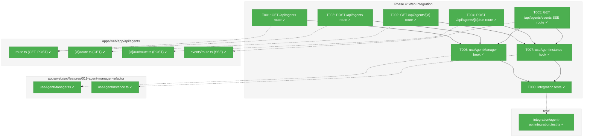
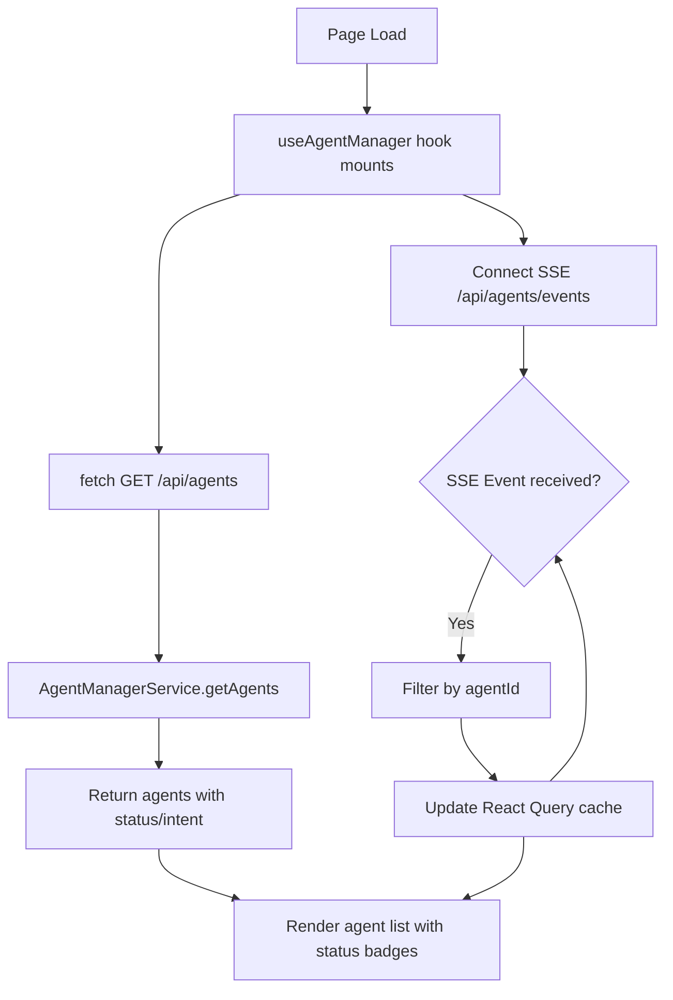
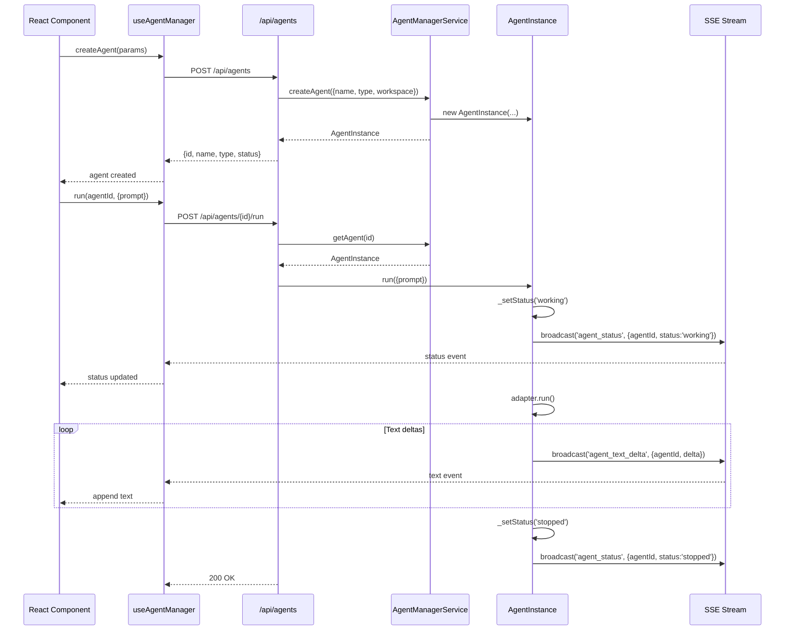
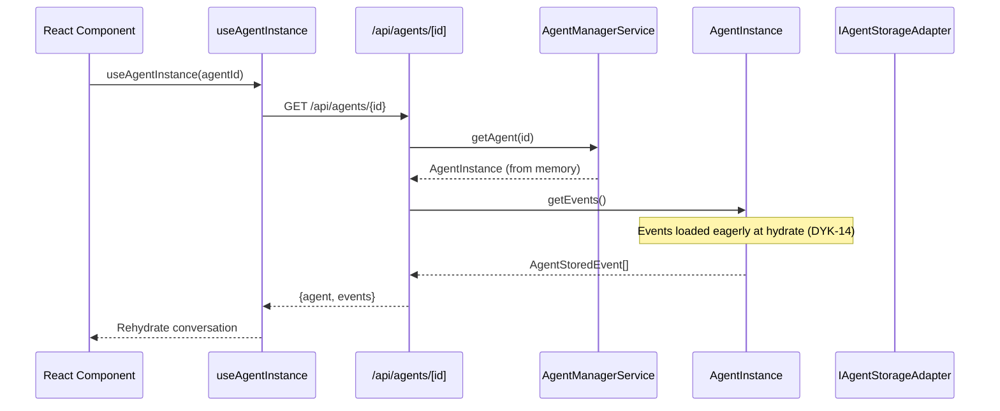

# Phase 4: Web Integration – Tasks & Alignment Brief

**Spec**: [../../agent-manager-refactor-spec.md](../../agent-manager-refactor-spec.md)
**Plan**: [../../agent-manager-refactor-plan.md](../../agent-manager-refactor-plan.md)
**Phase**: 4 of 5
**Date**: 2026-01-29

---

## Executive Briefing

### Purpose

This phase exposes the AgentManagerService to web consumers via API routes and React hooks, enabling the UI to manage agents through the new unified system. It completes the "agents everywhere" vision by making agent state accessible from any component.

### What We're Building

A complete web integration layer:
- **API Routes**: REST endpoints for agent CRUD operations (`GET /api/agents`, `POST /api/agents`, etc.)
- **SSE Route**: Single endpoint (`/api/agents/events`) streaming all agent events per ADR-0007
- **React Hooks**: `useAgentManager` for agent list/SSE, `useAgentInstance` for single agent operations
- **Menu Integration**: Components can show agent status at a glance via SSE subscription

### User Value

Users can:
- See all agents across workspaces in a single view
- Start/monitor agents from any page (not just dedicated agent UI)
- Refresh browser and resume conversations without losing context
- See agent status in navigation menu items at a glance

### Example

**Current (Phases 1-3)**: AgentManagerService exists but no web access
**After (Phase 4)**:
```typescript
// In any React component
const { agents, createAgent } = useAgentManager();
const agent = await createAgent({ name: 'chat', type: 'claude-code', workspace });

// In menu component - shows agent status badges
const { status, intent } = useAgentInstance(agent.id);
// status: 'working' | 'stopped' | 'error'
// intent: 'Exploring codebase' | 'Running tests' | ...
```

---

## Objectives & Scope

### Objective

Integrate AgentManagerService with web API routes and React hooks per plan AC-08, AC-09, AC-24.

**Behavior Checklist**:
- [ ] SSE endpoint streams agent events filtered by agentId (AC-08)
- [ ] React hook subscribes to agent events (AC-09)
- [ ] Menu shows agent status at a glance (AC-24)
- [ ] Web can rehydrate conversation history on page refresh (AC-05)
- [ ] localStorage quota overflow mitigated via server-side storage (R1-06)

### Goals

- ✅ Create API routes for agent CRUD operations (list, get, create, run)
- ✅ Create SSE route at `/api/agents/events` using AgentNotifierService
- ✅ Create `useAgentManager` hook for agent list + SSE subscription
- ✅ Create `useAgentInstance` hook for single agent operations
- ✅ Integration tests verifying end-to-end flow
- ✅ Menu component can display agent status badges

### Non-Goals

- ❌ CLI commands (defer or remove from scope - web-focused phase)
- ❌ Full UI redesign (just integration hooks)
- ❌ Migration of existing agent pages to new system (Phase 5)
- ❌ Authentication/authorization (existing patterns continue)
- ❌ Rate limiting or quotas (not needed for MVP)
- ❌ WebSocket alternative (SSE per ADR-0007)

---

## Architecture Map

### Component Diagram

<!-- Status: grey=pending, orange=in-progress, green=completed, red=blocked -->
<!-- Updated by plan-6 during implementation -->



### Task-to-Component Mapping

<!-- Status: ⬜ Pending | 🟧 In Progress | ✅ Complete | 🔴 Blocked -->

| Task | Component(s) | Files | Status | Comment |
|------|-------------|-------|--------|---------|
| T001 | API Route | apps/web/app/api/agents/route.ts | ✅ Complete | GET handler returns all agents |
| T002 | API Route | apps/web/app/api/agents/[id]/route.ts | ✅ Complete | GET single agent with events |
| T003 | API Route | apps/web/app/api/agents/route.ts | ✅ Complete | POST creates agent via manager |
| T004 | API Route | apps/web/app/api/agents/[id]/run/route.ts | ✅ Complete | POST runs prompt, handles double-run |
| T005 | SSE Route | apps/web/app/api/agents/events/route.ts | ✅ Complete | SSE stream per ADR-0007 |
| T006 | React Hook | apps/web/src/features/019-agent-manager-refactor/useAgentManager.ts | ✅ Complete | Agent list + SSE subscription |
| T007 | React Hook | apps/web/src/features/019-agent-manager-refactor/useAgentInstance.ts | ✅ Complete | Single agent: status, events, run |
| T008 | Tests | test/integration/agent-api.integration.test.ts | ✅ Complete | End-to-end verification |

---

## Tasks

| Status | ID | Task | CS | Type | Dependencies | Path(s) | Validation | Subtasks | Notes |
|--------|-----|------|----|------|--------------|---------|------------|----------|-------|
| [x] | T001 | Create GET /api/agents route returning all agents via AgentManagerService.getAgents() | 2 | Core | – | `apps/web/app/api/agents/route.ts` | Returns JSON array of agents; workspace filter via query param | – | plan-scoped |
| [x] | T002 | Create GET /api/agents/[id] route returning single agent with events via getAgent(), getEvents() | 2 | Core | T001 | `apps/web/app/api/agents/[id]/route.ts` | Returns agent with events array; 404 for unknown | – | plan-scoped |
| [x] | T003 | Create POST /api/agents route creating agent via createAgent() | 2 | Core | T001 | `apps/web/app/api/agents/route.ts` | Returns created agent; validates required fields | – | plan-scoped |
| [x] | T004 | Create POST /api/agents/[id]/run route running prompt via agent.run() | 3 | Core | T002 | `apps/web/app/api/agents/[id]/run/route.ts` | Returns 200 on success; 409 Conflict for double-run; 404 for unknown | – | plan-scoped |
| [x] | T005 | Create GET /api/agents/events SSE route using AgentNotifierService | 3 | Core | – | `apps/web/app/api/agents/events/route.ts` | Returns ReadableStream; events include agentId per ADR-0007; uses sseManager.subscribe | – | plan-scoped, per ADR-0007 |
| [x] | T006 | Create useAgentManager hook with agent list, createAgent, SSE subscription (global 'agents' channel) | 3 | Core | T001, T003, T005 | `apps/web/src/features/019-agent-manager-refactor/useAgentManager.ts` | Hook exports agents, createAgent, isConnected; auto-refreshes on SSE events | – | plan-scoped, DYK-17 |
| [x] | T007 | Create useAgentInstance hook with status, intent, events, run() | 3 | Core | T002, T004, T005 | `apps/web/src/features/019-agent-manager-refactor/useAgentInstance.ts` | Hook exports agent (null if not found), status, intent, events, run(), isWorking; updates via SSE; DYK-19: returns null on 404, caller decides | – | plan-scoped, DYK-17, DYK-19 |
| [x] | T008 | Integration tests: API routes + hooks with FakeAgentManagerService (fast CI) | 3 | Test | T001-T007 | `test/integration/agent-api.integration.test.ts` | Create agent, run prompt, verify SSE events, verify getEvents() | – | test, uses Fakes, DYK-18 |
| [x] | T009 | Deprecate legacy useAgentSSE hook | 1 | Cleanup | – | `apps/web/src/hooks/useAgentSSE.ts` | Add @deprecated JSDoc; update any imports to point to new hooks | – | DYK-17 |
| [x] | T010 | Skipped real E2E test: web routes → real adapter (describe.skip, manual verification) | 3 | Test | T001-T005 | `test/integration/real-agent-web-routes.test.ts` | describe.skip; POST /api/agents → run → verify SSE events with real Claude/Copilot | – | test, skipped, DYK-18 |

---

## Alignment Brief

### Prior Phases Review

#### Phase 1: AgentManagerService + AgentInstance Core (COMPLETE 2026-01-29)

**A. Deliverables Created**:
- `packages/shared/src/features/019-agent-manager-refactor/agent-manager.interface.ts` — IAgentManagerService interface
- `packages/shared/src/features/019-agent-manager-refactor/agent-instance.interface.ts` — IAgentInstance interface
- `packages/shared/src/features/019-agent-manager-refactor/agent-manager.service.ts` — Real implementation with in-memory Map
- `packages/shared/src/features/019-agent-manager-refactor/agent-instance.ts` — Real implementation wrapping IAgentAdapter
- `packages/shared/src/features/019-agent-manager-refactor/fake-agent-manager.service.ts` — Test double
- `packages/shared/src/features/019-agent-manager-refactor/fake-agent-instance.ts` — Test double
- `packages/shared/src/utils/validate-agent-id.ts` — Path traversal prevention
- `test/contracts/agent-manager.contract.ts` — 10 contract tests
- `test/contracts/agent-instance.contract.ts` — 12 contract tests
- `test/integration/agent-instance.integration.test.ts` — 9 integration tests

**B. Lessons Learned**:
- Contract test pattern (Fake+Real parity) eliminates mock complexity
- AdapterFactory injection via DI enables test substitution
- Status guard (`if (status === 'working') throw`) sufficient for double-run prevention

**C. Technical Discoveries**:
- AgentStoredEvent = AgentEvent & { eventId } (intersection type for discriminated unions)
- Agent IDs must be filesystem-safe (validated via validateAgentId)
- 3-state status machine: `stopped → working → {stopped|error}` (no 'question' state)

**D. Dependencies Exported**:
- `IAgentManagerService`: createAgent, getAgents, getAgent, initialize
- `IAgentInstance`: run, terminate, getEvents, setIntent; properties: id, name, type, workspace, status
- `AgentType`: 'claude-code' | 'copilot'
- `AgentInstanceStatus`: 'working' | 'stopped' | 'error'
- `validateAgentId()`, `assertValidAgentId()`, `generateAgentId()`
- `DI_TOKENS.AGENT_MANAGER_SERVICE`

**E. Critical Findings Applied**:
- CF-01 (No central registry) → AgentManagerService with Map<id, instance>
- CF-03 (Path traversal) → validateAgentId() rejects `..`, `/`, `\`
- CF-04 (Race condition) → Status guard before adapter.run()

**F. Incomplete/Blocked Items**: None — all Phase 1 tasks completed successfully.

**G. Test Infrastructure**:
- Contract test pattern: `contractTests('Fake', () => new Fake()); contractTests('Real', () => container.resolve(...))`
- FakeAgentAdapter composed into FakeAgentInstance

**H. Technical Debt**: None recorded.

**I. Architectural Decisions**:
- DYK-01: AdapterFactory injection (not concrete adapter)
- DYK-02: 3-state status machine
- DYK-03: FakeAgentInstance composes FakeAgentAdapter
- DYK-05: Contract tests run against both Fake AND Real

**J. Scope Changes**: None — implemented as specified.

**K. Key Log References**:
- [Phase 1 execution.log.md](../phase-1-agentmanagerservice-agentinstance-core/execution.log.md)

---

#### Phase 2: AgentNotifierService (SSE Broadcast) (COMPLETE 2026-01-29)

**A. Deliverables Created**:
- `packages/shared/src/features/019-agent-manager-refactor/agent-notifier.interface.ts` — IAgentNotifierService interface
- `packages/shared/src/features/019-agent-manager-refactor/sse-broadcaster.interface.ts` — ISSEBroadcaster abstraction
- `packages/shared/src/features/019-agent-manager-refactor/fake-agent-notifier.service.ts` — Test double
- `packages/shared/src/features/019-agent-manager-refactor/fake-sse-broadcaster.ts` — Test double
- `apps/web/src/features/019-agent-manager-refactor/agent-notifier.service.ts` — Real implementation
- `apps/web/src/features/019-agent-manager-refactor/sse-manager-broadcaster.ts` — SSEManager adapter
- `test/contracts/agent-notifier.contract.ts` — 40 contract tests (20 Fake + 20 Real)
- `test/integration/agent-notifier.integration.test.ts` — 8 integration tests

**B. Lessons Learned**:
- ISSEBroadcaster abstraction enabled contract tests against both Fake and Real
- Storage-first helpers (_setStatus, _captureEvent) make correct order self-enforcing
- Notifier as required parameter (not optional) makes API clearer

**C. Technical Discoveries**:
- SSEManager API: `broadcast(channel, eventType, data)`
- All events to single 'agents' channel with agentId for client-side filtering
- Storage-first timing: store event → THEN broadcast

**D. Dependencies Exported**:
- `IAgentNotifierService`: broadcast(eventType, data)
- `ISSEBroadcaster`: broadcast(channel, eventType, data)
- `FakeAgentNotifierService`: getBroadcasts(), getLastBroadcast(), reset()
- `DI_TOKENS.AGENT_NOTIFIER_SERVICE`

**E. Critical Findings Applied**:
- CF-05 (Storage-first, PL-01) → Helper methods enforce persist-then-broadcast
- CF-08 (SSEManager support) → Reused existing broadcast() API

**F. Incomplete/Blocked Items**: None — all Phase 2 tasks completed successfully.

**G. Test Infrastructure**:
- FakeSSEBroadcaster records all broadcasts with timestamps
- FakeAgentNotifierService with getBroadcasts() for inspection

**H. Technical Debt**:
- No SSE reconnection catch-up yet (Phase 3 storage enables sinceId recovery)

**I. Architectural Decisions**:
- DYK-06: Notifier injected via DI into AgentManagerService
- DYK-07: Interface in shared, implementation in web
- DYK-08: ISSEBroadcaster abstraction for testability
- DYK-09: Helper methods for storage-first pattern
- DYK-10: Notifier is required parameter

**J. Scope Changes**: None — implemented as specified.

**K. Key Log References**:
- [Phase 2 execution.log.md](../phase-2-agentnotifierservice-sse-broadcast/execution.log.md)

---

#### Phase 3: Storage Layer (COMPLETE 2026-01-29)

**A. Deliverables Created**:
- `packages/shared/src/features/019-agent-manager-refactor/agent-storage.interface.ts` — IAgentStorageAdapter interface
- `packages/shared/src/features/019-agent-manager-refactor/fake-agent-storage.adapter.ts` — FakeAgentStorageAdapter
- `packages/shared/src/features/019-agent-manager-refactor/agent-storage.adapter.ts` — Real AgentStorageAdapter
- `test/contracts/agent-storage.contract.ts` — 14 contract tests
- `test/contracts/agent-storage.contract.test.ts` — Contract test runner
- `test/integration/agent-persistence.integration.test.ts` — 9 persistence integration tests

**B. Lessons Learned**:
- Atomic writes (temp file + rename) prevent corrupted JSON/NDJSON
- Storage as optional parameter maintains backwards compatibility
- hydrate() static factory keeps Manager clean; Instance owns restore logic

**C. Technical Discoveries**:
- Storage location: `~/.config/chainglass/agents/`
- Registry format: `registry.json` with `{"agents": {"id": {"workspace": "/path"}}}`
- Events format: `events.ndjson` with append-only NDJSON
- Fire-and-forget persistence maintains sync API

**D. Dependencies Exported**:
- `IAgentStorageAdapter`: registerAgent, unregisterAgent, listAgents, saveInstance, loadInstance, appendEvent, getEvents, getEventsSince
- `FakeAgentStorageAdapter`: setAgents(), setInstance(), setEvents(), etc.
- `AgentStorageAdapter`: Real filesystem implementation
- `DI_TOKENS.AGENT_STORAGE_ADAPTER`

**E. Critical Findings Applied**:
- CF-03 (Path traversal) → All storage ops validate via assertValidAgentId()
- CF-05 (Storage-first) → persist BEFORE broadcast
- R1-03 (Event ID ordering) → Timestamp-based IDs

**F. Incomplete/Blocked Items**: None — all Phase 3 tasks completed successfully.

**G. Test Infrastructure**:
- Contract tests run against both Fake and Real storage adapters
- Real storage tests use temp directory cleanup

**H. Technical Debt**:
- Fire-and-forget persistence in tests requires pre-population of storage

**I. Architectural Decisions**:
- DYK-11: Real storage adapter in packages/shared for contract test parity
- DYK-12: Storage is optional; no storage = in-memory only
- DYK-13: AgentInstance.hydrate() for restoration
- DYK-14: Eager load events at hydrate (sync getEvents API)
- DYK-15: Always rehydrate working agents as 'stopped'

**J. Scope Changes**: None — implemented as specified.

**K. Key Log References**:
- [Phase 3 execution.log.md](../phase-3-storage-layer/execution.log.md)

---

### Cumulative Foundation for Phase 4

**All Components Available**:
| Component | Source | Used By |
|-----------|--------|---------|
| IAgentManagerService | Phase 1 | API routes (T001-T004) |
| AgentManagerService | Phase 1 | DI container |
| IAgentInstance | Phase 1 | API routes (T002, T004) |
| IAgentNotifierService | Phase 2 | SSE route (T005) |
| AgentNotifierService | Phase 2 | DI container |
| IAgentStorageAdapter | Phase 3 | Manager initialization |
| SSEManagerBroadcaster | Phase 2 | SSE route (T005) |

**DI Container Ready**:
- `DI_TOKENS.AGENT_MANAGER_SERVICE` → AgentManagerService
- `DI_TOKENS.AGENT_NOTIFIER_SERVICE` → AgentNotifierService
- `DI_TOKENS.AGENT_STORAGE_ADAPTER` → AgentStorageAdapter

**Pattern Consistency**:
- Fakes for all interfaces (use in hook tests)
- Contract tests verify Fake/Real parity
- Storage-first: persist → broadcast

---

### Critical Findings Affecting This Phase

| Finding | What It Constrains | Tasks Addressing |
|---------|-------------------|------------------|
| ADR-0007 (Single SSE channel) | All events to 'agents' channel with agentId | T005, T006, T007 |
| R1-06 (localStorage quota) | Server-side storage primary (not localStorage) | T006, T007 |
| CF-04 (Double-run race) | Run route must return 409 Conflict | T004 |
| PL-01 (Storage-first) | SSE is hint, storage is truth | T005, T006 |

### ADR Decision Constraints

- **ADR-0007**: Single SSE channel with client-side routing
  - Decision: One SSE connection to `/api/agents/events` for all agents
  - Constraint: Every event includes agentId for client-side filtering
  - Addressed by: T005 (SSE route), T006/T007 (hooks filter by agentId)

- **ADR-0004**: DI container architecture
  - Decision: Use `useFactory` pattern, no decorators
  - Constraint: Route handlers resolve services via container.resolve()
  - Addressed by: T001-T005 (API routes use DI)

### PlanPak Placement Rules

Per `File Management: PlanPak` in plan:
- **Plan-scoped files** → `apps/web/src/features/019-agent-manager-refactor/` (hooks)
- **API routes** → `apps/web/app/api/agents/` (Next.js convention)
- **Test files** → `test/integration/` (per project convention)
- **Dependency direction**: features → shared (allowed)

### Invariants & Guardrails

- **SSE Pattern**: Single channel, agentId in payload, client filters
- **Storage Truth**: getEvents() from storage on page load; SSE for live updates
- **Double-Run Guard**: API returns 409 Conflict if agent status is 'working'
- **No localStorage**: All agent state server-side (React Query cache only)
- **Lazy Init (DYK-16)**: API routes call `ensureInitialized()` before operations; simple flag guard, no mutex
- **New Hooks Only (DYK-17)**: Create new useAgentManager/useAgentInstance hooks; deprecate legacy useAgentSSE immediately
- **Test Strategy (DYK-18)**: T008 uses Fakes (fast CI); T010 is skipped real E2E for manual debugging when agents misbehave
- **Hook Returns Null (DYK-19)**: useAgentInstance returns `{ agent: null }` on 404; caller decides whether to create, redirect, or show empty state

### Inputs to Read

| File | Purpose |
|------|---------|
| `packages/shared/src/features/019-agent-manager-refactor/agent-manager.interface.ts` | IAgentManagerService API |
| `packages/shared/src/features/019-agent-manager-refactor/agent-instance.interface.ts` | IAgentInstance API |
| `packages/shared/src/features/019-agent-manager-refactor/agent-notifier.interface.ts` | IAgentNotifierService API |
| `apps/web/src/lib/di-container.ts` | DI registration patterns |
| `apps/web/src/hooks/useAgentSSE.ts` | Existing SSE hook (reference) |
| `apps/web/app/api/events/[channel]/route.ts` | Existing SSE route pattern |

### Visual Alignment Aids

#### Flow Diagram: Agent Page Load with Rehydration



#### Sequence Diagram: Create and Run Agent



#### Sequence Diagram: Page Refresh with Event Rehydration



### Test Plan

**Testing Approach**: TDD with integration tests verifying end-to-end flow. Use Fakes for unit tests of hooks.

| Test | Type | File | Purpose | Fixtures | Expected Output |
|------|------|------|---------|----------|-----------------|
| GET /api/agents returns all agents | Integration | agent-api.integration.test.ts | AC-02 | FakeAgentManagerService | JSON array with agents |
| GET /api/agents?workspace=X filters | Integration | agent-api.integration.test.ts | AC-04 | FakeAgentManagerService | Only agents in workspace |
| GET /api/agents/[id] returns agent with events | Integration | agent-api.integration.test.ts | AC-11 | FakeAgentManagerService | Agent + events array |
| GET /api/agents/[id] returns 404 for unknown | Integration | agent-api.integration.test.ts | Error handling | FakeAgentManagerService | 404 response |
| POST /api/agents creates agent | Integration | agent-api.integration.test.ts | AC-01 | FakeAgentManagerService | Created agent with id |
| POST /api/agents/[id]/run executes prompt | Integration | agent-api.integration.test.ts | AC-06 | FakeAgentManagerService | 200 OK |
| POST /api/agents/[id]/run returns 409 if working | Integration | agent-api.integration.test.ts | AC-07a | FakeAgentManagerService | 409 Conflict |
| SSE streams agent events | Integration | agent-api.integration.test.ts | AC-08 | FakeAgentNotifierService | Events with agentId |
| useAgentManager fetches agents on mount | Unit | useAgentManager.test.ts | Hook behavior | Mocked fetch | agents array |
| useAgentManager updates on SSE events | Unit | useAgentManager.test.ts | AC-09 | FakeEventSource | Cache updated |
| useAgentInstance returns agent with events | Unit | useAgentInstance.test.ts | AC-11 | Mocked fetch | Agent + events |
| useAgentInstance.run() calls API | Unit | useAgentInstance.test.ts | AC-06 | Mocked fetch | API called |

### Step-by-Step Implementation Outline

1. **T001**: Create `apps/web/app/api/agents/route.ts` with GET handler using DI container
2. **T002**: Create `apps/web/app/api/agents/[id]/route.ts` with GET handler
3. **T003**: Add POST handler to route.ts for createAgent
4. **T004**: Create `apps/web/app/api/agents/[id]/run/route.ts` with double-run guard
5. **T005**: Create `apps/web/app/api/agents/events/route.ts` using sseManager.subscribe('agents')
6. **T006**: Create useAgentManager hook using React Query + existing useAgentSSE
7. **T007**: Create useAgentInstance hook for single agent operations
8. **T008**: Write integration tests verifying end-to-end flow

### Commands to Run

```bash
# Verify baseline before starting
just fft

# Run specific integration tests during development
pnpm vitest test/integration/agent-api.integration.test.ts

# Run unit tests for hooks
pnpm vitest test/unit/web/features/019-agent-manager-refactor/

# Type check
just typecheck

# Full quality check before commit
just check
```

### Risks & Unknowns

| Risk | Severity | Mitigation |
|------|----------|------------|
| SSE connection lifecycle in Next.js | Medium | Follow existing /api/events pattern |
| React Query cache invalidation timing | Low | SSE events trigger queryClient.invalidateQueries |
| Hook testing with SSE | Medium | Use FakeEventSource from existing tests |
| API route params are Promises in Next.js 16 | Low | Await params per Next.js 16 pattern |

### Ready Check

- [ ] Prior phases reviewed (Phase 1 + Phase 2 + Phase 3 deliverables understood)
- [ ] Critical findings mapped to tasks (ADR-0007→T005/T006/T007, R1-06→T006/T007)
- [ ] ADR constraints mapped to tasks (IDs noted in Notes column)
- [ ] PlanPak placement rules applied (all tasks have classification tags in Notes)
- [ ] Test plan covers all ACs (AC-08, AC-09, AC-24, AC-05, R1-06)
- [ ] Sequence diagrams reviewed for SSE flow
- [ ] Baseline verified with `just fft`

---

## Phase Footnote Stubs

<!-- Populated by plan-6 during implementation -->

| Footnote | Task | Description |
|----------|------|-------------|
| | | |

---

## Evidence Artifacts

**Execution Log**: `./execution.log.md` (created by plan-6 during implementation)

**Supporting Files**:
- Integration test results
- SSE event examples
- Hook usage examples

---

## Discoveries & Learnings

_Populated during implementation by plan-6. Log anything of interest to your future self._

| Date | Task | Type | Discovery | Resolution | References |
|------|------|------|-----------|------------|------------|
| | | | | | |

**Types**: `gotcha` | `research-needed` | `unexpected-behavior` | `workaround` | `decision` | `debt` | `insight`

**What to log**:
- Things that didn't work as expected
- External research that was required
- Implementation troubles and how they were resolved
- Gotchas and edge cases discovered
- Decisions made during implementation
- Technical debt introduced (and why)
- Insights that future phases should know about

_See also: `execution.log.md` for detailed narrative._

---

## Critical Insights Discussion

**Session**: 2026-01-29 ~08:35-09:00 UTC
**Context**: Phase 4: Web Integration - Tasks & Alignment Brief
**Analyst**: AI Clarity Agent
**Reviewer**: Development Team
**Format**: Water Cooler Conversation (5 Critical Insights)

### Insight 1: Initialize() Call Missing from API Route Lifecycle

**Did you know**: Every API route must call `agentManager.initialize()` before operations, but Phase 3 didn't specify when/where this happens in web context.

**Implications**:
- First request after server start could return empty/stale data
- No obvious "server startup" hook in Next.js API routes
- Concurrent requests could cause duplicate initialization

**Options Considered**:
- Option A: Lazy Init with Simple Flag - `ensureInitialized()` with flag guard
- Option B: Module-Level Singleton - Eager init at import time
- Option C: Explicit Init Route - `/api/agents/init` called on app mount
- Option D: Init in DI Container Factory - Async bootstrap complexity

**AI Recommendation**: Option A - Lazy Init with Simple Flag
- Reasoning: Matches Phase 1-3 pattern of simple guards; JS event loop handles atomicity

**Discussion Summary**: User confirmed Option A aligns with established patterns from prior phases. Simple flag guard, no mutex needed.

**Decision**: Add `ensureInitialized()` method with simple flag guard; API routes call it before operations

**Action Items**: None — implementation detail for T001-T004

**Affects**: T001-T004, Invariants & Guardrails (DYK-16 added)

---

### Insight 2: Existing useAgentSSE Hook Doesn't Match ADR-0007 Pattern

**Did you know**: Current `useAgentSSE` connects to per-session channels (`/api/events/${channel}`), but ADR-0007 mandates single global channel at `/api/agents/events`.

**Implications**:
- Can't "just use" existing hook as-is
- Callback signatures already support sessionId routing ✓
- Connection URL and channel handling need changes
- Either modify useAgentSSE or create new hook

**Options Considered**:
- Option A: Modify Existing Hook - Add global flag or detect 'agents' channel
- Option B: Create New Hook - useAgentManager uses new pattern, deprecate old
- Option C: Refactor to Always Use Global - Breaking change to old pages

**AI Recommendation**: Option B - Create New Hook
- Reasoning: Clean slate for Plan 019; no risk to existing code; clear intent

**Discussion Summary**: User chose Option B but wanted immediate deprecation of old hook (don't leave legacy code). Added T009 for deprecation task.

**Decision**: Create new hooks for Plan 019; deprecate legacy useAgentSSE immediately with @deprecated JSDoc

**Action Items**: T009 added for deprecation

**Affects**: T006, T007, T009 added, Invariants & Guardrails (DYK-17 added)

---

### Insight 3: Test Strategy - Fakes vs Real Integration

**Did you know**: T008's integration tests were marked to use FakeAgentManagerService, but true end-to-end needs real service to prove the full stack works.

**Implications**:
- Fake tests verify API route wiring, not actual agent behavior
- Existing skipped tests (real-agent-multi-turn.test.ts) prove real adapters work
- Contract test parity gives confidence in Fake/Real equivalence

**Options Considered**:
- Option A: Fakes Only - Rely on contract test parity + manual real tests
- Option B: Add Skipped Real E2E Test - describe.skip for web routes → real adapter

**AI Recommendation**: Option B - Add Skipped Real E2E Test
- Reasoning: Full-stack verification path exists; manually runnable when debugging

**Discussion Summary**: User strongly agreed — agent system has been troublesome, need eyes-on debugging capability. The more headless testing paths available, the better.

**Decision**: T008 uses Fakes (fast CI); add T010 as skipped real E2E test for manual verification

**Action Items**: T010 added

**Affects**: T008 clarified, T010 added, Invariants & Guardrails (DYK-18 added)

---

### Insight 4: useAgentInstance Must Handle "Agent Not Found" State

**Did you know**: When component calls `useAgentInstance(id)` but agent doesn't exist, hook must handle gracefully — but no pattern specified for "create-on-demand" vs "error if missing".

**Implications**:
- Different use cases need different behavior (chat page vs menu badge)
- Hook could return null, auto-create, or throw
- Creation already handled by useAgentManager().createAgent()

**Options Considered**:
- Option A: Return Null When Not Found - Caller decides response
- Option B: Separate Hooks - useAgentInstance vs useOrCreateAgentInstance
- Option C: createIfMissing Option - Single hook with optional params

**AI Recommendation**: Option A - Return Null
- Reasoning: Simplest; single responsibility; caller knows their use case

**Discussion Summary**: User agreed — return null, leave "what to do about it" out of scope for this phase.

**Decision**: useAgentInstance returns `{ agent: null }` on 404; caller decides whether to create, redirect, or show empty state

**Action Items**: None — T007 validation updated

**Affects**: T007, Invariants & Guardrails (DYK-19 added)

---

### Insight 5: Task Ordering for Implementation

**Did you know**: 10 tasks with dependencies but no explicit sequence — some can parallelize, others are strictly sequential.

**Implications**:
- T005 (SSE) is blocker for both hooks
- T001+T003 can be done together (same file)
- T002+T004 can be done together (same file)
- T009 is independent

**Options Considered**:
- Acknowledged — not a decision point, just clarification for plan-6

**AI Recommendation**: Implementation order: T005 → T001+T003 → T002+T004 → T006 → T007 → T008 → T009 → T010

**Discussion Summary**: User acknowledged the ordering as sensible.

**Decision**: Plan-6 follows dependency-based order (SSE first, then routes, then hooks, then tests)

**Action Items**: None

**Affects**: Step-by-Step Implementation Outline (already aligned)

---

## Session Summary

**Insights Surfaced**: 5 critical insights identified and discussed
**Decisions Made**: 5 decisions reached through collaborative discussion
**Action Items Created**: 2 tasks added (T009, T010)
**Areas Updated**:
- Task table: T009, T010 added; T007, T008 clarified
- Invariants & Guardrails: DYK-16 through DYK-19 added

**Shared Understanding Achieved**: ✓

**Confidence Level**: High — All architectural decisions made; patterns consistent with Phase 1-3

**Next Steps**:
1. Verify baseline with `just fft`
2. Proceed to implementation with `/plan-6-implement-phase`

**Notes**:
- DYK-16: Lazy init with simple flag guard
- DYK-17: New hooks only; deprecate legacy useAgentSSE
- DYK-18: T008 uses Fakes; T010 is skipped real E2E
- DYK-19: useAgentInstance returns null on 404

---

## Directory Layout

```
docs/plans/019-agent-manager-refactor/
├── agent-manager-refactor-spec.md
├── agent-manager-refactor-plan.md
└── tasks/
    ├── phase-1-agentmanagerservice-agentinstance-core/
    │   ├── tasks.md
    │   └── execution.log.md
    ├── phase-2-agentnotifierservice-sse-broadcast/
    │   ├── tasks.md
    │   └── execution.log.md
    ├── phase-3-storage-layer/
    │   ├── tasks.md
    │   └── execution.log.md
    └── phase-4-web-integration/
        ├── tasks.md              # This file
        └── execution.log.md      # Created by plan-6
```
