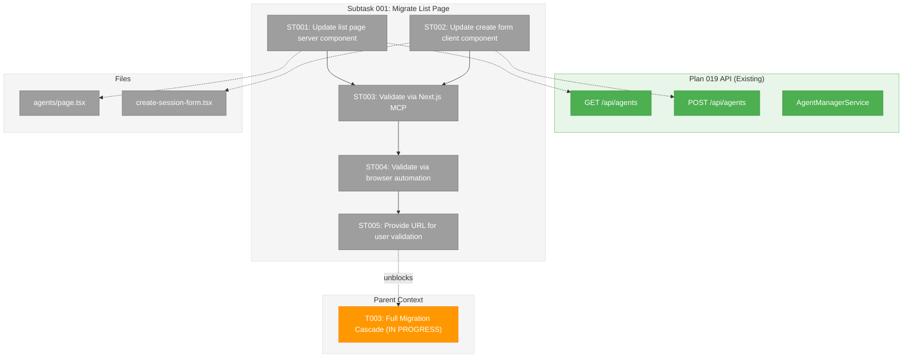
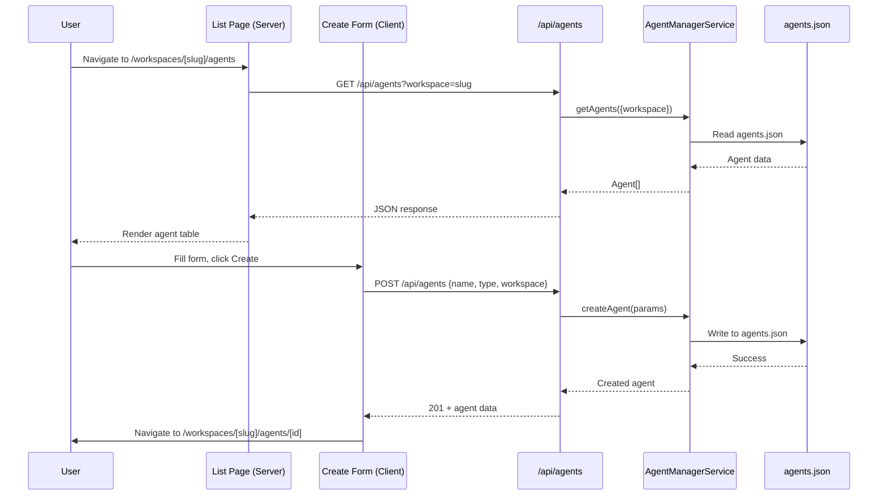

# Subtask 001: Migrate Agents List Page to Plan 019

**Parent Plan:** [View Plan](../../agent-manager-refactor-plan.md)
**Parent Phase:** Phase 5: Consolidation & Cleanup
**Parent Task(s):** [T003: Full Migration Cascade](../tasks.md#task-t003)
**Plan Task Reference:** [Task 5.3 in Plan](../../agent-manager-refactor-plan.md#phase-5-consolidation--cleanup)

**Why This Subtask:**
Phase 5 migrated AgentChatView but the list page (`/workspaces/[slug]/agents/page.tsx`) still uses Plan 018's `IAgentSessionService`. The create form POSTs to a deleted route. Users cannot create or list agents through the UI. This subtask completes the migration and validates end-to-end with Next.js MCP.

**Created:** 2026-01-29
**Requested By:** User

---

## Executive Briefing

### Purpose

This subtask migrates the agents list page and create session form to use Plan 019's `AgentManagerService` backend, enabling users to create and view agents through the new unified system. The migration will be validated via browser automation and Next.js MCP to ensure the system works end-to-end.

### What We're Building

- **Updated list page** that fetches agents from `GET /api/agents` (Plan 019)
- **Updated create form** that posts to `POST /api/agents` (Plan 019)
- **Validation** via Next.js MCP + browser automation demonstrating:
  - List page loads without errors
  - Create agent works and persists to `~/.config/chainglass/agents/agents.json`
  - New agent appears in list and is clickable to chat view

### Unblocks

- Full agent UI workflow: users can finally create → list → chat with agents
- End-to-end validation of Plan 019 architecture

### Example

**Before (Broken):**
```
List page → IAgentSessionService → .chainglass/data/sessions.json (workspace-scoped)
Create form → POST /api/workspaces/[slug]/agents → 404 (route deleted!)
```

**After (Working):**
```
List page → GET /api/agents → AgentManagerService → ~/.config/chainglass/agents/agents.json
Create form → POST /api/agents → AgentManagerService → creates agent, returns to list
Click agent → /workspaces/[slug]/agents/[id] → AgentChatView with useAgentInstance
```

---

## Objectives & Scope

### Objective

Migrate the agents list page and create form to Plan 019's backend, then validate end-to-end via browser automation and Next.js MCP to confirm agents can be created, listed, and chatted with.

### Goals

- ✅ Update list page to fetch from `GET /api/agents`
- ✅ Update create form to post to `POST /api/agents`
- ✅ Filter agents by workspace (optional query param)
- ✅ Validate via Next.js MCP - no errors on page load
- ✅ Validate via browser automation - create agent flow
- ✅ Provide working URL for user validation

### Non-Goals

- ❌ Redesigning the list page UI (just backend swap)
- ❌ Adding new features (filtering, sorting, etc.)
- ❌ Migrating other pages (just list + create)
- ❌ Comprehensive test coverage (manual validation is primary)

---

## Architecture Map

### Component Diagram

<!-- Status: grey=pending, orange=in-progress, green=completed, red=blocked -->
<!-- Updated by plan-6 during implementation -->



### Task-to-Component Mapping

<!-- Status: ⬜ Pending | 🟧 In Progress | ✅ Complete | 🔴 Blocked -->

| Task | Component(s) | Files | Status | Comment |
|------|-------------|-------|--------|---------|
| ST001 | List Page | /apps/web/app/(dashboard)/workspaces/[slug]/agents/page.tsx | ⬜ Pending | Replace IAgentSessionService with GET /api/agents |
| ST002 | Create Form | /apps/web/src/components/agents/create-session-form.tsx | ⬜ Pending | Replace old POST route with /api/agents |
| ST003 | Validation | N/A | ⬜ Pending | Use nextjs_call get_errors to verify no errors |
| ST004 | Validation | N/A | ⬜ Pending | Browser automation to test create flow |
| ST005 | Delivery | N/A | ⬜ Pending | Document working URL for user to test |

---

## Tasks

| Status | ID | Task | CS | Type | Dependencies | Absolute Path(s) | Validation | Subtasks | Notes |
|--------|------|------|----|----- |--------------|------------------|------------|----------|-------|
| [ ] | ST001 | Update agents list page: replace IAgentSessionService with AgentManagerService via DI (matching chat page pattern), map agents to table | 2 | Core | – | /home/jak/substrate/015-better-agents/apps/web/app/(dashboard)/workspaces/[slug]/agents/page.tsx | Page renders agent list from Plan 019 backend | – | Server component, uses DI directly per DYK-06 |
| [ ] | ST002 | Update create-session-form: POST to /api/agents with name, type, workspace; navigate to new agent on success | 2 | Core | – | /home/jak/substrate/015-better-agents/apps/web/src/components/agents/create-session-form.tsx | Form creates agent, navigates to chat view | – | Client component, uses fetch |
| [ ] | ST003 | Validate via Next.js MCP: navigate to list page, call get_errors, confirm no runtime/build errors | 1 | Verify | ST001, ST002 | N/A | nextjs_call get_errors returns no errors | – | Use port 3001 |
| [ ] | ST004 | Validate via browser automation: navigate to list, create agent, verify agent appears, click to chat | 2 | Verify | ST003 | N/A | Agent creation flow works end-to-end; agents.json populated | – | Use browser_eval |
| [ ] | ST005 | Document working URL and provide to user for manual validation | 1 | Deliver | ST004 | N/A | User confirms they can create and chat with agent | – | Final deliverable |

---

## Alignment Brief

### Objective Recap

Complete the Phase 5 migration by updating the agents list page and create form to use Plan 019's backend (`AgentManagerService` via `/api/agents` routes). Validate end-to-end using Next.js MCP and browser automation before handing off to user for final confirmation.

### Checklist

- [ ] List page fetches from `GET /api/agents` instead of `IAgentSessionService.listSessions()`
- [ ] Create form posts to `POST /api/agents` instead of deleted `/api/workspaces/[slug]/agents`
- [ ] Agent creation persists to `~/.config/chainglass/agents/agents.json`
- [ ] Clicking an agent in list navigates to `/workspaces/[slug]/agents/[id]` (existing chat page)
- [ ] Next.js MCP shows no errors on page load
- [ ] Browser automation confirms end-to-end flow works

### Critical Findings Affecting This Subtask

1. **CF-06 (Plan 019 API exists)**: Routes at `/api/agents` (GET, POST) and `/api/agents/[id]` (GET, DELETE) are implemented and working
2. **CF-07 (AgentManagerService implemented)**: Full CRUD operations available via DI container
3. **DYK-01 (Full refactor)**: No legacy code survives - complete migration required

### DYK-06: Server DI for reads, API routes for mutations

**Decision**: The list page server component uses `AgentManagerService` via DI directly (matching the chat page pattern at `[id]/page.tsx`). Client components (create form, delete button) use `fetch('/api/agents/...')` for mutations. No self-HTTP fetch from server components. Static render only — no real-time status updates in scope.

### DYK-07: Drop worktree requirement — agents are global

**Decision**: Remove the `?worktree=` redirect guard, `IWorkspaceService` dependency, and worktree info display. Plan 019 agents are global entities (`~/.config/chainglass/agents/agents.json`), not worktree-scoped. The `workspace` field on agents is just metadata, not a scoping mechanism. Matches chat page pattern which has no worktree concept. Simplify breadcrumb to: Workspaces / slug / Agents.

### Invariants/Guardrails

- Do NOT modify `AgentManagerService` or API routes (already working)
- Do NOT change chat page (`[id]/page.tsx`) - already migrated
- Keep workspace filter behavior (agents can be filtered by workspace query param)
- Preserve existing UI layout and styling (just backend swap)

### Inputs to Read

| File | Purpose |
|------|---------|
| `/apps/web/app/api/agents/route.ts` | Understand GET/POST response shapes |
| `/apps/web/app/(dashboard)/workspaces/[slug]/agents/page.tsx` | Current list page to modify |
| `/apps/web/src/components/agents/create-session-form.tsx` | Current create form to modify |

### Visual Aid: Data Flow



### Test Plan

**Approach**: Manual validation via Next.js MCP + browser automation (per user request)

**Dev Server**: Port **3001** (confirmed running, Next.js MCP available)

#### Pre-Implementation Baseline (2026-01-29)

Captured via browser automation before any code changes:
- Page renders at `http://localhost:3001/workspaces/chainglass-main/agents?worktree=/home/jak/substrate/015-better-agents`
- Shows 1 old Plan 018 session (`1769592216400-5c2cd070`, Claude Code, "active")
- "Create Session" button returns **"Failed to create session: 404"** (old route deleted)
- Delete button also targets non-existent route (will 404)
- `nextjs_call get_errors` → "No errors detected" (page renders, but form is broken)
- Screenshot saved: `/tmp/playwright-mcp-output/1769685606212/page-2026-01-29T11-20-17-030Z.png`

#### Validation Workflow (use during and after implementation)

**Next.js MCP tools** (use these to check for build/runtime errors without leaving the agent):
```
# 1. Discover dev server
nextjs_index --port 3001

# 2. Check for errors after code changes (Fast Refresh applies automatically)
nextjs_call --port 3001 --toolName get_errors

# 3. Get page metadata for the current browser page
nextjs_call --port 3001 --toolName get_page_metadata

# 4. List all routes (verify no stale routes)
nextjs_call --port 3001 --toolName get_routes
```

**Browser automation** (use to visually verify and interact with pages):
```
# 1. Start browser
browser_eval action=start browser=chrome headless=true

# 2. Navigate to list page
browser_eval action=navigate url=http://localhost:3001/workspaces/chainglass-main/agents?worktree=/home/jak/substrate/015-better-agents

# 3. Take screenshot to verify visual state
browser_eval action=screenshot fullPage=true

# 4. Check console for errors
browser_eval action=console_messages

# 5. Interact: fill form, click buttons, verify results
browser_eval action=fill_form fields=[{selector: "#session-name", value: "Test Agent"}]
browser_eval action=click element="Create Session"

# 6. Verify storage after create
cat ~/.config/chainglass/agents/agents.json
```

**Stale browser lock note**: If `browser_eval navigate` returns "Browser is already in use", run:
```bash
rm -f ~/.cache/ms-playwright/mcp-chrome/SingletonLock
```
Then `browser_eval action=close` + `browser_eval action=start`.

#### ST003 Validation Checklist
- [ ] Navigate to list page via `browser_eval`
- [ ] `nextjs_call get_errors` → "No errors detected"
- [ ] `browser_eval console_messages` → No JS errors (ignore favicon 404)
- [ ] Page renders agents from Plan 019 backend (not old sessions)

#### ST004 Validation Checklist
- [ ] Fill create form with name "Test Agent 1", type "Claude Code"
- [ ] Click "Create" button
- [ ] Verify: No error displayed in form
- [ ] Verify: `cat ~/.config/chainglass/agents/agents.json` shows new agent
- [ ] Verify: New agent appears in list (via screenshot or DOM snapshot)
- [ ] Click new agent row → navigates to `/workspaces/[slug]/agents/[agentId]`
- [ ] Chat page renders with `AgentChatView`
- [ ] Delete button works: click trash → confirm → agent removed from list

### Implementation Outline

1. **ST001**: Replace `IAgentSessionService` with `IAgentManagerService` in list page (server-side DI, matching chat page pattern at `[id]/page.tsx:37-52`). Use `agentManager.getAgents()` instead of `sessionService.listSessions()`. Update table columns: old status values (`active/completed/terminated`) → new (`working/stopped/error`). Update session links to use `agent.id` (UUID) instead of old timestamp IDs. **Run `nextjs_call get_errors` after save to verify Fast Refresh succeeds.**

2. **ST002**: Update create form POST URL from `/api/workspaces/${slug}/agents` to `/api/agents`. Add `workspace` field to body (worktreePath or slug). On success response (201), navigate to `/workspaces/${slug}/agents/${agent.id}`. Change auto-name from "Session N" to "Agent N". **Verify via `browser_eval`: fill form, click create, check no error.**

3. **ST002b**: Update `SessionDeleteButton` URL from `/api/workspaces/${slug}/agents/${sessionId}` to `/api/agents/${agentId}`. Rename prop `sessionId` → `agentId`. **Verify via browser automation: delete an agent, check it disappears.**

4. **ST003**: Use Next.js MCP tools per checklist above

5. **ST004**: Browser automation end-to-end per checklist above

6. **ST005**: Provide URL `http://localhost:3001/workspaces/chainglass-main/agents?worktree=/home/jak/substrate/015-better-agents` for user validation

### Commands to Run

```bash
# Check dev server running (port 3001)
# Use: nextjs_index --port 3001

# Check for errors after code changes
# Use: nextjs_call --port 3001 --toolName get_errors

# Verify agent storage
cat ~/.config/chainglass/agents/agents.json

# Quality gates (run before declaring done)
just fft
```

### Risks & Mitigations

| Risk | Impact | Mitigation |
|------|--------|------------|
| API response shape mismatch | List page crashes | Check /api/agents response shape first |
| Workspace filter not working | Empty list | Test with and without ?workspace param |
| Navigation after create fails | User stuck | Verify agent ID format matches URL expectation |

### Ready Check

- [x] Plan 019 `/api/agents` routes exist and work (confirmed via `nextjs_call get_routes`)
- [x] Dev server running on port 3001 (confirmed via `nextjs_index`)
- [x] Chat page (`[id]/page.tsx`) already migrated to Plan 019 (uses `SHARED_DI_TOKENS.AGENT_MANAGER_SERVICE`)
- [x] AgentManagerService registered in DI container
- [x] Next.js MCP available: `get_errors`, `get_routes`, `get_page_metadata`, `get_logs`, `get_routes`
- [x] Browser automation available (Playwright MCP, chrome headless)
- [x] Baseline captured: page renders, create form 404s, 1 old session displayed
- [x] **Ready for implementation**

---

## Phase Footnote Stubs

_Plan-6 will add footnote entries here after implementation._

| Footnote | Task | Change | FlowSpace Node |
|----------|------|--------|----------------|
| | | | |

---

## Evidence Artifacts

- **Execution Log**: `001-subtask-migrate-agents-list-page.execution.log.md`
- **Screenshots**: (if browser automation captures any)
- **Test Output**: Next.js MCP `get_errors` output

---

## Critical Insights Discussion

**Session**: 2026-01-29
**Context**: Subtask 001 — Migrate Agents List Page to Plan 019
**Analyst**: AI Clarity Agent
**Reviewer**: Development Team
**Format**: Water Cooler Conversation (5 Critical Insights)

### Insight 1: Server-Side DI vs Client-Side Fetch

**Did you know**: The list page should use DI directly (like the chat page) rather than fetching its own API route — server-to-self HTTP is an anti-pattern.

**Decision**: Option C — Server DI for reads, API routes for client mutations only. Static render, no real-time updates. Recorded as DYK-06.

### Insight 2: Worktree Requirement No Longer Applies

**Did you know**: The current page requires `?worktree=` and redirects without it, but Plan 019 agents are global entities not scoped to worktrees.

**Decision**: Option A — Drop worktree entirely. Remove redirect guard, IWorkspaceService dependency, worktree info display. Agents are global (`~/.config/chainglass/agents/agents.json`), workspace is just metadata. Recorded as DYK-07.

### Insight 3: Workspace Value for Create Form

**Did you know**: `POST /api/agents` requires a `workspace` field, and the URL slug is the natural source.

**Decision**: Use the URL `[slug]` param as the workspace value. The page lives under `/workspaces/[slug]/agents` so the slug is always available. No agents without a workspace context.

### Insight 4: Session Naming in Delete Components

**Did you know**: `SessionDeleteButton` and `DeleteSessionDialog` use "session" naming throughout (props, text, filenames).

**Decision**: Option A — Rename props and dialog text only (`sessionId` → `agentId`, "session" → "agent" in UI text). Leave filenames unchanged for this subtask. File renaming is broader Phase 5 cleanup.

### Insight 5: Date Handling — Non-Issue

**Did you know**: `agent.createdAt` from DI is a real `Date` object, so `toLocaleString()` works the same as before. No conversion needed since we're using DI directly (not API JSON with ISO strings).

**Decision**: No action needed. Existing pattern carries over.

---

## Discoveries & Learnings

_Populated during implementation by plan-6. Log anything of interest to your future self._

| Date | Task | Type | Discovery | Resolution | References |
|------|------|------|-----------|------------|------------|
| | | | | | |

**Types**: `gotcha` | `research-needed` | `unexpected-behavior` | `workaround` | `decision` | `debt` | `insight`

**What to log**:
- Things that didn't work as expected
- External research that was required
- Implementation troubles and how they were resolved
- Gotchas and edge cases discovered
- Decisions made during implementation
- Technical debt introduced (and why)
- Insights that future phases should know about

_See also: `execution.log.md` for detailed narrative._

---

## After Subtask Completion

**This subtask resolves a blocker for:**
- Parent Task: [T003: Full Migration Cascade](../tasks.md#task-t003)
- Plan Task: [Task 5.3 in Plan](../../agent-manager-refactor-plan.md#phase-5-consolidation--cleanup)

**When all ST### tasks complete:**

1. **Record completion** in parent execution log:
   ```
   ### Subtask 001-subtask-migrate-agents-list-page Complete

   Resolved: List page and create form now use Plan 019 backend
   See detailed log: [subtask execution log](./001-subtask-migrate-agents-list-page.execution.log.md)
   ```

2. **Update parent task** (if it was blocked):
   - Open: [`tasks.md`](../tasks.md)
   - Find: T003
   - Update Notes: Add "Subtask 001-subtask-migrate-agents-list-page complete"

3. **Resume parent phase work:**
   ```bash
   /plan-6-implement-phase --phase "Phase 5: Consolidation & Cleanup" \
     --plan "/home/jak/substrate/015-better-agents/docs/plans/019-agent-manager-refactor/agent-manager-refactor-plan.md"
   ```
   (Note: NO `--subtask` flag to resume main phase)

**Quick Links:**
- 📋 [Parent Dossier](../tasks.md)
- 📄 [Parent Plan](../../agent-manager-refactor-plan.md)
- 📊 [Parent Execution Log](../execution.log.md)

---

## Directory Structure

```
docs/plans/019-agent-manager-refactor/tasks/phase-5-consolidation-cleanup/
├── tasks.md                                    # Parent phase dossier
├── execution.log.md                            # Parent phase log
├── 001-subtask-migrate-agents-list-page.md     # This subtask dossier
└── 001-subtask-migrate-agents-list-page.execution.log.md  # Subtask log (created by plan-6)
```
