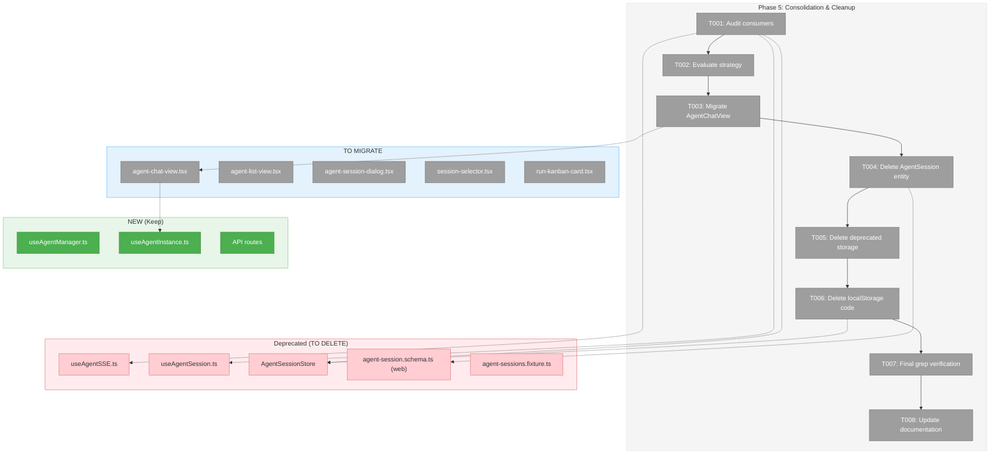
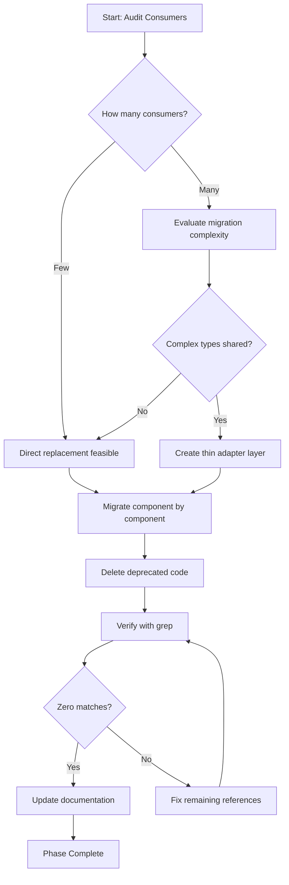
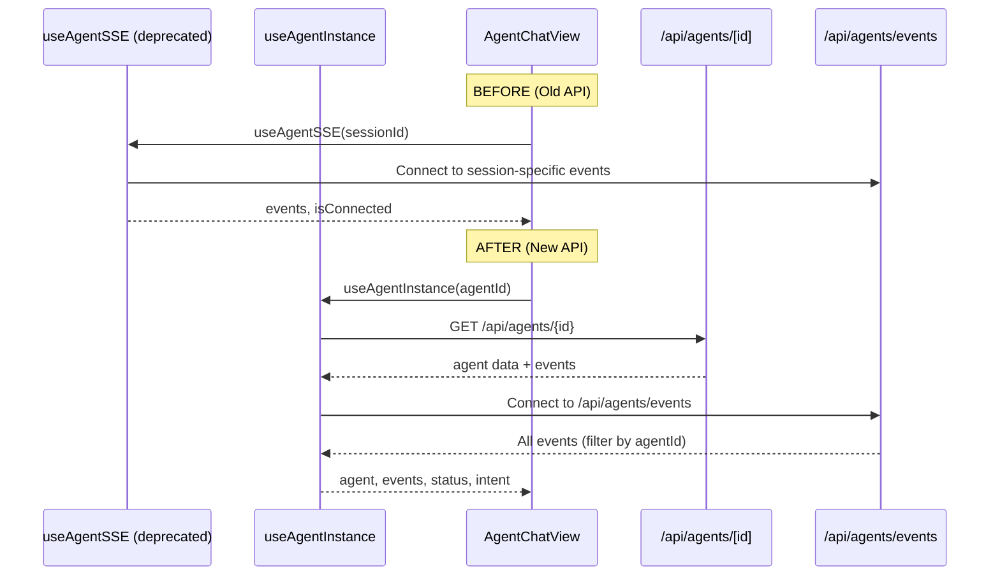

# Phase 5: Consolidation & Cleanup – Tasks & Alignment Brief

**Spec**: [../../agent-manager-refactor-spec.md](../../agent-manager-refactor-spec.md)
**Plan**: [../../agent-manager-refactor-plan.md](../../agent-manager-refactor-plan.md)
**Phase**: 5 of 5
**Date**: 2026-01-29

---

## Executive Briefing

### Purpose

This phase consolidates the new agent infrastructure by migrating existing UI consumers to use the new AgentManagerService/AgentInstance system and removing deprecated code paths. The fragmented state management (5+ locations) identified in the spec will be unified into a single source of truth.

### What We're Building

A cleanup and migration effort that:
- **Migrates** `AgentChatView` from deprecated `useAgentSSE` to new `useAgentInstance` hook
- **Evaluates** `AgentSession` entity/store for consolidation or replacement
- **Removes** deprecated code paths that duplicate the new system
- **Updates** documentation to reflect the new architecture

### User Value

After this phase:
- All agent state flows through one system (AgentManagerService)
- No confusion about which API to use (old vs new)
- Cleaner codebase with single responsibility
- Foundation ready for "agents everywhere" vision

### Example

**Before (Current)**: Components use mix of `useAgentSSE`, `useAgentSession`, `AgentSessionStore`, and fixtures
```typescript
// 5+ different state sources
import { useAgentSSE } from '@/hooks/useAgentSSE';
import { useAgentSession } from '@/hooks/useAgentSession';
import { AgentSessionStore } from '@/lib/stores/agent-session.store';
import { getAgentSessionByRunId } from '@/data/fixtures/agent-sessions.fixture';
```

**After (Phase 5)**: Single unified API
```typescript
// One source of truth
import { useAgentManager, useAgentInstance } from '@/features/019-agent-manager-refactor';
```

---

## Objectives & Scope

### Objective

Consolidate agent state management and remove deprecated code per plan AC-30, AC-31, R1-09.

**Behavior Checklist**:
- [ ] No AgentSession imports remain in active code (AC-30)
- [ ] Deprecated AgentSession entity deleted (AC-31)
- [ ] All UI consumers migrated to new hooks (R1-09)
- [ ] No orphaned imports or dead code paths

### Goals

- ✅ Audit all AgentSession/useAgentSession/AgentSessionStore consumers
- ✅ Evaluate consolidation strategy (replace vs thin wrapper)
- ✅ Migrate AgentChatView to useAgentInstance
- ✅ Delete deprecated AgentSession code
- ✅ Delete deprecated localStorage session code
- ✅ Final verification grep for orphaned code
- ✅ Update documentation

### Non-Goals

- ❌ New features (consolidation only)
- ❌ Performance optimizations (defer to future)
- ❌ CLI commands (out of scope for this phase)
- ❌ Refactoring working components that don't use deprecated APIs
- ❌ Modifying IAgentAdapter or adapter implementations (per plan constraint)

---

## Architecture Map

### Component Diagram

<!-- Status: grey=pending, orange=in-progress, green=completed, red=blocked -->
<!-- Updated by plan-6 during implementation -->



### Task-to-Component Mapping

<!-- Status: ⬜ Pending | 🟧 In Progress | ✅ Complete | 🔴 Blocked -->

| Task | Component(s) | Files | Status | Comment |
|------|-------------|-------|--------|---------|
| T001 | Consumer Audit | All consumer files | ⬜ Pending | Map all imports/usages before changes |
| T002 | Strategy Decision | N/A (decision) | ⬜ Pending | Document in execution log |
| T003 | AgentChatView | agent-chat-view.tsx | ⬜ Pending | Primary migration target |
| T004 | AgentSession Entity | schemas, di-tokens | ⬜ Pending | Delete after consumers migrated |
| T005 | Storage Paths | Old workspace paths | ⬜ Pending | Plan 018 cleanup |
| T006 | AgentSessionStore | stores/, di-container | ⬜ Pending | Evaluate if still needed |
| T007 | Verification | grep across codebase | ⬜ Pending | No orphaned imports |
| T008 | Documentation | README, docs/how | ⬜ Pending | Reflect new architecture |

---

## Tasks

| Status | ID | Task | CS | Type | Dependencies | Absolute Path(s) | Validation | Subtasks | Notes |
|--------|------|------|-----|------|--------------|------------------|------------|----------|-------|
| [ ] | T001 | Audit AgentSession/useAgentSession/AgentSessionStore consumers | 2 | Setup | – | /home/jak/substrate/015-better-agents/apps/web/src/components/agents/, /home/jak/substrate/015-better-agents/apps/web/src/hooks/, /home/jak/substrate/015-better-agents/apps/web/src/lib/stores/ | Complete list of all imports/usages documented in execution log | – | Grep packages/shared, apps/web |
| [ ] | T002 | Evaluate consolidation strategy: replace AgentSession with AgentInstance OR thin wrapper | 2 | Decision | T001 | N/A | Decision documented in execution log with rationale | – | Per AC-30; **DYK-01 Decision: Full refactor, no legacy** |
| [ ] | T003 | **Full Migration Cascade**: AgentChatView + parent page + supporting components | 5 | Core | T002, T003a, T003g | See subtasks | All components use agentId prop; old workspace-scoped API removed; tests pass | T003a-T003h | **DYK-01: Bumped to CS-5 due to cascade**; EXPECT ITERATION |
| [ ] | T003a | Add DELETE `/api/agents/[id]` route | 2 | API | T002 | /home/jak/substrate/015-better-agents/apps/web/app/api/agents/[id]/route.ts | Route returns 200 on success, 404 on not found | – | **BLOCKER** for DeleteSessionButton migration |
| [ ] | T003g | Create new `transformAgentEventsToLogEntries()` for Plan 019 events | 2 | Core | T002 | /home/jak/substrate/015-better-agents/apps/web/src/features/019-agent-manager-refactor/transformers/agent-events-to-log-entries.ts | Transformer handles AgentStoredEvent shape; unit tests pass | – | **DYK-05: New transformer for new event schema** |
| [ ] | T003b | Refactor AgentChatView props: sessionId/workspaceSlug/agentType → agentId | 3 | Core | T003a, T003g | /home/jak/substrate/015-better-agents/apps/web/src/components/agents/agent-chat-view.tsx | Props interface changed; useAgentInstance replaces useAgentSSE | – | Remove useServerSession, useAgentSSE imports; use new transformer |
| [ ] | T003c | Update agent page to pass agentId instead of sessionId | 2 | Core | T003b | /home/jak/substrate/015-better-agents/apps/web/app/(dashboard)/workspaces/[slug]/agents/[id]/page.tsx | Page passes agentId to AgentChatView | – | May require URL param rename |
| [ ] | T003d | Migrate DeleteSessionButton to new API | 2 | Core | T003a | /home/jak/substrate/015-better-agents/apps/web/src/components/agents/delete-session-button.tsx | Uses `/api/agents/${agentId}` DELETE | – | Rename to DeleteAgentButton? |
| [ ] | T003e | Update SessionSelector for agentId URLs | 2 | Core | T003c | /home/jak/substrate/015-better-agents/apps/web/src/components/agents/session-selector.tsx | URL construction uses agentId | – | May rename to AgentSelector |
| [ ] | T003f | Update AgentChatView tests for new props | 2 | Test | T003b | /home/jak/substrate/015-better-agents/test/unit/web/app/agents/chat-page.test.tsx | Tests pass with useAgentInstance mock | – | – |
| [ ] | T003h | Delete old `transformEventsToLogEntries` and related files | 2 | Cleanup | T003b | /home/jak/substrate/015-better-agents/apps/web/src/lib/transformers/stored-event-to-log-entry.ts, /home/jak/substrate/015-better-agents/test/unit/transformers/stored-event-to-log-entry.test.ts | Old transformer deleted; tests deleted; no orphaned imports | – | **DYK-05: Delete old transformer** |
| [ ] | T004 | Delete AgentSession entity and related schemas from packages/shared | 2 | Cleanup | T003 | /home/jak/substrate/015-better-agents/packages/shared/src/schemas/agent-session.schema.ts, /home/jak/substrate/015-better-agents/packages/shared/src/di-tokens.ts | Files deleted; no orphaned exports in index.ts | – | Per AC-31 |
| [ ] | T005 | Delete deprecated .chainglass/workspaces/default/data/ storage references | 2 | Cleanup | T004 | /home/jak/substrate/015-better-agents/apps/web/src/, /home/jak/substrate/015-better-agents/packages/shared/src/ | No references to old storage path remain | – | Plan 018 cleanup |
| [ ] | T006 | Delete or deprecate AgentSessionStore localStorage code | 2 | Cleanup | T005 | /home/jak/substrate/015-better-agents/apps/web/src/lib/stores/agent-session.store.ts, /home/jak/substrate/015-better-agents/apps/web/src/lib/di-container.ts | Store deleted or marked deprecated; DI registration removed/updated | – | Evaluate if still needed |
| [ ] | T007 | Delete old workspace-scoped agent API routes | 2 | Cleanup | T003 | /home/jak/substrate/015-better-agents/apps/web/app/api/workspaces/[slug]/agents/ | Old routes deleted; no references remain | – | **DYK-01: Added** - /api/workspaces/[slug]/agents/* |
| [ ] | T008 | Delete old agent event schemas | 2 | Cleanup | T003h | /home/jak/substrate/015-better-agents/apps/web/src/lib/schemas/agent-events.schema.ts | Old event schemas deleted; no orphaned imports | – | **DYK-05: Old StoredEvent types** |
| [ ] | T009 | Final grep for orphaned code: AgentSession, useAgentSession, useAgentSSE, transformEventsToLogEntries | 1 | Verify | T006, T007, T008 | /home/jak/substrate/015-better-agents/ | Zero matches in active code (excluding test fixtures) | – | Per AC-30 |
| [ ] | T010 | Update documentation: README getting-started, docs/how/agents/ | 2 | Doc | T009 | /home/jak/substrate/015-better-agents/README.md, /home/jak/substrate/015-better-agents/docs/how/ | Docs reflect new AgentManagerService architecture | – | – |

---

## Alignment Brief

### Prior Phases Review

**Phase 1: AgentManagerService + AgentInstance Core (Complete)**
- **Deliverables**: IAgentManagerService, IAgentInstance interfaces; AgentManagerService, AgentInstanceImpl implementations; Fake implementations for testing
- **Key Files**: 
  - `/home/jak/substrate/015-better-agents/packages/shared/src/features/019-agent-manager-refactor/agent-manager.interface.ts`
  - `/home/jak/substrate/015-better-agents/packages/shared/src/features/019-agent-manager-refactor/agent-instance.interface.ts`
  - `/home/jak/substrate/015-better-agents/packages/shared/src/features/019-agent-manager-refactor/agent-manager.service.ts`
  - `/home/jak/substrate/015-better-agents/packages/shared/src/features/019-agent-manager-refactor/agent-instance.impl.ts`
- **Test Infrastructure**: Contract tests (44 passed), FakeAgentManagerService, FakeAgentInstance
- **DYK Applied**: DYK-01 through DYK-05

**Phase 2: AgentNotifierService (SSE Broadcast) (Complete)**
- **Deliverables**: IAgentNotifierService interface; AgentNotifierService with SSE broadcast; SSEManagerBroadcaster integration
- **Key Files**:
  - `/home/jak/substrate/015-better-agents/packages/shared/src/features/019-agent-manager-refactor/agent-notifier.interface.ts`
  - `/home/jak/substrate/015-better-agents/packages/shared/src/features/019-agent-manager-refactor/agent-notifier.service.ts`
- **Test Infrastructure**: Contract tests (40 passed), FakeAgentNotifierService
- **DYK Applied**: DYK-06 through DYK-10

**Phase 3: Storage Layer (Complete)**
- **Deliverables**: IAgentStorageAdapter interface; AgentStorageAdapter with JSON persistence at `~/.config/chainglass/agents/`
- **Key Files**:
  - `/home/jak/substrate/015-better-agents/packages/shared/src/features/019-agent-manager-refactor/agent-storage.interface.ts`
  - `/home/jak/substrate/015-better-agents/packages/shared/src/features/019-agent-manager-refactor/agent-storage.adapter.ts`
- **Test Infrastructure**: Contract tests (28 passed), FakeAgentStorageAdapter
- **DYK Applied**: DYK-11 through DYK-15

**Phase 4: Web Integration (Complete)**
- **Deliverables**: API routes (GET/POST /api/agents, GET /api/agents/[id], POST /api/agents/[id]/run, GET /api/agents/events); React hooks (useAgentManager, useAgentInstance)
- **Key Files**:
  - `/home/jak/substrate/015-better-agents/apps/web/app/api/agents/route.ts`
  - `/home/jak/substrate/015-better-agents/apps/web/app/api/agents/[id]/route.ts`
  - `/home/jak/substrate/015-better-agents/apps/web/app/api/agents/[id]/run/route.ts`
  - `/home/jak/substrate/015-better-agents/apps/web/app/api/agents/events/route.ts`
  - `/home/jak/substrate/015-better-agents/apps/web/src/features/019-agent-manager-refactor/useAgentManager.ts`
  - `/home/jak/substrate/015-better-agents/apps/web/src/features/019-agent-manager-refactor/useAgentInstance.ts`
- **Test Infrastructure**: Integration tests (12 passed)
- **DYK Applied**: DYK-16 through DYK-19
- **Key Learnings**:
  - Routes use `getContainer()` from bootstrap-singleton (NOT productionContainer)
  - Import paths vary by route depth (3-5 levels)
  - Biome requires `for...of` instead of `forEach`

### Server-Side Rehydration Stages (Verified)

The following stages enable browser reload, server restart, and agent switching:

| Stage | Status | Evidence |
|-------|--------|----------|
| **Event Persistence** | ✅ | `appendEvent()` stores to `~/.config/chainglass/agents/{id}/events.ndjson` (NDJSON format) |
| **AgentManagerService.initialize()** | ✅ | Loads registry via `listAgents()`, hydrates agents into `_agents` Map on startup |
| **AgentInstance.getEvents()** | ✅ | Returns eager-loaded events from storage; `hydrate()` loads at startup |
| **Storage-First (PL-01)** | ✅ | `_persistInstance()` and `appendEvent()` called BEFORE broadcast methods |

**Key Implementation Details**:
- `agent-storage.adapter.ts:143-158` - Atomic event append with crash protection
- `agent-manager.service.ts:95-120` - initialize() loads from storage, populates Map
- `agent-instance.ts:144-192` - hydrate() factory eager-loads events (line 178)
- `agent-instance.ts:222-259` - Storage-first: persist → then broadcast

### Cumulative Dependencies for Phase 5

All components from Phases 1-4 are available:
- `IAgentManagerService` with `getAgents()`, `getAgent()`, `createAgent()`, `terminateAgent()`
- `IAgentInstance` with `run()`, `setStatus()`, `setIntent()`, `getEvents()`
- `IAgentNotifierService` with `broadcast()`
- `IAgentStorageAdapter` with registry/instance/event persistence
- `useAgentManager` hook for agent list + SSE subscription
- `useAgentInstance` hook for single agent operations
- API routes at `/api/agents/*`
- SSE endpoint at `/api/agents/events`

### Critical Findings Affecting This Phase

| Finding | What It Constrains | Tasks Addressing |
|---------|-------------------|------------------|
| R1-09 (Dual storage divergence) | Must complete migration, not leave both systems | T003, T004, T006 |
| R1-04 (Session directory deletion race) | Use atomic rename for deletion | T004, T005 |
| R1-07 (Missing cascade delete) | AgentManagerService coordinates deletion | T004 |
| AC-30 (No AgentSession imports) | Zero imports in active code after cleanup | T007 |
| AC-31 (Deprecated code deleted) | AgentSession entity must be deleted | T004 |

### Known Consumers to Migrate/Evaluate

From audit (grep results):

**Deprecated Hooks (TO DELETE)**:
1. `apps/web/src/hooks/useAgentSSE.ts` - Marked @deprecated in Phase 4
2. `apps/web/src/hooks/useAgentSession.ts` - Session state management

**Components Using Deprecated APIs**:
1. `apps/web/src/components/agents/agent-chat-view.tsx` - Uses `useAgentSSE`
2. `apps/web/src/components/agents/agent-list-view.tsx` - Uses `AgentSession` type
3. `apps/web/src/components/agents/agent-session-dialog.tsx` - Uses `AgentSession`, `AgentSessionStatus`
4. `apps/web/src/components/agents/session-selector.tsx` - Uses `AgentSession` type
5. `apps/web/src/components/kanban/run-kanban-card.tsx` - Uses `AgentSessionDialog`, `getAgentSessionByRunId`

**Stores/Schemas**:
1. `apps/web/src/lib/stores/agent-session.store.ts` - localStorage persistence
2. `apps/web/src/lib/schemas/agent-session.schema.ts` - Schema for AgentSessionStore
3. `packages/shared/src/schemas/agent-session.schema.ts` - Shared AgentSession schemas

**Fixtures**:
1. `apps/web/src/data/fixtures/agent-sessions.fixture.ts` - Demo data for AgentSession

**DI Tokens**:
1. `packages/shared/src/di-tokens.ts` - AGENT_SESSION_ADAPTER, AGENT_SESSION_SERVICE tokens

### Invariants & Guardrails

- **No Breaking Changes**: Existing tests must pass after migration
- **Atomic Deletion**: Delete code only after consumers migrated
- **Verification Gate**: T007 grep must show zero orphaned imports
- **Documentation Required**: T008 must update docs before phase complete

### Inputs to Read

| File | Purpose |
|------|---------|
| `apps/web/src/features/019-agent-manager-refactor/useAgentManager.ts` | New hook to migrate TO |
| `apps/web/src/features/019-agent-manager-refactor/useAgentInstance.ts` | New hook to migrate TO |
| `apps/web/src/hooks/useAgentSSE.ts` | Old hook to migrate FROM |
| `apps/web/src/components/agents/agent-chat-view.tsx` | Primary migration target |
| `packages/shared/src/schemas/agent-session.schema.ts` | Schemas to delete |

### Visual Alignment Aids

#### Flow Diagram: Consolidation Strategy



#### Sequence Diagram: Migration of AgentChatView



### Test Plan

**Approach**: Lightweight verification (per spec preference)
- Verify existing tests still pass after migrations
- No new unit tests needed (code is deleted, not added)
- Final grep verification in T007

**Tests to Run**:
```bash
# Full test suite after each migration
just test

# Specific verification after T007
grep -r "useAgentSSE\|useAgentSession\|AgentSessionStore" apps/web/src --include="*.ts" --include="*.tsx" | grep -v ".test." | wc -l
# Expected: 0
```

### Step-by-Step Implementation Outline

1. **T001**: Run comprehensive grep to document all consumers
2. **T002**: Analyze grep results, decide replace vs adapter strategy
3. **T003**: Migrate AgentChatView (primary consumer of useAgentSSE)
4. **T004**: Delete AgentSession schemas and DI tokens from packages/shared
5. **T005**: Delete old storage path references
6. **T006**: Delete AgentSessionStore and update DI container
7. **T007**: Run final grep verification
8. **T008**: Update README and docs/how/

### Commands to Run

```bash
# Environment setup
cd /home/jak/substrate/015-better-agents
pnpm install

# Quality gates (run after each task)
just fft  # Fix, Format, Test

# Audit command (T001)
grep -rn "AgentSession\|useAgentSession\|useAgentSSE\|AgentSessionStore" \
  apps/web/src packages/shared/src \
  --include="*.ts" --include="*.tsx" \
  | grep -v ".test." | grep -v "node_modules"

# Verification command (T007)
grep -r "useAgentSSE\|useAgentSession\|AgentSessionStore\|from.*agent-session" \
  apps/web/src packages/shared/src \
  --include="*.ts" --include="*.tsx" \
  | grep -v ".test." | grep -v "node_modules" | wc -l
# Expected: 0

# Full quality check
just check
```

### Risks/Unknowns

| Risk | Severity | Mitigation |
|------|----------|------------|
| AgentChatView was already broken | High | **Use Next.js MCP for live debugging**; expect multiple iterations; verify with browser_eval |
| T003 cascade larger than expected | High | **DYK-01**: Bumped to CS-5 with 6 subtasks; execute sequentially |
| Hidden consumers not found by grep | Medium | Search for type usage, not just imports |
| Fixtures used by tests | Medium | Keep fixture file if tests need it; mark deprecated |
| AgentSession type used as API contract | Medium | Verify no external API depends on this type |
| Component tests break after migration | Low | Update component tests to use new hooks |

---

### DYK-01: API Endpoint Migration Cascade (Full Mapping)

**Session**: 2026-01-29
**Decision**: Option A - Full Interface Refactor (no legacy code)

#### Current State (DEPRECATED)

```
AgentChatView Props:
  sessionId (string)      → Identifies session in storage
  workspaceSlug (string)  → For API path construction  
  worktreePath (string)   → Agent working directory
  agentType (enum)        → 'claude-code' | 'copilot'

API Call: POST /api/workspaces/${workspaceSlug}/agents/run
SSE Hook: useAgentSSE (deprecated)
```

#### Target State (Plan 019)

```
AgentChatView Props:
  agentId (string)        → Global agent identifier

API Call: POST /api/agents/${agentId}/run  
SSE Hook: useAgentInstance(agentId)
```

#### Migration Dependency Tree

```
T003a: DELETE /api/agents/[id] route (BLOCKER)
   ↓
T003b: AgentChatView props refactor
   ↓
T003c: Agent page passes agentId
   ↓
T003d: DeleteSessionButton → /api/agents/${agentId}
   ↓
T003e: SessionSelector URL construction
   ↓
T003f: Test updates
```

#### Files Affected

| File | Current | Change |
|------|---------|--------|
| `agent-chat-view.tsx` | sessionId, workspaceSlug, agentType props | agentId prop only |
| `[slug]/agents/[id]/page.tsx` | Passes 4 props | Passes agentId |
| `delete-session-button.tsx` | `/api/workspaces/.../agents/${sessionId}` | `/api/agents/${agentId}` |
| `session-selector.tsx` | sessionId in URLs | agentId in URLs |
| `/api/agents/[id]/route.ts` | Only run route exists | Add DELETE handler |
| `/api/workspaces/[slug]/agents/*` | Active | DELETE (T007) |

#### API Contract Migration

```typescript
// OLD: apps/web/app/api/workspaces/[slug]/agents/run/route.ts
POST /api/workspaces/${slug}/agents/run
Body: { prompt, agentType, sessionId, channel, agentSessionId, worktreePath }
Response: { agentSessionId, output, status, tokens }

// NEW: apps/web/app/api/agents/[id]/run/route.ts  
POST /api/agents/${agentId}/run
Body: { prompt, cwd? }
Response: { success: true, agentId }
```

---

### DYK-02: Event Schema - Build Fresh, Don't Adapt

**Session**: 2026-01-29
**Decision**: Hybrid approach (streaming via `onAgentEvent` callback, history via `events` query), but built fresh against new system

#### Key Clarification
We are **replacing** the old system, not adapting to it. The old event schema (`agent_session_status`, `agent_usage_update`, etc.) is irrelevant - the new system defines its own events and AgentChatView conforms to those.

#### New System Events (from useAgentInstance)
```typescript
// Events listened to in useAgentInstance.ts (lines 203-212)
const eventTypes = [
  'agent_status',
  'agent_intent', 
  'agent_text_delta',
  'agent_text_replace',
  'agent_text_append',
  'agent_question',
  'agent_created',
  'agent_terminated',
];
```

#### Implementation Approach for T003b
1. **Remove** all old hooks: `useAgentSSE`, `useServerSession`
2. **Use** `useAgentInstance(agentId)` with `onAgentEvent` callback for streaming
3. **Derive** conversation history from `events` array (rehydration)
4. **Build** streaming content accumulator for `agent_text_delta` events
5. **Map** new event types to UI states (no backward compat needed)

#### Old Schemas to DELETE (T004)
- `agent_session_status` → replaced by `agent_status`
- `agent_usage_update` → not implemented in new system (out of scope)
- `AgentTextDeltaEvent` → new `agent_text_delta` has different payload
- All schemas in `apps/web/src/lib/schemas/agent-events.schema.ts`

---

---

---

---

### DYK-05: Event Transformer - Build New, Delete Old

**Session**: 2026-01-29
**Decision**: Option B - Build new transformer from scratch, delete old

#### Old Transformer (TO DELETE)
```
apps/web/src/lib/transformers/stored-event-to-log-entry.ts
test/unit/transformers/stored-event-to-log-entry.test.ts
apps/web/src/lib/schemas/agent-events.schema.ts
```

Expected old event shape:
```typescript
// Old StoredEvent (Plan 018)
{ type: 'text_delta', data: { delta: 'Hello', sessionId: 'abc', role: 'assistant' } }
```

#### New Transformer (TO CREATE)
```
apps/web/src/features/019-agent-manager-refactor/transformers/agent-events-to-log-entries.ts
```

New event shape:
```typescript
// New AgentStoredEvent (Plan 019)
{ eventId: 'evt-1', type: 'text_delta', payload: { delta: 'Hello' }, timestamp: '...' }
```

#### Implementation Notes
1. Create `transformAgentEventsToLogEntries(events: AgentStoredEvent[]): LogEntryProps[]`
2. Handle event types: `text_delta`, `text_append`, `text_replace`, `status`, `intent`, `question`
3. Unit tests for the new transformer
4. Update AgentChatView to import from 019 feature folder
5. Delete old files when migration complete (T003h, T008)

---

### DYK-04: Agent Creation Flow

**Session**: 2026-01-29
**Decision**: Option A - Explicit Create Flow (existing pattern)

#### Flow
1. User clicks "New Agent" button
2. Modal: Select agent type (claude-code / copilot)
3. Modal: Enter name (default: ordinal like "Agent 1", "Agent 2")
4. POST /api/agents → creates agent
5. Redirect to `/workspaces/[slug]/agents/[agentId]`

#### API Status
- ✅ `POST /api/agents` exists and is fully implemented (route.ts lines 100-160)
- Body: `{ name, type, workspace }` (all required)
- Returns: Created agent with `id`

#### UI Status
- ⚠️ Need to verify/create "New Agent" button + modal in Phase 5 UI work
- This is likely existing UI that needs to call new API

---

### DYK-03: URL Identity - Clean Slate

**Session**: 2026-01-29
**Decision**: Option D - Accept breaking change (no migration needed)

#### Context
URL param `[id]` in `/workspaces/[slug]/agents/[id]` changes meaning from sessionId to agentId.

#### Decision Rationale
- No users have saved links to agent pages
- Old sessions are not being migrated anyway
- Clean slate aligns with ruthless cleanup principle

#### Implementation Notes for T003c
- URL param `[id]` now means agentId (UUID format)
- Page component fetches agent by agentId directly
- No redirect logic or legacy support needed

---

### T003 Iteration Strategy (AgentChatView)

⚠️ **USER WARNING**: AgentChatView was broken before migration. Expect significant iteration.

**Debugging Workflow**:
1. Start dev server: `pnpm dev` (in apps/web)
2. Use `nextjs_index` to discover MCP tools
3. Use `nextjs_call` with `get_errors` to check for runtime/build errors
4. Use `browser_eval` to load the agent chat page and verify rendering
5. Iterate on fixes using Fast Refresh (no server restart needed)

**Verification Checklist for T003**:
- [ ] Component renders without hydration errors
- [ ] SSE connection established to `/api/agents/events`
- [ ] Events display correctly in chat view
- [ ] Input submission works
- [ ] Status updates reflect in UI
- [ ] No console errors in browser

### Ready Check

- [ ] Prior phases complete (Phase 1-4) ✅
- [ ] ADR constraints mapped to tasks (N/A - no new ADRs for this phase)
- [ ] All deprecated code identified
- [ ] Migration target hooks exist (useAgentManager, useAgentInstance)
- [ ] Test commands verified
- [ ] Documentation update scope defined

**⏸️ AWAITING GO/NO-GO**

---

## Phase Footnote Stubs

_This section will be populated during implementation by plan-6a-update-progress._

| Footnote | Task | Description |
|----------|------|-------------|
| | | |

---

## Evidence Artifacts

**Execution Log**: `./execution.log.md` (created by plan-6 during implementation)

**Supporting Files**:
- Consumer audit results (logged in execution.log.md)
- Strategy decision rationale (logged in execution.log.md)
- Final grep verification output (logged in execution.log.md)

---

## Discoveries & Learnings

_Populated during implementation by plan-6. Log anything of interest to your future self._

| Date | Task | Type | Discovery | Resolution | References |
|------|------|------|-----------|------------|------------|
| | | | | | |

**Types**: `gotcha` | `research-needed` | `unexpected-behavior` | `workaround` | `decision` | `debt` | `insight`

**What to log**:
- Things that didn't work as expected
- External research that was required
- Implementation troubles and how they were resolved
- Gotchas and edge cases discovered
- Decisions made during implementation
- Technical debt introduced (and why)
- Insights that future phases should know about

_See also: `execution.log.md` for detailed narrative._

---

## Critical Insights Discussion

**Session**: 2026-01-29 10:07 UTC
**Context**: Phase 5: Consolidation & Cleanup Tasks - Pre-implementation DYK session
**Analyst**: AI Clarity Agent
**Reviewer**: Development Team
**Format**: Water Cooler Conversation (5 Critical Insights)

### Insight 1: API Endpoint Chasm

**Did you know**: AgentChatView calls `/api/workspaces/${slug}/agents/run` but the new system expects `/api/agents/${agentId}/run` - completely incompatible API contracts.

**Implications**:
- Simply swapping hooks won't work - API endpoints are different
- Props interface must change from sessionId/workspaceSlug to agentId
- Parent components must be updated to provide agentId
- Cascading changes to 5+ components

**Options Considered**:
- Option A: Full Interface Refactor - Replace props, cascade to parents
- Option B: Adapter Pattern - Keep old props, map internally
- Option C: Phased Migration - Feature flag, migrate incrementally

**AI Recommendation**: Option A - Full Interface Refactor
- Reasoning: Aligns with ruthless cleanup principle; known consumer count is small

**Decision**: Option A - Full refactor, no legacy code

**Action Items**:
- [x] Expand T003 to CS-5 with 8 subtasks (T003a-T003h)
- [x] Add T007 for workspace-scoped API deletion
- [x] Document full migration cascade

**Affects**: T003 scope (expanded), task count increased

---

### Insight 2: Event Schema Divergence

**Did you know**: Old useAgentSSE expects events like `agent_session_status`, but the new system emits `agent_status`, `agent_intent` - different event types entirely.

**Implications**:
- AgentChatView callbacks expect old format
- New system doesn't emit `agent_usage_update` (not implemented)
- useAgentInstance doesn't expose streaming callbacks directly

**Options Considered**:
- Option A: Add streaming callbacks to useAgentInstance
- Option B: Refactor to query-based updates only
- Option C: Hybrid - streaming via callback, history via query

**AI Recommendation**: Option C - Hybrid approach
- Reasoning: useAgentInstance already has onAgentEvent callback; query handles rehydration

**Decision**: Option C - Hybrid, but building fresh against new system (not adapting to old)

**Action Items**:
- [x] Document new event types to support
- [x] Add DYK-02 section with event mapping

**Affects**: T003b implementation approach

---

### Insight 3: URL Routing Identity Crisis

**Did you know**: URL param `[id]` currently means sessionId (timestamp format) but will mean agentId (UUID format) - existing URLs will 404.

**Implications**:
- Breaking change for any saved URLs/bookmarks
- Browser history becomes invalid
- No migration path (different identifier concepts)

**Options Considered**:
- Option A: Keep URL structure, accept breaking change
- Option B: URL migration redirect
- Option C: New URL namespace
- Option D: Accept it, document it

**AI Recommendation**: Option D - Accept breaking change
- Reasoning: Old sessions aren't migrated; fresh start; ruthless cleanup

**Decision**: Option D - No users have saved links; clean slate

**Action Items**:
- [x] Document URL identity change in DYK-03 section

**Affects**: T003c implementation (URL params mean agentId)

---

### Insight 4: Agent Creation Gap

**Did you know**: After migration, navigating to an agent page with no agent returns 404 - the new system requires explicit agent creation first.

**Implications**:
- No implicit agent creation on chat open
- Need "Create Agent" UI flow before chatting
- Parent components must have/create agents

**Options Considered**:
- Option A: Explicit create flow (type → name → create)
- Option B: Create-on-first-message
- Option C: Auto-create from page load

**AI Recommendation**: Option A - Explicit create flow
- Reasoning: Clean UX, agents are first-class entities, no ghost agents

**Decision**: Option A - Existing pattern (type selector → name with ordinal default → create)

**Action Items**:
- [x] Verify POST /api/agents exists (✅ confirmed at route.ts lines 100-160)
- [x] Document create flow in DYK-04 section

**Affects**: UI flow (already existing)

---

### Insight 5: Event Transformer Schema Mismatch

**Did you know**: `transformEventsToLogEntries()` was built for old StoredEvent type (`data.delta`) but new AgentStoredEvent has different structure (`payload.delta`).

**Implications**:
- Even with new hooks, events won't render correctly
- Transformer tightly coupled to old schema
- Need new transformer or boundary transformation

**Options Considered**:
- Option A: Update existing transformer for new events
- Option B: Build new transformer from scratch
- Option C: Transform at hook boundary

**AI Recommendation**: Option B - Build new transformer
- Reasoning: Ruthless cleanup; designed for new schema; delete old when done

**Decision**: Option B - Build new transformer, delete old thoroughly

**Action Items**:
- [x] Add T003g: Create new transformAgentEventsToLogEntries
- [x] Add T003h: Delete old transformer files
- [x] Add T008: Delete old event schemas
- [x] Document files to create/delete in DYK-05 section

**Affects**: T003 subtasks, cleanup scope

---

## Session Summary

**Insights Surfaced**: 5 critical insights identified and discussed
**Decisions Made**: 5 decisions reached through collaborative discussion
**Action Items Created**: 15+ follow-up items (reflected in expanded task list)
**Areas Updated**:
- Tasks table expanded from 9 to 12 tasks
- T003 expanded from 6 to 8 subtasks
- 5 DYK sections added with implementation details

**Shared Understanding Achieved**: ✓

**Confidence Level**: High - All key risks identified and decisions made; ruthless cleanup principle consistently applied

**Next Steps**:
1. Begin T001 (consumer audit)
2. Execute T003a-T003h sequentially
3. Delete all deprecated code per cleanup tasks
4. Verify with final grep (T009)

**Notes**:
- "Ruthless cleanup" principle applied consistently - no legacy code survives
- Total task count: 12 main tasks + 8 subtasks = 20 work items
- Phase complexity accurately reflects CS-5 due to cascade effects

---

## Directory Layout

```
docs/plans/019-agent-manager-refactor/
  ├── agent-manager-refactor-spec.md
  ├── agent-manager-refactor-plan.md
  └── tasks/
      ├── phase-1-agentmanagerservice-agentinstance-core/
      │   ├── tasks.md
      │   └── execution.log.md
      ├── phase-2-agentnotifierservice-sse-broadcast/
      │   ├── tasks.md
      │   └── execution.log.md
      ├── phase-3-storage-layer/
      │   ├── tasks.md
      │   └── execution.log.md
      ├── phase-4-web-integration/
      │   ├── tasks.md
      │   └── execution.log.md
      └── phase-5-consolidation-cleanup/  # THIS PHASE
          ├── tasks.md                    # This file
          └── execution.log.md            # Created by plan-6
```
