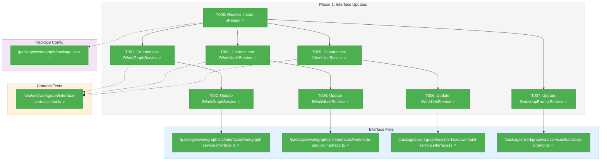
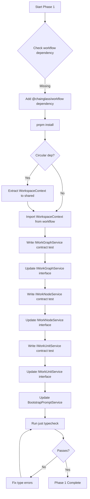
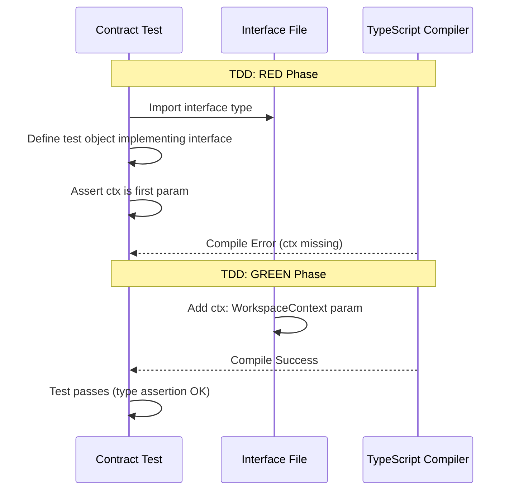

# Phase 1: Interface Updates – Tasks & Alignment Brief

**Spec**: [../../workgraph-workspaces-upgrade-spec.md](../../workgraph-workspaces-upgrade-spec.md)
**Plan**: [../../workgraph-workspaces-upgrade-plan.md](../../workgraph-workspaces-upgrade-plan.md)
**Date**: 2026-01-28
**Phase Slug**: `phase-1-interface-updates`

---

## Executive Briefing

### Purpose
This phase updates all four workgraph service interfaces to accept `WorkspaceContext` as the first parameter on every method. This is the foundational change that enables per-worktree data isolation—without it, services cannot determine where to store files.

### What We're Building
Updated TypeScript interfaces with a new method signature pattern:
- `IWorkGraphService` - 6 methods gain `ctx` parameter
- `IWorkNodeService` - 15 methods gain `ctx` parameter
- `IWorkUnitService` - 4 methods gain `ctx` parameter
- `IBootstrapPromptService` - implicit interface updated

Plus resolution of the `WorkspaceContext` import strategy (workflow dependency or shared extraction).

### User Value
After this phase, the type system enforces that all service method calls include workspace context. This catches bugs at compile time rather than runtime, ensuring developers cannot accidentally bypass workspace isolation.

### Example
**Before**:
```typescript
// No workspace awareness - files go to hardcoded location
const result = await workGraphService.create('my-graph');
```

**After**:
```typescript
// Workspace-aware - files go to ctx.worktreePath
const ctx = await resolver.resolveFromPath(process.cwd());
const result = await workGraphService.create(ctx, 'my-graph');
```

---

## Objectives & Scope

### Objective
Update all service interfaces to accept WorkspaceContext as the first parameter on every method, following the SampleAdapter exemplar pattern.

**Behavior Checklist** (from Plan Acceptance Criteria):
- [ ] All interface files updated with ctx parameter
- [ ] TypeScript compiles with strict mode: `just typecheck` passes
- [ ] Contract tests written for all interfaces
- [ ] No circular dependencies detected: `pnpm build` succeeds
- [ ] ADR-0004 patterns followed (interface-first)

### Goals

- ✅ Update `IWorkGraphService` interface (6 methods)
- ✅ Update `IWorkNodeService` interface (15 methods)
- ✅ Update `IWorkUnitService` interface (4 methods)
- ✅ Update `BootstrapPromptService` interface (implicit via generate method)
- ✅ Resolve `WorkspaceContext` import strategy
- ✅ Write contract tests that verify ctx parameter presence
- ✅ Maintain TypeScript strict mode compilation

### Non-Goals

- ❌ **Implementing the services** - services will fail to compile until Phase 2
- ❌ **Updating fake services** - deferred to Phase 3
- ❌ **Updating CLI commands** - deferred to Phase 4
- ❌ **Updating test files to pass ctx** - deferred to Phase 5
- ❌ **Path helper methods** - implementation detail for Phase 2
- ❌ **Moving files to new locations** - deferred to Phase 6
- ❌ **Extracting WorkspaceContext to @chainglass/shared** - only if circular dep occurs

---

## Architecture Map

### Component Diagram
<!-- Status: grey=pending, orange=in-progress, green=completed, red=blocked -->
<!-- Updated by plan-6 during implementation -->



### Task-to-Component Mapping

<!-- Status: ⬜ Pending | 🟧 In Progress | ✅ Complete | 🔴 Blocked -->

| Task | Component(s) | Files | Status | Comment |
|------|-------------|-------|--------|---------|
| T001 | IWorkGraphService Contract | /test/unit/workgraph/interface-contracts.test.ts | ✅ Complete | Write test that expects ctx param; will fail initially |
| T002 | IWorkGraphService Interface | /packages/workgraph/src/interfaces/workgraph-service.interface.ts | ✅ Complete | Add ctx: WorkspaceContext to all 6 methods |
| T003 | IWorkNodeService Contract | /test/unit/workgraph/interface-contracts.test.ts | ✅ Complete | Write test that expects ctx param; will fail initially |
| T004 | IWorkNodeService Interface | /packages/workgraph/src/interfaces/worknode-service.interface.ts | ✅ Complete | Add ctx: WorkspaceContext to all 14 methods |
| T005 | IWorkUnitService Contract | /test/unit/workgraph/interface-contracts.test.ts | ✅ Complete | Write test that expects ctx param; will fail initially |
| T006 | IWorkUnitService Interface | /packages/workgraph/src/interfaces/workunit-service.interface.ts | ✅ Complete | Add ctx: WorkspaceContext to all 4 methods |
| T007 | BootstrapPromptService | /packages/workgraph/src/services/bootstrap-prompt.ts | ✅ Complete | Add ctx to generate() method signature |
| T008 | Import Strategy | /packages/workgraph/package.json | ✅ Complete | Add workflow dependency; extract to shared only if circular |

---

## Tasks

| Status | ID | Task | CS | Type | Dependencies | Absolute Path(s) | Validation | Subtasks | Notes |
|--------|------|------|----|------|--------------|------------------|------------|----------|-------|
| [x] | T001 | Write contract test for IWorkGraphService with ctx parameter | 2 | Test | T008 | /home/jak/substrate/021-workgraph-workspaces-upgrade/test/unit/workgraph/interface-contracts.test.ts | Test exists; fails because interface lacks ctx | – | RED phase of TDD |
| [x] | T002 | Update IWorkGraphService interface to add ctx as first param | 2 | Core | T001 | /home/jak/substrate/021-workgraph-workspaces-upgrade/packages/workgraph/src/interfaces/workgraph-service.interface.ts | Interface compiles; `grep -n "ctx: WorkspaceContext" workgraph-service.interface.ts` shows 6 matches | – | 6 methods: create, load, show, status, addNodeAfter, removeNode |
| [x] | T003 | Write contract test for IWorkNodeService with ctx parameter | 2 | Test | T008 | /home/jak/substrate/021-workgraph-workspaces-upgrade/test/unit/workgraph/interface-contracts.test.ts | Test exists; fails because interface lacks ctx | – | RED phase of TDD |
| [x] | T004 | Update IWorkNodeService interface to add ctx as first param | 3 | Core | T003 | /home/jak/substrate/021-workgraph-workspaces-upgrade/packages/workgraph/src/interfaces/worknode-service.interface.ts | Interface compiles; `grep -n "ctx: WorkspaceContext" worknode-service.interface.ts` shows 14 matches | – | **14 methods** (DYK#3): ☑ canRun ☑ markReady ☑ start ☑ end ☑ canEnd ☑ getInputData ☑ getInputFile ☑ getOutputData ☑ saveOutputData ☑ saveOutputFile ☑ clear ☑ ask ☑ answer ☑ getAnswer |
| [x] | T005 | Write contract test for IWorkUnitService with ctx parameter | 2 | Test | T008 | /home/jak/substrate/021-workgraph-workspaces-upgrade/test/unit/workgraph/interface-contracts.test.ts | Test exists; fails because interface lacks ctx | – | RED phase of TDD |
| [x] | T006 | Update IWorkUnitService interface to add ctx as first param | 2 | Core | T005 | /home/jak/substrate/021-workgraph-workspaces-upgrade/packages/workgraph/src/interfaces/workunit-service.interface.ts | Interface compiles; `grep -n "ctx: WorkspaceContext" workunit-service.interface.ts` shows 4 matches | – | 4 methods: list, load, create, validate |
| [x] | T007 | Update BootstrapPromptService.generate() to add ctx as first param | 1 | Core | T008 | /home/jak/substrate/021-workgraph-workspaces-upgrade/packages/workgraph/src/services/bootstrap-prompt.ts | `grep -n "ctx: WorkspaceContext" bootstrap-prompt.ts` shows 1 match | – | No interface file; class only |
| [x] | T008 | Resolve WorkspaceContext import strategy | 2 | Setup | – | /home/jak/substrate/021-workgraph-workspaces-upgrade/packages/workgraph/package.json | `pnpm build` succeeds; imports compile | – | Add `@chainglass/workflow: workspace:*` dependency; per Critical Discovery 02 |
| [x] | T009 | Stub ctx in existing contract tests | 2 | Test | T008 | /home/jak/substrate/021-workgraph-workspaces-upgrade/test/contracts/workgraph-service.contract.ts, /home/jak/substrate/021-workgraph-workspaces-upgrade/test/contracts/worknode-service.contract.ts, /home/jak/substrate/021-workgraph-workspaces-upgrade/test/contracts/workunit-service.contract.ts | Contract tests compile with stubbed ctx | – | Per DYK#1: Stub only; full ctx testing in Phase 5 |

---

## Alignment Brief

### Critical Findings Affecting This Phase

| Finding | Constrains | Addressed By |
|---------|------------|--------------|
| **Critical Discovery 01**: Four services have hardcoded paths | All interface methods need ctx to derive paths | T002, T004, T006, T007 |
| **Critical Discovery 02**: No package dependency between workgraph and workflow | WorkspaceContext import requires adding dependency | T008 |

**Critical Discovery 02 Resolution Strategy**:
1. **Primary**: Add `"@chainglass/workflow": "workspace:*"` to `packages/workgraph/package.json`
2. **Fallback**: If circular dependency detected, extract `WorkspaceContext` interface to `@chainglass/shared`
3. **Detection**: Run `pnpm build` after adding dependency; if fails with circular dep error, use fallback

### ADR Decision Constraints

| ADR | Decision | Constrains | Addressed By |
|-----|----------|------------|--------------|
| **ADR-0002** | Exemplar-driven development | Follow SampleAdapter pattern exactly | All interface updates |
| **ADR-0004** | Interface-first with DI | Update interfaces before implementations | T001→T002, T003→T004, T005→T006 sequence |
| **ADR-0008** | Split storage model | Paths use `<worktree>/.chainglass/data/` prefix | Interface changes enable this in Phase 2 |

### Invariants & Guardrails

- **TypeScript Strict Mode**: All interface changes must compile under `strict: true`
- **No Runtime Changes**: This phase only changes types, not behavior
- **Backward Compatibility**: NOT required—we're doing a clean break per spec

### Inputs to Read

| File | Purpose |
|------|---------|
| `/home/jak/substrate/021-workgraph-workspaces-upgrade/packages/workflow/src/interfaces/workspace-context.interface.ts` | WorkspaceContext interface definition |
| `/home/jak/substrate/021-workgraph-workspaces-upgrade/packages/workflow/src/adapters/sample.adapter.ts` | Exemplar pattern for ctx-first methods |
| `/home/jak/substrate/021-workgraph-workspaces-upgrade/packages/workgraph/src/interfaces/workgraph-service.interface.ts` | Current IWorkGraphService (needs ctx) |
| `/home/jak/substrate/021-workgraph-workspaces-upgrade/packages/workgraph/src/interfaces/worknode-service.interface.ts` | Current IWorkNodeService (needs ctx) |
| `/home/jak/substrate/021-workgraph-workspaces-upgrade/packages/workgraph/src/interfaces/workunit-service.interface.ts` | Current IWorkUnitService (needs ctx) |
| `/home/jak/substrate/021-workgraph-workspaces-upgrade/packages/workgraph/src/services/bootstrap-prompt.ts` | Current BootstrapPromptService (needs ctx) |

### Visual Alignment Aids

#### Flow Diagram: Interface Update Sequence



#### Sequence Diagram: Contract Test Pattern



### Test Plan (Full TDD)

**Contract Test Strategy**: Write TypeScript type tests that verify the interface signature. These tests use type assertions to validate that `ctx` is the first parameter.

> **DYK#2 Clarification**: The TDD "RED" phase for interface changes is a **compile error**, not a runtime test failure. When we write a test that expects `ctx` but the interface doesn't have it yet, TypeScript won't compile the test file. The cycle is:
> - **RED**: `tsc` fails with "Expected 2 arguments, got 1" 
> - **GREEN**: Update interface, `tsc` succeeds, `vitest` passes
> 
> This is *stronger* than runtime validation—errors caught at compile time can't slip through.

| Test | Rationale | Fixture | Expected Output |
|------|-----------|---------|-----------------|
| `IWorkGraphService.create accepts ctx as first param` | Ensures type-level enforcement | Inline context `{ worktreePath: '/test', ... }` | TypeScript compiles |
| `IWorkGraphService.load accepts ctx as first param` | Same | Same | TypeScript compiles |
| `IWorkNodeService.canRun accepts ctx as first param` | Same | Same | TypeScript compiles |
| `IWorkNodeService.saveOutputData accepts ctx as first param` | Key method for path storage | Same | TypeScript compiles |
| `IWorkUnitService.list accepts ctx as first param` | Same | Same | TypeScript compiles |
| `BootstrapPromptService.generate accepts ctx as first param` | Entry point for agents | Same | TypeScript compiles |

**Note**: Contract tests for interface signatures use type-level assertions. The test "passes" when TypeScript compilation succeeds with the expected signature.

```typescript
// Example contract test pattern
describe('IWorkGraphService contract with WorkspaceContext', () => {
  it('create() accepts ctx as first parameter', () => {
    // This test validates that the interface signature is correct
    // by attempting to use it with a typed object
    const ctx: WorkspaceContext = {
      workspaceSlug: 'test',
      workspaceName: 'Test',
      workspacePath: '/test',
      worktreePath: '/test',
      worktreeBranch: null,
      isMainWorktree: true,
      hasGit: true,
    };
    
    // Type-level test: if this compiles, interface accepts ctx
    const service: IWorkGraphService = {} as IWorkGraphService;
    
    // Verify method signature - this line validates ctx is first param
    // Type assertion: create takes (ctx, slug) not (slug) alone
    type CreateParams = Parameters<typeof service.create>;
    type FirstParam = CreateParams[0];
    
    // If this compiles, ctx is the first parameter
    const _typeCheck: FirstParam = ctx;
    expect(_typeCheck).toBeDefined();
  });
});
```

### Step-by-Step Implementation Outline

| Step | Task | Action | Validation |
|------|------|--------|------------|
| 1 | T008 | Add `"@chainglass/workflow": "workspace:*"` to `packages/workgraph/package.json` dependencies | `pnpm install` succeeds |
| 2 | T008 | Run `pnpm build` to check for circular deps | No circular dependency error |
| 3 | T001 | Create `/test/unit/workgraph/interface-contracts.test.ts` | File exists |
| 4 | T001 | Write contract test for IWorkGraphService | Test fails (type error: ctx missing) |
| 5 | T002 | Add `import type { WorkspaceContext } from '@chainglass/workflow';` | Import compiles |
| 6 | T002 | Add `ctx: WorkspaceContext` as first param to all 6 methods | Interface compiles |
| 7 | T001 | Run contract test | Test passes |
| 8 | T003 | Write contract test for IWorkNodeService | Test fails |
| 9 | T004 | Add `ctx: WorkspaceContext` as first param to all 15 methods | Interface compiles |
| 10 | T003 | Run contract test | Test passes |
| 11 | T005 | Write contract test for IWorkUnitService | Test fails |
| 12 | T006 | Add `ctx: WorkspaceContext` as first param to all 4 methods | Interface compiles |
| 13 | T005 | Run contract test | Test passes |
| 14 | T007 | Add `ctx: WorkspaceContext` to BootstrapPromptService.generate() | Method compiles |
| 15 | - | Run `just typecheck` | All types pass (services will fail—expected) |

### Commands to Run

```bash
# Step 1: Add dependency (edit package.json, then install)
cd /home/jak/substrate/021-workgraph-workspaces-upgrade
pnpm install

# Step 2: Check for circular dependencies
pnpm build 2>&1 | grep -i "circular"

# Step 3-14: During implementation, verify compilation
just typecheck

# After interface updates, verify ctx parameter presence
grep -n "ctx: WorkspaceContext" packages/workgraph/src/interfaces/workgraph-service.interface.ts
# Expected: 6 matches

grep -n "ctx: WorkspaceContext" packages/workgraph/src/interfaces/worknode-service.interface.ts
# Expected: 15 matches (one per method)

grep -n "ctx: WorkspaceContext" packages/workgraph/src/interfaces/workunit-service.interface.ts
# Expected: 4 matches

grep -n "ctx: WorkspaceContext" packages/workgraph/src/services/bootstrap-prompt.ts
# Expected: 1 match (generate method)

# Run contract tests
pnpm vitest run test/unit/workgraph/interface-contracts.test.ts
```

### Risks & Unknowns

| Risk | Severity | Likelihood | Mitigation | Status |
|------|----------|------------|------------|--------|
| Circular dependency when importing WorkspaceContext from workflow | High | Low | Extract to shared if needed | Unmitigated |
| TypeScript strict mode reveals hidden type issues | Medium | Low | Fix incrementally during interface updates | Unmitigated |
| Contract test approach may not catch all signature issues | Low | Low | Visual inspection + grep verification | Unmitigated |

### Ready Check

- [x] Plan document read and understood
- [x] Workshop decisions incorporated (Method Parameter pattern)
- [x] Critical Findings mapped to tasks
- [x] ADR constraints mapped to tasks (ADR-0002, ADR-0004, ADR-0008)
- [x] Test strategy defined (contract tests with type assertions)
- [x] Commands documented with expected outputs
- [ ] **Awaiting GO from human sponsor**

---

## Phase Footnote Stubs

_Populated by plan-6 during implementation. No stubs created during planning._

| Ref | Date | File | Description |
|-----|------|------|-------------|
| | | | |

---

## Evidence Artifacts

**Execution Log Location**: `/home/jak/substrate/021-workgraph-workspaces-upgrade/docs/plans/021-workgraph-workspaces-upgrade/tasks/phase-1-interface-updates/execution.log.md`

The execution log will document:
- Actual commands run and their output
- Decisions made during implementation
- Any deviations from the plan
- Test results with pass/fail counts

---

## Discoveries & Learnings

_Populated during implementation by plan-6. Log anything of interest to your future self._

| Date | Task | Type | Discovery | Resolution | References |
|------|------|------|-----------|------------|------------|
| | | | | | |

**Types**: `gotcha` | `research-needed` | `unexpected-behavior` | `workaround` | `decision` | `debt` | `insight`

**What to log**:
- Things that didn't work as expected
- External research that was required
- Implementation troubles and how they were resolved
- Gotchas and edge cases discovered
- Decisions made during implementation
- Technical debt introduced (and why)
- Insights that future phases should know about

_See also: `execution.log.md` for detailed narrative._

---

## Directory Layout

```
docs/plans/021-workgraph-workspaces-upgrade/
├── workgraph-workspaces-upgrade-spec.md
├── workgraph-workspaces-upgrade-plan.md
├── research-dossier.md
├── workshops/
│   └── workspace-context-strategy.md
└── tasks/
    └── phase-1-interface-updates/
        ├── tasks.md                    # This file
        └── execution.log.md            # Created by plan-6
```

---

## Critical Insights Discussion

**Session**: 2026-01-28 09:00 UTC
**Context**: Phase 1: Interface Updates Tasks Dossier
**Analyst**: AI Clarity Agent
**Reviewer**: Development Team
**Format**: Water Cooler Conversation (5 Critical Insights)

### Insight 1: Contract Tests Break During Phase 1

**Did you know**: Existing contract tests in `/test/contracts/` will fail to compile when interfaces change—before we even touch service implementations.

**Implications**:
- Contract tests import interfaces and use old signatures
- TypeScript error: "Expected 2 arguments, got 1"
- "RED" phase of TDD is compile error, not test failure

**Options Considered**:
- Option A: Temporarily Disable Contract Tests
- Option B: Update Contract Tests in Phase 1 (Expand Scope)
- Option C: Stub ctx Parameter in Contract Tests

**AI Recommendation**: Option C - Stub ctx parameter
- Reasoning: Keeps Phase 1 focused; behavioral testing deferred to Phase 5

**Decision**: Stub ctx parameter in contract tests during Phase 1

**Action Items**:
- [x] Added T009 to stub ctx in contract tests
- [x] Added DYK#1 reminder note in main plan for Phase 5

**Affects**: Phase 1 tasks (T009 added), Phase 5 Task 5.7

---

### Insight 2: Type Tests Don't Fail at Runtime

**Did you know**: TDD RED phase for interface changes is a compile error, not a runtime test failure. Vitest won't even run—the test file won't compile.

**Implications**:
- No "RED bar" to see—just compilation errors
- Validation strategy is valid but documentation was misleading
- Cycle is COMPILE_ERROR→COMPILES, not test fail→pass

**Options Considered**:
- Option A: Accept Compile-Time Validation (Document Clearly)
- Option B: Use Runtime Type Checking
- Option C: Skip Type Tests, Use Grep Validation

**AI Recommendation**: Option A - Accept compile-time validation
- Reasoning: Compile-time is stronger than runtime; just clarify docs

**Decision**: Accept compile-time validation; clarify in documentation

**Action Items**:
- [x] Updated Test Plan section with DYK#2 clarification

**Affects**: Phase 1 tasks.md Test Plan section

---

### Insight 3: IWorkNodeService Has 14 Methods

**Did you know**: Task T004 touches 14 separate method signatures. Easy to miss one during mechanical edits.

**Implications**:
- Edit is mechanical but error-prone
- Missing a method causes confusing errors later
- CS-3 rating is appropriate for surface area

**Options Considered**:
- Option A: Careful Manual Edit + Grep Verification
- Option B: Script-Assisted Edit
- Option C: Add Method Checklist to Task

**AI Recommendation**: Option C - Add method checklist
- Reasoning: Self-documenting task with verification built in

**Decision**: Add explicit method checklist to T004 notes

**Action Items**:
- [x] Updated T004 with 14-method checklist with checkboxes
- [x] Fixed count from "15 matches" to "14 matches"

**Affects**: Phase 1 tasks T004

---

### Insight 4: Build Broken Between Phases 1-2

**Did you know**: After Phase 1 completes, `pnpm build` fails because service implementations don't match updated interfaces.

**Implications**:
- Entire monorepo unbuildable between phases
- CI/CD fails if run during this window
- Can't run E2E tests or CLI

**Options Considered**:
- Option A: Accept Broken Build Window
- Option B: Stub Service Implementations in Phase 1
- Option C: Combine Phase 1 & 2 Into Single Phase
- Option D: Feature Branch Workflow

**AI Recommendation**: Option A - Accept broken build window
- Reasoning: Phases 1-2 done in same session; no complex workarounds needed

**Decision**: Accept broken build; complete Phases 1-2 together before pushing

**Action Items**:
- [x] Added DYK#4 warning to main plan file

**Affects**: Main plan file, Phase 1-2 coupling

---

### Insight 5: Test Helper Example Was Incomplete

**Did you know**: The `createTestWorkspaceContext()` example had only 3 of 7 required fields, including a non-existent `mainRepoPath`.

**Implications**:
- Example would cause TypeScript errors if copied
- Missing: workspaceName, workspacePath, worktreeBranch, isMainWorktree, hasGit
- Implementer friction if they had to figure out correct fields

**Options Considered**:
- Option A: Fix the Example Now
- Option B: Leave as Pseudo-code

**AI Recommendation**: Option A - Fix the example
- Reasoning: Dossier should be copy-paste ready

**Decision**: Fix example to include all 7 required fields

**Action Items**:
- [x] Updated createTestWorkspaceContext() in main plan

**Affects**: Main plan file Phase 5 Test Examples

---

## Session Summary

**Insights Surfaced**: 5 critical insights identified and discussed
**Decisions Made**: 5 decisions reached through collaborative discussion
**Action Items Created**: 8 follow-up items (all completed during session)
**Areas Updated**:
- tasks.md: Added T009, updated T004, clarified Test Plan
- workgraph-workspaces-upgrade-plan.md: Added DYK#1, DYK#4, fixed test helper

**Shared Understanding Achieved**: ✓

**Confidence Level**: High - Key risks identified and mitigated

**Next Steps**:
Proceed to implementation with `/plan-6-implement-phase --phase 1`

**Notes**:
- Phases 1-2 should be completed in same work session
- Don't push to shared branch between Phase 1 and Phase 2 completion
