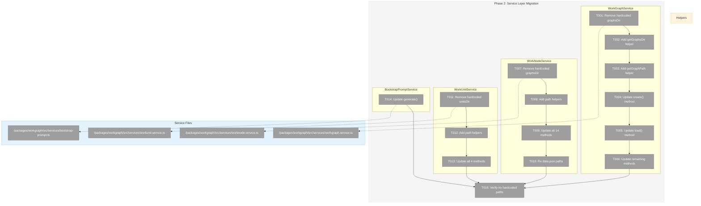
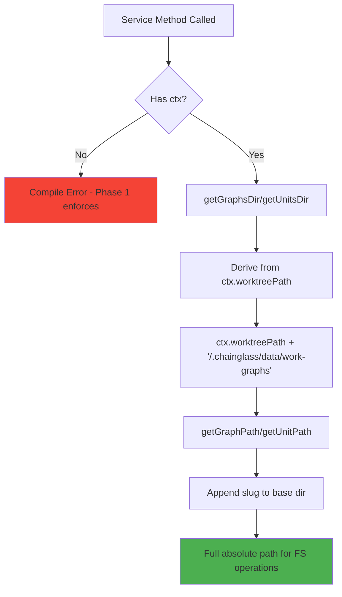
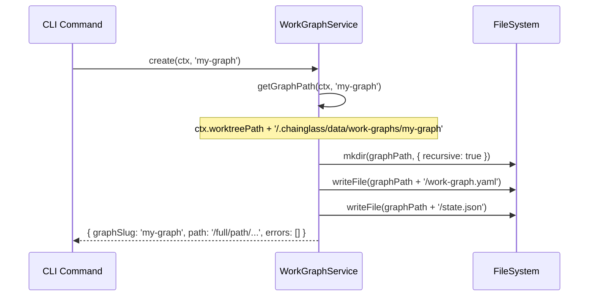

# Phase 2: Service Layer Migration – Tasks & Alignment Brief

**Spec**: [../../workgraph-workspaces-upgrade-spec.md](../../workgraph-workspaces-upgrade-spec.md)
**Plan**: [../../workgraph-workspaces-upgrade-plan.md](../../workgraph-workspaces-upgrade-plan.md)
**Date**: 2026-01-28
**Phase Slug**: `phase-2-service-layer-migration`

---

## Executive Briefing

### Purpose
This phase implements workspace-aware path resolution in all four workgraph services. After Phase 1 established the type signatures requiring `WorkspaceContext`, Phase 2 makes the services actually use that context to derive file paths. This is the core change that enables per-worktree data isolation.

### What We're Building
Updated service implementations that:
- Replace hardcoded paths (`.chainglass/work-graphs`, `.chainglass/units`) with context-derived paths
- Add helper methods: `getGraphsDir(ctx)`, `getGraphPath(ctx, slug)`, `getNodePath(ctx, ...)`, etc.
- Store all data at `<worktreePath>/.chainglass/data/work-graphs/` and `<worktreePath>/.chainglass/data/units/`
- Ensure `data.json` file references use worktree-relative paths (not absolute)

### User Value
After this phase, WorkGraphs and WorkUnits are stored in workspace-scoped locations. This enables:
- Per-worktree data isolation (different branches = different data)
- Git-native collaboration (relative paths work across machines)
- No more path collisions between workspaces

### Example
**Before** (hardcoded path):
```typescript
const graphPath = path.join('.chainglass/work-graphs', slug);
// Always: .chainglass/work-graphs/my-graph
```

**After** (context-derived path):
```typescript
const graphPath = this.getGraphPath(ctx, slug);
// Becomes: /home/user/project/.chainglass/data/work-graphs/my-graph
// (where ctx.worktreePath = '/home/user/project')
```

---

## Objectives & Scope

### Objective
Implement workspace-aware path resolution in all service implementations, making them match the updated interfaces from Phase 1.

**Behavior Checklist** (from Plan Acceptance Criteria):
- [x] All four services accept ctx as first parameter on all methods
- [x] All contract tests pass with both fake and real implementations  
- [x] `grep -r '.chainglass/work-graphs' packages/workgraph/src/services/` returns 0 matches
- [x] `grep -r '.chainglass/units' packages/workgraph/src/services/` returns 0 matches
- [x] data.json paths are worktree-relative (per Critical Discovery 05)
- [x] TypeScript strict mode passes: `just typecheck`
- [x] `pnpm build` succeeds (Phase 1 break resolved)

### Goals

- ✅ Remove hardcoded `graphsDir` and `unitsDir` fields from all services
- ✅ Add path helper methods that derive paths from WorkspaceContext
- ✅ Update all service methods to use ctx parameter
- ✅ Ensure stored paths in data.json are worktree-relative
- ✅ Restore build to passing state (fix Phase 1 break)

### Non-Goals

- ✅ **Updating fake services** - COMPLETED during this phase (27 methods updated)
- ❌ **Updating CLI commands** - deferred to Phase 4
- ❌ **Updating test files to pass different ctx values** - deferred to Phase 5
- ❌ **Moving existing fixture files** - deferred to Phase 6
- ❌ **Performance optimization** - not needed for correctness
- ❌ **Caching of resolved paths** - simple derivation is sufficient
- ❌ **Path validation beyond security checks** - existing validation preserved

---

## Architecture Map

### Component Diagram
<!-- Status: grey=pending, orange=in-progress, green=completed, red=blocked -->
<!-- Updated by plan-6 during implementation -->



### Task-to-Component Mapping

<!-- Status: ⬜ Pending | 🟧 In Progress | ✅ Complete | 🔴 Blocked -->

| Task | Component(s) | Files | Status | Comment |
|------|-------------|-------|--------|---------|
| T001 | WorkGraphService | /packages/workgraph/src/services/workgraph.service.ts | ✅ Complete | Remove `private readonly graphsDir` field |
| T002 | WorkGraphService | /packages/workgraph/src/services/workgraph.service.ts | ✅ Complete | Add `getGraphsDir(ctx)` helper |
| T003 | WorkGraphService | /packages/workgraph/src/services/workgraph.service.ts | ✅ Complete | Add `getGraphPath(ctx, slug)` helper |
| T004 | WorkGraphService | /packages/workgraph/src/services/workgraph.service.ts | ✅ Complete | Update create() to accept ctx, use helpers |
| T005 | WorkGraphService | /packages/workgraph/src/services/workgraph.service.ts | ✅ Complete | Update load() to accept ctx, use helpers |
| T006 | WorkGraphService | /packages/workgraph/src/services/workgraph.service.ts | ✅ Complete | Update show, status, addNodeAfter, removeNode |
| T007 | WorkNodeService | /packages/workgraph/src/services/worknode.service.ts | ✅ Complete | Remove `private readonly graphsDir` field |
| T008 | WorkNodeService | /packages/workgraph/src/services/worknode.service.ts | ✅ Complete | Add helpers: getNodePath, getNodeDataDir, etc. |
| T009 | WorkNodeService | /packages/workgraph/src/services/worknode.service.ts | ✅ Complete | Update all 14 methods to accept ctx |
| T010 | WorkNodeService | /packages/workgraph/src/services/worknode.service.ts | ✅ Complete | Fix data.json to use worktree-relative paths |
| T011 | WorkUnitService | /packages/workgraph/src/services/workunit.service.ts | ✅ Complete | Remove `private readonly unitsDir` field |
| T012 | WorkUnitService | /packages/workgraph/src/services/workunit.service.ts | ✅ Complete | Add getUnitsDir, getUnitPath helpers |
| T013 | WorkUnitService | /packages/workgraph/src/services/workunit.service.ts | ✅ Complete | Update list, load, create, validate |
| T014 | BootstrapPromptService | /packages/workgraph/src/services/bootstrap-prompt.ts | ✅ Complete | Already updated in Phase 1; verify works |
| T015 | All Services | /packages/workgraph/src/services/*.ts | ✅ Complete | Final grep verification |

---

## Tasks

| Status | ID | Task | CS | Type | Dependencies | Absolute Path(s) | Validation | Subtasks | Notes |
|--------|------|------|----|------|--------------|------------------|------------|----------|-------|
| [x] | T001 | Remove hardcoded `graphsDir` from WorkGraphService | 1 | Core | – | /home/jak/substrate/021-workgraph-workspaces-upgrade/packages/workgraph/src/services/workgraph.service.ts | Line 65 removed; compile fails (expected) | – | Per Critical Discovery 01 |
| [x] | T002 | Add `getGraphsDir(ctx)` helper to WorkGraphService | 2 | Core | T001 | /home/jak/substrate/021-workgraph-workspaces-upgrade/packages/workgraph/src/services/workgraph.service.ts | Helper returns `${ctx.worktreePath}/.chainglass/data/work-graphs` | – | Protected method for subclass override |
| [x] | T003 | Add `getGraphPath(ctx, slug)` helper to WorkGraphService | 1 | Core | T002 | /home/jak/substrate/021-workgraph-workspaces-upgrade/packages/workgraph/src/services/workgraph.service.ts | Helper returns full graph path | – | Uses getGraphsDir internally |
| [x] | T004 | Update WorkGraphService.create() to accept ctx and use helpers | 3 | Core | T003 | /home/jak/substrate/021-workgraph-workspaces-upgrade/packages/workgraph/src/services/workgraph.service.ts | Method signature matches interface; creates in workspace path | – | First method to update; establishes pattern |
| [x] | T005 | Update WorkGraphService.load() to accept ctx and use helpers | 2 | Core | T003 | /home/jak/substrate/021-workgraph-workspaces-upgrade/packages/workgraph/src/services/workgraph.service.ts | Method signature matches interface; loads from workspace path | – | |
| [x] | T006 | Update remaining WorkGraphService methods (show, status, addNodeAfter, removeNode) | 3 | Core | T005 | /home/jak/substrate/021-workgraph-workspaces-upgrade/packages/workgraph/src/services/workgraph.service.ts | All 6 methods accept ctx; use helpers | – | 4 more methods |
| [x] | T007 | Remove hardcoded `graphsDir` from WorkNodeService | 1 | Core | – | /home/jak/substrate/021-workgraph-workspaces-upgrade/packages/workgraph/src/services/worknode.service.ts | Line 79 removed; compile fails (expected) | – | Per Critical Discovery 01 |
| [x] | T008 | Add path helpers to WorkNodeService | 2 | Core | T007 | /home/jak/substrate/021-workgraph-workspaces-upgrade/packages/workgraph/src/services/worknode.service.ts | Helpers compile: getGraphsDir, getNodePath, getNodeDataDir, **getOutputPaths** (returns `{absolute, relative}`) | – | See **T008 Dual Path Helper** below |
| [ ] | T009 | Update all 14 WorkNodeService methods to accept ctx | 4 | Core | T008 | /home/jak/substrate/021-workgraph-workspaces-upgrade/packages/workgraph/src/services/worknode.service.ts | All methods: canRun, markReady, start, end, canEnd, getInputData, getInputFile, getOutputData, saveOutputData, saveOutputFile, clear, ask, answer, getAnswer | – | Largest task; see **T009 Internal Call Checklist** below |
| [ ] | T010 | Fix data.json to store worktree-relative paths | 3 | Core | T009 | /home/jak/substrate/021-workgraph-workspaces-upgrade/packages/workgraph/src/services/worknode.service.ts | Saved paths start with `.chainglass/data/` not absolute | – | Per Critical Discovery 05 |
| [ ] | T011 | Remove hardcoded `unitsDir` from WorkUnitService | 1 | Core | – | /home/jak/substrate/021-workgraph-workspaces-upgrade/packages/workgraph/src/services/workunit.service.ts | Line 41 removed; compile fails (expected) | – | Per Critical Discovery 01 |
| [ ] | T012 | Add path helpers to WorkUnitService | 2 | Core | T011 | /home/jak/substrate/021-workgraph-workspaces-upgrade/packages/workgraph/src/services/workunit.service.ts | Helpers compile: getUnitsDir, getUnitPath | – | |
| [ ] | T013 | Update all 4 WorkUnitService methods to accept ctx | 3 | Core | T012 | /home/jak/substrate/021-workgraph-workspaces-upgrade/packages/workgraph/src/services/workunit.service.ts | Methods: list, load, create, validate | – | |
| [ ] | T014 | Verify all services compile together | 1 | Test | T006, T010, T013 | /home/jak/substrate/021-workgraph-workspaces-upgrade/packages/workgraph/ | `pnpm build` succeeds; no TypeScript errors | – | Holistic check after all service updates (BootstrapPromptService already complete from Phase 1) |
| [ ] | T015 | Verify no hardcoded paths remain in services | 1 | Test | T006, T010, T013, T014 | /home/jak/substrate/021-workgraph-workspaces-upgrade/packages/workgraph/src/services/ | grep returns 0 matches for both patterns | – | Final validation |

### T009 Internal Call Checklist

**DYK Session Decision (2026-01-28)**: WorkNodeService internally calls WorkGraphService methods. When updating WorkNodeService to accept ctx, ALL internal calls must propagate ctx.

**Internal calls to `this.workGraphService` that need ctx:**

| Method | Internal Call | Line (approx) |
|--------|--------------|---------------|
| `canRun()` | `.status(graphSlug)` → `.status(ctx, graphSlug)` | ~125 |
| `canRun()` | `.load(graphSlug)` → `.load(ctx, graphSlug)` | ~130 |
| `markReady()` | `.status(graphSlug)` → `.status(ctx, graphSlug)` | ~205 |
| `start()` | `.status(graphSlug)` → `.status(ctx, graphSlug)` | ~268 |
| `end()` | `.status(graphSlug)` → `.status(ctx, graphSlug)` | ~388 |
| `end()` | `.load(graphSlug)` → `.load(ctx, graphSlug)` | ~425 |
| `canEnd()` | `.status(graphSlug)` → `.status(ctx, graphSlug)` | ~650 |
| `canEnd()` | `.load(graphSlug)` → `.load(ctx, graphSlug)` | ~685 |
| `getInputData()` | `.status(graphSlug)` → `.status(ctx, graphSlug)` | ~738 |
| `getInputFile()` | `.status(graphSlug)` → `.status(ctx, graphSlug)` | ~900 |
| `getOutputData()` | `.status(graphSlug)` → `.status(ctx, graphSlug)` | ~950 |
| `clear()` | `.status(graphSlug)` → `.status(ctx, graphSlug)` | ~1050 |
| `ask()` | `.status(graphSlug)` → `.status(ctx, graphSlug)` | ~1150 |
| `answer()` | `.status(graphSlug)` → `.status(ctx, graphSlug)` | ~1250 |
| `getAnswer()` | `.status(graphSlug)` → `.status(ctx, graphSlug)` | ~1350 |

**Verification**: After T009, search for `this.workGraphService.status(` and `this.workGraphService.load(` - all calls must have ctx as first arg.

### T008 Dual Path Helper

**DYK Session Decision (2026-01-28)**: `saveOutputData()` and `saveOutputFile()` need TWO paths — absolute (for FS write) and relative (for data.json storage). Use a single helper to guarantee consistency.

**Helper Signature:**

```typescript
protected getOutputPaths(
  ctx: WorkspaceContext,
  graphSlug: string,
  nodeId: string,
  fileName: string
): { absolute: string; relative: string } {
  const relative = `.chainglass/data/work-graphs/${graphSlug}/nodes/${nodeId}/outputs/${fileName}`;
  const absolute = this.pathResolver.join(ctx.worktreePath, relative);
  return { absolute, relative };
}
```

**Usage in saveOutputData/saveOutputFile:**

```typescript
const paths = this.getOutputPaths(ctx, graphSlug, nodeId, fileName);
await this.fs.writeFile(paths.absolute, content);  // Write to filesystem
savedOutputs[outputName] = { file: paths.relative };  // Store relative path
```

**Key invariant**: `paths.absolute === join(ctx.worktreePath, paths.relative)` — always true by construction.

---

## Alignment Brief

### Prior Phases Review

#### Phase 1: Interface Updates (Complete ✅)

**A. Deliverables Created**:
- `/packages/workgraph/src/interfaces/workgraph-service.interface.ts` - 6 methods updated with ctx
- `/packages/workgraph/src/interfaces/worknode-service.interface.ts` - 14 methods updated with ctx  
- `/packages/workgraph/src/interfaces/workunit-service.interface.ts` - 4 methods updated with ctx
- `/packages/workgraph/src/services/bootstrap-prompt.ts` - generate() updated with ctx
- `/packages/workgraph/package.json` - Added @chainglass/workflow dependency
- `/test/unit/workgraph/interface-contracts.test.ts` - 24 type-level assertions created
- `/test/contracts/*.contract.ts` - 3 files updated with ctx stubs

**B. Lessons Learned**:
- TDD "RED" phase for interface changes is compile error, not runtime test failure
- Contract tests break immediately when interfaces change (DYK#1)
- Build broken between Phase 1-2 is expected (DYK#4)

**C. Technical Discoveries**:
- No circular dependency when adding workflow→workgraph dependency
- 14 methods in IWorkNodeService (not 15 as initially estimated)
- Method checklist essential for large interface changes

**D. Dependencies Exported to Phase 2**:
- Method signature pattern: `methodName(ctx: WorkspaceContext, ...args): Promise<Result>`
- WorkspaceContext import: `import type { WorkspaceContext } from '@chainglass/workflow'`
- Stub context helper: `createStubContext()` with all 7 required fields

**E. Critical Findings Applied**:
- Critical Discovery 02 (no workflow dependency) → Resolved by adding dependency

**F. Incomplete Items**: None

**G. Test Infrastructure**:
- Type-level contract tests in `/test/unit/workgraph/interface-contracts.test.ts`
- Stub context helpers in all 3 contract files

**H. Technical Debt**:
- Contract test stubs don't validate ctx behavior (deferred to Phase 5)
- Build currently broken (resolved by Phase 2)

**I. Architectural Decisions**:
- Method Parameter Pattern: ctx passed as first param (not stored in constructor)
- Interface-First: Update interfaces before implementations (ADR-0004)

### Critical Findings Affecting This Phase

| Finding | Constrains | Addressed By |
|---------|------------|--------------|
| **Critical Discovery 01**: Four services have hardcoded paths | Must remove hardcoded `graphsDir`/`unitsDir` fields and add path helpers | T001, T002, T003, T007, T008, T011, T012 |
| **Critical Discovery 05**: Path storage must be worktree-relative | data.json paths must be `.chainglass/data/...` not absolute | T010 |

### ADR Decision Constraints

| ADR | Decision | Constrains | Addressed By |
|-----|----------|------------|--------------|
| **ADR-0008** | Split storage model: `<worktree>/.chainglass/data/` | Path helpers must derive from ctx.worktreePath + `.chainglass/data/` | T002, T008, T012 |
| **ADR-0004** | DI with useFactory pattern | Constructor injection preserved; ctx passed per-call | All service updates |
| **ADR-0002** | Exemplar-driven development | Follow SampleAdapter pattern for ctx usage | All tasks |

### Invariants & Guardrails

- **Path Security**: All path derivation must preserve existing validation (reject `..`, `/`, `\`)
- **No Hardcoded Paths**: After Phase 2, zero matches for `.chainglass/work-graphs` or `.chainglass/units` in services
- **Relative Paths in Storage**: data.json must store `.chainglass/data/...` paths, not absolute
- **TypeScript Strict Mode**: All changes must compile under strict mode

### Inputs to Read

| File | Purpose |
|------|---------|
| `/home/jak/substrate/021-workgraph-workspaces-upgrade/packages/workgraph/src/services/workgraph.service.ts` | WorkGraphService implementation (needs ctx) |
| `/home/jak/substrate/021-workgraph-workspaces-upgrade/packages/workgraph/src/services/worknode.service.ts` | WorkNodeService implementation (needs ctx) |
| `/home/jak/substrate/021-workgraph-workspaces-upgrade/packages/workgraph/src/services/workunit.service.ts` | WorkUnitService implementation (needs ctx) |
| `/home/jak/substrate/021-workgraph-workspaces-upgrade/packages/workgraph/src/services/bootstrap-prompt.ts` | BootstrapPromptService (partially updated in Phase 1) |
| `/home/jak/substrate/021-workgraph-workspaces-upgrade/packages/workflow/src/adapters/sample.adapter.ts` | Exemplar pattern for ctx-first methods |

### Visual Alignment Aids

#### Flow Diagram: Path Resolution



#### Sequence Diagram: create() with ctx



### Test Plan (Full TDD per Spec)

**Strategy**: Contract tests already updated with ctx stubs in Phase 1. Phase 2 makes implementations match interfaces. Tests should pass once implementations are updated.

| Test | Rationale | Fixture | Expected Output |
|------|-----------|---------|-----------------|
| `WorkGraphService.create()` creates in workspace path | Core functionality | FakeFileSystem, stub ctx | Files at `<worktreePath>/.chainglass/data/work-graphs/<slug>/` |
| `WorkGraphService.load()` loads from workspace path | Core functionality | FakeFileSystem with pre-created graph | Graph loaded from ctx-derived path |
| `WorkNodeService.saveOutputData()` stores relative paths | Per Critical Discovery 05 | FakeFileSystem | data.json contains `.chainglass/data/...` paths |
| `WorkUnitService.list()` scans workspace path | Core functionality | FakeFileSystem with units | Units found at ctx-derived path |
| Grep verification | No hardcoded paths remain | None | 0 matches |

**Mock Usage**: Fakes only (per R-TEST-007). FakeFileSystem from existing test infrastructure.

### Step-by-Step Implementation Outline

| Step | Task | Action | Validation |
|------|------|--------|------------|
| 1 | T001 | Remove `private readonly graphsDir` from WorkGraphService | Compile fails (expected) |
| 2 | T002 | Add `protected getGraphsDir(ctx): string` helper | Helper compiles |
| 3 | T003 | Add `protected getGraphPath(ctx, slug): string` helper | Helper compiles |
| 4 | T004 | Update `create(ctx, slug)` to use helpers | Method signature matches interface |
| 5 | T005 | Update `load(ctx, slug)` to use helpers | Method signature matches interface |
| 6 | T006 | Update show, status, addNodeAfter, removeNode | All 6 methods updated |
| 7 | T007 | Remove `private readonly graphsDir` from WorkNodeService | Compile fails (expected) |
| 8 | T008 | Add path helpers to WorkNodeService | Helpers compile |
| 9 | T009 | Update all 14 methods to use ctx | All methods match interface |
| 10 | T010 | Fix data.json path storage | Relative paths stored |
| 11 | T011 | Remove `private readonly unitsDir` from WorkUnitService | Compile fails (expected) |
| 12 | T012 | Add path helpers to WorkUnitService | Helpers compile |
| 13 | T013 | Update all 4 methods to use ctx | All methods match interface |
| 14 | T014 | Verify BootstrapPromptService | Already uses ctx correctly |
| 15 | T015 | Run grep verification | 0 matches |
| 16 | – | Run `pnpm build` | Build passes |
| 17 | – | Run `just test` | Tests pass |

### Commands to Run

```bash
# After each service update, verify TypeScript compiles
cd /home/jak/substrate/021-workgraph-workspaces-upgrade
just typecheck

# After all updates, verify no hardcoded paths
grep -r '\.chainglass/work-graphs' packages/workgraph/src/services/
# Expected: 0 matches

grep -r '\.chainglass/units' packages/workgraph/src/services/
# Expected: 0 matches

# Verify build passes (resolves Phase 1 break)
pnpm build

# Run tests
just test
```

### Risks & Unknowns

| Risk | Severity | Likelihood | Mitigation | Status |
|------|----------|------------|------------|--------|
| Path construction bugs | High | Medium | Careful helper implementation; grep verification | Unmitigated |
| data.json path format wrong | High | High | Explicit test for relative paths (T010) | Unmitigated |
| Missing method updates | Medium | Low | Method checklist in T009 | Unmitigated |
| Internal method calls bypass ctx | Medium | Medium | Search for this.graphsDir after removal | Unmitigated |

### Ready Check

- [x] Plan document read and understood
- [x] Phase 1 review complete (subagent)
- [x] Critical Findings mapped to tasks (01 → T001-T003,T007-T008,T011-T012; 05 → T010)
- [x] ADR constraints mapped to tasks (ADR-0008, ADR-0004, ADR-0002)
- [x] Test strategy defined (contract tests + grep verification)
- [x] Commands documented with expected outputs
- [ ] **Awaiting GO from human sponsor**

---

## Phase Footnote Stubs

_Populated by plan-6 during implementation. No stubs created during planning._

| Ref | Date | File | Description |
|-----|------|------|-------------|

---

## Evidence Artifacts

**Execution Log Location**: `/home/jak/substrate/021-workgraph-workspaces-upgrade/docs/plans/021-workgraph-workspaces-upgrade/tasks/phase-2-service-layer-migration/execution.log.md`

The execution log will document:
- Actual commands run and their output
- Decisions made during implementation
- Any deviations from the plan
- Test results with pass/fail counts
- Path helper implementations

---

## Discoveries & Learnings

_Populated during implementation by plan-6. Log anything of interest to your future self._

| Date | Task | Type | Discovery | Resolution | References |
|------|------|------|-----------|------------|------------|
| | | | | | |

**Types**: `gotcha` | `research-needed` | `unexpected-behavior` | `workaround` | `decision` | `debt` | `insight`

**What to log**:
- Things that didn't work as expected
- External research that was required
- Implementation troubles and how they were resolved
- Gotchas and edge cases discovered
- Decisions made during implementation
- Technical debt introduced (and why)
- Insights that future phases should know about

_See also: `execution.log.md` for detailed narrative._

---

## Directory Layout

```
docs/plans/021-workgraph-workspaces-upgrade/
├── workgraph-workspaces-upgrade-spec.md
├── workgraph-workspaces-upgrade-plan.md
├── research-dossier.md
├── workshops/
│   └── workspace-context-strategy.md
└── tasks/
    ├── phase-1-interface-updates/
    │   ├── tasks.md
    │   └── execution.log.md
    └── phase-2-service-layer-migration/
        ├── tasks.md                    # This file
        └── execution.log.md            # Created by plan-6
```

---

## Critical Insights Discussion

**Session**: 2026-01-28 09:32 UTC
**Context**: Phase 2 Service Layer Migration Dossier
**Analyst**: AI Clarity Agent
**Reviewer**: Development Team
**Format**: Water Cooler Conversation (5 Critical Insights)

### Insight 1: WorkNodeService Calls WorkGraphService Internally — ctx Must Propagate

**Did you know**: WorkNodeService internally calls `this.workGraphService.status()` and `this.workGraphService.load()` in almost every method. When updating WorkNodeService to accept ctx, ALL those internal calls must also pass ctx through.

**Implications**:
- T009 is bigger than it looks — 20+ internal calls need ctx propagation
- Order matters — WorkGraphService must be updated FIRST
- Risk of missed calls if not tracked explicitly

**Options Considered**:
- Option A: Sequential Service Updates (Current Plan) - Clean dependency order
- Option B: Add Internal Call Checklist to T009 - Explicit verification
- Option C: Batch WorkGraphService + WorkNodeService Together - Larger scope

**AI Recommendation**: Option B - Add Internal Call Checklist
- Reasoning: Preserves task granularity while preventing missed calls during implementation

**Discussion Summary**: User agreed that adding a checklist to T009 would help catch all internal calls without changing the overall task structure.

**Decision**: Add internal call checklist to T009 notes

**Action Items**:
- [x] Update T009 notes to reference internal call checklist
- [x] Add detailed checklist section with line numbers

**Affects**: T009 in tasks.md

---

### Insight 2: saveOutputData/saveOutputFile Need Dual Path Computation

**Did you know**: `saveOutputData()` and `saveOutputFile()` must compute TWO different paths — one absolute (for writing to filesystem) and one relative (for storing in data.json).

**Implications**:
- Two path variables needed in save methods
- Consistency requirement between absolute and relative paths
- This enables graphs to work across worktrees (git portability)

**Options Considered**:
- Option A: Compute Both Paths Inline - Clear but duplicated
- Option B: Add Helper Functions for Dual Paths - Reusable but more indirection
- Option C: Return Both Paths from Single Helper - Guaranteed consistency

**AI Recommendation**: Option C - Single helper returning `{absolute, relative}`
- Reasoning: Impossible to mismatch paths since they come from same function

**Discussion Summary**: User agreed that a single helper returning both paths guarantees consistency and provides cleaner call sites.

**Decision**: Add `getOutputPaths(ctx, graphSlug, nodeId, fileName): {absolute, relative}` helper

**Action Items**:
- [x] Update T008 acceptance criteria to include getOutputPaths
- [x] Add T008 Dual Path Helper section with signature and usage

**Affects**: T008, T010 in tasks.md

---

### Insight 3: T014 (BootstrapPromptService) May Already Be Complete

**Did you know**: BootstrapPromptService.generate() was updated in Phase 1 with ctx parameter AND already derives paths from ctx.worktreePath (lines 75-76).

**Implications**:
- T014 as written is essentially already done
- Only verification needed is that it compiles with updated WorkGraphService
- Task could be repurposed for more useful holistic check

**Options Considered**:
- Option A: Keep T014 as Verification Task - Explicit checkpoint
- Option B: Mark T014 as Complete Now - Accurate status
- Option C: Rename T014 to "Verify All Services Compile Together" - More useful

**AI Recommendation**: Option C - Holistic compile check
- Reasoning: BootstrapPromptService already complete; compile check is more valuable

**Discussion Summary**: User agreed that renaming T014 to a holistic compile verification is more useful than verifying something already done.

**Decision**: Rename T014 to "Verify all services compile together"

**Action Items**:
- [x] Update T014 description and acceptance criteria

**Affects**: T014 in tasks.md

---

### Insight 4: Path Structure Adds `/data/` Segment — Potential Breaking Change

**Did you know**: The new path structure adds a `/data/` segment that didn't exist before? Existing data in `.chainglass/work-graphs/` becomes invisible.

**Implications**:
- Existing graphs won't be found with new code
- No migration path defined (matches "no backwards compat" goal)
- E2E will create fresh data, won't catch this issue

**Options Considered**:
- Option A: Add Migration Script to Phase 6 - Preserves data but adds scope
- Option B: Document "Delete Old Data" Step - Simple and matches goal
- Option C: Let Old Data Sit (Ignore It) - Zero effort but confusing

**AI Recommendation**: Option B - Document cleanup step
- Reasoning: Matches "no legacy" goal; explicit step prevents confusion

**Discussion Summary**: User agreed to add cleanup step. Final E2E validation with manual test will confirm new paths work correctly.

**Decision**: Add task 6.1a to delete legacy directories

**Action Items**:
- [x] Add task 6.1a: `rm -rf .chainglass/work-graphs .chainglass/units`

**Affects**: Phase 6 tasks in main plan

---

### Insight 5: Build Must Be Restored Before ANY Push — Phases 1+2 Are Atomic

**Did you know**: Build is broken between Phases 1-2 (interfaces updated, services not yet). Cannot push, share branch, or pause mid-implementation.

**Implications**:
- CI will fail if pushed
- Git bisect broken at this commit
- Must complete Phase 2 in same session

**Options Considered**:
- Option A: Accept Current Risk (Status Quo) - DYK#4 already documents this
- Option B: Add Explicit Guardrail Note - Prevents mistakes
- Option C: Combine Phase 1+2 Into Single Phase - Phase 1 already done

**AI Recommendation**: Option B - Add guardrail note
- Reasoning: Cheap documentation prevents accidents

**Discussion Summary**: User chose Option A — existing DYK#4 documentation is sufficient, and we're implementing Phase 2 in this session anyway.

**Decision**: Accept current risk; proceed with Phase 2 implementation

**Action Items**: None

**Affects**: No changes needed

---

## Session Summary

**Insights Surfaced**: 5 critical insights identified and discussed
**Decisions Made**: 5 decisions reached through collaborative discussion
**Action Items Created**: 4 documentation updates completed
**Areas Updated**:
- T009: Added internal call checklist section
- T008: Added dual path helper pattern
- T014: Renamed to holistic compile check
- Phase 6: Added legacy cleanup task 6.1a

**Shared Understanding Achieved**: ✓

**Confidence Level**: High - Key implementation details clarified; ready to proceed

**Next Steps**: Implement Phase 2 using `/plan-6-implement-phase`

**Notes**: DYK session surfaced important implementation details that would have caused bugs if discovered during coding. Internal call propagation checklist and dual path helper pattern are particularly valuable additions.
