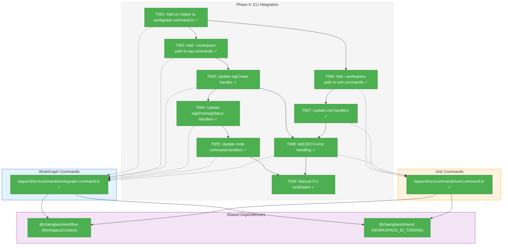
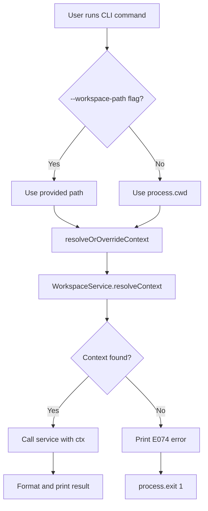
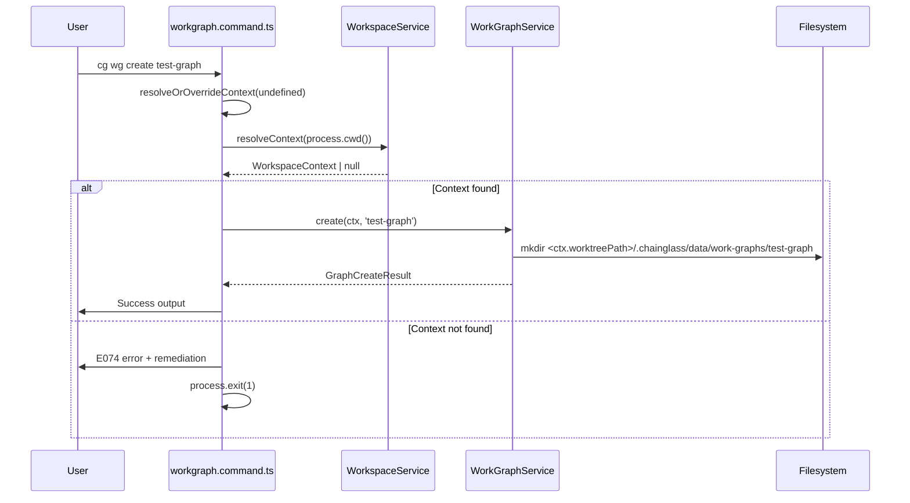

# Phase 4: CLI Integration – Tasks & Alignment Brief

**Spec**: [../../workgraph-workspaces-upgrade-spec.md](../../workgraph-workspaces-upgrade-spec.md)
**Plan**: [../../workgraph-workspaces-upgrade-plan.md](../../workgraph-workspaces-upgrade-plan.md)
**Date**: 2026-01-28

---

## Executive Briefing

### Purpose
This phase adds workspace context resolution to all workgraph CLI commands (`cg wg` and `cg unit`), enabling users to operate on workspace-scoped data. Without this, CLI commands cannot locate the correct `.chainglass/data/` directory for the user's current worktree.

### What We're Building
A `--workspace-path <path>` flag on all workgraph and unit CLI commands that:
- Resolves workspace context from CWD when flag is omitted
- Overrides with explicit path when flag is provided
- Passes resolved `WorkspaceContext` to all service calls
- Shows clear error (E074) with remediation advice when context is missing

### User Value
Users can run `cg wg create my-graph` from any registered workspace and have their data stored in the correct worktree-specific location. Power users can operate on different workspaces by providing `--workspace-path /path/to/other/workspace`.

### Example
**Before**: `cg wg create test` → Creates in hardcoded `.chainglass/work-graphs/test/`
**After**: `cg wg create test` → Creates in `<worktreePath>/.chainglass/data/work-graphs/test/`
**Override**: `cg wg create test --workspace-path /other/project` → Creates in `/other/project/.chainglass/data/work-graphs/test/`

---

## Objectives & Scope

### Objective
Add workspace context resolution to all workgraph CLI commands as specified in the plan acceptance criteria.

**Behavior Checklist** (from plan Phase 4):
- [ ] All `cg wg` commands accept `--workspace-path <path>` flag
- [ ] All `cg unit` commands accept `--workspace-path <path>` flag
- [ ] Context resolution follows `sample.command.ts` pattern
- [ ] E074 error shown with helpful message when context missing
- [ ] Commands work when CWD is in registered workspace

### Goals

- ✅ Add `resolveOrOverrideContext()` helper to workgraph command file
- ✅ Add `--workspace-path` option to all `cg wg` commands (create, show, status, node subcommands)
- ✅ Update all `cg wg` handlers to resolve and pass ctx to services
- ✅ Add `--workspace-path` option to all `cg unit` commands (list, info, create, validate)
- ✅ Update all `cg unit` handlers to resolve and pass ctx to services
- ✅ Add E074 error handling for missing context with helpful remediation message
- ✅ Verify CLI works from workspace CWD

### Non-Goals

- ❌ Adding new CLI commands (only updating existing ones)
- ❌ Test suite updates for CLI (covered in Phase 5)
- ❌ E2E validation (covered in Phase 6)
- ❌ BootstrapPromptService CLI integration (already uses ctx internally; only needs ctx passed from CLI)
- ❌ Output format changes (JSON/console adapters unchanged)
- ❌ Performance optimization (context resolution is fast enough)

---

## Architecture Map

### Component Diagram
<!-- Status: grey=pending, orange=in-progress, green=completed, red=blocked -->
<!-- Updated by plan-6 during implementation -->



### Task-to-Component Mapping

<!-- Status: ⬜ Pending | 🟧 In Progress | ✅ Complete | 🔴 Blocked -->

| Task | Component(s) | Files | Status | Comment |
|------|-------------|-------|--------|---------|
| T001 | Context Helper | /apps/cli/src/commands/workgraph.command.ts | ✅ Complete | Added resolveOrOverrideContext() following sample.command.ts pattern |
| T002 | WG Option Registration | /apps/cli/src/commands/workgraph.command.ts | ✅ Complete | Added --workspace-path option to all wg commands |
| T003 | WG Create Handler | /apps/cli/src/commands/workgraph.command.ts | ✅ Complete | Updated handleWgCreate to resolve ctx and pass to service |
| T004 | WG Show/Status Handlers | /apps/cli/src/commands/workgraph.command.ts | ✅ Complete | Updated handleWgShow, handleWgStatus handlers |
| T005 | Node Command Handlers | /apps/cli/src/commands/workgraph.command.ts | ✅ Complete | Updated all 18 node command handlers |
| T005a | BootstrapPromptService DI | /packages/shared/src/di-tokens.ts, /packages/workgraph/src/container.ts | ✅ Complete | Registered BootstrapPromptService in DI per ADR-0004 |
| T006 | Unit Option Registration | /apps/cli/src/commands/unit.command.ts | ✅ Complete | Added --workspace-path option to all unit commands |
| T007 | Unit Handlers | /apps/cli/src/commands/unit.command.ts | ✅ Complete | Updated all 4 unit handlers to resolve ctx |
| T008 | E074 Error Handling | Both command files | ✅ Complete | Added consistent error handling with helpful message |
| T009 | Manual Verification | N/A | ✅ Complete | Tested CLI from /tmp (E074), with --workspace-path, and from workspace CWD |

---

## Tasks

| Status | ID | Task | CS | Type | Dependencies | Absolute Path(s) | Validation | Subtasks | Notes |
|--------|------|------|-----|------|--------------|------------------|------------|----------|-------|
| [x] | T001 | Add imports and resolveOrOverrideContext() helper to workgraph.command.ts following sample.command.ts pattern (lines 113-117) | 2 | Setup | – | /home/jak/substrate/021-workgraph-workspaces-upgrade/apps/cli/src/commands/workgraph.command.ts | Helper compiles, returns WorkspaceContext or null | – | Per Critical Discovery 03 |
| [x] | T002 | Add `--workspace-path <path>` option to BaseOptions interface, wg commands (create, show, status), AND `node` subcommand group | 2 | Core | T001 | /home/jak/substrate/021-workgraph-workspaces-upgrade/apps/cli/src/commands/workgraph.command.ts | Option parsed, available in options object for all commands including node subcommands | – | Add to `node` parent for inheritance. **FALLBACK**: If Commander.js doesn't propagate option to node subcommands, add `.option()` to each of the 18 node subcommands explicitly |
| [x] | T003 | Update handleWgCreate handler to resolve context and pass ctx to service.create() | 2 | Core | T002 | /home/jak/substrate/021-workgraph-workspaces-upgrade/apps/cli/src/commands/workgraph.command.ts | Service called with ctx as first param | – | |
| [x] | T004 | Update handleWgShow and handleWgStatus handlers to resolve context and pass ctx | 2 | Core | T003 | /home/jak/substrate/021-workgraph-workspaces-upgrade/apps/cli/src/commands/workgraph.command.ts | Both handlers use ctx | – | |
| [x] | T005 | Update all node command handlers (18 handlers) to resolve context and pass ctx to services | 2 | Core | T004, T005a | /home/jak/substrate/021-workgraph-workspaces-upgrade/apps/cli/src/commands/workgraph.command.ts | All node handlers pass ctx; exec handler resolves BootstrapPromptService from DI | – | 18 handlers but same pattern - mechanical repetition; exec handler uses DI-resolved service |
| [x] | T005a | Register BootstrapPromptService in DI container with token WORKGRAPH_DI_TOKENS.BOOTSTRAP_PROMPT_SERVICE | 2 | Setup | T001 | /home/jak/substrate/021-workgraph-workspaces-upgrade/packages/shared/src/di-tokens.ts, /home/jak/substrate/021-workgraph-workspaces-upgrade/packages/workgraph/src/container.ts | Token exists, service registered, resolvable from container | – | Per ADR-0004: Services resolved from containers, not instantiated directly |
| [x] | T006 | Add imports and resolveOrOverrideContext() helper to unit.command.ts, add --workspace-path option to all unit commands | 2 | Core | T001 | /home/jak/substrate/021-workgraph-workspaces-upgrade/apps/cli/src/commands/unit.command.ts | Helper exists, option parsed on list, info, create, validate | – | |
| [x] | T007 | Update all unit handlers (list, info, create, validate) to resolve context and pass ctx | 2 | Core | T006 | /home/jak/substrate/021-workgraph-workspaces-upgrade/apps/cli/src/commands/unit.command.ts | All 4 handlers pass ctx to service calls | – | |
| [x] | T008 | Add E074 error handling with remediation message pattern to both command files | 2 | Core | T003, T007 | /home/jak/substrate/021-workgraph-workspaces-upgrade/apps/cli/src/commands/workgraph.command.ts, /home/jak/substrate/021-workgraph-workspaces-upgrade/apps/cli/src/commands/unit.command.ts | Missing context shows E074 with "Run: cg workspace list" advice | – | Per Critical Discovery 08 |
| [x] | T009 | Manual verification: test CLI from workspace CWD and with --workspace-path flag | 1 | Validation | T005, T008 | N/A | Commands work from workspace CWD; --workspace-path overrides context | – | |

---

## Alignment Brief

### Prior Phases Review

#### Phase 1: Interface Updates (COMPLETE)
**Deliverables Created:**
- Updated all 4 service interfaces to accept `ctx: WorkspaceContext` as first parameter
- `/packages/workgraph/src/interfaces/workgraph-service.interface.ts` (6 methods)
- `/packages/workgraph/src/interfaces/worknode-service.interface.ts` (14 methods)
- `/packages/workgraph/src/interfaces/workunit-service.interface.ts` (4 methods)
- `/packages/workgraph/src/services/bootstrap-prompt.ts` (generate method)
- Contract tests in `/test/unit/workgraph/interface-contracts.test.ts` (24 type assertions)
- Added `@chainglass/workflow` dependency to workgraph package

**Dependencies Exported for Phase 4:**
- All service methods now require `ctx: WorkspaceContext` as first parameter
- CLI MUST resolve context before calling any service method
- Pattern: `service.create(ctx, slug)` not `service.create(slug)`

**Lessons Learned:**
- Contract tests stubbed ctx during Phase 1; full behavioral testing deferred to Phase 5
- Build broken between Phase 1-2 (expected); no such window for Phase 4

#### Phase 2: Service Layer Migration (COMPLETE)
**Deliverables Created:**
- All 4 services now use ctx-derived paths via helper methods
- Path helpers: `getGraphsDir(ctx)`, `getGraphPath(ctx, slug)`, `getOutputPaths(ctx, graphSlug, nodeId, fileName)`
- Data stored at `<worktreePath>/.chainglass/data/work-graphs/` and `<worktreePath>/.chainglass/data/units/`
- Fake services accept `_ctx` parameter (stubbed, not using composite keys yet)

**Dependencies Exported for Phase 4:**
- Services expect `ctx.worktreePath` to be a valid absolute path
- All service calls require ctx as first param: `service.create(ctx, 'slug')`
- BootstrapPromptService.generate() requires ctx in its options

**Lessons Learned:**
- Internal method calls propagate ctx; CLI is the source of ctx
- Dual-path helper pattern ensures consistency (absolute for FS, relative for data.json)

#### Phase 3: Fake Service Updates (COMPLETE)
**Deliverables Created:**
- All fake services use composite keys `${ctx.worktreePath}|${slug}` for workspace isolation
- `getCalls()` now includes ctx in recorded calls for test assertions
- Test helper: `/test/helpers/workspace-context.ts` with `createTestWorkspaceContext()`
- 11 isolation tests in `/test/unit/workgraph/fake-workspace-isolation.test.ts`

**Dependencies Exported for Phase 4:**
- Fakes ready for multi-workspace testing
- Test infrastructure available for CLI tests in Phase 5
- Pattern established for asserting ctx: `expect(calls[0].ctx.worktreePath).toBe('/workspace')`

**Lessons Learned:**
- Full fake support added for `getAnswer()` method
- Reset bug fixed (presetCanEndResults.clear())
- 129 pre-existing unit test failures documented for Phase 5 migration

#### Cross-Phase Summary
**Cumulative Architecture:**
1. Interfaces define ctx-first signatures (Phase 1)
2. Services implement ctx-derived paths (Phase 2)
3. Fakes provide workspace isolation for testing (Phase 3)
4. **CLI resolves ctx and passes to services (Phase 4 - THIS PHASE)**

**Pattern Evolution:**
- Phase 1: Type-level enforcement (ctx parameter required)
- Phase 2: Runtime path derivation (ctx.worktreePath → `.chainglass/data/`)
- Phase 3: Test isolation (composite keys in fakes)
- Phase 4: User-facing integration (CLI resolves ctx from CWD or flag)

### Critical Findings Affecting This Phase

**🚨 Critical Discovery 03: CLI Already Supports --workspace-path Pattern**
- **Finding**: Sample commands have `--workspace-path`; workgraph commands do not
- **Constrains**: Must follow `sample.command.ts` pattern exactly for consistency
- **Addressed by**: T001, T002, T006 - Copy pattern from sample.command.ts lines 100-117

**🟡 Medium Discovery 08: Error Code Allocation Is Safe**
- **Finding**: Workgraph uses E101-E199; workspace uses E074-E081
- **Constrains**: Reuse E074 for "No workspace context" error, not new codes
- **Addressed by**: T008 - Use existing E074 code for context errors

### ADR Decision Constraints

**ADR-0008: Workspace Split Storage Data Model – Accepted**
- **Decision**: Split storage with global registry (`~/.config/`) and per-worktree data (`<worktree>/.chainglass/data/`)
- **Constraints Affecting This Phase**:
  - CLI must resolve context using WorkspaceContextResolver from registry
  - Data paths use `ctx.worktreePath`, not hardcoded CWD
  - Per IMP-003: WorkspaceContext includes both `mainRepoPath` and `worktreePath`
- **Addressed by**: T001-T008 (all tasks follow this model)

**ADR-0004: Dependency Injection Container Architecture – Accepted**
- **Decision**: Services resolved from DI containers, not instantiated directly
- **Constraints Affecting This Phase**:
  - Use `createCliProductionContainer()` to resolve services
  - Use `WORKSPACE_DI_TOKENS.WORKSPACE_SERVICE` for context resolver
- **Addressed by**: T001 - Follow existing pattern in workgraph.command.ts

### Invariants & Guardrails

- **Context Required**: All service calls MUST include ctx as first parameter
- **Error Code**: Missing context MUST return E074, not new error codes
- **Flag Name**: Use `--workspace-path` (matching sample.command.ts for consistency)
- **Helper Pattern**: Use `resolveOrOverrideContext(options.worktree)` pattern
- **Exit Behavior**: Missing context → print E074 error → `process.exit(1)`

### Inputs to Read

| File | Purpose | Lines of Interest |
|------|---------|-------------------|
| `/apps/cli/src/commands/sample.command.ts` | Pattern template | 100-117 (resolveOrOverrideContext), 131-153 (E074 handling) |
| `/apps/cli/src/commands/workgraph.command.ts` | Target file for wg | 163-203 (handlers), 637-922 (registration) |
| `/apps/cli/src/commands/unit.command.ts` | Target file for unit | 109-173 (handlers), 190-237 (registration) |
| `/packages/workgraph/src/interfaces/*.ts` | Service signatures | All methods require ctx |

### Visual Alignment Aids

#### Flow Diagram: Context Resolution



#### Sequence Diagram: wg create Command



### Test Plan

**Testing Approach**: Full TDD (per spec)
**Mock Usage**: Fakes Only (per R-TEST-007)

Phase 4 focuses on CLI integration; formal test suite updates deferred to Phase 5. Manual verification (T009) validates end-to-end flow.

**Validation Strategy for Phase 4:**
1. TypeScript compilation passes
2. Commands parse --workspace-path flag correctly (manual test)
3. E074 error appears when outside workspace (manual test)
4. Service calls receive ctx parameter (verified by type system)

**Tests to Add in Phase 5:**
| Test | Rationale | Fixture |
|------|-----------|---------|
| wg create with --workspace-path | Verifies flag override works | FakeWorkGraphService |
| wg create without context | Verifies E074 error | Mock resolver returning null |
| unit list with context | Verifies ctx passed to list() | FakeWorkUnitService |

### Step-by-Step Implementation Outline

1. **T001**: Add imports and helper function
   - Import `WorkspaceContext` from `@chainglass/workflow`
   - Import `WORKSPACE_DI_TOKENS` from `@chainglass/shared`
   - Add `getWorkspaceService()` helper (copy from sample.command.ts)
   - Add `resolveOrOverrideContext()` helper (copy from sample.command.ts)

2. **T002**: Add --workspace-path option to interfaces and registrations
   - Update `BaseOptions` interface to include `worktree?: string`
   - Add `.option('--workspace-path <path>', 'Override workspace context')` to wg commands

3. **T003-T004**: Update graph command handlers
   - Add ctx resolution at start of each handler
   - Handle null ctx with E074 error
   - Pass ctx to service calls

4. **T005**: Update node command handlers (largest task)
   - Same pattern as T003-T004 for all 18 node handlers
   - Special case: exec handler must pass ctx to BootstrapPromptService

5. **T006-T007**: Unit command file updates
   - Same pattern as workgraph file
   - 4 handlers: list, info, create, validate

6. **T008**: E074 error handling consistency
   - Ensure error message includes remediation advice
   - Match sample.command.ts pattern exactly

7. **T009**: Manual verification
   - Test from workspace CWD
   - Test with --workspace-path flag
   - Test outside workspace (expect E074)

### Commands to Run

```bash
# ⚠️ PHASE 4 WORKFLOW: Skip full test suite (129 pre-existing failures from Phase 2-3)
# Use this instead of `just fft`:
just lint && just format && just typecheck

# Build to verify no circular deps
pnpm build

# Run ONLY the passing tests (contract + isolation)
pnpm vitest run test/unit/workgraph/interface-contracts.test.ts test/unit/workgraph/fake-workspace-isolation.test.ts

# Manual CLI verification (after implementation)
cd /path/to/registered/workspace
cg wg create test-cli-integration
cg wg show test-cli-integration
cg unit list

# Test --workspace-path flag
cg wg create test-override --workspace-path /other/workspace

# Test E074 error (run from non-workspace directory)
cd /tmp
cg wg create should-fail
# Expected: E074 error with "Run: cg workspace list" advice
```

**Note**: Full test suite (`just test`) will fail with 129 errors until Phase 5 migrates tests to use `createTestWorkspaceContext()`. TypeScript compilation provides sufficient safety net for CLI changes.

### Risks/Unknowns

| Risk | Severity | Likelihood | Mitigation |
|------|----------|------------|------------|
| WorkspaceService not available in production container | High | Low | Verify container includes workspace registration; check sample.command.ts works |
| Node command handlers have complex option inheritance | Medium | Medium | Carefully propagate --workspace-path through parent command chain |
| BootstrapPromptService.generate() signature mismatch | Medium | Low | Verify generate() accepts ctx in options object per Phase 2 updates |

### Ready Check

- [x] ADR constraints mapped to tasks (ADR-0008, ADR-0004 → T001-T008)
- [ ] Prior phase execution logs reviewed
- [ ] Pattern template (sample.command.ts) accessible
- [ ] Target files identified with line numbers
- [ ] Complexity scores assigned (CS 1-3)
- [ ] All handlers enumerated (3 wg + 18 node + 4 unit = 25 handlers)

---

## Phase Footnote Stubs

_To be populated by plan-6 during implementation._

| # | Description | Task | File:Line |
|---|-------------|------|-----------|
| | | | |

---

## Evidence Artifacts

**Execution Log**: `./execution.log.md` (created by plan-6)

**Supporting Files**:
- Modified: `/apps/cli/src/commands/workgraph.command.ts`
- Modified: `/apps/cli/src/commands/unit.command.ts`

**Directory Layout**:
```
docs/plans/021-workgraph-workspaces-upgrade/
├── workgraph-workspaces-upgrade-plan.md
├── workgraph-workspaces-upgrade-spec.md
└── tasks/
    ├── phase-1-interface-updates/
    │   ├── tasks.md
    │   └── execution.log.md
    ├── phase-2-service-layer-migration/
    │   ├── tasks.md
    │   └── execution.log.md
    ├── phase-3-fake-service-updates/
    │   ├── tasks.md
    │   └── execution.log.md
    └── phase-4-cli-integration/
        ├── tasks.md           # ← This file
        └── execution.log.md   # ← Created by plan-6
```

---

## Discoveries & Learnings

_Populated during implementation by plan-6. Log anything of interest to your future self._

| Date | Task | Type | Discovery | Resolution | References |
|------|------|------|-----------|------------|------------|
| | | | | | |

**Types**: `gotcha` | `research-needed` | `unexpected-behavior` | `workaround` | `decision` | `debt` | `insight`

**What to log**:
- Things that didn't work as expected
- External research that was required
- Implementation troubles and how they were resolved
- Gotchas and edge cases discovered
- Decisions made during implementation
- Technical debt introduced (and why)
- Insights that future phases should know about

_See also: `execution.log.md` for detailed narrative._

---

## Critical Insights Discussion

**Session**: 2026-01-28 11:38 UTC
**Context**: Phase 4: CLI Integration Tasks & Alignment Brief
**Analyst**: AI Clarity Agent
**Reviewer**: Development Team
**Format**: Water Cooler Conversation (5 Critical Insights)

### Insight 1: Flag Name Inconsistency (`--worktree` vs `--workspace-path`)

**Did you know**: The plan specified `--worktree` but sample.command.ts uses `--workspace-path`, creating UX inconsistency across CLI commands.

**Implications**:
- Users would need to remember different flags for different commands
- Documentation complexity increases
- Tab-completion becomes inconsistent

**Options Considered**:
- Option A: Stick with `--worktree` per Plan - Accept inconsistency
- Option B: Use `--workspace-path` to Match Sample - Consistent UX
- Option C: Alias Both - Maximum compatibility

**AI Recommendation**: Option B - Use `--workspace-path`
- Reasoning: Consistency across CLI commands is more important than subtle naming distinctions.

**Discussion Summary**: User agreed that consistency with existing sample.command.ts is more important than precise terminology.

**Decision**: Use `--workspace-path` (matching sample.command.ts)

**Action Items**:
- [x] Updated all `--worktree` references to `--workspace-path` in tasks.md

**Affects**: T002, T006, T008, T009

---

### Insight 2: T005 Complexity Mismatch (CS-3 for Repetitive Work)

**Did you know**: T005 is marked CS-3 but involves 18 nearly-identical handler updates following the same pattern.

**Implications**:
- High line count but low cognitive load
- Risk is typos, not design complexity
- Only exec handler is truly different (BootstrapPromptService)

**Options Considered**:
- Option A: Keep CS-3, Document Repetitive Nature
- Option B: Re-score to CS-2 with Note - Accurate signal
- Option C: Split into T005a (standard) + T005b (exec)

**AI Recommendation**: Option B - Re-score to CS-2 with note
- Reasoning: CS-2 "small task" better reflects actual cognitive load.

**Discussion Summary**: User agreed the complexity was overstated for mechanical repetition.

**Decision**: Re-score T005 to CS-2 with note about repetitive nature

**Action Items**:
- [x] Updated T005 CS from 3 to 2
- [x] Added note explaining "18 handlers but same pattern"

**Affects**: T005 in tasks table

---

### Insight 3: BootstrapPromptService Bypasses DI (ADR-0004 Violation)

**Did you know**: `handleNodeExec` creates BootstrapPromptService with `new` instead of resolving from DI container, violating ADR-0004.

**Implications**:
- Only service in workgraph.command.ts that bypasses DI
- Testing requires mocking 3 dependencies
- Inconsistent with "services resolved from containers" principle

**Options Considered**:
- Option A: Accept Inline Instantiation - Minimal change
- Option B: Register in DI Container - ADR-0004 compliance
- Option C: Document as Technical Debt - Fix later

**AI Recommendation**: Option A - Accept inline (Phase 2 designed for this)
- Reasoning: ctx goes in options object, works with current code.

**Discussion Summary**: User strongly disagreed - "it should never skip DI". ADR compliance is non-negotiable.

**Decision**: Register BootstrapPromptService in DI container

**Action Items**:
- [x] Added new task T005a for DI registration
- [x] Updated T005 dependencies to include T005a

**Affects**: T005, tasks table (new T005a task)

---

### Insight 4: Commander.js Option Inheritance for Nested Commands

**Did you know**: The triple-nested command structure (`cg wg node <cmd>`) requires careful option registration - Commander.js may not propagate `--workspace-path` to node subcommands automatically.

**Implications**:
- If added only to `wg`, node subcommands won't see the option
- Need to add to `node` parent OR each of 18 handlers
- Commander.js inheritance behavior needs verification

**Options Considered**:
- Option A: Add to `node` Subcommand Group - DRY, single place
- Option B: Add to Each Node Subcommand - Guaranteed to work
- Option C: Belt and Suspenders - Add to both

**AI Recommendation**: Option A - Add to `node` subcommand group
- Reasoning: DRY approach, Commander.js supports option inheritance.

**Discussion Summary**: User chose Option A with explicit fallback instructions if inheritance doesn't work.

**Decision**: Add to `node` parent with documented fallback

**Action Items**:
- [x] Updated T002 to include `node` subcommand group
- [x] Added FALLBACK note for explicit registration if needed

**Affects**: T002 in tasks table

---

### Insight 5: 129 Pre-existing Test Failures Block `just fft`

**Did you know**: 129 unit tests fail because they pass `undefined` for `ctx.worktreePath`, blocking our standard `just fft` workflow during Phase 4.

**Implications**:
- Can't use normal development loop
- Risk of not noticing new breakage amid noise
- Phase 5 becomes hard blocker

**Options Considered**:
- Option A: Skip Tests During Phase 4 - Use lint/format/typecheck only
- Option B: Run Only Contract + Isolation Tests - Partial validation
- Option C: Fix 129 Tests Now - Pull Phase 5 forward

**AI Recommendation**: Option A - Skip tests, fix in Phase 5
- Reasoning: Matches plan structure, TypeScript catches most CLI errors.

**Discussion Summary**: User agreed to defer test fixes to Phase 5 as planned.

**Decision**: Use `just lint && just format && just typecheck` during Phase 4

**Action Items**:
- [x] Updated Commands section with Phase 4 workflow
- [x] Added note explaining 129 pre-existing failures

**Affects**: Commands to Run section

---

## Session Summary

**Insights Surfaced**: 5 critical insights identified and discussed
**Decisions Made**: 5 decisions reached through collaborative discussion
**Action Items Created**: 6 updates applied to tasks.md
**Areas Requiring Updates**:
- All updates applied during session

**Shared Understanding Achieved**: ✓

**Confidence Level**: High - Key risks identified and mitigated, ADR compliance enforced

**Next Steps**:
Proceed to implementation with GO command

**Notes**:
- New task T005a added (DI registration for BootstrapPromptService)
- Phase 4 workflow differs from standard `just fft` due to pre-existing test failures
- Flag name standardized to `--workspace-path` for consistency
