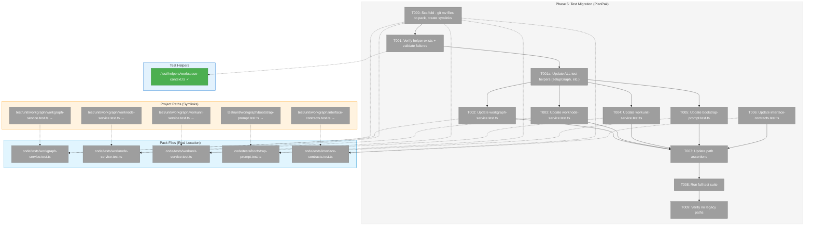

# Phase 5: Test Migration – Tasks & Alignment Brief

**Spec**: [../../workgraph-workspaces-upgrade-spec.md](../../workgraph-workspaces-upgrade-spec.md)
**Plan**: [../../workgraph-workspaces-upgrade-plan.md](../../workgraph-workspaces-upgrade-plan.md)
**Date**: 2026-01-28
**Mode**: PlanPak (code lives in pack, symlinked to project)

---

## Executive Briefing

### Purpose
This phase fixes the 138 test failures introduced by Phases 1-4 where service method signatures changed to require `WorkspaceContext` as the first parameter. Tests currently call `service.create('slug')` but services now require `service.create(ctx, 'slug')`.

### What We're Building
A systematic migration of all workgraph test files to:
- Add `WorkspaceContext` imports and create a `wsCtx` variable in each test context
- Update all 141 service method calls to pass `wsCtx` as the first argument
- Update path assertions from `.chainglass/work-graphs/` to `.chainglass/data/work-graphs/`
- Verify test helper `createTestWorkspaceContext()` is used consistently

### User Value
A green test suite validates that the workspace-aware service layer works correctly. Without passing tests, we cannot confidently proceed to E2E validation (Phase 6).

### Example
**Before** (failing):
```typescript
const ctx = createTestContext(); // {fs, service, yamlParser}
const result = await ctx.service.create('my-workflow');
expect(result.path).toContain('.chainglass/work-graphs/');
```

**After** (passing):
```typescript
const ctx = createTestContext(); // {fs, service, yamlParser, wsCtx}
const result = await ctx.service.create(ctx.wsCtx, 'my-workflow');
expect(result.path).toContain('.chainglass/data/work-graphs/');
```

---

## Objectives & Scope

### Objective
Update all test files to pass `WorkspaceContext` as the first parameter to service methods and use new path prefixes.

**Behavior Checklist** (from plan Phase 5):
- [ ] All test files updated to pass ctx
- [ ] createTestWorkspaceContext() helper used consistently
- [ ] `grep -r '.chainglass/work-graphs' test/` returns 0 matches (except in validation tests)
- [ ] `just test` passes with all 66+ tests
- [ ] Contract tests verify fake-real parity

### Goals

- ✅ Update `createTestContext()` in all service test files to include `wsCtx`
- ✅ Update all 71 `ctx.service.*()` calls in workgraph-service.test.ts
- ✅ Update all 66 `ctx.service.*()` calls in worknode-service.test.ts  
- ✅ Update all 15 `service.*()` calls in workunit-service.test.ts
- ✅ Update all 4 `ctx.service.*()` calls in bootstrap-prompt.test.ts
- ✅ Update path assertions from `.chainglass/work-graphs/` to `.chainglass/data/work-graphs/`
- ✅ Update path assertions from `.chainglass/units/` to `.chainglass/data/units/`
- ✅ Run full test suite to verify 0 failures

### Non-Goals

- ❌ Writing new tests (only migrating existing ones)
- ❌ Refactoring test structure (preserve existing patterns)
- ❌ Performance optimization
- ❌ CLI test updates (CLI tests would need mock workspace context; defer if any exist)
- ❌ E2E test updates (covered in Phase 6)

---

## Architecture Map

### Component Diagram
<!-- Status: grey=pending, orange=in-progress, green=completed, red=blocked -->
<!-- Updated by plan-6 during implementation -->
<!-- PlanPak Mode: Files in pack (code/tests/), symlinked to project paths -->



### Task-to-Component Mapping

<!-- Status: ⬜ Pending | 🟧 In Progress | ✅ Complete | 🔴 Blocked -->
<!-- PlanPak: Pack files are at code/tests/, symlinked from test/unit/workgraph/ -->

| Task | Component(s) | Pack File(s) | Symlink Target(s) | Status | Comment |
|------|-------------|--------------|-------------------|--------|---------|
| T000 | Scaffolding | code/tests/*.test.ts | test/unit/workgraph/*.test.ts | ⬜ Pending | PlanPak: git mv to pack, create symlinks, add provenance headers |
| T001 | Test Helper + Validation | — | /test/helpers/workspace-context.ts | ⬜ Pending | DYK#3: Run parallel subagents to get actual failure counts per file |
| T001a | Test Setup Helpers | code/tests/*.test.ts | test/unit/workgraph/*.test.ts | ⬜ Pending | DYK#1: Update setupGraph(), setupUnit(), etc. to use absolute + new paths FIRST |
| T002 | WorkGraphService Tests | code/tests/workgraph-service.test.ts | test/unit/workgraph/workgraph-service.test.ts | ⬜ Pending | 71 service calls + path assertions |
| T003 | WorkNodeService Tests | code/tests/worknode-service.test.ts | test/unit/workgraph/worknode-service.test.ts | ⬜ Pending | 66 service calls + path assertions |
| T004 | WorkUnitService Tests | code/tests/workunit-service.test.ts | test/unit/workgraph/workunit-service.test.ts | ⬜ Pending | 15 service calls + path assertions |
| T005 | BootstrapPrompt Tests | code/tests/bootstrap-prompt.test.ts | test/unit/workgraph/bootstrap-prompt.test.ts | ⬜ Pending | 4 service calls |
| T006 | Contract Tests | code/tests/interface-contracts.test.ts | test/unit/workgraph/interface-contracts.test.ts | ⬜ Pending | Verify ctx stubs are valid |
| T007 | Path Assertions | All pack test files | — | ⬜ Pending | DYK#5: Old path NOT substring of new - ALL assertions must update |
| T008 | Full Test Suite | N/A | N/A | ⬜ Pending | Run `just test` or `pnpm vitest run` |
| T009 | Legacy Path Verification | N/A | N/A | ⬜ Pending | Grep for old paths, ensure none remain |

---

## Tasks

<!-- PlanPak Mode: Files physically located in code/tests/, symlinked from test/unit/workgraph/ -->
<!-- Pack path: docs/plans/021-workgraph-workspaces-upgrade/code/tests/ -->
<!-- Symlink targets: test/unit/workgraph/*.test.ts -->

| Status | ID | Task | CS | Type | Dependencies | Pack Path(s) / Symlink Target(s) | Validation | Subtasks | Notes |
|--------|------|------|-----|------|--------------|-----------------------------------|------------|----------|-------|
| [ ] | T000 | **PlanPak Scaffold**: git mv 5 test files to pack, create symlinks, add provenance headers, validate symlinks resolve | 1 | Setup | – | **Pack**: code/tests/{workgraph-service,worknode-service,workunit-service,bootstrap-prompt,interface-contracts}.test.ts **Symlinks**: test/unit/workgraph/*.test.ts → pack | All 5 symlinks resolve (`test -L && test -e`); vitest can find tests; `readlink` shows pack path | – | PlanPak mandatory first task |
| [ ] | T001 | Verify createTestWorkspaceContext() helper exists; run each test file individually (via parallel subagents) to document actual failure counts per file | 1 | Setup | T000 | /home/jak/substrate/021-workgraph-workspaces-upgrade/test/helpers/workspace-context.ts | Import succeeds; failure counts documented for each file; identify which files need migration vs already pass | – | DYK#3: Use parallel subagents to validate all 9 test files simultaneously |
| [ ] | T001a | Update ALL test helper functions (setupGraph, setupUnit, etc.) to use absolute paths with new .chainglass/data/ prefix | 2 | Core | T001 | **Pack**: code/tests/workgraph-service.test.ts, code/tests/worknode-service.test.ts, code/tests/workunit-service.test.ts | All setupGraph(), setupUnit(), setupNode() helpers use `${ctx.wsCtx.worktreePath}/.chainglass/data/` paths | – | DYK#1: Must fix helpers BEFORE service calls or tests still fail |
| [ ] | T002 | Update workgraph-service.test.ts: Add wsCtx to TestContext, update all 71 service calls | 3 | Core | T001a | **Pack**: code/tests/workgraph-service.test.ts | All create/load/show/status calls pass wsCtx as first arg | – | Largest file (1406 LOC) |
| [ ] | T003 | Update worknode-service.test.ts: Add wsCtx to TestContext, update all 66 service calls, ensure fake setPreset* calls use SAME wsCtx | 3 | Core | T001a | **Pack**: code/tests/worknode-service.test.ts | All node operation calls pass wsCtx as first arg; fake setup uses matching ctx | – | DYK#4: Fakes use composite keys - wsCtx in setPreset* MUST match wsCtx in service calls |
| [ ] | T004 | Update workunit-service.test.ts: Add `let wsCtx` at module level (not TestContext pattern), initialize in beforeEach, update all 15 service calls | 2 | Core | T001a | **Pack**: code/tests/workunit-service.test.ts | All list/load/create/validate calls pass wsCtx as first arg | – | DYK#2: Uses different pattern - module-level variables, NOT ctx.service |
| [ ] | T005 | Update bootstrap-prompt.test.ts: Add wsCtx, update 4 service.generate() calls | 2 | Core | T001a | **Pack**: code/tests/bootstrap-prompt.test.ts | All generate() calls pass wsCtx as first arg | – | |
| [ ] | T006 | Review interface-contracts.test.ts: Verify ctx stubs satisfy WorkspaceContext | 1 | Validation | T000 | **Pack**: code/tests/interface-contracts.test.ts | Tests pass, stubs are valid | – | May already be correct |
| [ ] | T007 | Update ALL path assertions in test files from `.chainglass/work-graphs/` → `.chainglass/data/work-graphs/` and `.chainglass/units/` → `.chainglass/data/units/` | 2 | Core | T002, T003, T004, T005 | **Pack**: All test files in code/tests/ | All assertions use new paths; grep confirms no old path references | – | DYK#5: Old path is NOT substring of new - ALL assertions must change (toContain AND toBe) |
| [ ] | T008 | Run full test suite: `pnpm vitest run` | 1 | Validation | T007 | N/A | 0 failures, 2200+ tests pass | – | |
| [ ] | T009 | Verify no legacy paths remain: grep for .chainglass/work-graphs and .chainglass/units | 1 | Validation | T008 | N/A | grep returns 0 matches in test/ (except comments/docs) | – | |

---

## Alignment Brief

### Prior Phases Review

#### Phase 1: Interface Updates (✅ Complete)
**Deliverables:**
- All 4 service interfaces updated to accept `ctx: WorkspaceContext` as first parameter (25 methods total)
- Files: `/packages/workgraph/src/interfaces/workgraph-service.interface.ts`, `worknode-service.interface.ts`, `workunit-service.interface.ts`, `/packages/workgraph/src/services/bootstrap-prompt.ts`
- Contract tests in `/test/unit/workgraph/interface-contracts.test.ts` use stub context

**Dependencies Exported:**
- Method signature pattern: `methodName(ctx: WorkspaceContext, ...args): Promise<Result>`
- ctx-first parameter position enforced at type level

**Lessons Learned:**
- Contract tests needed stubbing during transition; Phase 5 must verify stubs are still valid
- Build broken between Phase 1-2 was expected

---

#### Phase 2: Service Layer Migration (✅ Complete)
**Deliverables:**
- All 4 production services migrated to use ctx-derived paths
- Path helpers: `getGraphsDir(ctx)`, `getGraphPath(ctx, slug)`, `getOutputPaths(ctx, gSlug, nId, file)` returning `{absolute, relative}`
- Files: `/packages/workgraph/src/services/workgraph.service.ts`, `worknode.service.ts`, `workunit.service.ts`, `bootstrap-prompt.ts`

**Technical Debt Identified:**
- **Fakes accepted but ignored ctx** - Phase 3 fixed this with composite keys
- **Test files still call services without ctx** - Phase 5 must fix

**Path Pattern Change:**
- OLD: `.chainglass/work-graphs/`, `.chainglass/units/`
- NEW: `.chainglass/data/work-graphs/`, `.chainglass/data/units/`

---

#### Phase 3: Fake Service Updates (✅ Complete)
**Deliverables:**
- All 3 fake services use composite keys (`${ctx.worktreePath}|${slug}`)
- Call recording includes ctx for test assertions
- Files: `/packages/workgraph/src/fakes/fake-workgraph-service.ts`, `fake-worknode-service.ts`, `fake-workunit-service.ts`
- 11 isolation tests in `/test/unit/workgraph/fake-workspace-isolation.test.ts`

**Dependencies Exported:**
- `createTestWorkspaceContext()` helper at `/test/helpers/workspace-context.ts`
- Fake setPreset* methods accept ctx as first parameter
- getCalls() returns ctx for inspection

**Key Pattern:**
```typescript
import { createTestWorkspaceContext } from '../../helpers/workspace-context.js';
const wsCtx = createTestWorkspaceContext('/test/worktree');
await fake.create(wsCtx, 'slug');
```

---

#### Phase 4: CLI Integration (✅ Complete)
**Deliverables:**
- All 25 CLI handlers updated with ctx resolution
- `--workspace-path` flag on all workgraph and unit commands
- E074 error handling for missing context
- BootstrapPromptService registered in DI container

**Technical Debt Deferred to Phase 5:**
- 138 test failures where tests pass undefined for `ctx.worktreePath`
- Tests need `wsCtx` added to TestContext and passed to all service calls

**Root Cause of 138 Failures:**
```
TypeError: The "path" argument must be of type string. Received undefined
❯ FakePathResolver.join packages/shared/src/fakes/fake-path-resolver.ts:114:17
❯ WorkUnitService.getUnitsDir packages/workgraph/src/services/workunit.service.ts:58:30
```
Services call `ctx.worktreePath` which is undefined because tests don't pass WorkspaceContext.

---

### PlanPak Configuration (Trial Mode)

**What is PlanPak?**
Code lives inside the plan folder ("pack") and is symlinked to the real project locations. The plan is the durable artifact; code can be traced back to which plan produced it.

**Pack Structure:**
```
docs/plans/021-workgraph-workspaces-upgrade/
  ├── code/
  │   └── tests/                          # Test files live here (REAL location)
  │       ├── workgraph-service.test.ts
  │       ├── worknode-service.test.ts
  │       ├── workunit-service.test.ts
  │       ├── bootstrap-prompt.test.ts
  │       └── interface-contracts.test.ts
  └── tasks/phase-5-test-migration/
      ├── tasks.md                        # This file
      └── execution.log.md                # Created by plan-6
```

**Symlink Targets (Project Paths):**
```
test/unit/workgraph/
  ├── workgraph-service.test.ts  → ../../docs/plans/021-workgraph-workspaces-upgrade/code/tests/workgraph-service.test.ts
  ├── worknode-service.test.ts   → ...
  ├── workunit-service.test.ts   → ...
  ├── bootstrap-prompt.test.ts   → ...
  └── interface-contracts.test.ts → ...
```

**Provenance Header (added to each file):**
```typescript
// THIS FILE IS SYMLINKED from docs/plans/021-workgraph-workspaces-upgrade/code/tests/<filename>.test.ts
// Plan: docs/plans/021-workgraph-workspaces-upgrade/workgraph-workspaces-upgrade-plan.md
```

**T000 Commands:**
```bash
# 1. Create pack directory (already done)
mkdir -p docs/plans/021-workgraph-workspaces-upgrade/code/tests

# 2. Move files to pack (preserves git history)
git mv test/unit/workgraph/workgraph-service.test.ts docs/plans/021-workgraph-workspaces-upgrade/code/tests/
git mv test/unit/workgraph/worknode-service.test.ts docs/plans/021-workgraph-workspaces-upgrade/code/tests/
git mv test/unit/workgraph/workunit-service.test.ts docs/plans/021-workgraph-workspaces-upgrade/code/tests/
git mv test/unit/workgraph/bootstrap-prompt.test.ts docs/plans/021-workgraph-workspaces-upgrade/code/tests/
git mv test/unit/workgraph/interface-contracts.test.ts docs/plans/021-workgraph-workspaces-upgrade/code/tests/

# 3. Create symlinks from project paths to pack
ln -sf ../../../docs/plans/021-workgraph-workspaces-upgrade/code/tests/workgraph-service.test.ts test/unit/workgraph/workgraph-service.test.ts
ln -sf ../../../docs/plans/021-workgraph-workspaces-upgrade/code/tests/worknode-service.test.ts test/unit/workgraph/worknode-service.test.ts
ln -sf ../../../docs/plans/021-workgraph-workspaces-upgrade/code/tests/workunit-service.test.ts test/unit/workgraph/workunit-service.test.ts
ln -sf ../../../docs/plans/021-workgraph-workspaces-upgrade/code/tests/bootstrap-prompt.test.ts test/unit/workgraph/bootstrap-prompt.test.ts
ln -sf ../../../docs/plans/021-workgraph-workspaces-upgrade/code/tests/interface-contracts.test.ts test/unit/workgraph/interface-contracts.test.ts

# 4. Add provenance headers to each file in pack
# (prepend to each .test.ts file)

# 5. Validate symlinks
for f in test/unit/workgraph/{workgraph-service,worknode-service,workunit-service,bootstrap-prompt,interface-contracts}.test.ts; do
  test -L "$f" && test -e "$f" && echo "OK: $f" || echo "BROKEN: $f"
done

# 6. Verify vitest can find the tests
pnpm vitest run test/unit/workgraph/workgraph-service.test.ts --dry-run
```

**Rollback (if PlanPak trial fails):**
```bash
# Remove symlinks
rm test/unit/workgraph/{workgraph-service,worknode-service,workunit-service,bootstrap-prompt,interface-contracts}.test.ts

# Move files back
git mv docs/plans/021-workgraph-workspaces-upgrade/code/tests/*.test.ts test/unit/workgraph/

# Remove provenance headers (manual or sed)
```

---

### Critical Findings Affecting This Phase

**Per Critical Discovery 01 (Plan § 3):**
- Services derive paths from `ctx.worktreePath`
- Tests MUST provide valid worktreePath in ctx

**Per Critical Discovery 05 (Plan § 3):**
- New path prefix: `.chainglass/data/work-graphs/`
- Test assertions must be updated to expect new paths

**Per ADR-0008:**
- Split storage model: `<worktree>/.chainglass/data/`
- Tests should use `/test/worktree` as worktreePath (arbitrary but consistent)

---

### Test File Analysis

| File | LOC | Service Calls | Call Pattern | Complexity |
|------|-----|---------------|--------------|------------|
| workgraph-service.test.ts | 1406 | 71 | `ctx.service.method(...)` | High - large file |
| worknode-service.test.ts | 2433 | 66 | `ctx.service.method(...)` | High - largest file |
| workunit-service.test.ts | 451 | 15 | `service.method(...)` (no ctx prefix) | Medium |
| bootstrap-prompt.test.ts | 176 | 4 | `ctx.service.generate(...)` | Low |
| interface-contracts.test.ts | 291 | 0 | Uses createStubContext() | Low - may be fine |
| fake-workspace-isolation.test.ts | 224 | 0 | Already uses createTestWorkspaceContext() | ✅ Done |

**Total Service Calls to Update:** ~156 calls across 4 test files

---

### Implementation Pattern

For files using `ctx.service.method(...)` pattern (workgraph-service.test.ts, worknode-service.test.ts, bootstrap-prompt.test.ts):

**Step 1: Add import and wsCtx to createTestContext()**
```typescript
import { createTestWorkspaceContext } from '../../helpers/workspace-context.js';

interface TestContext {
  fs: FakeFileSystem;
  pathResolver: FakePathResolver;
  yamlParser: FakeYamlParser;
  service: WorkGraphService;
  wsCtx: WorkspaceContext;  // ADD THIS
}

function createTestContext(): TestContext {
  const fs = new FakeFileSystem();
  const pathResolver = new FakePathResolver();
  const yamlParser = new FakeYamlParser();
  const wsCtx = createTestWorkspaceContext('/test/worktree');  // ADD THIS
  
  // Configure FakeFileSystem with worktree-based paths
  fs.setCwd(wsCtx.worktreePath);  // OPTIONAL: helps with relative path resolution
  
  const service = new WorkGraphService(fs, pathResolver, yamlParser);
  return { fs, pathResolver, yamlParser, service, wsCtx };  // ADD wsCtx
}
```

**Step 2: Update all service calls**
```typescript
// BEFORE
const result = await ctx.service.create('my-workflow');

// AFTER
const result = await ctx.service.create(ctx.wsCtx, 'my-workflow');
```

---

### T004 Special Pattern (workunit-service.test.ts)

**DYK#2**: This file uses module-level variables, NOT the `ctx.service` pattern. Migration is different:

**Step 1: Add wsCtx at module level with other variables**
```typescript
import { createTestWorkspaceContext } from '../../helpers/workspace-context.js';
import type { WorkspaceContext } from '@chainglass/workflow';

let fs: FakeFileSystem;
let pathResolver: FakePathResolver;
let yamlParser: FakeYamlParser;
let service: WorkUnitService;
let wsCtx: WorkspaceContext;  // ADD THIS

beforeEach(() => {
  fs = new FakeFileSystem();
  pathResolver = new FakePathResolver();
  yamlParser = new FakeYamlParser();
  wsCtx = createTestWorkspaceContext('/test/worktree');  // ADD THIS
  service = new WorkUnitService(fs, pathResolver, yamlParser);
  
  // Set up base units directory - USE NEW PATH
  fs.setDir(`${wsCtx.worktreePath}/.chainglass/data/units`);  // UPDATED
});
```

**Step 2: Update all service calls (no ctx prefix)**
```typescript
// BEFORE
const result = await service.list();

// AFTER  
const result = await service.list(wsCtx);
```

---

### T003 Critical: Fake Service ctx Consistency (DYK#4)

**worknode-service.test.ts uses FakeWorkGraphService and FakeWorkUnitService as dependencies.**

Phase 3 fakes use composite keys (`${ctx.worktreePath}|${slug}`). If the `ctx` used in setup differs from the `ctx` used in service calls, lookups fail silently.

**Rule: Use the SAME wsCtx instance for everything.**

```typescript
beforeEach(() => {
  // Create wsCtx ONCE
  ctx = createTestContext();  // includes wsCtx
  
  // Use ctx.wsCtx for ALL fake setup
  fakeWorkGraphService.setPresetStatusResult(ctx.wsCtx, 'test-graph', {
    graphSlug: 'test-graph',
    graphStatus: 'in_progress',
    nodes: [...],
    errors: [],
  });
  
  fakeWorkUnitService.setPresetLoadResult(ctx.wsCtx, 'write-poem', {
    unit: WRITE_POEM_UNIT,
    errors: [],
  });
});

it('should check if node can run', async () => {
  // Use SAME ctx.wsCtx for service calls
  const result = await ctx.service.canRun(ctx.wsCtx, 'test-graph', 'node-id');
  //                                       ^^^^^^^^ Must match setup!
});
```

**What happens if ctx doesn't match:**
- `setPresetStatusResult(ctxA, 'slug', result)` stores at key `"/workspace-a|slug"`
- `service.status(ctxB, 'slug')` looks up key `"/workspace-b|slug"`
- Lookup fails → returns default/undefined → test fails mysteriously

---

**Step 3: Update setupGraph() and path assertions**
```typescript
// BEFORE
function setupGraph(ctx: TestContext, slug: string, ...) {
  const graphPath = `.chainglass/work-graphs/${slug}`;
  ctx.fs.setDir(graphPath);
  ...
}

// AFTER
function setupGraph(ctx: TestContext, slug: string, ...) {
  const graphPath = `${ctx.wsCtx.worktreePath}/.chainglass/data/work-graphs/${slug}`;
  ctx.fs.setDir(graphPath);
  ...
}
```

---

### Test Plan

**Strategy:** Lightweight testing (per spec preference)
- No new tests required
- Migrating existing tests to pass ctx
- Contract tests already validate signatures

**Validation Steps:**
1. After each file migration, run: `pnpm vitest run test/unit/workgraph/<file>.test.ts`
2. After all migrations, run full suite: `pnpm vitest run`
3. Verify no legacy paths: `grep -r '\.chainglass/work-graphs' test/unit/workgraph/`

---

### Commands to Run

**T001: Parallel Validation (use subagents for speed)**

Launch 9 parallel task subagents, one per test file:
```bash
# Each subagent runs one of these:
pnpm vitest run test/unit/workgraph/workgraph-service.test.ts 2>&1 | tail -5
pnpm vitest run test/unit/workgraph/worknode-service.test.ts 2>&1 | tail -5
pnpm vitest run test/unit/workgraph/workunit-service.test.ts 2>&1 | tail -5
pnpm vitest run test/unit/workgraph/bootstrap-prompt.test.ts 2>&1 | tail -5
pnpm vitest run test/unit/workgraph/interface-contracts.test.ts 2>&1 | tail -5
pnpm vitest run test/unit/workgraph/fake-workspace-isolation.test.ts 2>&1 | tail -5
pnpm vitest run test/unit/workgraph/cycle-detection.test.ts 2>&1 | tail -5
pnpm vitest run test/unit/workgraph/node-id.test.ts 2>&1 | tail -5
pnpm vitest run test/unit/workgraph/container-registration.test.ts 2>&1 | tail -5
```

Expected output format per subagent: "Tests: X failed | Y passed"
Compile results into table showing which files need migration.

---

**After each file migration - validate specific file**
pnpm vitest run test/unit/workgraph/workgraph-service.test.ts
pnpm vitest run test/unit/workgraph/worknode-service.test.ts
pnpm vitest run test/unit/workgraph/workunit-service.test.ts
pnpm vitest run test/unit/workgraph/bootstrap-prompt.test.ts

# Full validation
pnpm vitest run

# Check for legacy paths
grep -rn '\.chainglass/work-graphs' test/unit/workgraph/ --include="*.ts"
grep -rn '\.chainglass/units' test/unit/workgraph/ --include="*.ts"

# Check for new paths (should have matches)
grep -rn '\.chainglass/data/work-graphs' test/unit/workgraph/ --include="*.ts"
```

---

### Risks & Mitigations

| Risk | Likelihood | Impact | Mitigation |
|------|------------|--------|------------|
| Missing service calls | Medium | Medium | Use grep to find all `service.method(` patterns |
| Path helper changes break tests | Low | Medium | Update setupGraph(), setupUnit() helpers |
| Test file too large to edit efficiently | Medium | Low | Use systematic find/replace patterns |
| FakeFileSystem path resolution issues | Low | Medium | Ensure wsCtx.worktreePath is consistent |

---

### Ready Check

- [ ] Phase 4 complete (all 138 failures documented)
- [ ] createTestWorkspaceContext() helper exists at /test/helpers/workspace-context.ts
- [ ] Test file structure understood (5 files to move to pack)
- [ ] Path change pattern documented (old → new)
- [ ] Validation commands prepared
- [ ] PlanPak directories created (code/tests/)
- [ ] T000 scaffolding commands ready

**Await explicit GO before implementation.**

---

## Phase Footnote Stubs

| ID | Date | Description | Files Changed | FlowSpace Node |
|----|------|-------------|---------------|----------------|
| | | | | |

_To be populated by plan-6 during implementation._

---

## Evidence Artifacts

- **Execution Log**: `./execution.log.md` (created by plan-6)
- **Test Results**: Will capture `pnpm vitest run` output showing 0 failures
- **Grep Verification**: Will capture grep output showing no legacy paths

---

## Discoveries & Learnings

_Populated during implementation by plan-6. Log anything of interest to your future self._

| Date | Task | Type | Discovery | Resolution | References |
|------|------|------|-----------|------------|------------|
| | | | | | |

**Types**: `gotcha` | `research-needed` | `unexpected-behavior` | `workaround` | `decision` | `debt` | `insight`

**What to log**:
- Things that didn't work as expected
- External research that was required
- Implementation troubles and how they were resolved
- Gotchas and edge cases discovered
- Decisions made during implementation
- Technical debt introduced (and why)
- Insights that future phases should know about

_See also: `execution.log.md` for detailed narrative._

---

## Directory Layout

```
docs/plans/021-workgraph-workspaces-upgrade/
  ├── workgraph-workspaces-upgrade-plan.md
  ├── workgraph-workspaces-upgrade-spec.md
  ├── code/                               ← PlanPak: code lives here
  │   └── tests/                          ← Test files (REAL location)
  │       ├── workgraph-service.test.ts   ← Moved here by T000
  │       ├── worknode-service.test.ts
  │       ├── workunit-service.test.ts
  │       ├── bootstrap-prompt.test.ts
  │       └── interface-contracts.test.ts
  └── tasks/
      ├── phase-1-interface-updates/
      │   ├── tasks.md
      │   └── execution.log.md
      ├── phase-2-service-layer-migration/
      │   ├── tasks.md
      │   └── execution.log.md
      ├── phase-3-fake-service-updates/
      │   ├── tasks.md
      │   └── execution.log.md
      ├── phase-4-cli-integration/
      │   ├── tasks.md
      │   └── execution.log.md
      └── phase-5-test-migration/          ← YOU ARE HERE
          ├── tasks.md                     ← This file
          └── execution.log.md             ← Created by plan-6

test/unit/workgraph/                       ← Project paths (SYMLINKS)
  ├── workgraph-service.test.ts  → ../../../docs/plans/.../code/tests/
  ├── worknode-service.test.ts   → ...
  ├── workunit-service.test.ts   → ...
  ├── bootstrap-prompt.test.ts   → ...
  ├── interface-contracts.test.ts → ...
  ├── cycle-detection.test.ts              ← NOT moved (not modified by this phase)
  ├── node-id.test.ts                      ← NOT moved
  ├── container-registration.test.ts       ← NOT moved
  └── fake-workspace-isolation.test.ts     ← NOT moved (already Phase 3 compliant)
```

---

## Critical Insights Discussion

**Session**: 2026-01-28 20:41 UTC
**Context**: Phase 5 Test Migration Dossier for Plan 021-workgraph-workspaces-upgrade
**Analyst**: AI Clarity Agent
**Reviewer**: Development Team
**Format**: Water Cooler Conversation (5 Critical Insights)

### Insight 1: setupGraph() Helper Creates Hidden Migration Trap

**Did you know**: Updating service calls to pass `wsCtx` will still fail because `setupGraph()` configures FakeFileSystem at the OLD path location.

**Implications**:
- T002-T005 would fail even after adding wsCtx to service calls
- setupGraph() uses relative paths without worktreePath prefix
- Same issue exists for setupUnit() and any other path setup helpers

**Options Considered**:
- Option A: Add T002a/T003a tasks for helper updates per file
- Option B: Fold helper updates into T002-T005 task descriptions
- Option C: Create single T001a task for ALL helper updates first

**AI Recommendation**: Option C - Centralized Helper Update Task
- Reasoning: Sequential dependency - no service calls work until helpers fixed; DRY principle

**Discussion Summary**: User agreed that centralizing helper updates prevents repeated work and makes dependencies clear.

**Decision**: Add T001a task to update ALL test helper functions before T002-T005

**Action Items**:
- [x] Added T001a task to tasks table
- [x] Updated dependencies: T002-T005 now depend on T001a
- [x] Updated Architecture Map with T001a node

**Affects**: Tasks table, Architecture Map, task dependencies

---

### Insight 2: workunit-service.test.ts Uses Different Test Pattern

**Did you know**: workunit-service.test.ts uses module-level variables (`let service`), not the `ctx.service` pattern used in other test files.

**Implications**:
- T004 implementation pattern differs from T002/T003/T005
- Need `let wsCtx` at module level, not in TestContext
- Service calls are `service.method(wsCtx, ...)` not `ctx.service.method(ctx.wsCtx, ...)`

**Options Considered**:
- Option A: Refactor workunit-service.test.ts to match other files
- Option B: Minimal migration - just add wsCtx variable
- Option C: Document the difference, no pattern change

**AI Recommendation**: Option B + C Combined
- Reasoning: Minimal risk during migration; pattern consistency is separate concern

**Discussion Summary**: User agreed to keep scope tight and avoid unnecessary refactoring.

**Decision**: Minimal migration with documented difference in T004

**Action Items**:
- [x] Updated T004 description to note different pattern
- [x] Added "T004 Special Pattern" implementation section

**Affects**: T004 task description, Implementation Pattern section

---

### Insight 3: 138 Failures Include Tests That Don't Need Migration

**Did you know**: The 138 failures are concentrated in just 4 files; several test files (fake-workspace-isolation, cycle-detection, node-id) likely already pass.

**Implications**:
- T006 (interface-contracts.test.ts) might be unnecessary
- Actual scope is ~4 files, not 9
- Can validate incrementally per file

**Options Considered**:
- Option A: Run tests file-by-file first to verify actual failures
- Option B: Keep current plan, discover during implementation
- Option C: Add validation step to T001 with parallel subagents

**AI Recommendation**: Option C - Add Validation to T001
- Reasoning: Evidence-based approach; parallel subagents make it fast

**Discussion Summary**: User agreed and suggested using parallel subagents to speed up validation.

**Decision**: Add file-by-file validation to T001 using parallel subagents

**Action Items**:
- [x] Updated T001 to include file-by-file validation
- [x] Added parallel subagent commands to Commands section
- [x] Added DYK#3 tag for parallel strategy

**Affects**: T001 task description, Commands to Run section

---

### Insight 4: FakeWorkGraphService and FakeWorkNodeService ctx Consistency

**Did you know**: worknode-service.test.ts uses fake services as dependencies, and Phase 3 fakes use composite keys requiring ctx to match between setup and service calls.

**Implications**:
- `setPresetStatusResult(ctxA, slug, result)` + `service.status(ctxB, slug)` = silent failure
- Must use SAME wsCtx instance for fake setup AND service calls
- Mismatched ctx causes mysterious test failures

**Options Considered**:
- Option A: Use same wsCtx instance everywhere
- Option B: Create helper for fake setup
- Option C: Document the gotcha, use consistent wsCtx

**AI Recommendation**: Option A + C Combined
- Reasoning: Phase 3 designed fakes this way; simple rule with documentation

**Discussion Summary**: User agreed that simple rule + documentation is sufficient.

**Decision**: Use same wsCtx instance everywhere with documented requirement

**Action Items**:
- [x] Updated T003 description with ctx consistency requirement
- [x] Added "T003 Critical: Fake Service ctx Consistency" section
- [x] Added DYK#4 tag

**Affects**: T003 task description, Implementation Pattern section

---

### Insight 5: Path Assertion Substring Analysis Error

**Did you know**: The old path `.chainglass/work-graphs/` is NOT a substring of the new path `.chainglass/data/work-graphs/` - the `data/` segment breaks the match.

**Implications**:
- ALL path assertions must be updated (both toContain and toBe)
- T007 is absolutely necessary, not optional
- Cannot rely on substring tolerance

**Options Considered**:
- Option A: Keep T007 as dedicated task
- Option B: Merge path assertion updates into T002-T005

**AI Recommendation**: Option B - Merge into per-file tasks
- Reasoning: Single pass per file is more efficient

**Discussion Summary**: AI initially claimed old path was substring (incorrect). User challenged this. AI corrected and revised recommendation. User chose Option A for clear separation of concerns.

**Decision**: Keep T007 as dedicated path assertion update task

**Action Items**:
- [x] Updated T007 description with explicit path replacements
- [x] Added DYK#5 tag explaining why ALL assertions must change

**Affects**: T007 task description

---

## Session Summary

**Insights Surfaced**: 5 critical insights identified and discussed
**Decisions Made**: 5 decisions reached through collaborative discussion
**Action Items Created**: 0 new follow-up tasks (all addressed via dossier updates)
**DYK Tags Added**: 5 (DYK#1 through DYK#5 for quick reference)

**Areas Updated**:
- T001: Added file-by-file validation with parallel subagents
- T001a: NEW TASK - Centralized helper function updates
- T003: Added ctx consistency requirement for fake services
- T004: Documented different test pattern (module-level variables)
- T007: Clarified that ALL path assertions must change
- Implementation Pattern section: Added T004 Special Pattern and T003 Critical sections
- Commands section: Added parallel subagent validation commands
- Architecture Map: Added T001a node and updated dependencies

**Shared Understanding Achieved**: ✓

**Confidence Level**: High - All critical gotchas identified and documented

**Next Steps**:
Await explicit GO to begin Phase 5 implementation

**Notes**:
- Insight #5 caught an analysis error (substring claim was wrong) - good example of human review value
- Parallel subagent strategy for T001 validation should significantly speed up initial assessment

