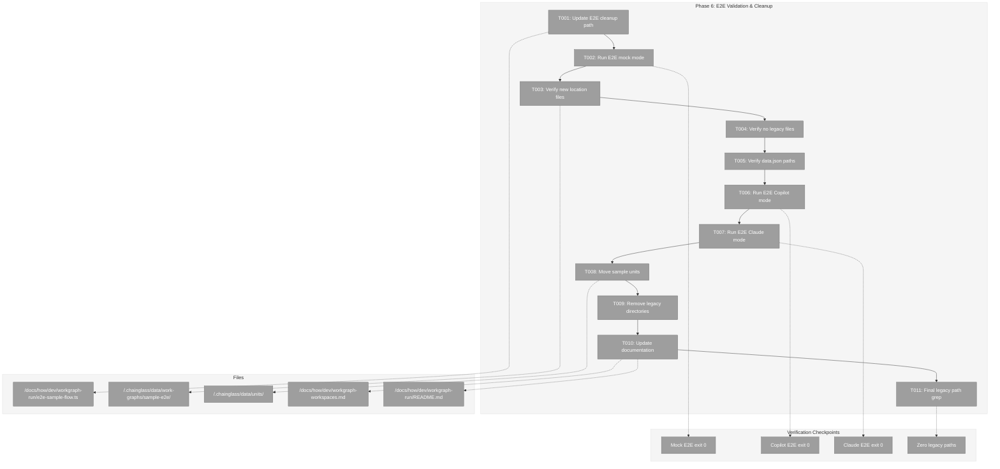
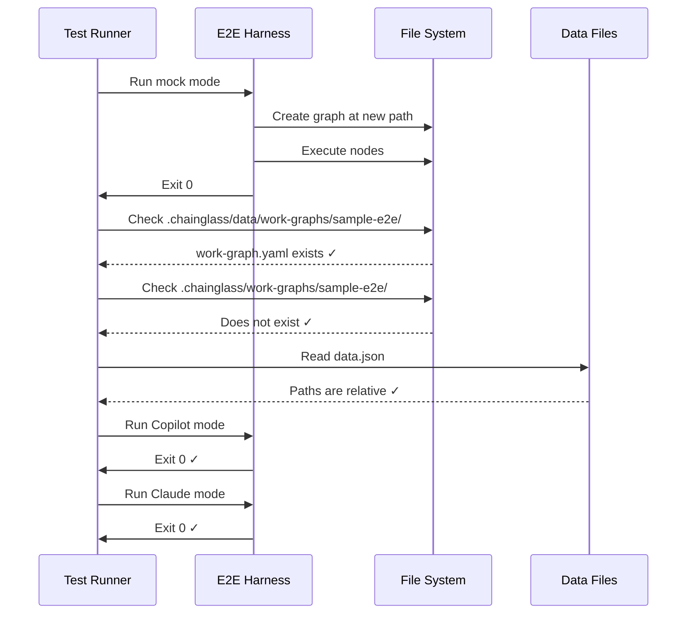

# Phase 6: E2E Validation & Cleanup – Tasks & Alignment Brief

**Spec**: [../../workgraph-workspaces-upgrade-spec.md](../../workgraph-workspaces-upgrade-spec.md)
**Plan**: [../../workgraph-workspaces-upgrade-plan.md](../../workgraph-workspaces-upgrade-plan.md)
**Date**: 2026-01-28

---

## Executive Briefing

### Purpose
This phase validates the complete workspace integration by running the E2E test harness with new paths, confirming that all workgraph data is stored in workspace-scoped locations, and cleaning up any legacy path artifacts.

### What We're Building
End-to-end validation that:
- Updates E2E harness to use new `.chainglass/data/work-graphs/` paths
- Runs E2E in non-agent mock mode to confirm basic flow
- Runs E2E in real agent modes (Copilot and Claude) to validate full integration
- Moves sample units to workspace-scoped location
- Removes legacy directory structures
- Updates documentation

### User Value
After this phase, the WorkGraph system is fully workspace-aware. Users can:
- Store graphs per-worktree for branch isolation
- Commit graphs to git for collaboration
- Use `--workspace-path` flag for multi-workspace CLI operations

### Example
**Before**: `cg wg create test` → `.chainglass/work-graphs/test/`
**After**: `cg wg create test` → `<worktree>/.chainglass/data/work-graphs/test/`

---

## Objectives & Scope

### Objective
Validate complete implementation with E2E harness and remove legacy artifacts.

### Goals

- ✅ Update E2E harness `cleanup()` function to use new path
- ✅ Run E2E test in non-agent mode (exit code 0)
- ✅ Run E2E test in Copilot agent mode (exit code 0)
- ✅ Run E2E test in Claude agent mode (exit code 0)
- ✅ Verify files created in new `.chainglass/data/work-graphs/` location
- ✅ Verify data.json paths are worktree-relative (not absolute)
- ✅ Move sample units to `.chainglass/data/units/`
- ✅ Remove legacy directories
- ✅ Update documentation

### Non-Goals

- ❌ Adding new E2E test scenarios (validation only)
- ❌ Performance optimization
- ❌ Web UI integration
- ❌ Migration tooling (clean break design)
- ❌ Adding backward compatibility

---

## Architecture Map

### Component Diagram
<!-- Status: grey=pending, orange=in-progress, green=completed, red=blocked -->
<!-- Updated by plan-6 during implementation -->



### Task-to-Component Mapping

<!-- Status: ⬜ Pending | 🟧 In Progress | ✅ Complete | 🔴 Blocked -->

| Task | Component(s) | Files | Status | Comment |
|------|-------------|-------|--------|---------|
| T001 | E2E Harness | e2e-sample-flow.ts | ⬜ Pending | Update cleanup() path from `.chainglass/work-graphs/` to `.chainglass/data/work-graphs/` |
| T002 | E2E Harness | – | ⬜ Pending | Run mock mode, verify exit 0 |
| T003 | Verification | .chainglass/data/ | ⬜ Pending | Verify files in new location |
| T004 | Verification | .chainglass/work-graphs/ | ⬜ Pending | Verify NO files in legacy location |
| T005 | Verification | data.json | ⬜ Pending | Check paths are worktree-relative |
| T006 | E2E Harness | – | ⬜ Pending | Run Copilot agent mode |
| T007 | E2E Harness | – | ⬜ Pending | Run Claude agent mode |
| T008 | Data Migration | .chainglass/units/ | ⬜ Pending | git mv to new location |
| T009 | Cleanup | Legacy dirs | ⬜ Pending | Remove old paths |
| T010 | Documentation | docs/how/ | ⬜ Pending | Update architecture docs |
| T011 | Verification | packages/ | ⬜ Pending | Final grep for legacy paths |

---

## Tasks

| Status | ID | Task | CS | Type | Dependencies | Absolute Path(s) | Validation | Subtasks | Notes |
|--------|-----|------|-----|------|--------------|------------------|------------|----------|-------|
| [ ] | T001 | Update E2E harness cleanup() to use new path `.chainglass/data/work-graphs/` | 1 | Fix | – | /home/jak/substrate/021-workgraph-workspaces-upgrade/docs/how/dev/workgraph-run/e2e-sample-flow.ts | Line 122 shows `.chainglass/data/work-graphs/` | – | Per Critical Discovery 06 |
| [ ] | T002 | Run E2E test in mock (non-agent) mode | 2 | Validation | T001 | /home/jak/substrate/021-workgraph-workspaces-upgrade/docs/how/dev/workgraph-run/e2e-sample-flow.ts | Exit code 0, output shows "TEST PASSED" | – | First validation checkpoint |
| [ ] | T003 | Verify files created in new `.chainglass/data/work-graphs/sample-e2e/` location | 1 | Validation | T002 | /home/jak/substrate/021-workgraph-workspaces-upgrade/.chainglass/data/work-graphs/sample-e2e/ | work-graph.yaml and state.json exist | – | |
| [ ] | T004 | Verify NO files in legacy `.chainglass/work-graphs/sample-e2e/` location | 1 | Validation | T002 | /home/jak/substrate/021-workgraph-workspaces-upgrade/.chainglass/work-graphs/ | Directory does not contain sample-e2e | – | |
| [ ] | T005 | Verify data.json paths are worktree-relative with new prefix | 1 | Validation | T003 | /home/jak/substrate/021-workgraph-workspaces-upgrade/.chainglass/data/work-graphs/sample-e2e/nodes/*/data/data.json | Paths contain `.chainglass/data/work-graphs/`, NOT absolute paths | – | Per Critical Discovery 05 |
| [ ] | T006 | Run E2E test with `--with-agent --copilot` flag | 2 | Validation | T005 | /home/jak/substrate/021-workgraph-workspaces-upgrade/docs/how/dev/workgraph-run/e2e-sample-flow.ts | Exit code 0 with Copilot agent | – | User requested Copilot first |
| [ ] | T007 | Run E2E test with `--with-agent --claude` flag | 2 | Validation | T005 | /home/jak/substrate/021-workgraph-workspaces-upgrade/docs/how/dev/workgraph-run/e2e-sample-flow.ts | Exit code 0 with Claude agent | – | Secondary agent validation |
| [ ] | T008 | Move sample units: `git mv .chainglass/units/ .chainglass/data/units/` | 1 | Migration | T007 | /home/jak/substrate/021-workgraph-workspaces-upgrade/.chainglass/units/, /home/jak/substrate/021-workgraph-workspaces-upgrade/.chainglass/data/units/ | Units in new location; git history preserved | – | |
| [ ] | T009 | Delete legacy directories: `rm -rf .chainglass/work-graphs` (if present after tests) | 1 | Cleanup | T008 | /home/jak/substrate/021-workgraph-workspaces-upgrade/.chainglass/work-graphs/ | Legacy paths removed | – | Per DYK#4: no backwards compat |
| [ ] | T010 | Update documentation: workgraph-workspaces.md and workgraph-run/README.md | 2 | Doc | T009 | /home/jak/substrate/021-workgraph-workspaces-upgrade/docs/how/dev/workgraph-workspaces.md, /home/jak/substrate/021-workgraph-workspaces-upgrade/docs/how/dev/workgraph-run/README.md | Docs reflect new path structure and --workspace-path usage | – | |
| [ ] | T011 | Final grep for legacy paths in packages/ and apps/ | 1 | Validation | T010 | /home/jak/substrate/021-workgraph-workspaces-upgrade/packages/, /home/jak/substrate/021-workgraph-workspaces-upgrade/apps/ | Zero matches for `.chainglass/work-graphs` and `.chainglass/units` (excluding docs) | – | |

---

## Alignment Brief

### Prior Phases Review

**Phase 1 (Interface Updates)**:
- All 4 service interfaces updated with `ctx: WorkspaceContext` as first parameter
- 25 method signatures changed across IWorkGraphService, IWorkNodeService, IWorkUnitService, IBootstrapPromptService
- `@chainglass/workflow` dependency added to workgraph package
- Contract tests stubbed with `createStubContext()` helper
- **Export for Phase 6**: Type-safe interfaces that enforce workspace context passing

**Phase 2 (Service Layer Migration)**:
- Removed hardcoded `graphsDir` and `unitsDir` from all services
- Added path helpers: `getGraphsDir(ctx)`, `getGraphPath(ctx, slug)`, `getNodePath()`, `getNodeDataDir()`, `getOutputPaths()` (dual-path)
- All 24 service methods refactored to use ctx-derived paths
- Verified 0 hardcoded paths remain in `/services/`
- **Critical Pattern**: `getOutputPaths()` returns `{absolute, relative}` for dual-path needs
- **Export for Phase 6**: Services write to `<worktreePath>/.chainglass/data/work-graphs/` and store worktree-relative paths in data.json

**Phase 3 (Fake Service Updates)**:
- Composite keys implemented: `${ctx.worktreePath}|${slug}` pattern
- All 25+ fake methods updated with ctx parameter
- Call recording includes ctx for test assertions
- `createTestWorkspaceContext()` helper created
- 11 workspace isolation tests added
- **Export for Phase 6**: Fakes properly isolate workspace data; test infrastructure ready

**Phase 4 (CLI Integration)**:
- Added `--workspace-path` flag to all `cg wg` and `cg unit` commands
- 25 CLI handlers updated with context resolution
- `resolveOrOverrideContext()` pattern from sample.command.ts applied
- E074 error handling for missing workspace context
- BootstrapPromptService registered in DI container (ADR-0004)
- **Export for Phase 6**: CLI fully integrated; E2E harness can use `cg wg` commands

**Phase 5 (Test Migration)**:
- 196 service method calls updated to pass WorkspaceContext
- All test helpers refactored to use absolute paths with `.chainglass/data/` prefix
- 196 workgraph unit tests passing
- PlanPak structure: tests in `code/tests/`, symlinked to project
- **Export for Phase 6**: Green test suite validates service layer; E2E can proceed with confidence

### Critical Findings Affecting This Phase

**🚨 Critical Discovery 06: E2E Harness Validates Path Changes**
- **Finding**: E2E harness output must show new paths; harness has hardcoded legacy path at line 122
- **Constrains**: T001 must update `cleanup()` function before running E2E
- **Addressed by**: T001

**🔴 High Discovery 05: Path Storage Must Be Worktree-Relative**
- **Finding**: data.json paths must work across machines (no absolute paths)
- **Constrains**: T005 must verify paths in data.json are `.chainglass/data/...` not `/home/...`
- **Addressed by**: T005

### ADR Decision Constraints

**ADR-0008: Split Storage Model**
- Decision: Registry at `~/.config/chainglass/`, data at `<worktree>/.chainglass/data/`
- Constrains: Phase 6 must verify data in `<worktree>/.chainglass/data/work-graphs/`
- Addressed by: T003, T004

### Invariants & Guardrails

- **Path Invariant**: All workgraph files must be under `<worktreePath>/.chainglass/data/work-graphs/`
- **Relative Path Invariant**: data.json must use worktree-relative paths (`.chainglass/data/...`)
- **Clean Break Invariant**: No files in legacy `.chainglass/work-graphs/` or `.chainglass/units/` locations

### Inputs to Read

- `/home/jak/substrate/021-workgraph-workspaces-upgrade/docs/how/dev/workgraph-run/e2e-sample-flow.ts` (E2E harness)
- `/home/jak/substrate/021-workgraph-workspaces-upgrade/docs/how/dev/workgraph-run/README.md` (existing docs)
- `/home/jak/substrate/021-workgraph-workspaces-upgrade/.chainglass/units/` (units to migrate)

### Visual Alignment Aids

#### E2E Flow Diagram

```mermaid
flowchart TD
    subgraph Mock["Mock Mode Flow"]
        M1[Clean slate] --> M2[Create graph]
        M2 --> M3[Add 3 nodes]
        M3 --> M4[Execute Node 1 - Direct Output]
        M4 --> M5[Execute Node 2 - Mock Agent]
        M5 --> M6[Execute Node 3 - Run Script]
        M6 --> M7[Verify all complete]
    end

    subgraph Agent["Agent Mode Flow"]
        A1[Clean slate] --> A2[Create graph]
        A2 --> A3[Add 3 nodes]
        A3 --> A4[Execute Node 1 - Direct Output]
        A4 --> A5[Execute Node 2 - Real Agent + Q&A]
        A5 --> A6[Execute Node 3 - Agent Runs Script]
        A6 --> A7[Verify all complete]
    end
```



#### Validation Sequence



### Test Plan

**Approach**: Integration testing via E2E harness (per spec testing strategy)

| Test | Purpose | Fixture | Expected Output |
|------|---------|---------|-----------------|
| Mock E2E | Validate basic flow with new paths | None | Exit 0, "TEST PASSED" |
| File location check | Verify new path structure | Post-E2E filesystem | sample-e2e/ in .chainglass/data/work-graphs/ |
| Legacy absence check | Verify clean break | Post-E2E filesystem | No sample-e2e/ in .chainglass/work-graphs/ |
| data.json path check | Verify relative paths | Post-E2E data.json | `.chainglass/data/work-graphs/...` paths |
| Copilot E2E | Validate real agent integration | None | Exit 0 with Copilot |
| Claude E2E | Validate real agent integration | None | Exit 0 with Claude |
| Final grep | Verify no legacy references | Source code | 0 matches |

### Step-by-Step Implementation Outline

1. **T001**: Edit `e2e-sample-flow.ts` line 122 to change path from `.chainglass/work-graphs/` to `.chainglass/data/work-graphs/`
2. **T002**: Run `npx tsx docs/how/dev/workgraph-run/e2e-sample-flow.ts` (mock mode)
3. **T003**: `ls .chainglass/data/work-graphs/sample-e2e/work-graph.yaml`
4. **T004**: `! ls .chainglass/work-graphs/sample-e2e 2>/dev/null` (should fail/not exist)
5. **T005**: `cat .chainglass/data/work-graphs/sample-e2e/nodes/*/data/data.json | grep -o '"script".*'`
6. **T006**: `npx tsx docs/how/dev/workgraph-run/e2e-sample-flow.ts --with-agent --copilot`
7. **T007**: `npx tsx docs/how/dev/workgraph-run/e2e-sample-flow.ts --with-agent --claude`
8. **T008**: `git mv .chainglass/units/ .chainglass/data/units/`
9. **T009**: `rm -rf .chainglass/work-graphs` (if exists)
10. **T010**: Create/update docs
11. **T011**: `grep -r '\.chainglass/work-graphs' packages/ apps/` (expect 0 matches)

### Commands to Run

```bash
# T001: Update E2E harness
# (Edit file manually)

# T002: Run E2E mock mode
cd /home/jak/substrate/021-workgraph-workspaces-upgrade
npx tsx docs/how/dev/workgraph-run/e2e-sample-flow.ts

# T003: Verify new location
ls -la .chainglass/data/work-graphs/sample-e2e/
ls .chainglass/data/work-graphs/sample-e2e/work-graph.yaml
ls .chainglass/data/work-graphs/sample-e2e/state.json

# T004: Verify NOT in old location
! ls .chainglass/work-graphs/sample-e2e 2>/dev/null && echo "Legacy path empty ✓"

# T005: Verify data.json paths are relative
find .chainglass/data/work-graphs/sample-e2e/nodes -name "data.json" -exec cat {} \; | grep -o '"script"[^,]*'

# T006: Run E2E Copilot mode
npx tsx docs/how/dev/workgraph-run/e2e-sample-flow.ts --with-agent --copilot

# T007: Run E2E Claude mode
npx tsx docs/how/dev/workgraph-run/e2e-sample-flow.ts --with-agent --claude

# T008: Move units
git mv .chainglass/units/ .chainglass/data/units/

# T009: Remove legacy directories
rm -rf .chainglass/work-graphs

# T010: (Manual documentation updates)

# T011: Final grep
grep -r '\.chainglass/work-graphs' packages/ apps/ --include='*.ts' --include='*.json' | grep -v node_modules
grep -r '\.chainglass/units' packages/ apps/ --include='*.ts' --include='*.json' | grep -v node_modules
# Expected: 0 matches
```

### Risks/Unknowns

| Risk | Severity | Likelihood | Mitigation |
|------|----------|------------|------------|
| Agent mode fails due to timing/network | Medium | Medium | Mock mode is primary validation; agent modes optional |
| E2E harness has other hardcoded paths | Low | Low | Grep full harness for legacy paths before running |
| Units migration breaks E2E | Medium | Low | Run E2E before and after migration |
| Documentation files don't exist yet | Low | Medium | Create if missing |

### Ready Check

- [ ] E2E harness path identified at line 122 ✓
- [ ] Prior phases reviewed (1-5 complete) ✓
- [ ] Critical Findings mapped to tasks ✓
- [ ] ADR-0008 constraints incorporated ✓
- [ ] Test plan defined ✓
- [ ] Commands documented ✓

---

## Phase Footnote Stubs

_Footnotes will be added by plan-6 during implementation._

| ID | File | Change | Reason |
|----|------|--------|--------|
| | | | |

---

## Evidence Artifacts

- **Execution Log**: `./execution.log.md` (created by plan-6)
- **E2E Output Captures**: Screenshots or terminal output from E2E runs
- **Path Verification**: `ls` and `grep` outputs confirming path changes

---

## Discoveries & Learnings

_Populated during implementation by plan-6. Log anything of interest to your future self._

| Date | Task | Type | Discovery | Resolution | References |
|------|------|------|-----------|------------|------------|
| | | | | | |

**Types**: `gotcha` | `research-needed` | `unexpected-behavior` | `workaround` | `decision` | `debt` | `insight`

**What to log**:
- Things that didn't work as expected
- External research that was required
- Implementation troubles and how they were resolved
- Gotchas and edge cases discovered
- Decisions made during implementation
- Technical debt introduced (and why)
- Insights that future phases should know about

_See also: `execution.log.md` for detailed narrative._

---

## Directory Layout

```
docs/plans/021-workgraph-workspaces-upgrade/
├── workgraph-workspaces-upgrade-spec.md
├── workgraph-workspaces-upgrade-plan.md
└── tasks/
    ├── phase-1-interface-updates/
    ├── phase-2-service-layer-migration/
    ├── phase-3-fake-service-updates/
    ├── phase-4-cli-integration/
    ├── phase-5-test-migration/
    └── phase-6-e2e-validation-cleanup/
        ├── tasks.md           # This file
        └── execution.log.md   # Created by plan-6
```
