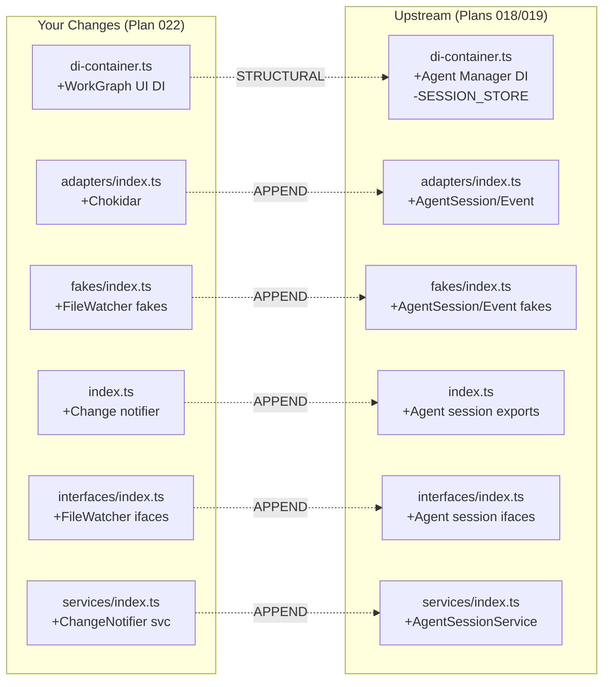

# Merge Plan: Integrating Upstream Changes

**Generated**: 2026-01-31T (attempt 2 — clean restart)
**Your Branch**: `022-workgraph-ui` @ `329e6a5`
**Merging From**: `origin/main` @ `3ba3329`
**Common Ancestor**: `d775d7e`

---

## Executive Summary

### What Happened While You Worked

You branched from `main` at `d775d7e`. Since then, **1 squash commit** (PR #15) landed on `main`:

| Plan | Merged As | Purpose | Risk to You |
|------|-----------|---------|-------------|
| Plans 015, 018, 019 | `3ba3329` (squash) | Agent Manager Refactor | **Medium** — 7 overlapping files |

### Conflict Summary

- **Direct Conflicts**: 7 files (6 code + pnpm-lock.yaml)
- **Semantic Conflicts**: 1 (SESSION_STORE removal)
- **Regression Risks**: Low (changes are additive on both sides)

### Recommended Approach

Single `git merge origin/main --no-commit` followed by manual resolution of 6 code files, then `pnpm install` to regenerate lock file.

---

## Conflict Map



---

## Upstream Plan Summary

### Plans 015, 018, 019 — Agent Manager Refactor

**Purpose**: Central agent registry with persistent storage, session management, event storage, and SSE-based real-time notifications.

| Attribute | Value |
|-----------|-------|
| Merged | PR #15, squash commit `3ba3329` |
| Files Changed | 259 |
| Key Removals | Plan 012 SessionStore, SESSION_STORE token, createInMemoryStorage() |

**Key Changes**:
- Plan 018: `AgentEventAdapter`, `AgentSessionAdapter`, `AgentSessionService` in `@chainglass/workflow`
- Plan 019: `AgentManagerService`, `AgentStorageAdapter`, `AgentNotifierService` in `@chainglass/shared` + `apps/web`
- Removed: `SESSION_STORE` DI token, `AgentSessionStore`, `createInMemoryStorage()`, `ProcessManagerAdapter` import

---

## Conflict Analysis

### Conflict 1: `packages/workflow/src/adapters/index.ts`

**Type**: Complementary Append

Both sides appended after the `SampleAdapter` export (ancestor line 21). No overlap.

**Resolution**: Keep both — upstream first, then ours:
```typescript
// Sample adapter (Plan 014 Phase 3)
export { SampleAdapter } from './sample.adapter.js';

// Agent session adapter (Plan 018)
export { AgentSessionAdapter } from './agent-session.adapter.js';

// Agent event adapter (Plan 018 Phase 2)
export { AgentEventAdapter } from './agent-event.adapter.js';

// Chokidar file watcher adapter (Plan 022 Phase 4 Subtask 001)
export {
  ChokidarFileWatcherAdapter,
  ChokidarFileWatcherFactory,
} from './chokidar-file-watcher.adapter.js';
```

---

### Conflict 2: `packages/workflow/src/services/index.ts`

**Type**: Complementary Append

Both sides appended after `SampleService` export (ancestor line 27).

**Resolution**: Keep both — upstream first, then ours:
```typescript
// Workspace services (Plan 014 Phase 4)
export { WorkspaceService } from './workspace.service.js';
export { SampleService } from './sample.service.js';

// Agent session service (Plan 018)
export { AgentSessionService } from './agent-session.service.js';

// Workspace change notifier service (Plan 022 Phase 4 Subtask 001)
export { WorkspaceChangeNotifierService } from './workspace-change-notifier.service.js';
```

---

### Conflict 3: `packages/workflow/src/interfaces/index.ts`

**Type**: Complementary Append

Both sides appended after `ISampleService` exports (ancestor line 93).

**Resolution**: Keep both — upstream first, then ours:
```typescript
// Agent session adapter interface (Plan 018)
export type {
  IAgentSessionAdapter,
  AgentSessionErrorCode,
  AgentSessionSaveResult,
  AgentSessionRemoveResult,
} from './agent-session-adapter.interface.js';

// Agent session service interface (Plan 018)
export type {
  IAgentSessionService,
  CreateSessionResult,
  DeleteSessionResult,
  UpdateSessionStatusResult,
} from './agent-session-service.interface.js';

// Agent event adapter interface (Plan 018 Phase 2)
export type {
  IAgentEventAdapter,
  StoredAgentEvent,
  AppendEventResult,
  ArchiveResult,
  ArchiveOptions,
} from './agent-event-adapter.interface.js';

// File watcher interface (Plan 022 Phase 4 Subtask 001)
export type {
  FileWatcherEvent,
  FileWatcherOptions,
  IFileWatcher,
  IFileWatcherFactory,
} from './file-watcher.interface.js';

// Workspace change notifier interface (Plan 022 Phase 4 Subtask 001)
export type {
  GraphChangedEvent,
  GraphChangedCallback,
  IWorkspaceChangeNotifierService,
} from './workspace-change-notifier.interface.js';
```

---

### Conflict 4: `packages/workflow/src/fakes/index.ts`

**Type**: Complementary Append

Both sides appended after `FakeGitWorktreeResolver` exports (ancestor line 79).

**Resolution**: Keep both — upstream first, then ours:
```typescript
// Agent session adapter fake (Plan 018)
export { FakeAgentSessionAdapter } from './fake-agent-session-adapter.js';
export type {
  AgentSessionLoadCall,
  AgentSessionSaveCall,
  AgentSessionListCall,
  AgentSessionRemoveCall,
  AgentSessionExistsCall,
} from './fake-agent-session-adapter.js';

// Agent event adapter fake (Plan 018 Phase 2)
export { FakeAgentEventAdapter } from './fake-agent-event-adapter.js';
export type {
  AgentEventAppendCall,
  AgentEventGetAllCall,
  AgentEventGetSinceCall,
  AgentEventArchiveCall,
  AgentEventExistsCall,
} from './fake-agent-event-adapter.js';

// File watcher fake (Plan 022 Phase 4 Subtask 001)
export { FakeFileWatcher, FakeFileWatcherFactory } from './fake-file-watcher.js';

// Workspace change notifier fake (Plan 022 Phase 4 Subtask 001)
export { FakeWorkspaceChangeNotifierService } from './fake-workspace-change-notifier.service.js';
export type {
  StartCall as NotifierStartCall,
  StopCall as NotifierStopCall,
  OnGraphChangedCall,
  RescanCall,
} from './fake-workspace-change-notifier.service.js';
```

---

### Conflict 5: `packages/workflow/src/index.ts`

**Type**: Complementary Append

Both sides appended after `FakeGitWorktreeResolver` exports (ancestor line ~307). Upstream added Plan 018 agent session/event exports. Ours added Plan 022 workspace change notifier exports.

**Resolution**: Keep both — upstream first, then ours. (Full resolved block is the upstream Plan 018 exports followed by our Plan 022 exports.)

---

### Conflict 6: `apps/web/src/lib/di-container.ts` (COMPLEX — 4 conflict regions)

**Type**: Structural (Contradictory + Complementary)

This is the most complex file. Upstream made breaking changes (removed SESSION_STORE, added Agent Manager), while we added WorkGraph UI.

#### Region A: Imports + file header

**Upstream changes from ancestor:**
- Updated header doc comment (removed Plan 012 reference, added Plan 019)
- Added `import * as os from 'node:os'` and `import * as path from 'node:path'`
- Removed `ProcessManagerAdapter` from @chainglass/shared imports
- Added Plan 019 imports: `AgentManagerService`, `AgentStorageAdapter`, `FakeAgentManagerService`, `FakeAgentNotifierService`, `FakeAgentStorageAdapter`, etc. from `@chainglass/shared/features/019-agent-manager-refactor`
- Added Plan 018 Phase 2-3 imports: `AgentEventAdapter`, `AgentSessionAdapter`, `AgentSessionService` + fakes from `@chainglass/workflow`
- Added: `AgentNotifierService`, `SSEManagerBroadcaster` from web features
- Added: `sseManager` from `./sse-manager`
- Removed: `AgentSessionStore` import from `./stores/agent-session.store`

**Our changes from ancestor:**
- Added `FakeYamlParser`, `IYamlParser`, `YamlParserAdapter`, `WORKGRAPH_DI_TOKENS` to @chainglass/shared imports
- Added `@chainglass/workgraph` imports (`FakeWorkGraphService`, `IWorkGraphService`, `registerWorkgraphServices`, `registerWorkgraphTestServices`)
- Added Plan 022 web feature imports (`FakeWorkGraphUIService`, `WorkGraphUIService`, `IWorkGraphUIService`)

**Resolution**: Take upstream's restructured imports as base, then ADD our Plan 022 imports.

#### Region B: DI_TOKENS + createInMemoryStorage

**Upstream**: Removed `SESSION_STORE` token, removed `createInMemoryStorage()` function
**Ours**: Added `WORKGRAPH_UI_SERVICE` token, kept `SESSION_STORE`

**Resolution**: Take upstream's removal of SESSION_STORE and createInMemoryStorage. Add our WORKGRAPH_UI_SERVICE.
```typescript
export const DI_TOKENS = {
  LOGGER: 'ILogger',
  CONFIG: 'IConfigService',
  SAMPLE_SERVICE: 'SampleService',
  PROCESS_MANAGER: 'IProcessManager',
  AGENT_ADAPTER: 'IAgentAdapter',
  CLAUDE_CODE_ADAPTER: 'ClaudeCodeAdapter',
  COPILOT_CLIENT: 'CopilotClient',
  COPILOT_ADAPTER: 'CopilotAdapter',
  AGENT_SERVICE: 'AgentService',
  // Plan 018: Event storage moved to workspace-scoped AgentEventAdapter
  // Consumers should use WORKSPACE_DI_TOKENS.AGENT_EVENT_ADAPTER instead
  // Plan 022: WorkGraph UI
  WORKGRAPH_UI_SERVICE: 'WorkGraphUIService',
} as const;
```

#### Region C: Production container (after AgentService, before Plan 014 section)

**Upstream**: Removed `SESSION_STORE` registration block, added Plan 018 Phase 2-3 registrations (AgentEventAdapter, AgentSessionAdapter, AgentSessionService)
**Ours**: Kept `SESSION_STORE` registration, added YAML parser registration, added Plan 022 WorkGraph UI section at end

**Resolution**:
1. Remove SESSION_STORE registration (take upstream)
2. Add Plan 018 registrations (AgentEventAdapter, AgentSessionAdapter, AgentSessionService) — these go BEFORE the Plan 014 section
3. Keep our YAML parser registration in the Plan 014 section
4. Keep Plan 014 workspace registrations (shared between both)
5. Add Plan 019 Agent Manager section (upstream) AFTER Plan 014
6. Add Plan 022 WorkGraph UI section (ours) AFTER Plan 019

#### Region D: Test container

**Upstream**: Removed `SESSION_STORE` test registration, added Plan 018 fakes (FakeAgentEventAdapter, FakeAgentSessionAdapter, AgentSessionService), added Plan 019 fakes (FakeAgentNotifierService, FakeAgentStorageAdapter, FakeAgentManagerService)
**Ours**: Kept `SESSION_STORE` test registration, added YAML parser fake, added Plan 022 test section

**Resolution**:
1. Remove SESSION_STORE test registration (take upstream)
2. Add Plan 018 fake registrations BEFORE Plan 014 section
3. Keep our YAML parser fake in the Plan 014 section
4. Keep Plan 014 workspace fakes (shared)
5. Add Plan 019 fakes (upstream) AFTER Plan 014
6. Add Plan 022 test section (ours) AFTER Plan 019

---

### Conflict 7: `pnpm-lock.yaml`

**Type**: Auto-Resolvable

**Resolution**: Accept either side, then run `pnpm install` to regenerate.

---

## Regression Risk Analysis

| Risk | Direction | Likelihood | Verification |
|------|-----------|------------|--------------|
| SESSION_STORE consumers | Upstream→You | **Low** — our code doesn't use SESSION_STORE | Check for `SESSION_STORE` references in Plan 022 code |
| YAML parser registration | You→Upstream | **None** — upstream doesn't register YAML parser | N/A |
| WorkGraph DI tokens | You only | **None** — new tokens, no upstream overlap | Build verification |
| Agent Manager singleton | Upstream only | **None** — our code doesn't touch AgentManager | Build verification |

---

## Merge Execution Plan

### Prerequisites

```bash
# Verify clean state
git status
# Backup branch already exists: backup-20260131-pre-merge
```

### Phase 1: Start Merge

```bash
git merge origin/main --no-commit
```

Expected: 7 conflicting files (6 code + pnpm-lock.yaml).

### Phase 2: Resolve Barrel Files (5 files)

For each barrel file (`adapters/index.ts`, `services/index.ts`, `interfaces/index.ts`, `fakes/index.ts`, `index.ts`):
- Strategy: Write the complete resolved file content (upstream additions first, then ours)
- These are all "complementary append" — both sides added to the end

### Phase 3: Resolve di-container.ts

This requires careful manual merge across 4 regions:
1. Take upstream imports as base, add our Plan 022 imports
2. Take upstream DI_TOKENS (no SESSION_STORE), add WORKGRAPH_UI_SERVICE
3. Remove createInMemoryStorage() and AgentSessionStore (upstream removed them)
4. Production container: upstream Plan 018 + 019 registrations, then our Plan 022
5. Test container: upstream Plan 018 + 019 fakes, then our Plan 022 fakes

### Phase 4: Regenerate Lock File

```bash
pnpm install
```

### Phase 5: Validate

```bash
just build    # All packages compile
just fft      # Lint, format, test (full suite)
```

### Phase 6: Commit

```bash
git add -A
git commit -m "merge: integrate origin/main (Plans 015/018/019 Agent Manager Refactor)"
```

**Critical**: Verify commit has 2 parents (proper merge commit). Check with `git log --oneline --graph -3`.

---

## Lessons from Previous Attempt

1. **MERGE_HEAD location**: This is a git worktree. MERGE_HEAD lives at `/home/jak/substrate/chainglass/.git/worktrees/022-workgraph-ui/MERGE_HEAD`, not `.git/MERGE_HEAD`.
2. **Linter interference**: Biome auto-formats files between Read and Edit tool calls. Use `Write` tool to write complete resolved files rather than incremental `Edit` operations.
3. **Verify merge commit integrity**: After committing, immediately run `git cat-file -p HEAD` to verify 2 parent lines.
4. **No other agents**: Ensure no other agent processes are modifying the working tree during merge.

---

## Human Approval Required

Before executing this merge plan, please review:

- [ ] I understand the 7 direct conflicts and their resolutions
- [ ] I understand SESSION_STORE removal (upstream replaced with AgentManagerService)
- [ ] I understand the di-container.ts will be rebuilt from both sides

**Type "PROCEED" to begin merge execution, or "ABORT" to cancel.**
