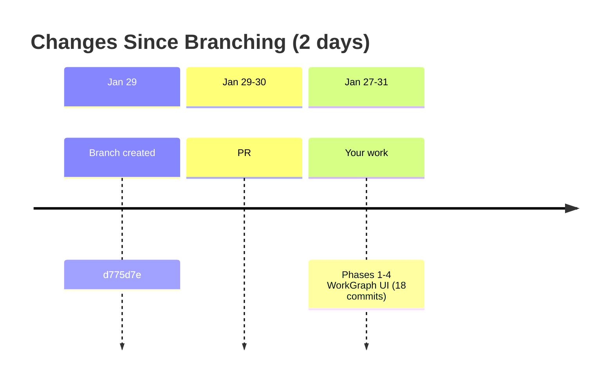
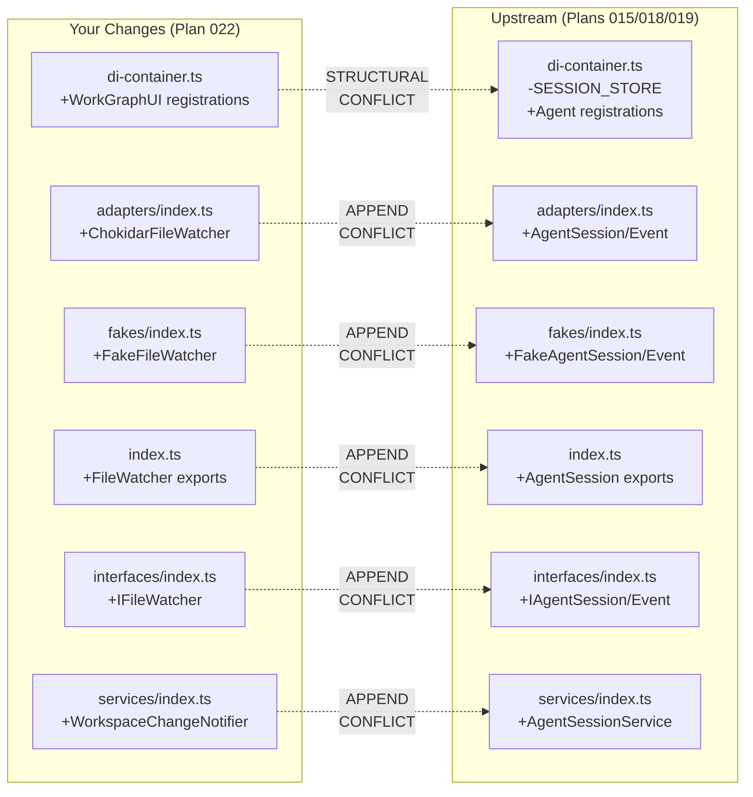

# Merge Plan: Integrating Upstream Changes

**Generated**: 2026-01-31
**Your Branch**: `022-workgraph-ui` @ `a05d41f`
**Merging From**: `origin/main` @ `3ba3329`
**Common Ancestor**: `d775d7e` (2026-01-29)

---

## Executive Summary

### What Happened While You Worked

You branched from main **2 days ago**. Since then, **1 PR** landed in main:

| PR | Merged | Purpose | Risk to You |
|----|--------|---------|-------------|
| #15 Agent Manager Refactor (Plans 015, 018, 019) | ~2 days ago | Agent session persistence, event storage, agent manager service | **Medium** - 7 overlapping files |

### Conflict Summary

- **Direct Conflicts**: 6 files (all "complementary append" pattern — both sides appended to barrel files)
- **Semantic Conflicts**: 1 (di-container.ts structural change — upstream removed `SESSION_STORE` your branch still references)
- **Regression Risks**: Low (changes are in different feature domains)

### Recommended Approach

Single merge of `origin/main` with manual resolution of 6 append conflicts + 1 structural conflict in di-container.ts. All barrel file conflicts are trivial concatenations. The di-container.ts conflict requires accepting upstream's structural removals and layering your registrations on top.

---

## Timeline



---

## Upstream Plan Analysis

### PR #15: Agent Manager Refactor (Plans 015, 018, 019)

**Purpose**: Complete overhaul of agent session management — moved from browser localStorage to server-side file-based persistence, added NDJSON event storage, and created a centralized agent manager service with SSE-powered real-time updates.

| Attribute | Value |
|-----------|-------|
| Landed as | Single squash commit `3ba3329` |
| Files Changed | 259 |
| Lines Added | 53,127 |
| Lines Deleted | 4,264 |
| Conflicts with You | 7 files |

**What Plan 015 Did** (Event Storage Foundation):
- NDJSON-based event storage for agent sessions
- Zod schemas for `AgentToolCallEvent`, `AgentToolResultEvent`, `AgentThinkingEvent`
- `SessionIdValidator` for path traversal prevention
- SSE broadcast integration for real-time event streaming

**What Plan 018 Did** (Agent Workspace Data Model):
- `AgentSession` entity in `packages/workflow/src/entities/`
- `AgentSessionAdapter` / `AgentEventAdapter` — file-based persistence
- `AgentSessionService` — session CRUD
- New error codes E090-E093

**What Plan 019 Did** (Agent Manager Refactor):
- `AgentManagerService` — central in-memory registry of running agents
- `AgentNotifierService` / `SSEManagerBroadcaster` — SSE push notifications
- `AgentStorageAdapter` — persistent agent registry
- New REST API routes: `GET/POST /api/agents`, `GET/DELETE /api/agents/[id]`, `POST /api/agents/[id]/run`
- New UI components: `agent-chat-view`, `tool-call-card`, `agent-list-live`

**Breaking Changes Upstream**:
1. `DI_TOKENS.SESSION_STORE` removed (was `AgentSessionStore` using localStorage)
2. `AgentSessionStore` class deleted entirely
3. `createInMemoryStorage()` helper removed from di-container.ts
4. `ProcessManagerAdapter` import removed from di-container.ts
5. Old hooks deleted: `useAgentSSE.ts`, `useAgentSession.ts`
6. Old API route deleted: `app/api/agents/run/route.ts`

---

## Your Changes Summary

**Branch**: `022-workgraph-ui` (18 commits, 97 files, +24,552 lines)

**What You Built** (WorkGraph UI, Phases 1-4):
- Phase 1: Headless state management (`WorkGraphUIInstance`, `WorkGraphUIService`)
- Phase 2: Visual graph display with React Flow
- Phase 3: Graph editing (drag-drop, edge connections, node deletion)
- Phase 4: SSE real-time updates + `WorkspaceChangeNotifierService` for CLI file watching

**Key additions to overlapping files**: All additive — new imports, new DI registrations, new barrel exports appended at end of files.

---

## Conflict Analysis

### Conflict Map



---

### Conflict 1: `apps/web/src/lib/di-container.ts`

**Conflict Type**: Orthogonal (structural + additive)

**Your Change**: Added imports and DI registrations for Plan 022 (WorkGraphUIService, YAML parser, workgraph services). Kept existing `SESSION_STORE` / `AgentSessionStore` unchanged.

**Upstream Change**: Removed `SESSION_STORE` / `AgentSessionStore` / `createInMemoryStorage`. Added 6 new agent-related DI registrations in both production and test containers.

**Resolution Strategy**:
1. Accept upstream's removal of `SESSION_STORE`, `AgentSessionStore`, `createInMemoryStorage` (your code doesn't use these)
2. Accept upstream's new agent registrations
3. Layer your Plan 022 registrations (WorkGraphUIService, YAML parser, workgraph services) on top
4. Verify all imports resolve correctly

**Verification**:
- [ ] TypeScript compiles without errors
- [ ] Both production and test containers resolve all tokens
- [ ] `just typecheck` passes

---

### Conflicts 2-6: Barrel Export Files (packages/workflow/src/)

**Conflict Type**: Complementary (both sides append to end-of-file)

These 5 files all have the identical conflict pattern:

| File | Your Appended Exports | Upstream Appended Exports |
|------|----------------------|--------------------------|
| `adapters/index.ts` | `ChokidarFileWatcherAdapter`, `ChokidarFileWatcherFactory` | `AgentSessionAdapter`, `AgentEventAdapter` |
| `fakes/index.ts` | `FakeFileWatcher`, `FakeFileWatcherFactory`, `FakeWorkspaceChangeNotifierService` + call types | `FakeAgentSessionAdapter` + call types, `FakeAgentEventAdapter` + call types |
| `index.ts` | `WorkspaceChangeNotifierService`, file watcher types, chokidar adapter, fakes | `AgentSession` entity, error classes, adapter/service/fake exports |
| `interfaces/index.ts` | `IFileWatcher`, `IFileWatcherFactory`, `IWorkspaceChangeNotifierService` + types | `IAgentSessionAdapter`, `IAgentSessionService`, `IAgentEventAdapter` + types |
| `services/index.ts` | `WorkspaceChangeNotifierService` | `AgentSessionService` |

**Resolution Strategy**: Keep both sets of exports. Order doesn't matter for barrel files. Simply concatenate: upstream exports first, then yours (or vice versa).

**Verification**:
- [ ] All imports resolve
- [ ] `just typecheck` passes

---

### Conflict 7: `pnpm-lock.yaml`

**Conflict Type**: Lock file (regenerate)

**Resolution**: After resolving all code conflicts, run `pnpm install` to regenerate the lock file.

---

## Regression Risk Analysis

| Risk | Direction | Likelihood | Mitigation |
|------|-----------|------------|------------|
| Agent DI tokens not registered | Upstream->You | Low | Upstream registrations preserved in merge |
| WorkGraph DI tokens not registered | You->Upstream | Low | Your registrations preserved in merge |
| Import paths broken | Both | Low | TypeScript will catch at compile time |
| Test container missing registrations | Both | Low | Both sides' test registrations included |

**Overall Risk**: **Low**. The two feature tracks (agent management vs workgraph UI) are logically independent. No shared APIs, no shared state, no overlapping domain concepts. The only integration point is the DI container, and both sides register different tokens.

---

## Merge Execution Plan

### Pre-Merge: Create Backup

```bash
git branch backup-20260131-pre-merge
```

### Phase 1: Merge with Conflict Resolution

```bash
# Fetch latest and merge
git fetch origin main
git merge origin/main --no-commit
```

Git will report conflicts in 6-7 files. Resolve each:

**For barrel files** (adapters/index.ts, fakes/index.ts, index.ts, interfaces/index.ts, services/index.ts):
- Open each file
- Find conflict markers (`<<<<<<<`, `=======`, `>>>>>>>`)
- Keep BOTH sets of exports (remove markers, concatenate both sides)

**For di-container.ts**:
- Accept upstream's version as the base (it has the structural removals)
- Re-add your Plan 022 imports and registrations
- Verify no references to removed `SESSION_STORE` / `AgentSessionStore`

**For pnpm-lock.yaml**:
- Accept either version, then regenerate

### Phase 2: Regenerate Lock File

```bash
pnpm install
```

### Phase 3: Validation

```bash
# Full quality check
just fft       # Fix, Format, Test
just typecheck # TypeScript compilation
```

---

## Post-Merge Validation Checklist

- [ ] All conflicts resolved (no `<<<<<<<` markers remaining)
- [ ] `just typecheck` passes
- [ ] `just test` passes
- [ ] `just lint` passes
- [ ] Dev server starts (`just dev`)
- [ ] WorkGraph UI features still work (Phases 1-4)
- [ ] No references to removed `SESSION_STORE` / `AgentSessionStore`

---

## Human Approval Required

Before executing this merge plan, please review:

### Summary
- [ ] I understand that PR #15 (Plans 015, 018, 019) landed in main
- [ ] I understand 6 files have complementary append conflicts (trivial resolution)
- [ ] I understand di-container.ts needs structural merge (upstream removed SESSION_STORE)

### Risk Acknowledgment
- [ ] Backup branch will be created before merge
- [ ] `just fft` will be run after merge
- [ ] Rollback available via `git reset --hard backup-20260131-pre-merge`

---

**Proceed with merge execution?** Type "PROCEED" to begin, or "ABORT" to cancel.
