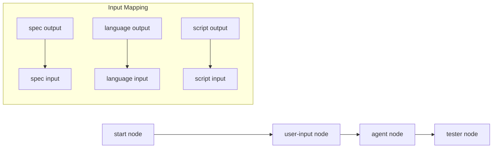

# Research Report: WorkGraph UI System

**Generated**: 2026-01-29T01:15:00Z
**Research Query**: "Understand WorkGraph data model, WorkUnits, Q&A system, and existing React Flow patterns for building a WorkGraph UI"
**Mode**: Pre-Plan
**Location**: docs/plans/022-workgraph-ui/research-dossier.md
**FlowSpace**: Available
**Findings**: 55+ across 7 research threads

## Executive Summary

### What It Does
WorkGraphs are directed acyclic graphs (DAGs) of WorkNodes representing composable workflows. Each node instantiates a WorkUnit (AgentUnit, CodeUnit, or UserInputUnit) and executes with input/output data flowing through edges. The system supports dynamic graph modification during execution, question/answer handover with agents, and git-native storage per workspace.

### Business Purpose
Enable complex multi-step AI workflows with human-in-the-loop interactions. WorkGraphs allow users to compose agent tasks, user inputs, and code execution into reusable pipelines that can be monitored, paused for questions, and resumed - all while storing state in git for team collaboration.

### Key Insights
1. **Split storage model**: Graph structure in YAML (human-readable), runtime state in JSON (programmatic)
2. **Computed vs stored status**: `pending`/`ready` are computed from DAG structure; `running`/`waiting-question`/`complete` are persisted
3. **Four question types**: `text`, `single`, `multi`, `confirm` with structured answer schema

### Quick Stats
- **WorkUnit Types**: 3 (AgentUnit, CodeUnit, UserInputUnit)
- **Node Statuses**: 6 (pending, ready, running, waiting-question, blocked-error, complete)
- **Question Types**: 4 (text, single, multi, confirm)
- **Storage**: Per-worktree at `<worktree>/.chainglass/data/work-graphs/`
- **Existing React Flow**: v12.10.0 in apps/web with custom node types

---

## How It Currently Works

### Entry Points

| Entry Point | Type | Location | Purpose |
|------------|------|----------|---------|
| CLI `wg create` | Command | apps/cli/src/commands/workgraph.command.ts | Create new graph |
| CLI `wg node add-after` | Command | apps/cli/src/commands/workgraph.command.ts | Add node to graph |
| CLI `wg node ask/answer` | Command | apps/cli/src/commands/workgraph.command.ts | Question/answer handover |
| CLI `wg status` | Command | apps/cli/src/commands/workgraph.command.ts | Get graph/node status |
| `IWorkGraphService.create()` | API | packages/workgraph/src/services/workgraph.service.ts | Programmatic graph creation |
| `IWorkNodeService.ask()` | API | packages/workgraph/src/services/worknode.service.ts | Agent asks question |

### Core Execution Flow

1. **Graph Creation**: `wg create <slug>` creates directory structure with `work-graph.yaml` containing special `start` node
   ```yaml
   slug: my-workflow
   version: "1.0.0"
   nodes: [start]
   edges: []
   created_at: "2026-01-29T01:00:00Z"
   ```

2. **Node Addition**: `wg node add-after <graph> <afterId> <unitSlug>` creates node directory, wires inputs to predecessor outputs
   ```
   nodes/<nodeId>/
     node.yaml       # id, unit, inputs mapping
     data/           # outputs, handover state
   ```

3. **Node Execution**: Orchestrator calls `start()` → node status becomes `running` → agent executes → may call `ask()` → status becomes `waiting-question` → orchestrator calls `answer()` → agent continues → `end()` → status becomes `complete`

4. **Direct Output Pattern**: For input nodes, skip `start()` entirely - directly `save-output-data` then `end()` (PENDING → COMPLETE)

### Data Flow



### State Management

**Graph Status** (`state.json`):
- `pending` - No nodes started
- `in_progress` - At least one node running
- `complete` - All nodes complete
- `failed` - At least one node blocked-error

**Node Status** (computed + stored):
- `pending` (computed) - Upstream dependencies not complete
- `ready` (computed) - All upstream complete, can start
- `running` (stored) - Execution in progress
- `waiting-question` (stored) - Agent asked question, awaiting answer
- `blocked-error` (stored) - Error occurred
- `complete` (stored) - Successfully finished

---

## Architecture & Design

### Component Map

#### Core Services
- **WorkGraphService**: Graph CRUD, node add/remove, status computation
  - Location: `packages/workgraph/src/services/workgraph.service.ts`
  - Methods: `create()`, `load()`, `show()`, `status()`, `addNodeAfter()`, `removeNode()`

- **WorkNodeService**: Node execution lifecycle, I/O operations, Q&A
  - Location: `packages/workgraph/src/services/worknode.service.ts`
  - Methods: `canRun()`, `start()`, `end()`, `ask()`, `answer()`, `saveOutputData()`, etc.

- **WorkUnitService**: Unit template management (agent/code/user-input)
  - Location: `packages/workgraph/src/services/workunit.service.ts`
  - Methods: `list()`, `load()`, `create()`, `validate()`

#### Data Schemas (Zod)
- **WorkGraphDefinitionSchema**: `slug`, `version`, `nodes[]`, `edges[]`, `created_at`
- **WorkGraphStateSchema**: `graph_status`, `updated_at`, `nodes: Record<id, NodeState>`
- **WorkNodeConfigSchema**: `id`, `unit`, `inputs: Record<name, InputMapping>`
- **WorkNodeDataSchema**: `outputs: Record<name, value>`, `handover?: Handover`
- **WorkUnitSchema**: Discriminated union on `type: 'agent' | 'code' | 'user-input'`

### Design Patterns Identified

1. **Discriminated Union** (WorkUnit types)
   ```typescript
   type WorkUnit = AgentUnitType | CodeUnitType | UserInputUnitType;
   // Discriminator: type field
   ```

2. **Split Storage** (YAML structure + JSON state)
   - `work-graph.yaml` - Human-readable, git-mergeable structure
   - `state.json` - Runtime state, programmatic access

3. **Atomic File Writes**
   ```typescript
   // Write to .tmp then rename atomically
   await atomicWriteJson(fs, path, data);
   ```

4. **Computed vs Stored State**
   - `pending`/`ready` computed from edge graph
   - `running`/`waiting-question`/`complete` stored in state.json

5. **Result Pattern** (all methods return BaseResult with errors[])
   ```typescript
   interface AddNodeResult extends BaseResult {
     nodeId: string;
     inputs: Record<string, InputMapping>;
     errors: ResultError[];
   }
   ```

### System Boundaries

- **WorkGraph Package**: Pure business logic, no web dependencies
- **CLI**: Commands invoke services with WorkspaceContext
- **Web**: React components consume service results (future: API layer)
- **Storage**: Filesystem-only, git-committed per worktree

---

## WorkUnit Types (Complete Reference)

### AgentUnit
```yaml
slug: sample-coder
type: agent
version: "1.0.0"
inputs:
  - name: spec
    type: data
    data_type: text
    required: true
outputs:
  - name: language
    type: data
    data_type: text
    required: true
  - name: script
    type: file
    required: true
agent:
  prompt_template: commands/main.md
  supported_agents: [claude-code, copilot]
```

### UserInputUnit
```yaml
slug: get-language
type: user-input
version: "1.0.0"
outputs:
  - name: selection
    type: data
    data_type: text
    required: true
user_input:
  question_type: single  # text | single | multi | confirm
  prompt: "Which language?"
  options:
    - key: A
      label: TypeScript
    - key: B
      label: Python
```

### CodeUnit
```yaml
slug: run-script
type: code
version: "1.0.0"
inputs:
  - name: script
    type: file
    required: true
outputs:
  - name: output
    type: data
    data_type: text
    required: true
code:
  timeout: 60
```

---

## Question/Answer System

### Question Types

| Type | Description | Answer Format |
|------|-------------|---------------|
| `text` | Free-form text input | `{ text: string }` |
| `single` | Single choice from options | `{ selection: string }` |
| `multi` | Multiple choices from options | `{ selection: string[] }` |
| `confirm` | Yes/No confirmation | `{ confirmed: boolean }` |

### Question Schema
```typescript
interface Question {
  type: 'text' | 'single' | 'multi' | 'confirm';
  prompt: string;
  options?: QuestionOption[];  // Required for single/multi
  answer?: Answer | null;      // Populated when answered
}

interface QuestionOption {
  key: string;        // Single uppercase letter (A-Z)
  label: string;      // Display text
  description?: string;
}

interface Answer {
  selection?: string | string[];  // For single/multi
  text?: string;                  // For text
  confirmed?: boolean;            // For confirm
}
```

### Question Flow

1. **Agent asks** → `wg node ask <graph> <node> --type single --text "Which language?" --options A:TypeScript B:Python`
2. **Node status** → `waiting-question` with `questionId`
3. **Orchestrator answers** → `wg node answer <graph> <node> <questionId> "A"`
4. **Node status** → `running` (agent can continue)

### Handover Model
```typescript
interface Handover {
  reason: 'question' | 'error' | 'complete';
  question?: Question;      // When reason='question'
  error?: HandoverError;    // When reason='error'
}
```

---

## Storage Model (ADR-0008)

### Directory Structure
```
<worktree>/.chainglass/
├── data/
│   ├── work-graphs/
│   │   └── <graph-slug>/
│   │       ├── work-graph.yaml      # Graph definition
│   │       ├── state.json           # Runtime state
│   │       └── nodes/
│   │           └── <node-id>/
│   │               ├── node.yaml    # Node config
│   │               └── data/
│   │                   ├── data.json       # Outputs + handover
│   │                   └── files/          # File outputs
│   └── units/
│       └── <unit-slug>/
│           ├── unit.yaml
│           └── commands/            # For agent units
│               └── main.md
```

### Key Files

**work-graph.yaml** (graph structure):
```yaml
slug: sample-e2e
version: "1.0.0"
created_at: "2026-01-29T00:00:00Z"
nodes:
  - start
  - sample-input-a7f
  - sample-coder-b2c
edges:
  - from: start
    to: sample-input-a7f
  - from: sample-input-a7f
    to: sample-coder-b2c
```

**state.json** (runtime state):
```json
{
  "graph_status": "in_progress",
  "updated_at": "2026-01-29T00:30:00Z",
  "nodes": {
    "start": { "status": "complete" },
    "sample-input-a7f": { "status": "complete" },
    "sample-coder-b2c": { 
      "status": "waiting-question",
      "started_at": "2026-01-29T00:25:00Z"
    }
  }
}
```

**node.yaml** (node config):
```yaml
id: sample-coder-b2c
unit: sample-coder
created_at: "2026-01-29T00:10:00Z"
inputs:
  spec:
    from: sample-input-a7f
    output: spec
```

---

## Existing React Flow Implementation

### Package & Version
- `@xyflow/react` v12.10.0 (XYFlow/React Flow)
- Located in `apps/web/`

### Custom Node Types (Current)
1. **workflow-phase** - Phase execution nodes with status badges
2. **artifact** - Input/output file nodes
3. **command** - Prompt template nodes
4. **vertical-phase** - Alternative vertical layout

### State Management Pattern
```typescript
// useFlowState hook
const { nodes, edges, onNodesChange, onEdgesChange, addNode, removeNode } = useFlowState();

// Updates via applyNodeChanges from @xyflow/react
```

### Layout Constants
- `VERTICAL_GAP`: 80px
- `HORIZONTAL_GAP`: 60px
- `minZoom`: 0.1
- `maxZoom`: 2

### Edge Styling
- Edge type: `smoothstep`
- Animated edges for active states
- Color coding by connection type

---

## Critical Discoveries for UI Development

### 🚨 Critical Finding 01: Computed vs Stored Status
**Impact**: Critical
**What**: `pending` and `ready` statuses are **computed** from DAG structure, not stored in state.json
**Why It Matters**: UI must compute these statuses client-side when rendering; cannot rely solely on stored state
**Required Action**: Implement status computation logic in UI state management

### 🚨 Critical Finding 02: Direct Output Pattern
**Impact**: Critical
**What**: UserInputUnit nodes can go PENDING → COMPLETE without ever being RUNNING
**Why It Matters**: UI should allow direct value submission for input nodes without showing "running" state
**Required Action**: Special handling for user-input type nodes in UI

### 🚨 Critical Finding 03: Question/Answer Handover
**Impact**: Critical
**What**: When agent asks question, node enters `waiting-question` state with `questionId`
**Why It Matters**: UI must detect this state, render appropriate question UI, and call answer endpoint
**Required Action**: Implement question detection polling and question type-specific form components

### 🚨 Critical Finding 04: File vs Data Outputs
**Impact**: High
**What**: Outputs can be `data` (JSON in data.json) or `file` (path reference)
**Why It Matters**: UI must handle both output types differently when displaying or passing to next node
**Required Action**: Implement output type detection and appropriate rendering

### 🚨 Critical Finding 05: Graph Mutability During Execution
**Impact**: High
**What**: Graphs can be modified while running (agents can add nodes, CLI can edit)
**Why It Matters**: UI must handle concurrent modifications gracefully
**Required Action**: Implement optimistic updates with reconciliation, file watching/SSE for external changes

---

## Prior Learnings (From Previous Implementations)

### 📚 PL-01: Atomic File Writes Prevent Corruption
**Source**: Plan 016 Phase 3 - WorkGraph Core
**Actionable Insight**: All state persistence must use atomic writes. UI-triggered updates should go through API that uses `atomicWriteFile()`.

### 📚 PL-02: Direct Output Pattern
**Source**: Plan 017 - Agent Graph Manual Validation
**Actionable Insight**: For user-input nodes, UI can directly save output and call end() without start(). Skip the "running" indicator entirely.

### 📚 PL-03: Agent Session Tracking Required
**Source**: Plan 017 Execution Log
**Actionable Insight**: UI should display session IDs for agent nodes and provide resume/cancel controls. Multi-turn conversations require explicit session management.

### 📚 PL-04: SSE Better Than WebSocket (8x Scaling)
**Source**: Plan 012 External Research
**Actionable Insight**: Use SSE for real-time graph updates. Single connection, HTTP/2 multiplexing, auto-reconnect. No WebSocket infrastructure needed.

### 📚 PL-05: Output Format Matters for Agents
**Source**: Plan 017 Execution Log
**Actionable Insight**: API responses should provide raw values (not decorated messages) for agent consumption. Same endpoints serve both UI and agent callers.

### 📚 PL-06: Workspace Context Required
**Source**: Plan 014 Phase 6
**Actionable Insight**: All graph operations are workspace-scoped. UI must resolve/persist workspace context (probably via URL query param).

### 📚 PL-07: E2E Testing Exposes Integration Gaps
**Source**: Plan 017 Execution Log
**Actionable Insight**: Test UI against real CLI/service layer, not mocks. Integration gaps invisible in unit tests.

---

## UI Architecture Recommendations

### State Model: WorkGraphUIService / WorkGraphUIInstance

```typescript
interface WorkGraphUIService {
  // Factory for instances
  getInstance(workspaceCtx: WorkspaceContext, graphSlug: string): WorkGraphUIInstance;
  
  // List available graphs
  listGraphs(ctx: WorkspaceContext): Promise<GraphSummary[]>;
  
  // Create new graph
  createGraph(ctx: WorkspaceContext, slug: string): Promise<WorkGraphUIInstance>;
}

interface WorkGraphUIInstance {
  // Graph data (desired state)
  readonly graphSlug: string;
  readonly definition: WorkGraphDefinition;
  readonly state: WorkGraphState;
  readonly nodes: Map<string, UINodeState>;
  readonly edges: Edge[];
  
  // Real-time updates
  subscribe(callback: (event: GraphEvent) => void): Unsubscribe;
  
  // Mutations (optimistic updates)
  addNode(afterNodeId: string, unitSlug: string, inputs?: Record<string, string>): Promise<void>;
  removeNode(nodeId: string, cascade?: boolean): Promise<void>;
  updateNodeLayout(nodeId: string, position: Position): Promise<void>;
  
  // Question handling
  answerQuestion(nodeId: string, questionId: string, answer: Answer): Promise<void>;
  
  // Cleanup
  dispose(): void;
}

interface UINodeState {
  id: string;
  unitSlug?: string;
  status: NodeStatus;  // Computed
  position: Position;  // For layout persistence
  question?: Question; // When waiting-question
  outputs?: Record<string, unknown>;
}
```

### Desired State Pattern

1. **Load graph** → Hydrate `WorkGraphUIInstance` with definition + state
2. **Compute status** → Calculate `pending`/`ready` from DAG
3. **Render** → React Flow renders from instance state
4. **User action** → Optimistic update to instance state → API call → Confirm/rollback
5. **SSE event** → Update instance state → React re-renders

### Layout Persistence Extension

Current data model doesn't store node positions. Extend with:

```yaml
# work-graph.yaml extension
layout:
  sample-input-a7f:
    x: 100
    y: 200
  sample-coder-b2c:
    x: 100
    y: 350
```

Or separate file: `layout.json` (non-critical, can be regenerated via auto-layout).

### SSE Event Types

```typescript
type GraphSSEEvent = 
  | { type: 'node-status-changed'; nodeId: string; status: NodeStatus; questionId?: string }
  | { type: 'node-added'; nodeId: string; afterNodeId: string; unitSlug: string }
  | { type: 'node-removed'; nodeIds: string[] }
  | { type: 'graph-structure-changed' }  // Full reload needed
  | { type: 'question-asked'; nodeId: string; questionId: string; question: Question }
  | { type: 'question-answered'; nodeId: string; questionId: string };
```

---

## Modification Considerations

### ✅ Safe to Modify
1. **Layout system** - New functionality, no existing dependencies
2. **Question UI components** - Existing patterns in phases, adapt for WorkGraph
3. **Node visual styling** - Isolated to React components

### ⚠️ Modify with Caution
1. **WorkGraphService** - Core business logic, many tests depend on behavior
2. **State computation** - `pending`/`ready` logic must match service exactly
3. **File format** - Any YAML/JSON schema changes need migration path

### 🚫 Danger Zones
1. **Node ID generation** - `<unit-slug>-<hex3>` format used everywhere
2. **Workspace context resolution** - Complex path logic, well-tested
3. **Atomic file writes** - Critical for data integrity

---

## Next Steps

### Immediate (Pre-Spec)
1. ✅ Research complete
2. Run `/plan-1b-specify "WorkGraph UI with drag-drop graph editor"` to create specification

### Implementation Phases (Suggested)
1. **Phase 1**: WorkGraphUIService/Instance with state management (headless tests)
2. **Phase 2**: React Flow integration with custom WorkGraph node types
3. **Phase 3**: Toolbox with WorkUnit drag-drop
4. **Phase 4**: SSE real-time updates
5. **Phase 5**: Question/answer UI components
6. **Phase 6**: Layout persistence
7. **Phase 7**: File system polling for external changes

---

## Appendix: File Inventory

### Core Files

| File | Purpose | Lines |
|------|---------|-------|
| packages/workgraph/src/services/workgraph.service.ts | Graph CRUD, node ops | 945 |
| packages/workgraph/src/services/worknode.service.ts | Node lifecycle, I/O | 1980 |
| packages/workgraph/src/services/workunit.service.ts | Unit templates | 474 |
| packages/workgraph/src/schemas/workgraph.schema.ts | Graph Zod schemas | 106 |
| packages/workgraph/src/schemas/worknode.schema.ts | Node Zod schemas | 136 |
| packages/workgraph/src/schemas/workunit.schema.ts | Unit Zod schemas | 208 |
| packages/workgraph/src/interfaces/*.ts | Service interfaces | ~1000 |

### Test Reference

| File | Purpose |
|------|---------|
| docs/how/dev/workgraph-run/e2e-sample-flow.ts | Complete E2E flow example |
| docs/how/dev/workgraph-run/lib/cli-runner.js | CLI test utilities |

### Related Plans

| Plan | Relevance |
|------|-----------|
| 014-workspaces | Workspace storage model |
| 016-agent-units | WorkUnit/WorkGraph design |
| 017-agent-graph-manual-validate | E2E validation patterns |
| 021-workgraph-workspaces-upgrade | Workspace context integration |

---

**Research Complete**: 2026-01-29T01:15:00Z
**Report Location**: docs/plans/022-workgraph-ui/research-dossier.md
