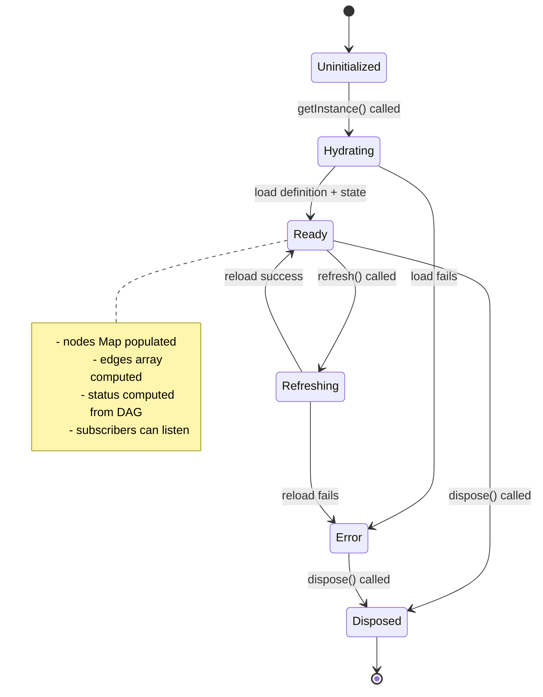
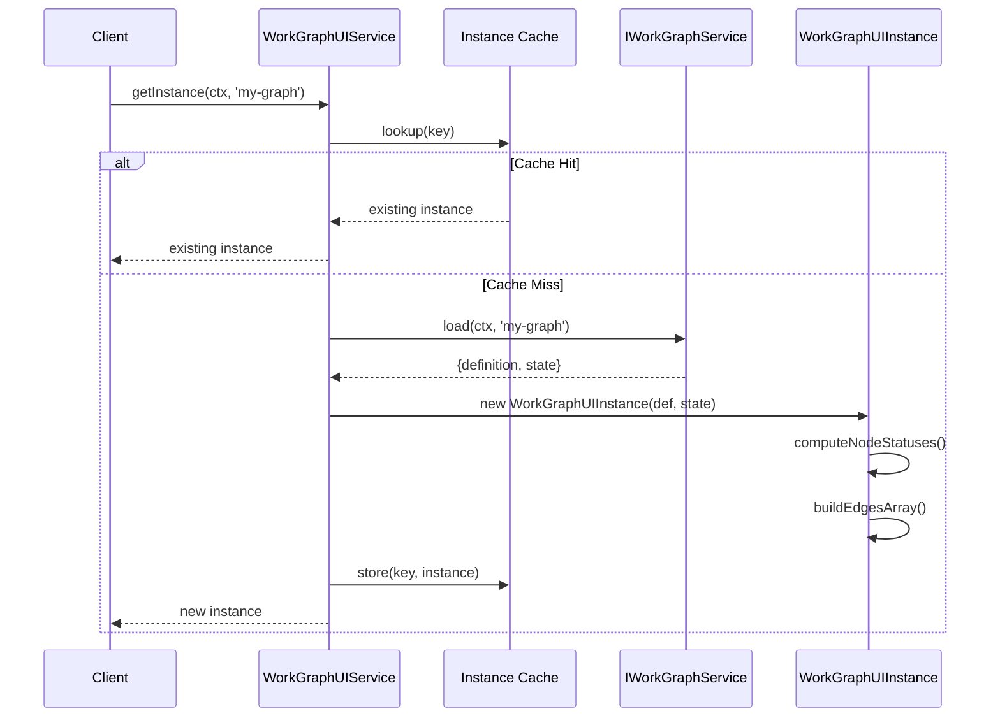
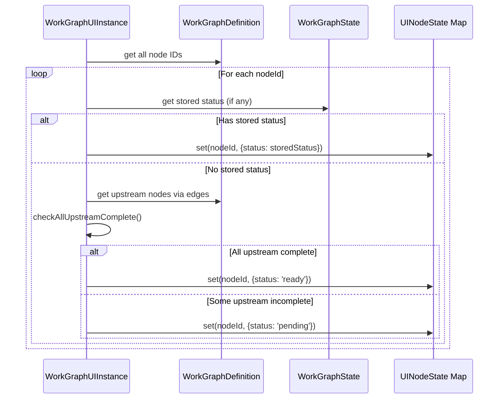

# Phase 1: Headless State Management – Tasks & Alignment Brief

**Spec**: [../workgraph-ui-spec.md](../workgraph-ui-spec.md)
**Plan**: [../workgraph-ui-plan.md](../workgraph-ui-plan.md)
**Date**: 2026-01-29

---

## Executive Briefing

### Purpose
This phase establishes the foundation for the entire WorkGraph UI by creating `WorkGraphUIService` and `WorkGraphUIInstance` classes with full state management capabilities, testable without React. This is the canonical source of truth for all UI state - React will merely render from this model.

### What We're Building
A **headless state management layer** that:
- **WorkGraphUIService** (singleton): Factory for graph instances, manages caching, delegates to existing `IWorkGraphService` for filesystem operations
- **WorkGraphUIInstance** (per-graph): Stateful representation of a single WorkGraph with computed status, event emission, and refresh mechanisms
- **Status Computation Algorithm**: Computes `pending`/`ready` from DAG structure (not stored) while preserving explicit statuses like `running`, `waiting-question`, `blocked-error`, `complete`

### User Value
By building the state management headlessly, we enable:
1. **Full TDD** - 100% of state logic testable without browser/React
2. **Desired-state pattern** - React reads from instance; when `changed` fires, UI re-renders from canonical state
3. **CLI parity** - Status computation matches `wg status` output exactly

### Example
```typescript
// Service creates or retrieves cached instance
const service = new WorkGraphUIService(workGraphService);
const instance = await service.getInstance(ctx, 'my-workflow');

// Instance holds canonical state - computed statuses included
instance.nodes.get('coder-node')?.status // → 'pending' (computed: upstream incomplete)
instance.nodes.get('start')?.status      // → 'complete' (stored in state.json)

// Subscribe to changes for React integration
instance.subscribe((event) => {
  if (event.type === 'changed') {
    // Re-render from instance.nodes, instance.edges
  }
});

// Later: SSE notification triggers refresh
await instance.refresh(); // Reloads from filesystem, emits 'changed'
```

---

## Objectives & Scope

### Objective
Create WorkGraphUIService and WorkGraphUIInstance with full state management per plan acceptance criteria, ensuring status computation matches CLI behavior exactly.

**Behavior Checklist** (from spec):
- [ ] WorkGraphUIService implements `getInstance`, `listGraphs`, `createGraph`, `deleteGraph`, `disposeAll`
- [ ] WorkGraphUIInstance implements `graphSlug`, `definition`, `state`, `nodes`, `edges`, `subscribe`, `refresh`, `dispose`
- [ ] Status computation: `pending` when upstream incomplete, `ready` when all upstream complete
- [ ] Stored statuses (`running`, `waiting-question`, `blocked-error`, `complete`) override computed
- [ ] Instance caching: same instance returned for same `(workspace, graphSlug)` key
- [ ] Event emission: `changed` event fires on state updates

### Goals

- ✅ Define TypeScript interfaces for WorkGraphUIService and WorkGraphUIInstance
- ✅ Create Fake implementations with assertion helpers for TDD
- ✅ Implement real WorkGraphUIService with instance caching
- ✅ Implement real WorkGraphUIInstance with status computation algorithm
- ✅ Write contract tests verifying computed status matches CLI output
- ✅ Register services in DI container per ADR-0004
- ✅ Create layout.schema.ts Zod schema for layout.json structure

### Non-Goals

- ❌ React integration (Phase 2)
- ❌ Visual rendering of any kind (Phase 2)
- ❌ SSE subscription or file watching (Phase 4) - instances will have `refresh()` but no automatic triggers
- ❌ Mutations (addNode, removeNode, updateLayout) - Phase 3
- ❌ Question handling (Phase 5)
- ❌ Optimistic updates (Phase 3)
- ❌ Layout loading/saving (Phase 6 - we just define the schema here)

---

## Architecture Map

### Component Diagram

```mermaid
flowchart TD
    classDef pending fill:#9E9E9E,stroke:#757575,color:#fff
    classDef inprogress fill:#FF9800,stroke:#F57C00,color:#fff
    classDef completed fill:#4CAF50,stroke:#388E3C,color:#fff
    classDef blocked fill:#F44336,stroke:#D32F2F,color:#fff

    style Phase fill:#F5F5F5,stroke:#E0E0E0
    style Interfaces fill:#E3F2FD,stroke:#1976D2
    style Fakes fill:#FFF3E0,stroke:#F57C00
    style Real fill:#E8F5E9,stroke:#388E3C
    style CrossCutting fill:#F3E5F5,stroke:#7B1FA2

    subgraph Phase["Phase 1: Headless State Management"]
        subgraph Interfaces["Interfaces (T001-T003)"]
            T001["T001: Interface tests - Service ✓"]:::completed
            T002["T002: Interface tests - Instance ✓"]:::completed
            T003["T003: Status computation tests ✓"]:::completed
        end

        subgraph Fakes["Fakes (T004-T006)"]
            T004["T004: Create types file ✓"]:::completed
            T005["T005: FakeWorkGraphUIService ✓"]:::completed
            T006["T006: FakeWorkGraphUIInstance ✓"]:::completed
        end

        subgraph Real["Real Implementation (T007-T011)"]
            T007["T007: Service tests ✓"]:::completed
            T008["T008: Implement Service ✓"]:::completed
            T009["T009: Instance tests ✓"]:::completed
            T010["T010: Implement Instance ✓"]:::completed
            T011["T011: Contract tests vs CLI ✓"]:::completed
        end

        subgraph CrossCutting["Cross-Cutting (T012-T013)"]
            T012["T012: DI registration ✓"]:::completed
            T013["T013: Layout schema ✓"]:::completed
        end

        T001 --> T004
        T002 --> T004
        T003 --> T004
        T004 --> T005
        T004 --> T006
        T005 --> T007
        T006 --> T007
        T007 --> T008
        T006 --> T009
        T009 --> T010
        T010 --> T011
        T008 --> T012
        T010 --> T012
    end

    subgraph Files["Files"]
        F1["/apps/web/src/features/022-workgraph-ui/workgraph-ui.types.ts ✓"]:::completed
        F2["/apps/web/src/features/022-workgraph-ui/fake-workgraph-ui-service.ts ✓"]:::completed
        F3["/apps/web/src/features/022-workgraph-ui/fake-workgraph-ui-instance.ts ✓"]:::completed
        F4["/apps/web/src/features/022-workgraph-ui/workgraph-ui.service.ts ✓"]:::completed
        F5["/apps/web/src/features/022-workgraph-ui/workgraph-ui.instance.ts ✓"]:::completed
        F6["/apps/web/src/lib/di-container.ts ✓"]:::completed
        F7["/packages/workgraph/src/schemas/layout.schema.ts ✓"]:::completed
        F8["/test/unit/web/features/022-workgraph-ui/workgraph-ui.service.test.ts ✓"]:::completed
        F9["/test/unit/web/features/022-workgraph-ui/workgraph-ui.instance.test.ts ✓"]:::completed
        F10["/test/unit/web/features/022-workgraph-ui/status-computation.test.ts ✓"]:::completed
    end

    T004 -.-> F1
    T005 -.-> F2
    T006 -.-> F3
    T008 -.-> F4
    T010 -.-> F5
    T012 -.-> F6
    T013 -.-> F7
    T001 -.-> F8
    T007 -.-> F8
    T002 -.-> F9
    T009 -.-> F9
    T003 -.-> F10
    T011 -.-> F10
```

<!-- Status: grey=pending, orange=in-progress, green=completed, red=blocked -->
<!-- Updated by plan-6 during implementation -->



### Task-to-Component Mapping

<!-- Status: ⬜ Pending | 🟧 In Progress | ✅ Complete | 🔴 Blocked -->

| Task | Component(s) | Files | Status | Comment |
|------|-------------|-------|--------|---------|
| T001 | Interface Tests | `/test/unit/.../workgraph-ui.service.test.ts` | ✅ Complete | 8 interface tests |
| T002 | Interface Tests | `/test/unit/.../workgraph-ui.instance.test.ts` | ✅ Complete | 12 interface tests |
| T003 | Status Logic | `/test/unit/.../status-computation.test.ts` | ✅ Complete | 13 placeholder tests |
| T004 | Types | `workgraph-ui.types.ts` | ✅ Complete | TypeScript interfaces with phased design |
| T005 | Fake Service | `fake-workgraph-ui-service.ts` | ✅ Complete | Full assertion helpers |
| T006 | Fake Instance | `fake-workgraph-ui-instance.ts` | ✅ Complete | Static factories + state manipulation |
| T007 | Service Tests | `workgraph-ui.service.test.ts` | ✅ Complete | 5 tests with FakeWorkGraphService |
| T008 | Service Impl | `workgraph-ui.service.ts` | ✅ Complete | Caching, backend delegation |
| T009 | Instance Tests | `workgraph-ui.instance.test.ts` | ✅ Complete | 11 tests for real impl |
| T010 | Instance Impl | `workgraph-ui.instance.ts` | ✅ Complete | Status computation, events, DYK#1/2/5 |
| T011 | Contract Tests | `status-computation.test.ts` | ✅ Complete | 7 contract tests for CLI parity |
| T012 | DI Container | `di-container.ts` | ✅ Complete | Production + test container registration |
| T013 | Layout Schema | `layout.schema.ts` | ✅ Complete | Zod schema + createDefaultLayout factory |

---

## Tasks

| Status | ID | Task | CS | Type | Dependencies | Absolute Path(s) | Validation | Subtasks | Notes |
|--------|------|------|-----|------|--------------|------------------|------------|----------|-------|
| [x] | T001 | Write interface tests for WorkGraphUIService | 2 | Test | – | `/home/jak/substrate/022-workgraph-ui/test/unit/web/features/022-workgraph-ui/workgraph-ui.service.test.ts` | Tests define: getInstance, listGraphs, createGraph, deleteGraph, disposeAll; tests fail before implementation | – | plan-scoped |
| [x] | T002 | Write interface tests for WorkGraphUIInstance | 3 | Test | – | `/home/jak/substrate/022-workgraph-ui/test/unit/web/features/022-workgraph-ui/workgraph-ui.instance.test.ts` | Tests define: graphSlug, definition, state, nodes, edges, subscribe, refresh, dispose; include test that refresh() does NOT emit changed when data unchanged; include test that refresh() does NOT emit changed if dispose() called mid-flight | – | plan-scoped, Per DYK#2, Per DYK#5 |
| [x] | T003 | Write tests for status computation logic | 3 | Test | – | `/home/jak/substrate/022-workgraph-ui/test/unit/web/features/022-workgraph-ui/status-computation.test.ts` | Tests cover: pending (upstream incomplete), ready (all upstream complete), stored statuses override; tests fail | – | Per Critical Discovery 01 |
| [x] | T004 | Create TypeScript interfaces in workgraph-ui.types.ts | 2 | Core | T001, T002, T003 | `/home/jak/substrate/022-workgraph-ui/apps/web/src/features/022-workgraph-ui/workgraph-ui.types.ts` | Interfaces compile, export cleanly, satisfy test type expectations; define IWorkGraphUIInstanceCore (Phase 1 read-only) and IWorkGraphUIInstance (extends Core, adds mutations for Phase 3+) | – | plan-scoped, Per DYK#4 |
| [x] | T005 | Implement FakeWorkGraphUIService | 2 | Fake | T004 | `/home/jak/substrate/022-workgraph-ui/apps/web/src/features/022-workgraph-ui/fake-workgraph-ui-service.ts` | Fake passes interface tests; has assertion helpers like `getInstanceCalls()`, `wasCreatedWith()` | – | plan-scoped, Per Constitution Principle 4 |
| [x] | T006 | Implement FakeWorkGraphUIInstance | 2 | Fake | T004 | `/home/jak/substrate/022-workgraph-ui/apps/web/src/features/022-workgraph-ui/fake-workgraph-ui-instance.ts` | Fake passes interface tests; has `withNodes()` factory, `wasRefreshCalled()`, `emitChanged()` helpers | – | plan-scoped, Per Constitution Principle 4 |
| [x] | T007 | Write tests for WorkGraphUIService real implementation | 2 | Test | T005 | `/home/jak/substrate/022-workgraph-ui/test/unit/web/features/022-workgraph-ui/workgraph-ui.service.test.ts` | Tests use FakeWorkGraphService for backend; cover caching, disposal, error handling | – | plan-scoped |
| [x] | T008 | Implement WorkGraphUIService | 3 | Core | T007 | `/home/jak/substrate/022-workgraph-ui/apps/web/src/features/022-workgraph-ui/workgraph-ui.service.ts` | All tests pass, instance caching works by `${worktreePath}|${graphSlug}` key | – | plan-scoped |
| [x] | T009 | Write tests for WorkGraphUIInstance real implementation | 3 | Test | T006 | `/home/jak/substrate/022-workgraph-ui/test/unit/web/features/022-workgraph-ui/workgraph-ui.instance.test.ts` | Tests cover: hydration from definition+state, computed status, event emission, refresh flow | – | plan-scoped |
| [x] | T010 | Implement WorkGraphUIInstance | 4 | Core | T009 | `/home/jak/substrate/022-workgraph-ui/apps/web/src/features/022-workgraph-ui/workgraph-ui.instance.ts` | All tests pass, status computation correct, events emit on state changes, default positions via vertical cascade, refresh() only emits changed when data differs (JSON comparison), isDisposed flag with silent return on async completion after dispose | – | plan-scoped, Per Critical Discovery 01, Per DYK#1, Per DYK#2, Per DYK#5 |
| [x] | T011 | Write contract tests comparing computed status to CLI | 2 | Test | T010 | `/home/jak/substrate/022-workgraph-ui/test/unit/web/features/022-workgraph-ui/status-computation.test.ts` | Status matches `wg status` output for test graphs; use fixture graphs | – | plan-scoped |
| [x] | T012 | Register services in DI container | 1 | Integration | T008, T010 | `/home/jak/substrate/022-workgraph-ui/apps/web/src/lib/di-container.ts` | Services injectable via useFactory; child container pattern followed | – | cross-cutting, Per ADR-0004 |
| [x] | T013 | Create layout.schema.ts in workgraph package | 1 | Core | – | `/home/jak/substrate/022-workgraph-ui/packages/workgraph/src/schemas/layout.schema.ts` | Zod schema validates layout.json structure; version field, nodes map with x/y | – | cross-cutting |

---

## Alignment Brief

### Prior Phases Review

**N/A** - This is Phase 1; no prior phases to review.

### Critical Findings Affecting This Phase

| Finding | What It Constrains/Requires | Tasks Addressing It |
|---------|----------------------------|---------------------|
| **🚨 Critical Discovery 01: Computed vs Stored Status** | `pending` and `ready` are COMPUTED from DAG structure, not stored. Must traverse edges to determine upstream completion. | T003, T010, T011 |
| **🚨 Critical Discovery 05: SSE Notification-Fetch Pattern** | Instance must support `refresh()` method for SSE-triggered reloads. No automatic subscription in Phase 1. | T002, T010 |
| **High Impact Discovery 06: Layout Persistence in Separate File** | Layout stored in `layout.json` separate from `work-graph.yaml`. Create schema for it. | T013 |
| **Medium Impact Discovery 10: Result Pattern Compliance** | All service methods return `BaseResult` with errors[]. API layer unwraps Results. | T008 |

### ADR Decision Constraints

| ADR | Decision | Constraints for This Phase | Addressed By |
|-----|----------|---------------------------|--------------|
| **ADR-0004** | DI container with useFactory pattern | Services registered via factory functions, not decorators. Child container isolation per test. | T012 |
| **ADR-0007** | SSE single-channel routing | Instance needs `refresh()` callable by SSE hook (Phase 4). Design interface now. | T002, T010 |
| **ADR-0008** | Workspace split storage | Graphs at `<worktree>/.chainglass/data/work-graphs/<slug>/`. Instance must use WorkspaceContext. | T008, T010 |
| **ADR-0009** | Module registration function pattern | Services registered via module registration functions. | T012 |

### PlanPak Placement Rules

Per spec `File Management: PlanPak`:

| File Type | Location | Classification |
|-----------|----------|----------------|
| Core service/instance | `apps/web/src/features/022-workgraph-ui/` | plan-scoped |
| Fakes | `apps/web/src/features/022-workgraph-ui/` (flat, no subdirectory) | plan-scoped |
| Tests | `test/unit/web/features/022-workgraph-ui/` | plan-scoped |
| DI registration | `apps/web/src/lib/di-container.ts` | cross-cutting |
| Layout schema | `packages/workgraph/src/schemas/` | cross-cutting |

**PlanPak Rule**: Feature folders are **flat** - all files directly in the folder, no internal subdirectories like `fakes/`, `models/`, `services/`. Use descriptive filenames: `fake-workgraph-ui-service.ts` not `FakeWorkGraphUIService.ts` in a `fakes/` subdirectory.

### Invariants & Guardrails

1. **No React imports** - This phase is headless; if React appears, we've violated scope
2. **No filesystem access** - Services delegate to `IWorkGraphService`; no direct `fs` calls
3. **No mocking libraries** - Per Constitution Principle 4, use Fakes only
4. **Status computation purity** - Given definition + state, computed status is deterministic
5. **Default positions via vertical cascade** - Per DYK#1: nodes get `{x: 100, y: nodeIndex * 150}` until layout.json loaded (Phase 6)
6. **Emit changed only on actual change** - Per DYK#2: `refresh()` compares before/after state, only emits if data differs (JSON.stringify comparison)
7. **Phased interfaces** - Per DYK#4: `IWorkGraphUIInstanceCore` (Phase 1 read-only), `IWorkGraphUIInstance extends Core` (Phase 3+ with mutations)
8. **Disposed flag for async safety** - Per DYK#5: `isDisposed` flag checked before AND after async operations; silently return if disposed (no errors)

### Inputs to Read

| Input | Purpose | Absolute Path |
|-------|---------|---------------|
| WorkGraphService interface | Understand backend contract | `/home/jak/substrate/022-workgraph-ui/packages/workgraph/src/interfaces/workgraph.service.interface.ts` |
| FakeWorkGraphService | Pattern for our Fakes | `/home/jak/substrate/022-workgraph-ui/packages/workgraph/src/fakes/fake-workgraph-service.ts` |
| WorkGraphDefinition schema | Graph structure type | `/home/jak/substrate/022-workgraph-ui/packages/workgraph/src/schemas/workgraph-definition.schema.ts` |
| WorkGraphState schema | Runtime state type | `/home/jak/substrate/022-workgraph-ui/packages/workgraph/src/schemas/workgraph-state.schema.ts` |
| Existing DI container | Registration patterns | `/home/jak/substrate/022-workgraph-ui/apps/web/src/lib/di-container.ts` |
| FakeLogger | Fake pattern exemplar | `/home/jak/substrate/022-workgraph-ui/packages/shared/src/fakes/fake-logger.ts` |

### Visual Alignment Aids

#### Flow Diagram: Instance State Machine



#### Sequence Diagram: getInstance Flow



#### Sequence Diagram: Status Computation



### Test Plan (Full TDD per spec)

Per spec `Testing Strategy: Full TDD` and Constitution Principle 4 (Fakes Over Mocks):

#### Test Categories

| Test File | Coverage | Fixtures Needed |
|-----------|----------|-----------------|
| `workgraph-ui.service.test.ts` | Service interface + impl | FakeWorkGraphService, test WorkspaceContext |
| `workgraph-ui.instance.test.ts` | Instance interface + impl | FakeWorkGraphUIInstance, test graphs |
| `status-computation.test.ts` | Computation algorithm | Graph fixtures with known status outcomes |

#### Named Tests

**WorkGraphUIService Interface Tests** (T001):
1. `should return same instance for same workspace+slug (caching)` - Validates cache hit
2. `should return different instances for different slugs` - Validates isolation
3. `should list graphs from backend service` - Validates delegation
4. `should create graph via backend and return instance` - Validates creation flow
5. `should delete graph via backend and remove from cache` - Validates cleanup
6. `should dispose all cached instances on disposeAll()` - Validates cleanup

**WorkGraphUIInstance Interface Tests** (T002):
1. `should expose graphSlug readonly property` - Identity
2. `should populate nodes Map from definition` - Hydration
3. `should compute edges array from definition` - Hydration
4. `should call subscriber on changed event` - Event system
5. `should unsubscribe cleanly` - Event system
6. `should reload from backend on refresh()` - Refresh mechanism
7. `should stop all activity on dispose()` - Cleanup

**Status Computation Tests** (T003):
1. `should compute pending status when upstream incomplete` - Core algorithm
2. `should compute ready status when all upstream complete` - Core algorithm
3. `should preserve stored running status over computed` - Override rule
4. `should preserve stored waiting-question status` - Override rule
5. `should preserve stored blocked-error status` - Override rule
6. `should handle start node (no upstream) as ready when no stored status` - Edge case
7. `should handle diamond dependencies correctly` - Complex DAG
8. `should match CLI wg status output` - Contract test

#### Fake Assertion Helpers Required

Per Constitution Principle 4, Fakes must have assertion helpers:

**FakeWorkGraphUIService**:
- `getInstanceCalls(): { ctx, slug }[]` - Track getInstance calls
- `wasCreatedWith(slug: string): boolean` - Check createGraph called
- `wasDeleted(slug: string): boolean` - Check deleteGraph called
- `setPresetInstance(slug, instance)` - Configure return value

**FakeWorkGraphUIInstance**:
- `static withNodes(nodes: UINodeState[]): FakeWorkGraphUIInstance` - Factory
- `static withGraph(definition, state): FakeWorkGraphUIInstance` - Full factory
- `wasRefreshCalled(): boolean` - Track refresh calls
- `wasDisposed(): boolean` - Track dispose
- `emitChanged(): void` - Trigger subscribers for testing
- `getSubscriberCount(): number` - Verify subscriptions

#### Test Variable Naming Convention (Per DYK#3)

To avoid confusion between the three Fake types, tests MUST use these variable names:

| Variable Name | Type | Purpose |
|---------------|------|---------|
| `fakeBackendService` | `FakeWorkGraphService` | Existing backend service fake |
| `fakeUIService` | `FakeWorkGraphUIService` | UI service fake (T005) |
| `fakeUIInstance` | `FakeWorkGraphUIInstance` | UI instance fake (T006) |

**Example:**
```typescript
// ✅ CORRECT - Clear naming
const fakeBackendService = new FakeWorkGraphService();
const fakeUIService = new FakeWorkGraphUIService(fakeBackendService);
const fakeUIInstance = FakeWorkGraphUIInstance.withNodes([...]);

// ❌ WRONG - Ambiguous naming
const fakeService = new FakeWorkGraphUIService(); // Which service?
const fake = FakeWorkGraphUIInstance.withNodes([...]); // Fake what?
```

### Implementation Outline

| Step | Task(s) | Description |
|------|---------|-------------|
| 1 | T001, T002, T003 | Write all interface/algorithm tests first (RED phase) |
| 2 | T004 | Create types file to satisfy test type expectations |
| 3 | T005, T006 | Implement Fakes with assertion helpers |
| 4 | T007 | Add tests for real service implementation |
| 5 | T008 | Implement WorkGraphUIService (GREEN phase) |
| 6 | T009 | Add tests for real instance implementation |
| 7 | T010 | Implement WorkGraphUIInstance (GREEN phase) |
| 8 | T011 | Write contract tests, verify CLI parity |
| 9 | T012 | Register in DI container |
| 10 | T013 | Create layout schema |

### Commands to Run

```bash
# Create feature directory structure (FLAT per PlanPak - no fakes/ subdirectory)
mkdir -p apps/web/src/features/022-workgraph-ui
mkdir -p test/unit/web/features/022-workgraph-ui

# Run Phase 1 tests (will fail initially - RED phase)
pnpm test -- --testPathPattern="022-workgraph-ui" --testPathPattern="(service|instance|status)"

# Type check
just typecheck

# Lint
just lint

# Full quality check
just check

# Verify build
just build

# Quick iteration cycle
just fft  # Fix, Format, Test
```

### Risks & Unknowns

| Risk | Severity | Likelihood | Mitigation |
|------|----------|------------|------------|
| Status computation edge cases (cycles, orphans) | Medium | Low | Existing cycle detection in WorkGraphService; comprehensive tests |
| DI container integration | Low | Low | Follow existing patterns in di-container.ts |
| WorkGraphService interface changes | Medium | Low | Use existing Fake; interface stable per Plan 021 |

### Ready Check

- [ ] Plan document reviewed and understood
- [ ] Critical discoveries documented in this brief
- [ ] ADR constraints mapped to tasks (IDs noted in Notes column)
- [ ] PlanPak classification tags added to task Notes
- [ ] All absolute paths verified to exist (parent dirs) or be valid new locations
- [ ] Test plan covers all acceptance criteria
- [ ] Fakes designed with assertion helpers per Constitution Principle 4
- [ ] No time estimates present (CS scores only)

**Await explicit GO/NO-GO before proceeding to implementation.**

---

## Phase Footnote Stubs

_This section will be populated during implementation by plan-6. Footnote numbering is managed by plan-6a-update-progress._

| Footnote | Phase | Task | Type | Summary |
|----------|-------|------|------|---------|
| | | | | |

---

## Evidence Artifacts

| Artifact | Location | Purpose |
|----------|----------|---------|
| Execution Log | `/home/jak/substrate/022-workgraph-ui/docs/plans/022-workgraph-ui/tasks/phase-1-headless-state-management/execution.log.md` | Detailed implementation narrative (created by plan-6) |
| Test Results | stdout during implementation | Captured in execution log |
| Type Check Output | stdout during implementation | Captured in execution log |

---

## Discoveries & Learnings

_Populated during implementation by plan-6. Log anything of interest to your future self._

| Date | Task | Type | Discovery | Resolution | References |
|------|------|------|-----------|------------|------------|
| | | | | | |

**Types**: `gotcha` | `research-needed` | `unexpected-behavior` | `workaround` | `decision` | `debt` | `insight`

**What to log**:
- Things that didn't work as expected
- External research that was required
- Implementation troubles and how they were resolved
- Gotchas and edge cases discovered
- Decisions made during implementation
- Technical debt introduced (and why)
- Insights that future phases should know about

_See also: `execution.log.md` for detailed narrative._

---

## Directory Layout

```
docs/plans/022-workgraph-ui/
├── workgraph-ui-plan.md
├── workgraph-ui-spec.md
├── research-dossier.md
└── tasks/
    └── phase-1-headless-state-management/
        ├── tasks.md                  # This file
        └── execution.log.md          # Created by plan-6

apps/web/src/features/022-workgraph-ui/    # FLAT - no subdirectories per PlanPak
├── workgraph-ui.types.ts                  # T004
├── workgraph-ui.service.ts                # T008
├── workgraph-ui.instance.ts               # T010
├── fake-workgraph-ui-service.ts           # T005 (Fake, flat naming)
└── fake-workgraph-ui-instance.ts          # T006 (Fake, flat naming)

packages/workgraph/src/schemas/
└── layout.schema.ts                       # T013

test/unit/web/features/022-workgraph-ui/
├── workgraph-ui.service.test.ts           # T001, T007
├── workgraph-ui.instance.test.ts          # T002, T009
└── status-computation.test.ts             # T003, T011
```

---

## Critical Insights Discussion

**Session**: 2025-01-29
**Context**: Phase 1 Headless State Management Tasks Dossier
**Analyst**: AI Clarity Agent
**Reviewer**: Development Team
**Format**: Water Cooler Conversation (5 Critical Insights)

### Insight 1: Node Positions Without Layout Loading

**Did you know**: `UINodeState` requires a `position: Position` property, but layout loading isn't implemented until Phase 6 — meaning every node in Phase 1-5 needs default positions.

**Implications**:
- Phase 1 must provide default positions for every node
- Without positioning strategy, Phase 2's React Flow integration will stack all nodes at (0,0)
- Tests need to verify positions are sensible, not just defined

**Options Considered**:
- Option A: Simple Vertical Cascade - `{x: 100, y: nodeIndex * 150}`
- Option B: Basic DAG Layout Algorithm - layer-based layout respecting graph structure
- Option C: Position = undefined, Fix in Phase 2
- Option D: Pull Auto-Arrange Forward from Phase 6

**AI Recommendation**: Option A - Simple Vertical Cascade
- Reasoning: Gets us unblocked immediately, good enough for headless testing, Phase 6 replaces it anyway.

**Discussion Summary**: Quick agreement - simple vertical cascade keeps Phase 1 focused on state management.

**Decision**: Simple vertical cascade positioning (`{x: 100, y: nodeIndex * 150}`)

**Action Items**: None - added to T010 validation and Invariant #5

**Affects**: T010 (implementation), Invariant #5

---

### Insight 2: Refresh() Change Detection - Render Thrashing Risk

**Did you know**: If `refresh()` unconditionally emits `changed` — even when nothing changed — Phase 4's SSE integration could cause constant UI re-renders every 2 seconds from file polling.

**Implications**:
- 30 renders/minute even when graph is idle (2s polling × no change detection)
- React Flow re-calculating layout, re-rendering 50 nodes... for nothing
- Performance degradation and potential battery drain

**Options Considered**:
- Option A: Always Emit (current implicit design)
- Option B: Emit Only On Actual Change - JSON.stringify comparison
- Option C: Emit With Diff Flag - include `hasChanges: boolean`
- Option D: Two Event Types - `refresh-complete` vs `changed`

**AI Recommendation**: Option B - Emit Only On Actual Change
- Reasoning: Clean semantics, performance by default, simple comparison for our graph sizes.

**Discussion Summary**: Quick agreement - `changed` should mean data actually changed.

**Decision**: `refresh()` compares state before/after and only emits `changed` if different

**Action Items**: None - added to T002 and T010 validation, Invariant #6

**Affects**: T002, T010, Invariant #6

---

### Insight 3: Two Fakes Serving Different Purposes

**Did you know**: Phase 1 creates TWO different Fake implementations (`FakeWorkGraphUIService` and `FakeWorkGraphUIInstance`) that serve completely different testing purposes — confusing them leads to incorrect tests.

**Implications**:
- `FakeWorkGraphUIService` tests things that USE the service (React hooks, pages)
- `FakeWorkGraphUIInstance` tests things that USE instances (React Flow hooks, SSE handlers)
- `FakeWorkGraphService` (existing) used to test `WorkGraphUIService` real implementation
- Test file variables need clear naming to avoid confusion

**Options Considered**:
- Option A: Clear Naming Convention - `fakeUIService`, `fakeUIInstance`, `fakeBackendService`
- Option B: Type-Safe Factory Pattern - `FakeWorkGraphUIInstance.withNodes([...])`
- Option C: Test Helper Module - centralized `createTestService()` functions
- Option D: Document In Test File Headers

**AI Recommendation**: Option B + A Combined
- Reasoning: Type-safe factories (already planned) + naming convention enforcement makes misuse difficult.

**Discussion Summary**: Agreement on combined approach - factories provide safety, naming provides clarity.

**Decision**: Use `FakeWorkGraphUIInstance.withNodes([...])` factories + enforce naming convention

**Action Items**: None - added naming convention section to Test Plan

**Affects**: T005, T006, T007, T009, Test Plan section

---

### Insight 4: Interface Methods Not Implemented Until Phase 3

**Did you know**: The spec defines `addNode()`, `removeNode()`, `updateNodeLayout()` methods on `WorkGraphUIInstance`, but these are Phase 3 scope — T004's interfaces will declare methods that T010 won't implement yet.

**Implications**:
- Full interface includes mutations not available in Phase 1
- Consumers need to know which methods are available
- TypeScript should catch invalid calls at compile time

**Options Considered**:
- Option A: Full Interface, Throw NotImplemented
- Option B: Phased Interfaces - `IWorkGraphUIInstanceCore` (Phase 1) extended by `IWorkGraphUIInstance` (Phase 3+)
- Option C: Full Interface, No-Op Stubs
- Option D: Full Interface with Phase Guard

**AI Recommendation**: Option B - Phased Interfaces
- Reasoning: Type safety, consumers know what's available, clean upgrade path.

**Discussion Summary**: Agreement - type safety over runtime surprises.

**Decision**: Phased interfaces - `IWorkGraphUIInstanceCore` (Phase 1) extended by `IWorkGraphUIInstance` (Phase 3+)

**Action Items**: None - added to T004 validation and Invariant #7

**Affects**: T004, T010, Invariant #7

---

### Insight 5: dispose() Called During Async refresh() - Race Condition

**Did you know**: If `dispose()` is called while `refresh()` is in flight, the async refresh could complete and try to emit `changed` on an already-disposed instance — potentially causing errors or memory leaks.

**Implications**:
- Async refresh completes after dispose → stale state updates
- React component unmounted → potential warnings
- Multiple queued refreshes could outlive the instance

**Options Considered**:
- Option A: Disposed Flag Check - `isDisposed` boolean, check before async completes
- Option B: AbortController Pattern - proper async cancellation
- Option C: Refresh Lock - dispose() waits for in-flight refresh
- Option D: Fire-and-Forget - check `isDisposed` before emit, silently return

**AI Recommendation**: Option A + D Combined
- Reasoning: Standard React cleanup pattern, no crashes, low overhead.

**Discussion Summary**: Agreement - simple `isDisposed` flag with silent return is the React community standard.

**Decision**: Add `isDisposed` flag, check before and after async operations, silently return if disposed

**Action Items**: None - added to T010 validation and Invariant #8

**Affects**: T010, Invariant #8

---

## Session Summary

**Insights Surfaced**: 5 critical insights identified and discussed
**Decisions Made**: 5 decisions reached through collaborative discussion
**Action Items Created**: 0 (all incorporated into existing tasks)
**Areas Updated**:
- T002, T004, T010 validation criteria enhanced
- Invariants 5-8 added
- Test Plan naming convention section added

**Shared Understanding Achieved**: ✓

**Confidence Level**: High - All key architectural decisions for Phase 1 now documented

**Next Steps**:
Proceed to implementation with `/plan-6-implement-phase --phase "Phase 1: Headless State Management"`

**Notes**:
DYK references (DYK#1 through DYK#5) allow traceability from task notes back to this discussion.
