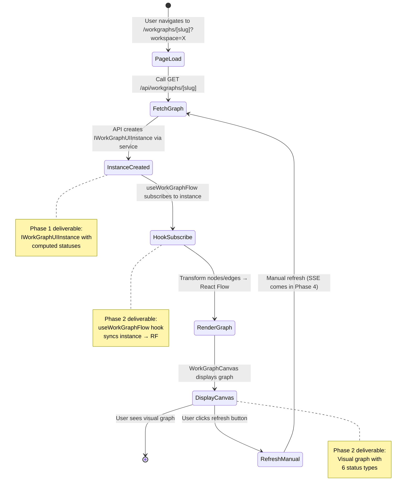
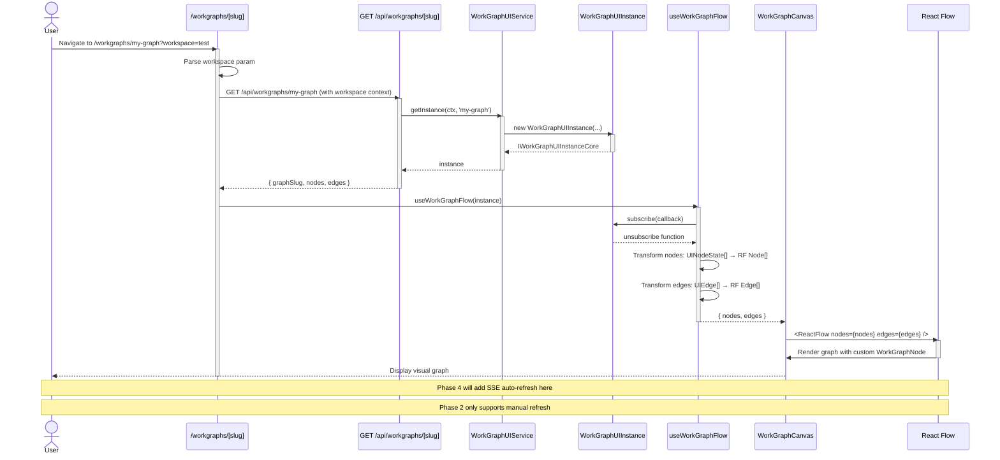

# Phase 2: Visual Graph Display – Tasks & Alignment Brief

**Spec**: [workgraph-ui-spec.md](../../workgraph-ui-spec.md)
**Plan**: [workgraph-ui-plan.md](../../workgraph-ui-plan.md)
**Date**: 2026-01-29

---

## Executive Briefing

### Purpose
This phase transforms the headless state management from Phase 1 into a visual experience, enabling users to see WorkGraph structure and real-time execution status through an interactive graph canvas.

### What We're Building
A React Flow-based visual graph display that:
- Renders WorkGraph nodes with custom styling for each status
- Shows edges representing data flow between nodes
- Provides status-specific visual indicators (colors, icons, spinners)
- Displays graphs in a Next.js route at `/workgraphs/[slug]`

### User Value
Users can visualize their WorkGraph structure and execution state at a glance, replacing mental modeling of CLI output with immediate visual feedback on workflow composition and agent progress.

### Example
**Before (CLI only)**: 
```
$ wg status my-graph
start: complete
sample-input-a7f: ready
sample-coder-b2c: pending
```

**After (Visual UI)**:
- `start` node shows green background with ✓ icon
- `sample-input-a7f` node shows blue background with play icon
- `sample-coder-b2c` node shows gray background
- Arrows flow from start → sample-input-a7f → sample-coder-b2c

---

## Objectives & Scope

### Objective
Integrate React Flow to render WorkGraph as interactive visual graph with custom node types, satisfying acceptance criteria AC-5 (status visualization) from the spec.

### Goals

- ✅ Custom React Flow node component displaying node ID, unit type, and status
- ✅ Visual status indicators for all 6 statuses (pending, ready, running, waiting-question, blocked-error, complete)
- ✅ Read-only graph display (no editing yet - Phase 3)
- ✅ Next.js routes: `/workgraphs` (list) and `/workgraphs/[slug]` (detail)
- ✅ API endpoints for fetching graph data
- ✅ Workspace-aware via URL query param (`?workspace=<slug>`)

### Non-Goals

- ❌ Graph editing (Phase 3: drag-drop, edge connection, node deletion)
- ❌ Real-time updates via SSE (Phase 4: SSE subscription)
- ❌ Question/answer UI (Phase 5: modal rendering)
- ❌ Layout persistence (Phase 6: layout.json read/write)
- ❌ Graph management (Phase 7: create, delete operations)
- ❌ Auto-layout algorithms (simple vertical cascade from Phase 1 sufficient)
- ❌ Performance optimization for large graphs (defer until needed)

---

## Architecture Map

### Component Diagram

```mermaid
flowchart TD
    classDef pending fill:#9E9E9E,stroke:#757575,color:#fff
    classDef inprogress fill:#FF9800,stroke:#F57C00,color:#fff
    classDef completed fill:#4CAF50,stroke:#388E3C,color:#fff
    classDef blocked fill:#F44336,stroke:#D32F2F,color:#fff

    style Phase fill:#F5F5F5,stroke:#E0E0E0
    style Tests fill:#F5F5F5,stroke:#E0E0E0
    style Components fill:#F5F5F5,stroke:#E0E0E0
    style Routes fill:#F5F5F5,stroke:#E0E0E0
    style API fill:#F5F5F5,stroke:#E0E0E0

    subgraph Phase["Phase 2: Visual Graph Display"]
        T001["T001: Write tests for useWorkGraphFlow hook"]:::pending
        T002["T002: Implement useWorkGraphFlow hook"]:::pending
        T003["T003: Write tests for WorkGraphNode component"]:::pending
        T004["T004: Implement WorkGraphNode component"]:::pending
        T005["T005: Write tests for StatusIndicator component"]:::pending
        T006["T006: Implement StatusIndicator component"]:::pending
        T007["T007: Write tests for WorkGraphCanvas component"]:::pending
        T008["T008: Implement WorkGraphCanvas component"]:::pending
        T009["T009: Create /workgraphs list page"]:::pending
        T010["T010: Create /workgraphs/[slug] detail page"]:::pending
        T011["T011: Add workspace URL param handling"]:::pending
        T012["T012: Create API route for listing graphs"]:::pending
        T013["T013: Create API route for loading single graph"]:::pending

        T001 --> T002
        T002 --> T008
        T003 --> T004
        T004 --> T008
        T005 --> T006
        T006 --> T004
        T007 --> T008
        T008 --> T010
        T009 --> T010
        T011 --> T009
        T011 --> T010
        T012 --> T009
        T013 --> T010
    end

    subgraph Tests["Test Files"]
        F1["/test/unit/web/features/022-workgraph-ui/use-workgraph-flow.test.ts"]:::pending
        F2["/test/unit/web/features/022-workgraph-ui/workgraph-node.test.tsx"]:::pending
        F3["/test/unit/web/features/022-workgraph-ui/status-indicator.test.tsx"]:::pending
        F4["/test/unit/web/features/022-workgraph-ui/workgraph-canvas.test.tsx"]:::pending
    end

    subgraph Components["Feature Components"]
        F5["/apps/web/src/features/022-workgraph-ui/use-workgraph-flow.ts"]:::pending
        F6["/apps/web/src/features/022-workgraph-ui/workgraph-node.tsx"]:::pending
        F7["/apps/web/src/features/022-workgraph-ui/status-indicator.tsx"]:::pending
        F8["/apps/web/src/features/022-workgraph-ui/workgraph-canvas.tsx"]:::pending
    end

    subgraph Routes["Next.js Routes (under workspaces/[slug])"]
        F9["/apps/web/src/app/(dashboard)/workspaces/[slug]/workgraphs/page.tsx"]:::pending
        F10["/apps/web/src/app/(dashboard)/workspaces/[slug]/workgraphs/[graphSlug]/page.tsx"]:::pending
    end

    subgraph API["API Routes (under workspaces/[slug])"]
        F11["/apps/web/src/app/api/workspaces/[slug]/workgraphs/route.ts"]:::pending
        F12["/apps/web/src/app/api/workspaces/[slug]/workgraphs/[graphSlug]/route.ts"]:::pending
    end

    T001 -.-> F1
    T002 -.-> F5
    T003 -.-> F2
    T004 -.-> F6
    T005 -.-> F3
    T006 -.-> F7
    T007 -.-> F4
    T008 -.-> F8
    T009 -.-> F9
    T010 -.-> F10
    T011 -.-> F9
    T011 -.-> F10
    T012 -.-> F11
    T013 -.-> F12
```

<!-- Status: grey=pending, orange=in-progress, green=completed, red=blocked -->
<!-- Updated by plan-6 during implementation -->



### Task-to-Component Mapping

<!-- Status: ⬜ Pending | 🟧 In Progress | ✅ Complete | 🔴 Blocked -->

| Task | Component(s) | Files | Status | Comment |
|------|-------------|-------|--------|---------|
| T001 | useWorkGraphFlow hook | use-workgraph-flow.test.ts | ⬜ Pending | Tests instance → React Flow transformation |
| T002 | useWorkGraphFlow hook | use-workgraph-flow.ts | ⬜ Pending | Syncs UINodeState/UIEdge to RF nodes/edges |
| T003 | WorkGraphNode component | workgraph-node.test.tsx | ⬜ Pending | Tests node rendering for all statuses |
| T004 | WorkGraphNode component | workgraph-node.tsx | ⬜ Pending | Custom React Flow node with status display |
| T005 | StatusIndicator component | status-indicator.test.tsx | ⬜ Pending | Tests 6 status visual treatments |
| T006 | StatusIndicator component | status-indicator.tsx | ⬜ Pending | Renders color + icon for each status |
| T007 | WorkGraphCanvas component | workgraph-canvas.test.tsx | ⬜ Pending | Tests ReactFlow wrapper configuration |
| T008 | WorkGraphCanvas component | workgraph-canvas.tsx | ⬜ Pending | Main canvas with RF controls |
| T009 | Graph list page | workspaces/[slug]/workgraphs/page.tsx | ⬜ Pending | Server component listing graphs in workspace |
| T010 | Graph detail page | workspaces/[slug]/workgraphs/[graphSlug]/page.tsx | ⬜ Pending | Client component with canvas |
| T011 | Workspace context from path param | workgraphs routes | ⬜ Pending | Workspace slug from [slug] path param (not query) |
| T012 | Graphs API | api/workspaces/[slug]/workgraphs/route.ts | ⬜ Pending | GET endpoint returns GraphSummary[] |
| T013 | Single graph API | api/workspaces/[slug]/workgraphs/[graphSlug]/route.ts | ⬜ Pending | GET endpoint returns full graph data |

---

## Tasks

| Status | ID   | Task | CS | Type | Dependencies | Absolute Path(s) | Validation | Subtasks | Notes |
|--------|------|------|----|------|--------------|------------------|------------|----------|-------|
| [ ] | T001 | Write tests for useWorkGraphFlow hook | 2 | Test | – | /home/jak/substrate/022-workgraph-ui/test/unit/web/features/022-workgraph-ui/use-workgraph-flow.test.ts | Tests define: transform serialized data→RF nodes/edges (no subscription in Phase 2) | – | TDD RED; per DYK#2 |
| [ ] | T002 | Implement useWorkGraphFlow hook | 2 | Core | T001 | /home/jak/substrate/022-workgraph-ui/apps/web/src/features/022-workgraph-ui/use-workgraph-flow.ts | Tests pass; hook accepts {nodes: UINodeState[], edges: UIEdge[]} JSON, returns RF format | – | TDD GREEN; per DYK#2 (Phase 4 adds instance subscription) |
| [ ] | T003 | Write tests for WorkGraphNode component | 2 | Test | – | /home/jak/substrate/022-workgraph-ui/test/unit/web/features/022-workgraph-ui/workgraph-node.test.tsx | Tests cover: status colors, icons, unit type display, node ID rendering | – | TDD RED; per CD-02 |
| [ ] | T004 | Implement WorkGraphNode custom node | 3 | Core | T003, T006 | /home/jak/substrate/022-workgraph-ui/apps/web/src/features/022-workgraph-ui/workgraph-node.tsx | Tests pass; node displays id, unit type, StatusIndicator; React Flow custom node type | – | TDD GREEN; plan-scoped |
| [ ] | T005 | Write tests for StatusIndicator component | 2 | Test | – | /home/jak/substrate/022-workgraph-ui/test/unit/web/features/022-workgraph-ui/status-indicator.test.tsx | Tests cover: 6 statuses with correct visual treatment (color, icon, animations) | – | TDD RED |
| [ ] | T006 | Implement StatusIndicator component | 2 | Core | T005 | /home/jak/substrate/022-workgraph-ui/apps/web/src/features/022-workgraph-ui/status-indicator.tsx | Tests pass; renders: pending(gray), ready(blue), running(yellow+spinner), waiting-question(purple+?), blocked-error(red+X), complete(green+✓) | – | TDD GREEN; AC-5 |
| [ ] | T007 | Write tests for WorkGraphCanvas component | 2 | Test | – | /home/jak/substrate/022-workgraph-ui/test/unit/web/features/022-workgraph-ui/workgraph-canvas.test.tsx | Tests cover: ReactFlow config, nodeTypes registration, read-only mode | – | TDD RED |
| [ ] | T008 | Implement WorkGraphCanvas component | 2 | Core | T002, T004, T007 | /home/jak/substrate/022-workgraph-ui/apps/web/src/features/022-workgraph-ui/workgraph-canvas.tsx | Tests pass; canvas wraps ReactFlow with proper config, uses useWorkGraphFlow hook | – | TDD GREEN; plan-scoped |
| [ ] | T009 | Create /workspaces/[slug]/workgraphs list page | 2 | Core | T011, T012 | /home/jak/substrate/022-workgraph-ui/apps/web/src/app/(dashboard)/workspaces/[slug]/workgraphs/page.tsx | Page renders empty state with CLI guidance (listGraphs returns []) + optional "Open Graph" input | – | Server component; per DYK#1 + DYK#5 |
| [ ] | T010 | Create /workspaces/[slug]/workgraphs/[graphSlug] detail page | 2 | Core | T008, T009, T011, T013 | /home/jak/substrate/022-workgraph-ui/apps/web/src/app/(dashboard)/workspaces/[slug]/workgraphs/[graphSlug]/page.tsx | Server Component fetches, passes JSON to <WorkGraphDetailClient> client child | – | per DYK#1 + DYK#3 (Server→Client pattern) |
| [ ] | T011 | Extract workspace context from path params | 1 | Setup | – | /home/jak/substrate/022-workgraph-ui/apps/web/src/app/(dashboard)/workspaces/[slug]/workgraphs/page.tsx, /home/jak/substrate/022-workgraph-ui/apps/web/src/app/(dashboard)/workspaces/[slug]/workgraphs/[graphSlug]/page.tsx | Workspace slug from params.slug (path param, not query); uses resolveContextFromParams | – | Per ADR-0008; per DYK#1 |
| [ ] | T012 | Create API route for listing graphs | 2 | Core | – | /home/jak/substrate/022-workgraph-ui/apps/web/src/app/api/workspaces/[slug]/workgraphs/route.ts | GET /api/workspaces/[slug]/workgraphs returns GraphSummary[] | – | per DYK#1; uses IWorkGraphUIService.listGraphs() |
| [ ] | T013 | Create API route for loading single graph | 2 | Core | – | /home/jak/substrate/022-workgraph-ui/apps/web/src/app/api/workspaces/[slug]/workgraphs/[graphSlug]/route.ts | GET /api/workspaces/[slug]/workgraphs/[graphSlug] returns full graph data | – | per DYK#1; uses IWorkGraphUIService.getInstance() |

---

## Alignment Brief

### Prior Phases Review

#### Phase 1: Headless State Management

**A. Deliverables Created**

Phase 1 established the complete headless state management foundation that Phase 2 builds upon:

**Core Implementation Files**:
- `/home/jak/substrate/022-workgraph-ui/apps/web/src/features/022-workgraph-ui/workgraph-ui.types.ts`: TypeScript interfaces (IWorkGraphUIService, IWorkGraphUIInstanceCore, IWorkGraphUIInstance, UINodeState, UIEdge, Position, etc.)
- `/home/jak/substrate/022-workgraph-ui/apps/web/src/features/022-workgraph-ui/workgraph-ui.service.ts`: Singleton service with graph instance factory, caching by `${worktreePath}|${graphSlug}` key
- `/home/jak/substrate/022-workgraph-ui/apps/web/src/features/022-workgraph-ui/workgraph-ui.instance.ts`: State manager with status computation, event emission, refresh mechanism (~350 lines)
- `/home/jak/substrate/022-workgraph-ui/apps/web/src/features/022-workgraph-ui/index.ts`: Barrel export for all types, implementations, fakes

**Fake Implementations** (Critical for Phase 2 testing):
- `/home/jak/substrate/022-workgraph-ui/apps/web/src/features/022-workgraph-ui/fake-workgraph-ui-service.ts`: Call tracking with `wasCreatedWith()`, `wasDeleted()`, preset configuration
- `/home/jak/substrate/022-workgraph-ui/apps/web/src/features/022-workgraph-ui/fake-workgraph-ui-instance.ts`: Static factories (`withNodes()`, `withGraph()`, `fromDefinitionAndState()`), event triggers, assertion helpers - **ESSENTIAL for React hook testing**

**Test Infrastructure** (49 passing tests):
- Service tests, instance tests, status computation tests
- Pattern: Use `FakeWorkGraphUIInstance.withNodes([...])` in React hook tests

**Schema**:
- `/home/jak/substrate/022-workgraph-ui/packages/workgraph/src/schemas/layout.schema.ts`: Zod schema for layout.json (Phase 6 will consume)

**Cross-Cutting Modifications**:
- `/home/jak/substrate/022-workgraph-ui/apps/web/src/lib/di-container.ts`: Added `WORKGRAPH_UI_SERVICE` token with production + test registrations

**B. Lessons Learned**

**Approaches That Worked**:
- **Full TDD flow**: RED→GREEN→REFACTOR followed for all 49 tests - continue this pattern in Phase 2
- **Fake-first pattern**: Creating Fakes before real implementations simplified testing - **use FakeWorkGraphUIInstance in React component tests**
- **Vertical cascade positioning**: Simple default positions (y = index * 150) eliminated layout complexity - Phase 2 can rely on this

**Complexity Discovered**:
- **Status computation recursion**: Diamond dependencies required memoization to avoid recomputation - React Flow updates must be efficient
- **Change detection**: JSON.stringify comparison is simple but potentially expensive for large graphs - Phase 2 should memoize React components

**C. Technical Discoveries**

**Gotchas** (MUST AVOID in Phase 2):
1. **Disposed instance async safety**: Must check `isDisposed` both BEFORE and AFTER async operations (lines 300-311 in `workgraph-ui.instance.ts`) - React effects must cleanup subscriptions
2. **Event emission on disposed**: Silent return instead of error - React hooks must unsubscribe in cleanup

**Limitations**:
- **No automatic refresh**: Instances require explicit `refresh()` calls - Phase 2 pages must call manually (SSE comes in Phase 4)
- **JSON hash comparison**: May have performance implications for large graphs - React should use React.memo and useMemo

**Edge Cases Handled** (that Phase 2 can rely on):
- Orphan nodes (no incoming edges) → status: `ready`
- Diamond dependencies → memoized computation prevents double-counting
- Multiple dispose calls → safe, no-op after first call

**D. Dependencies Exported** (FOR PHASE 2 CONSUMPTION)

**IWorkGraphUIService Interface** (from line 238-285, `workgraph-ui.types.ts`):
```typescript
interface IWorkGraphUIService {
  getInstance(ctx: WorkspaceContext, graphSlug: string): Promise<IWorkGraphUIInstanceCore>
  listGraphs(ctx: WorkspaceContext): Promise<ListGraphsResult>  // Returns empty array (stub for Phase 3)
  createGraph(ctx: WorkspaceContext, slug: string): Promise<CreateGraphResult>
  deleteGraph(ctx: WorkspaceContext, slug: string): Promise<DeleteGraphResult>
  disposeAll(): void
}
```

**IWorkGraphUIInstanceCore Interface** (from line 156-196, `workgraph-ui.types.ts`) - **PRIMARY HOOK DATA SOURCE**:
```typescript
interface IWorkGraphUIInstanceCore {
  readonly graphSlug: string
  readonly definition: WorkGraphDefinition
  readonly state: WorkGraphState
  readonly nodes: Map<string, UINodeState>  // ← useWorkGraphFlow transforms this to RF nodes
  readonly edges: UIEdge[]                   // ← useWorkGraphFlow transforms this to RF edges
  subscribe(callback: WorkGraphUIEventCallback): Unsubscribe  // ← React hook subscribes here
  refresh(): Promise<void>
  dispose(): void  // ← React hook cleanup
}
```

**UINodeState Interface** (from `workgraph-ui.types.ts`) - **REACT FLOW NODE DATA**:
```typescript
interface UINodeState {
  id: string
  unitSlug: string | null
  status: NodeStatus  // 'pending' | 'ready' | 'running' | 'waiting-question' | 'blocked-error' | 'complete'
  position: Position  // { x: number, y: number }
  unit?: WorkUnit | null
}
```

**Key Types for Import in Phase 2**:
```typescript
import type {
  IWorkGraphUIService, IWorkGraphUIInstanceCore,
  UINodeState, UIEdge, Position, WorkGraphUIEvent, NodeStatus
} from '@features/022-workgraph-ui'

// For testing:
import { FakeWorkGraphUIInstance, FakeWorkGraphUIService } from '@features/022-workgraph-ui'
```

**DI Token** (for injecting service):
- `DI_TOKENS.WORKGRAPH_UI_SERVICE` (line 119, `di-container.ts`)

**E. Critical Findings Applied in Phase 1**

| Finding | Applied | How/Where | Phase 2 Impact |
|---------|---------|-----------|----------------|
| **CD-01: Computed vs Stored Status** | ✅ | `computeNodeStatus()` in `workgraph-ui.instance.ts:58-118` | Phase 2 gets correct statuses from `instance.nodes` - no special handling needed |
| **CD-02: Direct Output Pattern for UserInputUnit** | ⚠️ | Not applicable in Phase 1 (no UI yet) | **Phase 2 MUST render user-input nodes distinctly** - different visual treatment |
| **CD-05: SSE Notification-Fetch Pattern** | ✅ | `refresh()` ready for Phase 4 integration | Phase 2 uses manual refresh; SSE in Phase 4 |
| **Discovery 06: Layout in Separate File** | ✅ | `layout.schema.ts` created | Phase 2 uses Phase 1's vertical cascade positions |

**F. Incomplete/Blocked Items**

**All Phase 1 Tasks Complete** ✅ (13/13 tasks marked [x])

**Known Stubs** (Phase 2 must work around):
- `listGraphs()`: Returns empty array - **Phase 2 API route must handle empty state gracefully**
- `deleteGraph()`: Only removes from cache - Phase 7 will implement
- Layout loading: Schema only, no read/write - Phase 6 will implement

**G. Test Infrastructure** (Reusable in Phase 2)

**Fake Implementations** (USE THESE in Phase 2 tests):

**FakeWorkGraphUIService**:
- `setPresetInstance(instance)`: Configure fake instance for DI injection
- `wasCreatedWith(ctx, slug)`: Assert graph creation
- `reset()`: Reset call history between tests

**FakeWorkGraphUIInstance** (CRITICAL for useWorkGraphFlow tests):
- `withNodes(nodes)`: Factory for test instances with specific node states
- `withGraph(definition, state)`: Factory with full graph structure
- `emitChanged()`: Trigger change event for subscription tests
- `wasRefreshCalled()`: Assert refresh was called
- `getSubscriberCount()`: Assert hook subscribed

**Example for Phase 2 hook tests**:
```typescript
describe('useWorkGraphFlow', () => {
  test('should transform UINodeState to React Flow Node', () => {
    // Use Fake from Phase 1 per Constitution Principle 4
    const fakeInstance = FakeWorkGraphUIInstance.withNodes([
      { id: 'start', status: 'complete', position: { x: 100, y: 50 } },
      { id: 'nodeA', unitSlug: 'sample-input', status: 'ready', position: { x: 100, y: 200 } }
    ]);
    
    const { result } = renderHook(() => useWorkGraphFlow(fakeInstance));
    
    expect(result.current.nodes).toHaveLength(2);
    expect(result.current.nodes[0]).toMatchObject({
      id: 'start',
      position: { x: 100, y: 50 },
      data: { status: 'complete' }
    });
  });
});
```

**H. Technical Debt** (Inherited by Phase 2)

1. **listGraphs stub**: API route will return empty array initially - add TODO comment
2. **JSON.stringify hash**: React should use `React.memo` and `useMemo` to avoid expensive re-renders
3. **No unit field population**: `UINodeState.unit` not populated from definition - Phase 2 displays `unitSlug` only for now

**I. Architectural Decisions** (Phase 2 MUST FOLLOW)

**Patterns Established**:
1. **Headless principle**: Phase 1 implementation has NO React dependencies - Phase 2 creates React layer on top
2. **Event-driven updates**: Phase 1 uses event emitter pattern - Phase 2 hooks must subscribe/unsubscribe properly
3. **Vertical cascade default positions**: `{x: 100, y: index * 150}` - Phase 2 can rely on this; no auto-layout needed
4. **Fakes with static factories**: `withNodes()`, `withGraph()` pattern - **Phase 2 MUST use these in tests** (Constitution Principle 4)

**Anti-patterns to Avoid**:
1. ❌ Don't use mocking libraries (vi.fn, vi.mock) - **Use FakeWorkGraphUIInstance from Phase 1**
2. ❌ Don't modify Phase 1 files unless absolutely necessary - Phase 2 is additive
3. ❌ Don't access WorkGraphService directly - go through IWorkGraphUIService
4. ❌ Don't render before subscribing to instance - React hooks must setup subscription in useEffect

**J. Scope Changes**

No scope changes in Phase 1 - plan followed exactly.

**K. Key Log References** (from Phase 1 execution.log.md)

| Decision | Location | Relevance to Phase 2 |
|----------|----------|----------------------|
| Phased interface decision | execution.log.md T004 (line 83-91) | Phase 2 uses IWorkGraphUIInstanceCore (read-only) |
| Status computation algorithm | execution.log.md T010 (line 193-208) | Phase 2 can trust `instance.nodes` status values |
| Vertical cascade positioning | execution.log.md T010 (line 201) | Phase 2 positions come from instance.nodes[id].position |
| Disposed flag pattern | execution.log.md T010 (line 203) | Phase 2 React hooks must cleanup subscriptions |
| DI registration | execution.log.md T012 (line 236-249) | Phase 2 API routes use `container.get(DI_TOKENS.WORKGRAPH_UI_SERVICE)` |

---

### Critical Findings Affecting This Phase

**From Plan § 4 Critical Research Findings**:

#### 🚨 Critical Discovery 02: Direct Output Pattern for UserInputUnit
**Impact on Phase 2**: High

**Problem**: UserInputUnit nodes skip `running` state entirely (PENDING → COMPLETE)

**Solution Required in Phase 2**:
- WorkGraphNode component must detect `unitSlug === 'user-input'` (or check unit type from definition)
- Render distinct visual treatment: show input icon instead of play/spinner
- Do NOT show "running" spinner for these nodes even if other nodes show spinners

**Example Visual Treatment**:
```typescript
// In WorkGraphNode.tsx
function getNodeIcon(node: UINodeState): ReactNode {
  if (node.unitSlug?.includes('user-input')) {
    return <UserInputIcon />; // Clipboard or form icon
  }
  // ... other status-based icons
}
```

**Tasks Affected**: T003 (WorkGraphNode tests must cover user-input nodes), T004 (implementation), T006 (StatusIndicator may need special case)

**Validation**: WorkGraphNode test must verify user-input nodes display distinct icon/treatment

---

#### 🚨 Critical Discovery 01: Computed vs Stored Status
**Impact on Phase 2**: Low (already handled by Phase 1)

**Context**: Phase 1 implemented status computation correctly - Phase 2 just consumes `instance.nodes[id].status`

**No special handling needed**: useWorkGraphFlow hook transforms `instance.nodes` → React Flow nodes, status comes from Phase 1 computation

---

### ADR Decision Constraints

**ADR-0004: Dependency Injection Container Architecture**
- **Decision**: Use `useFactory` pattern for service registration
- **Constraint**: API routes must inject IWorkGraphUIService via DI container, not direct imports
- **Addressed by**: T012, T013
- **Code Pattern**:
  ```typescript
  // In API routes
  import { container, DI_TOKENS } from '@/lib/di-container';
  
  export async function GET(request: Request) {
    const service = container.get<IWorkGraphUIService>(DI_TOKENS.WORKGRAPH_UI_SERVICE);
    const instance = await service.getInstance(ctx, slug);
    // ...
  }
  ```

**ADR-0008: Workspace Split Storage Data Model**
- **Decision**: Graph files at `<worktree>/.chainglass/data/work-graphs/`
- **Constraint**: All operations scoped to workspace context (worktree path)
- **Addressed by**: T011 (workspace URL param handling)
- **Code Pattern**:
  ```typescript
  // Parse workspace from URL
  const searchParams = useSearchParams();
  const workspace = searchParams.get('workspace') || 'default';
  ```

**ADR-0007: SSE Single-Channel Routing** (Phase 4 scope, but documented here)
- **Decision**: Use `workgraphs` channel for all graph events
- **Not applicable to Phase 2**: SSE subscription happens in Phase 4
- **Phase 2 uses manual refresh only**

---

### PlanPak Placement Rules

**Plan-Scoped Files** → `apps/web/src/features/022-workgraph-ui/` (flat, descriptive names):
- ✅ `use-workgraph-flow.ts` (hook)
- ✅ `workgraph-node.tsx` (React Flow custom node)
- ✅ `status-indicator.tsx` (reusable status component)
- ✅ `workgraph-canvas.tsx` (main canvas wrapper)

**Plan-Scoped Routes** → `apps/web/src/app/workgraphs/`:
- ✅ `page.tsx` (list page)
- ✅ `[slug]/page.tsx` (detail page)

**Plan-Scoped API Routes** → `apps/web/src/app/api/workgraphs/`:
- ✅ `route.ts` (list endpoint)
- ✅ `[slug]/route.ts` (detail endpoint)

**Plan-Scoped Tests** → `test/unit/web/features/022-workgraph-ui/`:
- ✅ `use-workgraph-flow.test.ts`
- ✅ `workgraph-node.test.tsx`
- ✅ `status-indicator.test.tsx`
- ✅ `workgraph-canvas.test.tsx`

**Cross-Cutting Files** (if needed):
- Phase 1 already updated `di-container.ts` - no changes needed in Phase 2

**Dependency Direction** (PlanPak rule):
- ✅ Plan-scoped files → shared packages (allowed): `import { IWorkGraphUIService } from '@features/022-workgraph-ui'`
- ❌ Shared → plan-scoped (never): No shared code should import from features/022-workgraph-ui

---

### Invariants & Guardrails

**Performance Budget**:
- React Flow renders graphs up to 50 nodes smoothly (per spec success metrics)
- Use `React.memo` on WorkGraphNode to prevent unnecessary re-renders
- Use `useMemo` for node/edge array transformations in useWorkGraphFlow

**Memory Budget**:
- Subscribe to instance in useEffect, unsubscribe in cleanup
- Dispose instance when component unmounts (if created by component)

**Security**:
- Workspace context from URL param must be validated
- API routes must validate workspace access permissions (if applicable)

---

### Test Plan

**TDD Approach** (Per Plan § 5 Testing Philosophy):
- **RED**: Write test first, verify it fails
- **GREEN**: Implement minimal code to pass test
- **REFACTOR**: Improve quality while keeping tests green

**Mock Usage Preference** (Per Constitution § 4):
- ✅ **USE**: `FakeWorkGraphUIInstance`, `FakeWorkGraphUIService` (from Phase 1)
- ❌ **NO**: `vi.fn()`, `vi.mock()`, `jest.mock()`, Sinon stubs
- **Fake Pattern Required for All Test Doubles**

**Named Tests with Documentation** (Per Plan § 5):

**T001 Tests (useWorkGraphFlow hook)** - per DYK#2 (serialized data, no subscriptions in Phase 2):
```typescript
describe('useWorkGraphFlow', () => {
  test('should transform UINodeState[] to React Flow Node[]', () => {
    /**
     * Purpose: Proves correct mapping from serialized data to RF format
     * Quality Contribution: Ensures graph renders correctly
     * Acceptance Criteria: RF nodes have correct id, position, data
     */
    const data = {
      nodes: [
        { id: 'start', status: 'complete', position: { x: 100, y: 50 } },
        { id: 'nodeA', unit: 'sample-input', status: 'ready', position: { x: 100, y: 200 } }
      ],
      edges: [{ id: 'e1', source: 'start', target: 'nodeA' }]
    };
    const { result } = renderHook(() => useWorkGraphFlow(data));
    expect(result.current.nodes).toHaveLength(2);
    expect(result.current.nodes[0]).toMatchObject({
      id: 'start',
      position: { x: 100, y: 50 },
      data: { status: 'complete' }
    });
  });

  test('should transform UIEdge[] to React Flow Edge[]', () => {
    /**
     * Purpose: Proves edge transformation works correctly
     * Quality Contribution: Ensures connections render correctly
     * Acceptance Criteria: RF edges have source, target, proper type
     */
    const data = {
      nodes: [{ id: 'a', status: 'ready', position: { x: 0, y: 0 } }],
      edges: [{ id: 'e1', source: 'start', target: 'a' }]
    };
    const { result } = renderHook(() => useWorkGraphFlow(data));
    expect(result.current.edges[0]).toMatchObject({
      id: 'e1',
      source: 'start',
      target: 'a'
    });
  });

  test('should memoize output when data unchanged', () => {
    /**
     * Purpose: Proves performance optimization via memoization
     * Quality Contribution: Prevents unnecessary re-renders
     * Acceptance Criteria: Same input = same output reference
     */
    const data = { nodes: [], edges: [] };
    const { result, rerender } = renderHook(() => useWorkGraphFlow(data));
    const firstNodes = result.current.nodes;
    rerender();
    expect(result.current.nodes).toBe(firstNodes); // Same reference
  });

  test('should handle empty arrays gracefully', () => {
    /**
     * Purpose: Proves edge case handling
     * Quality Contribution: No crashes on empty graph
     * Acceptance Criteria: Returns empty arrays, no errors
     */
    const data = { nodes: [], edges: [] };
    const { result } = renderHook(() => useWorkGraphFlow(data));
    expect(result.current.nodes).toEqual([]);
    expect(result.current.edges).toEqual([]);
  });
});
// NOTE: Subscription tests move to Phase 4 when hook accepts IWorkGraphUIInstanceCore
```

**T003 Tests (WorkGraphNode component)**:
```typescript
describe('WorkGraphNode', () => {
  test('should render running status with spinner', () => {
    /**
     * Purpose: Proves running state has correct visual treatment
     * Quality Contribution: Users can see active processing
     * Acceptance Criteria: Yellow background, spinner icon visible
     */
    render(<WorkGraphNode data={{ id: 'nodeA', status: 'running', unitSlug: 'sample-coder' }} />);
    expect(screen.getByTestId('status-indicator')).toHaveClass('bg-yellow-500');
    expect(screen.getByTestId('spinner-icon')).toBeInTheDocument();
  });

  test('should render user-input node with distinct icon', () => {
    /**
     * Purpose: Proves user-input nodes have special visual treatment (per CD-02)
     * Quality Contribution: Distinguishes user-input from agent nodes
     * Acceptance Criteria: Input icon displayed, not play/spinner
     */
    render(<WorkGraphNode data={{ id: 'nodeA', status: 'ready', unitSlug: 'user-input' }} />);
    expect(screen.getByTestId('user-input-icon')).toBeInTheDocument();
    expect(screen.queryByTestId('spinner-icon')).not.toBeInTheDocument();
  });

  test('should render all 6 status types correctly', () => {
    /**
     * Purpose: Proves all status visual treatments implemented (AC-5)
     * Quality Contribution: Complete status coverage
     * Acceptance Criteria: Each status renders with correct color/icon
     */
    const statuses: NodeStatus[] = [
      'pending', 'ready', 'running', 'waiting-question', 'blocked-error', 'complete'
    ];
    statuses.forEach(status => {
      const { container } = render(<WorkGraphNode data={{ id: 'test', status, unitSlug: 'test' }} />);
      // Assert correct visual treatment for each
    });
  });
});
```

**T005 Tests (StatusIndicator component)**:
```typescript
describe('StatusIndicator', () => {
  test.each([
    ['pending', 'bg-gray-500', undefined],
    ['ready', 'bg-blue-500', 'play-icon'],
    ['running', 'bg-yellow-500', 'spinner-icon'],
    ['waiting-question', 'bg-purple-500', 'question-icon'],
    ['blocked-error', 'bg-red-500', 'error-icon'],
    ['complete', 'bg-green-500', 'check-icon']
  ])('should render %s status with %s and %s', (status, colorClass, iconTestId) => {
    /**
     * Purpose: Proves each status has correct visual treatment
     * Quality Contribution: Complete status coverage (AC-5)
     * Acceptance Criteria: Correct color class and icon for each status
     */
    render(<StatusIndicator status={status as NodeStatus} />);
    expect(screen.getByTestId('status-indicator')).toHaveClass(colorClass);
    if (iconTestId) {
      expect(screen.getByTestId(iconTestId)).toBeInTheDocument();
    }
  });
});
```

**Non-Happy-Path Coverage**:
- [ ] useWorkGraphFlow handles disposed instance gracefully
- [ ] WorkGraphNode renders with missing unitSlug (null case)
- [ ] API routes handle missing workspace param
- [ ] API routes handle non-existent graph slug (404)

---

### Visual Alignment Aids

#### System State Flow Diagram



#### Actor/Interaction Sequence Diagram



---

### Implementation Outline (Step-by-Step Mapped to Tasks)

**Step 1: Hook Layer (T001-T002)**
1. Write tests for `useWorkGraphFlow` hook (T001)
   - Test node transformation (UINodeState → RF Node)
   - Test edge transformation (UIEdge → RF Edge)
   - Test subscription lifecycle (subscribe on mount, unsubscribe on unmount)
   - Test updates when instance emits `changed` event
2. Implement `useWorkGraphFlow` hook (T002)
   - Accept `IWorkGraphUIInstanceCore` parameter
   - useState for RF nodes/edges
   - useEffect to subscribe to instance, transform state, unsubscribe on cleanup
   - Return { nodes, edges } for React Flow

**Step 2: Component Layer (T003-T008)**
3. Write tests for `StatusIndicator` component (T005)
   - Test all 6 status types with correct color/icon
   - Test animations (spinner for running)
4. Implement `StatusIndicator` component (T006)
   - Switch on status prop
   - Render color-coded background + icon for each status
5. Write tests for `WorkGraphNode` component (T003)
   - Test node rendering with status, unitSlug, id
   - Test user-input node special treatment (per CD-02)
   - Test integration with StatusIndicator
6. Implement `WorkGraphNode` component (T004)
   - Custom React Flow node type
   - Display node ID, unit type, StatusIndicator
   - Special handling for user-input nodes
7. Write tests for `WorkGraphCanvas` component (T007)
   - Test ReactFlow configuration
   - Test nodeTypes registration
   - Test read-only mode (no editing)
8. Implement `WorkGraphCanvas` component (T008)
   - Wrap ReactFlow with custom config
   - Register WorkGraphNode as custom node type
   - Use useWorkGraphFlow hook for data

**Step 3: Route Layer (T009-T011)**
9. Add workspace URL param handling (T011)
   - Parse `?workspace=slug` from URL
   - Pass to API routes as context
10. Create `/workgraphs` list page (T009)
    - Server component
    - Fetch graphs via API
    - Display list with links to detail pages
11. Create `/workgraphs/[slug]` detail page (T010)
    - Client component wrapper
    - Load graph data via API
    - Render WorkGraphCanvas

**Step 4: API Layer (T012-T013)**
12. Create API route for listing graphs (T012)
    - GET /api/workgraphs
    - Inject IWorkGraphUIService via DI
    - Call service.listGraphs(ctx)
    - Return GraphSummary[]
13. Create API route for loading single graph (T013)
    - GET /api/workgraphs/[slug]
    - Inject IWorkGraphUIService via DI
    - Call service.getInstance(ctx, slug)
    - Return { graphSlug, nodes, edges }

---

### Commands to Run

**Test Commands** (per task):
```bash
# Run all Phase 2 tests
pnpm test -- --testPathPattern="022-workgraph-ui" --testPathPattern="(flow|node|canvas|status)"

# Run hook tests only
pnpm test -- --testPathPattern="use-workgraph-flow"

# Run component tests only
pnpm test -- --testPathPattern="(workgraph-node|status-indicator|workgraph-canvas)"

# Watch mode during development
pnpm test -- --watch --testPathPattern="022-workgraph-ui"
```

**Type Check**:
```bash
just typecheck
```

**Lint**:
```bash
just lint
```

**Dev Server Verification**:
```bash
# Start dev server
pnpm dev

# Navigate to:
# http://localhost:3000/workgraphs?workspace=test
# http://localhost:3000/workgraphs/my-graph?workspace=test
```

**Build Verification**:
```bash
just build
```

---

### Risks & Unknowns

| Risk | Severity | Likelihood | Mitigation |
|------|----------|------------|------------|
| React Flow API mismatch with v12.10.0 | Medium | Low | Use existing patterns in codebase; React Flow v12 is stable |
| Re-render performance on large graphs | Medium | Medium | Use `React.memo` on WorkGraphNode; `useMemo` for transformations |
| listGraphs() returns empty array | Low | High (known stub) | Display "No graphs" message gracefully; Phase 3 will implement |
| Subscription cleanup bugs | High | Low | Follow Phase 1 disposal pattern; test cleanup thoroughly |
| User-input node visual treatment unclear | Low | Low | Use distinct icon (clipboard/form) per CD-02; validate with sponsor |

---

### Ready Check

Before implementation begins, verify:

- [ ] **Phase 1 complete**: All 13 tasks marked [x] in Phase 1 tasks.md
- [ ] **Phase 1 exports available**: Can import IWorkGraphUIService, IWorkGraphUIInstanceCore, FakeWorkGraphUIInstance from '@features/022-workgraph-ui'
- [ ] **DI registration verified**: WORKGRAPH_UI_SERVICE token exists in di-container.ts
- [ ] **React Flow installed**: @xyflow/react v12.10.0 in apps/web/package.json
- [ ] **Test infrastructure ready**: Vitest + React Testing Library configured
- [ ] **Critical Discovery 02 understood**: User-input nodes need distinct visual treatment
- [ ] **ADR constraints mapped**: All ADR-0004 and ADR-0008 constraints noted in tasks
- [ ] **TDD commitment**: All tests written BEFORE implementation (RED→GREEN→REFACTOR)
- [ ] **Fake usage commitment**: No vi.fn() or mocking libraries; FakeWorkGraphUIInstance only

---

## Phase Footnote Stubs

**NOTE**: This section will be populated during implementation by plan-6a-update-progress. Footnotes track file changes, discoveries, and decisions made during execution.

**Initial State** (before implementation begins):

[^1]: [To be added during implementation via plan-6a]
[^2]: [To be added during implementation via plan-6a]
[^3]: [To be added during implementation via plan-6a]

---

## Evidence Artifacts

**Execution Log**: `/home/jak/substrate/022-workgraph-ui/docs/plans/022-workgraph-ui/tasks/phase-2-visual-graph-display/execution.log.md`

Plan-6 will write:
- Detailed implementation narrative
- Test output for each task
- Decisions made during implementation
- Deviations from plan
- Files created/modified with line counts

**Supporting Files**: None anticipated (all deliverables in execution log)

---

## Discoveries & Learnings

_Populated during implementation by plan-6. Log anything of interest to your future self._

| Date | Task | Type | Discovery | Resolution | References |
|------|------|------|-----------|------------|------------|
| | | | | | |

**Types**: `gotcha` | `research-needed` | `unexpected-behavior` | `workaround` | `decision` | `debt` | `insight`

**What to log**:
- Things that didn't work as expected
- External research that was required
- Implementation troubles and how they were resolved
- Gotchas and edge cases discovered
- Decisions made during implementation
- Technical debt introduced (and why)
- Insights that future phases should know about

_See also: `execution.log.md` for detailed narrative._

---

## Directory Layout

```
docs/plans/022-workgraph-ui/
├── workgraph-ui-plan.md
├── workgraph-ui-spec.md
├── research-dossier.md
└── tasks/
    ├── phase-1-headless-state-management/
    │   ├── tasks.md
    │   └── execution.log.md
    └── phase-2-visual-graph-display/
        ├── tasks.md (THIS FILE)
        └── execution.log.md (created by plan-6)
```

**Phase-scoped deliverables** (created during plan-6 implementation):

```
apps/web/src/features/022-workgraph-ui/
├── (Phase 1 files)
├── use-workgraph-flow.ts
├── workgraph-node.tsx
├── status-indicator.tsx
└── workgraph-canvas.tsx

apps/web/src/app/(dashboard)/workspaces/[slug]/workgraphs/
├── page.tsx
└── [graphSlug]/page.tsx

apps/web/src/app/api/workspaces/[slug]/workgraphs/
├── route.ts
└── [graphSlug]/route.ts

test/unit/web/features/022-workgraph-ui/
├── (Phase 1 test files)
├── use-workgraph-flow.test.ts
├── workgraph-node.test.tsx
├── status-indicator.test.tsx
└── workgraph-canvas.test.tsx
```

---

**STOP**: Do **not** edit code. Await human **GO** signal before proceeding to implementation.

**Next step**: Run `/plan-6-implement-phase --phase "Phase 2: Visual Graph Display" --plan "/home/jak/substrate/022-workgraph-ui/docs/plans/022-workgraph-ui/workgraph-ui-plan.md"`

---

## Critical Insights Discussion

**Session**: 2026-01-29
**Context**: Phase 2: Visual Graph Display Tasks Dossier
**Analyst**: AI Clarity Agent
**Reviewer**: Development Team
**Format**: Water Cooler Conversation (5 Critical Insights)

### DYK#1: URL Routing Structure Mismatch

**Did you know**: The proposed `/workgraphs/[slug]?workspace=X` route doesn't match the established workspace-first pattern and creates URL collision risks.

**Implications**:
- Graphs are identified by `worktreePath|graphSlug` but URL only encoded graphSlug
- Two workspaces could have same-named graphs causing ambiguity
- Doesn't match existing `/workspaces/[slug]/agents/...` pattern

**Options Considered**:
- Option A: Workspace in Path (`/workspaces/[slug]/workgraphs/[graphSlug]`)
- Option B: Keep Query Param but Require It
- Option C: Encode Both in Single Slug

**AI Recommendation**: Option A - Workspace in Path
- Reasoning: Matches existing codebase patterns, clean REST semantics, fully shareable URLs

**Discussion Summary**: User confirmed the `/workspaces/[slug]/...` pattern exists and should be followed.

**Decision**: Use `/workspaces/[slug]/workgraphs/[graphSlug]` for routes and `/api/workspaces/[slug]/workgraphs/...` for API

**Affects**: T009, T010, T011, T012, T013 - all route paths updated

---

### DYK#2: Hook Instance vs Serialized Data Gap

**Did you know**: `useWorkGraphFlow(instance)` assumes an instance exists, but the plan doesn't specify who creates it or when.

**Implications**:
- API routes can't return class instances (only JSON)
- Phase 2 is read-only, doesn't need live subscriptions
- Instance creation complexity can be deferred

**Options Considered**:
- Option A: API Returns Serialized State (simplest)
- Option B: Client Creates Instance via Hook
- Option C: Server Action Pattern

**AI Recommendation**: Option A - API Returns Serialized State
- Reasoning: Phase 2 is read-only, simplest path, Phase 4 adds subscriptions later

**Discussion Summary**: User agreed - keep it simple for Phase 2.

**Decision**: Hook accepts `{nodes: UINodeState[], edges: UIEdge[]}` JSON data, not instance. Subscription support deferred to Phase 4.

**Affects**: T001, T002 - hook signature and tests updated

---

### DYK#3: React Flow Requires Client Component

**Did you know**: React Flow requires `'use client'` but the workspace pattern uses Server Components for data fetching.

**Implications**:
- Need composition: Server fetches, Client renders
- Matches existing samples page pattern
- Clean separation of concerns

**Options Considered**:
- Option A: Server Component Page + Client Canvas Child
- Option B: Full Client Component Page
- Option C: Parallel Routes / Streaming

**AI Recommendation**: Option A - Server Component + Client Child
- Reasoning: Matches established pattern, server-side data fetch benefits

**Discussion Summary**: User agreed - follow the existing pattern.

**Decision**: Page is Server Component that fetches data and passes to `<WorkGraphDetailClient>` client component.

**Affects**: T010 - clarified Server→Client composition pattern

---

### DYK#4: Test Plan Had Subscription Tests (Invalid for Phase 2)

**Did you know**: The test examples referenced subscription/unsubscribe tests, but DYK#2 decided Phase 2 hook won't have subscriptions.

**Implications**:
- Misleading test examples in dossier
- Would confuse implementation
- Need tests for serialized data transformation instead

**Options Considered**:
- Option A: Update Test Plan Now
- Option B: Leave as-is, Fix During Implementation

**AI Recommendation**: Option A - Update Now
- Reasoning: Dossier is the contract, accurate tests prevent confusion

**Discussion Summary**: User agreed - fix the documentation now.

**Decision**: Replaced subscription tests with serialized data transformation tests (node transform, edge transform, memoization, empty arrays).

**Affects**: Test Plan section - T001 test examples rewritten

---

### DYK#5: List Page Will Show Empty (listGraphs Stub)

**Did you know**: Phase 1's `listGraphs()` returns empty array, so the list page will show nothing until Phase 3+.

**Implications**:
- Users can't discover existing graphs
- Detail page works but no navigation to it
- Awkward UX without handling

**Options Considered**:
- Option A: Implement listGraphs in Phase 2 (scope creep)
- Option B: Hardcode Demo Graph (fake data)
- Option C: Accept Empty State with Good UX
- Option D: Defer List Page to Phase 3

**AI Recommendation**: Option C - Accept Empty State with Good UX
- Reasoning: Honest about limitations, guides users with CLI command, no fake data

**Discussion Summary**: User chose Option C.

**Decision**: List page shows helpful empty state message with CLI guidance (`wg create my-graph`) and optional "Open Graph" input field.

**Affects**: T009 - validation updated to include empty state UX

---

## Session Summary

**Insights Surfaced**: 5 critical insights identified and discussed
**Decisions Made**: 5 decisions reached through collaborative discussion
**Action Items Created**: 0 (all changes applied immediately)
**Updates Applied**: 6 edits to tasks.md throughout session

**Shared Understanding Achieved**: ✓

**Confidence Level**: High - Key architectural decisions made, routes aligned with codebase patterns, test plan corrected.

**Next Steps**: Proceed to implementation with `/plan-6-implement-phase`
