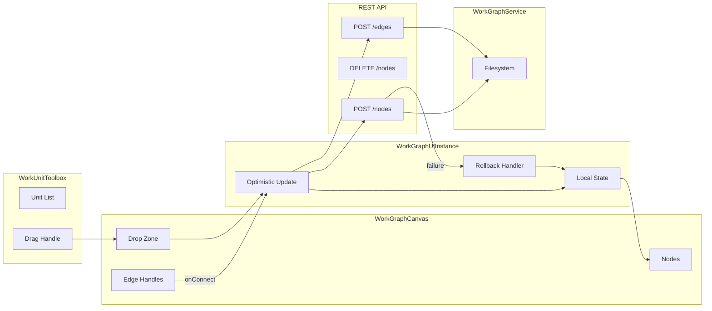
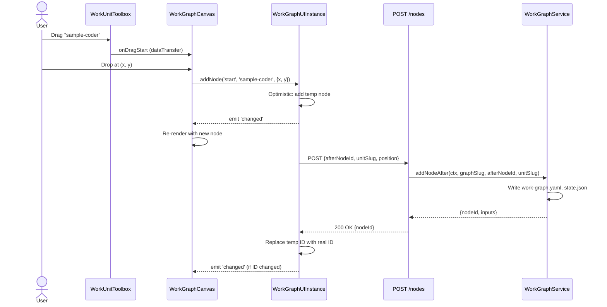

# Phase 3: Graph Editing – Tasks & Alignment Brief

**Spec**: [../../workgraph-ui-spec.md](../../workgraph-ui-spec.md)
**Plan**: [../../workgraph-ui-plan.md](../../workgraph-ui-plan.md)
**Date**: 2026-01-29

---

## Executive Briefing

### Purpose
This phase transforms the read-only graph display (Phase 2) into a fully interactive editor. Users will be able to add new WorkUnit nodes via drag-drop from a toolbox, manually connect nodes via edge handles, and delete nodes—with all changes auto-saved to the filesystem within 500ms.

### What We're Building
1. **WorkUnitToolbox**: A sidebar component that discovers available WorkUnits via API and provides draggable items
2. **Drag-Drop Integration**: onDrop handler that creates unconnected nodes at the drop position
3. **Edge Connection**: React Flow edge handles with type validation (output→input compatibility)
4. **Node Deletion**: Single-node removal with edge cleanup
5. **Auto-Save**: Debounced persistence (500ms) with optimistic updates and rollback on failure

### User Value
Users can visually construct WorkGraphs by dragging units from a toolbox and connecting them, eliminating the need to use CLI commands for graph construction. Changes persist immediately, enabling a fluid editing experience.

### Example
**Before**: User runs CLI commands: `wg node add-after demo-graph start sample-coder`
**After**: User drags "Sample Coder" from toolbox, drops on canvas, drags edge from `start` output handle to new node's input handle. Graph saved automatically.

---

## Objectives & Scope

### Objective
Enable drag-drop node addition from toolbox and manual edge connection with validation, per plan acceptance criteria AC-2, AC-3, AC-4.

### Goals

- ✅ WorkUnitToolbox fetches units dynamically via API (not hardcoded)
- ✅ Drag-drop from toolbox creates unconnected node at drop position
- ✅ Manual edge connection from output handle to input handle
- ✅ Type validation on connection attempt (reject incompatible types)
- ✅ Node deletion removes single node, cleans up edges
- ✅ Auto-save to filesystem within 500ms of edit
- ✅ Optimistic updates with rollback on API failure

### Non-Goals (Scope Boundaries)

- ❌ Auto-wiring (users manually connect edges per spec clarification Q9)
- ❌ Batch node deletion or cascade removal (Phase 7)
- ❌ SSE real-time updates (Phase 4)
- ❌ Layout persistence in layout.json (Phase 6)
- ❌ Question/answer UI (Phase 5)
- ❌ Graph creation/deletion UI (Phase 7)
- ❌ Multi-select or multi-delete (single node operations only)

---

## Architecture Map

### Component Diagram

```mermaid
flowchart TD
    classDef pending fill:#9E9E9E,stroke:#757575,color:#fff
    classDef inprogress fill:#FF9800,stroke:#F57C00,color:#fff
    classDef completed fill:#4CAF50,stroke:#388E3C,color:#fff
    classDef blocked fill:#F44336,stroke:#D32F2F,color:#fff

    style Phase fill:#F5F5F5,stroke:#E0E0E0
    style Files fill:#F5F5F5,stroke:#E0E0E0
    style API fill:#F5F5F5,stroke:#E0E0E0

    subgraph Phase["Phase 3: Graph Editing"]
        T001["T001: Tests for WorkUnitToolbox ✓"]:::completed
        T002["T002: API route for listing units ✓"]:::completed
        T003["T003: Implement WorkUnitToolbox ✓"]:::completed
        T004["T004: Tests for drop-to-add-node ✓"]:::completed
        T005["T005: Implement onDrop handler ✓"]:::completed
        T006["T006: Tests for edge connection ✓"]:::completed
        T007["T007: Implement edge connection ✓"]:::completed
        T008["T008: Tests for node deletion ✓"]:::completed
        T009["T009: Implement node deletion ✓"]:::completed
        T010["T010: Tests for auto-save debounce ✓"]:::completed
        T011["T011: Implement auto-save ✓"]:::completed
        T012["T012: API route for adding node ✓"]:::completed
        T013["T013: API route for deleting node ✓"]:::completed
        T014["T014: API route for connecting nodes ✓"]:::completed
        T014a["T014a: canConnect() implementation ✓"]:::completed
        T015["T015: Tests for optimistic rollback ✓"]:::completed
        T016["T016: Extend IWorkGraphUIInstance ✓"]:::completed
        T017["T017: Update canvas for editing ✓"]:::completed
        T018["T018: PlanPak symlinks ✓"]:::completed

        T001 --> T003
        T002 --> T003
        T004 --> T005
        T006 --> T007
        T008 --> T009
        T010 --> T011
        T012 --> T005
        T013 --> T009
        T014 --> T007
        T014a --> T014
        T015 --> T005
        T015 --> T007
        T015 --> T009
        T016 --> T005
        T016 --> T007
        T016 --> T009
        T003 --> T017
        T005 --> T017
        T007 --> T017
        T009 --> T017
        T011 --> T017
        T003 --> T018
        T012 --> T018
        T013 --> T018
        T014 --> T018
    end

    subgraph Files["Components"]
        F1["/apps/web/src/features/022-workgraph-ui/workunit-toolbox.tsx ✓"]:::completed
        F2["/apps/web/src/features/022-workgraph-ui/workgraph-canvas.tsx ✓"]:::completed
        F3["/apps/web/src/features/022-workgraph-ui/use-workgraph-flow.ts ✓"]:::completed
        F4["/apps/web/src/features/022-workgraph-ui/workgraph-ui.instance.ts ✓"]:::completed
        F5["/apps/web/src/features/022-workgraph-ui/workgraph-ui.types.ts ✓"]:::completed
        F6["/apps/web/src/features/022-workgraph-ui/fake-workgraph-ui-instance.ts ✓"]:::completed
        F7["/apps/web/src/features/022-workgraph-ui/drop-handler.ts ✓"]:::completed
    end

    subgraph API["API Routes"]
        A1["/apps/web/app/api/workspaces/[slug]/units/route.ts ✓"]:::completed
        A2["/apps/web/app/api/workspaces/[slug]/workgraphs/[graphSlug]/nodes/route.ts ✓"]:::completed
        A3["/apps/web/app/api/workspaces/[slug]/workgraphs/[graphSlug]/edges/route.ts ✓"]:::completed
    end

    T003 -.-> F1
    T005 -.-> F2
    T005 -.-> F7
    T007 -.-> F3
    T009 -.-> F4
    T011 -.-> F4
    T016 -.-> F4
    T016 -.-> F5
    T016 -.-> F6
    T002 -.-> A1
    T012 -.-> A2
    T013 -.-> A2
    T014 -.-> A3
    T017 -.-> F2
```

<!-- Status: grey=pending, orange=in-progress, green=completed, red=blocked -->
<!-- Updated by plan-6 during implementation -->



### Task-to-Component Mapping

<!-- Status: ⬜ Pending | 🟧 In Progress | ✅ Complete | 🔴 Blocked -->

| Task | Component(s) | Files | Status | Comment |
|------|-------------|-------|--------|---------|
| T001 | WorkUnitToolbox Tests | test/unit/web/features/022-workgraph-ui/workunit-toolbox.test.tsx | ✅ Complete | TDD: tests first for toolbox component |
| T002 | Units API | app/api/workspaces/[slug]/units/route.ts | ✅ Complete | Per CD-09: dynamic unit discovery |
| T003 | WorkUnitToolbox | features/022-workgraph-ui/workunit-toolbox.tsx | ✅ Complete | Fetches units, renders drag handles |
| T004 | Drop Handler Tests | test/unit/web/features/022-workgraph-ui/drop-handler.test.ts | ✅ Complete | TDD: tests for onDrop flow |
| T005 | Drop Handler | features/022-workgraph-ui/drop-handler.ts | ✅ Complete | Creates unconnected node at drop position |
| T006 | Edge Connection Tests | test/unit/web/features/022-workgraph-ui/edge-connection.test.ts | ✅ Complete | TDD: tests for onConnect with type validation |
| T007 | Edge Connection | use-workgraph-flow.ts, workgraph-canvas.tsx | ✅ Complete | Per CD-04: manual edge with validation |
| T008 | Node Deletion Tests | test/unit/web/features/022-workgraph-ui/node-deletion.test.ts | ✅ Complete | TDD: tests for single node removal |
| T009 | Node Deletion | workgraph-ui.instance.ts | ✅ Complete | Remove node, clean edges, recompute status |
| T010 | Auto-Save Tests | test/unit/web/features/022-workgraph-ui/auto-save.test.ts | ✅ Complete | TDD: 500ms debounce behavior |
| T011 | Auto-Save | workgraph-ui.instance.ts | ✅ Complete | Debounced persistence on change |
| T012 | Add Node API | app/api/.../nodes/route.ts | ✅ Complete | POST endpoint for node creation |
| T013 | Delete Node API | app/api/.../nodes/route.ts | ✅ Complete | DELETE endpoint for node removal |
| T014 | Connect Edges API | app/api/.../edges/route.ts | ✅ Complete | POST endpoint for edge creation |
| T014a | canConnect() | workgraph.service.ts | ✅ Complete | Shared validation with auto-match mode |
| T015 | Optimistic Rollback Tests | test/unit/web/features/022-workgraph-ui/optimistic-rollback.test.ts | ✅ Complete | Tests for failure recovery per CD-07 |
| T016 | Instance Mutations | workgraph-ui.instance.ts, types.ts | ✅ Complete | Implement addNode, removeNode, connectNodes |
| T017 | Canvas Editing Mode | workgraph-canvas.tsx | ✅ Complete | Enable drag, connect, delete in canvas |
| T018 | PlanPak Symlinks | docs/plans/022-workgraph-ui/files/ | ✅ Complete | Create symlinks for all new Phase 3 files |

---

## Tasks

| Status | ID | Task | CS | Type | Dependencies | Absolute Path(s) | Validation | Subtasks | Notes |
|--------|------|------|-----|------|--------------|-----------------|------------|----------|-------|
| [x] | T001 | Write tests for WorkUnitToolbox component | 2 | Test | – | /home/jak/substrate/022-workgraph-ui/test/unit/web/features/022-workgraph-ui/workunit-toolbox.test.tsx | Tests cover: unit listing, drag data format, grouping by type; tests MUST FAIL initially | – | Plan 3.1; `plan-scoped` |
| [x] | T002 | Create API route for listing WorkUnits | 2 | API | – | /home/jak/substrate/022-workgraph-ui/apps/web/app/api/workspaces/[slug]/units/route.ts | GET /api/workspaces/[slug]/units returns available units; use `workspaceService.resolveContextFromParams()` per Phase 2 pattern | – | Per CD-09; `plan-scoped` |
| [x] | T003 | Implement WorkUnitToolbox component | 3 | Core | T001, T002 | /home/jak/substrate/022-workgraph-ui/apps/web/src/features/022-workgraph-ui/workunit-toolbox.tsx | Fetches units via API, renders with drag handles, grouped by type; all T001 tests pass | – | Plan 3.3; `plan-scoped` |
| [x] | T004 | Write tests for drop-to-add-node flow | 3 | Test | – | /home/jak/substrate/022-workgraph-ui/test/unit/web/features/022-workgraph-ui/drop-handler.test.ts | Tests cover: onDrop extracts unit, calls instance.addNode, optimistic add; tests MUST FAIL initially | – | Plan 3.4; `plan-scoped` |
| [x] | T005 | Implement onDrop handler in WorkGraphCanvas | 3 | Core | T004, T012, T016 | /home/jak/substrate/022-workgraph-ui/apps/web/src/features/022-workgraph-ui/drop-handler.ts | Dropping unit creates node with `disconnected` status at drop position; all T004 tests pass | – | Plan 3.5; CD-07; DYK#1; `plan-scoped` |
| [x] | T006 | Write tests for manual edge connection | 3 | Test | – | /home/jak/substrate/022-workgraph-ui/test/unit/web/features/022-workgraph-ui/edge-connection.test.ts | Tests cover: onConnect calls API, displays E103 error on name mismatch, updates inputs mapping on success; tests MUST FAIL initially | – | Plan 3.6; DYK#5: reuse WorkGraphService validation; `plan-scoped` |
| [x] | T007 | Implement edge connection with validation | 4 | Core | T006, T014, T016 | /home/jak/substrate/022-workgraph-ui/apps/web/src/features/022-workgraph-ui/use-workgraph-flow.ts, /home/jak/substrate/022-workgraph-ui/apps/web/src/features/022-workgraph-ui/workgraph-canvas.tsx | onConnect calls API; backend does name-match validation (E103); show error toast on failure; all T006 tests pass | – | Plan 3.7; DYK#5: reuse WorkGraphService; `plan-scoped` |
| [x] | T008 | Write tests for node deletion | 2 | Test | – | /home/jak/substrate/022-workgraph-ui/test/unit/web/features/022-workgraph-ui/node-deletion.test.ts | Tests cover: single node delete, edge cleanup, downstream nodes become pending; tests MUST FAIL initially | – | Plan 3.8; `plan-scoped` |
| [x] | T009 | Implement node deletion | 3 | Core | T008, T013, T016 | /home/jak/substrate/022-workgraph-ui/apps/web/src/features/022-workgraph-ui/workgraph-ui.instance.ts | Delete removes single node, cleans up edges, downstream nodes recompute to pending; all T008 tests pass | – | Plan 3.9; `plan-scoped` |
| [x] | T010 | Write tests for auto-save debounce | 2 | Test | – | /home/jak/substrate/022-workgraph-ui/test/unit/web/features/022-workgraph-ui/auto-save.test.ts | Tests cover: 500ms debounce, save on structure change, coalesce rapid edits; tests MUST FAIL initially | – | Plan 3.10; `plan-scoped` |
| [x] | T011 | Implement auto-save mechanism | 2 | Core | T010, T016 | /home/jak/substrate/022-workgraph-ui/apps/web/src/features/022-workgraph-ui/workgraph-ui.instance.ts | Changes saved within 500ms of last edit; all T010 tests pass | – | Plan 3.11; AC-4; `plan-scoped` |
| [x] | T012 | Create API route for adding node | 2 | API | – | /home/jak/substrate/022-workgraph-ui/apps/web/app/api/workspaces/[slug]/workgraphs/[graphSlug]/nodes/route.ts | POST /api/.../nodes accepts {afterNodeId, unitSlug}, returns {nodeId, inputs} | – | Plan 3.12; `plan-scoped` |
| [x] | T013 | Create API route for deleting node | 2 | API | – | /home/jak/substrate/022-workgraph-ui/apps/web/app/api/workspaces/[slug]/workgraphs/[graphSlug]/nodes/route.ts | DELETE /api/.../nodes/[nodeId] removes node and edges | – | Plan 3.13; `plan-scoped` |
| [x] | T014 | Create API route for connecting nodes | 2 | API | T014a | /home/jak/substrate/022-workgraph-ui/apps/web/app/api/workspaces/[slug]/workgraphs/[graphSlug]/edges/route.ts | POST /api/.../edges accepts {source, sourceHandle, target, targetHandle}; calls `canConnect()` then persists | – | Plan 3.14; DYK#5; `plan-scoped` |
| [x] | T014a | Add canConnect() to IWorkGraphService | 2 | Core | – | /home/jak/substrate/022-workgraph-ui/packages/workgraph/src/interfaces/workgraph-service.interface.ts, /home/jak/substrate/022-workgraph-ui/packages/workgraph/src/services/workgraph.service.ts, /home/jak/substrate/022-workgraph-ui/packages/workgraph/src/fakes/fake-workgraph-service.ts | `canConnect(ctx, graphSlug, sourceNodeId, sourceOutput, targetNodeId, targetInput): Promise<CanConnectResult>` returns {valid, errors}; extracts validation logic from addNodeAfter | – | DYK#5: shared validation; `shared-package` |
| [x] | T015 | Write tests for optimistic update rollback | 2 | Test | – | /home/jak/substrate/022-workgraph-ui/test/unit/web/features/022-workgraph-ui/optimistic-rollback.test.ts | Tests cover: API failure shows error toast, UI remains in current state; tests MUST FAIL initially | – | Plan 3.15; KISS - simple error toast on failure; `plan-scoped` |
| [x] | T016 | Extend IWorkGraphUIInstance with mutation methods | 3 | Core | – | /home/jak/substrate/022-workgraph-ui/apps/web/src/features/022-workgraph-ui/workgraph-ui.instance.ts, /home/jak/substrate/022-workgraph-ui/apps/web/src/features/022-workgraph-ui/workgraph-ui.types.ts, /home/jak/substrate/022-workgraph-ui/apps/web/src/features/022-workgraph-ui/fake-workgraph-ui-instance.ts | Implement `addUnconnectedNode(unitSlug, position)` for UI, keep `addNodeAfter(afterNodeId, unitSlug)` for CLI/agents, plus removeNode(), connectNodes(), disconnectNode() with optimistic update pattern | – | DYK#2; `plan-scoped` |
| [x] | T017 | Update WorkGraphCanvas for editing mode | 3 | Integration | T003, T005, T007, T009, T011 | /home/jak/substrate/022-workgraph-ui/apps/web/src/features/022-workgraph-ui/workgraph-canvas.tsx | Enable nodesDraggable, nodesConnectable; integrate toolbox; wire up all handlers | – | `plan-scoped` |
| [x] | T018 | Create PlanPak symlinks for Phase 3 files | 1 | Setup | T003, T012-T014 | /home/jak/substrate/022-workgraph-ui/docs/plans/022-workgraph-ui/files/, /home/jak/substrate/022-workgraph-ui/docs/plans/022-workgraph-ui/otherfiles/ | Symlinks created for all new plan-scoped files | – | PlanPak compliance |

---

## Alignment Brief

### Prior Phases Review

#### Phase 1: Headless State Management (Complete ✅)

**Deliverables Created:**
- `workgraph-ui.types.ts` - All TypeScript interfaces including `IWorkGraphUIInstanceCore` (read-only) and `IWorkGraphUIInstance` (mutations)
- `workgraph-ui.service.ts` - Service factory with instance caching by `${worktreePath}|${graphSlug}`
- `workgraph-ui.instance.ts` - State holder with status computation (pending/ready from DAG)
- `fake-workgraph-ui-service.ts`, `fake-workgraph-ui-instance.ts` - Test fakes with assertion helpers
- `layout.schema.ts` - Zod schema for layout.json persistence

**Dependencies Exported (Used by Phase 3):**
- `IWorkGraphUIInstance` interface with `addNode()`, `removeNode()`, `updateNodeLayout()` signatures (Phase 1 defined, Phase 3 implements)
- Status computation algorithm (memoized recursive DAG traversal)
- `UINodeState` with `{id, status, position, unit, type}` structure
- Event emission pattern: `subscribe(callback)` with `{type: 'changed'|'disposed'}` events
- DI token: `WORKGRAPH_UI_SERVICE` registered in `di-container.ts`

**Lessons Learned:**
- Status computation duality: `pending`/`ready` are COMPUTED from DAG; `running`/`waiting-question`/`blocked-error`/`complete` are STORED
- Refresh silence pattern: Only emit 'changed' if `JSON.stringify` differs (prevents re-render storms)
- Disposed instance safety: Check `isDisposed` before AND after async operations

**Test Infrastructure:**
- 49 passing tests across 3 files
- `FakeWorkGraphUIInstance.withNodes()` factory for quick fixtures
- `FakeWorkGraphUIService` with call history tracking

#### Phase 2: Visual Graph Display (Complete ✅)

**Deliverables Created:**
- `use-workgraph-flow.ts` - Hook transforming `{nodes, edges}` to React Flow format
- `workgraph-node.tsx` - Custom React Flow node with `StatusIndicator`
- `status-indicator.tsx` - 6-status visual component (pending→gray, ready→blue, running→yellow+spinner, etc.)
- `workgraph-canvas.tsx` - React Flow wrapper (currently read-only: `nodesDraggable=false`)
- Routes: `/workspaces/[slug]/workgraphs/` (list) and `/workspaces/[slug]/workgraphs/[graphSlug]` (detail)
- API: `GET /api/workspaces/[slug]/workgraphs`, `GET /api/workspaces/[slug]/workgraphs/[graphSlug]`

**Dependencies Exported (Used by Phase 3):**
- `useWorkGraphFlow(data)` hook signature (accepts serialized `{nodes, edges}`)
- `WorkGraphCanvas` component ready for editing mode (just change props)
- Route pattern: `/workspaces/[slug]/workgraphs/[graphSlug]`
- API pattern: `/api/workspaces/[slug]/workgraphs/[graphSlug]`

**Lessons Learned (DYK Decisions):**
- DYK#1: URL routing uses path params not query params
- DYK#2: Hook accepts serialized JSON, not live instance (subscription deferred to Phase 4)
- DYK#3: Server→Client composition pattern (Server Component fetches, Client Component renders)
- DYK#5: `listGraphs()` was stubbed; fixed to scan filesystem

**Discoveries:**
- `IFileSystem.readDir()` not `readdir()` (camelCase)
- `stat.isDirectory` is boolean property, not method

**Test Infrastructure:**
- 40 tests across 4 files
- Total: 89 workgraph-ui tests (Phase 1 + Phase 2)

### Cumulative Architecture

```
WorkGraphUIService (Phase 1)
    ├── getInstance(ctx, graphSlug) → IWorkGraphUIInstanceCore (Phase 1/2)
    │                                  └── IWorkGraphUIInstance (Phase 3 extends)
    │                                       ├── addNode(afterNodeId, unitSlug)
    │                                       ├── removeNode(nodeId)
    │                                       └── connectNodes(...)
    ├── listGraphs(ctx) → string[]
    ├── createGraph(ctx, slug)
    └── deleteGraph(ctx, slug)

useWorkGraphFlow(data) (Phase 2)
    └── Transforms UINodeState[] → ReactFlow Node[]

WorkGraphCanvas (Phase 2, extended in Phase 3)
    ├── Phase 2: read-only display
    └── Phase 3: editing (drag, connect, delete)

WorkUnitToolbox (NEW in Phase 3)
    └── Fetches units via API, drag-drop onto canvas
```

### Critical Findings Affecting This Phase

| Finding | Impact | Addressed By |
|---------|--------|--------------|
| **CD-04**: Manual edge connection model | onConnect must validate output→input type compatibility | T006, T007 |
| **CD-07**: Optimistic updates with rollback | All mutations must update local state first, rollback on API failure | T015, T016 |
| **CD-09**: WorkUnit discovery | Toolbox fetches units dynamically via `WorkUnitService.list()` | T002, T003 |
| **CD-08**: Atomic file writes | API endpoints must use `atomicWriteFile()` | T012, T013, T014 |
| **DYK#1**: Disconnected nodes for experimentation | Dropped nodes get `disconnected` status; users can rearrange freely before wiring | T005, T016, StatusIndicator |
| **DYK#2**: Dual add-node API | `addUnconnectedNode(unitSlug, position)` for UI; `addNodeAfter(afterNodeId, unitSlug)` for CLI/agents | T016, T005 |
| **DYK#3**: KISS error handling | No complex rollback - show error toast on save failure | T015 |
| **DYK#4**: Workspace resolution exists | Use `workspaceService.resolveContextFromParams()` per Phase 2 pattern | T002, T012-T014 |
| **DYK#5**: Shared canConnect() validation | Add `canConnect()` to `IWorkGraphService` - extracts validation from `addNodeAfter()`; UI and CLI share same logic | T014a, T014, T007 |

### ADR Decision Constraints

| ADR | Constraint | Addressed By |
|-----|------------|--------------|
| **ADR-0007** | SSE single-channel routing | N/A for Phase 3 (Phase 4 concern) |
| **ADR-0008** | Graph files at `<worktree>/.chainglass/data/work-graphs/` | T012, T013, T014 use correct paths |
| **ADR-0004** | DI container `useFactory` pattern | T002 uses DI for WorkUnitService |
| **ADR-0009** | Module registration function pattern | T002, T012-T014 follow existing patterns |

### PlanPak Placement Rules

**Active per plan § 6**: All Phase 3 files follow PlanPak conventions.

| Classification | Location | Phase 3 Files |
|---------------|----------|---------------|
| `plan-scoped` | `apps/web/src/features/022-workgraph-ui/` | `workunit-toolbox.tsx`, updated `workgraph-canvas.tsx`, `workgraph-ui.instance.ts` |
| `plan-scoped` | `apps/web/app/api/workspaces/[slug]/...` | `units/route.ts`, `nodes/route.ts`, `edges/route.ts` |
| `plan-scoped` | `test/unit/web/features/022-workgraph-ui/` | All 6 new test files |

**Symlink Requirements (T018)**:
After implementation, create symlinks in plan folder:
```bash
# From docs/plans/022-workgraph-ui/files/
ln -s ../../../../../apps/web/src/features/022-workgraph-ui/workunit-toolbox.tsx workunit-toolbox.tsx
ln -s ../../../../../apps/web/app/api/workspaces/\[slug\]/units/route.ts api-units-route.ts
ln -s ../../../../../apps/web/app/api/workspaces/\[slug\]/workgraphs/\[graphSlug\]/nodes/route.ts api-nodes-route.ts
ln -s ../../../../../apps/web/app/api/workspaces/\[slug\]/workgraphs/\[graphSlug\]/edges/route.ts api-edges-route.ts
# Test files also get symlinked
```

**Dependency Direction**: `features/022-workgraph-ui/` → `packages/workgraph/` (allowed); reverse is forbidden.

### Invariants & Guardrails

- **Performance**: UI update latency <100ms for local operations
- **Data Safety**: Optimistic updates MUST rollback on failure
- **Type Safety**: Edge connections validated before persistence
- **Single Node**: Phase 3 only supports single-node deletion (no cascade)

### Visual Alignment Aids

#### System State Flow



#### Sequence: Add Node via Drag-Drop



### Test Plan

**Framework**: Vitest with React Testing Library
**Mock Policy**: Fakes over mocks per Constitution Principle 4

| Test File | Type | Tests | Fixtures/Fakes |
|-----------|------|-------|----------------|
| `workunit-toolbox.test.tsx` | Component | ~8 tests | MSW handler for `/api/.../units`, drag event helpers |
| `drop-handler.test.ts` | Integration | ~6 tests | `FakeWorkGraphUIInstance` with `addNode` tracking |
| `edge-connection.test.ts` | Integration | ~8 tests | Type validation fixtures, `FakeModalService` for errors |
| `node-deletion.test.ts` | Unit | ~5 tests | `FakeWorkGraphUIInstance` with `removeNode` tracking |
| `auto-save.test.ts` | Unit | ~5 tests | Timer mocks, `FakeWorkGraphUIInstance` |
| `optimistic-rollback.test.ts` | Integration | ~6 tests | API failure simulation, state restoration |

**Fake Implementations Required:**
- `FakeDialogHandler` - for delete confirmation dialog
- `FakeModalService` - for error message assertions (exists from Phase 1)
- Extended `FakeWorkGraphUIInstance` - add mutation method tracking

### Step-by-Step Implementation Outline

1. **T016**: Extend instance interface with mutation methods (foundation for all other tasks)
2. **T001 → T003**: WorkUnitToolbox (tests first, API, component)
3. **T012**: Add node API route (needed by T005)
4. **T004 → T005**: Drop handler (tests first, implementation)
5. **T014**: Connect edges API route (needed by T007)
6. **T006 → T007**: Edge connection (tests first, implementation)
7. **T013**: Delete node API route (needed by T009)
8. **T008 → T009**: Node deletion (tests first, implementation)
9. **T010 → T011**: Auto-save debounce (tests first, implementation)
10. **T015**: Optimistic rollback tests
11. **T017**: Final canvas integration (enable editing mode)

### Commands to Run

```bash
# Run all Phase 3 tests (once implemented)
pnpm test -- --testPathPattern="022-workgraph-ui" --testPathPattern="(toolbox|drop|edge|deletion|save|rollback)"

# Run specific test file
pnpm vitest run test/unit/web/features/022-workgraph-ui/workunit-toolbox.test.tsx

# Type check
just typecheck

# Lint
just lint

# Full quality check
just fft

# Dev server for manual testing
pnpm --filter=@chainglass/web dev --port 3002

# Test with demo graph (already created)
# Navigate to: http://localhost:3002/workspaces/chainglass-main/workgraphs/demo-graph
```

### 🚨 MANDATORY: MCP Server Verification

**Before considering Phase 3 complete, you MUST verify all editing features using the Next.js MCP server on port 3002.**

Use the existing demo workgraph created in Phase 2:
- **Workspace**: `chainglass-main` at `/home/jak/substrate/chainglass`
- **Graph**: `demo-graph` with structure: `start → sample-input-5ad → sample-coder-3af → sample-tester-f02`
- **URL**: `http://localhost:3002/workspaces/chainglass-main/workgraphs/demo-graph`

**Verification Checklist (use `nextjs_index` and `nextjs_call` tools):**

1. **Check for errors**: Use MCP `get_errors` tool to ensure no build/runtime errors
2. **Load graph page**: Use browser automation to navigate to demo-graph detail page
3. **Verify toolbox renders**: Confirm WorkUnitToolbox displays available units
4. **Test drag-drop**: 
   - Drag a unit from toolbox onto canvas
   - Verify node appears at drop position
   - Check API was called (inspect network or server logs)
5. **Test edge connection**:
   - Connect new node to existing graph
   - Verify edge renders correctly
   - Confirm type validation works (try invalid connection)
6. **Test node deletion**:
   - Delete the node just added
   - Verify edges are cleaned up
   - Confirm downstream nodes update status
7. **Verify auto-save**:
   - Make edit, wait 500ms
   - Reload page and confirm changes persisted
8. **Check console**: Use browser `console_messages` action for any errors

**Do NOT mark Phase 3 complete until all 8 verification steps pass.**

### Risks/Unknowns

| Risk | Severity | Mitigation |
|------|----------|------------|
| React Flow drag-drop API complexity | Medium | Reference official examples, test with real browser events |
| Type validation accuracy | Medium | Start simple (exact match), extend later |
| Optimistic rollback state corruption | High | Comprehensive tests per T015; snapshot state before mutation |
| Edge handle positioning | Low | Use React Flow defaults initially |

### Ready Check

- [ ] ADR constraints mapped to tasks (IDs noted in Notes column)
- [ ] Critical findings (CD-04, CD-07, CD-09) addressed in task plan
- [ ] Phase 1/2 dependencies identified and available
- [ ] Test plan covers all acceptance criteria
- [ ] API routes follow existing patterns

---

## Phase Footnote Stubs

_Reserved for plan-6 to populate during implementation._

| ID | Phase | Task | Note | Added |
|----|-------|------|------|-------|

---

## Evidence Artifacts

**Execution Log**: `./execution.log.md` (created by plan-6)

**Supporting Files** (created during implementation):
- Test files in `test/unit/web/features/022-workgraph-ui/`
- Component files in `apps/web/src/features/022-workgraph-ui/`
- API routes in `apps/web/app/api/workspaces/[slug]/...`

---

## Discoveries & Learnings

_Populated during implementation by plan-6. Log anything of interest to your future self._

| Date | Task | Type | Discovery | Resolution | References |
|------|------|------|-----------|------------|------------|
| | | | | | |

**Types**: `gotcha` | `research-needed` | `unexpected-behavior` | `workaround` | `decision` | `debt` | `insight`

**What to log**:
- Things that didn't work as expected
- External research that was required
- Implementation troubles and how they were resolved
- Gotchas and edge cases discovered
- Decisions made during implementation
- Technical debt introduced (and why)
- Insights that future phases should know about

_See also: `execution.log.md` for detailed narrative._

---

## Critical Insights Discussion

**Session**: 2026-01-29 08:35 UTC
**Context**: Phase 3: Graph Editing Tasks & Alignment Brief
**Analyst**: AI Clarity Agent
**Reviewer**: Development Team
**Format**: Water Cooler Conversation (5 Critical Insights)

### Insight 1: Disconnected Nodes for Experimentation

**Did you know**: Dropped nodes create "disconnected" state - users can rearrange freely before wiring.

**Implications**:
- Nodes dropped from toolbox aren't immediately part of the DAG
- Users can experiment with layout before committing to topology
- Status computation needs to handle disconnected nodes distinctly

**Options Considered**:
- Option A: Require Target Node on Drop - forces immediate connection
- Option B: Two-Step UX with Placeholder Status - disconnected visual state
- Option C: Immediate Connection Dialog - popup asks where to connect
- Option D: Accept Disconnected Nodes - as-is with `ready` status

**AI Recommendation**: Option B - Two-Step UX with Placeholder Status
- Reasoning: Keeps drag-drop simple, provides clear visual feedback

**Discussion Summary**:
User clarified the vibe is experimentation - users should be able to disconnect, move around, and reorganize freely. The graph editor should feel like a creative workspace.

**Decision**: Accept disconnected nodes with visual `disconnected` status indicator

**Action Items**:
- [x] T005 updated to specify `disconnected` status for dropped nodes
- [x] DYK#1 added to Critical Findings table

**Affects**: T005, T016, StatusIndicator component

---

### Insight 2: Dual Add-Node API Contract

**Did you know**: The `addNode(afterNodeId, unitSlug)` signature assumes immediate connection, but UI needs position-only creation.

**Implications**:
- CLI/agents use `addNodeAfter` pattern with implicit edge
- UI needs `addUnconnectedNode(unitSlug, position)` for drop-then-wire flow
- Two different mental models need to coexist

**Options Considered**:
- Option A: Change Interface to Position-Based - breaks CLI pattern
- Option B: Optional afterNodeId - nullable parameter smell
- Option C: Two Methods - explicit separation of concerns

**AI Recommendation**: Option C - Two Methods
- Reasoning: CLI and UI have different workflows; explicit methods are cleaner

**Discussion Summary**:
User confirmed: keep existing CLI method so agents can use it easily, add new UI method for drop-then-wire workflow.

**Decision**: Two methods - `addNodeAfter()` for CLI/agents, `addUnconnectedNode()` for UI

**Action Items**:
- [x] T016 updated with both method signatures
- [x] Added `disconnectNode()` for rewiring support
- [x] DYK#2 added to Critical Findings table

**Affects**: T016, T005

---

### Insight 3: KISS Error Handling

**Did you know**: The 500ms debounce vs optimistic rollback creates complex state timing issues.

**Implications**:
- Multiple edits within debounce window batch together
- API failure rollback scope becomes ambiguous
- Complex retry/recovery logic is overkill for filesystem saves

**Options Considered**:
- Option A: Per-Operation Optimistic - no batching
- Option B: Snapshot-Based Rollback - all-or-nothing
- Option C: Queue with Individual Retries - complex recovery
- Option D: Separate Layout vs Structure - different timing

**AI Recommendation**: Option D - Separate Layout vs Structure
- Reasoning: Structure changes are high-stakes, layout is low-stakes

**Discussion Summary**:
User pushed back on over-engineering: saves won't fail (local filesystem), just show error toast if something weird happens. KISS principle.

**Decision**: Keep it simple - debounce saves, show error toast on failure

**Action Items**:
- [x] T015 simplified to just error toast behavior

**Affects**: T010, T011, T015

---

### Insight 4: Workspace Resolution Helper Exists

**Did you know**: T002 needs `WorkspaceContext` but only has `slug` - resolution pattern already exists in Phase 2.

**Implications**:
- `workspaceService.resolveContextFromParams(slug, worktreePath)` already solves this
- All Phase 2 API routes use this pattern
- T002 just needs to follow existing pattern

**Options Considered**:
- Implementation detail - no decision needed, just awareness

**AI Recommendation**: Follow Phase 2 pattern
- Reasoning: Pattern already exists and works

**Discussion Summary**:
User asked to verify - flowspace search confirmed helper exists at `packages/workflow/src/services/workspace.service.ts`.

**Decision**: T002 notes updated to reference `resolveContextFromParams()` pattern

**Action Items**:
- [x] T002 validation updated with explicit pattern reference
- [x] DYK#4 added to Critical Findings table

**Affects**: T002, T012-T014

---

### Insight 5: Reuse Backend Validation

**Did you know**: T007 says "validate types" but `WorkGraphService.addNodeAfter()` already does strict name-matching (E103).

**Implications**:
- Backend validates input/output name matching
- Returns E103 error for missing required inputs
- UI just needs to call API and display errors - no client-side validation needed

**Options Considered**:
- Implementation detail - reuse existing logic

**AI Recommendation**: Reuse backend validation
- Reasoning: Logic already exists, tested, and proven

**Discussion Summary**:
User pointed out CLI already has this - flowspace search found `WorkGraphService.addNodeAfter()` at lines 580-592 with strict name matching.

**Decision**: Add `canConnect()` to `IWorkGraphService` for shared validation logic

**Action Items**:
- [x] T014a added: implement `canConnect()` in packages/workgraph
- [x] T014 updated to depend on T014a
- [x] DYK#5 updated with shared validation approach

**Affects**: T014a (new), T014, T007, packages/workgraph

---

## Session Summary

**Insights Surfaced**: 5 critical insights identified and discussed
**Decisions Made**: 5 decisions reached through collaborative discussion
**Action Items Created**: 5 task updates applied
**Areas Requiring Updates**:
- T002, T005, T006, T007, T015, T016 validation criteria updated
- Critical Findings table extended with DYK#1-5

**Shared Understanding Achieved**: ✓

**Confidence Level**: High - Key simplifications identified, reuse patterns confirmed

**Next Steps**:
Proceed to implementation with `/plan-6-implement-phase`

**Notes**:
Strong KISS theme throughout - user pushed back on over-engineering in insights #3 and #5. Backend already handles validation; UI should be thin wrapper showing results.

---

## Directory Layout

```
docs/plans/022-workgraph-ui/
  ├── workgraph-ui-plan.md
  ├── workgraph-ui-spec.md
  ├── research-dossier.md
  └── tasks/
      ├── phase-1-headless-state-management/
      │   ├── tasks.md
      │   └── execution.log.md
      ├── phase-2-visual-graph-display/
      │   ├── tasks.md
      │   └── execution.log.md
      └── phase-3-graph-editing/
          ├── tasks.md           ← YOU ARE HERE
          └── execution.log.md   # created by plan-6
```
