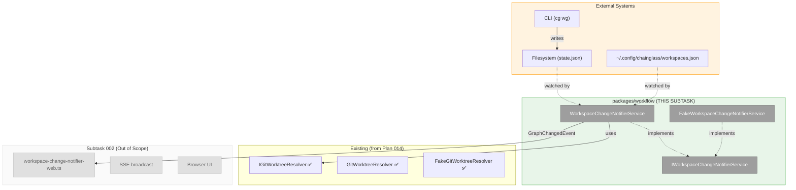
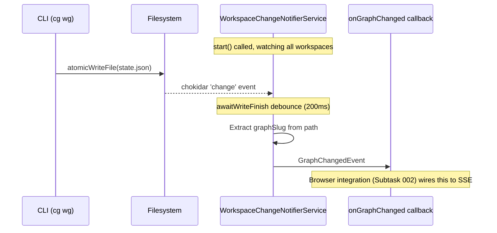

# Subtask 001: WorkspaceChangeNotifierService (Headless File Watcher)

**Parent Plan:** [View Plan](../../workgraph-ui-plan.md)
**Parent Phase:** Phase 4: Real-time Updates
**Parent Task(s):** [T006: Implement file polling](tasks.md#task-t006)
**Plan Task Reference:** [Task 4.6 in Plan](../../workgraph-ui-plan.md#phase-4-real-time-updates)
**Next Subtask:** [002-browser-sse-integration](./002-subtask-browser-sse-integration.md)

**Why This Subtask:**
During Phase 4 verification, discovered that CLI modifications to workgraph files do not trigger UI updates. This subtask implements the core `WorkspaceChangeNotifierService` that watches all workspaces and emits events when `state.json` files change. The browser integration is handled in Subtask 002.

**Created:** 2026-01-29
**Updated:** 2026-01-30 (split from original subtask - this is now headless only)
**Requested By:** Development Team (gap discovered during manual testing)

---

## Executive Briefing

### Purpose
This subtask implements the `WorkspaceChangeNotifierService` - a DI-integrated service in `packages/workflow` that watches all registered workspaces and their worktrees for `state.json` changes, emitting `GraphChangedEvent` when changes are detected.

### What We're Building
A workspace-aware file watching service that:
- Lives in `packages/workflow` (shared, not web-specific)
- Watches the workspace registry (`~/.config/chainglass/workspaces.json`) for workspace add/remove
- Discovers all worktrees for each workspace via `git worktree list`
- Watches all `<worktree>/.chainglass/data/work-graphs/` folders
- Emits `GraphChangedEvent` with `{graphSlug, workspaceSlug, worktreePath}` when `state.json` changes
- Debounces rapid changes via chokidar's built-in `awaitWriteFinish`
- Properly cleans up on `stop()`

### Unblocks
- **Subtask 002**: Browser SSE integration (depends on this service)
- **T006**: File polling (this provides the core mechanism)

### Scope Boundary
This subtask is **headless only** - no browser, no SSE, no web code. We verify the service works by:
1. Unit tests with fakes
2. Integration test that writes real files and confirms callbacks fire

Browser integration (wiring to SSE, visual verification) is in **Subtask 002**.

### Example

**Test scenario** (headless):
```typescript
// Start the service
await notifier.start();

// Register callback
const events: GraphChangedEvent[] = [];
notifier.onGraphChanged(e => events.push(e));

// Simulate CLI write
fs.writeFileSync('/workspace/.chainglass/data/work-graphs/demo-graph/state.json', '{}');

// Wait for debounce
await sleep(300);

// Verify
expect(events).toHaveLength(1);
expect(events[0].graphSlug).toBe('demo-graph');
```

---

## Objectives & Scope

### Objective
Implement `WorkspaceChangeNotifierService` in `packages/workflow` that watches all registered workspaces and emits `GraphChangedEvent` when `state.json` files change. This is the **headless core** - no browser integration.

### Goals

- [x] Research file watching libraries (chokidar vs fs.watch vs @parcel/watcher)
- [x] Design service architecture with DI integration
- [ ] Create `IWorkspaceChangeNotifierService` interface
- [x] ~~Create `IWorktreeResolver` interface~~ → Use existing `IGitWorktreeResolver` (already implemented)
- [ ] Implement `WorkspaceChangeNotifierService` with chokidar
- [ ] Unit tests with fakes (TDD)
- [ ] Integration test with real filesystem
- [ ] Verify service emits events correctly (headless verification)

### Non-Goals (This Subtask)

- ❌ Browser/SSE integration (Subtask 002)
- ❌ Visual verification in browser (Subtask 002)
- ❌ Toast notifications (Subtask 002)
- ❌ `useWorkGraphSSE` hook changes (Subtask 002)
- ❌ Watching `work-graph.yaml` structure changes (Phase 7)
- ❌ Watching `layout.json` (Phase 6)

---

## Research Opportunities

### ✅ RES-001: File Watching Library Selection (RESOLVED)

**Question**: Which file watching library is best for Next.js server-side usage?

**Research Completed**: 2026-01-29 via Perplexity deep research

**Candidates Evaluated**:
| Library | Pros | Cons | Verdict |
|---------|------|------|---------|
| `chokidar` (v5.0) | • 30M+ repos use it<br>• Cross-platform normalization<br>• Built-in `atomic` + `awaitWriteFinish`<br>• ~80KB bundle, 1 dependency<br>• Active maintenance (v5.0 Nov 2025)<br>• Graceful fallback when inotify limit hit | • ESM-only in v5 (fine for Next.js 16) | ✅ **SELECTED** |
| `fs.watch` (native) | • Zero deps<br>• Improved in Node 19.1+ | • No debounce built-in<br>• Platform quirks (Windows spurious events, macOS FSEvents latency)<br>• No atomic write handling<br>• Must implement own deduplication | ⚠️ Viable but more work |
| `@parcel/watcher` | • Native C++ performance<br>• Used by Turbopack<br>• Query API for snapshots | • 2-5MB native binaries per platform<br>• Build complexity<br>• Overkill for single file watching | ❌ Overkill for our use case |

**Decision**: **chokidar v5.0**

**Rationale**:
1. **Atomic write handling**: CLI uses `atomicWriteFile()` (temp→rename pattern) which chokidar handles natively via `atomic: true`
2. **Built-in debouncing**: `awaitWriteFinish` prevents multiple events per write without custom code
3. **Cross-platform**: Works on Linux (CI), macOS (dev), Windows with consistent behavior
4. **Battle-tested**: Used by Vite, webpack, and 30M+ repositories
5. **Lightweight**: ~80KB bundle, single dependency (`brute-force-js`)
6. **Active maintenance**: v5.0 released Nov 2025, clear upgrade path
7. **Next.js compatible**: Works in API routes with module-scoped initialization pattern

**Recommended Configuration**:
```typescript
import chokidar from 'chokidar';

const watcher = chokidar.watch('state.json', {
  atomic: true,  // Handle temp→rename pattern from atomicWriteFile()
  awaitWriteFinish: {
    stabilityThreshold: 200,  // Wait 200ms for file to stabilize
    pollInterval: 100         // Check every 100ms
  },
  ignoreInitial: true,  // Don't emit for existing files
  persistent: true,     // Keep process running
  cwd: process.cwd()    // Use relative paths
});

watcher.on('change', (path) => {
  // Trigger SSE broadcast
  sseManager.broadcast('workgraphs', 'graph-updated', { graphSlug });
});

// Cleanup on dispose
watcher.close();
```

**Key Research Findings**:
- **inotify limits**: chokidar gracefully degrades to polling if Linux inotify limit exceeded (rare for single file)
- **macOS FSEvents**: Has 100-500ms batching latency; chokidar normalizes this behavior
- **Windows**: chokidar disables FILE_NOTIFY_CHANGE_LAST_ACCESS to avoid spurious events
- **Vercel deployment**: File watching only works locally; production deployments are immutable (not a concern for this feature which is dev-only)

### ✅ RES-002: Server-Side vs Client-Side Watching (RESOLVED)

**Question**: Where should file watching live—server-side API route or client-side hook?

**Decision**: **WorkspaceChangeNotifierService in `packages/workflow` (DI-integrated, always-on)**

**Options Evaluated**:
| Approach | Description | Pros | Cons | Verdict |
|----------|-------------|------|------|---------|
| A: Per-graph lazy watchers | Start watcher on first subscriber, stop when none | Resource efficient | Complex lifecycle, needs subscriber tracking | ❌ Over-engineered |
| B: Module-scoped singleton | globalThis pattern like sseManager | Simple init | Not proper DI, hard to test | ❌ Anti-pattern |
| C: **WorkspaceChangeNotifierService** | DI service watching all workspaces always | Proper architecture, testable, handles dynamic workspaces | Always-on (acceptable for dev server) | ✅ **SELECTED** |

**Key Discussion Insight** (DYK Session 2026-01-30):
The original plan assumed per-graph lifecycle management. Through discussion, we realized:
1. The system already has a workspace registry (`~/.config/chainglass/workspaces.json`)
2. Each workspace has multiple worktrees (git worktree list)
3. Workspaces can be added/removed dynamically
4. A proper DI service is needed—not a loose module

**Rationale**:
1. **Proper DI integration**: Follows existing service patterns in `packages/workflow`
2. **Workspace-aware**: Uses existing `IWorkspaceRegistryAdapter` to discover workspaces
3. **Dynamic**: Watches registry file—automatically handles workspace add/remove
4. **Always-on simplicity**: No subscriber lifecycle tracking; events filtered client-side
5. **Testable**: Interface-based, can use fakes in tests

---

### ✅ RES-002a: WorkspaceChangeNotifierService Architecture (NEW)

**Service Location**: `packages/workflow/src/services/workspace-change-notifier.service.ts`

**Interface**:
```typescript
// packages/workflow/src/interfaces/workspace-change-notifier.interface.ts

export interface GraphChangedEvent {
  /** Slug of the workgraph that changed */
  graphSlug: string;
  /** Slug of the workspace containing this graph */
  workspaceSlug: string;
  /** Absolute path to the worktree where the change occurred */
  worktreePath: string;
  /** Absolute path to the changed file */
  filePath: string;
  /** Timestamp of the change detection */
  timestamp: Date;
}

export interface IWorkspaceChangeNotifierService {
  /**
   * Start watching all registered workspaces.
   * - Reads workspace registry to get all workspaces
   * - Resolves worktrees for each workspace (git worktree list)
   * - Watches <worktree>/.chainglass/data/work-graphs/ for each
   * - Also watches registry file for workspace add/remove
   */
  start(): Promise<void>;

  /**
   * Stop all file watchers and cleanup resources.
   */
  stop(): Promise<void>;

  /**
   * Register a callback for graph change events.
   * Multiple callbacks can be registered.
   * Returns unsubscribe function.
   */
  onGraphChanged(callback: (event: GraphChangedEvent) => void): () => void;

  /**
   * Check if the service is currently watching.
   */
  isWatching(): boolean;

  /**
   * Force rescan of workspaces (e.g., after manual registry edit).
   * Normally called automatically when registry file changes.
   */
  rescan(): Promise<void>;
}
```

**Dependencies (Injected)**:
```typescript
// Constructor dependencies - ALL external deps wrapped in interfaces (no mocking!)
constructor(
  private readonly workspaceRegistry: IWorkspaceRegistryAdapter,
  private readonly worktreeResolver: IGitWorktreeResolver,  // Already exists!
  private readonly filesystem: IFilesystem,
  private readonly fileWatcherFactory: IFileWatcherFactory,  // NEW: wraps chokidar
  private readonly registryPath: string = '~/.config/chainglass/workspaces.json',
) {}
```

**IFileWatcher Interface** (NEW - wraps chokidar):
```typescript
// packages/workflow/src/interfaces/file-watcher.interface.ts

export type FileWatcherEvent = 'add' | 'change' | 'unlink' | 'addDir' | 'unlinkDir';

export interface IFileWatcher {
  /** Add paths to watch */
  add(paths: string | string[]): void;
  /** Remove paths from watch */
  unwatch(paths: string | string[]): void;
  /** Close all watchers and cleanup */
  close(): Promise<void>;
  /** Register event handler */
  on(event: FileWatcherEvent | 'error', callback: (path: string, stats?: unknown) => void): this;
}

export interface IFileWatcherFactory {
  /** Create a new watcher with given options */
  create(options?: FileWatcherOptions): IFileWatcher;
}

export interface FileWatcherOptions {
  atomic?: boolean;
  awaitWriteFinish?: { stabilityThreshold: number; pollInterval: number };
  ignoreInitial?: boolean;
  persistent?: boolean;
}
```

**FakeFileWatcher** (for unit tests - no mocking!):
```typescript
// packages/workflow/src/fakes/fake-file-watcher.ts

export class FakeFileWatcher implements IFileWatcher {
  private handlers = new Map<string, Set<(path: string) => void>>();
  private watchedPaths = new Set<string>();

  add(paths: string | string[]): void {
    const pathArray = Array.isArray(paths) ? paths : [paths];
    pathArray.forEach(p => this.watchedPaths.add(p));
  }

  unwatch(paths: string | string[]): void {
    const pathArray = Array.isArray(paths) ? paths : [paths];
    pathArray.forEach(p => this.watchedPaths.delete(p));
  }

  async close(): Promise<void> {
    this.handlers.clear();
    this.watchedPaths.clear();
  }

  on(event: string, callback: (path: string) => void): this {
    if (!this.handlers.has(event)) {
      this.handlers.set(event, new Set());
    }
    this.handlers.get(event)!.add(callback);
    return this;
  }

  // ═══════════════════════════════════════════════════════════════
  // TEST HOOKS - programmatic event emission for unit tests
  // ═══════════════════════════════════════════════════════════════

  /** Simulate a 'change' event (file modified) */
  simulateChange(path: string): void {
    this.emit('change', path);
  }

  /** Simulate an 'add' event (file created) */
  simulateAdd(path: string): void {
    this.emit('add', path);
  }

  /** Simulate an 'unlink' event (file deleted) */
  simulateUnlink(path: string): void {
    this.emit('unlink', path);
  }

  /** Simulate an 'error' event */
  simulateError(error: Error): void {
    this.handlers.get('error')?.forEach(cb => cb(error.message));
  }

  /** Get currently watched paths (for test assertions) */
  getWatchedPaths(): string[] {
    return [...this.watchedPaths];
  }

  private emit(event: string, path: string): void {
    this.handlers.get(event)?.forEach(cb => cb(path));
  }
}

export class FakeFileWatcherFactory implements IFileWatcherFactory {
  /** All watchers created by this factory (for test access) */
  public readonly watchers: FakeFileWatcher[] = [];

  create(options?: FileWatcherOptions): IFileWatcher {
    const watcher = new FakeFileWatcher();
    this.watchers.push(watcher);
    return watcher;
  }

  /** Get the most recently created watcher */
  getLastWatcher(): FakeFileWatcher | undefined {
    return this.watchers[this.watchers.length - 1];
  }
}
```

**Architecture Diagram**:
```
┌─────────────────────────────────────────────────────────────────────────────┐
│                     WorkspaceChangeNotifierService                          │
│                     (packages/workflow)                                     │
├─────────────────────────────────────────────────────────────────────────────┤
│                                                                             │
│  ┌─────────────────┐      ┌──────────────────────────────────────────────┐ │
│  │ Registry Watcher│      │ Work-Graph Watchers (one per worktree)       │ │
│  │                 │      │                                              │ │
│  │ ~/.config/      │      │ /home/jak/substrate/chainglass/              │ │
│  │ chainglass/     │      │   .chainglass/data/work-graphs/**/*.json     │ │
│  │ workspaces.json │      │                                              │ │
│  │                 │      │ /home/jak/substrate/014-workspaces/          │ │
│  │    onChange ────┼──────┼─► rescan() → update watchers                 │ │
│  │                 │      │   .chainglass/data/work-graphs/**/*.json     │ │
│  └─────────────────┘      │                                              │ │
│                           │ /home/jak/substrate/022-workgraph-ui/        │ │
│                           │   .chainglass/data/work-graphs/**/*.json     │ │
│                           └──────────────────────────────────────────────┘ │
│                                         │                                   │
│                                         │ onChange (state.json)             │
│                                         ▼                                   │
│  ┌─────────────────────────────────────────────────────────────────────┐   │
│  │ Event Processing                                                     │   │
│  │                                                                      │   │
│  │ 1. Filter: only state.json files                                    │   │
│  │ 2. Extract: graphSlug from path                                     │   │
│  │ 3. Resolve: workspaceSlug from worktree                             │   │
│  │ 4. Emit: GraphChangedEvent to all registered callbacks              │   │
│  └─────────────────────────────────────────────────────────────────────┘   │
│                                         │                                   │
│                                         ▼                                   │
│  ┌─────────────────────────────────────────────────────────────────────┐   │
│  │ Registered Callbacks                                                 │   │
│  │  • Web: broadcastGraphUpdated(event.graphSlug)                      │   │
│  │  • Future: logging, metrics, etc.                                   │   │
│  └─────────────────────────────────────────────────────────────────────┘   │
└─────────────────────────────────────────────────────────────────────────────┘
```

**Event Flow**:
```
1. STARTUP
   └─► start()
       ├─► workspaceRegistry.list() → [ws1, ws2, ...]
       ├─► For each workspace:
       │   └─► worktreeResolver.resolve(ws.path) → [wt1, wt2, ...]
       ├─► chokidar.watch(registryPath)
       └─► chokidar.watch([...all worktree work-graphs paths])

2. FILE CHANGE (CLI writes state.json)
   └─► chokidar 'change' event
       ├─► Filter: path.endsWith('/state.json')? 
       ├─► Extract: /work-graphs/([^/]+)/state.json → graphSlug
       ├─► Lookup: worktreePath → workspaceSlug
       └─► Emit: GraphChangedEvent to all callbacks

3. REGISTRY CHANGE (workspace added/removed)
   └─► chokidar 'change' on workspaces.json
       └─► rescan()
           ├─► Re-read registry
           ├─► Diff current vs new watch paths
           ├─► watcher.add(newPaths)
           └─► watcher.unwatch(removedPaths)

4. SHUTDOWN
   └─► stop()
       ├─► watcher.close() for all watchers
       └─► Clear callbacks
```

**Watched Paths Pattern**:
```typescript
// For each worktree, watch this glob pattern:
`${worktreePath}/.chainglass/data/work-graphs`

// chokidar config:
{
  atomic: true,
  awaitWriteFinish: { stabilityThreshold: 200, pollInterval: 100 },
  ignoreInitial: true,
  persistent: true,
  // Watch for changes recursively but filter to state.json in handler
}
```

**Web Integration** (in `apps/web`):
```typescript
// apps/web/src/lib/workspace-change-notifier-web.ts

import { workspaceChangeNotifierService } from '@chainglass/workflow';
import { broadcastGraphUpdated } from '@/features/022-workgraph-ui/sse-broadcast';

// Initialize on first SSE connection (module-level, globalThis pattern for HMR)
const globalForNotifier = globalThis as typeof globalThis & { 
  notifierInitialized?: boolean 
};

export async function ensureWorkspaceChangeNotifier(): Promise<void> {
  if (globalForNotifier.notifierInitialized) return;
  
  // Wire service events to SSE broadcasts
  workspaceChangeNotifierService.onGraphChanged((event) => {
    broadcastGraphUpdated(event.graphSlug);
  });
  
  await workspaceChangeNotifierService.start();
  globalForNotifier.notifierInitialized = true;
}

// Call from SSE route handler on first connection
// apps/web/src/app/api/events/workgraphs/route.ts
```

**Testing Strategy**:
```typescript
// test/unit/workflow/services/workspace-change-notifier.service.test.ts

describe('WorkspaceChangeNotifierService', () => {
  // Use fakes for all dependencies
  let fakeRegistry: FakeWorkspaceRegistryAdapter;
  let fakeWorktreeResolver: FakeWorktreeResolver;
  let fakeFilesystem: FakeFilesystem;
  let service: WorkspaceChangeNotifierService;

  describe('start()', () => {
    it('reads workspace registry on start');
    it('resolves worktrees for each workspace');
    it('creates watchers for all worktree paths');
    it('watches the registry file');
  });

  describe('onGraphChanged()', () => {
    it('emits event when state.json changes');
    it('extracts correct graphSlug from path');
    it('resolves workspaceSlug from worktree');
    it('ignores non-state.json file changes');
    it('debounces rapid changes');
  });

  describe('rescan()', () => {
    it('adds watchers for new workspaces');
    it('removes watchers for deleted workspaces');
    it('is called automatically on registry change');
  });

  describe('stop()', () => {
    it('closes all watchers');
    it('clears all callbacks');
    it('can be restarted after stop');
  });
});
```

**Files to Create**:
| File | Purpose |
|------|---------|
| `packages/workflow/src/interfaces/workspace-change-notifier.interface.ts` | Interface + event types |
| `packages/workflow/src/interfaces/file-watcher.interface.ts` | **NEW**: Adapter interface wrapping chokidar |
| `packages/workflow/src/adapters/chokidar-file-watcher.adapter.ts` | **NEW**: Real chokidar implementation |
| `packages/workflow/src/fakes/fake-file-watcher.ts` | **NEW**: Fake for unit tests (no mocking!) |
| `packages/workflow/src/services/workspace-change-notifier.service.ts` | Implementation (injects IFileWatcher) |
| `packages/workflow/src/fakes/fake-workspace-change-notifier.service.ts` | Test fake |
| ~~`packages/workflow/src/interfaces/worktree-resolver.interface.ts`~~ | ❌ Not needed - use existing `IGitWorktreeResolver` |
| ~~`packages/workflow/src/resolvers/git-worktree.resolver.ts`~~ | ❌ Not needed - already exists |
| `test/unit/workflow/services/workspace-change-notifier.service.test.ts` | Unit tests |
| `apps/web/src/lib/workspace-change-notifier-web.ts` | Web integration layer |

**DI Rule**: No mocking allowed. All external dependencies (chokidar) wrapped in adapters with fakes.

### ✅ RES-003: Debounce Strategy (RESOLVED)

**Question**: How to debounce rapid file changes without missing real updates?

**Scenarios to handle**:
- CLI atomic write: temp file → rename (may emit 2 events)
- Editor save: truncate → write (may emit 2+ events)
- Rapid CLI commands: user runs multiple commands quickly

**Decision**: **Use chokidar's built-in debouncing with `atomic: true` + `awaitWriteFinish`**

**Configuration**:
```typescript
{
  atomic: true,  // Coalesces delete+create into single 'change' event (100ms window)
  awaitWriteFinish: {
    stabilityThreshold: 200,  // File must be stable for 200ms before emitting
    pollInterval: 100         // Check file size every 100ms
  }
}
```

**Rationale**:
1. **atomic: true** handles the temp→rename pattern from `atomicWriteFile()` by detecting delete+create within 100ms and emitting single 'change'
2. **awaitWriteFinish** handles chunked writes by waiting for file size to stabilize
3. **No custom debounce code needed**: chokidar handles it all internally
4. **200ms threshold** balances:
   - Fast enough for <2s latency requirement (leaves 1.8s for fetch+render)
   - Slow enough to catch atomic write sequences (typically complete in <50ms)

**Testing approach**:
- Unit test: Emit 5 mock filesystem events in 100ms → verify only 1 callback
- Integration test: Real `atomicWriteFile()` → verify single SSE broadcast
- E2E test: CLI command → verify single UI refresh

**Edge case handling**:
- **Rapid CLI commands**: Each command's atomic write completes before next starts, so each triggers one refresh (correct behavior)
- **Double-refresh with SSE**: If web API mutation AND file change both fire, dedupe using timestamp or skip if already refreshing

---

## Architecture Map

### Component Diagram (Subtask 001 Scope)
<!-- Status: grey=pending, orange=in-progress, green=completed, red=blocked -->
<!-- This subtask focuses on packages/workflow only - no web components -->



### Task-to-Component Mapping

<!-- Status: ⬜ Pending | 🟧 In Progress | ✅ Complete | 🔴 Blocked -->

| Task | Component(s) | Files | Status | Comment |
|------|-------------|-------|--------|---------|
| ST001 | Research | (this document) | ✅ Complete | chokidar v5.0 selected |
| ST002 | Architecture | (this document) | ✅ Complete | WorkspaceChangeNotifierService |
| ST003 | Interface + Tests | interfaces/*.ts, *.test.ts | ⬜ Pending | TDD: interface + failing tests |
| ST004 | Service Impl | workspace-change-notifier.service.ts | ⬜ Pending | Core implementation |
| ST005 | Integration Test | (test file) | ⬜ Pending | Real filesystem verification |

---

## Implementation Strategy

### Why TDD / Headless-First?

1. **Isolate complexity** - Test the service independently before browser
2. **Fast feedback** - Unit tests run in <1s, no browser startup
3. **Debug easier** - Console output, no DOM complexity
4. **Clear contract** - Interface defines exactly what browser layer needs

### Layer Breakdown (This Subtask)

```
┌─────────────────────────────────────────────────────────────────┐
│ Layer 2: Integration Test (real files)            [ST005]       │
│   Test: Write to temp workspace, verify callback fires          │
├─────────────────────────────────────────────────────────────────┤
│ Layer 1: Unit Tests (fakes)                       [ST003, ST004]│
│   Test: Mock registry, mock filesystem, verify logic            │
└─────────────────────────────────────────────────────────────────┘

┌─────────────────────────────────────────────────────────────────┐
│ Layers 3-5: Browser Integration                   [Subtask 002] │
│   (Out of scope for this subtask)                               │
└─────────────────────────────────────────────────────────────────┘
```

### Verification Gates (This Subtask)

| Gate | Test Type | Verification Method | Pass Criteria |
|------|-----------|---------------------|---------------|
| G1a | Unit | `pnpm test workspace-change-notifier` | All unit tests with fakes pass |
| G1b | Integration | `pnpm test workspace-change-notifier.integration` | Real file write → callback fires |

---

## Tasks

| Status | ID | Task | CS | Type | Validation | Notes |
|--------|------|------|----|------|------------|-------|
| [x] | ST001 | Research file watching libraries | 1 | Research | Decision documented | ✅ chokidar v5.0 |
| [x] | ST002 | Design service architecture | 2 | Design | Architecture documented | ✅ DI-integrated service |
| [ ] | ST003 | Create interfaces + write failing tests | 2 | TDD | Tests exist, all fail | Interface + tests first |
| [ ] | ST004 | Implement WorkspaceChangeNotifierService | 3 | Impl | Unit tests pass | Gate G1a |
| [ ] | ST005 | Integration test with real filesystem | 2 | Test | Integration test passes | Gate G1b |

**Subtask 002 will cover:** ST006+ (web integration, SSE wiring, browser verification)

---

## Detailed Task Specifications

### ST003: Create Interface + Write Failing Tests

**Goal**: TDD setup - interface defined, tests exist before implementation

**Steps**:
1. `pnpm add chokidar --filter @chainglass/workflow` (add to workflow package, not web)
2. Create interface file: `packages/workflow/src/interfaces/workspace-change-notifier.interface.ts`
3. Create test file: `test/unit/workflow/services/workspace-change-notifier.service.test.ts`
4. Write tests that will fail (no implementation yet)

**Interface to Create**:
```typescript
// packages/workflow/src/interfaces/workspace-change-notifier.interface.ts

export interface GraphChangedEvent {
  graphSlug: string;
  workspaceSlug: string;
  worktreePath: string;
  filePath: string;
  timestamp: Date;
}

export interface IWorkspaceChangeNotifierService {
  start(): Promise<void>;
  stop(): Promise<void>;
  onGraphChanged(callback: (event: GraphChangedEvent) => void): () => void;
  isWatching(): boolean;
  rescan(): Promise<void>;
}
```

**Tests to Write** (all should fail initially):
```typescript
describe('WorkspaceChangeNotifierService', () => {
  describe('start()', () => {
    it('reads workspace registry on start');
    it('resolves worktrees for each workspace');
    it('creates watchers for all worktree paths');
    it('watches the registry file for changes');
    it('throws if already started');
  });

  describe('onGraphChanged()', () => {
    it('emits event when state.json changes');
    it('extracts correct graphSlug from path');
    it('resolves workspaceSlug from worktree');
    it('ignores non-state.json file changes');
    it('debounces rapid changes to same file');
    it('allows multiple callbacks to be registered');
    it('returns unsubscribe function that works');
  });

  describe('rescan()', () => {
    it('adds watchers for new workspaces');
    it('removes watchers for deleted workspaces');
    it('handles new worktrees in existing workspace');
    it('is called automatically on registry file change');
  });

  describe('stop()', () => {
    it('closes all file watchers');
    it('clears all registered callbacks');
    it('allows restart after stop');
    it('is idempotent (can call multiple times)');
  });

  describe('edge cases', () => {
    it('handles workspace with no worktrees gracefully');
    it('handles workspace path that does not exist');
    it('handles missing .chainglass/data directory');
    it('recovers if watcher errors (e.g., permission denied)');
  });
});
```

**Validation**: Tests exist and fail with "module not found" or similar

**Files to Create**:
| File | Purpose |
|------|---------|
| `packages/workflow/src/interfaces/workspace-change-notifier.interface.ts` | Interface + event types |
| `test/unit/workflow/services/workspace-change-notifier.service.test.ts` | Service unit tests |

**Note**: `IGitWorktreeResolver` already exists from Plan 014 - no new interface needed.

---

### ST004: Implement WorkspaceChangeNotifierService

**Goal**: Full service implementation that passes all ST003 tests

**Implementation Structure**:
```typescript
// packages/workflow/src/services/workspace-change-notifier.service.ts

// NO direct chokidar import - use injected IFileWatcherFactory
import { IWorkspaceRegistryAdapter } from '../interfaces/workspace-registry-adapter.interface';
import { IGitWorktreeResolver } from '../interfaces/git-worktree-resolver.interface';  // Existing!
import { IFilesystem } from '@chainglass/shared';
import { IFileWatcher, IFileWatcherFactory } from '../interfaces/file-watcher.interface';
import { 
  IWorkspaceChangeNotifierService, 
  GraphChangedEvent 
} from '../interfaces/workspace-change-notifier.interface';

export class WorkspaceChangeNotifierService implements IWorkspaceChangeNotifierService {
  private registryWatcher: IFileWatcher | null = null;
  private workgraphWatcher: IFileWatcher | null = null;
  private callbacks: Set<(event: GraphChangedEvent) => void> = new Set();
  private watchedPaths: Map<string, { workspaceSlug: string; worktreePath: string }> = new Map();
  private _isWatching = false;

  constructor(
    private readonly workspaceRegistry: IWorkspaceRegistryAdapter,
    private readonly worktreeResolver: IGitWorktreeResolver,  // Existing interface from Plan 014
    private readonly filesystem: IFilesystem,
    private readonly fileWatcherFactory: IFileWatcherFactory,  // Injected! No mocking.
    private readonly registryPath: string = '~/.config/chainglass/workspaces.json',
  ) {}

  async start(): Promise<void> {
    if (this._isWatching) {
      throw new Error('WorkspaceChangeNotifierService is already watching');
    }

    // 1. Watch the registry file (uses injected factory)
    const expandedRegistryPath = this.expandPath(this.registryPath);
    this.registryWatcher = this.fileWatcherFactory.create({
      ignoreInitial: true,
      persistent: true,
    });
    this.registryWatcher.add(expandedRegistryPath);
    this.registryWatcher.on('change', () => this.rescan());

    // 2. Scan all workspaces and start watching
    await this.scanAndWatch();

    this._isWatching = true;
  }

  async stop(): Promise<void> {
    if (this.registryWatcher) {
      await this.registryWatcher.close();
      this.registryWatcher = null;
    }
    if (this.workgraphWatcher) {
      await this.workgraphWatcher.close();
      this.workgraphWatcher = null;
    }
    this.callbacks.clear();
    this.watchedPaths.clear();
    this._isWatching = false;
  }

  onGraphChanged(callback: (event: GraphChangedEvent) => void): () => void {
    this.callbacks.add(callback);
    return () => this.callbacks.delete(callback);
  }

  isWatching(): boolean {
    return this._isWatching;
  }

  async rescan(): Promise<void> {
    const newPaths = await this.collectWatchPaths();
    
    // Diff and update
    const currentPathSet = new Set(this.watchedPaths.keys());
    const newPathSet = new Set(newPaths.keys());
    
    // Add new paths
    for (const [path, meta] of newPaths) {
      if (!currentPathSet.has(path)) {
        this.workgraphWatcher?.add(path);
        this.watchedPaths.set(path, meta);
      }
    }
    
    // Remove old paths
    for (const path of currentPathSet) {
      if (!newPathSet.has(path)) {
        this.workgraphWatcher?.unwatch(path);
        this.watchedPaths.delete(path);
      }
    }
  }

  private async scanAndWatch(): Promise<void> {
    const paths = await this.collectWatchPaths();
    
    if (paths.size === 0) {
      return; // No workspaces to watch
    }

    this.watchedPaths = paths;
    
    // Use injected factory - no direct chokidar import
    this.workgraphWatcher = this.fileWatcherFactory.create({
      atomic: true,
      awaitWriteFinish: { stabilityThreshold: 200, pollInterval: 100 },
      ignoreInitial: true,
      persistent: true,
    });
    this.workgraphWatcher.add([...paths.keys()]);

    this.workgraphWatcher.on('change', (filePath) => {
      this.handleFileChange(filePath);
    });
  }

  private async collectWatchPaths(): Promise<Map<string, { workspaceSlug: string; worktreePath: string }>> {
    const paths = new Map<string, { workspaceSlug: string; worktreePath: string }>();
    
    const workspaces = await this.workspaceRegistry.list();
    
    for (const ws of workspaces) {
      // IGitWorktreeResolver.detectWorktrees() returns Worktree[] with .path property
      const worktrees = await this.worktreeResolver.detectWorktrees(ws.path);
      const worktreePaths = worktrees.map(wt => wt.path);
      
      // If no git worktrees detected, fall back to workspace path itself
      const pathsToWatch = worktreePaths.length > 0 ? worktreePaths : [ws.path];
      
      for (const wtPath of pathsToWatch) {
        const watchPath = `${wtPath}/.chainglass/data/work-graphs`;
        // Only add if directory exists
        if (await this.filesystem.exists(watchPath)) {
          paths.set(watchPath, { workspaceSlug: ws.slug, worktreePath: wtPath });
        }
      }
    }
    
    return paths;
  }

  private handleFileChange(filePath: string): void {
    // Only care about state.json
    if (!filePath.endsWith('/state.json')) {
      return;
    }

    // Extract graphSlug: work-graphs/[slug]/state.json
    const match = filePath.match(/work-graphs\/([^/]+)\/state\.json$/);
    if (!match) {
      return;
    }
    const graphSlug = match[1];

    // Find which watched path this belongs to
    let workspaceSlug = '';
    let worktreePath = '';
    
    for (const [watchPath, meta] of this.watchedPaths) {
      if (filePath.startsWith(watchPath)) {
        workspaceSlug = meta.workspaceSlug;
        worktreePath = meta.worktreePath;
        break;
      }
    }

    const event: GraphChangedEvent = {
      graphSlug,
      workspaceSlug,
      worktreePath,
      filePath,
      timestamp: new Date(),
    };

    // Emit to all callbacks
    for (const callback of this.callbacks) {
      try {
        callback(event);
      } catch (err) {
        console.error('Error in GraphChangedEvent callback:', err);
      }
    }
  }

  private expandPath(path: string): string {
    if (path.startsWith('~')) {
      return path.replace('~', process.env.HOME || '');
    }
    return path;
  }
}
```

**Note**: `IGitWorktreeResolver` and `GitWorktreeResolver` already exist from Plan 014. We use `FakeGitWorktreeResolver` for testing.

**Validation**: `pnpm test test/unit/workflow/services/workspace-change-notifier.service.test.ts` passes (Gate G1)

**Files to Create**:
| File | Purpose |
|------|---------|
| `packages/workflow/src/interfaces/file-watcher.interface.ts` | IFileWatcher + IFileWatcherFactory interfaces |
| `packages/workflow/src/adapters/chokidar-file-watcher.adapter.ts` | Real chokidar implementation |
| `packages/workflow/src/fakes/fake-file-watcher.ts` | Fake for unit tests (no mocking!) |
| `packages/workflow/src/services/workspace-change-notifier.service.ts` | Main service implementation |
| `packages/workflow/src/fakes/fake-workspace-change-notifier.service.ts` | Test fake |

**Files Already Exist (from Plan 014)**:
| File | Purpose |
|------|---------|
| `packages/workflow/src/interfaces/git-worktree-resolver.interface.ts` | ✅ Worktree resolution interface |
| `packages/workflow/src/resolvers/git-worktree.resolver.ts` | ✅ Git worktree list implementation |
| `packages/workflow/src/fakes/fake-git-worktree.resolver.ts` | ✅ Test fake |

---

### ST005: Integration Test with Real Filesystem

**Goal**: Verify service works with real filesystem (not just fakes)

**Implementation**:
```typescript
// test/integration/workflow/services/workspace-change-notifier.integration.test.ts

import { describe, it, expect, beforeEach, afterEach } from 'vitest';
import { mkdir, writeFile, rm } from 'fs/promises';
import { join } from 'path';
import { tmpdir } from 'os';
import { WorkspaceChangeNotifierService } from '@chainglass/workflow';
import { GitWorktreeResolver } from '@chainglass/workflow';

describe('WorkspaceChangeNotifierService Integration', () => {
  let tempDir: string;
  let registryPath: string;
  let workspacePath: string;
  let service: WorkspaceChangeNotifierService;

  beforeEach(async () => {
    // Create temp directory structure
    tempDir = join(tmpdir(), `wcns-test-${Date.now()}`);
    registryPath = join(tempDir, 'config', 'workspaces.json');
    workspacePath = join(tempDir, 'workspace1');
    
    await mkdir(join(tempDir, 'config'), { recursive: true });
    await mkdir(join(workspacePath, '.chainglass', 'data', 'work-graphs', 'demo-graph'), { recursive: true });
    
    // Write initial registry
    await writeFile(registryPath, JSON.stringify({
      workspaces: { 'ws1': { path: workspacePath } }
    }));
    
    // Write initial state.json
    const stateFile = join(workspacePath, '.chainglass', 'data', 'work-graphs', 'demo-graph', 'state.json');
    await writeFile(stateFile, JSON.stringify({ nodes: [] }));
  });

  afterEach(async () => {
    if (service) {
      await service.stop();
    }
    await rm(tempDir, { recursive: true, force: true });
  });

  it('emits GraphChangedEvent when state.json is modified', async () => {
    // Create fake registry adapter that reads from temp
    const fakeRegistry = {
      getWorkspaces: async () => ({ 'ws1': { path: workspacePath, name: 'Test Workspace' } }),
    };
    
    service = new WorkspaceChangeNotifierService(
      fakeRegistry,
      new GitWorktreeResolver(),
    );

    const events: GraphChangedEvent[] = [];
    service.onGraphChanged((event) => events.push(event));

    await service.start();

    // EVENT-BASED COMPLETION: Wait for actual callback, not arbitrary sleep
    const eventReceived = new Promise<GraphChangedEvent>((resolve) => {
      service.onGraphChanged((event) => resolve(event));
    });

    // Modify state.json
    const stateFile = join(workspacePath, '.chainglass', 'data', 'work-graphs', 'demo-graph', 'state.json');
    await writeFile(stateFile, JSON.stringify({ nodes: [{ id: 'new' }] }));

    // Wait for event OR timeout (deterministic, no flaky sleep)
    const event = await Promise.race([
      eventReceived,
      new Promise<never>((_, reject) => 
        setTimeout(() => reject(new Error('Timeout: No event received within 5s')), 5000)
      ),
    ]);

    expect(event).toMatchObject({
      graphSlug: 'demo-graph',
      workspaceSlug: 'ws1',
    });
  });

  it('survives workspace registry change (add new workspace)', async () => {
    const fakeRegistry = {
      getWorkspaces: async () => {
        const registry = JSON.parse(await Bun.file(registryPath).text());
        return registry.workspaces;
      },
    };
    
    service = new WorkspaceChangeNotifierService(fakeRegistry, new GitWorktreeResolver());

    await service.start();

    // Add new workspace to registry
    const newWorkspacePath = join(tempDir, 'workspace2');
    await mkdir(join(newWorkspacePath, '.chainglass', 'data', 'work-graphs', 'new-graph'), { recursive: true });
    
    await writeFile(registryPath, JSON.stringify({
      workspaces: {
        'ws1': { path: workspacePath },
        'ws2': { path: newWorkspacePath },
      }
    }));

    // EVENT-BASED COMPLETION: Wait for rescan to complete, then trigger and wait for event
    // Give registry watcher time to detect and rescan (this one needs a small wait)
    await new Promise(resolve => setTimeout(resolve, 1000));

    // Now set up event listener BEFORE writing
    const eventReceived = new Promise<GraphChangedEvent>((resolve) => {
      service.onGraphChanged((event) => {
        if (event.workspaceSlug === 'ws2') resolve(event);
      });
    });

    // Now modify new workspace
    const newStateFile = join(newWorkspacePath, '.chainglass', 'data', 'work-graphs', 'new-graph', 'state.json');
    await writeFile(newStateFile, JSON.stringify({ nodes: [] }));

    // Wait for event OR timeout
    const event = await Promise.race([
      eventReceived,
      new Promise<never>((_, reject) => 
        setTimeout(() => reject(new Error('Timeout: No event from ws2 within 5s')), 5000)
      ),
    ]);

    expect(event.graphSlug).toBe('new-graph');
    expect(event.workspaceSlug).toBe('ws2');
  });
});
```

**Validation**: `pnpm test test/integration/workflow/services/workspace-change-notifier.integration.test.ts` passes (Gate G1b)

**Files to Create**:
| File | Purpose |
|------|---------|
| `test/integration/workflow/services/workspace-change-notifier.integration.test.ts` | Real filesystem integration tests |

---

## Browser Integration (SUBTASK 002)

The following tasks are **out of scope** for this subtask and will be covered in `002-subtask-browser-sse-integration.md`:

- ST006: Wire service to SSE broadcast (web layer)
- ST007: Verify SSE event on wire (curl)
- ST008: Verify client hook via MCP console
- ST009: Full E2E: CLI → Toast → Refresh

---

## Test Plan (This Subtask Only)

### Layer 1: Unit Tests (ST003, ST004)

| # | Test | Input | Expected Output |
|---|------|-------|-----------------|
| 1 | Service starts successfully | `await service.start()` | `isWatching() === true` |
| 2 | Service stops cleanly | `await service.stop()` | `isWatching() === false` |
| 3 | Detects state.json change | Write to watched path | `onGraphChanged` callback fires |
| 4 | Extracts correct graphSlug | `/path/.chainglass/data/work-graphs/demo-graph/state.json` | `event.graphSlug === 'demo-graph'` |
| 5 | Ignores non-state.json files | Write to `layout.json` | No callback |
| 6 | Debounces rapid changes | 5 writes in 100ms | 1 callback |
| 7 | Watches all workspaces | 2 workspaces in registry | Both paths watched |
| 8 | Rescan on registry change | Add workspace to registry | New workspace watched |
| 9 | Stop watching deleted workspace | Remove workspace from registry | Path no longer watched |
| 10 | GitWorktreeResolver finds worktrees | Git repo with worktrees | Returns all worktree paths |
| 11 | GitWorktreeResolver handles non-git | Non-git directory | Returns just that path |
| 12 | Multiple callbacks supported | `onGraphChanged` x2 | Both fire on change |
| 13 | Callback error doesn't crash | Callback throws | Service continues, other callbacks fire |

### Layer 2: Integration Tests (ST005)

| # | Test | Setup | Expected |
|---|------|-------|----------|
| 1 | Real file write triggers event | Temp directory + chokidar | Callback receives correct event |
| 2 | Registry change adds new watcher | Update temp registry file | New workspace changes detected |
| 3 | Multiple workspaces watched | 2 temp workspaces | Events from both |
| 4 | Cleanup removes watchers | `stop()` then file write | No callbacks fire |

---

## Commands

```bash
# Run service unit tests
pnpm test test/unit/workflow/services/workspace-change-notifier.service.test.ts

# Run integration tests
pnpm test test/integration/workflow/services/workspace-change-notifier.integration.test.ts

# Run all workflow tests
pnpm test --filter @chainglass/workflow

# Quality checks
just fft
just typecheck
```

---

## Alignment Brief

### Objective Recap

Phase 4's acceptance criterion AC-8 requires **<2s latency for external change detection**. The spec (line 160) explicitly lists "SSE + file watching" as the subscription mechanism. Current implementation only handles SSE-triggered changes (web API mutations), missing file-watching for CLI-triggered changes.

This subtask **creates the headless file-watching service** that:
1. Watches all registered workspaces for `state.json` changes
2. Emits `GraphChangedEvent` with workspace and graph metadata
3. Provides a clean interface for browser integration (Subtask 002)

**Note**: Browser/SSE integration is Subtask 002. This subtask focuses on the service itself.

### Acceptance Criteria Delta

| Criterion | Current Status | After This Subtask | After Subtask 002 |
|-----------|----------------|-------------------|-------------------|
| AC-8: External changes detected <2s | ⚠️ Partial (SSE only) | ⚠️ Service ready | ✅ Complete |

### Critical Findings Affecting This Subtask

#### 🚨 Critical Discovery 05: SSE Notification-Fetch Pattern
**From**: Plan § Critical Research Findings
**Relevance**: Service must emit clean events that browser layer can convert to SSE
**Constraint**: `GraphChangedEvent` contains just metadata (graphSlug, workspaceSlug), not state data

#### High Impact Discovery 08: Atomic File Writes
**From**: Plan § Critical Research Findings
**Relevance**: CLI uses `atomicWriteFile()` which may emit multiple filesystem events (temp → rename)
**Constraint**: chokidar `atomic: true` + `awaitWriteFinish` handles this

### ADR Decision Constraints

| ADR | Decision | Constraint for This Subtask |
|-----|----------|----------------------------|
| ADR-0008 | Workspace split storage | Watch files at `<worktree>/.chainglass/data/work-graphs/<slug>/` |

### Invariants & Guardrails

1. **Memory safety**: All watchers must be cleaned up on `stop()`
2. **Cross-platform**: Must work on Linux (CI) and macOS (dev)
3. **DI integration**: Service accepts injected dependencies (registry adapter, worktree resolver)
4. **No web dependency**: Service in `packages/workflow`, no Next.js/React imports

### Inputs to Read

| File | Purpose |
|------|---------|
| `packages/workflow/src/adapters/workspace-registry.adapter.ts` | Understand workspace discovery |
| `packages/workflow/src/interfaces/workspace-registry-adapter.interface.ts` | Interface to implement against |

### Visual Aids

#### Sequence Diagram: Service Only (This Subtask)



---

## Summary

This subtask (001) focuses on creating a robust, headless `WorkspaceChangeNotifierService` in `packages/workflow`. The service:

1. **Watches all workspaces** via registry file monitoring
2. **Resolves git worktrees** for complete coverage
3. **Detects state.json changes** with proper debouncing
4. **Emits clean events** for easy browser integration

Subtask 002 will handle browser/SSE integration.

---

**End of Subtask 001 Specification**

---

## Ready Check

**For ST003 (Interface + Tests)**:
- [x] Research questions RES-001, RES-002 have documented answers
- [x] Architecture decision recorded: WorkspaceChangeNotifierService in packages/workflow
- [x] Library selected: chokidar v5.0 with atomic + awaitWriteFinish config
- [x] Service interface fully specified with GraphChangedEvent
- [x] Workspace registry integration documented
- [x] Subtask split: This is headless-only, browser integration is Subtask 002
- [ ] Ready to begin implementation

**Gate Prerequisites (This Subtask)**:
- G1a (ST004): ST003 interface + tests written and failing → implementation passes
- G1b (ST005): Integration test with real filesystem passes

---

## Phase Footnote Stubs

_Footnotes will be added by plan-6 during implementation._

| ID | Task | Components/Methods | Added By |
|----|------|-------------------|----------|
| | | | |

---

## Evidence Artifacts

**Execution Log**: `001-subtask-file-watching-for-cli-changes.execution.log.md`

| Artifact | Purpose | Created By |
|----------|---------|------------|
| `execution.log.md` | Research decisions, implementation narrative | plan-6 |
| Test output | Unit test results | ST004, ST005 |

---

## Discoveries & Learnings

| Date | Task | Type | Discovery | Resolution | References |
|------|------|------|-----------|------------|------------|
| 2026-01-29 | ST001 | research-needed | Deep research on file watchers needed | Perplexity research; chokidar v5.0 selected | See RES-001 |
| 2026-01-29 | ST001 | decision | chokidar v5.0 for: cross-platform, atomic write handling, built-in debounce | Document in RES-001 | Perplexity output |
| 2026-01-29 | ST001 | insight | CLI uses `atomicWriteFile()` (temp→rename) which chokidar `atomic: true` handles | Use `atomic: true` | packages/shared |
| 2026-01-29 | ST002 | decision | WorkspaceChangeNotifierService in packages/workflow | Shared, DI-integrated | DYK session |
| 2026-01-29 | ST002 | decision | Split into 2 subtasks: headless (001) and browser (002) | Better TDD, isolation | User request |

---

## After Subtask Completion

**This subtask enables:**
- Subtask 002: Browser/SSE integration
- Parent Task: [T006: File polling](tasks.md#task-t006)
- Parent Task: [T012: Final UI verification](tasks.md#task-t012)

**When all ST### tasks complete:**

1. **Record completion** in parent execution log
2. **Proceed to Subtask 002** for browser integration
3. After Subtask 002, resume parent phase

**Quick Links:**
- 📋 [Parent Dossier](./tasks.md)
- 📄 [Parent Plan](../../workgraph-ui-plan.md)
- 📋 [Subtask 002 (Browser)](./002-subtask-browser-sse-integration.md)
- 📊 [Parent Execution Log](./execution.log.md)

---

## Directory Structure After Subtask

```
docs/plans/022-workgraph-ui/tasks/phase-4-real-time-updates/
├── tasks.md                                              # Parent phase dossier
├── execution.log.md                                      # Parent phase log
├── 001-subtask-file-watching-for-cli-changes.md          # This subtask dossier
└── 001-subtask-file-watching-for-cli-changes.execution.log.md  # Subtask log (created by plan-6)
```

---

## Critical Insights Discussion

**Session**: 2026-01-30 03:38 UTC
**Context**: WorkspaceChangeNotifierService (Headless File Watcher) - Subtask 001
**Analyst**: AI Clarity Agent
**Reviewer**: Development Team
**Format**: Water Cooler Conversation (5 Critical Insights)

### Insight 1: IWorktreeResolver Already Exists

**Did you know**: The plan assumed we needed to create `IWorktreeResolver`, but `IGitWorktreeResolver` already exists from Plan 014 with full implementation, tests, and fakes.

**Implications**:
- No need to create new interface
- Can use existing `FakeGitWorktreeResolver` for tests
- DI token already registered in container

**Options Considered**:
- Option A: Use existing `IGitWorktreeResolver` - Leverage existing code
- Option B: Create new `IWorktreeResolver` - Redundant work

**AI Recommendation**: Option A - Use existing interface
- Reasoning: Interface already exists with full implementation, tests, and fakes.

**Discussion Summary**:
User asked to investigate workspaces system. Parallel subagents discovered `IGitWorktreeResolver` is fully implemented in Plan 014 with `detectWorktrees()`, `getMainRepoPath()`, `isMainWorktree()`, and full fake implementation.

**Decision**: Use existing `IGitWorktreeResolver` instead of creating new interface

**Action Items**: None - already updated

**Affects**: ST003 scope, implementation code samples

---

### Insight 2: Race Condition Claim Was Invalid

**Did you know**: The claimed race condition in `collectWatchPaths()` doesn't actually exist - chokidar gracefully handles missing/deleted paths by design.

**Implications**:
- chokidar watches parent directory for non-existent paths
- Deleted directories emit `unlinkDir`, watcher keeps running
- No extra synchronization code needed

**Options Considered**:
- Option A: Ignore it (chokidar handles it) - Simplest
- Option B: Add mutex/lock - Unnecessary complexity
- Option C: Atomic state updates - Overengineering

**AI Recommendation**: Option A - Ignore it
- Reasoning: chokidar is designed for exactly this scenario.

**Discussion Summary**:
User requested validation via subagent. Perplexity research confirmed chokidar handles non-existent paths by watching parent directory. No race condition exists.

**Decision**: Skip this concern - chokidar handles it natively

**Action Items**: None

**Affects**: Nothing - no changes required

---

### Insight 3: Mocking Forbidden - Need DI Adapter

**Did you know**: The plan used direct `chokidar.watch()` calls, but project rules forbid mocking - all external dependencies must be wrapped in adapters with fakes.

**Implications**:
- Need `IFileWatcher` + `IFileWatcherFactory` interfaces
- Need `ChokidarFileWatcherAdapter` real implementation
- Need `FakeFileWatcher` + `FakeFileWatcherFactory` for tests
- Service must inject factory, not import chokidar directly

**Options Considered**:
- Option A: Integration tests only - Can't test service logic in isolation
- Option B: Inject watcher factory - Proper DI, fully testable
- Option C: Vitest module mock - Forbidden by project rules

**AI Recommendation**: Option B - Inject watcher factory
- Reasoning: Project rules forbid mocking; DI consistency with rest of codebase.

**Discussion Summary**:
User clarified mocking is strictly forbidden. All external deps (chokidar) must be wrapped in adapters with fakes, injected via DI.

**Decision**: Create `IFileWatcherFactory` adapter + `FakeFileWatcher` for tests

**Action Items**: 
- [x] Add interface spec to subtask
- [x] Add files to create table
- [x] Update implementation code samples

**Affects**: ST003 (interface), ST004 (implementation), Files to Create tables

---

### Insight 4: FakeFileWatcher Needs Simulation Methods

**Did you know**: For unit tests to verify callback behavior, `FakeFileWatcher` needs `simulate*()` methods for programmatic event emission.

**Implications**:
- Tests need `simulateChange(path)` to trigger 'change' handlers
- Tests need `simulateAdd(path)`, `simulateUnlink(path)`, `simulateError()`
- Factory needs to expose created watchers for test access
- Standard pattern for event-emitting fakes

**Options Considered**:
- Option A: Simple simulation methods - Direct, clear intent
- Option B: Event queue pattern - More complex than needed

**AI Recommendation**: Option A - Simple simulation methods
- Reasoning: Standard pattern, straightforward implementation.

**Discussion Summary**:
User confirmed Option A. Added full `FakeFileWatcher` specification with `simulateChange()`, `simulateAdd()`, `simulateUnlink()`, `simulateError()`, and `getWatchedPaths()` for assertions.

**Decision**: Add `simulate*()` methods to FakeFileWatcher specification

**Action Items**:
- [x] Add FakeFileWatcher full implementation spec to subtask

**Affects**: ST003 (test fakes), ST004 unit tests

---

### Insight 5: Integration Tests Had Flaky Timing

**Did you know**: The integration test used `await sleep(500)` for debounce, which fails intermittently on slow CI machines.

**Implications**:
- chokidar's 200ms + filesystem latency varies by machine
- macOS FSEvents has 100-500ms batching latency
- CI machines have variable I/O speeds
- 500ms arbitrary timeout = flaky tests

**Options Considered**:
- Option A: Increase timeout to 2000ms - Still arbitrary, slows tests
- Option B: Poll-based with timeout - Better but more code
- Option C: Event-based completion - Deterministic, wait for actual callback

**AI Recommendation**: Option C - Event-based completion
- Reasoning: Deterministic, fast when it works, 5s safety timeout.

**Discussion Summary**:
User confirmed Option C. Updated integration tests to use `Promise.race([eventReceived, timeout])` pattern instead of arbitrary sleeps.

**Decision**: Use event-based completion pattern in integration tests

**Action Items**:
- [x] Update ST005 integration test code

**Affects**: ST005 integration tests

---

## Session Summary

**Insights Surfaced**: 5 critical insights identified and discussed
**Decisions Made**: 5 decisions reached through collaborative discussion
**Action Items Created**: 0 outstanding (all applied during session)
**Areas Updated**:
- Goals section (worktree interface marked done)
- Dependencies section (IFileWatcherFactory added)
- Files to Create tables (3 new files)
- IFileWatcher interface specification
- FakeFileWatcher full implementation spec
- ST004 implementation code (uses injected factory)
- ST005 integration tests (event-based completion)

**Shared Understanding Achieved**: ✓

**Confidence Level**: High - Key architecture decisions made, DI patterns clear, tests deterministic.

**Next Steps**:
Proceed with implementation using `/plan-6-implement-phase` for subtask 001.

**Notes**:
- Existing `IGitWorktreeResolver` from Plan 014 significantly reduces scope
- chokidar's graceful handling of missing paths eliminates race condition concerns
- Full fake implementation enables comprehensive unit testing without mocking
