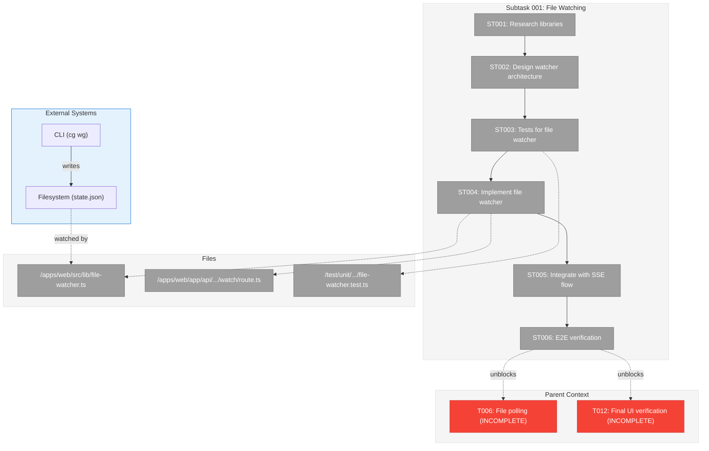
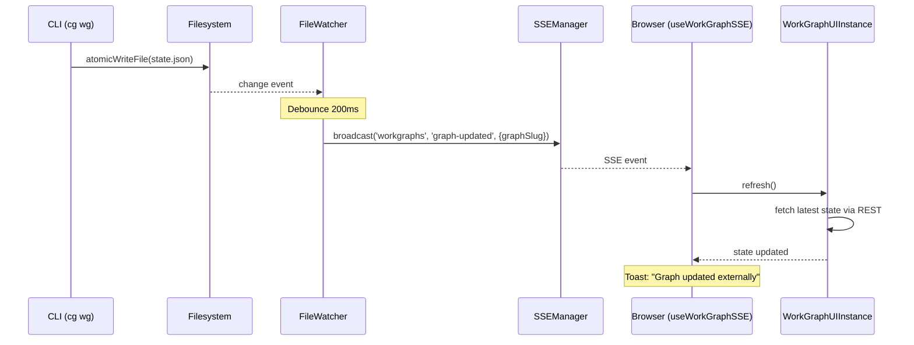

# Subtask 001: File Watching for CLI-Triggered Changes

**Parent Plan:** [View Plan](../../workgraph-ui-plan.md)
**Parent Phase:** Phase 4: Real-time Updates
**Parent Task(s):** [T006: Implement file polling](tasks.md#task-t006), [T012: Final UI verification](tasks.md#task-t012)
**Plan Task Reference:** [Task 4.6 in Plan](../../workgraph-ui-plan.md#phase-4-real-time-updates)

**Why This Subtask:**
During Phase 4 verification, discovered that CLI modifications to workgraph files do not trigger UI updates. The spec (line 160, 267, 316) explicitly requires file watching capability, but Phase 4 only implemented SSE-based updates which only fire when the Web API is used. CLI writes directly to files, bypassing SSE entirely.

**Created:** 2026-01-29
**Requested By:** Development Team (gap discovered during manual testing)

---

## Executive Briefing

### Purpose
This subtask implements file system watching so that when CLI agents or external processes modify workgraph files directly (bypassing the web API), the UI automatically detects and refreshes within 2 seconds—matching the latency requirement from AC-8.

### What We're Building
A file watcher integration that:
- Monitors `state.json` and `work-graph.yaml` for changes using a cross-platform library
- Debounces rapid file changes to avoid refresh storms
- Triggers `instance.refresh()` on detected changes (same flow as SSE)
- Coexists with SSE (SSE for web-triggered changes, file watching for CLI-triggered changes)
- Cleans up watchers on `dispose()` to prevent memory leaks

### Unblocks
- T006 (File polling) - Current implementation only polls when SSE *fails*, not as primary CLI detection
- T012 (Final UI verification) - Cannot pass until CLI→UI updates work
- **User value**: Real-time monitoring of CLI agent execution

### Example

**Before** (broken):
```bash
# Terminal 1: User views graph in browser at /workspaces/main/workgraphs/demo-graph
# Terminal 2:
$ cg wg node remove demo-graph sample-tester-f02
✓ Removed node: sample-tester-f02

# Browser: No update. User must manually refresh.
```

**After** (fixed):
```bash
# Terminal 1: User views graph in browser at /workspaces/main/workgraphs/demo-graph
# Terminal 2:
$ cg wg node remove demo-graph sample-tester-f02
✓ Removed node: sample-tester-f02

# Browser: Within 2s, graph re-renders, toast shows "Graph updated externally"
```

---

## Objectives & Scope

### Objective
Implement file system watching in `WorkGraphUIInstance` so that CLI-triggered file changes are detected and the UI refreshes automatically, achieving the <2s latency requirement from AC-8.

### Goals

- ✅ Research file watching libraries (chokidar vs fs.watch vs @parcel/watcher)
- ✅ Implement file watcher in `WorkGraphUIInstance` for `state.json`
- ✅ Debounce rapid changes (100-200ms) to avoid refresh storms
- ✅ Call `instance.refresh()` on file change (reuse existing flow)
- ✅ Fire `onExternalChange` callback for toast notification
- ✅ Clean up watchers on `dispose()` to prevent memory leaks
- ✅ Coexist with SSE (don't conflict, don't double-refresh)

### Non-Goals

- ❌ Watching `work-graph.yaml` structure changes (Phase 7 concern)
- ❌ Watching `layout.json` (Phase 6 concern)
- ❌ Cross-browser filesystem access (server-side watching only)
- ❌ WebSocket alternative to SSE (out of scope per ADR-0007)
- ❌ Modifying CLI to call web API (architectural change beyond this subtask)

---

## Research Opportunities

### 🔬 RES-001: File Watching Library Selection

**Question**: Which file watching library is best for Next.js server-side usage?

**Candidates**:
| Library | Pros | Cons | Notes |
|---------|------|------|-------|
| `chokidar` | Battle-tested, cross-platform, debounce built-in | 100KB+ bundle, native deps | Used by Vite, webpack |
| `fs.watch` | Zero deps, built-in Node.js | Inconsistent events across platforms, no debounce | May emit multiple events per change |
| `@parcel/watcher` | Very fast, Rust-based | Native compilation, less mature | Used by Turbopack |

**Research Tasks**:
1. Check if any of these are already in `package.json` or transitive deps
2. Test basic functionality with Next.js 16 API routes
3. Verify cleanup/dispose works correctly (memory leak prevention)
4. Confirm works on Linux (dev) and macOS (common dev env)

**Decision Criteria**:
- Must work in Next.js server-side context
- Must support watching specific files (not directories)
- Must have reliable `close()`/`unwatch()` for cleanup
- Prefer already-installed dependency to minimize bundle

### 🔬 RES-002: Server-Side vs Client-Side Watching

**Question**: Where should file watching live—server-side API route or client-side hook?

**Options**:
| Approach | Description | Pros | Cons |
|----------|-------------|------|------|
| A: Server-side | API route watches files, broadcasts SSE | Reuses SSE infra, single watcher per graph | Requires new "watch session" lifecycle |
| B: Client-side | Client polls API for file mtime | Simple, no new server state | Higher latency, more API calls |
| C: Hybrid | Server watches, emits SSE; client subscribes | Best of both | More complex implementation |

**Research Tasks**:
1. Investigate if Next.js API routes can maintain long-lived watchers
2. Check if `sseManager` can be extended for file-change events
3. Determine if multiple browser tabs would create multiple watchers (memory concern)

**Recommendation**: Option C (Hybrid) aligns with existing SSE architecture per ADR-0007.

### 🔬 RES-003: Debounce Strategy

**Question**: How to debounce rapid file changes without missing real updates?

**Scenarios to handle**:
- CLI atomic write: temp file → rename (may emit 2 events)
- Editor save: truncate → write (may emit 2+ events)
- Rapid CLI commands: user runs multiple commands quickly

**Research Tasks**:
1. Measure actual event patterns from CLI writes
2. Determine optimal debounce window (100ms? 200ms? 500ms?)
3. Decide: trailing debounce vs leading debounce vs throttle

---

## Architecture Map

### Component Diagram
<!-- Status: grey=pending, orange=in-progress, green=completed, red=blocked -->
<!-- Updated by plan-6 during implementation -->



### Task-to-Component Mapping

<!-- Status: ⬜ Pending | 🟧 In Progress | ✅ Complete | 🔴 Blocked -->

| Task | Component(s) | Files | Status | Comment |
|------|-------------|-------|--------|---------|
| ST001 | Research | (documentation only) | ⬜ Pending | Evaluate chokidar vs fs.watch vs @parcel/watcher |
| ST002 | Architecture | (design doc in execution log) | ⬜ Pending | Decide server-side vs client-side approach |
| ST003 | Tests | file-watcher.test.ts | ⬜ Pending | TDD: write failing tests first |
| ST004 | FileWatcher | file-watcher.ts, watch/route.ts | ⬜ Pending | Core implementation |
| ST005 | Integration | use-workgraph-sse.ts, sse-broadcast.ts | ⬜ Pending | Wire into existing SSE flow |
| ST006 | Verification | (manual + MCP) | ⬜ Pending | CLI command triggers UI refresh |

---

## Tasks

| Status | ID | Task | CS | Type | Dependencies | Absolute Path(s) | Validation | Subtasks | Notes |
|--------|------|------|----|------|--------------|------------------|------------|----------|-------|
| [ ] | ST001 | Research file watching libraries | 1 | Research | – | /home/jak/substrate/022-workgraph-ui/docs/plans/022-workgraph-ui/tasks/phase-4-real-time-updates/001-subtask-file-watching-for-cli-changes.execution.log.md | Decision documented with rationale | – | See RES-001; check existing deps first |
| [ ] | ST002 | Design watcher architecture | 2 | Design | ST001 | Same as ST001 | Architecture diagram, API sketch | – | See RES-002, RES-003; decide server/client split |
| [ ] | ST003 | Write tests for file watcher | 2 | Test | ST002 | /home/jak/substrate/022-workgraph-ui/test/unit/web/lib/file-watcher.test.ts | Tests cover: detect change, debounce, cleanup | – | TDD per Testing Strategy |
| [ ] | ST004 | Implement file watcher module | 3 | Core | ST003 | /home/jak/substrate/022-workgraph-ui/apps/web/src/lib/file-watcher.ts | Watcher detects state.json changes, debounces, emits | – | Use library from ST001 decision |
| [ ] | ST005 | Integrate file watcher with SSE broadcast | 2 | Integration | ST004 | /home/jak/substrate/022-workgraph-ui/apps/web/app/api/workspaces/[slug]/workgraphs/[graphSlug]/watch/route.ts, /home/jak/substrate/022-workgraph-ui/apps/web/src/features/022-workgraph-ui/sse-broadcast.ts | File change → SSE broadcast → UI refresh | – | Reuse existing sseManager.broadcast() |
| [ ] | ST006 | E2E verification: CLI → UI refresh | 1 | Verification | ST005 | – | CLI `cg wg node remove` triggers UI refresh within 2s | – | MANDATORY: Test with real CLI, not mock |

---

## Alignment Brief

### Objective Recap

Phase 4's acceptance criterion AC-8 requires **<2s latency for external change detection**. The spec (line 160) explicitly lists "SSE + file watching" as the subscription mechanism. Current implementation only handles SSE-triggered changes (web API mutations), missing file-watching for CLI-triggered changes.

This subtask closes that gap by implementing file watching that:
1. Detects when CLI modifies `state.json` directly
2. Broadcasts an SSE event (reusing existing infrastructure)
3. Triggers the same refresh flow already implemented

### Acceptance Criteria Delta

| Criterion | Parent Phase Status | After Subtask |
|-----------|---------------------|---------------|
| AC-8: External changes detected <2s | ⚠️ Partial (SSE only) | ✅ Complete (SSE + file watching) |

### Critical Findings Affecting This Subtask

#### 🚨 Critical Discovery 05: SSE Notification-Fetch Pattern
**From**: Plan § Critical Research Findings
**Relevance**: File watcher should emit the SAME event type (`graph-updated`) so existing SSE infrastructure handles it
**Constraint**: Do not add data to SSE payload; keep notification-only pattern

#### High Impact Discovery 08: Atomic File Writes
**From**: Plan § Critical Research Findings
**Relevance**: CLI uses `atomicWriteFile()` which may emit multiple filesystem events (temp → rename)
**Constraint**: Must debounce to avoid multiple refreshes per write

### ADR Decision Constraints

| ADR | Decision | Constraint for This Subtask |
|-----|----------|----------------------------|
| ADR-0007 | SSE single-channel routing | File watcher must broadcast to `workgraphs` channel |
| ADR-0008 | Workspace split storage | Watch files at `<worktree>/.chainglass/data/work-graphs/<slug>/` |

### Invariants & Guardrails

1. **No double-refresh**: If SSE event arrives AND file change detected, refresh once (dedupe)
2. **Memory safety**: All watchers must be cleaned up on `dispose()`
3. **Cross-platform**: Must work on Linux (CI) and macOS (dev)
4. **No browser filesystem**: Server-side watching only; communicate via SSE

### Inputs to Read

| File | Purpose |
|------|---------|
| `apps/web/src/lib/sse-manager.ts` | Understand broadcast API |
| `apps/web/src/features/022-workgraph-ui/sse-broadcast.ts` | Current broadcast helper |
| `apps/web/src/features/022-workgraph-ui/use-workgraph-sse.ts` | Client subscription |
| `packages/shared/src/utils/atomic-file.ts` | Understand write patterns |

### Visual Aids

#### Sequence Diagram: CLI → UI Refresh Flow



#### Component Integration Diagram

```mermaid
flowchart LR
    subgraph Server["Server Side"]
        FW["FileWatcher"]
        SSE["SSEManager"]
        API["REST API"]
        FW -->|broadcast| SSE
    end

    subgraph Client["Client Side"]
        Hook["useWorkGraphSSE"]
        Instance["WorkGraphUIInstance"]
        Hook -->|refresh()| Instance
        Instance -->|fetch| API
    end

    SSE -.->|event stream| Hook
```

### Test Plan

**Testing Strategy**: Full TDD (per parent phase)

| Test | Type | Description | Validates |
|------|------|-------------|-----------|
| `file watcher detects state.json change` | Unit | Mock fs, emit change, verify callback | ST004 |
| `file watcher debounces rapid changes` | Unit | Emit 5 events in 100ms, verify 1 callback | ST004 |
| `file watcher cleanup on dispose` | Unit | Call dispose, verify watcher closed | ST004 |
| `file change triggers SSE broadcast` | Integration | Real file write, verify SSE event | ST005 |
| `CLI remove triggers UI refresh` | E2E | Real CLI command, verify browser update | ST006 |

### Implementation Outline

1. **ST001 (Research)**: Check `package.json` for existing deps; test candidates in isolation
2. **ST002 (Design)**: Document architecture in execution log; create API sketch
3. **ST003 (Tests)**: Write failing tests using chosen library's API
4. **ST004 (Implement)**: Create `file-watcher.ts` module; pass tests
5. **ST005 (Integrate)**: Wire into SSE broadcast; add watch route or extend existing
6. **ST006 (Verify)**: Run real CLI commands while watching browser

### Commands to Run

```bash
# Research: Check existing dependencies
cd /home/jak/substrate/022-workgraph-ui
grep -r "chokidar\|@parcel/watcher" package.json pnpm-lock.yaml

# Run subtask tests
pnpm test test/unit/web/lib/file-watcher.test.ts

# Run all Phase 4 tests (ensure no regression)
pnpm test test/unit/web/features/022-workgraph-ui/

# E2E verification
# Terminal 1: Browser at http://localhost:3000/workspaces/chainglass-main/workgraphs/demo-graph
# Terminal 2:
node apps/cli/dist/cli.cjs wg node add-after demo-graph start sample-input --workspace-path /home/jak/substrate/chainglass
# Observe: Browser should refresh within 2s
```

### Risks & Mitigations

| Risk | Likelihood | Impact | Mitigation |
|------|------------|--------|------------|
| Chosen library doesn't work in Next.js | Medium | High | Research phase validates before committing |
| Watcher memory leak | Medium | High | Explicit test for cleanup; review dispose() |
| Platform differences (Linux vs macOS) | Low | Medium | Test on both; use cross-platform library |
| Double-refresh with SSE | Medium | Low | Dedupe logic based on timestamp or event ID |

### Ready Check

Before running `/plan-6-implement-phase --phase "Phase 4: Real-time Updates" --plan "/home/jak/substrate/022-workgraph-ui/docs/plans/022-workgraph-ui/workgraph-ui-plan.md" --subtask "001-subtask-file-watching-for-cli-changes"`:

- [ ] Research questions RES-001, RES-002, RES-003 have documented answers
- [ ] Architecture decision recorded in execution log
- [ ] Test file paths exist (or will be created by ST003)
- [ ] Dev server running for E2E verification
- [ ] CLI built and functional (`node apps/cli/dist/cli.cjs wg --help`)

---

## Phase Footnote Stubs

_Footnotes will be added by plan-6 during implementation._

| ID | Task | Components/Methods | Added By |
|----|------|-------------------|----------|
| | | | |

---

## Evidence Artifacts

**Execution Log**: `001-subtask-file-watching-for-cli-changes.execution.log.md`

**Artifact Directory**: Store research findings, architecture sketches, and test outputs in this phase directory.

| Artifact | Purpose | Created By |
|----------|---------|------------|
| `execution.log.md` | Research decisions, implementation narrative | plan-6 |
| Test output screenshots | E2E verification evidence | ST006 |

---

## Discoveries & Learnings

_Populated during implementation by plan-6. Log anything of interest to your future self._

| Date | Task | Type | Discovery | Resolution | References |
|------|------|------|-----------|------------|------------|
| | | | | | |

**Types**: `gotcha` | `research-needed` | `unexpected-behavior` | `workaround` | `decision` | `debt` | `insight`

**What to log**:
- Things that didn't work as expected
- External research that was required
- Implementation troubles and how they were resolved
- Gotchas and edge cases discovered
- Decisions made during implementation
- Technical debt introduced (and why)
- Insights that future phases should know about

_See also: `001-subtask-file-watching-for-cli-changes.execution.log.md` for detailed narrative._

---

## After Subtask Completion

**This subtask resolves a blocker for:**
- Parent Task: [T006: Implement file polling](tasks.md#task-t006)
- Parent Task: [T012: Final UI verification](tasks.md#task-t012)
- Plan Task: [Phase 4: Real-time Updates](../../workgraph-ui-plan.md#phase-4-real-time-updates)

**When all ST### tasks complete:**

1. **Record completion** in parent execution log:
   ```
   ### Subtask 001-subtask-file-watching-for-cli-changes Complete

   Resolved: Implemented file watching so CLI changes trigger UI refresh
   See detailed log: [subtask execution log](./001-subtask-file-watching-for-cli-changes.execution.log.md)
   ```

2. **Update parent tasks** (if they were marked incomplete):
   - Open: [`tasks.md`](./tasks.md)
   - Find: T006, T012
   - Verify they can now be marked complete
   - Update Notes: Add "Subtask 001 complete"

3. **Resume parent phase work:**
   ```bash
   /plan-6-implement-phase --phase "Phase 4: Real-time Updates" \
     --plan "/home/jak/substrate/022-workgraph-ui/docs/plans/022-workgraph-ui/workgraph-ui-plan.md"
   ```
   (Note: NO `--subtask` flag to resume main phase)

**Quick Links:**
- 📋 [Parent Dossier](./tasks.md)
- 📄 [Parent Plan](../../workgraph-ui-plan.md)
- 📊 [Parent Execution Log](./execution.log.md)

---

## Directory Structure After Subtask

```
docs/plans/022-workgraph-ui/tasks/phase-4-real-time-updates/
├── tasks.md                                              # Parent phase dossier
├── execution.log.md                                      # Parent phase log
├── 001-subtask-file-watching-for-cli-changes.md          # This subtask dossier
└── 001-subtask-file-watching-for-cli-changes.execution.log.md  # Subtask log (created by plan-6)
```
