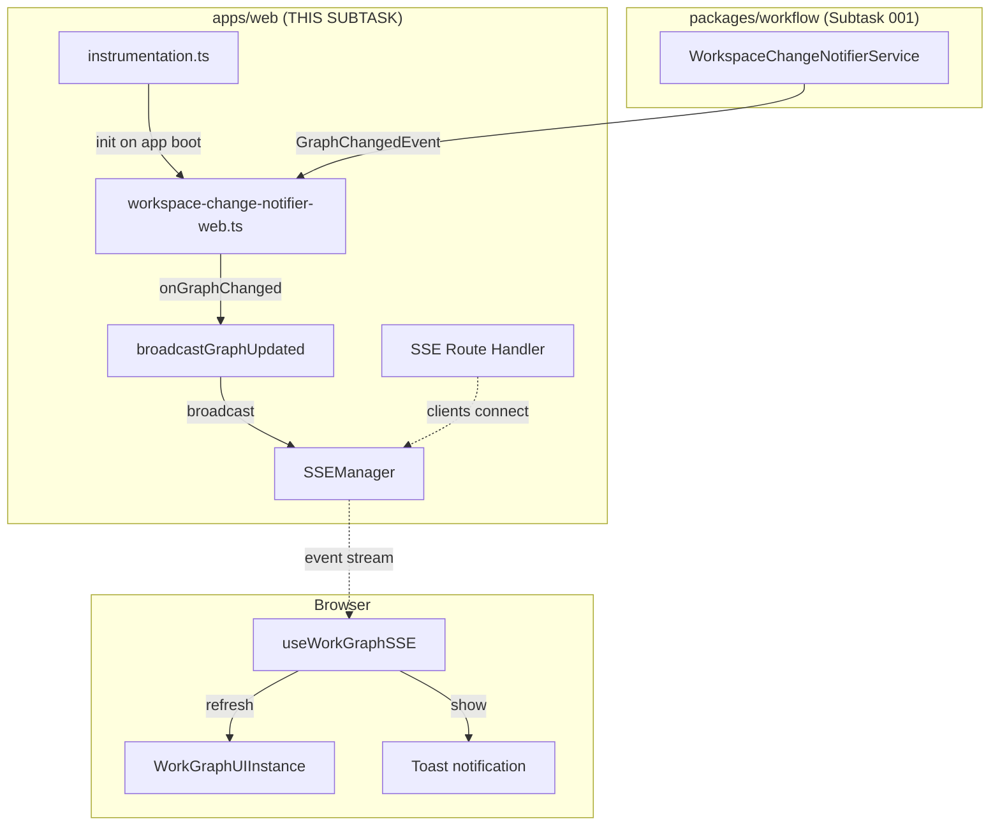

# Subtask 002: Browser/SSE Integration for File Watcher

**Parent Plan**: `../../workgraph-ui-plan.md`
**Parent Dossier**: `./tasks.md`
**Prerequisite**: Subtask 001 (WorkspaceChangeNotifierService) must be complete

---

## Overview

| Field | Value |
|-------|-------|
| **Subtask ID** | 002-subtask-browser-sse-integration |
| **Parent Phase** | Phase 4: Real-time Updates |
| **Parent Tasks** | T006, T012 |
| **Dependency** | 001-subtask-file-watching-for-cli-changes |
| **Complexity** | Medium (2) |
| **Created** | 2026-01-29 |

---

## Problem Statement

Subtask 001 created `WorkspaceChangeNotifierService` which emits `GraphChangedEvent` when CLI modifies `state.json`. This subtask wires those events to the browser via SSE so the UI updates automatically.

---

## Objectives & Scope

### Objective
Wire `WorkspaceChangeNotifierService` to the web application so that CLI-triggered file changes result in browser updates within <2s (AC-8).

### Goals

- [ ] Create web integration layer (`workspace-change-notifier-web.ts`)
- [ ] Wire service events to `broadcastGraphUpdated()` 
- [ ] Start service on app boot (not lazy init - decided in DYK session)
- [ ] Verify SSE event reaches client (curl test)
- [ ] Verify client hook receives event (MCP test)
- [ ] Full E2E: CLI command → Toast → Graph refresh (visual test)

### Non-Goals

- ❌ Service implementation (Subtask 001)
- ❌ Polling fallback (out of scope)
- ❌ WebSocket alternative (ADR-0007)

---

## Architecture

### Component Integration



---

## Tasks

| Status | ID | Task | CS | Type | Validation | Notes |
|--------|------|------|----|------|------------|-------|
| [ ] | ST006 | Create web integration layer | 2 | Impl | Unit test passes | globalThis pattern for HMR |
| [ ] | ST006a | Add SSE broadcast deduplication | 1 | Impl | Unit test passes | 500ms window per graphSlug (DYK-01) |
| [ ] | ST006b | Register service in DI container | 2 | Impl | Service resolves | Add IFileWatcherFactory + WorkspaceChangeNotifierService (DYK-02) |
| [ ] | ST006c | Add SSE-activity-gated polling fallback | 2 | Impl | Unit test passes | Poll when SSE silent >60s, pause on SSE event (DYK-04) |
| [ ] | ST007 | Verify SSE event on wire (curl) | 1 | Verify | JSON in terminal | Gate G3 |
| [ ] | ST008 | Verify client receives event (MCP) | 1 | Verify | Console.log via MCP | Gate G4 |
| [ ] | ST009 | Full E2E: CLI → Toast → Refresh | 1 | E2E | Visual confirmation | Gate G5 |

---

## Detailed Task Specifications

### ST006: Create Web Integration Layer

**Goal**: Connect WorkspaceChangeNotifierService to SSE broadcasts in the web app

**Implementation**:
```typescript
// apps/web/src/lib/workspace-change-notifier-web.ts

import { 
  WorkspaceChangeNotifierService,
  GitWorktreeResolver,
  type GraphChangedEvent,
} from '@chainglass/workflow';
import { workspaceRegistryAdapter } from './di-container';
import { broadcastGraphUpdated } from '@/features/022-workgraph-ui/sse-broadcast';

// Singleton using globalThis pattern (survives HMR)
const globalForNotifier = globalThis as typeof globalThis & { 
  workspaceChangeNotifier?: WorkspaceChangeNotifierService;
  notifierInitialized?: boolean;
};

function getOrCreateNotifier(): WorkspaceChangeNotifierService {
  if (!globalForNotifier.workspaceChangeNotifier) {
    globalForNotifier.workspaceChangeNotifier = new WorkspaceChangeNotifierService(
      workspaceRegistryAdapter,
      new GitWorktreeResolver(),
    );
  }
  return globalForNotifier.workspaceChangeNotifier;
}

/**
 * Initialize the workspace change notifier and wire it to SSE.
 * Call this on app startup (e.g., instrumentation.ts or root layout).
 * Idempotent - safe to call multiple times.
 */
export async function initWorkspaceChangeNotifier(): Promise<void> {
  if (globalForNotifier.notifierInitialized) {
    return;
  }

  const notifier = getOrCreateNotifier();

  // Wire graph change events to SSE broadcasts
  notifier.onGraphChanged((event: GraphChangedEvent) => {
    console.log(`[WorkspaceChangeNotifier] Graph changed: ${event.graphSlug} in ${event.workspaceSlug}`);
    broadcastGraphUpdated(event.graphSlug);
  });

  await notifier.start();
  globalForNotifier.notifierInitialized = true;
  
  console.log('[WorkspaceChangeNotifier] Started watching all workspaces');
}

/**
 * Stop the notifier (for cleanup/testing).
 */
export async function stopWorkspaceChangeNotifier(): Promise<void> {
  if (globalForNotifier.workspaceChangeNotifier) {
    await globalForNotifier.workspaceChangeNotifier.stop();
    globalForNotifier.notifierInitialized = false;
  }
}
```

**Start on App Boot** (not lazy init):
```typescript
// Option A: apps/web/instrumentation.ts (Next.js instrumentation hook)
export async function register() {
  // Only run on server
  if (process.env.NEXT_RUNTIME === 'nodejs') {
    const { initWorkspaceChangeNotifier } = await import('@/lib/workspace-change-notifier-web');
    await initWorkspaceChangeNotifier();
  }
}

// Option B: apps/web/src/app/layout.tsx (root layout - server component)
// Call in top-level await or via a server initialization module
```

**Test** (use injected fakes, no mocks - project convention DYK-05):
```typescript
// test/unit/web/lib/workspace-change-notifier-web.test.ts

describe('initWorkspaceChangeNotifier', () => {
  // Use FakeWorkspaceChangeNotifierService injected via DI
  // Do NOT use vi.mock() or vi.spyOn() for core dependencies
  it('starts the notifier on first call');
  it('is idempotent (second call does nothing)');
  it('wires onGraphChanged to broadcastGraphUpdated');
});
```

**Validation**: Unit tests pass

**Files to Create/Modify**:
| File | Action |
|------|--------|
| `apps/web/src/lib/workspace-change-notifier-web.ts` | Create |
| `apps/web/instrumentation.ts` | Create (or modify if exists) |
| `test/unit/web/lib/workspace-change-notifier-web.test.ts` | Create |

---

### ST007: Verify SSE Event on Wire (curl)

**Goal**: Confirm event actually appears on SSE stream without browser

**Manual Test Procedure**:
```bash
# Terminal 1: Start dev server
cd /home/jak/substrate/022-workgraph-ui
pnpm dev

# Terminal 2: Subscribe to SSE (will hang, waiting for events)
curl -N -H "Accept: text/event-stream" \
  "http://localhost:3000/api/events/workgraphs"

# Terminal 3: Trigger file change (use actual workspace path)
echo '{"test": true}' > /home/jak/substrate/chainglass/.chainglass/data/work-graphs/demo-graph/state.json

# Expected in Terminal 2:
# event: graph-updated
# data: {"type":"graph-updated","graphSlug":"demo-graph"}
```

**Validation**: JSON event appears in curl output within 2s (Gate G3)

---

### ST008: Verify Client Hook via MCP Console

**Goal**: Confirm client-side JavaScript receives event, visible in browser console via MCP

**Preparation**: Add explicit console.log to hook (may already exist):
```typescript
// In use-workgraph-sse.ts, inside message handler:
console.log('[useWorkGraphSSE] Received event:', event.type, event.graphSlug);
```

**Test Procedure**:
1. Open browser to workgraph page
2. Use Next.js MCP to check console:
   ```
   nextjs_call port=3000 toolName="get_errors"
   ```
3. Trigger file change (CLI or direct write)
4. Check MCP output for console.log

**Validation**: Console log visible via MCP (Gate G4)

---

### ST009: Full E2E Visual Verification

**Goal**: Complete flow - CLI command triggers visible UI update

**Test Procedure**:
```bash
# Terminal 1: Browser at http://localhost:3000/workspaces/chainglass-main/workgraphs/demo-graph

# Terminal 2: Run CLI command
node apps/cli/dist/cli.cjs wg node add-after demo-graph start test-node \
  --workspace-path /home/jak/substrate/chainglass

# Expected in browser (within 2s):
# 1. Toast: "Graph updated externally"
# 2. New node "test-node" appears in graph
```

**Validation**: Visual confirmation (Gate G5)

---

## Test Plan

### Unit Tests (ST006)

| # | Test | Expected |
|---|------|----------|
| 1 | `ensureWorkspaceChangeNotifier` starts notifier | `service.start()` called |
| 2 | Second call is idempotent | `service.start()` NOT called again |
| 3 | `onGraphChanged` calls `broadcastGraphUpdated` | Spy confirms call with correct graphSlug |
| 4 | `stopWorkspaceChangeNotifier` cleans up | `service.stop()` called |

### Manual Verification (ST007-ST009)

| Gate | Test | Method | Pass Criteria |
|------|------|--------|---------------|
| G3 | SSE wire | curl + file touch | JSON event in terminal |
| G4 | Client hook | Browser + MCP | Console.log visible |
| G5 | Full E2E | CLI + Browser | Toast + node appears |

---

## Commands

```bash
# Run web integration tests
pnpm test test/unit/web/lib/workspace-change-notifier-web.test.ts

# Start dev server (for manual testing)
pnpm dev

# curl verification
curl -N -H "Accept: text/event-stream" "http://localhost:3000/api/events/workgraphs"

# Trigger file change
echo '{"updated": true}' > /home/jak/substrate/chainglass/.chainglass/data/work-graphs/demo-graph/state.json

# CLI command for E2E
node apps/cli/dist/cli.cjs wg node add-after demo-graph start test-node \
  --workspace-path /home/jak/substrate/chainglass

# Quality checks
just fft
just typecheck
```

---

## Verification Gates

| Gate | Prerequisite | Verification | Pass Criteria |
|------|-------------|--------------|---------------|
| G3 | ST006 complete | curl + file touch | JSON event in terminal within 2s |
| G4 | G3 passed | Browser + MCP | Console.log shows event |
| G5 | G4 passed | CLI + Browser | Toast appears, graph refreshes |

---

## After Subtask Completion

**This subtask completes:**
- Parent Task: T006 (File polling → file watching)
- Parent Task: T012 (Final UI verification)
- AC-8: External changes detected <2s ✅

**When all ST### tasks complete:**

1. **Record completion** in parent execution log
2. **Update parent tasks** T006, T012 as complete
3. **Resume parent phase work** if needed

**Quick Links:**
- 📋 [Subtask 001 (Service)](./001-subtask-file-watching-for-cli-changes.md)
- 📋 [Parent Dossier](./tasks.md)
- 📄 [Parent Plan](../../workgraph-ui-plan.md)

---

## Critical Insights Discussion

**Session**: 2026-01-30
**Context**: Subtask 002 - Browser/SSE Integration for File Watcher
**Analyst**: AI Clarity Agent
**Reviewer**: Development Team
**Format**: Water Cooler Conversation (5 Critical Insights)

### Insight 1: Double-Broadcast Race Condition

**Did you know**: When a CLI mutation writes state.json, BOTH the API route AND the file watcher will broadcast SSE events for the same change, causing duplicate UI updates.

**Implications**:
- Toast appears twice ("Graph updated externally" x2)
- Graph refreshes twice in rapid succession
- Wasted bandwidth and CPU cycles
- Confusing user experience

**Options Considered**:
- Option A: Client-side deduplication - Hook ignores duplicate events within window
- Option B: Server-side deduplication - broadcastGraphUpdated() dedupes in 500ms window
- Option C: Source tagging - Tag events with source, client filters

**AI Recommendation**: Option B - Server-side deduplication
- Reasoning: Single fix location, simpler client code, no client-side timer management

**Discussion Summary**: User chose server-side deduplication to keep complexity in one place. 500ms window per graphSlug is sufficient to catch file system delay.

**Decision**: Server-side 500ms deduplication window in broadcastGraphUpdated()

**Action Items**:
- [x] Added task ST006a for SSE broadcast deduplication

**Affects**: sse-broadcast.ts, ST006a added to task table

---

### Insight 2: DI Wiring Gap - Missing Service Registration

**Did you know**: The subtask code sample imports `workspaceRegistryAdapter` from DI container, but WorkspaceChangeNotifierService and IFileWatcherFactory are NOT registered in the DI container.

**Implications**:
- Code will fail at runtime with missing dependency error
- DI container exists but service registration incomplete
- Need to add factory pattern registration (no decorators for RSC compatibility)

**Options Considered**:
- Option A: Full DI registration - Add IFileWatcherFactory + WorkspaceChangeNotifierService to container
- Option B: Direct instantiation - Skip DI, instantiate directly in web layer
- Option C: Lazy registration - Register on first use

**AI Recommendation**: Option A - Full DI registration
- Reasoning: Consistent with existing patterns, enables testing with fakes, clean architecture

**Discussion Summary**: Subagent verified DI container exists at apps/web/src/lib/di-container.ts. IWorkspaceRegistryAdapter already registered. Need to add IFileWatcherFactory and WorkspaceChangeNotifierService.

**Decision**: Full DI registration following existing factory pattern

**Action Items**:
- [x] Added task ST006b for DI registration

**Affects**: di-container.ts, ST006b added to task table

---

### Insight 3: Instrumentation vs Root Layout Timing

**Did you know**: There's a timing difference between instrumentation.ts (runs at server boot) and root layout (runs at first request) for initializing the file watcher.

**Implications**:
- instrumentation.ts: Watcher starts immediately, no race conditions
- Root layout: Watcher starts on first request, potential gap where CLI changes are missed
- First user to hit the site triggers initialization

**Options Considered**:
- Option A: instrumentation.ts - Start at server boot, guaranteed early initialization
- Option B: Root layout - Start on first request, simpler but potential race

**AI Recommendation**: Option A - instrumentation.ts
- Reasoning: No race conditions, watcher ready before any requests, cleaner separation

**Discussion Summary**: User agreed instrumentation.ts is the right choice for reliability.

**Decision**: Use instrumentation.ts for service initialization (already in plan)

**Action Items**: None (already specified in subtask)

**Affects**: No changes needed

---

### Insight 4: Error Resilience - Chokidar Failure Detection

**Did you know**: The polling fallback only triggers when SSE connection fails, NOT when chokidar (file watcher) fails. If chokidar fails silently, SSE stays connected but no events flow - and the browser has no way to know.

**Implications**:
- SSE failure → polling kicks in (handled)
- Chokidar failure + SSE healthy → NO polling, UI never updates (not handled)
- These are independent failure modes
- User experience degrades silently with no indication

**Options Considered**:
- Option A: Accept degraded experience - Log warning, manual refresh required
- Option B: Always-on parallel polling - 5s polling alongside SSE as safety net
- Option C: Health check endpoint - Server exposes watcher status, client polls health

**AI Recommendation**: Option B - Always-on polling
- Reasoning: Simple safety net, minimal overhead with slow interval

**Discussion Summary**: User proposed elegant hybrid: SSE-activity-gated polling. Poll when SSE has been silent for 60s, pause polling when SSE event arrives. Best of both worlds.

**Decision**: SSE-activity-gated polling - poll only when SSE silent >60s, pause on SSE event

**Action Items**:
- [x] Added task ST006c for SSE-activity-gated polling fallback

**Affects**: use-workgraph-sse.ts, ST006c added to task table

---

### Insight 5: Testing Gap - No Automated Integration Tests

**Did you know**: All verification gates (G3-G5) are manual tests. There's no automated test that verifies the full chain: chokidar → event → SSE → client.

**Implications**:
- Unit tests prove components work in isolation (with injected fakes)
- Manual tests prove system works once
- Neither proves system KEEPS working
- Regression risk on future changes

**Options Considered**:
- Option A: Accept manual verification - Manual gates sufficient for one-time feature
- Option B: Integration test with real chokidar - Touch file, verify SSE output
- Option C: E2E test with Playwright - Browser automation, assert toast appears

**AI Recommendation**: Option A - Accept manual verification
- Reasoning: One-time integration, manual tests are quick (~2 min), file watcher tests are notoriously flaky

**Discussion Summary**: User chose manual verification. Also clarified project convention: tests must use injected fakes via DI, no mocks allowed.

**Decision**: Manual verification for integration tests. Unit tests use injected fakes only.

**Action Items**:
- [x] Updated ST006 test spec to note fakes-only requirement

**Affects**: Test specifications in subtask

---

## Session Summary

**Insights Surfaced**: 5 critical insights identified and discussed
**Decisions Made**: 5 decisions reached through collaborative discussion
**Action Items Created**: 4 new tasks added (ST006a, ST006b, ST006c, test spec update)
**Areas Updated**:
- Task table: Added ST006a (deduplication), ST006b (DI registration), ST006c (SSE-gated polling)
- ST006 test spec: Added fakes-only note

**Shared Understanding Achieved**: ✓

**Confidence Level**: High - Key risks identified and mitigated with practical solutions

**Next Steps**:
Proceed with implementation of Subtask 002, starting with ST006b (DI registration) as foundation.

**Notes**:
- SSE-activity-gated polling (user's idea) is an elegant solution to the chokidar failure detection problem
- Project uses strict no-mocks testing policy - all dependencies must be injected fakes
