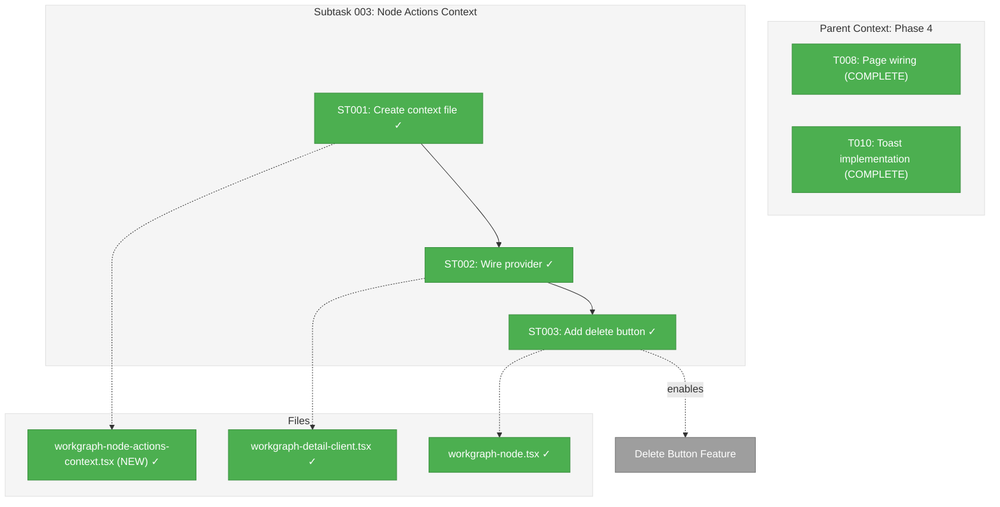
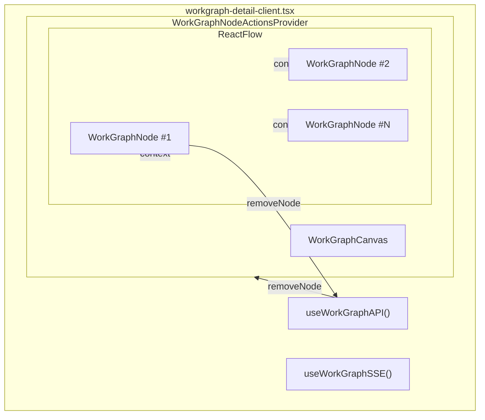
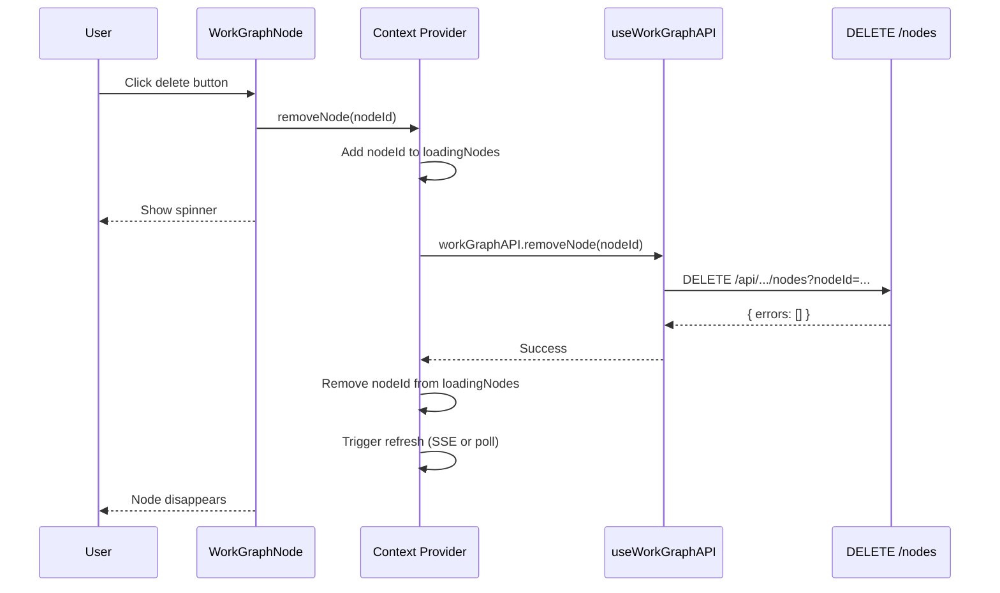

# Subtask 003: Extensible WorkGraph Node Actions Context

**Parent Plan:** [../../workgraph-ui-plan.md](../../workgraph-ui-plan.md)
**Parent Phase:** Phase 4: Real-time Updates
**Parent Task(s):** [T008: Page wiring](../tasks.md#task-t008), [T010: Toast implementation](../tasks.md#task-t010)
**Plan Task Reference:** [Task 4.8 in Plan](../../workgraph-ui-plan.md#phase-4-real-time-updates)
**Created:** 2026-01-30
**Requested By:** Development Team

**Why This Subtask:**
React Flow's `nodeTypes` registration doesn't forward custom props to node components. Nodes only see `data`, `selected`, `id`, etc. from React Flow—not callbacks like `removeNode()`. We need an extensible mechanism to provide action callbacks and dynamic state (loading indicators, selection state) to node components. This pattern will support delete buttons now and future features (status updates, modals, run/cancel, details panel) later.

---

## Executive Briefing

### Purpose
Create a generic React Context that provides action callbacks and dynamic state to WorkGraph node components, enabling interactive features like delete buttons without prop drilling through React Flow's opaque component tree.

### What We're Building
An extensible `WorkGraphNodeActionsContext` that:
- Provides `removeNode(nodeId)` callback for delete functionality
- Tracks per-node loading states via `loadingNodes: Set<string>`
- Uses the same patterns as existing `SidebarContext` (memoized callbacks, null-checked hook)
- Is designed for future expansion: run/cancel, open question modal, show details, etc.

### Unblocks
- Delete button on nodes (immediate need)
- Future: Per-node action menus, status transitions, modal triggers

### Example
**Before (not possible):**
```tsx
// WorkGraphNode component has no access to removeNode()
function WorkGraphNode({ data }: NodeProps) {
  // ❌ Can't delete - no callback available
}
```

**After:**
```tsx
function WorkGraphNode({ data }: NodeProps) {
  const { removeNode, loadingNodes } = useWorkGraphNodeActions();
  const isLoading = loadingNodes.has(data.id);
  // ✅ Can delete with loading state
  <Button onClick={() => removeNode(data.id)} disabled={isLoading}>
    {isLoading ? <Spinner /> : <Trash2 />}
  </Button>
}
```

---

## Objectives & Scope

### Objective
Create an extensible context that provides action callbacks to WorkGraph node components, enabling the delete button feature and establishing a pattern for future node interactions.

### Goals

- ✅ Create `WorkGraphNodeActionsContext` following `SidebarContext` pattern
- ✅ Implement `useWorkGraphNodeActions()` hook with null-check error
- ✅ Wire provider into `workgraph-detail-client.tsx`
- ✅ Add `removeNode` and `loadingNodes` to context
- ✅ Add delete button to `workgraph-node.tsx` with loading state
- ✅ Design interface for future extensibility (documented expansion points)

### Non-Goals

- ❌ Multi-select/bulk delete (single node operations only per Phase 3 scope)
- ❌ Confirmation dialogs (delete is immediate; can add later)
- ❌ Undo/redo system (out of scope)
- ❌ Using `node.data` for callbacks (anti-pattern: functions in serializable data)

---

## Flight Plan

### Summary
| File | Action | Origin | Modified By | Recommendation |
|------|--------|--------|-------------|----------------|
| /home/jak/substrate/022-workgraph-ui/apps/web/src/features/022-workgraph-ui/workgraph-node-actions-context.tsx | Create | New | — | keep-as-is |
| /home/jak/substrate/022-workgraph-ui/apps/web/app/(dashboard)/workspaces/[slug]/workgraphs/[graphSlug]/workgraph-detail-client.tsx | Modify | Plan 022 Phase 2 | Phases 3, 4 | keep-as-is |
| /home/jak/substrate/022-workgraph-ui/apps/web/src/features/022-workgraph-ui/workgraph-node.tsx | Modify | Plan 022 Phase 2 | Phase 3 | keep-as-is |

### Per-File Detail

#### /home/jak/substrate/022-workgraph-ui/apps/web/src/features/022-workgraph-ui/workgraph-node-actions-context.tsx
- **Duplication check**: Searched for "React Context for passing callbacks" via code-concept-search. Found `SidebarContext` (exact pattern match), `ContainerContext` (DI bridge, different purpose). No existing workgraph-specific action context. Safe to create.
- **Provenance**: New file
- **Compliance**: Follows SidebarContext pattern per idioms; uses `useCallback`/`useMemo` per rules

#### /home/jak/substrate/022-workgraph-ui/apps/web/app/(dashboard)/workspaces/[slug]/workgraphs/[graphSlug]/workgraph-detail-client.tsx
- **Duplication check**: N/A (modify existing)
- **Provenance**: Created Plan 022 Phase 2 (T008), modified Phase 3 (editing), Phase 4 (SSE, toast, refresh button)
- **Compliance**: No violations

#### /home/jak/substrate/022-workgraph-ui/apps/web/src/features/022-workgraph-ui/workgraph-node.tsx
- **Duplication check**: N/A (modify existing)
- **Provenance**: Created Plan 022 Phase 2 (T004), modified Phase 3 (T017)
- **Compliance**: No violations

### Compliance Check
No violations found. Pattern aligns with existing `SidebarContext` implementation.

---

## Architecture Map

### Component Diagram
<!-- Status: grey=pending, orange=in-progress, green=completed, red=blocked -->
<!-- Updated by plan-6 during implementation -->



### Task-to-Component Mapping

<!-- Status: ⬜ Pending | 🟧 In Progress | ✅ Complete | 🔴 Blocked -->

| Task | Component(s) | Files | Status | Comment |
|------|-------------|-------|--------|---------|
| ST001 | Context + Hook | workgraph-node-actions-context.tsx | ✅ Complete | Create context, interface, hook following SidebarContext pattern |
| ST002 | Provider Wiring | workgraph-detail-client.tsx | ✅ Complete | Add provider, wire removeNode + loadingNodes state |
| ST003 | Delete Button | workgraph-node.tsx | ✅ Complete | Consume context, add Trash2 button with loading state |

---

## Tasks

| Status | ID | Task | CS | Type | Dependencies | Absolute Path(s) | Validation | Subtasks | Notes |
|--------|------|------|----|------|--------------|------------------|------------|----------|-------|
| [x] | ST001 | Create WorkGraphNodeActionsContext and useWorkGraphNodeActions hook | 2 | Core | – | /home/jak/substrate/022-workgraph-ui/apps/web/src/features/022-workgraph-ui/workgraph-node-actions-context.tsx | File exports context, provider props type, and hook; hook throws if used outside provider | – | Follow SidebarContext pattern exactly; `plan-scoped` |
| [x] | ST002 | Wire context provider into workgraph-detail-client.tsx | 2 | Integration | ST001 | /home/jak/substrate/022-workgraph-ui/apps/web/app/(dashboard)/workspaces/[slug]/workgraphs/[graphSlug]/workgraph-detail-client.tsx | Provider wraps WorkGraphCanvas; removeNode wired to workGraphAPI.removeNode; loadingNodes state managed | – | Use useCallback for removeNode; `plan-scoped` |
| [x] | ST003 | Add delete button to workgraph-node.tsx | 2 | UI | ST002 | /home/jak/substrate/022-workgraph-ui/apps/web/src/features/022-workgraph-ui/workgraph-node.tsx | Button appears on hover/selection; shows spinner when loading; calls removeNode on click | – | Use Trash2 icon from Lucide; `plan-scoped` |

---

## Alignment Brief

### Objective Recap
Phase 4 focuses on real-time updates (SSE). This subtask adds the delete button feature which requires a communication channel between the page component (which has `useWorkGraphAPI`) and the node component (which renders the delete button). The context pattern establishes an extensible foundation for future node interactions.

### Acceptance Criteria Deltas
This subtask does NOT add new acceptance criteria. It implements AC-3 (Node Removal) from spec which was architecturally deferred:
- ✅ AC-3: "User can delete a node; only that node removed (no cascade)"

### Critical Findings Affecting This Subtask

**From Code-Concept-Search #1 (React Context Patterns):**
- `SidebarContext` (apps/web/src/components/ui/sidebar.tsx:30-119) is the **exact pattern** to follow
- Uses `React.createContext<T | null>(null)` with null-checked hook
- All callbacks wrapped in `useCallback`, context value in `useMemo`
- Provider pattern with children prop

**From Code-Concept-Search #2 (Loading State Patterns):**
- WorkGraph already uses `node.status === 'running'` for execution loading state
- For **operation loading** (user-initiated mutations like delete), use separate `Set<string>`
- No existing `loadingNodes` pattern—safe to create

**From Code-Concept-Search #3 (nodeTypes Callback Patterns):**
- Pattern #1 (callbacks in `node.data`) works but is an **anti-pattern** (functions in serializable data)
- Pattern #2 (instance prop closure) only works for canvas-level handlers
- **React Context is the cleanest solution** for node-level actions

### ADR Decision Constraints

**ADR-0004: Dependency Injection Container Architecture**
- IMP-004: Test files use fakes, never mocks
- Subtask tests will use `FakeWorkGraphUIInstance` which already has `removeNode()` tracking
- **Constrains**: ST001 test approach; **Addressed by**: Using injected fakes in test setup

### Invariants

1. **No mocks** - Tests use injected fakes via DI (per project rules)
2. **Loading state per-node** - Users see spinner only on the node being deleted
3. **Error handling** - Failed deletes show toast, don't leave node in loading state
4. **Extensible interface** - Context interface designed for adding future actions without breaking changes

### Inputs to Read

| Artifact | Path | Usage |
|----------|------|-------|
| SidebarContext (pattern) | apps/web/src/components/ui/sidebar.tsx:30-119 | Copy pattern structure |
| useWorkGraphAPI | apps/web/src/features/022-workgraph-ui/use-workgraph-api.ts | Wire removeNode |
| WorkGraphNode | apps/web/src/features/022-workgraph-ui/workgraph-node.tsx | Add delete button UI |
| workgraph-detail-client | apps/web/app/(dashboard)/workspaces/[slug]/workgraphs/[graphSlug]/workgraph-detail-client.tsx | Add provider |

### Visual Aids

#### Context Provider Hierarchy



#### Delete Flow Sequence



### Test Plan

**Approach**: Lightweight verification (no TDD gate for this UI subtask)

| Test | Type | Validation |
|------|------|------------|
| Context throws outside provider | Unit | `expect(() => renderHook(() => useWorkGraphNodeActions())).toThrow()` |
| Delete button calls removeNode | Unit | Render node with context, click button, verify `removeNode` called |
| Loading state shown during delete | Unit | Start delete, verify `loadingNodes.has(id)` → spinner visible |

**Test Setup**: Use `FakeWorkGraphUIInstance` per project rules (no mocks).

### Implementation Outline

1. **ST001: Create context file**
   - Define `WorkGraphNodeActions` interface: `{ removeNode, loadingNodes }`
   - Create context with `createContext<WorkGraphNodeActions | null>(null)`
   - Export `WorkGraphNodeActionsProvider` component
   - Export `useWorkGraphNodeActions()` hook with null-check error

2. **ST002: Wire provider**
   - Add `loadingNodes` state: `useState<Set<string>>(new Set())`
   - Create memoized `removeNode` callback that:
     - Adds nodeId to loadingNodes
     - Calls `workGraphAPI.removeNode(nodeId)`
     - Removes nodeId from loadingNodes (finally block)
     - Shows toast on error
   - Create memoized context value
   - Wrap `WorkGraphCanvas` with provider

3. **ST003: Add delete button**
   - Import `useWorkGraphNodeActions` and Trash2 icon
   - Add button with: `onClick={() => removeNode(data.id)}`
   - Show spinner when `loadingNodes.has(data.id)`
   - Style: absolute position, top-right, visible on hover/selection

### Commands to Run

```bash
# Typecheck after ST001
pnpm typecheck

# Lint/format after each task
just fft

# Manual verification
pnpm dev
# Navigate to workgraph page, verify delete buttons appear
```

### Risks & Mitigations

| Risk | Probability | Impact | Mitigation |
|------|-------------|--------|------------|
| Context value not memoized properly | Low | Medium (re-renders) | Follow SidebarContext pattern exactly; useMemo with correct deps |
| Loading state not cleared on error | Medium | High (stuck spinner) | Use try/finally pattern in removeNode callback |
| Delete button fires on drag | Low | Medium (accidental delete) | Use `stopPropagation` and require click (not drag) |

### Ready Check

- [ ] SidebarContext pattern reviewed (apps/web/src/components/ui/sidebar.tsx)
- [ ] useWorkGraphAPI.removeNode signature verified
- [ ] WorkGraphNode current structure reviewed
- [ ] Trash2 icon available from lucide-react
- [ ] No blocking dependencies

---

## Phase Footnote Stubs

_To be populated by plan-6 during implementation._

| ID | Description | Reference |
|----|-------------|-----------|
| | | |

---

## Evidence Artifacts

- **Execution Log**: `003-subtask-workgraph-node-actions-context.execution.log.md` (created by plan-6)
- **Test File**: `/home/jak/substrate/022-workgraph-ui/test/unit/web/features/022-workgraph-ui/workgraph-node-actions-context.test.ts` (if needed)

---

## Discoveries & Learnings

_Populated during implementation by plan-6. Log anything of interest to your future self._

| Date | Task | Type | Discovery | Resolution | References |
|------|------|------|-----------|------------|------------|
| 2026-01-30 | ST002 | gotcha | SSE event type validation rejects hyphens | Updated regex in sse-manager.ts to allow hyphens: `/^[a-zA-Z0-9_-]+$/` | apps/web/src/lib/sse-manager.ts:62 |
| 2026-01-30 | ST003 | insight | React Flow nodes need manual refresh after mutations | Call `refreshFromServer()` in `onMutation` callback since SSE only notifies | workgraph-detail-client.tsx |
| 2026-01-30 | ST003 | decision | Delete uses optimistic removal + server confirm | Remove node from UI immediately, toast on error, no undo | use-workgraph-api.ts:116-132 |

**Types**: `gotcha` | `research-needed` | `unexpected-behavior` | `workaround` | `decision` | `debt` | `insight`

**What to log**:
- Things that didn't work as expected
- External research that was required
- Implementation troubles and how they were resolved
- Gotchas and edge cases discovered
- Decisions made during implementation
- Technical debt introduced (and why)
- Insights that future phases should know about

_See also: `execution.log.md` for detailed narrative._

---

## After Subtask Completion

**This subtask enables:**
- Delete button on workgraph nodes (immediate)
- Future node actions via same context (extensible)

**When all ST### tasks complete:**

1. **Record completion** in parent execution log:
   ```
   ### Subtask 003-subtask-workgraph-node-actions-context Complete

   Resolved: Added extensible context for node actions; delete button now functional
   See detailed log: [subtask execution log](./003-subtask-workgraph-node-actions-context.execution.log.md)
   ```

2. **Update parent tasks** (if any were blocked):
   - This subtask doesn't unblock existing Phase 4 tasks
   - It adds new capability (delete button)

3. **Resume parent phase work:**
   ```bash
   /plan-6-implement-phase --phase "Phase 4: Real-time Updates" \
     --plan "/home/jak/substrate/022-workgraph-ui/docs/plans/022-workgraph-ui/workgraph-ui-plan.md"
   ```
   (Note: NO `--subtask` flag to resume main phase)

**Quick Links:**
- 📋 [Parent Dossier](../tasks.md)
- 📄 [Parent Plan](../../workgraph-ui-plan.md)
- 📊 [Parent Execution Log](../execution.log.md)

---

## Directory Structure After Subtask

```
docs/plans/022-workgraph-ui/tasks/phase-4-real-time-updates/
├── tasks.md                                              # Parent dossier (updated with subtask link)
├── execution.log.md                                      # Parent execution log
├── 001-subtask-file-watching-for-cli-changes.md          # Existing subtask
├── 001-subtask-file-watching-for-cli-changes.execution.log.md
├── 002-subtask-browser-sse-integration.md                # Existing subtask (DYK session)
├── 003-subtask-workgraph-node-actions-context.md         # THIS SUBTASK
└── 003-subtask-workgraph-node-actions-context.execution.log.md  # Created by plan-6
```
