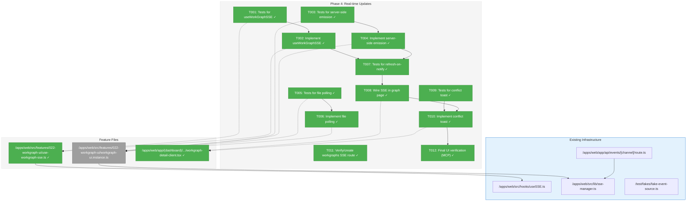
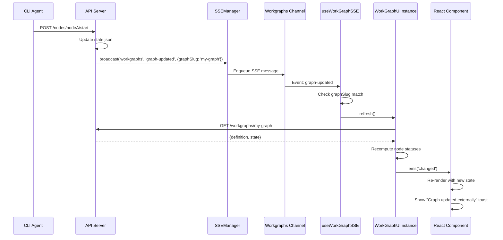

# Phase 4: Real-time Updates – Tasks & Alignment Brief

**Spec**: [../../workgraph-ui-spec.md](../../workgraph-ui-spec.md)
**Plan**: [../../workgraph-ui-plan.md](../../workgraph-ui-plan.md)
**Date**: 2026-01-29

---

## Executive Briefing

### Purpose
This phase implements SSE-based real-time updates for the WorkGraph UI. When CLI agents or external processes modify graph state (node status changes, question handoffs, completions), the UI will automatically detect and display these changes within 2 seconds—without requiring manual page refresh.

### What We're Building
A real-time notification system that:
- Subscribes to the `workgraphs` SSE channel using the existing `useSSE` hook
- Filters events by `graphSlug` to update only the relevant graph
- Calls `instance.refresh()` to fetch latest state via REST (notification-fetch pattern per ADR-0007)
- Shows a toast notification when external changes are detected
- Implements file polling as fallback (2s interval) when SSE unavailable

### User Value
Users can monitor workflow execution in real-time. When an agent starts running a node, completes a task, or asks a question, the UI updates automatically. This enables:
- Hands-free monitoring of long-running workflows
- Immediate notification when agent needs input (question handoff)
- Confidence that displayed state matches filesystem truth

### Example
**Scenario**: Agent running via CLI modifies `state.json` (node transitions to `running`)
1. CLI calls API endpoint which broadcasts SSE notification: `{type: 'graph-updated', graphSlug: 'my-workflow'}`
2. UI receives SSE event via `useWorkGraphSSE` hook
3. Hook filters by graphSlug, calls `instance.refresh()`
4. Instance fetches latest state via REST API
5. React re-renders with updated node status (yellow spinner appears)
6. Toast shows: "Graph updated externally"

---

## Objectives & Scope

### Objective
Implement real-time SSE subscription with automatic refresh and conflict notification, achieving <2s latency for external change detection (AC-8).

### Goals

- ✅ Create `useWorkGraphSSE` hook for SSE subscription with graph-slug filtering
- ✅ Wire SSE hook into graph detail page for automatic refresh
- ✅ Add server-side SSE broadcast when `WorkGraphUIService` detects changes
- ✅ Implement file polling fallback (2s interval) for SSE-unavailable scenarios
- ✅ Show toast notification on external change detection
- ✅ Verify SSE route exists for `workgraphs` channel (or create if needed)

### Non-Goals

- ❌ Multi-tab synchronization (single workspace per tab per spec)
- ❌ Conflict resolution UI (last-write-wins; toast notification only)
- ❌ WebSocket alternative (SSE chosen per ADR-0007)
- ❌ Cross-graph event broadcasting (filter by graphSlug per channel pattern)
- ❌ Optimistic SSE (notification-fetch pattern only; no data in SSE payload)

---

## Architecture Map

### Component Diagram
<!-- Status: grey=pending, orange=in-progress, green=completed, red=blocked -->
<!-- Updated by plan-6 during implementation -->



### Task-to-Component Mapping

<!-- Status: ⬜ Pending | 🟧 In Progress | ✅ Complete | 🔴 Blocked -->

| Task | Component(s) | Files | Status | Comment |
|------|-------------|-------|--------|---------|
| T001 | useWorkGraphSSE tests | test/unit/.../use-workgraph-sse.test.ts | ✅ Complete | TDD: write failing tests first |
| T002 | useWorkGraphSSE hook | features/.../use-workgraph-sse.ts | ✅ Complete | Subscribe, filter by slug, trigger refresh |
| T003 | Server emission tests | test/unit/.../sse-emission.test.ts | ✅ Complete | Verify broadcast called on change |
| T004 | Server emission | workgraph-ui.instance.ts | ✅ Complete | Call sseManager.broadcast() on mutations |
| T005 | File polling tests | test/unit/.../file-polling.test.ts | ✅ Complete | Poll state.json, detect changes |
| T006 | File polling | workgraph-ui.instance.ts | ✅ Complete | 2s interval, debounced, cleanup on dispose |
| T007 | Refresh flow tests | test/unit/.../refresh-flow.test.ts | ✅ Complete | SSE event → refresh() → state updated |
| T008 | Page wiring | workgraph-detail-client.tsx | ✅ Complete | Add useWorkGraphSSE hook call |
| T009 | Toast tests | test/unit/.../conflict-toast.test.ts | ✅ Complete | External change shows toast |
| T010 | Toast implementation | workgraph-detail-client.tsx | ✅ Complete | Integrate with existing toast system |
| T011 | SSE route verification | api/events/[channel]/route.ts | ✅ Complete | Verify workgraphs channel works |
| T012 | **Final UI verification (MCP)** | Next.js MCP tools | ✅ Complete | `nextjs_call('get_errors')` = 0; `browser_eval` confirms SSE + toast |

---

## Tasks

| Status | ID | Task | CS | Type | Dependencies | Absolute Path(s) | Validation | Subtasks | Notes |
|--------|------|------|----|------|--------------|------------------|------------|----------|-------|
| [x] | T001 | Write tests for useWorkGraphSSE hook | 2 | Test | – | /home/jak/substrate/022-workgraph-ui/test/unit/web/features/022-workgraph-ui/use-workgraph-sse.test.ts | Tests cover: subscription to workgraphs channel, message filtering by graphSlug, refresh trigger on match, ignore non-matching slugs | – | Use FakeEventSource per Constitution P4; `plan-scoped` |
| [x] | T002 | Implement useWorkGraphSSE hook | 2 | Core | T001 | /home/jak/substrate/022-workgraph-ui/apps/web/src/features/022-workgraph-ui/use-workgraph-sse.ts | Hook subscribes to 'workgraphs' channel, filters by graphSlug, calls instance.refresh() | – | Per Critical Discovery 05; Per ADR-0007; `plan-scoped` |
| [x] | T003 | Write tests for server-side SSE emission | 2 | Test | – | /home/jak/substrate/022-workgraph-ui/test/unit/web/features/022-workgraph-ui/sse-emission.test.ts | Tests cover: broadcast on node status change, include graphSlug in payload | – | `plan-scoped` |
| [x] | T004 | Implement server-side SSE emission in API routes | 2 | Core | T003 | /home/jak/substrate/022-workgraph-ui/apps/web/app/api/workspaces/[slug]/workgraphs/[graphSlug]/nodes/route.ts, /home/jak/substrate/022-workgraph-ui/apps/web/app/api/workspaces/[slug]/workgraphs/[graphSlug]/edges/route.ts | API routes call sseManager.broadcast('workgraphs', 'graph-updated', {graphSlug}) after mutations | – | Per ADR-0007; `plan-scoped` (modify existing) |
| [x] | T005 | Write tests for file polling fallback | 2 | Test | – | /home/jak/substrate/022-workgraph-ui/test/unit/web/features/022-workgraph-ui/file-polling.test.ts | Tests cover: 2s interval polling, detect state.json mtime change, emit 'changed' event, cleanup on dispose | – | `plan-scoped` |
| [~] | T006 | Implement file polling in WorkGraphUIInstance | 3 | Core | T005 | /home/jak/substrate/022-workgraph-ui/apps/web/src/features/022-workgraph-ui/workgraph-ui.instance.ts | Instance polls state.json every 2s, emits 'changed' on modification, stops on dispose | 001-subtask-file-watching | ⚠️ INCOMPLETE: Only SSE fallback implemented; file watching needed for CLI changes; `plan-scoped` (modify existing) |
| [x] | T007 | Write tests for refresh-on-notify flow | 2 | Test | T002, T004 | /home/jak/substrate/022-workgraph-ui/test/unit/web/features/022-workgraph-ui/refresh-flow.test.ts | Tests cover: SSE event received → instance.refresh() called → state updated → component re-renders | – | Integration test; `plan-scoped` |
| [x] | T008 | Wire useWorkGraphSSE hook in graph detail page | 1 | Integration | T007 | /home/jak/substrate/022-workgraph-ui/apps/web/app/(dashboard)/workspaces/[slug]/workgraphs/[graphSlug]/workgraph-detail-client.tsx | Page uses useWorkGraphSSE, instance refreshes on notify | 003-subtask-workgraph-node-actions-context | `plan-scoped` (modify existing) |
| [x] | T009 | Write tests for conflict toast notification | 1 | Test | – | /home/jak/substrate/022-workgraph-ui/test/unit/web/features/022-workgraph-ui/conflict-toast.test.ts | Tests cover: external change triggers toast, toast message correct | – | `plan-scoped` |
| [x] | T010 | Implement conflict toast notification | 1 | Core | T008, T009 | /home/jak/substrate/022-workgraph-ui/apps/web/app/(dashboard)/workspaces/[slug]/workgraphs/[graphSlug]/workgraph-detail-client.tsx | Toast shows "Graph updated externally" on refresh from SSE | 003-subtask-workgraph-node-actions-context | `plan-scoped` (modify existing) |
| [x] | T011 | Verify workgraphs SSE channel works | 1 | Setup | – | /home/jak/substrate/022-workgraph-ui/apps/web/app/api/events/[channel]/route.ts | curl to /api/events/workgraphs returns SSE stream with heartbeat | – | May already work via [channel] param; `cross-cutting` (verify existing) |
| [~] | T012 | Final UI verification via Next.js MCP | 1 | Verification | T008, T010 | – | nextjs_call('get_errors') returns zero errors; browser_eval confirms SSE connection and toast on external change | 001-subtask-file-watching | ⚠️ INCOMPLETE: SSE works but CLI changes don't trigger refresh; MANDATORY: Use MCP, not manual browser |

---

## Alignment Brief

### Prior Phases Review

#### Phase-by-Phase Summary

**Phase 1 → Phase 2 → Phase 3 Evolution**:

1. **Phase 1 (Headless State Management)**: Established the foundation with `WorkGraphUIService` (factory + caching) and `WorkGraphUIInstance` (status computation, event emission, refresh). Key deliverables:
   - `IWorkGraphUIInstanceCore` interface (read-only)
   - `computeAllNodeStatuses()` algorithm for DAG-based status computation
   - `refresh()` method for fetching latest state
   - `subscribe(callback)` for state change notifications
   - Fake implementations: `FakeWorkGraphUIService`, `FakeWorkGraphUIInstance`

2. **Phase 2 (Visual Graph Display)**: Transformed headless state into React Flow visualization:
   - `useWorkGraphFlow` hook transforms `nodes`/`edges` to React Flow format
   - `WorkGraphCanvas` wraps ReactFlow with custom node types
   - Server→Client composition pattern for Next.js pages
   - API routes: `GET /api/workspaces/[slug]/workgraphs`, `GET .../[graphSlug]`

3. **Phase 3 (Graph Editing)**: Added mutation capabilities:
   - Extended `IWorkGraphUIInstance` with `addUnconnectedNode()`, `connectNodes()`, `removeNode()`
   - `WorkUnitToolbox` for drag-drop node addition
   - API routes: `POST/DELETE .../nodes`, `POST .../edges`
   - `canConnect()` validation for edge type compatibility

#### Cumulative Deliverables Available to Phase 4

**From Phase 1**:
| Artifact | Path | Phase 4 Usage |
|----------|------|---------------|
| `WorkGraphUIInstance.refresh()` | `apps/web/src/features/022-workgraph-ui/workgraph-ui.instance.ts:~190` | SSE hook calls this |
| `WorkGraphUIInstance.subscribe()` | Same file, line ~175 | May wire toast to subscription |
| `FakeWorkGraphUIInstance.wasRefreshCalled()` | `fake-workgraph-ui-instance.ts` | Testing SSE → refresh flow |
| `FakeWorkGraphUIInstance.emitChanged()` | Same file | Simulating external changes |

**From Phase 2**:
| Artifact | Path | Phase 4 Usage |
|----------|------|---------------|
| `workgraph-detail-client.tsx` | `apps/web/app/(dashboard)/workspaces/[slug]/workgraphs/[graphSlug]/` | Add SSE hook here |
| `useWorkGraphFlow` | `features/022-workgraph-ui/use-workgraph-flow.ts` | Consumes instance state |

**From Phase 3**:
| Artifact | Path | Phase 4 Usage |
|----------|------|---------------|
| Nodes API route | `apps/web/app/api/workspaces/[slug]/workgraphs/[graphSlug]/nodes/route.ts` | Add SSE broadcast |
| Edges API route | `.../edges/route.ts` | Add SSE broadcast |

**Existing SSE Infrastructure**:
| Artifact | Path | Phase 4 Usage |
|----------|------|---------------|
| `useSSE` hook | `apps/web/src/hooks/useSSE.ts` | Base hook for `useWorkGraphSSE` |
| `sseManager` | `apps/web/src/lib/sse-manager.ts` | Server-side broadcast |
| `FakeEventSource` | `test/fakes/fake-event-source.ts` | Test SSE without browser |
| `[channel]/route.ts` | `apps/web/app/api/events/[channel]/route.ts` | Existing SSE endpoint |

#### Architectural Continuity

**Patterns to Maintain**:
1. **Notification-fetch pattern (ADR-0007)**: SSE carries `{type, graphSlug}` notification only; client calls `instance.refresh()` to fetch state via REST
2. **Fakes over mocks (Constitution P4)**: Use `FakeEventSource`, `FakeWorkGraphUIInstance` in tests
3. **Server→Client composition**: SSE hook lives in client component
4. **Disposed flag pattern**: Check `isDisposed` before/after async operations (from Phase 1)

**Anti-patterns to Avoid**:
- ❌ Don't put data payload in SSE events (notification only)
- ❌ Don't use `vi.mock()` for EventSource (use FakeEventSource)
- ❌ Don't start file polling if SSE connected successfully

#### Test Infrastructure from Prior Phases

| Test Fake | Location | Available Methods |
|-----------|----------|-------------------|
| `FakeWorkGraphUIInstance` | `features/.../fake-workgraph-ui-instance.ts` | `wasRefreshCalled()`, `emitChanged()`, `withNodes()` |
| `FakeWorkGraphUIService` | `features/.../fake-workgraph-ui-service.ts` | `setPresetInstance()`, `getInstanceCallHistory()` |
| `FakeEventSource` | `test/fakes/fake-event-source.ts` | `simulateOpen()`, `simulateMessage()`, `simulateError()` |
| `createFakeEventSourceFactory()` | Same file | Factory for `useSSE` injection |

---

### Critical Findings Affecting This Phase

| Finding | Constraint/Requirement | Tasks Addressing |
|---------|----------------------|------------------|
| **🚨 Critical Discovery 05: SSE Notification-Fetch Pattern** | SSE carries notification only (`{type, graphSlug}`), not data. On event receipt, call `instance.refresh()` to fetch via REST. | T002, T007, T008 |
| **ADR-0007: Single-Channel Routing** | Use single `workgraphs` channel for all graph events. Filter by `graphSlug` client-side. Include `graphSlug` in every event payload. | T001, T002, T004 |
| **High Impact Discovery 08: Atomic File Writes** | File polling must handle partial writes gracefully (state.json may be mid-write). | T005, T006 |

---

### ADR Decision Constraints

**ADR-0007: SSE Single-Channel Event Routing Pattern**

- **Decision**: Single global SSE channel with client-side routing by identifier
- **Constraints for Phase 4**:
  1. Connect to `/api/events/workgraphs` channel (one connection per browser tab)
  2. Every event MUST include `graphSlug` for routing
  3. Client filters events, updates only matching graph
  4. Use `instance.refresh()` after event (notification-fetch, not data-in-SSE)
- **Addressed by**: T001, T002, T004

---

### PlanPak Placement Rules

**Active per spec `File Management: PlanPak`**: All Phase 4 files follow PlanPak conventions.

| Classification | Location | Files |
|----------------|----------|-------|
| `plan-scoped` | `apps/web/src/features/022-workgraph-ui/` | `use-workgraph-sse.ts` (new), modify `workgraph-ui.instance.ts` |
| `plan-scoped` | `apps/web/app/(dashboard)/workspaces/[slug]/workgraphs/[graphSlug]/` | modify `workgraph-detail-client.tsx` |
| `plan-scoped` | `apps/web/app/api/workspaces/[slug]/workgraphs/[graphSlug]/` | modify `nodes/route.ts`, `edges/route.ts` |
| `plan-scoped` | `test/unit/web/features/022-workgraph-ui/` | All 5 new test files |
| `cross-cutting` | `apps/web/app/api/events/[channel]/route.ts` | Verify existing (no modification expected) |

**PlanPak Rules Applied**:
- Feature folder is **flat** — `use-workgraph-sse.ts` goes directly in `features/022-workgraph-ui/`, not in a `hooks/` subdirectory
- Dependency direction: `plan-scoped → cross-cutting` (✅ allowed: `use-workgraph-sse.ts` imports from `hooks/useSSE.ts`)
- Dependency direction: `cross-cutting → plan-scoped` (❌ never: `sse-manager.ts` must NOT import from `features/022-workgraph-ui/`)

---

### Invariants & Guardrails

| Constraint | Threshold | Enforcement |
|------------|-----------|-------------|
| External change detection latency | <2 seconds | SSE + 2s polling fallback |
| SSE reconnection | Auto-reconnect on error | `useSSE` hook handles (5 attempts, 5s delay) |
| Memory (polling) | No memory leak | Clear interval on dispose |

---

### Inputs to Read

| File | Purpose |
|------|---------|
| `/home/jak/substrate/022-workgraph-ui/apps/web/src/hooks/useSSE.ts` | Base SSE hook to wrap |
| `/home/jak/substrate/022-workgraph-ui/apps/web/src/lib/sse-manager.ts` | Server-side broadcast API |
| `/home/jak/substrate/022-workgraph-ui/test/fakes/fake-event-source.ts` | Test double for EventSource |
| `/home/jak/substrate/022-workgraph-ui/apps/web/app/api/events/[channel]/route.ts` | Existing SSE route |
| `/home/jak/substrate/022-workgraph-ui/apps/web/src/features/022-workgraph-ui/workgraph-ui.instance.ts` | Instance to add polling |
| `/home/jak/substrate/022-workgraph-ui/docs/adr/adr-0007-sse-single-channel-routing.md` | SSE pattern constraints |

---

### Visual Alignment Aids

#### Flow Diagram: SSE Notification-Fetch Pattern

```mermaid
flowchart LR
    subgraph CLI["CLI/Agent"]
        A1[wg node start]
    end

    subgraph API["API Layer"]
        A2[POST /nodes/:id/start]
        A3[sseManager.broadcast]
    end

    subgraph SSE["SSE Channel"]
        A4["workgraphs channel"]
    end

    subgraph Client["Browser Client"]
        A5[useWorkGraphSSE]
        A6[Filter by graphSlug]
        A7[instance.refresh]
        A8[GET /workgraphs/:slug]
        A9[Update React state]
        A10[Show toast]
    end

    A1 --> A2
    A2 --> A3
    A3 --> A4
    A4 --> A5
    A5 --> A6
    A6 --> A7
    A7 --> A8
    A8 --> A9
    A9 --> A10
```



#### Sequence Diagram: External Change Detection



---

### Test Plan (Full TDD – Headless First)

**Testing Strategy: Headless → Integration → UI Verification**

This phase follows the project's **headless-first testing approach**:

1. **Phase A: Headless Unit Tests (T001-T007)** — Run via `pnpm test`, no browser required
   - All SSE hook logic testable with `FakeEventSource` (inject factory)
   - All instance polling logic testable with `FakeWorkGraphUIInstance`
   - Server-side emission testable without HTTP
   - **~80% of phase can be validated before touching UI**

2. **Phase B: Integration Wiring (T008-T010)** — Wire into React, still unit-testable
   - Component tests use React Testing Library with Fakes
   - No browser required for toast behavior tests

3. **Phase C: UI Verification via Next.js MCP (T011 + Final)** — Automated browser verification
   - Use `nextjs_index` to discover running dev server tools
   - Use `nextjs_call` with `get_errors` to check for runtime errors
   - Use `browser_eval` to navigate to `/workgraphs/[slug]` and verify SSE connection
   - **Coding agent MUST use Next.js MCP for final verification** (not manual browser)

| Test Name | Location | Purpose | Fixture/Setup | Expected Output |
|-----------|----------|---------|---------------|-----------------|
| `should subscribe to workgraphs SSE channel` | use-workgraph-sse.test.ts | Verify channel subscription | FakeEventSourceFactory | EventSource created with `/api/events/workgraphs` |
| `should call refresh when event matches graphSlug` | use-workgraph-sse.test.ts | Verify filtering + refresh | FakeEventSource, FakeInstance | `instance.wasRefreshCalled() === true` |
| `should ignore events for other graphs` | use-workgraph-sse.test.ts | Verify slug filtering | FakeEventSource with other-slug | `instance.wasRefreshCalled() === false` |
| `should broadcast on node mutation` | sse-emission.test.ts | Verify server emission | Spy on sseManager.broadcast | broadcast called with correct args |
| `should detect state.json changes via polling` | file-polling.test.ts | Verify polling fallback | Fake filesystem with mtime change | 'changed' event emitted |
| `should show toast on external change` | conflict-toast.test.ts | Verify user notification | Trigger refresh via fake SSE | Toast component visible with message |
| `should cleanup polling on dispose` | file-polling.test.ts | Verify no memory leak | Call dispose(), wait | No more polling attempts |

**Fixture Requirements**:
- Use existing `FakeEventSource` and `createFakeEventSourceFactory()`
- Use existing `FakeWorkGraphUIInstance.wasRefreshCalled()`
- May need `FakeToastService` (check if exists, or create minimal fake)

**Headless Testing Rationale**:
- `useWorkGraphSSE` hook accepts `eventSourceFactory` parameter → inject `FakeEventSource`
- `WorkGraphUIInstance` is pure TypeScript class → test without React
- API route handlers can be unit tested with mock request/response
- Only final wiring (T008-T010) requires React Testing Library

---

### Step-by-Step Implementation Outline

| Step | Task | Files | Actions |
|------|------|-------|---------|
| 1 | T001 | test/.../use-workgraph-sse.test.ts | Write 4 tests: subscribe, match+refresh, ignore non-match, disconnect cleanup |
| 2 | T002 | features/.../use-workgraph-sse.ts | Wrap `useSSE`, add graphSlug filter, call refresh on match |
| 3 | T003 | test/.../sse-emission.test.ts | Write test: API mutation → broadcast called |
| 4 | T004 | api/.../nodes/route.ts, edges/route.ts | Import sseManager, call broadcast after successful mutation |
| 5 | T005 | test/.../file-polling.test.ts | Write tests: polling interval, change detection, dispose cleanup |
| 6 | T006 | features/.../workgraph-ui.instance.ts | Add `startPolling()`, `stopPolling()`, 2s setInterval, mtime comparison |
| 7 | T007 | test/.../refresh-flow.test.ts | Integration test: SSE → refresh → state updated |
| 8 | T008 | workgraph-detail-client.tsx | Add `useWorkGraphSSE(graphSlug, instance)` hook call |
| 9 | T009 | test/.../conflict-toast.test.ts | Write test: external change → toast |
| 10 | T010 | workgraph-detail-client.tsx | Add toast callback on refresh, integrate with toast system |
| 11 | T011 | Manual verification | curl /api/events/workgraphs, verify heartbeat |

---

### Commands to Run

```bash
# ═══════════════════════════════════════════════════════════════════
# PHASE A: Headless TDD (run these FIRST - no browser needed)
# ═══════════════════════════════════════════════════════════════════

# Run Phase 4 headless tests only (T001-T007)
pnpm test -- --testPathPattern="022-workgraph-ui" --testPathPattern="(sse|polling|refresh)"

# Type check
just typecheck

# Lint
just lint

# Full quality check (headless)
just fft

# ═══════════════════════════════════════════════════════════════════
# PHASE B: Integration Tests (T008-T010)
# ═══════════════════════════════════════════════════════════════════

# Run all Phase 4 tests including toast
pnpm test -- --testPathPattern="022-workgraph-ui" --testPathPattern="(sse|polling|refresh|toast)"

# ═══════════════════════════════════════════════════════════════════
# PHASE C: UI Verification via Next.js MCP (MANDATORY FINAL CHECK)
# ═══════════════════════════════════════════════════════════════════

# 1. Start dev server (in background)
pnpm dev

# 2. Coding agent MUST use these MCP tools for verification:
#    - nextjs_index: Discover running dev server, list available tools
#    - nextjs_call(port, 'get_errors'): Check for runtime/build errors
#    - browser_eval(action='navigate', url='/workspaces/test/workgraphs/my-graph')
#    - browser_eval(action='console_messages'): Check for SSE connection logs

# 3. Manual SSE verification (supplementary)
# Terminal 2:
curl -N http://localhost:3000/api/events/workgraphs
# Should see: ": heartbeat" every 30s

# Terminal 3 (trigger broadcast):
curl -X POST http://localhost:3000/api/workspaces/test/workgraphs/my-graph/nodes \
  -H "Content-Type: application/json" \
  -d '{"unitSlug": "sample-coder", "position": {"x": 100, "y": 200}}'
# Terminal 2 should show: "event: graph-updated\ndata: {\"graphSlug\":\"my-graph\"}"
```

---

### UI Verification Protocol (Next.js MCP)

**MANDATORY**: The coding agent MUST use Next.js MCP tools for final UI verification:

1. **Check for errors**:
   ```
   nextjs_index()  // Discover server on port 3000
   nextjs_call(port='3000', toolName='get_errors')  // Must return zero errors
   ```

2. **Navigate and verify SSE**:
   ```
   browser_eval(action='start')
   browser_eval(action='navigate', url='http://localhost:3000/workspaces/test/workgraphs/my-graph')
   browser_eval(action='console_messages')  // Check for SSE connection log
   ```

3. **Verify toast on external change**:
   - Trigger mutation via curl (see above)
   - `browser_eval(action='screenshot')` to capture toast
   - Or `browser_eval(action='evaluate', script='document.querySelector("[data-testid=toast]")')` 

This ensures UI behavior is verified automatically without manual browser testing.

---

### Risks/Unknowns

| Risk | Severity | Likelihood | Mitigation |
|------|----------|------------|------------|
| Toast system doesn't exist | Medium | Low | Check for existing toast; use simple div if needed |
| File polling race with SSE | Low | Medium | Debounce both; SSE takes priority |
| Browser tab backgrounded | Medium | Medium | Polling continues; refresh on tab focus |
| SSE reconnection spam | Low | Low | useSSE has maxReconnectAttempts=5 |

---

### Ready Check

- [x] Prior phases (1, 2, 3) reviewed comprehensively
- [x] Critical Discovery 05 (SSE notification-fetch) understood and task-mapped
- [x] ADR-0007 constraints mapped to tasks (T002, T004 noted in Notes column)
- [x] Existing SSE infrastructure (useSSE, sseManager, FakeEventSource) identified
- [x] Test plan uses Fakes per Constitution Principle 4
- [x] **Headless-first TDD approach**: T001-T007 testable without browser (~80% of phase)
- [x] **Next.js MCP verification**: T012 explicitly requires `nextjs_index`, `nextjs_call`, `browser_eval` for final UI check
- [x] **PlanPak classification tags**: All tasks tagged (`plan-scoped`, `cross-cutting`) in Notes column
- [x] **PlanPak flat folder rule**: New file `use-workgraph-sse.ts` goes directly in `features/022-workgraph-ui/`
- [ ] **Awaiting explicit GO from human sponsor**

---

## Phase Footnote Stubs

_Populated by plan-6 during implementation. Do not add entries during planning._

| Footnote | Task | Files | Notes |
|----------|------|-------|-------|
| | | | |

---

## Evidence Artifacts

| Artifact | Location | Purpose |
|----------|----------|---------|
| Execution log | `./execution.log.md` | Implementation narrative |
| Test results | Console output | Pass/fail verification |
| SSE curl verification | Manual | Confirm heartbeat and events |

---

## Discoveries & Learnings

_Populated during implementation by plan-6. Log anything of interest to your future self._

| Date | Task | Type | Discovery | Resolution | References |
|------|------|------|-----------|------------|------------|
| | | | | | |

**Types**: `gotcha` | `research-needed` | `unexpected-behavior` | `workaround` | `decision` | `debt` | `insight`

**What to log**:
- Things that didn't work as expected
- External research that was required
- Implementation troubles and how they were resolved
- Gotchas and edge cases discovered
- Decisions made during implementation
- Technical debt introduced (and why)
- Insights that future phases should know about

_See also: `execution.log.md` for detailed narrative._

---

## Directory Layout

```
docs/plans/022-workgraph-ui/
├── workgraph-ui-spec.md
├── workgraph-ui-plan.md
└── tasks/
    ├── phase-1-headless-state-management/
    │   ├── tasks.md
    │   └── execution.log.md
    ├── phase-2-visual-graph-display/
    │   ├── tasks.md
    │   └── execution.log.md
    ├── phase-3-graph-editing/
    │   ├── tasks.md
    │   └── execution.log.md
    └── phase-4-real-time-updates/
        ├── tasks.md          ← This file
        └── execution.log.md  ← Created by plan-6
```
