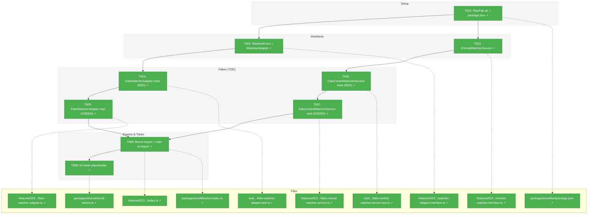
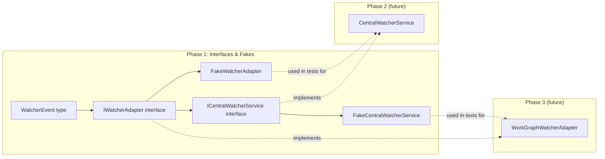
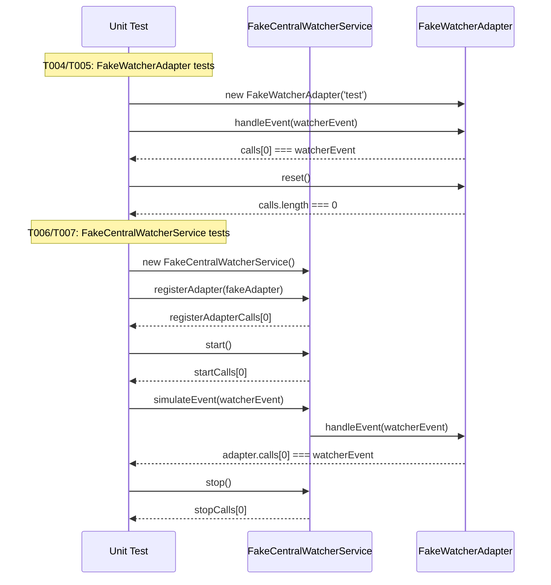

# Phase 1: Interfaces & Fakes – Tasks & Alignment Brief

**Spec**: [../../central-watcher-notifications-spec.md](../../central-watcher-notifications-spec.md)
**Plan**: [../../central-watcher-notifications-plan.md](../../central-watcher-notifications-plan.md)
**Date**: 2026-01-31

---

## Executive Briefing

### Purpose
This phase defines the complete type surface (interfaces, event types, fakes) that all subsequent phases depend on. It is the foundational layer: no implementation logic, no domain knowledge, no runtime behavior beyond fakes. Every later phase (2–5) imports from what Phase 1 creates.

### What We're Building
- `ICentralWatcherService` interface — contract for the domain-agnostic watcher service
- `IWatcherAdapter` interface + `WatcherEvent` type — contract for domain-specific adapters that self-filter raw filesystem events
- `FakeWatcherAdapter` — test fake with call tracking for Phase 2 dispatch tests
- `FakeCentralWatcherService` — test fake with lifecycle tracking, `simulateEvent()` for Phase 3 adapter tests
- Feature barrel export + PlanPak directory + `package.json` exports entry
- Reserved DI token placeholder for future SSE integration

### User Value
Establishes the extension point architecture: any future domain (agents, samples) can plug into file-change notifications by implementing `IWatcherAdapter` — without touching core watcher code.

### Example
```typescript
// Phase 2+ will use these interfaces:
const service: ICentralWatcherService = new CentralWatcherService(/*...*/);
const adapter: IWatcherAdapter = new WorkGraphWatcherAdapter();
service.registerAdapter(adapter);
await service.start();
// File events flow: chokidar → service → adapter.handleEvent(WatcherEvent)

// Phase 2+ tests will use these fakes:
const fakeAdapter = new FakeWatcherAdapter('test');
service.registerAdapter(fakeAdapter);
// ... trigger event ...
expect(fakeAdapter.calls).toHaveLength(1);
expect(fakeAdapter.calls[0].eventType).toBe('change');
```

---

## Objectives & Scope

### Objective
Define the complete type surface (interfaces, events, fakes) for the central watcher notification system, enabling TDD in all subsequent phases.

### Goals

- ✅ Define `WatcherEvent` type with `path`, `eventType`, `worktreePath`, `workspaceSlug`
- ✅ Define `IWatcherAdapter` interface with `name` and `handleEvent(event: WatcherEvent): void`
- ✅ Define `ICentralWatcherService` interface with `start()`, `stop()`, `isWatching()`, `rescan()`, `registerAdapter()`
- ✅ Implement `FakeWatcherAdapter` with call tracking (`calls[]`, `reset()`)
- ✅ Implement `FakeCentralWatcherService` with lifecycle tracking and `simulateEvent()` broadcast
- ✅ TDD: write failing tests FIRST for both fakes
- ✅ Create PlanPak feature directory and `package.json` exports entry
- ✅ Create feature barrel export and update main `index.ts` re-exports
- ✅ Add reserved DI token to `WORKSPACE_DI_TOKENS`

### Non-Goals

- ❌ Service implementation logic (Phase 2)
- ❌ WorkGraphWatcherAdapter implementation (Phase 3)
- ❌ Integration tests with real chokidar (Phase 4)
- ❌ Removal of old service/interface/fake/tests (Phase 5)
- ❌ DI container registration (NG2 — future SSE plan)
- ❌ Modifications to old barrel exports (`interfaces/index.ts`, `fakes/index.ts`, `services/index.ts`) — old exports stay until Phase 5
- ❌ Any domain-specific imports (workgraph, agent, sample) in new interface files

---

## Flight Plan

### Summary Table

| File | Action | Origin | Modified By | Recommendation |
|------|--------|--------|-------------|----------------|
| `packages/workflow/src/features/023-central-watcher-notifications/` | Created | Plan 023 | — | keep-as-is |
| `.../watcher-adapter.interface.ts` | Created | Plan 023 T002 | — | keep-as-is |
| `.../central-watcher.interface.ts` | Created | Plan 023 T003 | — | keep-as-is |
| `.../fake-watcher-adapter.ts` | Created | Plan 023 T005 | — | keep-as-is |
| `.../fake-central-watcher.service.ts` | Created | Plan 023 T007 | — | keep-as-is |
| `.../index.ts` | Created | Plan 023 T008 | — | keep-as-is |
| `packages/workflow/src/index.ts` | Modified | Plan 022 P4 | Plan 023 T008 | keep-as-is |
| `packages/workflow/package.json` | Modified | Plan 007/010 | Plan 023 T001 | keep-as-is |
| `packages/shared/src/di-tokens.ts` | Modified | Plan 014 P4 | Plan 023 T009 | keep-as-is |
| `test/unit/workflow/fake-watcher-adapter.test.ts` | Created | Plan 023 T004 | — | keep-as-is |
| `test/unit/workflow/fake-central-watcher.service.test.ts` | Created | Plan 023 T006 | — | keep-as-is |

### Compliance Check

No violations found. All files follow PlanPak placement rules, ADR-0004 token naming convention, and project idioms for interfaces/fakes/tests.

---

## Requirements Traceability

### Coverage Matrix

| AC | Description | Flow Summary | Files in Flow | Tasks | Status |
|----|-------------|--------------|---------------|-------|--------|
| AC2 | `registerAdapter()` before/after `start()` | Interface defines method signature → Fake tracks registration calls → Tests verify | central-watcher.interface.ts, fake-central-watcher.service.ts, test | T003, T006, T007 | ✅ Complete |
| AC3 | Events forwarded to ALL adapters | WatcherEvent type defined → FakeCentralWatcherService.simulateEvent() broadcasts → FakeWatcherAdapter records | watcher-adapter.interface.ts, fake-watcher-adapter.ts, fake-central-watcher.service.ts, tests | T002, T004, T005, T006, T007 | ✅ Complete |
| AC4 | Adapters self-filter raw events | IWatcherAdapter.handleEvent(WatcherEvent) contract → Adapter receives ALL events → Fake shows pattern | watcher-adapter.interface.ts, fake-watcher-adapter.ts, test | T002, T004, T005 | ✅ Complete |
| AC10 | Tests use fakes, no vi.fn() | Test files import fakes, create instances, use call tracking | test files | T004, T006 | ✅ Complete |
| AC12 | No domain-specific imports | Interfaces import only from shared types (FileWatcherEvent) | interface files | T002, T003 | ✅ Complete |

### Gaps Found

No gaps — all Phase 1 acceptance criteria have complete file coverage.

### Orphan Files

| File | Tasks | Assessment |
|------|-------|------------|
| `packages/workflow/package.json` | T001 | Infrastructure — enables `@chainglass/workflow/features/023-...` import path |
| `packages/shared/src/di-tokens.ts` | T009 | Infrastructure — reserved token placeholder for future phases |

---

## Architecture Map

### Component Diagram

<!-- Status: grey=pending, orange=in-progress, green=completed, red=blocked -->
<!-- Updated by plan-6 during implementation -->



### Task-to-Component Mapping

<!-- Status: ⬜ Pending | 🟧 In Progress | ✅ Complete | 🔴 Blocked -->

| Task | Component(s) | Files | Status | Comment |
|------|-------------|-------|--------|---------|
| T001 | PlanPak Setup | `package.json`, feature dir | ✅ Complete | Create directory + exports entry |
| T002 | WatcherEvent + IWatcherAdapter | `watcher-adapter.interface.ts` | ✅ Complete | Event type + adapter interface |
| T003 | ICentralWatcherService | `central-watcher.interface.ts` | ✅ Complete | Service interface |
| T004 | FakeWatcherAdapter Tests | `fake-watcher-adapter.test.ts` | ✅ Complete | TDD RED phase |
| T005 | FakeWatcherAdapter Impl | `fake-watcher-adapter.ts` | ✅ Complete | TDD GREEN phase |
| T006 | FakeCentralWatcherService Tests | `fake-central-watcher.service.test.ts` | ✅ Complete | TDD RED phase |
| T007 | FakeCentralWatcherService Impl | `fake-central-watcher.service.ts` | ✅ Complete | TDD GREEN phase |
| T008 | Barrel Exports | `index.ts` (feature + main) | ✅ Complete | Wire all exports |
| T009 | DI Token | `di-tokens.ts` | ✅ Complete | Reserved placeholder |

---

## Tasks

| Status | ID | Task | CS | Type | Dependencies | Absolute Path(s) | Validation | Subtasks | Notes |
|--------|------|------|-----|------|--------------|-------------------|------------|----------|-------|
| [x] | T001 | Create PlanPak feature directory and add `package.json` exports entry matching `packages/shared` precedent: `"./features/023-central-watcher-notifications": { "import": "...", "types": "..." }` | CS-1 | Setup | – | `/home/jak/substrate/023-central-watcher-notifications/packages/workflow/src/features/023-central-watcher-notifications/` (dir), `/home/jak/substrate/023-central-watcher-notifications/packages/workflow/package.json` | Directory exists; `package.json` exports entry present with correct `import` and `types` paths | – | [log#task-t001-create-planpak](execution.log.md#task-t001-create-planpak). Plan task ref: 1.0 |
| [x] | T002 | Define `WatcherEvent` type (`path: string`, `eventType: FileWatcherEvent`, `worktreePath: string`, `workspaceSlug: string`) and `IWatcherAdapter` interface (`name: string`, `handleEvent(event: WatcherEvent): void`). Import `FileWatcherEvent` from `../../../interfaces/file-watcher.interface.js` | CS-1 | Core | T001 | `/home/jak/substrate/023-central-watcher-notifications/packages/workflow/src/features/023-central-watcher-notifications/watcher-adapter.interface.ts` | Types compile; no domain-specific imports; `FileWatcherEvent` reused (not redefined) | – | [log#task-t002-define-watcher](execution.log.md#task-t002-define-watcher). Plan task ref: 1.1. Per Critical Finding 06 |
| [x] | T003 | Define `ICentralWatcherService` interface with methods: `start(): Promise<void>`, `stop(): Promise<void>`, `isWatching(): boolean`, `rescan(): Promise<void>`, `registerAdapter(adapter: IWatcherAdapter): void` | CS-1 | Core | T001 | `/home/jak/substrate/023-central-watcher-notifications/packages/workflow/src/features/023-central-watcher-notifications/central-watcher.interface.ts` | Types compile; no domain-specific imports; imports `IWatcherAdapter` from sibling | – | [log#task-t003-define-central](execution.log.md#task-t003-define-central). Plan task ref: 1.2 |
| [x] | T004 | Write failing tests for `FakeWatcherAdapter`: records `handleEvent()` calls with events in `calls` array; `name` property works; `reset()` clears calls. Use 5-field Test Doc comments. | CS-1 | Test | T002 | `/home/jak/substrate/023-central-watcher-notifications/test/unit/workflow/fake-watcher-adapter.test.ts` | Tests written, all FAIL (RED phase — no implementation yet) | – | [log#task-t004-fake-adapter-red](execution.log.md#task-t004-fake-adapter-red). Plan task ref: 1.3. TDD RED |
| [x] | T005 | Implement `FakeWatcherAdapter` to pass all tests from T004. Class implements `IWatcherAdapter` with: `name` property, `handleEvent()` that pushes to `calls: WatcherEvent[]`, `reset()` method | CS-1 | Core | T004 | `/home/jak/substrate/023-central-watcher-notifications/packages/workflow/src/features/023-central-watcher-notifications/fake-watcher-adapter.ts` | All T004 tests pass (GREEN phase) | – | [log#task-t005-fake-adapter-green](execution.log.md#task-t005-fake-adapter-green). Plan task ref: 1.4. TDD GREEN |
| [x] | T006 | Write failing tests for `FakeCentralWatcherService`: start/stop lifecycle tracking (`startCalls`, `stopCalls`), adapter registration tracking (`registerAdapterCalls`), `simulateEvent()` dispatches to all registered adapters, `isWatching()` state, configurable error injection. Use 5-field Test Doc comments. | CS-2 | Test | T003, T005 | `/home/jak/substrate/023-central-watcher-notifications/test/unit/workflow/fake-central-watcher.service.test.ts` | Tests written, all FAIL (RED phase — no implementation yet) | – | [log#task-t006-fake-service-red](execution.log.md#task-t006-fake-service-red). Plan task ref: 1.5. TDD RED |
| [x] | T007 | Implement `FakeCentralWatcherService` to pass all tests from T006. Class implements `ICentralWatcherService` with: call tracking types (`StartCall`, `StopCall`, `RegisterAdapterCall`), `simulateEvent(event: WatcherEvent)` that broadcasts to registered adapters, configurable start/stop errors | CS-2 | Core | T006 | `/home/jak/substrate/023-central-watcher-notifications/packages/workflow/src/features/023-central-watcher-notifications/fake-central-watcher.service.ts` | All T006 tests pass (GREEN phase) | – | [log#task-t007-fake-service-green](execution.log.md#task-t007-fake-service-green). Plan task ref: 1.6. TDD GREEN |
| [x] | T008 | Create feature barrel `index.ts` exporting all types: `WatcherEvent`, `IWatcherAdapter`, `ICentralWatcherService`, `FakeWatcherAdapter`, `FakeCentralWatcherService`, call tracking types. Update main `packages/workflow/src/index.ts` to re-export from feature barrel. | CS-1 | Core | T005, T007 | `/home/jak/substrate/023-central-watcher-notifications/packages/workflow/src/features/023-central-watcher-notifications/index.ts`, `/home/jak/substrate/023-central-watcher-notifications/packages/workflow/src/index.ts` | `just typecheck` passes; imports from `@chainglass/workflow` resolve all new types | – | [log#task-t008-barrel-export](execution.log.md#task-t008-barrel-export). Plan task ref: 1.7 |
| [x] | T009 | Add `CENTRAL_WATCHER_SERVICE: 'ICentralWatcherService'` to `WORKSPACE_DI_TOKENS` with JSDoc: `/** Reserved for future SSE integration plan */`. Token is NOT registered in any container. | CS-1 | Core | – | `/home/jak/substrate/023-central-watcher-notifications/packages/shared/src/di-tokens.ts` | Token exists in `WORKSPACE_DI_TOKENS`; `just typecheck` passes; no container registration | – | [log#task-t009-di-token](execution.log.md#task-t009-di-token). Plan task ref: 1.8. Per Critical Finding 10, ADR-0004 |

---

## Alignment Brief

### Critical Findings Affecting This Phase

| Finding | Title | Constraint/Requirement | Tasks |
|---------|-------|----------------------|-------|
| CF-05 | PlanPak `features/` Directory is New | Must create directory + `package.json` exports entry following `packages/shared` precedent | T001 |
| CF-06 | WatcherEvent as Object | Use single `WatcherEvent` object (not positional params); include `path`, `eventType` (reuse `FileWatcherEvent`), `worktreePath`, `workspaceSlug` | T002 |
| CF-08 | Service Should NOT Clear Adapters on Stop | `FakeCentralWatcherService.stop()` should NOT clear adapter set — informs fake design | T007 |
| CF-10 | Add DI Token for Future Use | Reserved placeholder `CENTRAL_WATCHER_SERVICE` in `WORKSPACE_DI_TOKENS`; NOT registered in any container (NG2) | T009 |

### ADR Decision Constraints

- **ADR-0004: DI Container Architecture** — Token naming convention: `CENTRAL_WATCHER_SERVICE: 'ICentralWatcherService'` (interface name as value). Constrains: T009. No `useFactory` registration in Phase 1 (deferred per NG2).
- **ADR-0008: Module Registration Function Pattern** — Future DI integration. No action in Phase 1; affects Phase 5 only.

### PlanPak Placement Rules

- **Plan-scoped files** → `packages/workflow/src/features/023-central-watcher-notifications/` (all interfaces, fakes, barrel)
- **Cross-cutting files** → `packages/shared/src/di-tokens.ts` (token), `packages/workflow/package.json` (exports), `packages/workflow/src/index.ts` (re-export)
- **Test location** → `test/unit/workflow/` (per project convention — tests are flat, not nested in features)
- **Dependency direction** → features → shared interfaces (allowed); shared → features (never)

### Invariants & Guardrails

- Zero domain-specific imports in interface files (AC12) — no workgraph, agent, sample references
- Fakes only — no `vi.fn()`, `vi.mock()`, `vi.spyOn()` in test files (AC10)
- Callback-set pattern for events — `Set<Callback>` with unsubscribe, NOT EventEmitter
- `FileWatcherEvent` type REUSED from existing interface, not redefined

### Inputs to Read

| File | Purpose |
|------|---------|
| `/home/jak/substrate/023-central-watcher-notifications/packages/workflow/src/interfaces/file-watcher.interface.ts` | `FileWatcherEvent` type definition to import |
| `/home/jak/substrate/023-central-watcher-notifications/packages/workflow/src/fakes/fake-file-watcher.ts` | Pattern reference for fake design (call tracking, simulation) |
| `/home/jak/substrate/023-central-watcher-notifications/packages/shared/src/di-tokens.ts` | Where to add DI token |
| `/home/jak/substrate/023-central-watcher-notifications/packages/workflow/package.json` | Where to add exports entry |
| `/home/jak/substrate/023-central-watcher-notifications/packages/workflow/src/index.ts` (lines 370-401) | Where to add re-exports |
| `/home/jak/substrate/023-central-watcher-notifications/packages/shared/package.json` (lines 28-31) | Precedent for feature exports format |

### Visual Alignment: Flow Diagram



### Visual Alignment: Sequence Diagram



### Test Plan (Full TDD — Fakes Only)

#### FakeWatcherAdapter Tests (`test/unit/workflow/fake-watcher-adapter.test.ts`)

| Test | Rationale | Expected |
|------|-----------|----------|
| `should record handleEvent calls` | Core fake contract: call tracking | `calls[0]` equals dispatched event |
| `should expose name property` | Adapter identity for debugging | `adapter.name === 'test-adapter'` |
| `should reset calls` | Test isolation between assertions | `calls.length === 0` after reset |
| `should record multiple calls in order` | Verify ordering preservation | `calls[0]`, `calls[1]` match dispatch order |

#### FakeCentralWatcherService Tests (`test/unit/workflow/fake-central-watcher.service.test.ts`)

| Test | Rationale | Expected |
|------|-----------|----------|
| `should track start() calls` | Lifecycle verification | `startCalls.length === 1` |
| `should track stop() calls` | Lifecycle verification | `stopCalls.length === 1` |
| `should track registerAdapter() calls` | Registration verification | `registerAdapterCalls[0].adapter === fakeAdapter` |
| `should track isWatching() state` | State after start/stop | `true` after start, `false` after stop |
| `should dispatch simulateEvent to all adapters` | Core broadcast contract | Both adapters receive identical event |
| `should preserve adapters after stop()` | Per CF-08 | Adapters still registered after stop |
| `should throw configurable error on start()` | Error injection for consumer tests | `service.start()` rejects with configured error |
| `should throw configurable error on stop()` | Error injection for consumer tests | `service.stop()` rejects with configured error |

### Step-by-Step Implementation Outline

1. **T001**: `mkdir -p` feature directory; edit `package.json` exports
2. **T002**: Write `watcher-adapter.interface.ts` — import `FileWatcherEvent`, define `WatcherEvent`, define `IWatcherAdapter`
3. **T003**: Write `central-watcher.interface.ts` — import `IWatcherAdapter`, define `ICentralWatcherService`
4. **T004**: Write `fake-watcher-adapter.test.ts` — RED (tests fail, no implementation)
5. **T005**: Write `fake-watcher-adapter.ts` — GREEN (tests pass)
6. **T006**: Write `fake-central-watcher.service.test.ts` — RED (tests fail)
7. **T007**: Write `fake-central-watcher.service.ts` — GREEN (tests pass)
8. **T008**: Write feature `index.ts` barrel; update main `index.ts` re-exports
9. **T009**: Add DI token to `WORKSPACE_DI_TOKENS`
10. **Validate**: `just typecheck && just test && just lint`

### Commands to Run

```bash
# After T001 — verify directory + exports
ls packages/workflow/src/features/023-central-watcher-notifications/

# After T004 (RED) — tests should FAIL
just test -- test/unit/workflow/fake-watcher-adapter.test.ts

# After T005 (GREEN) — tests should PASS
just test -- test/unit/workflow/fake-watcher-adapter.test.ts

# After T006 (RED) — tests should FAIL
just test -- test/unit/workflow/fake-central-watcher.service.test.ts

# After T007 (GREEN) — tests should PASS
just test -- test/unit/workflow/fake-central-watcher.service.test.ts

# After T008-T009 — full validation
just typecheck
just test
just lint

# Final check
just check
```

### Risks/Unknowns

| Risk | Severity | Mitigation |
|------|----------|------------|
| PlanPak export path doesn't resolve at runtime | Medium | Follow `packages/shared` precedent exactly; verify with `just typecheck` |
| Interface design insufficient for Phase 2-3 | Low | Research dossier + spec fully define the shape; CF-06 locks `WatcherEvent` |
| `FileWatcherEvent` import path from feature dir to interfaces dir | Low | Use relative import `../../../interfaces/file-watcher.interface.js` |

### Ready Check

- [ ] ADR-0004 constraint mapped to T009 (DI token naming)
- [ ] PlanPak directory structure confirmed (no existing `features/` in workflow)
- [ ] `FileWatcherEvent` type confirmed reusable from `file-watcher.interface.ts`
- [ ] FakeFileWatcher pattern confirmed as reference for fake design
- [ ] `packages/shared/package.json` lines 28-31 confirmed as exports entry precedent
- [ ] All test files follow flat `test/unit/workflow/` convention

**Awaiting GO/NO-GO**

---

## Phase Footnote Stubs

_To be populated by plan-6 during implementation._

| Footnote | Task | Description | Date |
|----------|------|-------------|------|
| | | | |

---

## Evidence Artifacts

- **Execution log**: `docs/plans/023-central-watcher-notifications/tasks/phase-1-interfaces-and-fakes/execution.log.md` (created by plan-6)
- **Test output**: Captured in execution log during RED/GREEN cycles

---

## Discoveries & Learnings

_Populated during implementation by plan-6. Log anything of interest to your future self._

| Date | Task | Type | Discovery | Resolution | References |
|------|------|------|-----------|------------|------------|
| 2026-01-31 | T005 | gotcha | Import path from `features/023-xxx/` to `interfaces/` is `../../interfaces/` (2 levels), not `../../../interfaces/` (3 levels) as dossier T002 specified | Fixed import to `../../interfaces/file-watcher.interface.js` | log#task-t005 |
| 2026-01-31 | T007 | decision | `StartCall`/`StopCall` type names collide with old notifier's identically-named types in main barrel | Re-exported as `WatcherStartCall`/`WatcherStopCall` aliases in main index.ts | log#task-t007 |
| 2026-01-31 | T005 | insight | TDD GREEN phase requires barrel + main re-exports to exist before tests can pass (imports from `@chainglass/workflow`) — barrel creation was pulled forward from T008 | Created partial barrel during T005, finalized in T008 | log#task-t005 |

**Types**: `gotcha` | `research-needed` | `unexpected-behavior` | `workaround` | `decision` | `debt` | `insight`

**What to log**:
- Things that didn't work as expected
- External research that was required
- Implementation troubles and how they were resolved
- Gotchas and edge cases discovered
- Decisions made during implementation
- Technical debt introduced (and why)
- Insights that future phases should know about

_See also: `execution.log.md` for detailed narrative._

---

## Directory Layout

```
docs/plans/023-central-watcher-notifications/
  ├── central-watcher-notifications-spec.md
  ├── central-watcher-notifications-plan.md
  ├── research-dossier.md
  └── tasks/phase-1-interfaces-and-fakes/
      ├── tasks.md                    # this file
      └── execution.log.md           # created by /plan-6
```
