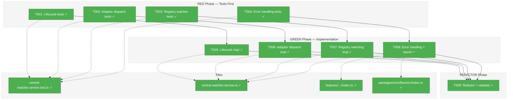
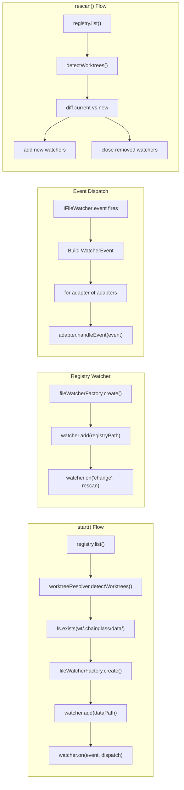
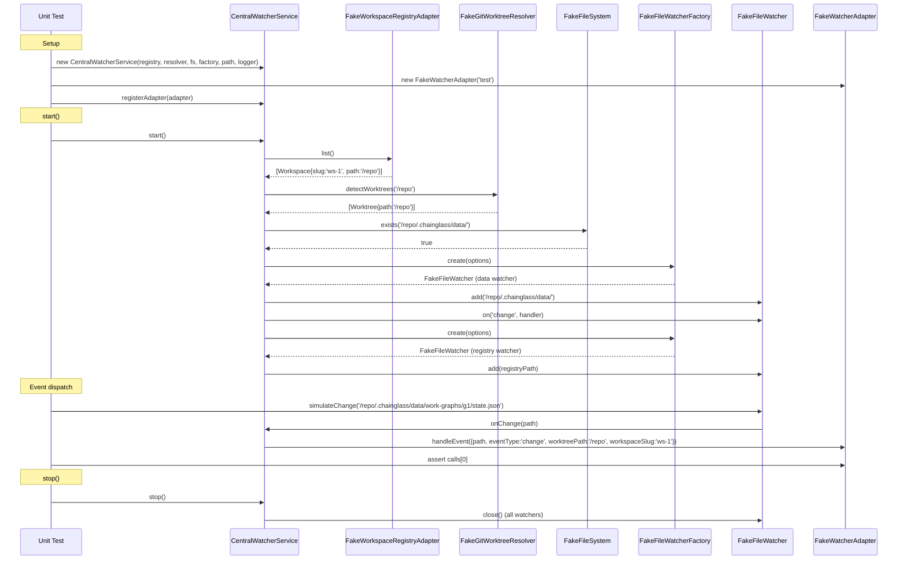

# Phase 2: CentralWatcherService (TDD) – Tasks & Alignment Brief

**Spec**: [../../central-watcher-notifications-spec.md](../../central-watcher-notifications-spec.md)
**Plan**: [../../central-watcher-notifications-plan.md](../../central-watcher-notifications-plan.md)
**Date**: 2026-01-31

---

## Executive Briefing

### Purpose
This phase TDD-implements the domain-agnostic `CentralWatcherService` — the core service that watches all worktree data directories and dispatches raw filesystem events to registered adapters. It is the engine that makes the entire adapter-based notification system work.

### What We're Building
A `CentralWatcherService` class (implementing `ICentralWatcherService`) that:
- Discovers all workspaces and worktrees on `start()`, creating one `IFileWatcher` per worktree watching `<worktree>/.chainglass/data/` recursively
- Creates a registry watcher for `workspaces.json` to detect workspace add/remove
- Forwards ALL filesystem events to ALL registered `IWatcherAdapter` instances as `WatcherEvent` objects
- Dynamically adds/removes watchers when workspaces change (rescan/diff)
- Has zero domain-specific imports — adapters own all filtering logic

### User Value
With this service in place, any domain (workgraphs, agents, samples) can receive file-change notifications by implementing `IWatcherAdapter` and calling `registerAdapter()` — without modifying core watcher code. Phase 3 delivers the first concrete adapter.

### Example
```typescript
// Service setup
const service = new CentralWatcherService(
  registry, worktreeResolver, fs, fileWatcherFactory, registryPath, logger
);

// Register adapters (before or after start)
service.registerAdapter(workgraphAdapter);
service.registerAdapter(agentAdapter);

await service.start();
// → Creates watchers for each worktree's .chainglass/data/
// → Creates registry watcher for workspaces.json

// When a file changes: /wt/.chainglass/data/work-graphs/g1/state.json
// → Both adapters receive WatcherEvent { path, eventType: 'change', worktreePath: '/wt', workspaceSlug: 'ws-1' }
// → Each adapter self-filters for relevance

await service.stop();
// → All watchers closed, adapters preserved (CF-08)
```

---

## Objectives & Scope

### Objective
TDD-implement the domain-agnostic watcher service per plan tasks 2.1–2.9 and acceptance criteria AC1, AC2, AC3, AC6, AC7, AC8, AC12.

### Goals

- ✅ `start()` creates one `IFileWatcher` per worktree watching `<worktree>/.chainglass/data/` (AC1)
- ✅ `start()` creates one registry watcher for `workspaces.json` (AC7)
- ✅ `registerAdapter()` works before and after `start()` (AC2)
- ✅ All file events forwarded to ALL registered adapters as `WatcherEvent` (AC3)
- ✅ Registry changes trigger workspace add/remove (AC6, AC7)
- ✅ `stop()` closes all watchers but preserves adapters (AC8, CF-08)
- ✅ Error isolation: watcher failures, adapter failures, registry failures all handled gracefully
- ✅ Zero domain-specific imports (AC12)
- ✅ Full TDD: RED tests first, then GREEN implementation, then REFACTOR

### Non-Goals

- ❌ WorkGraphWatcherAdapter implementation (Phase 3)
- ❌ Integration tests with real chokidar (Phase 4)
- ❌ Old service removal (Phase 5)
- ❌ DI container registration (NG2 — future SSE plan)
- ❌ SSE broadcast, deduplication, or web layer wiring (NG1)
- ❌ Performance optimization or event debouncing (adapters own debouncing)
- ❌ Polling fallback on watcher failure (NG4)
- ❌ Multiple concrete adapters beyond testing fakes (NG5)

---

## Flight Plan

### Summary Table

| File | Action | Origin | Modified By | Recommendation |
|------|--------|--------|-------------|----------------|
| `.../features/023-central-watcher-notifications/central-watcher.service.ts` | Created | Plan 023 Phase 2 | — | keep-as-is |
| `.../features/023-central-watcher-notifications/index.ts` | Modified | Plan 023 Phase 1 | Plan 023 Phase 2 | keep-as-is |
| `packages/workflow/src/index.ts` | Modified | Plan 022 P4, Plan 023 Phase 1 | Plan 023 Phase 2 | keep-as-is |
| `test/unit/workflow/central-watcher.service.test.ts` | Created | Plan 023 Phase 2 | — | keep-as-is |

### Per-File Detail

#### `central-watcher.service.ts`
- **Duplication check**: Concept overlaps with `WorkspaceChangeNotifierService` (being replaced in Phase 5). The old service watches `work-graphs/*/state.json`; the new service watches `<worktree>/.chainglass/data/` generically. Deliberate replacement per plan — not duplication.
- **Provenance**: New file, no prior history.
- **Compliance**: Follows PlanPak placement in `features/023-central-watcher-notifications/`. No ADR violations.

#### `test/unit/workflow/central-watcher.service.test.ts`
- **Duplication check**: Concept overlaps with `workspace-change-notifier.service.test.ts` (being replaced in Phase 5). Distinct tests for new service.
- **Provenance**: New file.
- **Compliance**: Follows flat `test/unit/workflow/` convention per project rules.

### Compliance Check

No violations found. All files follow PlanPak placement rules and project conventions.

---

## Requirements Traceability

### Coverage Matrix

| AC | Description | Flow Summary | Files in Flow | Tasks | Status |
|----|-------------|--------------|---------------|-------|--------|
| AC1 | One IFileWatcher per worktree watching `.chainglass/data/` | `start()` → `registry.list()` → `worktreeResolver.detectWorktrees()` → `fileWatcherFactory.create()` per worktree | central-watcher.service.ts, test | T001, T005 | ✅ Complete |
| AC2 | `registerAdapter()` before/after `start()` | `registerAdapter()` adds to `Set<IWatcherAdapter>` → events dispatched to all adapters regardless of registration timing | central-watcher.service.ts, test | T002, T006 | ✅ Complete |
| AC3 | Events forwarded to ALL adapters | `IFileWatcher.on('change')` → build `WatcherEvent` → iterate adapters → `adapter.handleEvent(event)` | central-watcher.service.ts, test | T002, T006 | ✅ Complete |
| AC6 | Workspace add triggers new watchers | Registry watcher fires `change` → `rescan()` → diff worktrees → create watchers for new | central-watcher.service.ts, test | T003, T007 | ✅ Complete |
| AC7 | Service watches `workspaces.json` for changes | `start()` creates registry watcher → `on('change')` triggers `rescan()` | central-watcher.service.ts, test | T001, T005 | ✅ Complete |
| AC8 | `stop()` closes all watchers | `stop()` → close each data watcher → close registry watcher → clear watcher map → set `watching=false` | central-watcher.service.ts, test | T001, T005 | ✅ Complete |
| AC12 | No domain-specific imports | Service imports only from Phase 1 interfaces, shared interfaces, and existing infrastructure | central-watcher.service.ts | T009 | ✅ Complete |

### Gaps Found

No gaps — all Phase 2 acceptance criteria have complete file coverage.

### Orphan Files

| File | Tasks | Assessment |
|------|-------|------------|
| `features/023.../index.ts` | T008 | Infrastructure — barrel export update |
| `packages/workflow/src/index.ts` | T008 | Infrastructure — main barrel re-export |

---

## Architecture Map

### Component Diagram

<!-- Status: grey=pending, orange=in-progress, green=completed, red=blocked -->
<!-- Updated by plan-6 during implementation -->



### Task-to-Component Mapping

<!-- Status: ⬜ Pending | 🟧 In Progress | ✅ Complete | 🔴 Blocked -->

| Task | Component(s) | Files | Status | Comment |
|------|-------------|-------|--------|---------|
| T001 | Lifecycle Tests | `central-watcher.service.test.ts` | ✅ Complete | RED: 11 lifecycle tests written |
| T002 | Dispatch Tests | `central-watcher.service.test.ts` | ✅ Complete | RED: 6 dispatch tests written |
| T003 | Registry Tests | `central-watcher.service.test.ts` | ✅ Complete | RED: 4 registry watcher tests written |
| T004 | Error Tests | `central-watcher.service.test.ts` | ✅ Complete | RED: 3 error handling tests written |
| T005 | CentralWatcherService | `central-watcher.service.ts` | ✅ Complete | GREEN: lifecycle impl — all T001 tests pass |
| T006 | CentralWatcherService | `central-watcher.service.ts` | ✅ Complete | GREEN: dispatch impl — all T002 tests pass |
| T007 | CentralWatcherService | `central-watcher.service.ts` | ✅ Complete | GREEN: registry watching — all T003 tests pass |
| T008 | CentralWatcherService + Barrel | `central-watcher.service.ts`, `index.ts` (×2) | ✅ Complete | GREEN: error handling + barrel exports |
| T009 | CentralWatcherService | `central-watcher.service.ts` | ✅ Complete | REFACTOR: AC12 verified, lint clean, fft pass |

---

## Tasks

| Status | ID | Task | CS | Type | Dependencies | Absolute Path(s) | Validation | Subtasks | Notes |
|--------|------|------|-----|------|--------------|-------------------|------------|----------|-------|
| [x] | T001 | Write tests: service lifecycle — `start()` creates watchers per worktree + registry watcher, `stop()` closes all watchers, `isWatching()` reflects state, double-start throws `'Already watching'`, stop-when-not-watching is safe (no-op), empty workspace list starts with only registry watcher | CS-2 | Test | – | `/home/jak/substrate/023-central-watcher-notifications/test/unit/workflow/central-watcher.service.test.ts` | Tests written, all FAIL (RED). Use `FakeFileWatcherFactory`, `FakeWorkspaceRegistryAdapter`, `FakeGitWorktreeResolver`, `FakeFileSystem`. 5-field Test Doc on each test. | – | Plan task ref: 2.1. TDD RED. [📋 log](execution.log.md#tasks-t001-t004-red) |
| [x] | T002 | Write tests: adapter registration and event dispatch — `registerAdapter()` stores adapter, file event dispatched to all adapters as `WatcherEvent` (with correct `path`, `eventType`, `worktreePath`, `workspaceSlug`), multiple adapters all receive same event, adapter registered after `start()` receives events from existing watchers, event types: `change`, `add`, `unlink` | CS-2 | Test | – | `/home/jak/substrate/023-central-watcher-notifications/test/unit/workflow/central-watcher.service.test.ts` | Tests written, all FAIL (RED). Use `FakeWatcherAdapter` to verify dispatch. 5-field Test Doc. | – | Plan task ref: 2.2. TDD RED. [📋 log](execution.log.md#tasks-t001-t004-red) |
| [x] | T003 | Write tests: workspace add/remove via registry watcher — registry watcher `change` triggers rescan, new worktree gets watcher, removed worktree's watcher is closed, workspace slug correctly mapped in `WatcherEvent`, multiple rapid registry changes don't create duplicate watchers (rescan serialization via `isRescanning` guard) | CS-2 | Test | – | `/home/jak/substrate/023-central-watcher-notifications/test/unit/workflow/central-watcher.service.test.ts` | Tests written, all FAIL (RED). Simulate registry watcher change via `FakeFileWatcher.simulateChange()`. 5-field Test Doc. | – | Plan task ref: 2.3. TDD RED. [📋 log](execution.log.md#tasks-t001-t004-red) |
| [x] | T004 | Write tests: error handling — watcher creation failure logged (not thrown, other worktrees still get watchers), adapter `handleEvent()` exception doesn't crash service or other adapters, registry read failure during rescan is logged not thrown | CS-1 | Test | – | `/home/jak/substrate/023-central-watcher-notifications/test/unit/workflow/central-watcher.service.test.ts` | Tests written, all FAIL (RED). Use `FakeLogger` to verify error logging. 5-field Test Doc. | – | Plan task ref: 2.4. TDD RED. [📋 log](execution.log.md#tasks-t001-t004-red) |
| [x] | T005 | Implement `CentralWatcherService` lifecycle: constructor takes `IWorkspaceRegistryAdapter`, `IGitWorktreeResolver`, `IFileSystem`, `IFileWatcherFactory`, `registryPath: string`, optional `ILogger`. `start()` discovers worktrees via registry + resolver, creates `Map<string, IFileWatcher>` for data watchers + single registry watcher. `stop()` closes all watchers, preserves adapter set (CF-08). `isWatching()` returns state. Double-start throws. Stop-when-not-watching is no-op. | CS-3 | Core | T001 | `/home/jak/substrate/023-central-watcher-notifications/packages/workflow/src/features/023-central-watcher-notifications/central-watcher.service.ts` | All T001 lifecycle tests pass (GREEN). | – | Plan task ref: 2.5. TDD GREEN. Per CF-07, CF-08. [📋 log](execution.log.md#tasks-t005-t008-green) |
| [x] | T006 | Implement adapter dispatch: adapters stored in `Set<IWatcherAdapter>`. Each data watcher's `on('change'|'add'|'unlink')` creates `WatcherEvent` with correct `worktreePath` and `workspaceSlug` (looked up from path metadata map) and calls `handleEvent()` on all adapters. Adapter registered after start gets events from existing watchers (watcher event handlers reference the live adapter set). | CS-2 | Core | T002, T005 | `/home/jak/substrate/023-central-watcher-notifications/packages/workflow/src/features/023-central-watcher-notifications/central-watcher.service.ts` | All T002 dispatch tests pass (GREEN). | – | Plan task ref: 2.6. TDD GREEN. [📋 log](execution.log.md#tasks-t005-t008-green) |
| [x] | T007 | Implement registry watching: registry watcher fires `rescan()` on change. `rescan()` re-discovers worktrees, diffs current vs new, creates/closes watchers accordingly. Serialize rescan via `isRescanning` guard to prevent duplicate watchers from rapid changes. | CS-2 | Core | T003, T005 | `/home/jak/substrate/023-central-watcher-notifications/packages/workflow/src/features/023-central-watcher-notifications/central-watcher.service.ts` | All T003 registry tests pass (GREEN). | – | Plan task ref: 2.7. TDD GREEN. [📋 log](execution.log.md#tasks-t005-t008-green) |
| [x] | T008 | Implement error handling: try/catch around watcher creation (log + continue), adapter dispatch (log + continue to next adapter), and registry reads (log + no-throw). Errors logged via `ILogger.error()` (falls back to `console.error` if logger not injected). Update feature barrel and main barrel to export `CentralWatcherService`. | CS-2 | Core | T004, T005 | `/home/jak/substrate/023-central-watcher-notifications/packages/workflow/src/features/023-central-watcher-notifications/central-watcher.service.ts`, `/home/jak/substrate/023-central-watcher-notifications/packages/workflow/src/features/023-central-watcher-notifications/index.ts`, `/home/jak/substrate/023-central-watcher-notifications/packages/workflow/src/index.ts` | All T004 error tests pass (GREEN). Barrel exports `CentralWatcherService`. `just typecheck` passes. | – | Plan task ref: 2.8. TDD GREEN. plan-scoped + cross-cutting. [📋 log](execution.log.md#tasks-t005-t008-green) |
| [x] | T009 | Refactor for quality: verify zero domain-specific imports (AC12), clean architecture, consistent naming, JSDoc on public API. All tests still pass. `just fft` passes. | CS-1 | Refactor | T005, T006, T007, T008 | `/home/jak/substrate/023-central-watcher-notifications/packages/workflow/src/features/023-central-watcher-notifications/central-watcher.service.ts` | All tests pass. `just fft` clean. No domain imports. | – | Plan task ref: 2.9. TDD REFACTOR. [📋 log](execution.log.md#task-t009-refactor) |

---

## Alignment Brief

### Prior Phase Review

#### Phase 1: Interfaces & Fakes — Summary

**Deliverables Created** (all complete, 13 tests passing):
- `WatcherEvent` type + `IWatcherAdapter` interface → `watcher-adapter.interface.ts`
- `ICentralWatcherService` interface → `central-watcher.interface.ts`
- `FakeWatcherAdapter` (call tracking: `calls[]`, `reset()`) → `fake-watcher-adapter.ts`
- `FakeCentralWatcherService` (lifecycle tracking, `simulateEvent()`, error injection) → `fake-central-watcher.service.ts`
- Feature barrel → `index.ts` (7 exports)
- DI token → `CENTRAL_WATCHER_SERVICE` in `WORKSPACE_DI_TOKENS`
- PlanPak directory + `package.json` exports entry

**Dependencies Exported to Phase 2**:
- `ICentralWatcherService` — the interface Phase 2 implements
- `IWatcherAdapter` / `WatcherEvent` — the adapter contract Phase 2 dispatches to
- `FakeWatcherAdapter` — used in Phase 2 tests to verify event dispatch
- Import path: `@chainglass/workflow` or `@chainglass/workflow/features/023-central-watcher-notifications`

**Lessons Learned**:
1. Import path from `features/023-xxx/` to `interfaces/` is `../../interfaces/` (2 levels), not 3
2. TDD GREEN requires barrel exports before tests can pass — barrel creation may need to be pulled forward
3. `StartCall`/`StopCall` type names collide with old notifier types — aliased as `WatcherStartCall`/`WatcherStopCall` in main barrel (resolves in Phase 5)

**Architectural Decisions to Maintain**:
- Callback-set pattern (`Set<IWatcherAdapter>`), not EventEmitter
- Self-filtering adapters receive ALL events (ADR-02)
- Error isolation: one adapter failure must not block others
- `stop()` does NOT clear registered adapters (CF-08)
- `start()` throws `'Already watching'` on double-start
- Zero domain-specific imports in service and interface files (AC12)

**Reusable Test Infrastructure**:
- `FakeWatcherAdapter('name')` — records all `handleEvent()` calls in `calls[]`, supports `reset()`
- Test pattern: create fake adapters → register → simulate event → assert `adapter.calls`

**Critical Findings Timeline**:
- CF-05 → Phase 1 created PlanPak directory
- CF-06 → Phase 1 defined `WatcherEvent` as object
- CF-08 → Phase 1 enforced adapter preservation on stop
- CF-10 → Phase 1 added DI token (placeholder only)

### Critical Findings Affecting This Phase

| Finding | Constraint/Requirement | Tasks |
|---------|----------------------|-------|
| CF-07: One IFileWatcher Per Worktree | `start()` must create `Map<string, IFileWatcher>` keyed by worktree path, each watching `<worktree>/.chainglass/data/`. Plus one registry watcher. | T001, T005 |
| CF-08: Stop Preserves Adapters | `stop()` closes watchers + clears watcher map, but does NOT clear `Set<IWatcherAdapter>`. | T001, T005 |
| CF-06: WatcherEvent as Object | Events dispatched as `WatcherEvent` objects with 4 fields. `worktreePath` and `workspaceSlug` resolved from path metadata. | T002, T006 |

### ADR Decision Constraints

- **ADR-0004: DI Container Architecture** — `useFactory` pattern, token constants. Phase 2 adds no DI registration (per NG2). Service is NOT registered in containers. Constrains: no action needed.
- **ADR-0009: Module Registration Function Pattern** — Future DI integration. No action in Phase 2.

### PlanPak Placement Rules

- **Plan-scoped files** → `packages/workflow/src/features/023-central-watcher-notifications/` (service implementation)
- **Cross-cutting files** → `packages/workflow/src/index.ts` (barrel update)
- **Test location** → `test/unit/workflow/` (flat, not nested in features)
- **Dependency direction** → features → shared interfaces (allowed); shared → features (never)

### Invariants & Guardrails

- Zero domain-specific imports in `central-watcher.service.ts` (AC12)
- Fakes only — no `vi.fn()`, `vi.mock()`, `vi.spyOn()` in test files (AC10)
- Callback-set pattern — `Set<IWatcherAdapter>` with direct iteration, NOT EventEmitter
- Error isolation — adapter failures, watcher creation failures, registry read failures all caught and logged
- `IFileWatcher` config must use: `atomic: true`, `awaitWriteFinish: { stabilityThreshold: 200, pollInterval: 100 }`, `ignoreInitial: true` (per CF-04)

### Inputs to Read

| File | Purpose |
|------|---------|
| `/home/jak/substrate/023-central-watcher-notifications/packages/workflow/src/features/023-central-watcher-notifications/central-watcher.interface.ts` | Interface being implemented |
| `/home/jak/substrate/023-central-watcher-notifications/packages/workflow/src/features/023-central-watcher-notifications/watcher-adapter.interface.ts` | `WatcherEvent` type + `IWatcherAdapter` |
| `/home/jak/substrate/023-central-watcher-notifications/packages/workflow/src/interfaces/file-watcher.interface.ts` | `IFileWatcher`, `IFileWatcherFactory`, `FileWatcherEvent`, `FileWatcherOptions` |
| `/home/jak/substrate/023-central-watcher-notifications/packages/workflow/src/fakes/fake-file-watcher.ts` | `FakeFileWatcher` (simulateChange/Add/Unlink, getWatchedPaths, isClosed), `FakeFileWatcherFactory` (getWatcher, getWatcherCount) |
| `/home/jak/substrate/023-central-watcher-notifications/packages/workflow/src/interfaces/workspace-registry-adapter.interface.ts` | `IWorkspaceRegistryAdapter.list()` returns `Workspace[]` |
| `/home/jak/substrate/023-central-watcher-notifications/packages/workflow/src/fakes/fake-workspace-registry-adapter.ts` | `FakeWorkspaceRegistryAdapter.addWorkspace()` for test setup |
| `/home/jak/substrate/023-central-watcher-notifications/packages/workflow/src/interfaces/git-worktree-resolver.interface.ts` | `IGitWorktreeResolver.detectWorktrees()` returns `Worktree[]` |
| `/home/jak/substrate/023-central-watcher-notifications/packages/workflow/src/fakes/fake-git-worktree-resolver.ts` | `FakeGitWorktreeResolver.setWorktrees()` for test setup |
| `/home/jak/substrate/023-central-watcher-notifications/packages/shared/src/interfaces/filesystem.interface.ts` | `IFileSystem.exists()` for checking `.chainglass/data/` existence |
| `/home/jak/substrate/023-central-watcher-notifications/packages/shared/src/fakes/fake-filesystem.ts` | `FakeFileSystem.setDir()` for test setup |
| `/home/jak/substrate/023-central-watcher-notifications/packages/shared/src/interfaces/logger.interface.ts` | `ILogger` with `error()`, `info()`, `warn()` methods |
| `/home/jak/substrate/023-central-watcher-notifications/packages/shared/src/fakes/fake-logger.ts` | `FakeLogger.getEntriesByLevel()` for verifying error logging |
| `/home/jak/substrate/023-central-watcher-notifications/packages/workflow/src/services/workspace-change-notifier.service.ts` | Pattern reference: old service's watcher management, rescan diffing, path metadata |
| `/home/jak/substrate/023-central-watcher-notifications/packages/workflow/src/entities/workspace.ts` | `Workspace.create()` for test data |

### Visual Alignment: Flow Diagram



### Visual Alignment: Sequence Diagram



### Test Plan (Full TDD — Fakes Only)

#### Constructor & Dependencies

| Dep | Type | Fake | Setup Method |
|-----|------|------|-------------|
| `IWorkspaceRegistryAdapter` | Interface | `FakeWorkspaceRegistryAdapter` | `addWorkspace(Workspace.create({...}))` |
| `IGitWorktreeResolver` | Interface | `FakeGitWorktreeResolver` | `setWorktrees(repoPath, [Worktree])` |
| `IFileSystem` | Interface | `FakeFileSystem` | `setDir(path)` for `.chainglass/data/` |
| `IFileWatcherFactory` | Interface | `FakeFileWatcherFactory` | Automatic — `getWatcher(n)` to access |
| `registryPath` | `string` | N/A | `'/test/.config/chainglass/workspaces.json'` |
| `ILogger` | Interface (optional) | `FakeLogger` | `getEntriesByLevel('error')` for assertions |

#### T001: Lifecycle Tests (`describe('start/stop lifecycle')`)

| Test | Rationale | Expected |
|------|-----------|----------|
| `should create one watcher per worktree plus registry watcher` | AC1, CF-07 | 2 workspaces × 1 worktree + 1 registry = 3 watchers |
| `should watch <worktree>/.chainglass/data/ for each worktree` | AC1 | `FakeFileWatcher.getWatchedPaths()` includes data path |
| `should create registry watcher for workspaces.json` | AC7 | Registry watcher watches `registryPath` |
| `should set isWatching() to true after start` | Lifecycle | `service.isWatching() === true` |
| `should set isWatching() to false after stop` | Lifecycle | `false` after stop |
| `should close all watchers on stop` | AC8 | All `FakeFileWatcher.isClosed() === true` |
| `should preserve adapters after stop (CF-08)` | CF-08 | Adapter still registered after stop/start cycle |
| `should throw 'Already watching' on double start` | Contract | `expect(service.start()).rejects.toThrow('Already watching')` |
| `should be safe to call stop when not watching` | Robustness | No throw, `isWatching()` stays false |
| `should start with only registry watcher when no workspaces` | Edge case | 1 watcher (registry only) |
| `should skip worktrees without .chainglass/data/ directory` | Robustness | `fs.exists()` returns false → no data watcher created |

#### T002: Adapter Dispatch Tests (`describe('adapter registration and event dispatch')`)

| Test | Rationale | Expected |
|------|-----------|----------|
| `should forward file change events to all adapters` | AC3 | Both adapters receive `WatcherEvent` with `eventType: 'change'` |
| `should forward file add events to all adapters` | AC3 | `eventType: 'add'` dispatched |
| `should forward file unlink events to all adapters` | AC3 | `eventType: 'unlink'` dispatched |
| `should include correct worktreePath and workspaceSlug` | CF-06 | `WatcherEvent` fields match test data |
| `should dispatch to adapter registered after start` | AC2 | Late-registered adapter receives events |
| `should dispatch from multiple worktree watchers` | AC1+AC3 | Events from different worktrees both reach adapter |

#### T003: Registry Watcher Tests (`describe('workspace add/remove via registry watcher')`)

| Test | Rationale | Expected |
|------|-----------|----------|
| `should create watcher for newly added workspace on rescan` | AC6 | New watcher count increases |
| `should close watcher for removed workspace on rescan` | AC6 | Removed watcher `isClosed()` |
| `should trigger rescan when registry watcher fires change` | AC7 | Registry `simulateChange()` → new watcher created |
| `should not create duplicate watchers on rapid registry changes` | Robustness | Serialized rescan via guard |

#### T004: Error Handling Tests (`describe('error handling')`)

| Test | Rationale | Expected |
|------|-----------|----------|
| `should log and continue when watcher creation fails for one worktree` | Robustness | Other worktrees still get watchers; error logged |
| `should isolate adapter handleEvent exceptions` | Error isolation | Other adapters still receive event; error logged |
| `should log and continue when registry read fails during rescan` | Robustness | Service continues; error logged |

### Step-by-Step Implementation Outline

1. **T001-T004** (RED): Write all test `describe` blocks in a single test file. All tests fail because `CentralWatcherService` doesn't exist yet.
2. **T005** (GREEN): Create `central-watcher.service.ts` with constructor, `start()`, `stop()`, `isWatching()`. Implement workspace discovery and watcher creation. Pass T001 lifecycle tests.
3. **T006** (GREEN): Add adapter `Set<IWatcherAdapter>`, `registerAdapter()`, wire `IFileWatcher.on()` handlers to dispatch `WatcherEvent` to all adapters. Pass T002 dispatch tests.
4. **T007** (GREEN): Add registry watcher `on('change')` → `rescan()`. Implement diff logic (current vs new worktrees). Add `isRescanning` serialization guard. Pass T003 tests.
5. **T008** (GREEN): Add try/catch around watcher creation, adapter dispatch, and registry reads. Wire `ILogger.error()` with `console.error` fallback. Update feature barrel + main barrel to export `CentralWatcherService`. Pass T004 tests.
6. **T009** (REFACTOR): Verify AC12 (no domain imports), clean up code, run `just fft`.

### Commands to Run

```bash
# After T001-T004 (RED) — all tests should FAIL
just test -- test/unit/workflow/central-watcher.service.test.ts

# After T005 (GREEN) — lifecycle tests pass
just test -- test/unit/workflow/central-watcher.service.test.ts

# After T006-T008 (GREEN) — all tests pass
just test -- test/unit/workflow/central-watcher.service.test.ts

# After T008 — barrel exports work
just typecheck

# After T009 — full validation
just fft

# Verify all existing tests still pass
just check
```

### Risks/Unknowns

| Risk | Severity | Mitigation |
|------|----------|------------|
| `FakeFileWatcher.on()` handler wiring may differ from real chokidar | Medium | Study `FakeFileWatcher` implementation carefully; simulate events per event type |
| Path metadata map lookup for `worktreePath`/`workspaceSlug` may fail for nested paths | Medium | Use longest-prefix-match or store explicit path→metadata mapping per `watcher.add()` call |
| Rescan serialization may need async queue pattern | Low | Start with `isRescanning` boolean guard; upgrade to queue if tests reveal races |
| `IFileWatcher.on()` returns `this` (chainable) — may need to handle return value | Low | Ignore return value; only side-effect (callback registration) matters |
| FakeFileWatcherFactory watcher index ordering may be fragile | Medium | Use explicit watcher identification (e.g., by watched path) rather than relying on creation index |

### Ready Check

- [x] ADR-0004 constraints mapped — no DI registration needed in Phase 2 (per NG2)
- [ ] All constructor deps verified: `IWorkspaceRegistryAdapter`, `IGitWorktreeResolver`, `IFileSystem`, `IFileWatcherFactory`, `registryPath`, `ILogger?`
- [ ] `FakeFileWatcher` event simulation API confirmed: `simulateChange()`, `simulateAdd()`, `simulateUnlink()`
- [ ] `FakeFileWatcherFactory.getWatcher(n)` confirmed for accessing created watchers
- [ ] `FakeWorkspaceRegistryAdapter.addWorkspace()` confirmed for test setup
- [ ] `FakeGitWorktreeResolver.setWorktrees()` confirmed for test setup
- [ ] `FakeFileSystem.setDir()` confirmed for `.chainglass/data/` existence checks
- [ ] `FakeLogger.getEntriesByLevel()` confirmed for error log assertions
- [ ] Phase 1 barrel exports all types needed for imports

**✅ Phase 2 Complete — All 9 tasks done, 24 tests passing, just fft clean**

---

## Phase Footnote Stubs

_To be populated by plan-6 during implementation._

| Footnote | Task | Description | Date |
|----------|------|-------------|------|
| | | | |

---

## Evidence Artifacts

- **Execution log**: `docs/plans/023-central-watcher-notifications/tasks/phase-2-centralwatcherservice-tdd/execution.log.md`
- **Test output**: RED: 24 tests failed (CentralWatcherService not a constructor). GREEN: 24 tests passed. REFACTOR: just fft clean (2731 tests, 190 files).

---

## Discoveries & Learnings

_Populated during implementation by plan-6. Log anything of interest to your future self._

| Date | Task | Type | Discovery | Resolution | References |
|------|------|------|-----------|------------|------------|
| 2026-01-31 | T005-T008 | decision | Implementation done holistically (T005-T008 together) because lifecycle/dispatch/registry/error handling are deeply coupled | Single-pass implementation — all 24 tests pass at once rather than incremental GREEN | log#tasks-t005-t008-green |
| 2026-01-31 | T007 | insight | `isRescanning` + `rescanQueued` pattern handles rapid registry changes cleanly — queue at most 1 pending rescan, no full async queue needed | Simple boolean guard + queued flag | log#tasks-t005-t008-green |
| 2026-01-31 | T004 | gotcha | `FakeWorkspaceRegistryAdapter` lacks `injectListError` support | Overrode `list()` method directly in test — functional but not as clean as fake's built-in error injection | log#tasks-t005-t008-green |
| 2026-01-31 | T009 | insight | `const + .catch()` pattern avoids `noImplicitAnyLet` lint errors without needing entity type imports | Cleaner than `let + try/catch` — maintains AC12 zero-domain-imports | log#task-t009-refactor |

**Types**: `gotcha` | `research-needed` | `unexpected-behavior` | `workaround` | `decision` | `debt` | `insight`

**What to log**:
- Things that didn't work as expected
- External research that was required
- Implementation troubles and how they were resolved
- Gotchas and edge cases discovered
- Decisions made during implementation
- Technical debt introduced (and why)
- Insights that future phases should know about

_See also: `execution.log.md` for detailed narrative._

---

## Directory Layout

```
docs/plans/023-central-watcher-notifications/
  ├── central-watcher-notifications-spec.md
  ├── central-watcher-notifications-plan.md
  ├── research-dossier.md
  ├── tasks/phase-1-interfaces-and-fakes/
  │   ├── tasks.md
  │   └── execution.log.md
  └── tasks/phase-2-centralwatcherservice-tdd/
      ├── tasks.md                    # this file
      └── execution.log.md           # created by /plan-6
```
