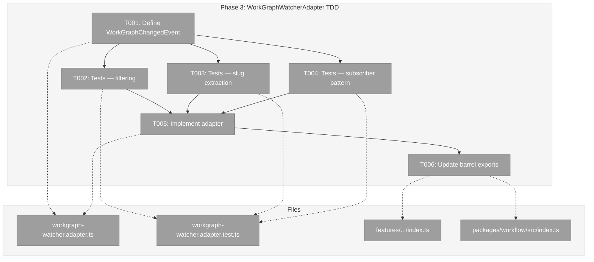
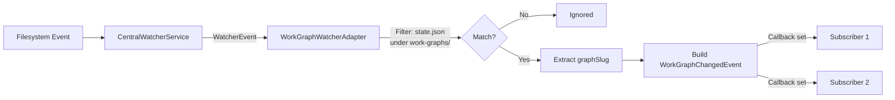
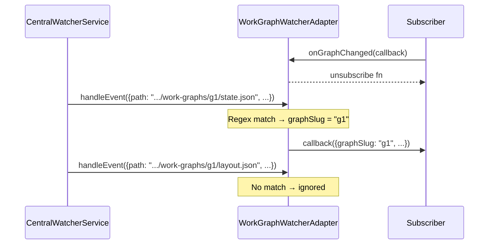

# Phase 3: WorkGraphWatcherAdapter (TDD) – Tasks & Alignment Brief

**Spec**: [../../central-watcher-notifications-spec.md](../../central-watcher-notifications-spec.md)
**Plan**: [../../central-watcher-notifications-plan.md](../../central-watcher-notifications-plan.md)
**Date**: 2026-02-01

---

## Executive Briefing

### Purpose
This phase TDD-implements the first concrete watcher adapter — `WorkGraphWatcherAdapter` — that filters raw filesystem events for workgraph `state.json` changes and emits domain-specific `WorkGraphChangedEvent`s to subscribers. This proves the adapter extension point created in Phases 1-2 actually works for real domain logic.

### What We're Building
A `WorkGraphWatcherAdapter` class (implementing `IWatcherAdapter`) that:
- Receives ALL filesystem events from `CentralWatcherService` via `handleEvent()`
- Self-filters for `state.json` files under `.chainglass/data/work-graphs/<slug>/`
- Extracts the graph slug from the file path
- Builds a `WorkGraphChangedEvent` (matching the old `GraphChangedEvent` shape) and dispatches to subscribers
- Exposes `onGraphChanged(callback)` returning an unsubscribe function (callback-set pattern)

### User Value
Workgraph state change notifications become available through the new adapter architecture, enabling future SSE integration without modifying the core watcher service.

### Example
```typescript
const adapter = new WorkGraphWatcherAdapter();
const unsubscribe = adapter.onGraphChanged((event) => {
  console.log(`Graph ${event.graphSlug} changed in workspace ${event.workspaceSlug}`);
});

// When CentralWatcherService dispatches a WatcherEvent for state.json:
adapter.handleEvent({
  path: '/wt/.chainglass/data/work-graphs/my-graph/state.json',
  eventType: 'change',
  worktreePath: '/wt',
  workspaceSlug: 'my-ws',
});
// → subscriber called with { graphSlug: 'my-graph', workspaceSlug: 'my-ws', ... }
```

---

## Objectives & Scope

### Objective
Implement the concrete workgraph watcher adapter that filters for state.json changes and emits domain-specific events, proving the adapter pattern works end-to-end (AC4, AC5).

### Goals

- ✅ Define `WorkGraphChangedEvent` type matching old `GraphChangedEvent` shape (CF-09)
- ✅ Implement `WorkGraphWatcherAdapter` that self-filters for `state.json` under `work-graphs/`
- ✅ Extract `graphSlug` from file paths correctly (including edge-case slugs)
- ✅ Expose `onGraphChanged(callback)` with unsubscribe (callback-set pattern)
- ✅ Comprehensive TDD tests covering filtering, extraction, subscriber pattern
- ✅ Update barrel exports for feature and main index

### Non-Goals

- ❌ Integration with `CentralWatcherService` wiring (Phase 4)
- ❌ Debouncing or deduplication of events (adapter consumers own this)
- ❌ Agent adapter, sample adapter, or any other domain adapter (NG5)
- ❌ SSE integration or DI registration (NG1, NG2)
- ❌ Modifying `CentralWatcherService` or any Phase 2 code
- ❌ Event persistence or delivery guarantees (NG6)

---

## Flight Plan

### Summary Table
| File | Action | Origin | Modified By | Recommendation |
|------|--------|--------|-------------|----------------|
| `.../workgraph-watcher.adapter.ts` | Create | Plan 023, Phase 3 | — | keep-as-is |
| `.../features/023-.../index.ts` | Modify | Plan 023, Phase 1 | Plan 023, Phase 2 | keep-as-is |
| `packages/workflow/src/index.ts` | Modify | Original project | Plans 007-023 | cross-plan-edit |
| `test/unit/workflow/workgraph-watcher.adapter.test.ts` | Create | Plan 023, Phase 3 | — | keep-as-is |

### Per-File Detail

#### `workgraph-watcher.adapter.ts` (New)
- **Duplication check**: The old `WorkspaceChangeNotifierService` at `packages/workflow/src/services/workspace-change-notifier.service.ts` (lines 229-270) contains nearly identical logic: `state.json` path-suffix filtering, graph slug extraction regex (`filePath.match(/work-graphs\/([^/]+)\/state\.json$/)`), `GraphChangedEvent` construction, callback-set dispatch. This is **intentional replacement** per the plan — the adapter extracts the domain-specific filtering from the monolithic old service. The old service is deleted in Phase 5.
- **Compliance**: Naming matches R-CODE-002 (PascalCase + `Adapter` suffix) and R-CODE-003 (kebab-case + `.adapter.ts`). Imports only from interfaces per R-ARCH-001.

#### `test/unit/workflow/workgraph-watcher.adapter.test.ts` (New)
- **Duplication check**: No existing tests for a workgraph watcher adapter. Old service tests exist at `test/unit/workflow/workspace-change-notifier.service.test.ts` but test the monolithic service, not an isolated adapter.
- **Compliance**: Path matches R-TEST-006 (`test/unit/[package]/`) and the flat pattern established in Phases 1-2. Plan examples reference `test/unit/workflow/features/023/` but all existing Phase 1-2 tests use the flat `test/unit/workflow/` pattern — use the flat path.

### Compliance Check
| Severity | File | Rule | Note |
|----------|------|------|------|
| Info | `workgraph-watcher.adapter.ts` | CF-09 | `WorkGraphChangedEvent` must exactly match old `GraphChangedEvent` fields: `graphSlug`, `workspaceSlug`, `worktreePath`, `filePath`, `timestamp: Date` |
| Info | `index.ts` (main barrel) | R-CODE-004 | Use `export type` for `WorkGraphChangedEvent` |

---

## Requirements Traceability

### Coverage Matrix
| AC | Description | Flow Summary | Files in Flow | Tasks | Status |
|----|-------------|-------------|---------------|-------|--------|
| AC4 | Adapters receive raw events, self-filter, transform to domain events | `CentralWatcherService.dispatchEvent()` → `IWatcherAdapter.handleEvent()` → `WorkGraphWatcherAdapter` filters path → builds `WorkGraphChangedEvent` → calls subscribers | `watcher-adapter.interface.ts` (Phase 1), `central-watcher.service.ts` (Phase 2), `workgraph-watcher.adapter.ts` (T001/T005), test file (T002-T004) | T001-T005 | ✅ Complete |
| AC5 | `WorkGraphWatcherAdapter` filters for `state.json` under `work-graphs/` and emits `WorkGraphChangedEvent` | `handleEvent(event)` → regex match on `event.path` for `work-graphs/<slug>/state.json` → extract slug → create event → notify subscribers | `workgraph-watcher.adapter.ts` (T001/T005), test file (T002-T004) | T001-T005 | ✅ Complete |
| AC5-sub | `WorkGraphChangedEvent` matches old `GraphChangedEvent` shape (CF-09) | Type definition with 5 fields | `workgraph-watcher.adapter.ts` (T001) | T001 | ✅ Complete |
| AC5-sub | `onGraphChanged()` returns unsubscribe function | Callback-set pattern | `workgraph-watcher.adapter.ts` (T005), test file (T004) | T004, T005 | ✅ Complete |
| AC5-sub | `just typecheck` passes | Barrel exports resolve correctly | `index.ts` (feature + main) (T006) | T006 | ✅ Complete |

### Gaps Found
No gaps — all acceptance criteria have complete file coverage.

### Orphan Files
None — every file maps to at least one AC.

---

## Architecture Map

### Component Diagram
<!-- Status: grey=pending, orange=in-progress, green=completed, red=blocked -->
<!-- Updated by plan-6 during implementation -->



### Task-to-Component Mapping

<!-- Status: ⬜ Pending | 🟧 In Progress | ✅ Complete | 🔴 Blocked -->

| Task | Component(s) | Files | Status | Comment |
|------|-------------|-------|--------|---------|
| T001 | Type Definition | `workgraph-watcher.adapter.ts` | ⬜ Pending | Define `WorkGraphChangedEvent` matching old `GraphChangedEvent` |
| T002 | Test Suite | `workgraph-watcher.adapter.test.ts` | ⬜ Pending | RED: state.json filtering tests |
| T003 | Test Suite | `workgraph-watcher.adapter.test.ts` | ⬜ Pending | RED: graphSlug extraction tests |
| T004 | Test Suite | `workgraph-watcher.adapter.test.ts` | ⬜ Pending | RED: subscriber callback pattern tests |
| T005 | Adapter Impl | `workgraph-watcher.adapter.ts` | ⬜ Pending | GREEN: implement to pass all tests |
| T006 | Barrel Exports | `index.ts` (feature + main) | ⬜ Pending | Export new types and class |

---

## Tasks

| Status | ID | Task | CS | Type | Dependencies | Absolute Path(s) | Validation | Subtasks | Notes |
|--------|------|------|-----|------|--------------|-------------------|------------|----------|-------|
| [ ] | T001 | Define `WorkGraphChangedEvent` type in adapter file | CS-1 | Setup | – | `/home/jak/substrate/023-central-watcher-notifications/packages/workflow/src/features/023-central-watcher-notifications/workgraph-watcher.adapter.ts` | Type has: `graphSlug: string`, `workspaceSlug: string`, `worktreePath: string`, `filePath: string`, `timestamp: Date`. Matches old `GraphChangedEvent` shape exactly (CF-09). | – | plan-scoped. Ref: `workspace-change-notifier.interface.ts:28-55` |
| [ ] | T002 | Write tests: state.json change detection and filtering (RED) | CS-2 | Test | T001 | `/home/jak/substrate/023-central-watcher-notifications/test/unit/workflow/workgraph-watcher.adapter.test.ts` | Tests cover: `state.json` change emits event, `graph.yaml` change ignored, `layout.json` change ignored, file in non-workgraph domain ignored (e.g. `agents/x/state.json`), `state.json` add emits event, `state.json` unlink emits event. All tests FAIL (RED). | – | [📋 log](execution.log.md#task-t002-red) |
| [ ] | T003 | Write tests: graphSlug extraction from path (RED) | CS-1 | Test | T001 | `/home/jak/substrate/023-central-watcher-notifications/test/unit/workflow/workgraph-watcher.adapter.test.ts` | Tests cover: correct slug extracted from `/.chainglass/data/work-graphs/<slug>/state.json`, nested node data paths ignored, edge-case slugs with hyphens/dots/underscores. All tests FAIL (RED). | – | [📋 log](execution.log.md#task-t003-red) |
| [ ] | T004 | Write tests: subscriber callback pattern (RED) | CS-1 | Test | T001 | `/home/jak/substrate/023-central-watcher-notifications/test/unit/workflow/workgraph-watcher.adapter.test.ts` | Tests cover: `onGraphChanged(callback)` returns unsubscribe fn, unsubscribe removes callback, multiple subscribers all notified, `WorkGraphChangedEvent` has correct fields including `timestamp`, adapter `name` is `'workgraph-watcher'`, subscriber error isolation (throwing subscriber doesn't block others). All tests FAIL (RED). | – | [📋 log](execution.log.md#task-t004-red) |
| [ ] | T005 | Implement `WorkGraphWatcherAdapter` to pass all tests (GREEN) | CS-2 | Core | T002, T003, T004 | `/home/jak/substrate/023-central-watcher-notifications/packages/workflow/src/features/023-central-watcher-notifications/workgraph-watcher.adapter.ts` | All tests from T002-T004 pass. Adapter implements `IWatcherAdapter`, `handleEvent()` filters for `state.json` under `work-graphs/`, extracts slug via regex, emits `WorkGraphChangedEvent` to subscribers via callback set. | – | [📋 log](execution.log.md#task-t005-green) |
| [ ] | T006 | Update feature barrel and main barrel exports | CS-1 | Integration | T005 | `/home/jak/substrate/023-central-watcher-notifications/packages/workflow/src/features/023-central-watcher-notifications/index.ts`, `/home/jak/substrate/023-central-watcher-notifications/packages/workflow/src/index.ts` | `WorkGraphWatcherAdapter` and `WorkGraphChangedEvent` exported from feature `index.ts`. Main `index.ts` re-exports both. `just typecheck` passes. `just fft` passes. | – | [📋 log](execution.log.md#task-t006-barrel). plan-scoped + cross-plan-edit |

---

## Alignment Brief

### Prior Phases Review

#### Phase 1: Interfaces & Fakes (Complete)

**Deliverables created:**
- `watcher-adapter.interface.ts`: `WatcherEvent` type (path, eventType, worktreePath, workspaceSlug) + `IWatcherAdapter` interface (name, handleEvent)
- `central-watcher.interface.ts`: `ICentralWatcherService` interface (start, stop, isWatching, rescan, registerAdapter)
- `fake-watcher-adapter.ts`: `FakeWatcherAdapter` class with `.calls[]` tracking, `.reset()`
- `fake-central-watcher.service.ts`: `FakeCentralWatcherService` with lifecycle tracking, `.simulateEvent()`, error injection
- Feature barrel + PlanPak directory + `package.json` exports entry
- DI token `CENTRAL_WATCHER_SERVICE` in `di-tokens.ts`

**Key lessons:**
- Import path depth is 2 levels (`../../interfaces/`) not 3 from the feature directory
- Type name collisions: `StartCall`/`StopCall` aliased to `WatcherStartCall`/`WatcherStopCall` in main barrel
- Error isolation in `simulateEvent()` matches real service behavior
- Double-start guard throws `Error('Already watching')`

**Test infrastructure (13 tests):** `test/unit/workflow/fake-watcher-adapter.test.ts` (4 tests), `test/unit/workflow/fake-central-watcher.service.test.ts` (9 tests). All use 5-field Test Doc, no `vi.fn()`.

**Dependencies exported for Phase 3:**
- `IWatcherAdapter` interface → Phase 3 adapter implements this
- `WatcherEvent` type → Phase 3 adapter receives these in `handleEvent()`
- `FakeCentralWatcherService.simulateEvent()` → available for testing adapter in isolation (though not needed since we can construct `WatcherEvent` directly)

#### Phase 2: CentralWatcherService (Complete)

**Deliverables created:**
- `central-watcher.service.ts` (319 lines): Full service with lifecycle, dispatch, registry watching, error handling, parallelized operations, observability logging
- 25 tests in `test/unit/workflow/central-watcher.service.test.ts`

**Key lessons:**
- Holistic implementation works: T005-T008 done together since service is cohesive
- `const + .catch()` avoids `noImplicitAnyLet` lint errors
- `flushMicrotasks()` helper (20x `Promise.resolve()`) replaces `setTimeout` for deterministic async testing
- `FakeWorkspaceRegistryAdapter` lacks `injectListError()` — test overrides `.list()` directly
- Fire-and-forget `this.rescan()` in callbacks needs `.catch()` to avoid unhandled rejections
- Rescan serialization: `isRescanning` boolean + `rescanQueued` flag + while-loop drain

**Dependencies exported for Phase 3:**
- `CentralWatcherService.registerAdapter()` — the registration API (Phase 3 adapter will be registered here)
- Event dispatch contract: `WatcherEvent { path, eventType, worktreePath, workspaceSlug }` delivered to `adapter.handleEvent()`
- Event types dispatched: `'change'`, `'add'`, `'unlink'`

**Test infrastructure:** `flushMicrotasks()`, `createTestWorkspace()`, `setupSingleWorktree()`, `setupTwoWorktrees()` helpers. `FakeFileWatcherFactory`, `FakeWorkspaceRegistryAdapter`, `FakeGitWorktreeResolver`, `FakeFileSystem`, `FakeLogger` fakes.

### Critical Findings Affecting This Phase

| Finding | What It Constrains | Tasks |
|---------|-------------------|-------|
| **CF-06**: WatcherEvent as Object | `handleEvent(event: WatcherEvent)` signature — adapter receives object, not positional params | T005 |
| **CF-09**: WorkGraphChangedEvent matches old shape | Must have exactly: `graphSlug`, `workspaceSlug`, `worktreePath`, `filePath`, `timestamp: Date` | T001 |

### ADR Decision Constraints

- **ADR-02 (Adapter Filtering Strategy)**: Adapters receive ALL events and self-filter. The `WorkGraphWatcherAdapter` must filter in `handleEvent()`, not via declarative patterns. Addressed by: T002, T005.

### Invariants & Guardrails
- Zero domain-specific imports in the adapter file are NOT required (unlike the service). The adapter IS domain-specific — it knows about `work-graphs/` and `state.json`. But it must only import from the feature's own interface files, not from services or external adapters (R-ARCH-001).
- No external dependencies — pure TypeScript, no library imports.
- Callback-set pattern: `Set<Callback>` with `onX() -> unsubscribe()`. NOT EventEmitter.

### Inputs to Read
- `/home/jak/substrate/023-central-watcher-notifications/packages/workflow/src/features/023-central-watcher-notifications/watcher-adapter.interface.ts` — `IWatcherAdapter`, `WatcherEvent`
- `/home/jak/substrate/023-central-watcher-notifications/packages/workflow/src/interfaces/workspace-change-notifier.interface.ts` — old `GraphChangedEvent` shape (lines 28-55)
- `/home/jak/substrate/023-central-watcher-notifications/packages/workflow/src/services/workspace-change-notifier.service.ts` — old filtering regex and dispatch pattern (lines 229-270)

### Visual Alignment Aids

#### Flow Diagram


#### Sequence Diagram


### Test Plan (Full TDD)

**T002 — Filtering tests (RED):**
| Test | Rationale | Input `WatcherEvent.path` | Expected |
|------|-----------|--------------------------|----------|
| should emit event when state.json changes | AC5 core behavior | `.../work-graphs/my-graph/state.json` (change) | 1 event emitted |
| should emit event when state.json added | AC5 covers add events | `.../work-graphs/my-graph/state.json` (add) | 1 event emitted |
| should emit event when state.json unlinked | AC5 covers unlink events | `.../work-graphs/my-graph/state.json` (unlink) | 1 event emitted |
| should ignore graph.yaml changes | Self-filtering correctness | `.../work-graphs/g1/graph.yaml` | 0 events |
| should ignore layout.json changes | Self-filtering correctness | `.../work-graphs/g1/layout.json` | 0 events |
| should ignore non-workgraph domain files | AC4: adapters self-filter | `.../agents/x/state.json` | 0 events |

**T003 — Slug extraction tests (RED):**
| Test | Input Path | Expected `graphSlug` |
|------|-----------|---------------------|
| should extract simple slug | `.../work-graphs/my-graph/state.json` | `my-graph` |
| should extract slug with hyphens | `.../work-graphs/my-long-graph-name/state.json` | `my-long-graph-name` |
| should extract slug with dots | `.../work-graphs/v2.0/state.json` | `v2.0` |
| should ignore nested node data paths | `.../work-graphs/g1/nodes/n1/data.json` | no event (not state.json) |

**T004 — Subscriber pattern tests (RED):**
| Test | Rationale |
|------|-----------|
| should return unsubscribe function | Callback-set pattern contract |
| should not receive events after unsubscribe | Unsubscribe actually works |
| should notify multiple subscribers independently | Multi-subscriber dispatch |
| should include correct WorkGraphChangedEvent fields | CF-09 shape compliance, timestamp present |
| should have name 'workgraph-watcher' | IWatcherAdapter.name contract for logging/debugging |
| should notify remaining subscribers when one throws | Error isolation — matches Phase 2 pattern, prevents silent subscriber loss |

### Step-by-Step Implementation Outline

1. **T001**: Create `workgraph-watcher.adapter.ts` with just the `WorkGraphChangedEvent` interface/type. Export from file.
2. **T002**: Write ~6 filtering tests in test file. Import `WorkGraphWatcherAdapter` (doesn't exist yet). All fail (RED).
3. **T003**: Write ~4 slug extraction tests in same file. All fail (RED).
4. **T004**: Write ~4 subscriber pattern tests in same file. All fail (RED).
5. **T005**: Implement `WorkGraphWatcherAdapter` class:
   - `readonly name = 'workgraph-watcher'`
   - `private subscribers = new Set<(event: WorkGraphChangedEvent) => void>()`
   - `handleEvent(event: WatcherEvent): void` — regex match, extract slug, build event, dispatch
   - `onGraphChanged(callback): () => void` — add to set, return removal function
   - Regex: `/work-graphs\/([^/]+)\/state\.json$/` (proven pattern from old service — single-step filter+extract, no `.chainglass/data/` prefix needed)
6. **T006**: Add exports to feature barrel and main barrel. Run `just typecheck` and `just fft`.

### Commands to Run
```bash
# Run adapter tests only (fast feedback)
npx vitest run workgraph-watcher.adapter.test.ts

# Type check
just typecheck

# Full quality check
just fft
```

### Risks/Unknowns
| Risk | Severity | Mitigation |
|------|----------|------------|
| Path parsing regex breaks on edge-case graph slugs | Low | Test with hyphens, dots, underscores. Reuse proven regex from old service. |
| `WorkGraphChangedEvent` shape drift from old `GraphChangedEvent` | Low | Explicitly verify against `workspace-change-notifier.interface.ts:28-55` in T001. |

### Ready Check
- [ ] ADR constraints mapped to tasks — ADR-02 (self-filtering) → T002, T005
- [ ] CF-09 shape compliance confirmed → T001
- [ ] Prior phase deliverables verified available → Phase 1 `IWatcherAdapter`/`WatcherEvent` exist
- [ ] Test file location confirmed (`test/unit/workflow/` flat pattern)

---

## Phase Footnote Stubs

_Empty — populated by plan-6 during implementation._

| Footnote | Task | Description |
|----------|------|-------------|
| | | |

---

## Evidence Artifacts

Implementation will write:
- `execution.log.md` — detailed narrative of RED/GREEN/REFACTOR phases
- Test run evidence (pass counts, failure messages)
- Type check evidence

All evidence stored in:
```
docs/plans/023-central-watcher-notifications/tasks/phase-3-workgraphwatcheradapter-tdd/
├── tasks.md          ← this file
└── execution.log.md  ← created by plan-6
```

---

## Discoveries & Learnings

_Populated during implementation by plan-6. Log anything of interest to your future self._

| Date | Task | Type | Discovery | Resolution | References |
|------|------|------|-----------|------------|------------|
| | | | | | |

**Types**: `gotcha` | `research-needed` | `unexpected-behavior` | `workaround` | `decision` | `debt` | `insight`

**What to log**:
- Things that didn't work as expected
- External research that was required
- Implementation troubles and how they were resolved
- Gotchas and edge cases discovered
- Decisions made during implementation
- Technical debt introduced (and why)
- Insights that future phases should know about

_See also: `execution.log.md` for detailed narrative._

---

## Critical Insights Discussion

**Session**: 2026-02-01
**Context**: Phase 3: WorkGraphWatcherAdapter (TDD) — Tasks & Alignment Brief
**Analyst**: AI Clarity Agent
**Reviewer**: jak
**Format**: Water Cooler Conversation (5 Critical Insights)

### Insight 1: Regex Mismatch Between Dossier and Old Service

**Did you know**: The dossier specified `/\.chainglass\/data\/work-graphs\/([^/]+)\/state\.json$/` but the old service uses the shorter `/work-graphs\/([^/]+)\/state\.json$/` — the prefix is redundant.

**Implications**:
- Longer regex adds unnecessary coupling to directory layout
- Shorter regex is battle-tested in the old service
- Both correctly filter and extract in one step

**Options Considered**:
- Option A: Shorter proven regex — single-step filter+extract
- Option B: Longer regex from dossier — more defensive
- Option C: Two-step filter like old service — endsWith + regex

**AI Recommendation**: Option A — Shorter proven regex
- Reasoning: Battle-tested, simpler, less coupling, correctly handles all filtering requirements.

**Discussion Summary**: Quick agreement — shorter regex is proven and sufficient.

**Decision**: Use `/work-graphs\/([^/]+)\/state\.json$/`

**Affects**: T005 implementation outline updated in dossier

---

### Insight 2: Non-Deterministic `timestamp` in Test Assertions

**Did you know**: `handleEvent()` is synchronous and calls `new Date()` internally, making timestamp value assertions flaky due to clock drift between dispatch and assertion.

**Implications**:
- Can't assert exact timestamp value deterministically
- Old service tests verify existence, not value
- Clock injection would be over-engineered for this case

**Options Considered**:
- Option A: Assert `instanceof Date` only
- Option B: Assert `instanceof Date` + within-range check
- Option C: Inject a clock dependency

**AI Recommendation**: Option A — `instanceof Date` only
- Reasoning: Matches old service pattern, deterministic, verifies shape contract without ceremony.

**Discussion Summary**: Quick agreement — shape verification is sufficient.

**Decision**: Assert `instanceof Date` only, no value assertion

**Affects**: T004 test implementation (no dossier change needed)

---

### Insight 3: No Test for Adapter `name` Property

**Did you know**: `IWatcherAdapter.name` is used in error messages by `CentralWatcherService` but no test validated `WorkGraphWatcherAdapter`'s name value.

**Implications**:
- Name could drift without detection
- Error messages in logs depend on this value
- One-line test documents the contract

**Options Considered**:
- Option A: Add one-line test in T004
- Option B: Trust implementation outline, no test

**AI Recommendation**: Option A — Add one-line test
- Reasoning: Trivial cost, documents contract, catches accidental renames.

**Discussion Summary**: Quick agreement — embarrassing to miss, not embarrassing to test.

**Decision**: Add `expect(adapter.name).toBe('workgraph-watcher')` to T004

**Affects**: T004 validation and test plan updated in dossier

---

### Insight 4: `interface` vs `type` for WorkGraphChangedEvent

**Did you know**: The dossier didn't specify whether `WorkGraphChangedEvent` should be an `interface` or `type` alias, and the choice affects consistency with existing patterns.

**Implications**:
- Old `GraphChangedEvent` is an `interface`
- `WatcherEvent` is an `interface`
- All data shapes in the feature use `interface`

**Options Considered**:
- Option A: Use `interface` (matches convention)
- Option B: Use `type` (some prefer for pure data)

**AI Recommendation**: Option A — `interface`
- Reasoning: Consistency with `GraphChangedEvent`, `WatcherEvent`, and codebase convention.

**Discussion Summary**: Quick agreement — consistency wins.

**Decision**: Use `interface` for `WorkGraphChangedEvent`

**Affects**: T001 implementation

---

### Insight 5: Missing Subscriber Error Isolation Test

**Did you know**: Both the old service and `CentralWatcherService` wrap each callback/adapter invocation in try/catch, but the dossier had no test for what happens when a subscriber callback throws inside `WorkGraphWatcherAdapter`.

**Implications**:
- Without try/catch per subscriber, one throwing subscriber blocks all others
- `CentralWatcherService` catches adapter-level exceptions but can't help with intra-adapter dispatch
- Silent subscriber loss with no indication of cause

**Options Considered**:
- Option A: Add error isolation test to T004
- Option B: Let CentralWatcherService handle it (adapter-level only)
- Option C: Document as non-goal and defer

**AI Recommendation**: Option A — Add error isolation test
- Reasoning: One-line try/catch per callback, matches established pattern, prevents real failure mode.

**Discussion Summary**: Quick agreement — prevents 2am debugging when one subscriber silently breaks all others.

**Decision**: Add "should notify remaining subscribers when one throws" test to T004

**Affects**: T004 validation and test plan updated in dossier, T005 must include try/catch per subscriber

---

## Session Summary

**Insights Surfaced**: 5 critical insights identified and discussed
**Decisions Made**: 5 decisions reached through collaborative discussion
**Action Items Created**: 0 follow-up tasks (all changes applied inline)
**Areas Updated**:
- T005 implementation outline: regex corrected to shorter proven pattern
- T004 validation: added name property test and error isolation test
- T004 test plan table: added 2 new test rows

**Shared Understanding Achieved**: Yes

**Confidence Level**: High — Phase 3 is well-scoped CS-2 work with proven patterns to follow.

**Next Steps**: Proceed to `/plan-6-implement-phase --phase 3`
