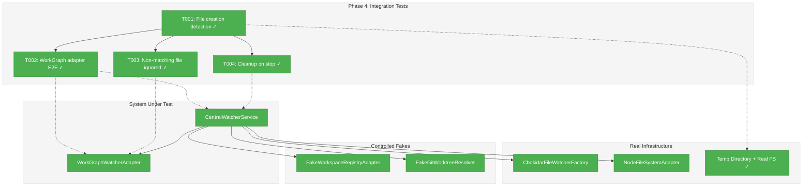
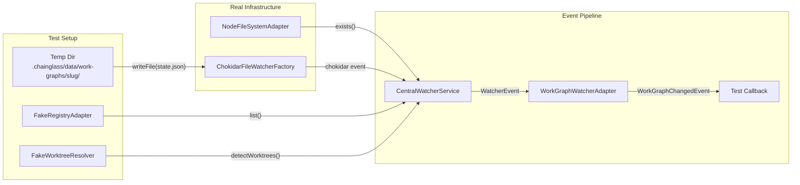
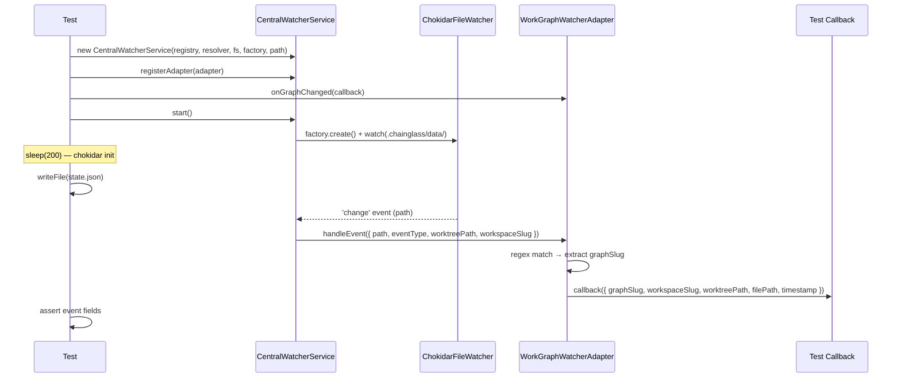

# Phase 4: Integration Tests — Tasks & Alignment Brief

**Spec**: [central-watcher-notifications-spec.md](../../central-watcher-notifications-spec.md)
**Plan**: [central-watcher-notifications-plan.md](../../central-watcher-notifications-plan.md)
**Date**: 2026-02-01
**Phase Slug**: phase-4-integration-tests

---

## Executive Briefing

### Purpose
This phase verifies the full CentralWatcherService + WorkGraphWatcherAdapter pipeline end-to-end using real chokidar file watchers and real filesystem operations. Unit tests (Phases 2-3) proved the components work with fakes; integration tests prove the components work with real infrastructure.

### What We're Building
An integration test file that exercises the complete event pipeline:
1. Real file writes to temp directories
2. Real chokidar detects the changes
3. `CentralWatcherService` dispatches `WatcherEvent` to registered adapters
4. `WorkGraphWatcherAdapter` filters for `state.json` and emits `WorkGraphChangedEvent`
5. Test callback receives the domain event with correct fields

### User Value
Confidence that the watcher system works end-to-end on real filesystems before removing the old service in Phase 5. Catches integration issues (chokidar timing, path resolution, event propagation) that unit tests with fakes cannot.

### Example
**Write**: `<tmpDir>/.chainglass/data/work-graphs/my-graph/state.json`
**Result**: `onGraphChanged` callback fires with `{ graphSlug: 'my-graph', workspaceSlug: 'ws1', ... }`

---

## Objectives & Scope

### Objective
Verify end-to-end behavior with real chokidar watching real files in temp directories, using proven timing patterns from the existing integration test.

### Goals

- ✅ Service detects real file creation via chokidar
- ✅ WorkGraphWatcherAdapter receives events through real service dispatch
- ✅ Non-matching files are correctly filtered out end-to-end
- ✅ Service cleanup on `stop()` prevents further events
- ✅ Timing constants match existing proven values (200ms init, 5s timeout)
- ✅ Tests clean up temp directories

### Non-Goals

- ❌ Testing chokidar internals (not our code)
- ❌ Multi-workspace scenarios (unit tests cover this)
- ❌ Registry watcher integration (requires writing `workspaces.json` and waiting for rescan — high flakiness risk, unit tests cover the logic)
- ❌ Error injection scenarios (unit tests cover all error paths)
- ❌ Performance benchmarking or timing optimization
- ❌ Platform-specific edge cases (CI environment is consistent)

---

## Flight Plan

### Summary
| File | Action | Origin | Modified By | Recommendation |
|------|--------|--------|-------------|----------------|
| `test/integration/workflow/features/023/central-watcher.integration.test.ts` | Create | New | — | keep-as-is |

### Per-File Detail

#### `test/integration/workflow/features/023/central-watcher.integration.test.ts`
- **Duplication check**: Conceptually overlaps with existing `test/integration/workflow/workspace-change-notifier.integration.test.ts` (old service), but tests the NEW service. Old test will be deleted in Phase 5.
- **Provenance**: New file, no prior history
- **Compliance**: `R-TEST-007` (fakes only for unit tests) — N/A, this is an integration test using real implementations. `R-TEST-005` (integration test location) — compliant, placed under `test/integration/`.

### Compliance Check
No violations found.

---

## Requirements Traceability

### Coverage Matrix
| AC | Description | Flow Summary | Files in Flow | Tasks | Status |
|----|-------------|-------------|---------------|-------|--------|
| AC1 | CentralWatcherService watches `.chainglass/data/` per worktree | Test verifies real chokidar creates watchers via service | integration test (NEW) | T001, T002 | ✅ Complete |
| AC2 | `registerAdapter()` before/after start | Used in test setup; already verified by Phase 2 unit tests | integration test (NEW) | T002 | ✅ Complete |
| AC3 | Forward events to ALL adapters | Test verifies end-to-end event dispatch via real file write | integration test (NEW) | T001, T002 | ✅ Complete |
| AC4 | Adapters self-filter and transform events | Test verifies WorkGraphWatcherAdapter filters state.json E2E | integration test (NEW) | T002, T003 | ✅ Complete |
| AC5 | WorkGraphWatcherAdapter filters state.json | Test verifies state.json → WorkGraphChangedEvent pipeline | integration test (NEW) | T002, T003 | ✅ Complete |
| AC6 | Workspace add/remove triggers watch changes | Already verified by Phase 2 unit tests | Phase 2 unit tests | — | ⏭️ Deferred (unit-tested) |
| AC7 | Registry file watcher triggers rescan | Already verified by Phase 2 unit tests | Phase 2 unit tests | — | ⏭️ Deferred (unit-tested) |
| AC8 | stop() closes all watchers | Test verifies no events after stop() | integration test (NEW) | T004 | ✅ Complete |
| AC9 | Remove old service and 36 tests | Phase 5 scope | N/A | — | ⏭️ Deferred to Phase 5 |
| AC10 | Integration tests use real chokidar + temp dirs | All 4 tests use ChokidarFileWatcherFactory + NodeFileSystemAdapter | integration test (NEW) | T001-T004 | ✅ Complete |
| AC11 | `just check` passes | Cross-cutting; verified at phase completion | N/A | — | ⏭️ Verified post-implementation |
| AC12 | Zero domain imports in service | Already verified by Phase 2; not a test concern | Phase 2 source | — | ✅ Complete (Phase 2) |

### Gaps Found
No gaps — all acceptance criteria relevant to Phase 4 have complete file coverage in the task table.

### Import Chain Verification

All required imports are available from published barrel exports:

| Import | Package | Export Location | Status |
|--------|---------|----------------|--------|
| `CentralWatcherService` | `@chainglass/workflow` | `index.ts:408` | ✅ |
| `WorkGraphWatcherAdapter` | `@chainglass/workflow` | `index.ts:410` | ✅ |
| `WorkGraphChangedEvent` (type) | `@chainglass/workflow` | `index.ts:411` | ✅ |
| `FakeWatcherAdapter` | `@chainglass/workflow` | `index.ts:409` | ✅ |
| `WatcherEvent` (type) | `@chainglass/workflow` | `index.ts:404` | ✅ |
| `ChokidarFileWatcherFactory` | `@chainglass/workflow` | `index.ts:391` | ✅ |
| `Workspace` | `@chainglass/workflow` | `index.ts:123` | ✅ |
| `FakeWorkspaceRegistryAdapter` | `@chainglass/workflow` | `index.ts:242` | ✅ |
| `FakeGitWorktreeResolver` | `@chainglass/workflow` | `index.ts:349` | ✅ |
| `NodeFileSystemAdapter` | `@chainglass/shared` | `index.ts:142` | ✅ |

No source file modifications needed — all barrel exports were wired in Phases 1-3.

**Note**: Directory `test/integration/workflow/features/023/` does not exist yet and must be created (handled by implementation as part of T001).

### Orphan Files
All task table files map to at least one acceptance criterion.

---

## Architecture Map

### Component Diagram
<!-- Status: grey=pending, orange=in-progress, green=completed, red=blocked -->
<!-- Updated by plan-6 during implementation -->



### Task-to-Component Mapping

<!-- Status: ⬜ Pending | 🟧 In Progress | ✅ Complete | 🔴 Blocked -->

| Task | Component(s) | Files | Status | Comment |
|------|-------------|-------|--------|---------|
| T001 | Test setup + file detection | `test/integration/.../central-watcher.integration.test.ts` | ✅ Complete | Establishes shared test structure + first test |
| T002 | WorkGraph adapter E2E | same file | ✅ Complete | Full pipeline: write state.json → onGraphChanged fires |
| T003 | Non-matching filter | same file | ✅ Complete | Write layout.json → no WorkGraphChangedEvent |
| T004 | Service cleanup | same file | ✅ Complete | stop() → write file → no events |

---

## Tasks

| Status | ID | Task | CS | Type | Dependencies | Absolute Path(s) | Validation | Subtasks | Notes |
|--------|------|------|-----|------|-------------|-------------------|------------|----------|-------|
| [x] | T001 | Write integration test: service detects file creation via real chokidar | CS-2 | Test | – | `/home/jak/substrate/023-central-watcher-notifications/test/integration/workflow/features/023/central-watcher.integration.test.ts` | Test creates temp dir with `.chainglass/data/` structure, starts `CentralWatcherService` with real `ChokidarFileWatcherFactory` + `NodeFileSystemAdapter`, writes file, verifies `FakeWatcherAdapter` receives `WatcherEvent` with correct path and eventType | – | Per CF-04: Use 200ms init delay, 5s timeout. Shared `beforeEach`/`afterEach` established here. **Field name note**: Assert on `calls[0].path` (not `filePath`) — `WatcherEvent` uses `path`, whereas `WorkGraphChangedEvent` (T002) uses `filePath`. **Event capture**: Use `FakeWatcherAdapter.calls[]` array — sleep then check array length (poll-based). plan-scoped · [📋 log](execution.log.md#task-t001-file-detection) [^4] |
| [x] | T002 | Write integration test: workgraph adapter end-to-end pipeline | CS-2 | Test | T001 | `/home/jak/substrate/023-central-watcher-notifications/test/integration/workflow/features/023/central-watcher.integration.test.ts` | Writes `state.json` under `work-graphs/<slug>/`, verifies `WorkGraphWatcherAdapter.onGraphChanged()` callback fires with correct `graphSlug`, `workspaceSlug`, `worktreePath`, `filePath`, `timestamp instanceof Date` | – | Full pipeline: chokidar → service → adapter → callback. Per CF-09: validate all 5 WorkGraphChangedEvent fields. **Event capture**: Use promise-resolve-from-callback bridge pattern (adapter has no promise API) — `new Promise(resolve => { adapter.onGraphChanged(resolve) })` + `Promise.race` with 5s timeout (see old integration test lines 126-157 for reference). plan-scoped · [📋 log](execution.log.md#task-t002-adapter-e2e) [^4] |
| [x] | T003 | Write integration test: non-matching file is ignored end-to-end | CS-1 | Test | T001 | `/home/jak/substrate/023-central-watcher-notifications/test/integration/workflow/features/023/central-watcher.integration.test.ts` | Writes `layout.json` under `work-graphs/`, waits 500ms, verifies no `WorkGraphChangedEvent` emitted | – | "No event" assertion pattern with timeout. plan-scoped · [📋 log](execution.log.md#task-t003-filter) [^4] |
| [x] | T004 | Write integration test: service cleanup prevents events after stop | CS-1 | Test | T001 | `/home/jak/substrate/023-central-watcher-notifications/test/integration/workflow/features/023/central-watcher.integration.test.ts` | Starts service, stops it, writes file, waits 500ms, verifies zero events dispatched and no leaked watchers | – | Cleanup verification. plan-scoped · [📋 log](execution.log.md#task-t004-cleanup) [^4] |

---

## Alignment Brief

### Prior Phases Review

#### Phase 1: Interfaces & Fakes (Complete)

**Deliverables**: Created complete type surface in `packages/workflow/src/features/023-central-watcher-notifications/`:
- `watcher-adapter.interface.ts` — `WatcherEvent` type + `IWatcherAdapter` interface
- `central-watcher.interface.ts` — `ICentralWatcherService` interface (5 methods)
- `fake-watcher-adapter.ts` — Call-tracking fake with `calls[]` array, `reset()`
- `fake-central-watcher.service.ts` — Lifecycle tracking + `simulateEvent()` + error injection
- `index.ts` — Feature barrel export
- DI token in `packages/shared/src/di-tokens.ts`

**Key Lessons**:
- Import paths from `features/023-.../` are 2 levels up (not 3 as some docs suggested)
- Type name collision: `StartCall`/`StopCall` aliased to `WatcherStartCall`/`WatcherStopCall` in main barrel — temporary until Phase 5
- Barrel exports had to exist before tests could pass (tests import from `@chainglass/workflow`)

**Dependencies Exported to Phase 4**:
- `FakeWatcherAdapter` — for verifying adapter dispatch in T001
- `WatcherEvent` type — for event assertions
- All exports available from `@chainglass/workflow`

**Test Infrastructure**: 13 tests (4 fake-adapter + 9 fake-service), all passing

#### Phase 2: CentralWatcherService (TDD) (Complete)

**Deliverables**: `central-watcher.service.ts` (320 lines) implementing `ICentralWatcherService`:
- Constructor: `(registry, worktreeResolver, fs, fileWatcherFactory, registryPath, logger?)`
- `start()` / `stop()` / `isWatching()` / `rescan()` / `registerAdapter()`
- `Map<string, IFileWatcher>` for data watchers + single registry watcher
- Error isolation in adapter dispatch (per-adapter try/catch)
- Rescan serialization with `isRescanning` + `rescanQueued` boolean guards

**Key Lessons**:
- Holistic GREEN worked better than incremental for tightly coupled service
- `FakeWorkspaceRegistryAdapter` lacks `injectListError()` — workaround by overriding `list()` directly
- Fire-and-forget async requires explicit `.catch()` handlers
- `const` + `.catch()` pattern avoids `noImplicitAnyLet` without domain imports (AC12)
- Parallelized workspace discovery and watcher creation with `Promise.all()`

**Dependencies Exported to Phase 4**:
- `CentralWatcherService` class — the primary system under test
- Constructor signature (registry, worktreeResolver, fs, fileWatcherFactory, registryPath)
- Event dispatch flow: file event → `WatcherEvent` → adapter `handleEvent()`

**Test Infrastructure**: 25 tests, `flushMicrotasks()` helper, workspace factory helpers

#### Phase 3: WorkGraphWatcherAdapter (TDD) (Complete + Reviewed)

**Deliverables**: `workgraph-watcher.adapter.ts` (89 lines):
- `WorkGraphChangedEvent` interface (5 fields matching old `GraphChangedEvent` per CF-09)
- `WorkGraphWatcherAdapter` class implementing `IWatcherAdapter`
- `handleEvent()` with regex filter `/work-graphs\/([^/]+)\/state\.json$/`
- `onGraphChanged(callback)` returning unsubscribe function
- Per-subscriber try/catch with `console.warn` logging (FIX-001 applied)

**Key Lessons**:
- Single-step regex filter+extract is simpler and proven from old service
- Barrel exports (T006) had to be done simultaneously with implementation (T005)
- `timestamp` assertion uses `instanceof Date` only (non-deterministic value)

**Dependencies Exported to Phase 4**:
- `WorkGraphWatcherAdapter` class — for E2E pipeline test
- `WorkGraphChangedEvent` type — for event field assertions
- `onGraphChanged(callback) → unsubscribe` subscription API

**Test Infrastructure**: 16 tests, `makeEvent()` + `stateJsonPath()` helpers

**Review Status**: APPROVED with FIX-001 (exception logging) and FIX-002 (link fixes) applied and committed.

#### Cross-Phase Synthesis

**Cumulative Test Count**: 54 unit tests (13 + 25 + 16) all passing. `just fft` → 2748 tests.

**Pattern Evolution**:
- Phase 1 established callback-set and error isolation patterns
- Phase 2 implemented them in the real service with parallelization
- Phase 3 replicated error isolation pattern in adapter dispatch
- All phases followed strict TDD RED→GREEN→REFACTOR with fakes only

**Reusable Infrastructure for Phase 4**:
- Timing pattern from old integration test (200ms init, 300ms debounce, 500ms wait, 5s timeout)
- Temp directory setup/teardown pattern from old integration test
- `Workspace.create()` for constructing test workspace entities
- `FakeWorkspaceRegistryAdapter.addWorkspace()` and `FakeGitWorktreeResolver.setWorktrees()` for controlled test state

**Architectural Continuity**:
- Real chokidar + real FS for integration tests (fake registry + worktree resolver for control)
- All imports from `@chainglass/workflow` and `@chainglass/shared`
- 5-field Test Doc on every test
- No `vi.fn()`, `vi.mock()`, `vi.spyOn()`

### Critical Findings Affecting This Phase

**CF-04: Integration Test Timing Pattern** (CRITICAL for Phase 4)
- Use `sleep(200)` after `start()` for chokidar initialization
- Use `sleep(300)` between writes for debounce separation
- Use `sleep(500)` for "no event" timeout assertions
- Use `Promise.race` with 5s timeout for event capture
- Constrains: all test timing; Addressed by: T001-T004

**CF-09: WorkGraphChangedEvent Matches Old Shape**
- Validate all 5 fields in E2E test: `graphSlug`, `workspaceSlug`, `worktreePath`, `filePath`, `timestamp`
- Constrains: T002 assertions; Addressed by: T002

### ADR Decision Constraints

No ADRs directly reference this plan. General ADRs (ADR-0004 DI, ADR-0008 workspace storage) inform the directory structure but impose no Phase 4-specific constraints.

### PlanPak Placement Rules

- **Test file**: `test/integration/workflow/features/023/` — follows project convention for integration tests under `test/integration/`, with feature organization matching source structure
- **No plan-scoped source files modified** — Phase 4 is test-only

### Invariants & Guardrails

- Integration tests MUST clean up temp directories in `afterEach`
- Integration tests MUST stop the service in `afterEach` if running
- No test may exceed 10s (vitest default timeout)
- No file operations outside the temp directory
- No `vi.fn()`, `vi.mock()`, `vi.spyOn()` (R-TEST-007)

### Inputs to Read

- `/home/jak/substrate/023-central-watcher-notifications/test/integration/workflow/workspace-change-notifier.integration.test.ts` — Pattern reference (timing, setup, assertions)
- `/home/jak/substrate/023-central-watcher-notifications/packages/workflow/src/features/023-central-watcher-notifications/central-watcher.service.ts` — Constructor signature
- `/home/jak/substrate/023-central-watcher-notifications/packages/workflow/src/features/023-central-watcher-notifications/workgraph-watcher.adapter.ts` — `onGraphChanged()` API

### Visual Alignment: Flow Diagram



### Visual Alignment: Sequence Diagram



### Test Plan

**Approach**: Full TDD — write all 4 integration tests first (RED), then they should pass immediately since the implementation from Phases 2-3 already exists (effectively instant GREEN).

**Note**: Unlike unit test phases where implementation didn't exist yet, Phase 4 tests exercise already-implemented code with real infrastructure. Tests may pass on first run. If any fail, it indicates a genuine integration issue to investigate.

**Tests**:

1. **T001: `should detect file creation via real chokidar`** (describe: "CentralWatcherService integration")
   - **Rationale**: Proves the real chokidar watcher detects file events and service dispatches them
   - **Fixtures**: Temp dir with `.chainglass/data/` structure, `FakeWatcherAdapter` to capture events
   - **Expected**: `FakeWatcherAdapter.calls[0]` contains `WatcherEvent` with correct `path`, `eventType: 'change'`, `worktreePath`, `workspaceSlug`

2. **T002: `should detect state.json write via workgraph adapter end-to-end`** (describe: "WorkGraphWatcherAdapter end-to-end")
   - **Rationale**: Proves the full pipeline from file write to domain event callback
   - **Fixtures**: Same temp dir, `WorkGraphWatcherAdapter` registered with service, `onGraphChanged` callback
   - **Expected**: Callback receives `WorkGraphChangedEvent` with all 5 fields correct (CF-09)

3. **T003: `should not emit WorkGraphChangedEvent for non-matching files`** (describe: "WorkGraphWatcherAdapter end-to-end")
   - **Rationale**: Proves the adapter's self-filtering works end-to-end with real events
   - **Fixtures**: Same temp dir, write `layout.json` instead of `state.json`
   - **Expected**: Zero events captured after 500ms wait

4. **T004: `should not receive events after stop()`** (describe: "CentralWatcherService integration")
   - **Rationale**: Proves `stop()` closes chokidar watchers and no events leak through
   - **Fixtures**: Start service, stop it, then write file
   - **Expected**: Zero events after 500ms wait

**Test Documentation**: Each test includes 5-field Test Doc comment (Why, Contract, Usage Notes, Quality Contribution, Worked Example).

### Step-by-Step Implementation Outline

1. **T001**: Create test file with imports, `describe` blocks, `beforeEach`/`afterEach`, and first test. Shared setup: temp dir, directory structure, `Workspace.create()`, fake registry + worktree resolver, real FS + watcher factory, `CentralWatcherService` constructor.
2. **T002**: Add second `describe` block for WorkGraph adapter E2E. Register `WorkGraphWatcherAdapter` + subscribe with `onGraphChanged`. Write `state.json`, assert all 5 `WorkGraphChangedEvent` fields.
3. **T003**: Add "no event" test in same `describe`. Write `layout.json`, wait 500ms, assert empty events array.
4. **T004**: Add cleanup test in first `describe`. Start, stop, write, wait, assert empty.
5. **Run**: `npx vitest run central-watcher.integration.test.ts` — all 4 should pass.
6. **Validate**: `just fft` — full test suite including new integration tests.

### Commands to Run

```bash
cd /home/jak/substrate/023-central-watcher-notifications

# Run new integration tests only
npx vitest run central-watcher.integration.test.ts

# Type check
just typecheck

# Full quality check
just fft

# If any test fails, debug with verbose output
npx vitest run central-watcher.integration.test.ts --reporter=verbose
```

### Risks & Unknowns

| Risk | Severity | Mitigation |
|------|----------|------------|
| Chokidar timing flakiness on CI | MEDIUM | Use proven timing constants from old integration test (CF-04) |
| `awaitWriteFinish` adds ~300ms latency to every event | LOW | `CentralWatcherService` creates data watchers with `awaitWriteFinish: { stabilityThreshold: 200, pollInterval: 100 }` (line 205-208). This means chokidar waits for file size stability before emitting — minimum ~300ms from write to event. The 5s Promise.race timeout absorbs this easily. The 500ms "no event" wait is safe because negative assertions check events that should NEVER fire (wrong path / stopped service), not delayed events. |
| Test isolation between tests sharing `beforeEach` state | LOW | Each test creates fresh temp dir, fresh service instance |
| Slow integration tests causing timeouts | LOW | 4 tests with max 5s each = 20s worst case, well within defaults |

### Ready Check

- [x] ADR constraints mapped to tasks — N/A (no ADRs affect Phase 4)
- [x] Critical Findings mapped — CF-04 timing pattern, CF-09 event shape
- [x] Prior phases reviewed — Phases 1-3 all complete, 54 unit tests passing
- [x] Flight Plan reviewed — single new test file, no compliance issues
- [x] Requirements Traceability verified — all relevant ACs covered
- [x] **GO / NO-GO**: APPROVED (2026-02-01)

---

## Phase Footnote Stubs

| Footnote | Task | Description |
|----------|------|-------------|
| [^4] | T001-T004 | `file:test/integration/workflow/features/023/central-watcher.integration.test.ts` — 4 integration tests |

---

## Evidence Artifacts

- [execution.log.md](execution.log.md) — Detailed execution narrative
- `test/integration/workflow/features/023/central-watcher.integration.test.ts` — 4 integration tests (T001-T004)

---

## Discoveries & Learnings

_Populated during implementation by plan-6. Log anything of interest to your future self._

| Date | Task | Type | Discovery | Resolution | References |
|------|------|------|-----------|------------|------------|
| 2026-02-01 | T004 | gotcha | Biome `organizeImports` rule requires merging `import type` with value import from same module using inline `type` keyword | Used `type WorkGraphChangedEvent` inside the value import block | [log#task-t004-cleanup](execution.log.md#task-t004-cleanup) |
| 2026-02-01 | T002 | insight | Promise-bridge pattern works reliably — T002 resolved in 405ms, well within 5s timeout. `awaitWriteFinish` adds ~200-300ms as predicted | No changes needed — timing model from didyouknow session was accurate | [log#task-t002-adapter-e2e](execution.log.md#task-t002-adapter-e2e) |

**Types**: `gotcha` | `research-needed` | `unexpected-behavior` | `workaround` | `decision` | `debt` | `insight`

**What to log**:
- Things that didn't work as expected
- External research that was required
- Implementation troubles and how they were resolved
- Gotchas and edge cases discovered
- Decisions made during implementation
- Technical debt introduced (and why)
- Insights that future phases should know about

_See also: `execution.log.md` for detailed narrative._

---

## Directory Layout

```
docs/plans/023-central-watcher-notifications/
  ├── central-watcher-notifications-spec.md
  ├── central-watcher-notifications-plan.md
  └── tasks/
      ├── phase-1-interfaces-and-fakes/
      │   ├── tasks.md
      │   └── execution.log.md
      ├── phase-2-centralwatcherservice-tdd/
      │   ├── tasks.md
      │   └── execution.log.md
      ├── phase-3-workgraphwatcheradapter-tdd/
      │   ├── tasks.md
      │   └── execution.log.md
      └── phase-4-integration-tests/
          ├── tasks.md              ← this file
          └── execution.log.md      ← created by /plan-6
```

---

## Critical Insights Discussion

**Session**: 2026-02-01
**Context**: Phase 4: Integration Tests dossier (tasks.md) — pre-implementation clarity session
**Analyst**: AI Clarity Agent
**Reviewer**: Development Team
**Format**: Water Cooler Conversation (5 Critical Insights)

### Insight 1: `awaitWriteFinish` Configuration Changes the Timing Model

**Did you know**: `CentralWatcherService` creates data watchers with `awaitWriteFinish: { stabilityThreshold: 200, pollInterval: 100 }`, adding ~300ms latency from file write to event emission — a detail not accounted for in the original CF-04 timing model derived from the old integration test.

**Implications**:
- 5s Promise.race timeout absorbs this easily for positive assertions
- 500ms "no event" waits are safe because they check events that should NEVER fire
- Future test authors need to understand this latency when calibrating timeouts

**Options Considered**:
- Option A: Keep 500ms, trust the margin
- Option B: Increase "no event" wait to 800ms
- Option C: Document `awaitWriteFinish` in Risks table, keep 500ms

**AI Recommendation**: Option C
- Reasoning: 500ms is correct for negative assertions; documentation prevents future debugging headaches

**Decision**: Option C — Document in Risks table, keep timing as-is

**Action Items**:
- [x] Updated Risks table with `awaitWriteFinish` timing documentation

**Affects**: Risks & Unknowns table

---

### Insight 2: Old Test Uses Sub-Path Imports — New Test Should Use Main Barrel

**Did you know**: The old integration test imports fakes from `@chainglass/workflow/fakes` (sub-path export), but the dossier's import plan uses the main barrel `@chainglass/workflow`. Both work — verified both fakes are exported from the main barrel at `index.ts:242` and `index.ts:349`.

**Implications**:
- Import style decision affects readability and consistency
- Old test convention gets deleted in Phase 5 anyway
- Main barrel is simpler (fewer import lines)

**Options Considered**:
- Option A: Import from main barrel (as dossier specifies)
- Option B: Follow old test pattern with sub-path exports
- Option C: Use main barrel but add a note about the convention

**AI Recommendation**: Option A
- Reasoning: Old test gets deleted in Phase 5; main barrel already exports everything; simpler is better

**Decision**: Option A — Use main barrel imports as already specified in dossier

**Action Items**: None (dossier already correct)

**Affects**: No changes needed

---

### Insight 3: `WatcherEvent.path` vs `WorkGraphChangedEvent.filePath` Field Name Mismatch

**Did you know**: T001 asserts on `FakeWatcherAdapter.calls[]` which contains `WatcherEvent` (field: `path`), while T002 asserts on `WorkGraphChangedEvent` (field: `filePath`). This field name mismatch is easy to trip over when copying assertion patterns between tests.

**Implications**:
- TypeScript would catch the error at compile time
- But cognitive load during implementation is reduced with an explicit note
- Different event types have different field sets (6 differences total)

**Options Considered**:
- Option A: Add note to T001 clarifying field name difference
- Option B: No change — TypeScript catches it

**AI Recommendation**: Option A
- Reasoning: A single-line note costs nothing and saves cognitive load

**Decision**: Option A — Add field name clarification to T001

**Action Items**:
- [x] Updated T001 Notes with field name guidance

**Affects**: T001 Notes column

---

### Insight 4: Register-Before-Start Order for Consistency

**Did you know**: T001 introduces a `FakeWatcherAdapter` registration pattern with no precedent in existing integration tests. The registration order (before vs after `start()`) affects test readability. AC2 covers both orders but is already unit-tested.

**Implications**:
- Registration order doesn't affect correctness (adapter Set checked at dispatch time)
- Consistency between T001 and T002 setup aids readability
- "Register before start" matches the dossier's sequence diagram

**Options Considered**:
- Option A: Register before `start()` in both (simple, consistent)
- Option B: Register before in T001, after in T002 (demonstrates both)

**AI Recommendation**: Option A
- Reasoning: Integration tests should be readable; unit tests already cover both orders

**Decision**: Option A — Register before start, consistent across all tests

**Action Items**: None (dossier sequence diagram already shows this order)

**Affects**: No changes needed

---

### Insight 5: T001 and T002 Use Different Event Capture Strategies

**Did you know**: T001 uses poll-based capture (`sleep` → check `FakeWatcherAdapter.calls[]` array), while T002 requires a promise-resolve-from-callback bridge because `WorkGraphWatcherAdapter.onGraphChanged()` is a synchronous callback API with no promise support.

**Implications**:
- Two fundamentally different patterns in one test file
- Implementer might try to use the same pattern for both and get confused
- Old integration test (lines 126-157) demonstrates the promise-bridge pattern

**Options Considered**:
- Option A: Add implementation note to T002 only
- Option B: Add notes to both T001 and T002 clarifying their different strategies
- Option C: No change — implementer can figure it out

**AI Recommendation**: Option B
- Reasoning: Both strategies are non-obvious; two short notes make implementation unambiguous

**Decision**: Option B — Document both capture strategies in task notes

**Action Items**:
- [x] Updated T001 Notes with poll-based capture strategy
- [x] Updated T002 Notes with promise-bridge capture strategy

**Affects**: T001 and T002 Notes columns

---

## Session Summary

**Insights Surfaced**: 5 critical insights identified and discussed
**Decisions Made**: 5 decisions reached through collaborative discussion
**Action Items Created**: 3 updates applied (Risks table, T001 notes, T002 notes)
**Areas Requiring Updates**: All updates applied during session

**Shared Understanding Achieved**: ✓

**Confidence Level**: High — Key timing, import, field naming, and event capture concerns identified and resolved. No blockers found.

**Next Steps**: Proceed with GO / NO-GO approval, then `/plan-6-implement-phase` for implementation.

**Notes**: All 5 insights were implementation-guidance concerns, not architectural blockers. The dossier was already well-structured; these updates sharpen it for unambiguous implementation.
