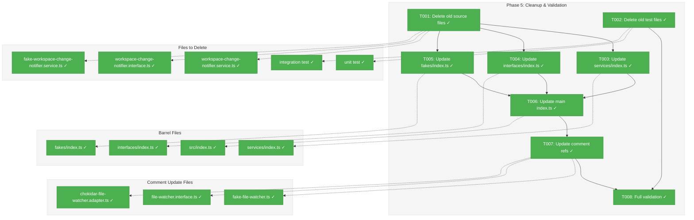
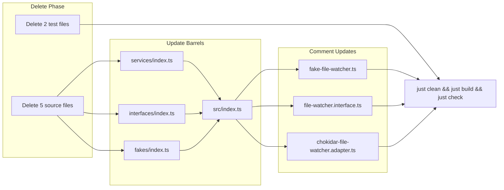
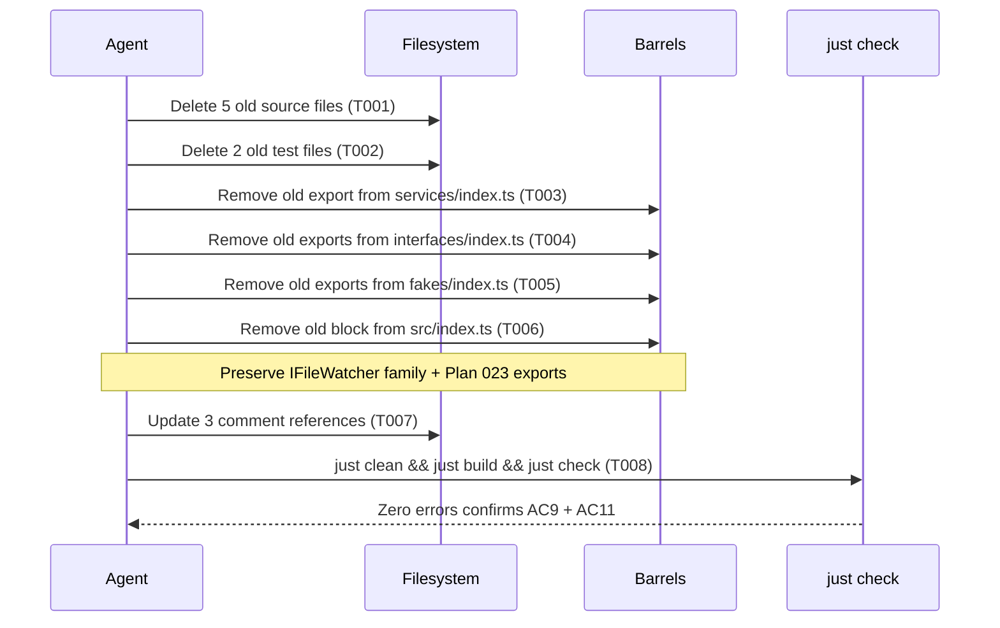

# Phase 5: Cleanup & Validation – Tasks & Alignment Brief

**Spec**: [central-watcher-notifications-spec.md](../../central-watcher-notifications-spec.md)
**Plan**: [central-watcher-notifications-plan.md](../../central-watcher-notifications-plan.md)
**Date**: 2026-02-01

---

## Executive Briefing

### Purpose
This phase removes the old `WorkspaceChangeNotifierService` (Plan 022) and its associated interfaces, fakes, and tests from the codebase. Phases 1–4 built the replacement (`CentralWatcherService` + `WorkGraphWatcherAdapter`) with full TDD coverage. Phase 5 completes the migration by deleting dead code and updating all barrel exports.

### What We're Building
Nothing new — this is a pure cleanup phase. We are:
- Deleting 5 old source files (service, interface, fake)
- Deleting 2 old test files (unit + integration)
- Updating 4 barrel files to remove old exports
- Updating comment references in 3 files to stop mentioning the old service
- Running full validation to confirm zero regressions

### User Value
Eliminates dead code that increases cognitive load and maintenance burden. After this phase, there is exactly one watcher implementation in the codebase.

### Example
**Before**: `packages/workflow/src/services/workspace-change-notifier.service.ts` exists with 36 associated tests
**After**: File deleted, all references removed, `just check` passes with zero failures

---

## Objectives & Scope

### Objective
Remove the old `WorkspaceChangeNotifierService` and all associated artifacts. Verify AC9 (old code removed) and AC11 (`just check` passes).

### Goals

- Delete old source files: service, interface, fake (3 files)
- Delete old test files: unit + integration (2 files)
- Update `services/index.ts` to remove old service export
- Update `interfaces/index.ts` to remove old notifier exports (preserve `IFileWatcher` family)
- Update `fakes/index.ts` to remove old fake exports (preserve `FakeFileWatcher` family)
- Update `packages/workflow/src/index.ts` to remove old notifier block (lines 376–400), preserve `IFileWatcher`/Chokidar/FakeFileWatcher exports (lines 383–393)
- Update comment references in 3 files to reference `CentralWatcherService` instead of old service
- `just clean && just build && just check` passes with zero failures

### Non-Goals

- No new features, interfaces, or implementations
- No DI container registration (deferred to future NG2 plan)
- No SSE integration (NG1)
- No refactoring of the new Phase 1–4 code
- No changes to `packages/shared/src/di-tokens.ts` (DI token already added in Phase 1)
- No changes to `package.json` exports (feature entry already added in Phase 1)

---

## Flight Plan

### Summary Table

| File | Action | Origin | Modified By | Recommendation |
|------|--------|--------|-------------|----------------|
| `packages/workflow/src/services/workspace-change-notifier.service.ts` | Delete | Plan 022 Phase 4 Subtask 001 | — | keep-as-is (delete) |
| `packages/workflow/src/interfaces/workspace-change-notifier.interface.ts` | Delete | Plan 022 Phase 4 Subtask 001 | — | keep-as-is (delete) |
| `packages/workflow/src/fakes/fake-workspace-change-notifier.service.ts` | Delete | Plan 022 Phase 4 Subtask 001 | — | keep-as-is (delete) |
| `test/unit/workflow/workspace-change-notifier.service.test.ts` | Delete | Plan 022 Phase 4 Subtask 001 | — | keep-as-is (delete) |
| `test/integration/workflow/workspace-change-notifier.integration.test.ts` | Delete | Plan 022 Phase 4 Subtask 001 | — | keep-as-is (delete) |
| `packages/workflow/src/services/index.ts` | Modify | Pre-plan | Plan 022 | keep-as-is |
| `packages/workflow/src/interfaces/index.ts` | Modify | Pre-plan | Plan 022 | keep-as-is |
| `packages/workflow/src/fakes/index.ts` | Modify | Pre-plan | Plan 022 | keep-as-is |
| `packages/workflow/src/index.ts` | Modify | Pre-plan | Plan 022, Plan 023 Phases 1–2 | keep-as-is |
| `packages/workflow/src/fakes/fake-file-watcher.ts` | Modify | Plan 022 Phase 4 Subtask 001 | — | keep-as-is |
| `packages/workflow/src/interfaces/file-watcher.interface.ts` | Modify | Plan 022 Phase 4 Subtask 001 | — | keep-as-is |
| `packages/workflow/src/adapters/chokidar-file-watcher.adapter.ts` | Modify | Plan 022 Phase 4 Subtask 001 | — | keep-as-is |

### Compliance Check
No violations found. All deletions are of Plan 022 artifacts that are fully replaced by Plan 023 Phases 1–4.

---

## Requirements Traceability

### Coverage Matrix

| AC | Description | Flow Summary | Files in Flow | Tasks | Status |
|----|-------------|-------------|---------------|-------|--------|
| AC9 | Old service, interface, fake, and 36 tests removed | Delete 5 source + 2 test files; update 4 barrels | 11 files | T001–T006 | Complete |
| AC11 | `just check` passes with zero failures | Run `just clean && just build && just check` | All | T008 | Complete |

### Gaps Found
No gaps — all acceptance criteria have complete file coverage.

### Orphan Files
| File | Tasks | Assessment |
|------|-------|------------|
| `fake-file-watcher.ts` | T007 | Comment update only — not an orphan, this file is preserved |
| `file-watcher.interface.ts` | T007 | Comment update only — preserved |
| `chokidar-file-watcher.adapter.ts` | T007 | Comment update only — preserved |

---

## Architecture Map

### Component Diagram
<!-- Status: grey=pending, orange=in-progress, green=completed, red=blocked -->
<!-- Updated by plan-6 during implementation -->



### Task-to-Component Mapping

<!-- Status: Pending | In Progress | Complete | Blocked -->

| Task | Component(s) | Files | Status | Comment |
|------|-------------|-------|--------|---------|
| T001 | Old source deletion | 3 source files | ✅ Complete | Delete service, interface, fake |
| T002 | Old test deletion | 2 test files | ✅ Complete | Delete unit + integration tests |
| T003 | Services barrel | services/index.ts | ✅ Complete | Remove line 33 |
| T004 | Interfaces barrel | interfaces/index.ts | ✅ Complete | Remove lines 128–133 |
| T005 | Fakes barrel | fakes/index.ts | ✅ Complete | Remove lines 103–110 |
| T006 | Main barrel | src/index.ts | ✅ Complete | Remove lines 376–400; keep 383–393 |
| T007 | Comment references | 3 files | ✅ Complete | Update references to CentralWatcherService |
| T008 | Validation | All | ✅ Complete | `just clean && just build && just check` |

---

## Tasks

| Status | ID | Task | CS | Type | Dependencies | Absolute Path(s) | Validation | Subtasks | Notes |
|--------|------|------|-----|------|--------------|-------------------|------------|----------|-------|
| [x] | T001 | Delete old source files (service, interface, fake) | 1 | Cleanup | – | `/home/jak/substrate/023-central-watcher-notifications/packages/workflow/src/services/workspace-change-notifier.service.ts`, `/home/jak/substrate/023-central-watcher-notifications/packages/workflow/src/interfaces/workspace-change-notifier.interface.ts`, `/home/jak/substrate/023-central-watcher-notifications/packages/workflow/src/fakes/fake-workspace-change-notifier.service.ts` | All 3 files no longer exist on disk | – | Per CF-01: zero runtime consumers · log#task-t001 [^5] |
| [x] | T002 | Delete old test files (unit + integration) | 1 | Cleanup | – | `/home/jak/substrate/023-central-watcher-notifications/test/unit/workflow/workspace-change-notifier.service.test.ts`, `/home/jak/substrate/023-central-watcher-notifications/test/integration/workflow/workspace-change-notifier.integration.test.ts` | Both files no longer exist on disk | – | 36 old tests removed · log#task-t002 [^6] |
| [x] | T003 | Remove `WorkspaceChangeNotifierService` export from `services/index.ts` | 1 | Barrel | T001 | `/home/jak/substrate/023-central-watcher-notifications/packages/workflow/src/services/index.ts` | Lines 32–33 removed; file has no reference to old service | – | Remove comment + export line · log#task-t003 [^7] |
| [x] | T004 | Remove old notifier type exports from `interfaces/index.ts` | 1 | Barrel | T001 | `/home/jak/substrate/023-central-watcher-notifications/packages/workflow/src/interfaces/index.ts` | Lines 128–133 removed; `IFileWatcher` exports (120–126) preserved | – | Keep FileWatcher exports intact · log#task-t004 [^7] |
| [x] | T005 | Remove old fake exports from `fakes/index.ts` | 1 | Barrel | T001 | `/home/jak/substrate/023-central-watcher-notifications/packages/workflow/src/fakes/index.ts` | Lines 103–110 removed; `FakeFileWatcher`/`FakeFileWatcherFactory` exports (100–101) preserved | – | Keep FileWatcher fakes intact · log#task-t005 [^7] |
| [x] | T006 | Update main `index.ts` barrel: remove old notifier block, restructure Plan 022 exports | 2 | Barrel | T003, T004, T005 | `/home/jak/substrate/023-central-watcher-notifications/packages/workflow/src/index.ts` | Lines 376–382 (old service + types) removed. Lines 394–400 (old fake exports) removed. Lines 383–393 (`IFileWatcher`, Chokidar, `FakeFileWatcher`) preserved and re-commented as shared infrastructure. In Plan 023 block: lines 414–415 (`WatcherStartCall`/`WatcherStopCall` aliases) removed, line 416 (`RegisterAdapterCall`) kept (DYK-01/DYK-02). **Line numbers are reference-only; use content-based matching (DYK-05).** | – | Per CF-02: 3-layer barrel chain. Critical: preserve IFileWatcher family · log#task-t006 [^8] |
| [x] | T007 | Update comment references in 3 files to reference `CentralWatcherService` | 1 | Doc | T006 | `/home/jak/substrate/023-central-watcher-notifications/packages/workflow/src/fakes/fake-file-watcher.ts`, `/home/jak/substrate/023-central-watcher-notifications/packages/workflow/src/interfaces/file-watcher.interface.ts`, `/home/jak/substrate/023-central-watcher-notifications/packages/workflow/src/adapters/chokidar-file-watcher.adapter.ts` | No remaining references to `WorkspaceChangeNotifierService` in any of the 3 files | – | Comments only, no code changes · log#task-t007 [^9] |
| [x] | T008 | Run `just clean && just build && just check` — full validation | 1 | Validation | T007 | All project files | Zero lint errors, zero typecheck errors, zero test failures. AC9 + AC11 satisfied. | – | Clean build ensures no stale dist/ artifacts · log#task-t008 [^10] |

---

## Alignment Brief

### Prior Phases Review

#### Phase-by-Phase Summary

**Phase 1 (Interfaces & Fakes)**: Established the type surface — `WatcherEvent`, `IWatcherAdapter`, `ICentralWatcherService` interfaces + `FakeWatcherAdapter`, `FakeCentralWatcherService` fakes. Created PlanPak feature directory (`packages/workflow/src/features/023-central-watcher-notifications/`), package.json exports entry, DI token. 13 tests, all passing. Key discovery: `StartCall`/`StopCall` name collision with old notifier types, resolved via aliases in main barrel (`WatcherStartCall`/`WatcherStopCall`).

**Phase 2 (CentralWatcherService TDD)**: Implemented the core domain-agnostic watcher engine — `CentralWatcherService` (320 lines). Creates one `IFileWatcher` per worktree watching `.chainglass/data/`, watches registry file for workspace add/remove, dispatches events to all registered adapters. 25 tests, all passing. Key patterns: callback-set dispatch, metadata map for path→workspace resolution, serialized rescan queue (`isRescanning` + `rescanQueued`), error isolation at all levels.

**Phase 3 (WorkGraphWatcherAdapter TDD)**: Built the first concrete adapter — `WorkGraphWatcherAdapter` filtering for `state.json` under `work-graphs/` paths, emitting `WorkGraphChangedEvent` (matching old `GraphChangedEvent` shape per CF-09). Subscriber pattern via `onGraphChanged(callback)` returning unsubscribe function. 16 tests, all passing. Key insight: shorter regex `/work-graphs\/([^/]+)\/state\.json$/` proven sufficient (no need for `.chainglass/data/` prefix in pattern).

**Phase 4 (Integration Tests)**: 4 integration tests using real chokidar + real filesystem + temp directories. Verified end-to-end pipeline: file write → chokidar event → `CentralWatcherService` dispatch → `WorkGraphWatcherAdapter` filter → `WorkGraphChangedEvent` emission. Established timing patterns: 200ms init, 1000ms for positive assertions, 500ms for negative. All tests passing. Full suite: 2752 tests across 192 files.

#### Cumulative Deliverables (available to Phase 5)

| Phase | Files Created | Tests |
|-------|-------------|-------|
| 1 | `watcher-adapter.interface.ts`, `central-watcher.interface.ts`, `fake-watcher-adapter.ts`, `fake-central-watcher.service.ts`, feature `index.ts` | 13 unit tests |
| 2 | `central-watcher.service.ts` | 25 unit tests |
| 3 | `workgraph-watcher.adapter.ts` | 16 unit tests |
| 4 | `central-watcher.integration.test.ts` | 4 integration tests |
| **Total** | **6 source + 4 test files** | **58 tests** |

#### Name Collision Resolution (Phase 1 → Phase 5)
Phase 1 discovered that `StartCall`/`StopCall` from `FakeCentralWatcherService` collide with identically named types from old `FakeWorkspaceChangeNotifierService`. Resolved via aliases: `WatcherStartCall`, `WatcherStopCall` in main `index.ts` (lines 414–415). **Phase 5 removes the old types entirely**, so the aliases are no longer needed. DYK-01 confirmed zero consumers of `WatcherStartCall`/`WatcherStopCall` outside the barrel definition itself — no tests or production code imports them. Decision: remove aliases entirely without re-exporting under original names (`StartCall`/`StopCall` are too generic for a 400+ export barrel).

#### Cross-Phase Learnings
- TDD discipline maintained across all 4 phases (RED → GREEN → REFACTOR)
- Error isolation pattern consistently applied (service dispatch + adapter subscribers)
- No mocks used anywhere — all fakes per Constitution Principle 4
- PlanPak feature directory pattern established and working

### Critical Findings Affecting This Phase

| Finding | Constraint | Tasks |
|---------|-----------|-------|
| **CF-01**: Old service has zero runtime consumers | Removal is safe — no gradual migration needed | T001 |
| **CF-02**: Barrel export chain is 3 layers deep | All 4 barrels must update atomically; run `just typecheck` immediately after | T003, T004, T005, T006 |
| **CF-03**: Cleanup scope is 12 files | 5 delete + 2 delete + 4 modify + 3 comment update | All tasks |
| **CF-05**: PlanPak features/ directory | Feature barrel already exists; no changes needed | — |

### ADR Decision Constraints

No ADRs directly constrain Phase 5. ADR-0004 (DI) is relevant only in that the old service was never registered in any DI container, confirming safe removal.

### Invariants & Guardrails

- `IFileWatcher`, `IFileWatcherFactory`, `FileWatcherEvent`, `FileWatcherOptions` exports MUST be preserved (shared infrastructure used by both old and new code)
- `ChokidarFileWatcherAdapter`, `ChokidarFileWatcherFactory` exports MUST be preserved
- `FakeFileWatcher`, `FakeFileWatcherFactory` exports MUST be preserved
- Plan 023 feature exports (lines 402–417 of `src/index.ts`) MUST NOT be modified

### Flow Diagram



### Sequence Diagram



### Test Plan

No new tests. Phase 5 is deletion-only. Validation is:
1. `just clean` — removes stale `dist/` artifacts from deleted files
2. `just build` — confirms no broken imports
3. `just check` — confirms lint + typecheck + all tests pass

Expected: test count drops by ~36 (old notifier tests removed), total should be ~2716 tests.

### Implementation Outline

1. **T001**: `rm` the 3 old source files
2. **T002**: `rm` the 2 old test files
3. **T003**: Edit `services/index.ts` — remove lines 32–33
4. **T004**: Edit `interfaces/index.ts` — remove lines 128–133
5. **T005**: Edit `fakes/index.ts` — remove lines 103–110
6. **T006**: Edit `src/index.ts` — remove lines 376–382 (old service+types) and 394–400 (old fake exports); keep lines 383–393 (IFileWatcher/Chokidar/FakeFileWatcher) and re-label comment from "Workspace change notifier" to "File watcher infrastructure". In Plan 023 block: remove only lines 414–415 (`WatcherStartCall`/`WatcherStopCall` aliases), keep `RegisterAdapterCall` (line 416) per DYK-01/DYK-02
7. **T007**: Update comments in 3 files — replace `WorkspaceChangeNotifierService` references with `CentralWatcherService`
8. **T008**: `just clean && just build && just check`

### Commands to Run

```bash
# T001: Delete old source files
rm packages/workflow/src/services/workspace-change-notifier.service.ts
rm packages/workflow/src/interfaces/workspace-change-notifier.interface.ts
rm packages/workflow/src/fakes/fake-workspace-change-notifier.service.ts

# T002: Delete old test files
rm test/unit/workflow/workspace-change-notifier.service.test.ts
rm test/integration/workflow/workspace-change-notifier.integration.test.ts

# T003–T007: Manual edits (see task descriptions)

# T008: Full validation
just clean && just build && just check
```

### Risks/Unknowns

| Risk | Severity | Mitigation |
|------|----------|-----------|
| Stale `dist/` artifacts cause false typecheck pass | Low | `just clean` before build removes old `.js`/`.d.ts` |
| External consumer of old barrel exports | Very Low | CF-01 confirmed zero runtime consumers; grep confirms no imports outside barrel chain |
| Missed comment reference | Very Low | `grep -r WorkspaceChangeNotifierService` after T007 to verify zero remaining |

### Ready Check

- [x] ADR constraints mapped to tasks — N/A (no ADRs constrain this phase)
- [x] Critical Findings mapped to tasks (CF-01 → T001; CF-02 → T003–T006; CF-03 → all)
- [x] Prior phase review complete (Phases 1–4 synthesized)
- [x] All files identified with absolute paths
- [x] Validation criteria defined for every task
- [x] **GO / NO-GO** — APPROVED, implementation complete

---

## Phase Footnote Stubs

| Footnote | Task | Description |
|----------|------|-------------|
| [^5] | T001 | Deleted 3 old source files (service, interface, fake) |
| [^6] | T002 | Deleted 2 old test files (unit + integration, 36 tests removed) |
| [^7] | T003-T005 | Barrel export cleanup — removed old notifier exports from services/index.ts, interfaces/index.ts, fakes/index.ts |
| [^8] | T006 | Main barrel restructure — removed old notifier block, preserved IFileWatcher family, removed aliases per DYK-01 |
| [^9] | T007 | Comment reference updates in 3 files (fake-file-watcher.ts, file-watcher.interface.ts, chokidar-file-watcher.adapter.ts) |
| [^10] | T008 | Full validation — build 6/6, typecheck 0 errors, 2711 tests passed |

---

## Evidence Artifacts

- **Execution log**: `docs/plans/023-central-watcher-notifications/tasks/phase-5-cleanup-and-validation/execution.log.md` (created by plan-6)
- **Validation output**: Captured in execution log (lint, typecheck, test results)

---

## Discoveries & Learnings

_Populated during implementation by plan-6. Log anything of interest to your future self._

| Date | Task | Type | Discovery | Resolution | References |
|------|------|------|-----------|------------|------------|
| 2026-02-01 | T008 | gotcha | `just clean` doesn't remove `tsconfig.tsbuildinfo` files; stale tsbuildinfo causes `tsc --build` to skip output, leaving `dist/` empty after clean | Clear `tsbuildinfo` files before validating: `rm -f packages/*/tsconfig.tsbuildinfo` | log#task-t008 |
| 2026-02-01 | T008 | gotcha | Turbo's shared worktree cache (`<main-worktree>/.turbo/cache`) can restore stale `dist/` from before file deletions | Clear turbo cache: `rm -rf <main-worktree>/.turbo/cache` | log#task-t008 |
| 2026-02-01 | T003-T005 | gotcha | Removing export blocks leaves trailing blank lines that fail biome formatting | Remove trailing blank line in same edit | log#task-t008 |

**Types**: `gotcha` | `research-needed` | `unexpected-behavior` | `workaround` | `decision` | `debt` | `insight`

**What to log**:
- Things that didn't work as expected
- External research that was required
- Implementation troubles and how they were resolved
- Gotchas and edge cases discovered
- Decisions made during implementation
- Technical debt introduced (and why)
- Insights that future phases should know about

_See also: `execution.log.md` for detailed narrative._

---

## Directory Layout

```
docs/plans/023-central-watcher-notifications/
  ├── central-watcher-notifications-spec.md
  ├── central-watcher-notifications-plan.md
  └── tasks/
      ├── phase-1-interfaces-and-fakes/
      │   ├── tasks.md
      │   └── execution.log.md
      ├── phase-2-centralwatcherservice-tdd/
      │   ├── tasks.md
      │   └── execution.log.md
      ├── phase-3-workgraphwatcheradapter-tdd/
      │   ├── tasks.md
      │   └── execution.log.md
      ├── phase-4-integration-tests/
      │   ├── tasks.md
      │   └── execution.log.md
      └── phase-5-cleanup-and-validation/
          ├── tasks.md          ← this file
          └── execution.log.md  ← created by /plan-6
```

---

## Critical Insights Discussion

**Session**: 2026-02-01
**Context**: Phase 5: Cleanup & Validation tasks dossier
**Analyst**: AI Clarity Agent
**Reviewer**: Development Team
**Format**: Water Cooler Conversation (5 Critical Insights)

### DYK-01: WatcherStartCall/WatcherStopCall Aliases Have Zero Consumers

**Did you know**: The `WatcherStartCall`/`WatcherStopCall` aliases exported from the main barrel (lines 414-415 of `src/index.ts`) have zero consumers — no test or production file imports them.

**Implications**:
- The Alignment Brief incorrectly stated "aliases are already in use by Phase 2+ tests"
- Grep confirmed zero imports outside the barrel definition itself
- Re-exporting as plain `StartCall`/`StopCall` would introduce collision-prone generic names into a 400+ export barrel

**Options Considered**:
- Option A: Remove aliases entirely — don't re-export under any name
- Option B: Replace aliases with direct names (`StartCall`/`StopCall`)
- Option C: Keep aliases as-is

**AI Recommendation**: Option A — Remove entirely
- Reasoning: Zero consumers, generic names are collision-prone, test helpers accessible via feature path

**Decision**: Remove aliases entirely. Do not re-export `StartCall`/`StopCall` under original names.

**Affects**: T006 validation criteria, Alignment Brief section

---

### DYK-02: RegisterAdapterCall Should Stay Per Barrel Convention

**Did you know**: `RegisterAdapterCall` (line 416) also has zero external consumers, but unlike the aliases, it follows the established convention where all fake call-tracking types (`ComposeCall`, `PrepareCall`, `ValidateCall`, etc.) are exported from the main barrel.

**Options Considered**:
- Option A: Remove only the two alias lines (414-415), keep `RegisterAdapterCall`
- Option B: Remove all three call-tracking types

**AI Recommendation**: Option A — Keep `RegisterAdapterCall`
- Reasoning: Matches existing barrel convention for fake call types

**Decision**: Keep `RegisterAdapterCall` in main barrel. Only remove lines 414-415.

**Affects**: T006 implementation details

---

### DYK-03: GraphChangedEvent Name Lives On in New Code — Intentionally

**Did you know**: After deleting the old `GraphChangedEvent` type, the name still appears 6 times in the new `workgraph-watcher.adapter.ts` — as CF-09 documentation comments and a local `GraphChangedCallback` type alias.

**Implications**:
- Comments are intentional CF-09 traceability ("matches old shape")
- Local `type GraphChangedCallback` is private, never exported
- Grep for `GraphChangedCallback` will still find this file post-cleanup

**Options Considered**:
- Option A: Leave it — Phase 5 non-goals forbid refactoring new code
- Option B: Rename local type to `WorkGraphChangedCallback`

**AI Recommendation**: Option A — Leave it
- Reasoning: Phase 5 scope discipline; local type is private and well-named

**Decision**: No action. Phase 5 does not modify Phase 1-4 code.

---

### DYK-04: `just clean` Is Comprehensive — Stale dist/ Risk Is Non-Existent

**Did you know**: The validation risk "stale dist/ artifacts cause false typecheck pass" was rated Low in the risk table. Actual risk is near-zero: `just clean` runs `rm -rf packages/*/dist` which wipes the entire `packages/workflow/dist/` directory.

**Decision**: No action needed. Risk table rating is appropriate. Validation strategy is sound.

---

### DYK-05: T006 Line Numbers Are Fragile — Use Content-Based Matching

**Did you know**: T006 references 3 non-contiguous line ranges (376-382 remove, 383-393 keep, 394-400 remove) plus modifications in the Plan 023 block (414-415 remove). This interleaved remove/keep/remove pattern is the most error-prone operation in the phase if implemented via line-number-based editing.

**Options Considered**:
- Option A: Add content-anchor note to T006
- Option B: Replace all line numbers with content snippets
- Option C: Leave as-is

**AI Recommendation**: Option A — Add content-anchor note
- Reasoning: One-line note costs nothing, prevents mechanical errors

**Decision**: Added note to T006: "Line numbers are reference-only; use content-based matching."

**Affects**: T006 notes

---

## Session Summary

**Insights Surfaced**: 5 critical insights identified and discussed
**Decisions Made**: 5 decisions reached
**Action Items Created**: 0 follow-up tasks (all changes applied inline)
**Areas Updated**:
- T006 validation criteria (DYK-01: alias removal details, DYK-05: content-matching note)
- Alignment Brief (DYK-01: corrected false claim about alias consumers)

**Shared Understanding Achieved**: ✓

**Confidence Level**: High — Phase 5 is pure cleanup with zero ambiguity remaining.

**Next Steps**: GO/NO-GO approval, then `/plan-6-implement-phase --phase "Phase 5: Cleanup & Validation"`
