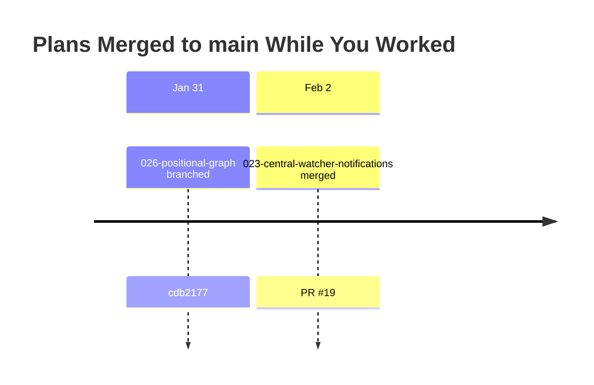

# Merge Plan: Integrating Upstream Changes

**Generated**: 2026-02-02
**Your Branch**: `026-positional-graph` @ `e4ccb88`
**Merging From**: `origin/main` @ `18c4a76`
**Common Ancestor**: `cdb2177` (2026-01-31)

---

## Executive Summary

### What Happened While You Worked

You branched from main **2 days ago**. Since then, **1 plan** landed in main:

| Plan | Merged | Purpose | Risk to You |
|------|--------|---------|-------------|
| 023-central-watcher-notifications | 2026-02-02 | Replace WorkspaceChangeNotifierService with domain-agnostic CentralWatcherService | Low |

### Conflict Summary

- **Direct Conflicts**: 0 files (git merge-tree confirms clean auto-merge)
- **Semantic Conflicts**: 0
- **Regression Risks**: 0 (verified: positional-graph has zero imports from removed services)
- **Overlapping Files**: 3 (all Complementary — different sections modified)

### Recommended Approach

```
git merge origin/main
just check
```

Single-step merge. No manual conflict resolution expected.

---

## Timeline



---

## Upstream Plan Analysis

### Plan 023: Central Watcher Notification System

**Purpose**: Replaces the domain-specific `WorkspaceChangeNotifierService` with a domain-agnostic `CentralWatcherService` that monitors all workspace data directories across all registered workspaces. Domain-specific behavior is handled through pluggable watcher adapters that self-register, declare their file event interests, and transform raw filesystem events into domain-specific events.

| Attribute | Value |
|-----------|-------|
| Merged | 2026-02-02 |
| PR | #19 |
| Files Changed | 59 (30 docs, 11 implementation, 8 tests, 10 legacy removed) |
| Tests Added | 5 unit + 1 integration (net +850 lines) |
| Conflicts with You | 0 direct, 3 overlapping files (all complementary) |

**Key Changes**:
- New `CentralWatcherService` in `packages/workflow/src/features/023-central-watcher-notifications/`
- New `IWatcherAdapter` interface for pluggable domain watchers
- New `WorkGraphWatcherAdapter` as proof-of-concept adapter
- Removed `WorkspaceChangeNotifierService` (283 lines), its interface, fake, and 36 tests
- Added `CENTRAL_WATCHER_SERVICE` DI token to `packages/shared/src/di-tokens.ts`
- Replaced Plan 022 barrel exports with Plan 023 exports in `packages/workflow/src/index.ts`
- Removed workspace change notifier interface exports from `packages/workflow/src/interfaces/index.ts`

---

## Overlapping File Analysis

### 3 Files Modified by Both Branches

All three are classified as **Complementary** — both branches made non-conflicting additions to different sections.

---

### File 1: `packages/shared/src/di-tokens.ts`

**Conflict Type**: Complementary (Auto-Resolvable)

**Your Change**: Added new `POSITIONAL_GRAPH_DI_TOKENS` constant after `WORKSPACE_DI_TOKENS`:
```typescript
export const POSITIONAL_GRAPH_DI_TOKENS = {
  POSITIONAL_GRAPH_SERVICE: 'IPositionalGraphService',
  POSITIONAL_GRAPH_ADAPTER: 'IPositionalGraphAdapter',
  WORK_UNIT_LOADER: 'IWorkUnitLoader',
} as const;
```

**Upstream Change**: Added one token to `WORKSPACE_DI_TOKENS`:
```typescript
CENTRAL_WATCHER_SERVICE: 'ICentralWatcherService',
```

**Reasoning**: Changes target entirely different sections. Upstream appends a property inside `WORKSPACE_DI_TOKENS`; ours adds a separate constant after it. Git auto-merge handles this.

**Resolution**: Accept both. No manual intervention needed.

---

### File 2: `packages/workflow/src/index.ts`

**Conflict Type**: Complementary (Auto-Resolvable)

**Your Change**: Added WorkUnit type re-exports near the top of the file:
```typescript
// WorkUnit types (Plan 026 Phase 1)
export type {
  WorkUnitInput, WorkUnitOutput, AgentConfig, CodeConfig,
  UserInputOption, UserInputConfig, WorkUnit,
} from './interfaces/index.js';
```

**Upstream Change**: Replaced Plan 022 exports at the bottom with Plan 023 exports:
- Removed: `WorkspaceChangeNotifierService`, `IWorkspaceChangeNotifierService`, `GraphChangedEvent`, `GraphChangedCallback`, `FakeWorkspaceChangeNotifierService`, and related fake call types
- Added: `CentralWatcherService`, `ICentralWatcherService`, `IWatcherAdapter`, `WatcherEvent`, `WorkGraphWatcherAdapter`, `FakeCentralWatcherService`, `FakeWatcherAdapter`, `WorkGraphChangedEvent`, `RegisterAdapterCall`

**Reasoning**: Our changes are at the top of the file (line ~82). Upstream changes are at the bottom (line ~376+). Different regions, no overlap. Our branch still has the old Plan 022 exports in its copy, but git merge-tree (using the 3-way ancestor) recognizes that upstream intentionally removed those lines while we didn't touch them — upstream's deletion wins.

**Resolution**: Auto-merge. The result will have our WorkUnit exports at the top and upstream's Plan 023 exports at the bottom, with Plan 022 exports removed.

---

### File 3: `packages/workflow/src/interfaces/index.ts`

**Conflict Type**: Complementary (Auto-Resolvable)

**Your Change**: Added WorkUnit type exports in the middle of the file:
```typescript
// WorkUnit types (Plan 026 Phase 1)
export type {
  WorkUnitInput, WorkUnitOutput, InputDeclaration, OutputDeclaration,
  AgentConfig, CodeConfig, UserInputOption, UserInputConfig, WorkUnit,
} from './workunit.types.js';
```

**Upstream Change**: Removed workspace change notifier interface exports at the end of the file:
```typescript
// Removed: export type { GraphChangedEvent, GraphChangedCallback,
//   IWorkspaceChangeNotifierService } from './workspace-change-notifier.interface.js';
```

**Reasoning**: Our addition and upstream's deletion target different sections. Git 3-way merge applies both changes correctly.

**Resolution**: Auto-merge. Result has our WorkUnit exports and upstream's removal of the old notifier exports.

---

## Dependency Verification

### Does Plan 026 use anything that Plan 023 removed?

| Removed Symbol | Used by Plan 026? | Evidence |
|----------------|-------------------|----------|
| `WorkspaceChangeNotifierService` | No | `grep -r "WorkspaceChangeNotifier" packages/positional-graph/` = 0 results |
| `IWorkspaceChangeNotifierService` | No | Not referenced in any positional-graph source |
| `GraphChangedEvent` | No | Not referenced |
| `GraphChangedCallback` | No | Not referenced |
| `FakeWorkspaceChangeNotifierService` | No | Not referenced |

### What does Plan 026 import from `@chainglass/workflow`?

| Symbol | Status in upstream | Verdict |
|--------|-------------------|---------|
| `WorkspaceContext` | Intact | Safe |
| `WorkspaceDataAdapterBase` | Intact | Safe |
| `WorkUnit` (type) | Intact (our addition) | Safe |

**Conclusion**: Zero breaking dependencies.

---

## Regression Risk Analysis

| Risk | Direction | Likelihood | Impact | Mitigation |
|------|-----------|------------|--------|------------|
| Merge conflicts | N/A | 0% | N/A | `git merge-tree` confirms clean merge |
| Broken imports | Upstream->You | 0% | N/A | All consumed APIs verified intact |
| Test failures | Either | <5% | Low | Test suites are isolated |
| DI token collision | N/A | 0% | N/A | Independent token namespaces |
| Runtime errors | N/A | 0% | N/A | No behavioral changes in consumed APIs |

**Overall Risk: LOW (5/100)**

---

## Merge Execution Plan

### Pre-Merge

```bash
# Create backup branch
git branch backup-20260202-pre-merge
```

### Phase 1: Merge

```bash
git merge origin/main -m "Merge main: integrate Plan 023 central watcher notifications"
```

Expected: Clean auto-merge, no conflict markers.

### Phase 2: Build Validation

```bash
pnpm install   # in case upstream added dependencies
just check     # lint + typecheck + test + build
```

Expected: Zero errors, all tests pass.

### Phase 3: Targeted Verification

```bash
# Positional-graph unit tests
pnpm vitest run test/unit/positional-graph

# Integration tests
pnpm vitest run test/integration/positional-graph

# E2E
npx tsx test/e2e/positional-graph-e2e.ts

# Upstream Plan 023 tests (verify they pass on our branch too)
pnpm vitest run test/unit/workflow/central-watcher
pnpm vitest run test/unit/workflow/workgraph-watcher
pnpm vitest run test/integration/workflow/features/023
```

### Phase 4: Full Suite

```bash
just check
```

Expected: All 2923+ tests pass, 0 failures.

### Rollback

```bash
# If merge fails:
git merge --abort

# If post-merge issues found:
git reset --hard backup-20260202-pre-merge
```

---

## Footnote Reconciliation

### Footnote Number Ranges

- **Your branch**: `[^1]` through `[^15]`
- **Upstream (Plan 023)**: Has its own footnote ledger in `023-central-watcher-notifications-plan.md`

### Conflict Check

No overlap. Each plan has its own footnote ledger in its own plan document. No renumbering needed.

---

## Human Approval Required

Before executing this merge plan, please review:

### Summary Review
- [ ] I understand that 1 upstream plan (023) changed the watcher infrastructure
- [ ] I understand there are 0 direct conflicts (3 overlapping files, all complementary)
- [ ] I understand there are 0 regression risks

### Risk Acknowledgment
- [ ] I will run `just check` after merging
- [ ] I have a rollback plan via `backup-20260202-pre-merge` branch

---

**Proceed with merge execution?**

Type "PROCEED" to begin merge execution, or "ABORT" to cancel.

---

**End of Merge Plan**
