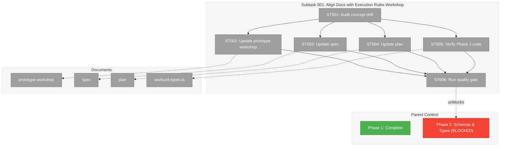
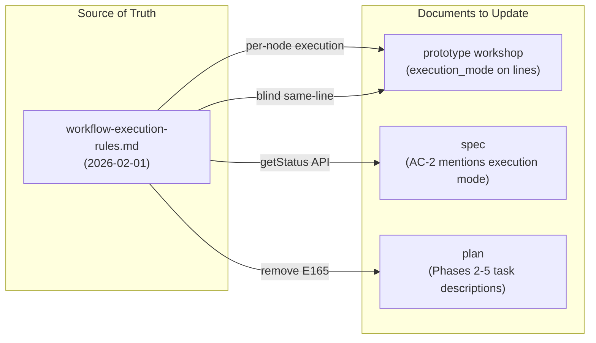
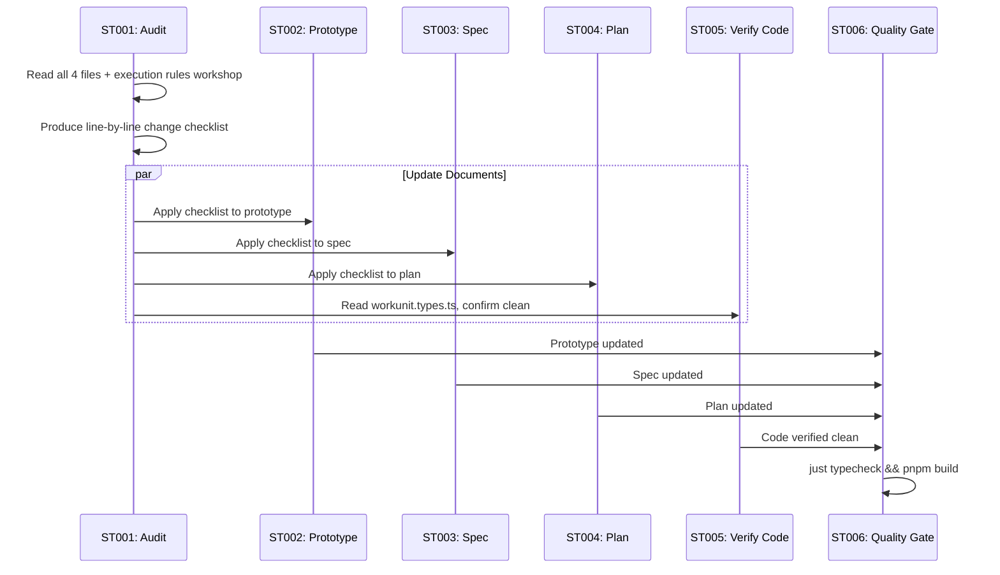

# Subtask 001: Align Spec, Plan, and Prototype Workshop with Execution Rules Workshop

**Parent Plan:** [View Plan](../../positional-graph-plan.md)
**Parent Phase:** Phase 1: WorkUnit Type Extraction
**Parent Task(s):** All T001-T006 (completed), plus forward-looking impact on Phases 2-5
**Plan Task Reference:** [Phases 2-5 in Plan](../../positional-graph-plan.md#phase-2-schema-types-and-filesystem-adapter)

**Why This Subtask:**
The execution rules workshop (`workshops/workflow-execution-rules.md`) introduced several significant design changes that create concept drift with the spec, plan, and prototype workshop. The most impactful change is moving `execution_mode` from a **line-level** property to a **per-node** `execution` property. Without alignment, Phase 2+ implementation will follow stale design documents. Additionally, Phase 1 code should be verified for any drift (expected clean — WorkUnit types have no execution fields).

**Created:** 2026-02-01
**Requested By:** User (post-workshop alignment)

---

## Executive Briefing

### Purpose
Remediate concept drift between the new execution rules workshop and the three pre-existing design documents (spec, plan, prototype workshop). The execution rules workshop is now the authoritative source for execution semantics, and the other documents must align with it before Phase 2 implementation begins.

### What We're Building
A documentation alignment pass that:
- Moves `execution_mode` from lines to per-node `execution` property (serial default) across all documents
- Removes E165 "forward reference" error (forward refs now resolve as `waiting`)
- Replaces `canRun`/`status` separate methods with the `getStatus` three-level API pattern
- Updates same-line resolution from "serial only" to blind (any node can reference positions < N)
- Updates the prototype workshop's service interface sketch and Zod schemas
- Adds the execution rules workshop to the spec's Research Context
- Confirms Phase 1 code has no concept drift

### Unblocks
- Phase 2 implementation (schemas, types, adapter) — currently blocked by stale design docs
- Phase 3-5 implementation — task descriptions reference deprecated patterns

### Summary of Drift

| Concept | Old (Spec/Plan/Prototype) | New (Execution Rules Workshop) |
|---------|---------------------------|-------------------------------|
| Execution mode scope | Line-level `execution_mode: parallel \| serial` | Per-node `execution: serial \| parallel` |
| Default execution | `parallel` (on line) | `serial` (on node) |
| Forward references | E165 error | Resolves as `waiting` (not an error) |
| Same-line resolution | Serial lines only | Blind to serial/parallel — walk positions < N |
| Status API | Separate `canRun()` + `status()` methods | `getNodeStatus` / `getLineStatus` / `getStatus` |
| Service interface | `setLineMode()` on service | Removed — node-level execution set at add time or via `setNodeExecution` |

---

## Objectives & Scope

### Objective
Align all pre-existing design documents with the execution rules workshop so that Phase 2+ implementation follows a consistent, authoritative design.

### Goals

- ✅ Update prototype workshop: per-node execution, remove E165, update service interface sketch, update Zod schemas
- ✅ Update spec: per-node execution in AC-2, add execution rules workshop reference
- ✅ Update plan: per-node execution in Phase 2-5 task descriptions, remove E165 test references, update Phase 5 for `getStatus` API
- ✅ Verify Phase 1 code (workunit.types.ts) has no concept drift
- ✅ Run quality gate (typecheck + build) to confirm no breakage

### Non-Goals

- ❌ Implementing any code changes (documentation only, except quality gate)
- ❌ Rewriting the execution rules workshop (it's the source of truth)
- ❌ Updating the research dossier (it reflects historical analysis, not current design)
- ❌ Creating new ADRs (no architectural decisions changed — just moved scope of existing concept)
- ❌ Updating Phase 1 tasks.md (completed phase — record drift in this subtask's log instead)

---

## Flight Plan

### Summary Table
| File | Action | Origin | Modified By | Recommendation |
|------|--------|--------|-------------|----------------|
| `docs/plans/026-positional-graph/workshops/positional-graph-prototype.md` | Modify | Plan 026 (2026-01-31) | — | cross-plan-edit |
| `docs/plans/026-positional-graph/positional-graph-spec.md` | Modify | Plan 026 (2026-01-31) | — | cross-plan-edit |
| `docs/plans/026-positional-graph/positional-graph-plan.md` | Modify | Plan 026 (2026-01-31) | Phase 1 completion | cross-plan-edit |
| `packages/workflow/src/interfaces/workunit.types.ts` | Read-only | Plan 026 Phase 1 | — | keep-as-is |

### Per-File Detail

#### `workshops/positional-graph-prototype.md`
- **Provenance**: Created in Plan 026 pre-spec workshop phase
- **Drift scope**: Heaviest changes — ERD, Zod schemas, service interface, CLI commands, error codes, canRun rules, input resolution rules, examples
- **Key sections requiring update**: §Conceptual Model (ERD line 81), §graph.yaml (lines 137-158), §Zod Schemas (lines 189-237), §canRun Rules (lines 563-598), §Input Resolution (lines 737-845), §Service Interface Sketch (lines 999-1103), §Error Codes (lines 1107-1131)

#### `positional-graph-spec.md`
- **Provenance**: Created in Plan 026 specify phase
- **Drift scope**: AC-2 (line operations mention execution mode), Goal 6, Research Context, Complexity section
- **Key sections requiring update**: §Research Context (line 6-15), §Goals (line 31), §Acceptance Criteria AC-2 (line 90), §Risks (line 110)

#### `positional-graph-plan.md`
- **Provenance**: Created in Plan 026 architect phase, updated with Phase 1 completion footnote
- **Drift scope**: Phase 2 tasks (schemas, error codes), Phase 3 tasks (line operations), Phase 5 tasks (canRun, E165), test examples, acceptance criteria across phases
- **Key sections requiring update**: Workshops reference (line 11), Phase 2 tasks 2.2-2.7, Phase 3 tasks 3.4-3.5, Phase 5 tasks 5.3-5.9, test examples, acceptance criteria

#### `packages/workflow/src/interfaces/workunit.types.ts`
- **Provenance**: Plan 026 Phase 1
- **Drift scope**: None expected — WorkUnit types define inputs/outputs/config, not execution semantics
- **Compliance**: Clean — no execution-related fields

### Compliance Check
No violations found. All changes are documentation-only.

---

## Requirements Traceability

_Generated by `/plan-5c-requirements-flow` — traces each AC through exact file locations._

### Coverage Matrix

| AC | Description | Flow Summary | Files in Flow | Tasks | Status |
|----|-------------|-------------|---------------|-------|--------|
| AC-S1 | Line-level `execution_mode` → per-node `execution` | prototype (8 sites) → spec (1 site) → plan (3 sites) | 3 docs, 12 sites | ST001,ST002,ST003,ST004 | ✅ Complete |
| AC-S2 | Remove E165 forward reference error | prototype (2 sites) → plan (4 sites) | 2 docs, 6 sites | ST001,ST002,ST004 | ✅ Complete |
| AC-S3 | `canRun`/`status` → `getStatus` three-level API | prototype (15+ sites) → spec (6 sites) → plan (18+ sites) | 3 docs, 39+ sites | ST001,ST002,ST003,ST004 | ⚠️ Gap: spec needs update |
| AC-S4 | Same-line resolution: "serial only" → blind | prototype (2 sites) | 1 doc, 2 sites | ST001,ST002 | ✅ Complete |
| AC-S5 | Default from `parallel` (line) → `serial` (node) | prototype (2 sites) → plan (1 site) | 2 docs, 3 sites | ST001,ST002,ST004 | ✅ Complete |
| AC-S6 | Remove `setLineMode`, update service interface | prototype (3 sites) → plan (1 site) | 2 docs, 4 sites | ST001,ST002,ST004 | ✅ Complete |
| AC-S7 | Spec references execution rules workshop | spec (§Research Context) + plan (§Workshops) | 2 docs, 2 sites | ST003,ST004 | ⚠️ Gap: plan needs update too |
| AC-S8 | Phase 1 code review — no concept drift | workunit.types.ts (0 hits) | 1 file, 0 sites | ST005 | ✅ Complete (confirmed clean) |

### Flow Details

#### AC-S1: Per-node execution (12 sites across 3 docs)

**Prototype workshop** — 8 sites:
1. Line 81: ERD `string execution_mode "parallel | serial"` on Line entity → move to Node entity as `execution` (ST002) ✅
2. Lines 137, 145, 154: graph.yaml examples `execution_mode: parallel/serial` → remove from lines (ST002) ✅
3. Line 164: "Line `execution_mode` controls how nodes **within** a line run" → rewrite for per-node (ST002) ✅
4. Line 207: Zod `execution_mode: ExecutionModeSchema.default('parallel')` on `LineDefinitionSchema` → move to `NodeConfigSchema`, default `serial` (ST002) ✅
5. Line 390: graph.yaml example `execution_mode: parallel` → remove (ST002) ✅
6. Lines 195-196: `ExecutionModeSchema` and `ExecutionMode` type → rename or move context (ST002) ✅

**Spec** — 1 site:
7. Line 90: AC-2 "have their label, description, execution mode, and transition set" → remove execution mode from line properties, add per-node execution (ST003) ✅

**Plan** — 3 sites:
8. Line 413: Task 2.2 "execution_mode/transition enums" → change to per-node `execution` enum (ST004) ✅
9. Line 440: Test example `execution_mode: 'parallel'` → remove from graph schema example (ST004) ✅
10. Line 510: AC "Line properties (label, description, execution_mode, transition)" → remove `execution_mode` (ST004) ✅

#### AC-S2: Remove E165 (6 sites across 2 docs)

**Prototype workshop** — 2 sites:
1. Line 654: Comment `// E160-E165` → change to `// E160-E164` (ST002) ✅
2. Line 1125: Error table `E165 | Forward reference | Referenced node is on a later line` → delete row (ST002) ✅

**Plan** — 4 sites:
3. Line 181: Critical Discovery 12 "E160-E165 for input resolution errors" → change to E160-E164 (ST004) ✅
4. Line 584: Task 5.3 "error (forward reference E165)" → remove this test case (ST004) ✅
5. Line 586: Task 5.5 "node not in preceding lines E165" → remove, replace with "waiting" behavior (ST004) ✅
6. Line 629: AC "Forward references detected and reported as E165" → remove this AC (ST004) ✅

#### AC-S3: getStatus API (39+ sites — mostly `canRun` references that need contextual update)

This is the most nuanced AC. The execution rules workshop §12 introduces `getNodeStatus`/`getLineStatus`/`getStatus` as the public API, with `canRun` becoming an internal concept (readiness is a field on the status object, not a separate method). The spec, plan, and prototype all expose `canRun` as a **top-level service method**. This needs careful alignment:

**Prototype workshop** — key sites:
1. Lines 563-598: §canRun Rules → add note referencing execution rules workshop §12 for getStatus API (ST002) ✅
2. Lines 714-723: `canRun()` interface definition → update to show it's consumed by `getNodeStatus` internally (ST002) ✅
3. Line 1031: `IPositionalGraphService.canRun()` → replace with `getNodeStatus`/`getLineStatus`/`getStatus` (ST002) ✅
4. Line 1032: `status()` method → replace with `getStatus` (ST002) ✅
5. Lines 1086-1102: `PGStatusResult` → update to reference `GraphStatus`/`LineStatus`/`NodeStatus` from execution rules workshop (ST002) ✅

**Spec** — key sites:
6. Line 37: Goal 7 "consumed by both `canRun`..." → note getStatus is the public API (ST003) ✅
7. Line 95: AC-7 "`canRun` computation" → update to reference `getStatus` pattern (ST003) ✅
8. Line 96: AC-8 "`canRun` result" → update (ST003) ✅

**Plan** — key sites:
9. Line 560: Phase 5 objective "`canRun`/`status` computation" → "`getStatus` computation" (ST004) ✅
10. Line 565: Deliverable "`canRun` — node executability check" → `getNodeStatus`/`getLineStatus`/`getStatus` (ST004) ✅
11. Lines 589-590: Tasks 5.8-5.9 "canRun rules/tests" → rename to getStatus pattern (ST004) ✅
12. Line 627: AC "`canRun` checks..." → update (ST004) ✅
13. Line 658: Task 6.4 "canrun command" → update to `status` command pattern (ST004) ✅

**Note on `canRun` vs `getStatus`**: The execution rules workshop §12 explicitly says "No separate `canRun` or `canExecute` methods — readiness is a field on the status object." However, the workshop §5 still describes the "canRun Algorithm" as the internal logic. The resolution: `canRun` is an **internal algorithm** (4 gates), `getStatus` is the **public API**. The prototype workshop and plan should expose `getStatus` methods, not `canRun` methods. Internal algorithm docs can still use "canRun" as a concept name.

#### AC-S4: Same-line resolution blind (2 sites, 1 doc)

**Prototype workshop**:
1. Line 584: "Serial predecessor complete (serial lines only)" → update to per-node serial check (ST002) ✅
2. Line 782: "Same-line resolution (serial only) — in a serial line, a node can reference an earlier-position node" → remove "serial only" qualifier, allow for any execution mode (ST002) ✅

#### AC-S5: Default serial (3 sites, 2 docs)

**Prototype workshop**:
1. Line 165: "`parallel` — all nodes can run simultaneously (default)" → serial is default (ST002) ✅
2. Line 207: `ExecutionModeSchema.default('parallel')` → default `'serial'` on node schema (ST002) ✅

**Plan**:
3. Line 440: Test example `execution_mode: 'parallel'` → remove or change default (ST004) ✅

#### AC-S6: Remove setLineMode (4 sites, 2 docs)

**Prototype workshop**:
1. Line 330: CLI table `line set <graph> <lineId> --mode <mode>` → remove row (ST002) ✅
2. Line 1013: `setLineMode(...)` method → remove from interface (ST002) ✅
3. Line 1041: `mode?: ExecutionMode` in `AddLineOptions` → remove (ST002) ✅

**Plan**:
4. Line 501 (task 3.4): "set mode/transition/label/description" → remove "mode" (ST004) ✅

#### AC-S7: Workshop cross-references (2 sites, 2 docs)

**Spec**:
1. Lines 6-15: §Research Context references only prototype workshop → add execution rules workshop (ST003) ✅

**Plan**:
2. Lines 10-11: §Workshops lists only prototype workshop → add execution rules workshop link (ST004) ✅

**Note**: The plan header was missed in the original AC-S7 definition (listed only spec). ST004 already covers this in its task description item "(1) §Workshops: add execution rules workshop link", so no gap in task coverage — but the AC description should note both docs.

#### AC-S8: Phase 1 code clean (0 sites, confirmed)

**workunit.types.ts**:
- Grep for `execution_mode`, `execution mode`, `canRun`, `E165`, `setLineMode`: **0 results**
- File contains only I/O type definitions: `WorkUnitInput`, `WorkUnitOutput`, `AgentConfig`, `CodeConfig`, `UserInputOption`, `UserInputConfig`, `WorkUnit`
- **Confirmed clean** — no concept drift (ST005) ✅

### Gaps Found

#### Gap 1: AC-S7 scope underspecified — plan also needs workshop reference

The plan's §Workshops header (line 10-11) only lists the prototype workshop. The execution rules workshop needs to be added here too. The AC-S7 description says "Spec references execution rules workshop" but should say "Spec and plan reference execution rules workshop."

- **Impact**: LOW — ST004's task description already includes "(1) §Workshops: add execution rules workshop link", so the task table covers this. The AC description is just slightly narrow.
- **Suggested action**: Update AC-S7 description to "Spec and plan reference execution rules workshop" for accuracy.

#### Gap 2: AC-S3 nuance — `canRun` internal algorithm vs `getStatus` public API

The task descriptions for ST002 and ST004 reference "rename canRun to getStatus" but the resolution is more nuanced: `canRun` remains a valid **internal algorithm concept** (§5 of execution rules workshop), while `getStatus` is the **public service API** (§12). The prototype workshop's §canRun Rules section should remain but add a forward reference to getStatus, not be wholesale renamed.

- **Impact**: MEDIUM — if the implementer interprets "rename canRun" too literally, they could remove valuable algorithm documentation from the prototype workshop.
- **Suggested action**: Clarify in ST002 and ST004 that `canRun` as an algorithm concept persists; only the **public API methods** change to `getStatus`.

### Orphan Files

All task table files map to at least one acceptance criterion. No orphans.

---

## Architecture Map

### Component Diagram
<!-- Status: grey=pending, orange=in-progress, green=completed, red=blocked -->
<!-- Updated by plan-6 during implementation -->



### Task-to-Component Mapping

<!-- Status: Pending | In Progress | Complete | Blocked -->

| Task | Component(s) | Files | Status | Comment |
|------|-------------|-------|--------|---------|
| ST001 | All docs | All 4 files (read-only) | ⬜ Pending | Systematic audit producing change checklist |
| ST002 | Prototype workshop | positional-graph-prototype.md | ⬜ Pending | Heaviest edits — ERD, schemas, interface, error codes |
| ST003 | Spec | positional-graph-spec.md | ⬜ Pending | AC-2, Research Context, Goals |
| ST004 | Plan | positional-graph-plan.md | ⬜ Pending | Phases 2-5 task descriptions, test examples |
| ST005 | Phase 1 code | workunit.types.ts | ⬜ Pending | Read-only verification — expected clean |
| ST006 | Quality gate | — | ⬜ Pending | `just typecheck && pnpm build` |

---

## Tasks

| Status | ID | Task | CS | Type | Dependencies | Absolute Path(s) | Validation | Subtasks | Notes |
|--------|------|------|-----|------|-------------|-------------------------------|-------------------------------|----------|-------|
| [ ] | ST001 | Audit all concept drift between execution rules workshop and spec, plan, prototype workshop. Produce a line-by-line change checklist organized by document. | 2 | Setup | – | `/home/jak/substrate/026-positional-graph/docs/plans/026-positional-graph/workshops/workflow-execution-rules.md`, `/home/jak/substrate/026-positional-graph/docs/plans/026-positional-graph/positional-graph-spec.md`, `/home/jak/substrate/026-positional-graph/docs/plans/026-positional-graph/positional-graph-plan.md`, `/home/jak/substrate/026-positional-graph/docs/plans/026-positional-graph/workshops/positional-graph-prototype.md` | Change checklist produced, covers all 8 ACs | – | Read-only audit. Source of truth: workflow-execution-rules.md |
| [ ] | ST002 | Update prototype workshop (`positional-graph-prototype.md`) to align with execution rules workshop. Changes: (1) ERD: move `execution_mode` from Line to Node as `execution`, change default to `serial`; (2) graph.yaml example: remove `execution_mode` from lines; (3) Zod schemas: remove `ExecutionModeSchema` from `LineDefinitionSchema`, add `execution` to `NodeConfigSchema`; (4) §canRun rules: update Gate 3 for per-node serial/parallel; (5) §Input Resolution: remove "serial only" from same-line resolution; (6) §Service Interface: make this the **canonical, complete** `IPositionalGraphService` definition — remove `setLineMode()`, remove `mode` from `AddLineOptions`, add `execution` to `AddNodeOptions` and `NodeConfigSchema`, replace `canRun()`/`status()` public methods with `getNodeStatus`/`getLineStatus`/`getStatus`, replace `PGStatusResult` and `CanRunResult` types with `NodeStatus`/`LineStatus`/`GraphStatus`/`StarterReadiness` from execution rules workshop §12 (keep CRUD result types like `AddLineResult`, `AddNodeResult`, `NodeShowResult` as-is), incorporate those status interfaces directly into this section (not as a cross-reference — the prototype workshop owns the interface, the execution rules workshop owns the algorithms); (7) §Error Codes: remove E165; (8) Update all CLI examples showing line `--mode`; (9) §Status Computation: update to reflect `getStatus` API (prototype workshop is the canonical interface source). NOTE: `canRun` as an internal algorithm concept (§5 of execution rules workshop) remains valid — keep §canRun Rules section but add cross-reference. Only the **public service API** changes to `getStatus`. | 3 | Core | ST001 | `/home/jak/substrate/026-positional-graph/docs/plans/026-positional-graph/workshops/positional-graph-prototype.md` | All `execution_mode` refs on lines removed; `execution` on nodes; E165 removed; service interface aligned; cross-check with execution rules workshop | – | Heaviest edits. Execution rules workshop is authoritative for conflicts. |
| [ ] | ST003 | Update spec (`positional-graph-spec.md`) to align with execution rules workshop. Changes: (1) §Research Context: add reference to `workshops/workflow-execution-rules.md`; (2) §Goals Goal 6: update "status computation from position" to mention per-node execution; (3) AC-2: change "execution mode" on lines to per-node execution; (4) AC-7: update `canRun` description to reference `getStatus` API (canRun remains as internal algorithm; public API is getStatus); (5) AC-8: update status display to reference `getStatus`; (6) §Risks: update line reordering risk to mention per-node execution; (7) §Workshop Opportunities: add execution rules workshop row | 2 | Core | ST001 | `/home/jak/substrate/026-positional-graph/docs/plans/026-positional-graph/positional-graph-spec.md` | All line-level execution_mode refs updated; execution rules workshop referenced; ACs aligned | – | Spec is the normative requirement doc — changes must be precise |
| [ ] | ST004 | Update plan (`positional-graph-plan.md`) to align with execution rules workshop. Changes: (1) §Workshops: add execution rules workshop link; (2) Phase 2 task 2.2: change "execution_mode/transition enums" to per-node `execution` enum; (3) Phase 2 task 2.3: update schema list; (4) Phase 2 tasks 2.6-2.7: remove E165 from error code range (now E150-E164, E170-E171); (5) Phase 3 task 3.4: remove "set mode" from line operations; (5b) Phase 4: add `setNodeExecution` to node operations scope (node set --execution serial|parallel) — execution rules workshop says execution is set "at add time or via setNodeExecution"; (6) Phase 3 AC: remove "execution_mode" from line properties; (7) Phase 5 tasks 5.3, 5.5: remove E165 forward reference tests; (8) Phase 5 tasks 5.8-5.11: update public API from `canRun()`/`status()` to `getNodeStatus`/`getLineStatus`/`getStatus` (canRun remains valid as internal algorithm concept); (9) Phase 5 AC: update to reference `getStatus` pattern; (10) Phase 5 test example: update forward reference handling; (11) Critical Discovery 09 note: add per-node execution detail; (12) Critical Discovery 12: update error code ranges — input resolution is now E160-E164 (E165 removed); (13) Add workshop to Critical Findings; (14) Phase 6 task 6.4: update `canrun` command to align with `getStatus` API | 3 | Core | ST001 | `/home/jak/substrate/026-positional-graph/docs/plans/026-positional-graph/positional-graph-plan.md` | All phases aligned with execution rules workshop; E165 removed; getStatus pattern referenced; task descriptions current | – | Cascading changes across Phases 2-5. Must not break existing Phase 1 completion markers. |
| [ ] | ST005 | Verify Phase 1 code (`workunit.types.ts`) has no concept drift from execution rules workshop. Check: WorkUnit interface has no execution-related fields; InputDeclaration/OutputDeclaration are pure I/O types. | 1 | Validation | ST001 | `/home/jak/substrate/026-positional-graph/packages/workflow/src/interfaces/workunit.types.ts` | Confirmed clean — no execution fields in WorkUnit types | – | Expected: no changes needed. WorkUnit types define I/O ports, not execution semantics. |
| [ ] | ST006 | Run quality gate: `just typecheck && pnpm build`. Documentation changes shouldn't affect code, but verify no accidental breakage. | 1 | Validation | ST002, ST003, ST004, ST005 | – | `just typecheck` zero errors; `pnpm build` success | – | Final gate before marking subtask complete |

---

## Alignment Brief

### Critical Findings Affecting This Subtask

**Execution Rules Workshop (2026-02-01) — Authoritative Design Changes**

The execution rules workshop introduced several design changes during iterative refinement with the user. These are now authoritative and supersede conflicting content in earlier documents:

1. **Per-node execution mode** — `execution: serial | parallel` is a property on each node, not the line. Serial is the default. A single line can mix serial and parallel nodes to create independent execution chains.
2. **E165 removed** — Forward references are not errors. If a `from_unit` search doesn't find a match in the backward traversal, the input resolves as `waiting`. The referenced unit might be moved to a preceding line later.
3. **`getStatus` API pattern** — Three levels: `getNodeStatus`, `getLineStatus`, `getStatus` (graph). One verb, everything in one object. Replaces separate `canRun()` and `status()` methods.
4. **Same-line resolution blind to execution mode** — Any node at position N can reference positions < N on the same line regardless of serial/parallel. The execution flag controls when a node starts, not what it can see.
5. **Chain-starters** — Position 0 and any parallel node that breaks a serial chain. A line `canRun` when at least one starter is ready (not all).
6. **No short-circuiting** — Status checks always fully resolve everything. Transition gate is just one data point.

### ADR Decision Constraints

No ADRs directly constrain this subtask. All changes are documentation alignment — no architectural decisions changed.

### Invariants & Guardrails

- **Do not modify execution rules workshop** — it is the source of truth for execution algorithms and rules
- **Prototype workshop owns the service interface** — after alignment, the prototype workshop's §Service Interface is the canonical `IPositionalGraphService` definition (CRUD + status). The execution rules workshop defines the algorithms (canRun gates, collateInputs traversal, status computation rules); the prototype workshop defines the API surface.
- **Do not modify Phase 1 code** — Phase 1 is complete and clean
- **Do not modify Phase 1 tasks.md** — completed phase, record findings in this subtask's log
- **Preserve Phase 1 completion markers** — plan checkboxes, footnote [^1], progress tracking
- **Prototype workshop remains a valid design document** — update it, don't deprecate it. It covers CRUD operations and data model that the execution rules workshop doesn't replicate.

### Inputs to Read

| File | Purpose |
|------|---------|
| `workshops/workflow-execution-rules.md` | **Source of truth** — authoritative execution semantics |
| `workshops/positional-graph-prototype.md` | Target for updates — data model, schemas, service interface |
| `positional-graph-spec.md` | Target for updates — acceptance criteria, goals |
| `positional-graph-plan.md` | Target for updates — phase task descriptions |
| `packages/workflow/src/interfaces/workunit.types.ts` | Verification target — confirm no drift |

### Visual Alignment Aids

#### Concept Drift Flow



#### Drift Resolution Sequence



### Test Plan

**Approach**: No code tests needed. Documentation-only changes. Quality gate (`just typecheck && pnpm build`) confirms no accidental code breakage.

**Validation method**: Manual review — each AC checked against the execution rules workshop to confirm alignment.

### Step-by-Step Implementation Outline

1. **ST001** — Read execution rules workshop and cross-reference with spec/plan/prototype. Produce a change checklist organized by file, with line numbers and exact text to change.
2. **ST002** — Edit prototype workshop: update ERD, Zod schemas, graph.yaml examples, canRun rules, input resolution, service interface, error codes, CLI examples. Heaviest task.
3. **ST003** — Edit spec: update Research Context, Goals, AC-2, AC-7, AC-8, Risks, Workshop Opportunities.
4. **ST004** — Edit plan: update Workshops header, Phase 2-5 tasks, test examples, acceptance criteria. Preserve Phase 1 completion markers.
5. **ST005** — Read workunit.types.ts, confirm no execution-related fields. Expected: clean, no changes.
6. **ST006** — Run `just typecheck && pnpm build`. Confirm zero errors.

### Commands to Run

```bash
# Quality gate (ST006)
just typecheck
pnpm build
```

### Risks & Unknowns

| Risk | Severity | Mitigation |
|------|----------|------------|
| Prototype workshop edits are large and could introduce inconsistencies | MEDIUM | Use the execution rules workshop as the single reference; cross-check each section |
| Plan task description changes could invalidate Phase 2 dossier work | LOW | Phase 2 dossier doesn't exist yet — this subtask runs before it |
| Accidentally modifying Phase 1 completion markers | LOW | Explicit guardrail in invariants; verify after edits |

### Ready Check

- [x] Execution rules workshop read and understood
- [x] All 8 ACs defined with clear scope
- [x] Source of truth established (workflow-execution-rules.md)
- [x] Files to modify identified with specific sections
- [x] No code changes required (documentation only)
- [x] Quality gate command identified

---

## Phase Footnote Stubs

| Footnote | Added By | Date | Description |
|----------|----------|------|-------------|
| | | | |

_Populated during implementation by plan-6._

---

## Evidence Artifacts

- **Execution log**: `001-subtask-align-docs-with-execution-rules-workshop.execution.log.md`
- **Source of truth**: `docs/plans/026-positional-graph/workshops/workflow-execution-rules.md`
- **Changed documents**: spec, plan, prototype workshop (diffs in execution log)

---

## Discoveries & Learnings

_Populated during implementation by plan-6. Log anything of interest to your future self._

| Date | Task | Type | Discovery | Resolution | References |
|------|------|------|-----------|------------|------------|
| | | | | | |

**Types**: `gotcha` | `research-needed` | `unexpected-behavior` | `workaround` | `decision` | `debt` | `insight`

**What to log**:
- Things that didn't work as expected
- External research that was required
- Implementation troubles and how they were resolved
- Gotchas and edge cases discovered
- Decisions made during implementation
- Technical debt introduced (and why)
- Insights that future phases should know about

_See also: `execution.log.md` for detailed narrative._

---

## After Subtask Completion

**This subtask resolves a blocker for:**
- Phase 2: Schema, Types, and Filesystem Adapter — task descriptions will match authoritative design
- Phases 3-5: Implementation tasks will reference correct execution model

**When all ST### tasks complete:**

1. **Record completion** in parent execution log:
   ```
   ### Subtask 001-subtask-align-docs-with-execution-rules-workshop Complete

   Resolved: All design documents aligned with execution rules workshop.
   Per-node execution model, getStatus API, E165 removal, blind same-line resolution.
   See detailed log: [subtask execution log](./001-subtask-align-docs-with-execution-rules-workshop.execution.log.md)
   ```

2. **Update plan progress:**
   - Open: [`positional-graph-plan.md`](../../positional-graph-plan.md)
   - Find: Subtasks Registry (added by this command)
   - Update Status: `[ ] Pending` → `[x] Complete`

3. **Resume Phase 2 preparation:**
   ```bash
   /plan-5-phase-tasks-and-brief --phase "Phase 2: Schema, Types, and Filesystem Adapter" \
     --plan "/home/jak/substrate/026-positional-graph/docs/plans/026-positional-graph/positional-graph-plan.md"
   ```

**Quick Links:**
- [Parent Dossier](../tasks.md)
- [Parent Plan](../../positional-graph-plan.md)
- [Parent Execution Log](./execution.log.md)
- [Execution Rules Workshop (Source of Truth)](../../workshops/workflow-execution-rules.md)

---

## Critical Insights Discussion

**Session**: 2026-02-01
**Context**: Subtask 001 — Align Docs with Execution Rules Workshop (pre-implementation review)
**Analyst**: AI Clarity Agent
**Reviewer**: Development Team
**Format**: Water Cooler Conversation (5 Critical Insights)

### Insight 1: Service Interface Ownership After Alignment

**Did you know**: After ST002 updates the prototype workshop's service interface, two workshops would contain competing interface definitions with no clear hierarchy.

**Implications**:
- Implementers of Phase 3+ would need to mentally merge two documents
- Method signatures could drift between documents
- Plan references "workshop §Service Interface" without specifying which

**Options Considered**:
- Option A: Cross-reference notes in each workshop
- Option B: Define canonical split in the plan
- Option C: Consolidate interface into one workshop

**AI Recommendation**: Option B
- Reasoning: Annotate the plan to point implementers to the right workshop per domain

**Discussion Summary**:
User challenged the premise — why keep the old interface as a "sketch" when we're editing the prototype workshop anyway? Just fix it to be the complete, canonical interface. Simpler and more direct.

**Decision**: Prototype workshop owns the canonical `IPositionalGraphService` interface (CRUD + status). ST002 incorporates `NodeStatus`/`LineStatus`/`GraphStatus`/`StarterReadiness` types directly into the prototype's §Service Interface section. Execution rules workshop owns algorithms; prototype workshop owns the API surface.

**Action Items**:
- [x] Updated ST002 task description to specify canonical interface ownership
- [x] Added invariant to Alignment Brief clarifying document roles

**Affects**: ST002 task description, Alignment Brief invariants

---

### Insight 2: Error Code Range Inconsistencies After E165 Removal

**Did you know**: After removing E165, the plan would reference three different error code ranges in different sections, and Critical Discovery 12 (line 181) would stay stale.

**Implications**:
- Input resolution range becomes E160-E164 (5 codes, gap before E170)
- Critical Discovery 12 still says "E160-E165"
- ST004 only listed specific task/AC lines, not the Critical Discovery section

**Options Considered**:
- Option A: Add Critical Discovery 12 to ST004's change list
- Option B: Leave as historical record

**AI Recommendation**: Option A
- Reasoning: One line to change, prevents confusion, consistent with existing ST004 scope

**Discussion Summary**: Quick agreement.

**Decision**: Add Critical Discovery 12 error code range update to ST004's change list.

**Action Items**:
- [x] Updated ST004 task description — added item (12) for Critical Discovery 12

**Affects**: ST004 task description

---

### Insight 3: Field Rename `execution_mode` → `execution` Across All Prose

**Did you know**: The execution rules workshop uses `execution` (short) while the prototype uses `execution_mode` (long) everywhere — schema, YAML, ERD, CLI, prose. ST002 needs to rename consistently across all sections, not just the schema.

**Implications**:
- Easy to miss in prose sections like "Key design points" (line 164) or show output (line 436)
- The Zod field name change drives the YAML field name change

**Discussion Summary**: Acknowledged as awareness for the implementer. No dossier changes needed — ST002 items (1)-(3) already cover the scope.

**Decision**: No action needed. Implementer awareness noted.

**Affects**: ST002 implementation (awareness)

---

### Insight 4: Old Status Types (`PGStatusResult`, `CanRunResult`) Need Replacing

**Did you know**: The prototype's service interface has `PGStatusResult` and `CanRunResult` types that are incompatible with the execution rules workshop's `GraphStatus`/`NodeStatus`/`LineStatus` types.

**Implications**:
- CRUD result types (`AddLineResult`, `AddNodeResult`, `NodeShowResult`) are fine — unrelated to execution
- Only status-related types need wholesale replacement

**Options Considered**:
- Option A: Replace all result types wholesale
- Option B: Keep CRUD result types, replace only status types

**AI Recommendation**: Option B
- Reasoning: CRUD types are unrelated to execution semantics; no reason to touch them

**Discussion Summary**: Quick agreement.

**Decision**: Keep CRUD result types, replace `PGStatusResult` and `CanRunResult` with execution rules workshop types.

**Action Items**:
- [x] Updated ST002 task description to specify which types to replace vs keep

**Affects**: ST002 task description

---

### Insight 5: `setNodeExecution` Missing From Phase 4 Scope

**Did you know**: After removing `setLineMode` from lines, there's no explicit task in Phase 4 for `setNodeExecution` — the method that lets users change a node's execution mode after creation.

**Implications**:
- Execution rules workshop says execution is set "at add time or via setNodeExecution"
- Phase 4 task table doesn't mention it
- Implementer could miss it

**Options Considered**:
- Option A: Add `setNodeExecution` to Phase 4 scope in ST004
- Option B: Defer — implicit in `node set` already

**AI Recommendation**: Option A
- Reasoning: Making it explicit prevents the implementer from missing it; one line in the task table

**Discussion Summary**: Quick agreement.

**Decision**: ST004 adds `setNodeExecution` to Phase 4 node operations scope.

**Action Items**:
- [x] Updated ST004 task description — added item (5b) for Phase 4 `setNodeExecution`

**Affects**: ST004 task description, Phase 4 scope

---

## Session Summary

**Insights Surfaced**: 5 critical insights identified and discussed
**Decisions Made**: 5 decisions reached
**Action Items Created**: 4 dossier updates applied (insights 1, 2, 4, 5)
**Areas Requiring Updates**:
- ST002 task description (3 updates: canonical interface, type replacement, document ownership)
- ST004 task description (2 updates: Critical Discovery 12, Phase 4 setNodeExecution)
- Alignment Brief invariants (1 update: document ownership clarification)

**Shared Understanding Achieved**: Yes

**Confidence Level**: High — all insights were straightforward refinements, no architectural concerns.

**Next Steps**:
Subtask dossier is ready for implementation. Invoke `/plan-6-implement-phase` when ready.

**Notes**:
User preference is for directness — "just fix it" over cross-reference indirection. Keep design documents as the canonical source, not historical artifacts.

---

## Directory Layout

```
docs/plans/026-positional-graph/
  ├── positional-graph-spec.md
  ├── positional-graph-plan.md
  ├── workshops/
  │   ├── positional-graph-prototype.md
  │   └── workflow-execution-rules.md          # Source of truth
  └── tasks/phase-1-workunit-type-extraction/
      ├── tasks.md                              # Parent dossier (complete)
      ├── execution.log.md                      # Parent execution log
      ├── 001-subtask-align-docs-with-execution-rules-workshop.md          # This file
      └── 001-subtask-align-docs-with-execution-rules-workshop.execution.log.md  # Created by plan-6
```
