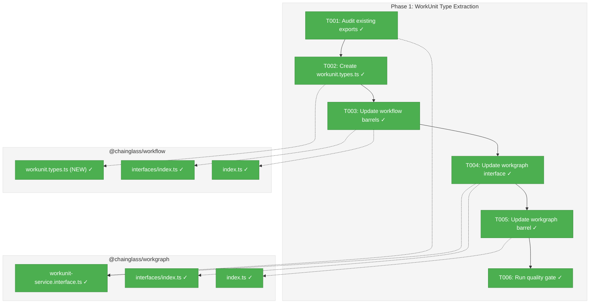
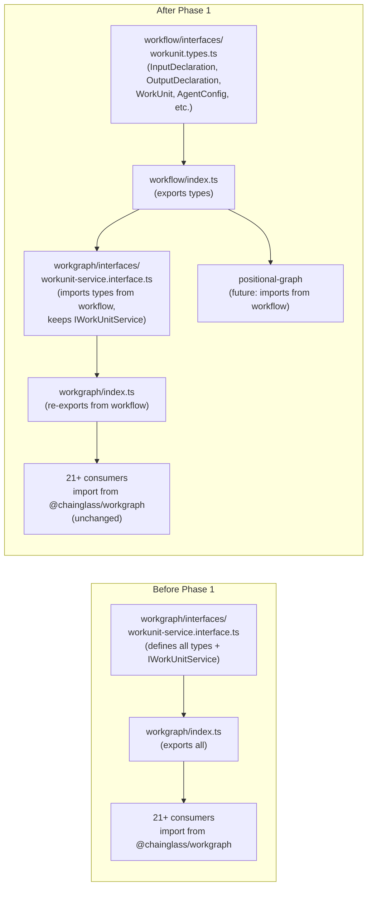
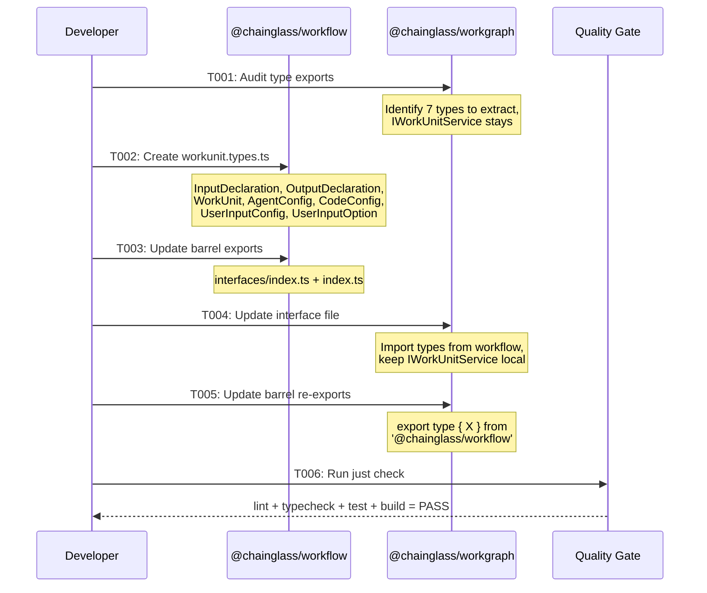

# Phase 1: WorkUnit Type Extraction — Tasks & Alignment Brief

**Spec**: [../../positional-graph-spec.md](../../positional-graph-spec.md)
**Plan**: [../../positional-graph-plan.md](../../positional-graph-plan.md)
**Date**: 2026-01-31

---

## Executive Briefing

### Purpose
This phase extracts WorkUnit type definitions (`InputDeclaration`, `OutputDeclaration`, `WorkUnit`, and related types) from `@chainglass/workgraph` to `@chainglass/workflow`. This is a prerequisite for the positional graph package — it needs WorkUnit types but must not depend on the full workgraph service layer.

### What We're Building
A type extraction refactor that:
- Creates `workunit.types.ts` in `packages/workflow/src/interfaces/` with 7 extracted type definitions
- Updates workflow barrel exports to surface the new types
- Updates workgraph to re-export from workflow for backward compatibility
- Leaves all 21+ existing consumers of `@chainglass/workgraph` completely unchanged

### User Value
Enables the positional graph package (Phase 2+) to consume WorkUnit type definitions without pulling in the entire workgraph dependency tree. Establishes a cleaner architectural boundary where shared domain types live in the workflow foundation package.

### Example
**Before**: `import type { InputDeclaration } from '@chainglass/workgraph'` (only option)
**After**: `import type { InputDeclaration } from '@chainglass/workflow'` (new, preferred) — workgraph re-export still works for existing code.

---

## Objectives & Scope

### Objective
Extract WorkUnit type definitions from `@chainglass/workgraph` to `@chainglass/workflow` so the positional graph package can consume them without depending on the full workgraph. Per plan Phase 1 acceptance criteria:
- [x] `InputDeclaration`, `OutputDeclaration`, `WorkUnit` importable from `@chainglass/workflow`
- [x] All existing `@chainglass/workgraph` consumers unchanged (`pnpm test --filter @chainglass/workgraph` — zero new failures)
- [x] `just check` passes — zero failures across lint, typecheck, test, build

### Goals

- Extract `InputDeclaration`, `OutputDeclaration`, `WorkUnit`, `AgentConfig`, `CodeConfig`, `UserInputConfig`, `UserInputOption` to `@chainglass/workflow`
- Re-export all extracted types from `@chainglass/workgraph` barrel for backward compatibility
- Zero consumer code changes required
- Full quality gate passes

### Non-Goals

- Extracting `IWorkUnitService` interface (stays in workgraph — it's a service contract, not a shared type)
- Extracting Zod schemas (stay in workgraph — schemas reference workgraph-specific error types)
- Extracting result wrapper types (`UnitListResult`, `UnitLoadResult`, `UnitCreateResult`, `UnitValidateResult`, `ValidationIssue`) — these are service-layer concerns
- Moving `WorkUnitSummary` — it's a service response type, not a core domain type
- Updating any consumer code to import from `@chainglass/workflow` instead of `@chainglass/workgraph`
- Creating any new tests (this is a pure refactor — existing tests validate correctness)
- Creating DI tokens or package scaffolding (that's Phase 2)

---

## Flight Plan

### Summary Table
| File | Action | Origin | Modified By | Recommendation |
|------|--------|--------|-------------|----------------|
| `packages/workgraph/src/interfaces/workunit-service.interface.ts` | Modify | Plan 016 | Plans 021, 022 | keep-as-is |
| `packages/workflow/src/interfaces/workunit.types.ts` | Create | New | — | keep-as-is |
| `packages/workflow/src/interfaces/index.ts` | Modify | Plan 014 | Plans 022, 023 | keep-as-is |
| `packages/workflow/src/index.ts` | Modify | Plan 007 | Plans 008-023 | keep-as-is |
| `packages/workgraph/src/interfaces/index.ts` | Modify | Plan 016 | Plan 021 | keep-as-is |
| `packages/workgraph/src/index.ts` | Modify | Plan 016 | Plan 021 | keep-as-is |

### Per-File Detail

#### `packages/workflow/src/interfaces/workunit.types.ts` (CREATE)
- **Duplication check**: No existing WorkUnit type definitions in `@chainglass/workflow`. Note: `packages/workflow/src/types/wf.types.ts` has an `InputDeclaration` type but it describes workflow phase inputs (files, parameters, messages) — different concept, no collision.
- **Provenance**: New file, Phase 1 origin.
- **Compliance**: Plan specifies `.types.ts` suffix. Project rule R-CODE-003 mandates `.interface.ts` for interface files. However, this file contains pure type aliases, not interfaces with method signatures. The `.types.ts` naming follows the plan and aligns with TypeScript community convention for type-only files. **Decision: use `.types.ts` per plan** — the rule targets interface definition files, not type alias collections.

### Compliance Check
| Severity | File | Rule/ADR | Issue | Resolution |
|----------|------|----------|-------|------------|
| LOW | `workunit.types.ts` | R-CODE-003 | `.types.ts` vs `.interface.ts` suffix | Per plan; file contains type aliases, not interface definitions |

No HIGH or MEDIUM violations found.

---

## Requirements Traceability

### Coverage Matrix
| AC | Description | Flow Summary | Files in Flow | Tasks | Status |
|----|-------------|-------------|---------------|-------|--------|
| AC-P1-1 | Types importable from `@chainglass/workflow` | workunit.types.ts (new) → workflow/interfaces/index.ts → workflow/index.ts | 3 | T002, T003 | ✅ Complete |
| AC-P1-2 | Existing workgraph consumers unchanged (27 files) | workunit-service.interface.ts → workgraph/interfaces/index.ts → workgraph/index.ts → 27 consumers | 6 | T004, T005 | ✅ Complete |
| AC-P1-3 | `just check` passes (lint, typecheck, test, build) | All modified files validated by quality gate | all | T006 | ✅ Complete |

### Gaps Found

No structural gaps — all files in every AC's execution flow are covered by task table entries.

**One semantic gap identified — `InputDeclaration` name collision** (see Flow Details below). This is not a missing-file gap but an implementation constraint that T002/T003 must address. The collision is between the existing workflow `InputDeclaration` (phase inputs: files, parameters, messages — `workflow/src/types/wf.types.ts:39`) and the workgraph `InputDeclaration` (WorkUnit I/O port: name, type, dataType, required — `workgraph/src/interfaces/workunit-service.interface.ts:44`). Both are currently exported from `workflow/src/index.ts:55` and will need to coexist. Resolution strategy must be decided in T002/T003 — see Alignment Brief for options.

### Orphan Files
All task table files map to at least one acceptance criterion.

### Flow Details

#### AC-P1-1: Type Import Resolution Chain

```
1. packages/workflow/src/interfaces/workunit.types.ts  (NEW - T002) ✅
   ↓ exports 7 types: InputDeclaration, OutputDeclaration, WorkUnit,
   ↓ AgentConfig, CodeConfig, UserInputConfig, UserInputOption
2. packages/workflow/src/interfaces/index.ts            (T003) ✅
   ↓ barrel re-export via export type { ... } from './workunit.types.js'
3. packages/workflow/src/index.ts                       (T003) ✅
   ↓ barrel re-export via export type { ... } from './interfaces/index.js'
   ↓ ⚠️ COLLISION: line 55 already exports InputDeclaration from ./types/index.js
4. Consumer: import type { InputDeclaration } from '@chainglass/workflow'
   ↓ resolves via pnpm workspace:* + vitest alias (vitest.config.ts already maps @chainglass/workflow)
```

**Name Collision Detail**:
- Existing: `workflow/src/types/wf.types.ts:39` — `InputDeclaration { files?: FileInput[]; parameters?: ParameterInput[]; messages?: MessageInput[] }` (phase-level input grouping)
- Extracted: `workgraph/src/interfaces/workunit-service.interface.ts:44` — `InputDeclaration { name: string; type: 'data' | 'file'; dataType?: ...; required: boolean; description?: string }` (WorkUnit I/O port)
- These are structurally incompatible types with the same name. TypeScript will error if both are exported from the same barrel.

**Config files verified — no changes needed**:
- `workflow/tsconfig.json` — no path changes needed (pure type definitions, zero imports)
- `workgraph/tsconfig.json` — already imports from `@chainglass/workflow` (line 13 of workunit-service.interface.ts uses `WorkspaceContext`)
- Root `tsconfig.json` — no `@chainglass/workflow` path alias (resolved via pnpm workspace)
- `vitest.config.ts` — already maps `@chainglass/workflow` to `packages/workflow/src`
- `workflow/package.json` — no new dependencies needed
- `workgraph/package.json` — already depends on `@chainglass/workflow: workspace:*`

#### AC-P1-2: Consumer Backward Compatibility Chain

**27 external consumer files verified** (full audit):

| Category | Files | Import Pattern | Imports Extracted Types? |
|----------|-------|----------------|------------------------|
| Tests (unit/integration) | 7 | `from '@chainglass/workgraph'` | NO — import services/fakes only |
| Contract tests | 5 | `from '@chainglass/workgraph/interfaces'` or `/fakes` | 1 file imports `WorkUnit` |
| CLI commands | 2 | `from '@chainglass/workgraph'` | NO — import `IWorkUnitService` only |
| CLI container | 1 | `from '@chainglass/workgraph'` | NO — import registration functions |
| Web API routes | 3 | `from '@chainglass/workgraph'` | NO — import service interfaces |
| Web UI features | 7 | `from '@chainglass/workgraph'` or `/fakes` | NO — import graph/node types |
| Web DI container | 1 | `from '@chainglass/workgraph'` | NO — import registration functions |
| **Affected total** | **1 of 27** | subpath import | `test/contracts/workunit-service.contract.ts` imports `WorkUnit` |

The single affected file (`test/contracts/workunit-service.contract.ts`) imports `WorkUnit` from `@chainglass/workgraph/interfaces` — a subpath export defined in workgraph's `package.json` `exports` field mapping to `dist/interfaces/index.js`. T004 updates `workgraph/interfaces/index.ts` to re-export `WorkUnit` from workflow, so this import resolves without consumer changes.

**Internal workgraph consumers** (relative imports within `packages/workgraph/src/`):

| File | Imports from Interface File | Affected? | Resolution |
|------|---------------------------|-----------|------------|
| `interfaces/index.ts` | All 14 types | YES | T004: re-export extracted types from workflow |
| `services/workunit.service.ts` | `WorkUnit` + 5 service types | Transitively | T004: interface file re-imports from workflow |
| `services/workgraph.service.ts` | `IWorkUnitService` via barrel | NO | Stays local |
| `services/worknode.service.ts` | `IWorkUnitService` via barrel | NO | Stays local |
| `services/bootstrap-prompt.ts` | `IWorkUnitService` via barrel | NO | Stays local |
| `fakes/fake-workunit-service.ts` | `IWorkUnitService` + result types | NO | None extracted |
| `container.ts` | `IWorkUnitService` | NO | Stays local |

**Test filtering caveat**: `pnpm test --filter @chainglass/workgraph` runs vitest from `packages/workgraph/` which has no local test files. Actual workgraph tests live in root `test/` directory. AC-P1-3 (`just check`) runs the root test suite which covers all workgraph-related tests.

---

## Architecture Map

### Component Diagram
<!-- Status: grey=pending, orange=in-progress, green=completed, red=blocked -->
<!-- Updated by plan-6 during implementation -->



### Task-to-Component Mapping

<!-- Status: Pending | In Progress | Complete | Blocked -->

| Task | Component(s) | Files | Status | Comment |
|------|-------------|-------|--------|---------|
| T001 | Workgraph interfaces | workunit-service.interface.ts, workgraph/index.ts | ✅ Complete | Read-only audit of existing type exports |
| T002 | Workflow interfaces | workunit.types.ts (NEW) | ✅ Complete | Create new file with extracted type definitions |
| T003 | Workflow barrels | workflow/interfaces/index.ts, workflow/index.ts | ✅ Complete | Add barrel exports for new types |
| T004 | Workgraph interfaces | workunit-service.interface.ts, workgraph/interfaces/index.ts | ✅ Complete | Replace local types with imports from workflow |
| T005 | Workgraph barrel | workgraph/index.ts | ✅ Complete | Re-export types from workflow for backward compat |
| T006 | Quality gate | (all) | ✅ Complete | Run `just check` to validate zero regressions |

---

## Tasks

| Status | ID | Task | CS | Type | Dependencies | Absolute Path(s) | Validation | Subtasks | Notes |
|--------|------|------|-----|------|-------------|-------------------------------|-------------------------------|----------|--------------------|
| [x] | T001 | Audit existing WorkUnit type exports from `@chainglass/workgraph` — document which types to extract vs which stay | 1 | Setup | – | `/home/jak/substrate/026-positional-graph/packages/workgraph/src/interfaces/workunit-service.interface.ts`, `/home/jak/substrate/026-positional-graph/packages/workgraph/src/index.ts` | Types to extract listed; types to keep listed | – | Plan task 1.1. Read workunit-service.interface.ts lines 22-187 |
| [x] | T002 | Create `workunit.types.ts` in workflow package with extracted type definitions: `InputDeclaration`, `OutputDeclaration`, `WorkUnit`, `AgentConfig`, `CodeConfig`, `UserInputConfig`, `UserInputOption`. Resolve `InputDeclaration` name collision — recommend renaming to `WorkUnitInput`/`WorkUnitOutput` (see Alignment Brief) | 2 | Core | T001 | `/home/jak/substrate/026-positional-graph/packages/workflow/src/interfaces/workunit.types.ts` | File compiles; types match original definitions structurally; no name collision with existing workflow `InputDeclaration` | – | Plan task 1.2. Per Critical Discovery 01. Name collision: workflow already exports `InputDeclaration` from `wf.types.ts` |
| [x] | T003 | Update workflow barrel exports — add workunit types to `interfaces/index.ts` and `index.ts`. Ensure no duplicate export names in `index.ts` (existing `InputDeclaration` at line 55) | 1 | Core | T002 | `/home/jak/substrate/026-positional-graph/packages/workflow/src/interfaces/index.ts`, `/home/jak/substrate/026-positional-graph/packages/workflow/src/index.ts` | All 7 workunit types importable from `@chainglass/workflow`; no TypeScript duplicate identifier errors | – | Plan task 1.2 (barrel part). Use `export type {}` pattern per R-CODE-004. Name collision resolution applied |
| [x] | T004 | Update workgraph interface file — replace local type definitions with imports from `@chainglass/workflow`; update `interfaces/index.ts` re-exports | 2 | Core | T003 | `/home/jak/substrate/026-positional-graph/packages/workgraph/src/interfaces/workunit-service.interface.ts`, `/home/jak/substrate/026-positional-graph/packages/workgraph/src/interfaces/index.ts` | workgraph still compiles; `IWorkUnitService` still uses correct types | – | Plan task 1.3. Keep IWorkUnitService, UnitListResult, UnitLoadResult, etc. in workgraph |
| [x] | T005 | Update workgraph barrel (`index.ts`) to re-export extracted types from `@chainglass/workflow` for backward compatibility | 1 | Core | T004 | `/home/jak/substrate/026-positional-graph/packages/workgraph/src/index.ts` | All 21+ existing consumer files compile without changes | – | Plan task 1.3 (barrel part). Pattern: `export type { X } from '@chainglass/workflow'` |
| [x] | T006 | Run full quality gate: `just check` (lint, typecheck, test, build) and `pnpm test --filter @chainglass/workgraph` | 1 | Validation | T005 | – | `just check` zero failures; `pnpm test --filter @chainglass/workgraph` zero new failures | 001-subtask-align-docs | Plan task 1.4 |

---

## Alignment Brief

### Critical Findings Affecting This Phase

**Critical Discovery 01: WorkUnit Types Must Be Extracted Before Implementation**
- **Constraint**: `InputDeclaration`, `OutputDeclaration`, and `WorkUnit` are defined inside `@chainglass/workgraph`. The positional graph needs these types but must not depend on the full workgraph service layer.
- **Action**: Extract to `@chainglass/workflow`, re-export from workgraph for backward compatibility.
- **Addressed by**: T002, T003, T004, T005 (entire phase)

**Requirements Flow Finding: `InputDeclaration` Name Collision**
- **Problem**: `@chainglass/workflow` already exports `InputDeclaration` from `src/types/wf.types.ts:39` (phase-level input grouping: `{ files?, parameters?, messages? }`). The extracted workgraph `InputDeclaration` from `src/interfaces/workunit-service.interface.ts:44` is a completely different type (WorkUnit I/O port: `{ name, type, dataType?, required, description? }`). Both cannot be exported from the same barrel under the same name.
- **Resolution options** (decide during T002/T003):
  1. **Rename in workunit.types.ts**: Export as `WorkUnitInput` and `WorkUnitOutput` instead of `InputDeclaration` / `OutputDeclaration`. The positional-graph package (Phase 2+) would use the renamed types. Workgraph re-exports would alias back: `export type { WorkUnitInput as InputDeclaration } from '@chainglass/workflow'`.
  2. **Selective barrel export**: Export from `workflow/interfaces/index.ts` but NOT from the top-level `workflow/index.ts`. Consumers use subpath: `import type { InputDeclaration } from '@chainglass/workflow/interfaces'`. Requires workflow `package.json` to add an `"./interfaces"` exports entry.
  3. **Keep original names, add `as` alias in barrel**: `export type { InputDeclaration as WuInputDeclaration } from './interfaces/workunit.types.js'` in `workflow/index.ts`. Positional graph imports the aliased name.
- **Recommendation**: Option 1 (rename to `WorkUnitInput`/`WorkUnitOutput`) is cleanest — it distinguishes the domain concepts at the type name level and avoids confusing re-alias chains. The positional-graph package is new code and has no legacy consumers.
- **Addressed by**: T002, T003

**Requirements Flow Finding: Test Filter Caveat**
- **Problem**: AC-P1-2 specifies `pnpm test --filter @chainglass/workgraph` but the workgraph package has no local test files (all tests are in root `test/` directory).
- **Impact**: The command may run zero tests, giving a false "pass". The real validation is `just check` (AC-P1-3) which runs the root vitest suite covering all workgraph-related tests.
- **Addressed by**: T006 runs `just check` as the primary validation. The `pnpm test --filter` command is a secondary check.

### ADR Decision Constraints

- **ADR-0004: DI Container Architecture** — `useFactory` pattern, no decorators. Not directly relevant to Phase 1 (type extraction only), but constrains how the extracted types will be consumed in later phases. No tasks affected.
- **ADR-0009: Module Registration Function Pattern** — Packages export registration functions. Relevant for Phase 2 (`registerPositionalGraphServices()`), not Phase 1. No tasks affected.

### Invariants & Guardrails

- **No circular dependencies**: Workflow must not import from workgraph. Types flow: workflow → workgraph (workgraph already depends on workflow in `package.json`).
- **Type-only extraction**: Only `type` and `interface` definitions are extracted. No runtime code, no Zod schemas, no service implementations.
- **Backward compatibility**: Every existing import from `@chainglass/workgraph` must continue to work without consumer changes.

### Inputs to Read

| File | Purpose |
|------|---------|
| `/home/jak/substrate/026-positional-graph/packages/workgraph/src/interfaces/workunit-service.interface.ts` | Source of types to extract (lines 22-187) |
| `/home/jak/substrate/026-positional-graph/packages/workgraph/src/index.ts` | Current barrel exports (lines 8-22) |
| `/home/jak/substrate/026-positional-graph/packages/workgraph/src/interfaces/index.ts` | Current interface barrel |
| `/home/jak/substrate/026-positional-graph/packages/workflow/src/interfaces/index.ts` | Target interface barrel |
| `/home/jak/substrate/026-positional-graph/packages/workflow/src/index.ts` | Target package barrel |

### Visual Alignment Aids

#### Flow Diagram — Type Extraction



#### Sequence Diagram — Extraction Steps



### Test Plan

**Approach**: No new tests needed. This is a pure type extraction refactor. Existing tests validate correctness:

| Test Suite | What It Validates | Command |
|------------|------------------|---------|
| Workgraph unit tests | Service implementations still compile and work with re-exported types | `pnpm test --filter @chainglass/workgraph` |
| Workgraph contract tests | `IWorkUnitService` contract still satisfied | `pnpm test --filter @chainglass/workgraph` |
| CLI tests | Commands that use WorkUnit types still work | `pnpm test --filter @chainglass/cli` |
| Full typecheck | All imports resolve across monorepo | `just typecheck` |
| Full build | All packages compile with correct inter-package references | `pnpm build` |

**Mock usage**: N/A — no new tests, existing tests follow project mock policy (fakes only).

### Step-by-Step Implementation Outline

1. **T001** — Read `workunit-service.interface.ts` (lines 22-187) and `workgraph/index.ts` (lines 8-22). Document the 7 types to extract and confirm `IWorkUnitService` + result types stay.
2. **T002** — Create `/packages/workflow/src/interfaces/workunit.types.ts`. Copy type definitions verbatim: `InputDeclaration`, `OutputDeclaration`, `WorkUnit`, `AgentConfig`, `CodeConfig`, `UserInputConfig`, `UserInputOption`. No runtime dependencies.
3. **T003** — Add exports to `workflow/src/interfaces/index.ts` and `workflow/src/index.ts` using `export type { ... } from './workunit.types.js'` pattern.
4. **T004** — In `workgraph/src/interfaces/workunit-service.interface.ts`: remove the 7 extracted type definitions, add `import type { ... } from '@chainglass/workflow'`. Update `workgraph/src/interfaces/index.ts` to re-export from workflow.
5. **T005** — In `workgraph/src/index.ts`: change the type exports for the 7 extracted types to `export type { ... } from '@chainglass/workflow'`. Keep service-specific exports (`IWorkUnitService`, `UnitListResult`, etc.) from local source.
6. **T006** — Run `just check` (lint + typecheck + test + build). Run `pnpm test --filter @chainglass/workgraph` separately to confirm zero new failures. Run `pnpm build` to confirm no circular dependency issues.

### Commands to Run

```bash
# Quality gate (T006)
just check

# Targeted workgraph test (T006)
pnpm test --filter @chainglass/workgraph

# Build verification (T006)
pnpm build

# Quick pre-commit check
just fft
```

### Risks & Unknowns

| Risk | Severity | Mitigation |
|------|----------|------------|
| `InputDeclaration` name collision in workflow barrel | **HIGH** | Workflow already exports `InputDeclaration` (phase inputs) at `index.ts:55`. The extracted workgraph `InputDeclaration` (WorkUnit I/O port) is a different type. Must rename or use subpath export — see Alignment Brief for 3 options. Recommend renaming to `WorkUnitInput`/`WorkUnitOutput`. |
| Breaking existing workgraph consumers | MEDIUM | Re-export from workgraph barrel ensures all 27 consumers see no change. Only 1 of 27 imports an extracted type (`WorkUnit` via subpath). Full test suite validates. |
| Circular dependency between workflow and workgraph | LOW | Verified: workgraph already depends on workflow. Types are type-only (no runtime code). `pnpm build` will catch any issues. |
| TypeScript path resolution across monorepo | LOW | Existing `workspace:*` dependency and tsconfig paths already handle this pattern. Vitest config already aliases `@chainglass/workflow`. |
| `pnpm test --filter @chainglass/workgraph` runs zero tests | LOW | Workgraph has no local test files. Real validation is `just check` (root test suite). T006 covers this. |

### Ready Check

- [x] ADR constraints mapped to tasks (IDs noted in Notes column) — N/A (no ADRs directly constrain Phase 1)
- [x] Critical Discovery 01 addressed by T002-T005
- [x] No circular dependency risk (verified: one-way workgraph → workflow)
- [x] No new tests needed (existing tests validate correctness)
- [x] All 6 files identified and assigned to tasks
- [x] Backward compatibility strategy confirmed (re-export pattern)

---

## Phase Footnote Stubs

| Footnote | Added By | Date | Description |
|----------|----------|------|-------------|
| | | | |

_Populated during implementation by plan-6._

---

## Evidence Artifacts

- **Execution log**: `phase-1-workunit-type-extraction/execution.log.md` — complete with T001-T006 entries
- **Quality gate evidence**: `just check` green — lint ✅, typecheck ✅, test ✅ (187 files, 2694 tests, 0 failures), build ✅ (6/6 tasks)
- **New file**: `packages/workflow/src/interfaces/workunit.types.ts` — 7 extracted types with backward-compat aliases

---

## Discoveries & Learnings

_Populated during implementation by plan-6. Log anything of interest to your future self._

| Date | Task | Type | Discovery | Resolution | References |
|------|------|------|-----------|------------|------------|
| 2026-01-31 | T002 | decision | `InputDeclaration` name collision — workflow already exports `InputDeclaration` (phase inputs) at `index.ts:55`. Workgraph `InputDeclaration` (WorkUnit I/O port) is structurally incompatible. | Renamed to `WorkUnitInput`/`WorkUnitOutput` in `workunit.types.ts` with backward-compat type aliases `InputDeclaration = WorkUnitInput` and `OutputDeclaration = WorkUnitOutput` | log#task-t001, Alignment Brief |
| 2026-01-31 | T004 | gotcha | Top-level `@chainglass/workflow` barrel can't export both `InputDeclaration` types. Workgraph import from top-level barrel fails for `OutputDeclaration`. | Changed workgraph import to use subpath `@chainglass/workflow/interfaces` instead of top-level barrel | log#task-t004 |
| 2026-01-31 | T005 | insight | No changes needed to `workgraph/src/index.ts` — the re-export chain `index.ts → interfaces/index.ts → workunit-service.interface.ts → @chainglass/workflow/interfaces` already works transitively | T004's re-export in `workunit-service.interface.ts` was sufficient for the entire chain | log#task-t005 |
| 2026-01-31 | T006 | insight | Biome linter enforces alphabetical import ordering — the extracted type imports needed reordering | Sorted imports alphabetically in workunit-service.interface.ts | log#task-t006 |

**Types**: `gotcha` | `research-needed` | `unexpected-behavior` | `workaround` | `decision` | `debt` | `insight`

**What to log**:
- Things that didn't work as expected
- External research that was required
- Implementation troubles and how they were resolved
- Gotchas and edge cases discovered
- Decisions made during implementation
- Technical debt introduced (and why)
- Insights that future phases should know about

_See also: `execution.log.md` for detailed narrative._

---

## Directory Layout

```
docs/plans/026-positional-graph/
  ├── positional-graph-spec.md
  ├── positional-graph-plan.md
  └── tasks/phase-1-workunit-type-extraction/
      ├── tasks.md                    # This file
      └── execution.log.md            # Created by /plan-6
```
