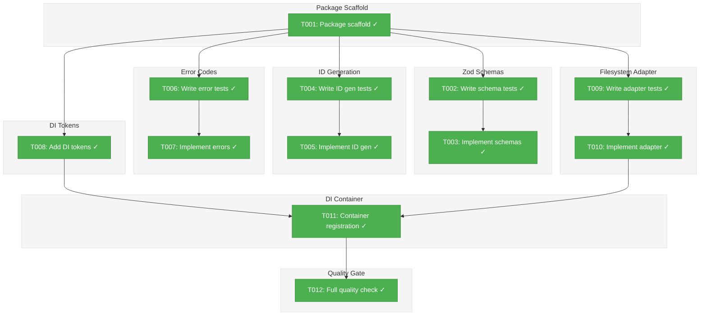
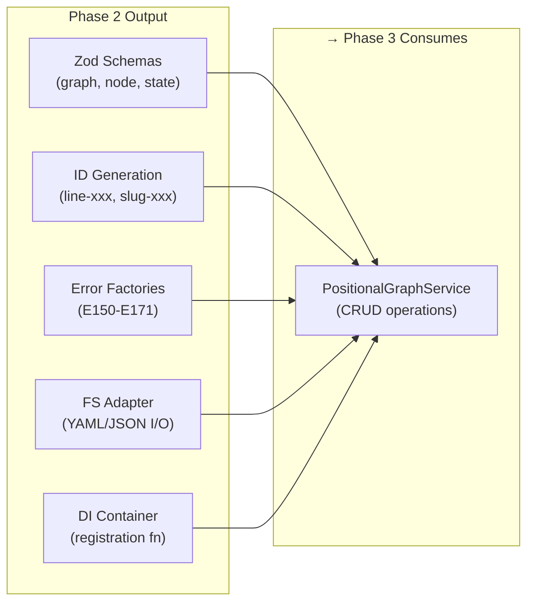
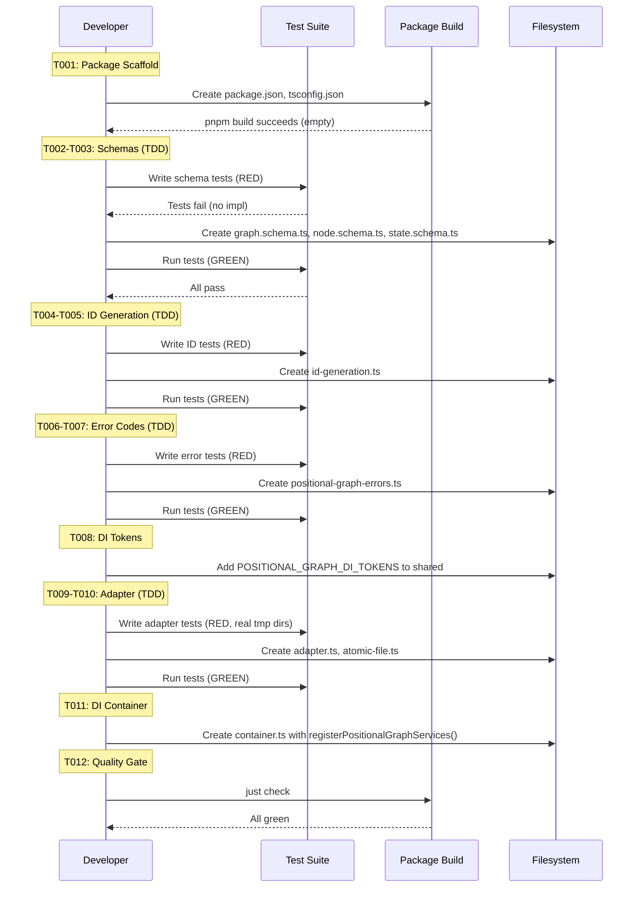

# Phase 2: Schema, Types, and Filesystem Adapter — Tasks & Alignment Brief

**Spec**: [../../positional-graph-spec.md](../../positional-graph-spec.md)
**Plan**: [../../positional-graph-plan.md](../../positional-graph-plan.md)
**Date**: 2026-02-01

---

## Executive Briefing

### Purpose
This phase creates the `@chainglass/positional-graph` package from scratch — the foundational data model layer for positional workflows. It defines what a positional graph *is* (Zod schemas and TypeScript types), how IDs are generated, what errors look like, how data is persisted to disk, and how services are registered in the DI container. Without this foundation, no service logic (Phases 3-5) or CLI surface (Phase 6) can be built.

### What We're Building
A new `packages/positional-graph/` package containing:
- **Zod schemas** for graph definitions (`graph.yaml`), node config (`node.yaml`), runtime state (`state.json`), and input resolution wiring
- **ID generation** utilities producing `line-<hex3>` and `<unitSlug>-<hex3>` identifiers with collision avoidance
- **Error code factories** for the E150-E179 range (structure, input resolution, status errors)
- **Filesystem adapter** extending `WorkspaceDataAdapterBase` for reading/writing graph data under `<worktree>/.chainglass/data/workflows/<slug>/`
- **DI tokens and container registration** following ADR-0004 and ADR-0009 patterns

### User Value
Establishes the data contract that all subsequent phases build upon — schema validation catches malformed data at the boundary, atomic writes prevent corruption, and error codes give agents/users actionable feedback.

### Example
**graph.yaml** (persisted to `<worktree>/.chainglass/data/workflows/my-pipeline/graph.yaml`):
```yaml
slug: my-pipeline
version: "1.0.0"
created_at: "2026-02-01T00:00:00Z"
lines:
  - id: line-a4f
    transition: auto
    nodes: []
```

**Validation**: `PositionalGraphDefinitionSchema.safeParse(data)` → `{ success: true }` or structured Zod errors.

---

## Objectives & Scope

### Objective
Define the positional graph data model (Zod schemas, TypeScript types), ID generation utilities, error codes, and filesystem persistence adapter. Satisfies plan Phase 2 acceptance criteria:
- All Zod schemas match workshop specifications exactly
- ID generation produces unique `line-<hex3>` and `<slug>-<hex3>` IDs
- Error codes E150-E171 defined with factory functions
- Filesystem adapter reads/writes `graph.yaml`, `state.json`, `node.yaml` with atomic writes
- Package builds: `pnpm build --filter @chainglass/positional-graph` — zero errors
- Unit tests pass: all schema, ID, error, adapter tests green

### Goals

- ✅ Scaffold `packages/positional-graph/` with `package.json`, `tsconfig.json`, barrel exports
- ✅ Implement Zod schemas: `PositionalGraphDefinitionSchema`, `LineDefinitionSchema`, `NodeConfigSchema`, `InputResolutionSchema`, `StateSchema`, `ExecutionSchema`, `TransitionModeSchema`
- ✅ Implement ID generation: `generateLineId(existingIds)`, `generateNodeId(unitSlug, existingIds)`
- ✅ Implement error code factories: E150-E156 (structure), E160-E164 (input resolution), E170-E171 (status)
- ✅ Implement filesystem adapter with atomic writes (temp-then-rename) for `graph.yaml`, `state.json`, `node.yaml`
- ✅ Add `POSITIONAL_GRAPH_DI_TOKENS` to `@chainglass/shared`
- ✅ Create `registerPositionalGraphServices()` module registration function
- ✅ Full TDD — tests written before implementation, no mocks

### Non-Goals

- ❌ Service layer methods (create, load, addLine, addNode, etc.) — Phase 3-4
- ❌ Input resolution algorithm (`collateInputs`) — Phase 5
- ❌ Status computation (`getStatus`, `canRun`) — Phase 5
- ❌ CLI commands (`cg wf`) — Phase 6
- ❌ Integration or E2E tests — Phase 7
- ❌ Fake service implementations — not needed until Phase 3 (spec mandates no mocks; real implementations only)
- ❌ Service interface definition (`IPositionalGraphService`) — Phase 3 defines this
- ❌ YAML parser implementation — reuse existing `IYamlParser` from `@chainglass/shared`

---

## Flight Plan

### Summary Table

| File | Action | Origin | Modified By | Recommendation |
|------|--------|--------|-------------|----------------|
| `packages/positional-graph/package.json` | Create | New (Phase 2) | — | keep-as-is |
| `packages/positional-graph/tsconfig.json` | Create | New (Phase 2) | — | keep-as-is |
| `packages/positional-graph/src/index.ts` | Create | New (Phase 2) | — | keep-as-is |
| `packages/positional-graph/src/schemas/graph.schema.ts` | Create | New (Phase 2) | — | keep-as-is |
| `packages/positional-graph/src/schemas/node.schema.ts` | Create | New (Phase 2) | — | keep-as-is |
| `packages/positional-graph/src/schemas/state.schema.ts` | Create | New (Phase 2) | — | keep-as-is |
| `packages/positional-graph/src/schemas/index.ts` | Create | New (Phase 2) | — | keep-as-is |
| `packages/positional-graph/src/services/id-generation.ts` | Create | New (Phase 2) | — | keep-as-is |
| `packages/positional-graph/src/services/atomic-file.ts` | Create | New (Phase 2) | — | keep-as-is |
| `packages/positional-graph/src/services/index.ts` | Create | New (Phase 2) | — | keep-as-is |
| `packages/positional-graph/src/errors/positional-graph-errors.ts` | Create | New (Phase 2) | — | keep-as-is |
| `packages/positional-graph/src/errors/index.ts` | Create | New (Phase 2) | — | keep-as-is |
| `packages/positional-graph/src/adapter/positional-graph.adapter.ts` | Create | New (Phase 2) | — | keep-as-is |
| `packages/positional-graph/src/adapter/index.ts` | Create | New (Phase 2) | — | keep-as-is |
| `packages/positional-graph/src/container.ts` | Create | New (Phase 2) | — | keep-as-is |
| `packages/shared/src/di-tokens.ts` | Modify | Pre-plan (multiple plans) | Plan 014, 018, 019 | keep-as-is |
| `vitest.config.ts` | Modify | Pre-plan | Multiple plans | keep-as-is |
| `tsconfig.json` (root) | Modify | Pre-plan | Multiple plans | keep-as-is |
| `turbo.json` | Modify (maybe) | Pre-plan | Multiple plans | check if needed |
| `test/unit/positional-graph/schemas.test.ts` | Create | New (Phase 2) | — | keep-as-is |
| `test/unit/positional-graph/id-generation.test.ts` | Create | New (Phase 2) | — | keep-as-is |
| `test/unit/positional-graph/error-codes.test.ts` | Create | New (Phase 2) | — | keep-as-is |
| `test/unit/positional-graph/adapter.test.ts` | Create | New (Phase 2) | — | keep-as-is |

### Per-File Detail

#### `packages/positional-graph/src/services/atomic-file.ts`
- **Duplication check**: `packages/workgraph/src/services/atomic-file.ts` has identical `atomicWriteFile()` and `atomicWriteJson()` functions. Per Critical Discovery 06, we reimplement locally to avoid workgraph dependency. Same pattern, independent code.
- **Provenance**: New file, but pattern originates from workgraph.
- **Compliance**: No violations. Per plan: "Reimplement atomic write (temp-then-rename) locally — do not import from workgraph to avoid dependency."

#### `packages/positional-graph/src/services/id-generation.ts`
- **Duplication check**: `packages/workgraph/src/services/node-id.ts` has `generateNodeId()` with identical hex3 pattern. Per Critical Discovery 14, we reimplement locally.
- **Provenance**: New file, but pattern originates from workgraph.
- **Compliance**: No violations. Per plan: "Reimplement hex3 ID generation locally in positional-graph package."

### Compliance Check
No violations found. All files are new to this plan or are shared files with documented modification reasons.

---

## Requirements Traceability

### Coverage Matrix

| AC | Description | Flow Summary | Files in Flow | Tasks | Status |
|----|-------------|-------------|---------------|-------|--------|
| AC-1 | All Zod schemas match workshop specifications exactly | Workshop Zod schemas → graph.schema.ts, node.schema.ts, state.schema.ts → tests verify | 4 files | T002, T003 | ✅ Complete |
| AC-2 | ID generation produces unique `line-<hex3>` and `<slug>-<hex3>` IDs | id-generation.ts → tests verify format, uniqueness, collision avoidance | 2 files | T004, T005 | ✅ Complete |
| AC-3 | Error codes E150-E171 defined with factory functions | positional-graph-errors.ts → tests verify codes, messages, ResultError shape | 2 files | T006, T007 | ✅ Complete |
| AC-4 | Filesystem adapter provides path signpost (`getGraphDir`) + directory lifecycle (`ensureGraphDir`, `listGraphSlugs`, `graphExists`, `removeGraph`) + `atomicWriteFile` utility for service use | adapter.ts + atomic-file.ts → tests verify paths, dir ops, atomic write | 3 files | T009, T010 | ✅ Complete |
| AC-5 | Package builds: `pnpm build --filter @chainglass/positional-graph` — zero errors | package.json + tsconfig.json + index.ts + all source → build succeeds | All files | T001, T012 | ✅ Complete |
| AC-6 | Unit tests pass: all schema, ID, error, adapter tests green | test files → `pnpm test` finds and runs them | 4 test files | T012 | ✅ Complete |

### Gaps Found
No gaps — all acceptance criteria have complete file coverage.

### Orphan Files
| File | Tasks | Assessment |
|------|-------|------------|
| `vitest.config.ts` | T001 | Config infrastructure — adds alias for test resolution |
| `tsconfig.json` (root) | T001 | Config infrastructure — adds path mapping for IDE |
| `packages/positional-graph/src/container.ts` | T011 | DI infrastructure — enables service registration in Phase 3+ |

---

## Architecture Map

### Component Diagram
<!-- Status: grey=pending, orange=in-progress, green=completed, red=blocked -->
<!-- Updated by plan-6 during implementation -->



### Task-to-Component Mapping

<!-- Status: ⬜ Pending | 🟧 In Progress | ✅ Complete | 🔴 Blocked -->

| Task | Component(s) | Files | Status | Comment |
|------|-------------|-------|--------|---------|
| T001 | Package Scaffold | package.json, tsconfig.json, index.ts, vitest.config.ts, root tsconfig | ✅ Complete | Create new package, wire into monorepo build + test |
| T002 | Schema Tests | test/unit/positional-graph/schemas.test.ts | ✅ Complete | TDD RED: schema tests that fail initially |
| T003 | Schema Implementation | graph.schema.ts, node.schema.ts, state.schema.ts, schemas/index.ts | ✅ Complete | TDD GREEN: implement schemas to pass tests |
| T004 | ID Gen Tests | test/unit/positional-graph/id-generation.test.ts | ✅ Complete | TDD RED: ID generation tests |
| T005 | ID Gen Implementation | services/id-generation.ts, services/index.ts | ✅ Complete | TDD GREEN: implement ID generation |
| T006 | Error Code Tests | test/unit/positional-graph/error-codes.test.ts | ✅ Complete | TDD RED: error factory tests |
| T007 | Error Code Implementation | errors/positional-graph-errors.ts, errors/index.ts | ✅ Complete | TDD GREEN: implement error factories |
| T008 | DI Tokens | packages/shared/src/di-tokens.ts | ✅ Complete | Add POSITIONAL_GRAPH_DI_TOKENS |
| T009 | Adapter Tests | test/unit/positional-graph/adapter.test.ts | ✅ Complete | TDD RED: signpost path tests + dir lifecycle + atomicWriteFile |
| T010 | Adapter Implementation | adapter/positional-graph.adapter.ts, services/atomic-file.ts, adapter/index.ts | ✅ Complete | TDD GREEN: signpost adapter (extends base, getGraphDir + dir lifecycle) + atomicWriteFile utility |
| T011 | DI Container | container.ts | ✅ Complete | registerPositionalGraphServices() function |
| T012 | Quality Gate | — | ✅ Complete | `just check` passes, package builds, all tests green |

---

## Tasks

| Status | ID | Task | CS | Type | Dependencies | Absolute Path(s) | Validation | Subtasks | Notes |
|--------|------|------|-----|------|-------------|-------------------|------------|----------|-------|
| [x] | T001 | Create `packages/positional-graph/` package scaffold: `package.json` (deps on `@chainglass/shared`, `@chainglass/workflow`, `zod`, `yaml`), `tsconfig.json` (extends root, references shared+workflow), `src/index.ts` barrel, subpath exports for `/interfaces`, `/schemas`, `/errors`, `/adapter`. Add `@chainglass/positional-graph` alias to root `tsconfig.json` paths and `vitest.config.ts` resolve aliases. Run `pnpm install` to wire workspace dependency. Verify `pnpm build --filter @chainglass/positional-graph` succeeds (empty barrel). | 2 | Setup | – | `/home/jak/substrate/026-positional-graph/packages/positional-graph/package.json`, `/home/jak/substrate/026-positional-graph/packages/positional-graph/tsconfig.json`, `/home/jak/substrate/026-positional-graph/packages/positional-graph/src/index.ts`, `/home/jak/substrate/026-positional-graph/tsconfig.json`, `/home/jak/substrate/026-positional-graph/vitest.config.ts` | `pnpm build --filter @chainglass/positional-graph` zero errors; `pnpm install` succeeds | – | Plan task 2.1. Model after packages/workgraph structure. plan-scoped |
| [x] | T002 | Write tests for Zod schemas: `PositionalGraphDefinitionSchema` (valid parse, invalid slug, min-1-line, datetime format), `LineDefinitionSchema` (defaults: transition=auto, optional label/description), `NodeConfigSchema` (execution default serial, optional inputs/config/description, InputResolution union), `StateSchema` (synthesized from workshop §8: `GraphStatusSchema` enum [`pending`,`in_progress`,`complete`,`failed`], `NodeStateEntrySchema` with `NodeExecutionStatusSchema` enum [`running`,`waiting-question`,`blocked-error`,`complete`] + optional timestamps, `TransitionEntrySchema` with triggered boolean + optional timestamp, full StateSchema with graph_status + updated_at + nodes record + transitions record), `ExecutionSchema` (serial/parallel enum), `TransitionModeSchema` (auto/manual enum). Tests must fail initially (RED). | 3 | Test | T001 | `/home/jak/substrate/026-positional-graph/test/unit/positional-graph/schemas.test.ts` | Tests exist and fail (no implementation yet) | – | Plan task 2.2. Per Workshop §Zod Schemas. StateSchema synthesized per DYK-I2 from execution rules workshop §8 prose + examples (no Zod definition exists in workshops). plan-scoped |
| [x] | T003 | Implement Zod schemas to pass all schema tests (GREEN). Create `graph.schema.ts` with `PositionalGraphDefinitionSchema`, `LineDefinitionSchema`, `ExecutionSchema`, `TransitionModeSchema`. Create `node.schema.ts` with `NodeConfigSchema`, `InputResolutionSchema`. Create `state.schema.ts` with `GraphStatusSchema`, `NodeExecutionStatusSchema`, `NodeStateEntrySchema`, `TransitionEntrySchema`, `StateSchema` — synthesized from execution rules workshop §8 (graph_status enum, node status entries with enum + optional timestamps, transition entries with triggered boolean + optional timestamp). Export inferred types. Create `schemas/index.ts` barrel. Export from package barrel. | 3 | Core | T002 | `/home/jak/substrate/026-positional-graph/packages/positional-graph/src/schemas/graph.schema.ts`, `/home/jak/substrate/026-positional-graph/packages/positional-graph/src/schemas/node.schema.ts`, `/home/jak/substrate/026-positional-graph/packages/positional-graph/src/schemas/state.schema.ts`, `/home/jak/substrate/026-positional-graph/packages/positional-graph/src/schemas/index.ts` | All schema tests pass; types exported from barrel | – | Plan task 2.3. Per DYK-I2: StateSchema synthesized from workshop prose, not copied from Zod source. plan-scoped |
| [x] | T004 | Write tests for ID generation: `generateLineId(existingIds)` format `line-<hex3>`, `generateNodeId(unitSlug, existingIds)` format `<slug>-<hex3>`, uniqueness (no collision with existingIds), hex3 pattern validation (3 lowercase hex chars), collision avoidance (retry on collision), maximum attempts error. Tests must fail initially (RED). | 2 | Test | T001 | `/home/jak/substrate/026-positional-graph/test/unit/positional-graph/id-generation.test.ts` | Tests exist and fail | – | Plan task 2.4. Per Workshop §Line IDs, §Node IDs. Per CD-14. plan-scoped |
| [x] | T005 | Implement `generateLineId(existingIds)` and `generateNodeId(unitSlug, existingIds)` using hex3 pattern. Reimplement locally — do not import from workgraph (per CD-06, CD-14). Create `services/index.ts` barrel. | 1 | Core | T004 | `/home/jak/substrate/026-positional-graph/packages/positional-graph/src/services/id-generation.ts`, `/home/jak/substrate/026-positional-graph/packages/positional-graph/src/services/index.ts` | All ID generation tests pass | – | Plan task 2.5. plan-scoped |
| [x] | T006 | Write tests for error code factory functions: E150 (line not found), E151 (line not empty), E152 (invalid line index), E153 (node not found), E154 (invalid node position), E155 (duplicate node / unit not found), E156 (cannot remove last line), E160 (input not declared), E161 (predecessor not found), E162 (ambiguous predecessor), E163 (output not declared), E164 (invalid ordinal), E170 (node not ready), E171 (transition blocked). Verify `ResultError` shape (code, message, action). Tests must fail initially (RED). | 2 | Test | T001 | `/home/jak/substrate/026-positional-graph/test/unit/positional-graph/error-codes.test.ts` | Tests exist and fail | – | Plan task 2.6. Per Workshop §Error Codes, CD-12. plan-scoped |
| [x] | T007 | Implement error code factory functions matching `workgraph-errors.ts` factory pattern. Each returns `ResultError` with code, message, and actionable guidance. Create `errors/index.ts` barrel. | 2 | Core | T006 | `/home/jak/substrate/026-positional-graph/packages/positional-graph/src/errors/positional-graph-errors.ts`, `/home/jak/substrate/026-positional-graph/packages/positional-graph/src/errors/index.ts` | All error tests pass | – | Plan task 2.7. plan-scoped |
| [x] | T008 | Add `POSITIONAL_GRAPH_DI_TOKENS` to `@chainglass/shared` di-tokens.ts. Tokens: `POSITIONAL_GRAPH_SERVICE` (IPositionalGraphService), `POSITIONAL_GRAPH_ADAPTER` (IPositionalGraphAdapter). No YAML_PARSER token — reuse `SHARED_DI_TOKENS.YAML_PARSER` per workgraph precedent (per DYK-I4). Verify `pnpm build --filter @chainglass/shared` succeeds. | 1 | Setup | – | `/home/jak/substrate/026-positional-graph/packages/shared/src/di-tokens.ts` | Tokens exported from shared barrel; build succeeds | – | Plan task 2.8. Per ADR-0004, CD-10. Per DYK-I4: YAML parser resolved via SHARED_DI_TOKENS.YAML_PARSER, not a duplicate token. cross-cutting |
| [x] | T009 | Write tests for filesystem adapter as **path signpost + directory lifecycle**: `getGraphDir(ctx, slug)` returns correct path, `ensureGraphDir` creates dir with `nodes/` subdir, `listGraphSlugs` returns slug array, `graphExists` checks for `graph.yaml`, `removeGraph` deletes directory recursively. Also test `atomicWriteFile` utility (temp-then-rename). Adapter does NOT read/write YAML/JSON — that's the service's job using offsets from `getGraphDir`. Use real filesystem with temp dirs (`fs.mkdtemp`). Tests must fail initially (RED). | 2 | Test | T001 | `/home/jak/substrate/026-positional-graph/test/unit/positional-graph/adapter.test.ts` | Tests exist and fail | – | Plan task 2.9. Per DYK-I1: adapter is a signpost, not an I/O layer. Per DYK-I3: no dependency on schemas/IDs/errors — those are consumed by the service (Phase 3), not the adapter. Per CD-11 (workspace storage path), CD-06 (atomic writes), CD-13 (no mocks). plan-scoped |
| [x] | T010 | Implement `PositionalGraphAdapter` extending `WorkspaceDataAdapterBase`. Domain = `'workflows'`. **Signpost pattern**: one path method `getGraphDir(ctx, slug)` — service uses known offsets from there (`graph.yaml`, `state.json`, `nodes/<id>/node.yaml`). Directory lifecycle methods: `ensureGraphDir`, `listGraphSlugs`, `graphExists`, `removeGraph`. Implement `atomicWriteFile` utility locally (temp-then-rename, per CD-06) as a standalone function in `services/atomic-file.ts` — used by the service, not the adapter. Create `adapter/index.ts` barrel. | 2 | Core | T009 | `/home/jak/substrate/026-positional-graph/packages/positional-graph/src/adapter/positional-graph.adapter.ts`, `/home/jak/substrate/026-positional-graph/packages/positional-graph/src/services/atomic-file.ts`, `/home/jak/substrate/026-positional-graph/packages/positional-graph/src/adapter/index.ts` | All adapter tests pass | – | Plan task 2.10. Per DYK-I1: adapter = signpost + dir lifecycle. Per CD-06, CD-11. plan-scoped |
| [x] | T011 | Create `registerPositionalGraphServices(container)` function in `container.ts`. Register `POSITIONAL_GRAPH_ADAPTER` with factory resolving only `IFileSystem` and `IPathResolver` from `SHARED_DI_TOKENS` — adapter constructor is `(fs, pathResolver)` matching `WorkspaceDataAdapterBase` exactly (per DYK-I5: adapter doesn't use YAML parser). Service registration (Phase 3) will wire `SHARED_DI_TOKENS.YAML_PARSER` to the service, not the adapter. Export from package barrel. Per ADR-0009: document prerequisite tokens in JSDoc. | 2 | Core | T008, T010 | `/home/jak/substrate/026-positional-graph/packages/positional-graph/src/container.ts` | Function exported; follows ADR-0009 pattern | – | Plan task 2.11. Per ADR-0009, DYK-I4, DYK-I5. plan-scoped |
| [x] | T012 | Run full quality gate: `just check` (lint + typecheck + test + build). Verify: new package builds, all existing tests still pass (187+ files), new tests pass, zero lint errors, zero type errors. | 1 | QA | T011 | — | `just check` green; zero regressions | – | Plan task implicit. Final gate |

---

## Alignment Brief

### Prior Phases Review

#### Phase 1: WorkUnit Type Extraction — Complete (2026-01-31)

**A. Deliverables Created**:
- `/home/jak/substrate/026-positional-graph/packages/workflow/src/interfaces/workunit.types.ts` (131 lines) — 7 extracted types: `WorkUnitInput`, `WorkUnitOutput`, `AgentConfig`, `CodeConfig`, `UserInputOption`, `UserInputConfig`, `WorkUnit`; 2 backward-compat aliases: `InputDeclaration`, `OutputDeclaration`
- Modified: `workflow/src/interfaces/index.ts` (barrel), `workflow/src/index.ts` (barrel), `workgraph/src/interfaces/workunit-service.interface.ts` (import+re-export)
- Subtask 001: Aligned spec, plan, and prototype workshop with execution rules workshop (48+ edits across 3 design docs)

**B. Lessons Learned**:
- Name collision (`InputDeclaration` in both workflow and workgraph) required renaming to `WorkUnitInput`/`WorkUnitOutput` and subpath imports
- Top-level barrel cannot export colliding names — use `@chainglass/workflow/interfaces` subpath
- Biome enforces alphabetical import ordering — always sort type imports
- Read-only audit before code changes prevents false starts

**C. Technical Discoveries**:
- Workgraph has no local test files — tests live in monorepo `test/` directory
- Re-export chain depth is transparent (workgraph → interfaces → workflow works seamlessly)
- WorkUnit types have zero execution semantics — clean for Phase 2

**D. Dependencies Exported for Phase 2**:
- `WorkUnit`, `WorkUnitInput`, `WorkUnitOutput` importable from `@chainglass/workflow`
- Import pattern: `import type { WorkUnit, WorkUnitInput, WorkUnitOutput } from '@chainglass/workflow';`
- Positional-graph can now consume WorkUnit types without depending on `@chainglass/workgraph`

**E. Critical Findings Applied**:
- CD-01 (WorkUnit extraction): Extracted to `@chainglass/workflow`, re-exported from workgraph
- Subtask 001 applied execution rules workshop alignment (per-node execution, getStatus API, E165 removal)

**F. Incomplete/Blocked Items**: None. Phase 1 fully complete.

**G. Test Infrastructure**: No new tests. Validation via `just check` (187 files, 2694 tests, 0 failures).

**H. Technical Debt**:
- `InputDeclaration`/`OutputDeclaration` aliases exist alongside `WorkUnitInput`/`WorkUnitOutput` — eventual migration needed
- Top-level barrel can't export all WorkUnit type names

**I. Architectural Decisions**:
- Type extraction to `@chainglass/workflow` for shared domain types (established pattern)
- Backward-compatible re-exports via `import type` + `export type`
- Document ownership: prototype workshop = canonical service interface; execution rules workshop = canonical algorithms

**J. Scope Changes**: Subtask 001 added post-planning (execution rules workshop alignment). Phase 4 gained tasks 4.9-4.10 (setNodeExecution). Error range narrowed E160-E164 (E165 removed).

**K. Key Log References**: See Phase 1 `execution.log.md` — T001 (name collision), T004 (subpath import discovery), T006 (Biome lint fix)

### Critical Findings Affecting This Phase

| Finding | What It Constrains/Requires | Tasks |
|---------|---------------------------|-------|
| **CD-02**: Position IS Topology | Schema must encode position-as-semantics (line ordering = execution order) | T002, T003 |
| **CD-06**: Atomic File Writes Must Be Reused | Reimplement temp-then-rename locally, don't import from workgraph | T009, T010 |
| **CD-09**: Execution is Per-Node | `execution` field on `NodeConfigSchema` (serial default), NOT on `LineDefinitionSchema` | T002, T003 |
| **CD-10**: DI Container Registration | Follow ADR-0009 `registerXxxServices()` pattern; tokens in `@chainglass/shared` | T008, T011 |
| **CD-11**: Workspace Storage Path | Domain = `'workflows'`, path = `ctx.worktreePath/.chainglass/data/workflows/<slug>/` | T009, T010 |
| **CD-12**: Error Code Ranges | E150-E156 structure, E160-E164 input resolution (no E165), E170-E171 status | T006, T007 |
| **CD-13**: No Mocks, Real Implementations | All tests use real filesystem with temp dirs | T002, T004, T006, T009 |
| **CD-14**: Node ID Generation | Reimplement hex3 locally, `line-<hex3>` for lines, `<slug>-<hex3>` for nodes | T004, T005 |

### ADR Decision Constraints

- **ADR-0004 (DI Architecture)**: `useFactory` registration pattern, no decorators, fresh container per test. Constrains: T008, T011.
- **ADR-0008 (Workspace Storage)**: Per-worktree data under `<worktree>/.chainglass/data/`. Domain adapters extend `WorkspaceDataAdapterBase`. Constrains: T009, T010. Addressed by: T010.
- **ADR-0009 (Module Registration)**: Export `registerPositionalGraphServices(container)` function. Document prerequisite tokens in JSDoc. Constrains: T011. Addressed by: T011.

### PlanPak Placement Rules

- Plan-scoped files: All `packages/positional-graph/` files are plan-scoped (serve only plan 026)
- Cross-cutting files: `packages/shared/src/di-tokens.ts` (DI tokens used by multiple packages)
- Test location: `test/unit/positional-graph/` per monorepo convention

### Invariants & Guardrails

- **Slug validation**: `/^[a-z][a-z0-9-]*$/` regex on all slugs (same as workgraph)
- **Min-1-line**: Schema enforces `lines.min(1)` — a graph always has at least one line
- **Atomic writes**: All file writes use temp-then-rename to prevent corruption
- **No runtime workgraph dependency**: Positional-graph depends only on `@chainglass/workflow` and `@chainglass/shared`

### Inputs to Read

- `/home/jak/substrate/026-positional-graph/docs/plans/026-positional-graph/workshops/positional-graph-prototype.md` — §Zod Schemas, §ERD, §graph.yaml examples, §node.yaml examples, §Error Codes, §On-Disk Storage
- `/home/jak/substrate/026-positional-graph/docs/plans/026-positional-graph/workshops/workflow-execution-rules.md` — §1 Graph Model, §6 Parallel/Serial Rules, §12 Service Commands
- `/home/jak/substrate/026-positional-graph/packages/workgraph/src/services/atomic-file.ts` — Atomic write pattern to reimplement
- `/home/jak/substrate/026-positional-graph/packages/workgraph/src/services/node-id.ts` — Hex3 ID generation pattern to reimplement
- `/home/jak/substrate/026-positional-graph/packages/workgraph/src/errors/workgraph-errors.ts` — Error factory pattern to follow
- `/home/jak/substrate/026-positional-graph/packages/workgraph/src/container.ts` — Module registration pattern to follow
- `/home/jak/substrate/026-positional-graph/packages/workflow/src/adapters/workspace-data-adapter-base.ts` — Adapter base class to extend/follow

### Visual Alignment Aids

#### System State Flow



#### Implementation Sequence



### Test Plan (Full TDD, No Mocks)

| Test File | Named Tests | Rationale | Fixtures | Expected Output |
|-----------|------------|-----------|----------|-----------------|
| `schemas.test.ts` | `PositionalGraphDefinitionSchema` — valid parse, invalid slug (uppercase, special chars), zero lines rejected, missing required fields, version format, datetime format; `LineDefinitionSchema` — transition defaults to auto, optional fields; `NodeConfigSchema` — execution defaults to serial, InputResolution union (from_unit vs from_node), optional inputs; `StateSchema` — valid state, node status enum, transitions record | Schema is the data contract — every field, default, and constraint must be verified | Inline test data matching workshop examples | Zod parse success/failure with correct error paths |
| `id-generation.test.ts` | `generateLineId` — format `line-<hex3>`, uniqueness, collision avoidance; `generateNodeId` — format `<slug>-<hex3>`, uniqueness, collision avoidance, max attempts error | IDs are identity — format and uniqueness are critical invariants | Empty arrays, arrays with pre-existing IDs | String matching `/^line-[0-9a-f]{3}$/` and `/^<slug>-[0-9a-f]{3}$/` |
| `error-codes.test.ts` | Each error factory (14 total) — returns `ResultError` with correct code string, non-empty message, optional action | Error codes are the API contract with CLI/agents — must be stable and informative | N/A | `{ code: 'E150', message: string, action?: string }` |
| `adapter.test.ts` | `getGraphDir` — returns correct absolute path; `ensureGraphDir` — creates `<slug>/` and `<slug>/nodes/` dirs; `listGraphSlugs` — returns slug array from domain dir; `graphExists` — true when `graph.yaml` present; `removeGraph` — deletes directory recursively; `atomicWriteFile` — writes via temp-then-rename, temp cleaned up on success | Adapter is the path signpost + directory lifecycle — service handles I/O using offsets from `getGraphDir` | Real temp directories via `fs.mkdtemp`, WorkspaceContext with temp worktree path | Paths resolve correctly; directories created/listed/removed; atomic write temp file absent after success |

### Step-by-Step Implementation Outline

1. **T001** — Scaffold package: create `package.json` (model after workgraph), `tsconfig.json` (extend root, reference shared+workflow), empty `src/index.ts`. Add vitest alias and root tsconfig path. Run `pnpm install`, verify build.
2. **T002** — Write `schemas.test.ts` with all schema validation tests. Import from `@chainglass/positional-graph/schemas`. Tests will fail (RED).
3. **T003** — Implement schemas in `graph.schema.ts`, `node.schema.ts`, `state.schema.ts`. Follow workshop Zod schemas exactly. Export from barrel. Run tests (GREEN).
4. **T004** — Write `id-generation.test.ts`. Import from `@chainglass/positional-graph`. Tests will fail (RED).
5. **T005** — Implement `id-generation.ts` with hex3 pattern. Run tests (GREEN).
6. **T006** — Write `error-codes.test.ts`. Import from `@chainglass/positional-graph/errors`. Tests will fail (RED).
7. **T007** — Implement `positional-graph-errors.ts` with factory functions. Run tests (GREEN).
8. **T008** — Add `POSITIONAL_GRAPH_DI_TOKENS` to `packages/shared/src/di-tokens.ts`. Verify shared builds.
9. **T009** — Write `adapter.test.ts`: test `getGraphDir` path correctness, `ensureGraphDir` creates dirs, `listGraphSlugs` lists slugs, `graphExists`/`removeGraph` lifecycle, `atomicWriteFile` temp-then-rename. Real temp dirs. Tests will fail (RED).
10. **T010** — Implement signpost adapter (extends `WorkspaceDataAdapterBase`, `domain = 'workflows'`, `getGraphDir` + dir lifecycle methods) and `atomicWriteFile` utility. Run tests (GREEN).
11. **T011** — Create `container.ts` with `registerPositionalGraphServices()`. Export from barrel.
12. **T012** — Run `just check`. Fix any lint/typecheck/test/build issues. Zero regressions.

### Commands to Run

```bash
# Package setup
pnpm install
pnpm build --filter @chainglass/positional-graph

# TDD cycle (repeat per task pair)
pnpm test -- test/unit/positional-graph/schemas.test.ts     # RED then GREEN
pnpm test -- test/unit/positional-graph/id-generation.test.ts
pnpm test -- test/unit/positional-graph/error-codes.test.ts
pnpm test -- test/unit/positional-graph/adapter.test.ts

# Quality gates
just typecheck      # Zero errors
just lint           # Zero warnings
just test           # All tests pass (existing + new)
just check          # Full gate (lint + typecheck + test + build)
pnpm build          # All packages build
```

### Risks/Unknowns

| Risk | Severity | Mitigation |
|------|----------|------------|
| Package build setup issues (tsconfig references, vitest alias) | Medium | Model after workgraph package; verify build early in T001 |
| Schema drift from workshop | Low | Workshop is authoritative — follow exactly; T002 tests encode workshop spec |
| Adapter test flakiness from temp dirs | Low | Clean up in `afterEach`; use unique temp dir per test |
| Coverage config may need update | Low | Check if `vitest.config.ts` coverage includes need updating (may defer) |

### Ready Check

- [ ] ADR constraints mapped to tasks (ADR-0004 → T008, T011; ADR-0008 → T009, T010; ADR-0009 → T011)
- [ ] Critical findings mapped to tasks (CD-02 → T002/T003; CD-06 → T009/T010; CD-09 → T002/T003; CD-10 → T008/T011; CD-11 → T009/T010; CD-12 → T006/T007; CD-13 → all tests; CD-14 → T004/T005)
- [ ] Workshop schemas reviewed and encoded in test expectations
- [ ] No mocks in test plan — real filesystem only
- [ ] Package dependencies identified: `@chainglass/shared`, `@chainglass/workflow`, `zod`, `yaml`

---

## Phase Footnote Stubs

| Footnote | Added By | Date | Summary |
|----------|----------|------|---------|
| [^2] | plan-6a | 2026-02-01 | T001: Package scaffold (5 files) |
| [^3] | plan-6a | 2026-02-01 | T002/T003: Zod schemas — 50 tests, 4 source files |
| [^4] | plan-6a | 2026-02-01 | T004/T005: ID generation — 10 tests, 2 functions |
| [^5] | plan-6a | 2026-02-01 | T006/T007: Error code factories — 18 tests, 14 factories |
| [^6] | plan-6a | 2026-02-01 | T008: DI tokens (2 tokens in shared) |
| [^7] | plan-6a | 2026-02-01 | T009/T010: Adapter + atomicWriteFile — 15 tests |
| [^8] | plan-6a | 2026-02-01 | T011: Container registration function |

---

## Evidence Artifacts

- **Execution log**: `docs/plans/026-positional-graph/tasks/phase-2-schema-types-and-filesystem-adapter/execution.log.md` — created by plan-6
- **Test output**: Captured in execution log per task
- **Build output**: Captured in execution log for T001 and T012

---

## Discoveries & Learnings

_Populated during implementation by plan-6. Log anything of interest to your future self._

| Date | Task | Type | Discovery | Resolution | References |
|------|------|------|-----------|------------|------------|
| 2026-02-01 | T001 | gotcha | Empty barrel files with only comments are not valid ES modules | Added `export {}` to all stub barrels | log#task-t001 |
| 2026-02-01 | T009 | decision | Used FakeFileSystem/FakePathResolver (in-memory) instead of real tmp dirs | Established codebase pattern — these are real implementations, not mocks | log#task-t010 |
| 2026-02-01 | T012 | gotcha | Biome enforces alphabetical import ordering — `@chainglass/*` before `vitest` | Ran `pnpm biome check --write --unsafe` to auto-fix | log#task-t012 |
| 2026-02-01 | T012 | insight | 8 lint warnings are from broken symlinks in plan 019 (pre-existing) | Ignored — not our issue | log#task-t012 |

**Types**: `gotcha` | `research-needed` | `unexpected-behavior` | `workaround` | `decision` | `debt` | `insight`

**What to log**:
- Things that didn't work as expected
- External research that was required
- Implementation troubles and how they were resolved
- Gotchas and edge cases discovered
- Decisions made during implementation
- Technical debt introduced (and why)
- Insights that future phases should know about

_See also: `execution.log.md` for detailed narrative._

---

## Directory Layout

```
docs/plans/026-positional-graph/
  ├── positional-graph-spec.md
  ├── positional-graph-plan.md
  ├── workshops/
  │   ├── positional-graph-prototype.md
  │   └── workflow-execution-rules.md
  └── tasks/
      ├── phase-1-workunit-type-extraction/
      │   ├── execution.log.md
      │   ├── 001-subtask-align-docs-with-execution-rules-workshop.md
      │   └── 001-subtask-align-docs-with-execution-rules-workshop.execution.log.md
      └── phase-2-schema-types-and-filesystem-adapter/
          ├── tasks.md                    # This file
          └── execution.log.md            # Created by plan-6
```

---

## Critical Insights Discussion

**Session**: 2026-02-01
**Context**: Phase 2: Schema, Types, and Filesystem Adapter — Tasks & Alignment Brief
**Analyst**: AI Clarity Agent
**Reviewer**: jak
**Format**: Water Cooler Conversation (5 Critical Insights)

### Insight 1: Adapter Pattern Mismatch — WorkspaceDataAdapterBase Doesn't Fit as I/O Layer (DYK-I1)

**Did you know**: `WorkspaceDataAdapterBase` is designed for single-file-per-entity JSON storage, but the positional graph needs a multi-file directory structure with mixed YAML and JSON. The workgraph service — the closest precedent — doesn't extend the base class at all.

**Implications**:
- SampleAdapter (single JSON file) uses the base class cleanly; AgentSessionAdapter (subdirectory) already overrides 3 of 5 base methods
- Positional graph would override or ignore everything except `getDomainPath` (a one-liner)
- Extending the base class and overriding everything is a "wrong abstraction" anti-pattern

**Options Considered**:
- Option A: Extend base class, override most methods
- Option B: Standalone class like workgraph (direct DI, no base class)
- Option C: Hybrid — compose, don't inherit

**AI Recommendation**: Option B initially — follow workgraph pattern

**Discussion Summary**:
User reframed the problem: the adapter is just a **signpost** — it tells you where to put stuff, and callers do their own I/O. This led to a simpler design: extend the base class for `getDomainPath` and `fs`/`pathResolver` wiring, expose one path method (`getGraphDir`), and four directory lifecycle operations. Service uses known offsets from the root path. No per-file path methods needed.

**Decision**: Adapter = path signpost + directory lifecycle. Extends `WorkspaceDataAdapterBase` for `getDomainPath`. One path method (`getGraphDir`), service offsets from there. No YAML/JSON I/O in adapter.

**Action Items**:
- [x] T009/T010 updated with signpost pattern
- [x] Test plan updated
- [x] AC-4 updated
- [x] Implementation outline steps 9-10 updated

**Affects**: T009, T010, Phase 3 service design

---

### Insight 2: StateSchema Has No Workshop Zod Definition (DYK-I2)

**Did you know**: Unlike the other 4 schemas (which have explicit Zod code in the prototype workshop), `StateSchema` has no Zod definition anywhere. The implementer must synthesize it from prose descriptions and JSON examples scattered across execution rules workshop §8.

**Implications**:
- Graph status enum (`pending`, `in_progress`, `complete`, `failed`) defined only in prose
- Node execution status enum (`running`, `waiting-question`, `blocked-error`, `complete`) defined only in prose
- Transition entry structure (`triggered` boolean + optional timestamp) shown only in JSON example
- T002/T003 writer would discover this gap mid-implementation without this callout

**Options Considered**:
- Option A: Synthesize minimal StateSchema now from workshop prose
- Option B: Defer to Phase 5 (runtime concern)
- Option C: Define as deliberately loose (`z.record(z.unknown())`)

**AI Recommendation**: Option A — synthesize now

**Discussion Summary**: Quick alignment — all the data exists, just needs codification.

**Decision**: Synthesize `StateSchema` from workshop §8, including `GraphStatusSchema`, `NodeExecutionStatusSchema`, `NodeStateEntrySchema`, `TransitionEntrySchema`.

**Action Items**:
- [x] T002 updated with explicit sub-schemas to test
- [x] T003 updated with sub-schemas to implement

**Affects**: T002, T003

---

### Insight 3: T009 Has False Dependencies on T003/T005/T007 (DYK-I3)

**Did you know**: T009 (adapter tests) depended on schemas, ID generation, and error codes — but the signpost adapter uses none of those. Those are consumed by the service (Phase 3), not the adapter.

**Implications**:
- T009/T010 can run in parallel with T002-T007 after T001
- Shorter critical path — two parallel tracks instead of sequential
- Dependency graph was misleading

**Options Considered**:
- Option A: Remove false dependencies (T009 depends only on T001)
- Option B: Keep as-is (conservative)

**AI Recommendation**: Option A

**Discussion Summary**: User confirmed after clarifying that the service (Phase 3) is where schemas/IDs/errors get consumed, not the adapter.

**Decision**: T009 depends only on T001. Two parallel tracks after T001.

**Action Items**:
- [x] T009 dependencies updated to T001 only
- [x] Architecture map Mermaid diagram updated

**Affects**: T009, task dependency graph

---

### Insight 4: Duplicate YAML_PARSER Token (DYK-I4)

**Did you know**: T008 included a `YAML_PARSER` token in `POSITIONAL_GRAPH_DI_TOKENS`, but `SHARED_DI_TOKENS.YAML_PARSER` already exists and workgraph reuses it.

**Implications**:
- Two tokens resolving to the same `IYamlParser` interface
- Workgraph precedent: reuse shared token, optionally override via parameter

**Options Considered**:
- Option A: Drop duplicate, reuse `SHARED_DI_TOKENS.YAML_PARSER`
- Option B: Keep separate token for flexibility

**AI Recommendation**: Option A

**Decision**: `POSITIONAL_GRAPH_DI_TOKENS` has only `POSITIONAL_GRAPH_SERVICE` and `POSITIONAL_GRAPH_ADAPTER`. YAML parser resolved via shared token.

**Action Items**:
- [x] T008 updated — only 2 tokens
- [x] T011 updated — adapter factory resolves shared tokens

**Affects**: T008, T011

---

### Insight 5: Adapter Constructor Needs Only (fs, pathResolver) (DYK-I5)

**Did you know**: With the signpost pattern, the adapter never touches YAML. Its constructor is `(fs, pathResolver)` — matching `WorkspaceDataAdapterBase` exactly. The `IYamlParser` dependency belongs on the service (Phase 3).

**Implications**:
- Adapter factory in T011 resolves only 2 tokens
- Clean separation: adapter = paths + dirs, service = I/O + validation

**Options Considered**:
- Option A: Adapter constructor `(fs, pathResolver)` only
- Option B: Pass YAML parser for future use

**AI Recommendation**: Option A

**Decision**: Adapter constructor matches base class exactly. YAML parser wired to service in Phase 3.

**Action Items**:
- [x] T011 updated with explicit constructor note

**Affects**: T011, Phase 3 service registration

---

## Session Summary

**Insights Surfaced**: 5 critical insights identified and discussed
**Decisions Made**: 5 decisions reached
**Action Items Created**: 0 remaining (all applied inline)
**Areas Requiring Updates**: All updates applied during session

**Shared Understanding Achieved**: Yes

**Confidence Level**: High — all insights resolved cleanly, adapter pattern simplified significantly

**Next Steps**:
Run `/plan-6-implement-phase` to execute Phase 2 with the updated dossier.
