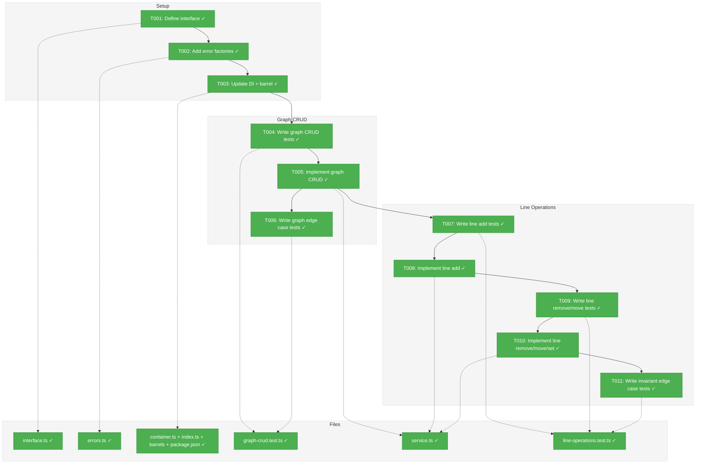
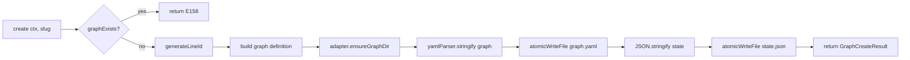
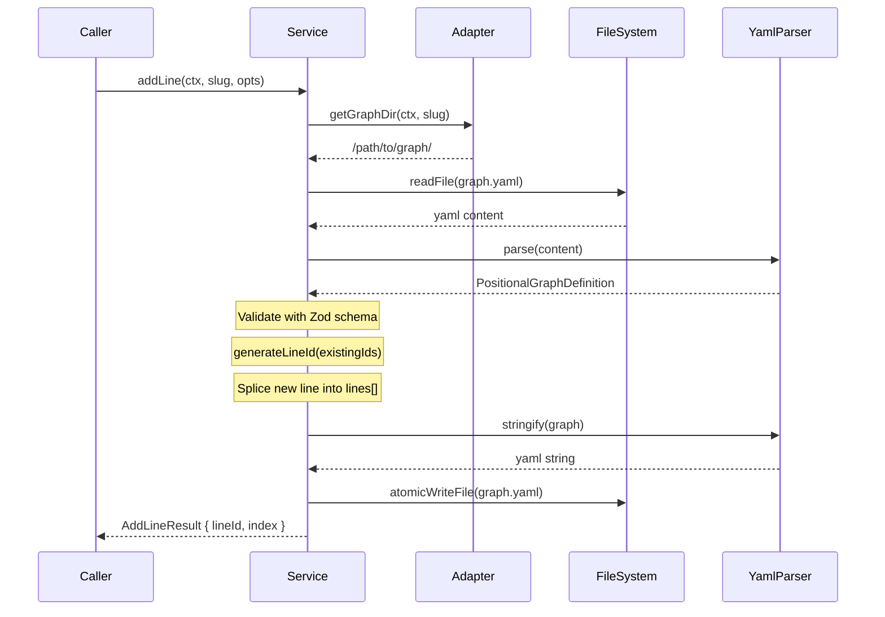

# Phase 3: Graph and Line CRUD Operations — Tasks & Alignment Brief

**Spec**: [../../positional-graph-spec.md](../../positional-graph-spec.md)
**Plan**: [../../positional-graph-plan.md](../../positional-graph-plan.md)
**Date**: 2026-02-01

---

## Executive Briefing

### Purpose
This phase implements the core graph lifecycle and line manipulation operations — the foundation that all subsequent phases (node ops, input wiring, status computation, CLI) build upon. Without this, there is no graph to add nodes to.

### What We're Building
A `PositionalGraphService` implementing `IPositionalGraphService` (graph + line methods only) that:
- Creates, loads, shows, deletes, and lists positional graphs
- Adds, removes, moves lines and sets line properties (label, description, transition)
- Persists all changes atomically to `graph.yaml` and `state.json`
- Enforces structural invariants (at-least-one-line, unique line IDs, valid indices)
- Returns structured `BaseResult` responses with error codes from the E150-E179 range

### User Value
Developers can create and manage positional graph structures — the prerequisite for placing nodes, wiring inputs, and computing execution status.

### Example
```
Service call: create(ctx, 'my-pipeline')
On disk: graph.yaml with slug "my-pipeline", one empty line (line-a4f), state.json initialized
Result: { graphSlug: 'my-pipeline', lineId: 'line-a4f', errors: [] }

Service call: addLine(ctx, 'my-pipeline', { afterLineId: 'line-a4f', label: 'Processing' })
On disk: graph.yaml now has 2 lines, new line inserted after line-a4f
Result: { lineId: 'line-b7e', index: 1, errors: [] }
```

---

## Objectives & Scope

### Objective
Implement the graph lifecycle and line CRUD operations as specified in the plan, satisfying AC-1 (graph lifecycle), AC-2 (line operations), AC-4 (positional invariants), AC-9 (workspace isolation), and AC-10 (error codes) at the service layer.

### Behavior Checklist
- [x] `create` produces graph with one empty line
- [x] `load` returns parsed graph definition validated against Zod schema
- [x] `show` returns graph structure for display
- [x] `delete` removes all graph files
- [x] `list` returns all graph slugs
- [x] `addLine` supports append, insert at index, before/after line ID
- [x] `removeLine` enforces empty check (E151) and last-line check (E156) — no cascade (DYK-P3-I4)
- [x] `moveLine` reorders lines array
- [x] `setLineTransition`, `setLineLabel`, `setLineDescription` modify line properties
- [x] All operations return `BaseResult` with appropriate error codes
- [x] All operations persist via atomicWriteFile

### Goals

- Define `IPositionalGraphService` interface (graph + line method signatures, result types)
- Implement `PositionalGraphService` with full graph CRUD
- Implement all line operations with invariant enforcement
- Add missing error factories (graph-not-found, graph-already-exists)
- Register service in DI container
- 95+ tests covering all graph CRUD and line operations

### Non-Goals (Scope Boundaries)

- Node operations (Phase 4)
- Input wiring and `collateInputs` (Phase 5)
- Status computation / `getStatus` / `canRun` (Phase 5)
- CLI commands (Phase 6)
- Integration tests with real filesystem (Phase 7)
- `triggerTransition` (Phase 5 — runtime state)
- WorkUnit validation (Phase 4 — at node-add time)
- `layout.json` creation or management (future UI)

---

## Flight Plan

### Summary Table
| File | Action | Origin | Modified By | Recommendation |
|------|--------|--------|-------------|----------------|
| `packages/positional-graph/src/interfaces/positional-graph-service.interface.ts` | Create | Plan 026, Phase 3 | — | keep-as-is |
| `packages/positional-graph/src/services/positional-graph.service.ts` | Create | Plan 026, Phase 3 | — | keep-as-is |
| `packages/positional-graph/src/errors/positional-graph-errors.ts` | Modify | Plan 026, Phase 2 | Plan 026 | keep-as-is |
| `packages/positional-graph/src/index.ts` | Modify | Plan 026, Phase 2 | Plan 026 | keep-as-is |
| `packages/positional-graph/src/container.ts` | Modify | Plan 026, Phase 2 | Plan 026 | keep-as-is |
| `packages/positional-graph/package.json` | Modify | Plan 026, Phase 2 | Plan 026 | keep-as-is |
| `test/unit/positional-graph/graph-crud.test.ts` | Create | Plan 026, Phase 3 | — | keep-as-is |
| `test/unit/positional-graph/line-operations.test.ts` | Create | Plan 026, Phase 3 | — | keep-as-is |

### Per-File Detail

#### `packages/positional-graph/src/interfaces/positional-graph-service.interface.ts`
- **Duplication check**: `IWorkGraphService` in `packages/workgraph/` is the analogous interface for the DAG system. Intentionally parallel, not duplication — different graph model, different operations.
- **Compliance**: Low-severity note: R-ARCH-002 says "interfaces in shared" but `IWorkGraphService` establishes precedent for package-scoped service interfaces. Plan File Placement Manifest classifies this as "plan-scoped."

#### `packages/positional-graph/src/services/positional-graph.service.ts`
- **Duplication check**: `WorkGraphService` (1388 lines) handles DAG graphs. Positional graph service is fundamentally different (lines, no edges). Not duplication.
- **YAML I/O strategy**: Service will accept `IYamlParser` via constructor injection (matching workgraph pattern). Resolves from `SHARED_DI_TOKENS.YAML_PARSER`. No standalone `yaml-helpers.ts` needed — YAML operations call `this.yamlParser.parse()` / `this.yamlParser.stringify()` directly within private service methods.

#### `packages/positional-graph/src/errors/positional-graph-errors.ts`
- **Provenance**: Created by Plan 026, Phase 2. Currently has 14 error factories (E150-E156, E160-E164, E170-E171).
- **Gap**: Missing `graphNotFoundError` and `graphAlreadyExistsError` factories. The plan task 3.2 references "E105" which is a workgraph code. Need new codes E157 (graph not found) and E158 (graph already exists) in the positional-graph range.

### Compliance Check
No violations found. Low-severity note on interface placement is established precedent.

---

## Requirements Traceability

### Coverage Matrix
| AC | Description | Flow Summary | Files in Flow (new/modified) | Tasks | Status |
|----|-------------|--------------|------------------------------|-------|--------|
| AC1 | Graph lifecycle (create, show, delete, list) | Service → adapter.graphExists/ensureGraphDir/removeGraph/listGraphSlugs → yamlParser.stringify/parse → atomicWriteFile → schema validation | interface.ts, service.ts, errors.ts(+E157/E158), container.ts, index.ts, interfaces/index.ts, services/index.ts, package.json, graph-crud.test.ts | T001-T006 | ✅ Complete |
| AC2 | Line operations (add, remove, move, set) | Service → load graph → generateLineId → mutate lines[] → persist → error guards (E150/E151/E152/E156) | interface.ts, service.ts, line-operations.test.ts | T001, T007-T011 | ✅ Complete |
| AC4 | Positional invariants (unique IDs, one-line, ordering) | generateLineId uniqueness, Zod min(1), E156 last-line guard, array splice contiguity | service.ts, line-operations.test.ts, graph-crud.test.ts | T005, T006, T008, T010, T011 | ✅ Complete |
| AC9 | Workspace isolation (worktreePath/.chainglass/data/workflows/) | Adapter domain='workflows' + getDomainPath(ctx) — Phase 2 adapter used, not modified | service.ts (passes ctx to adapter) | T005 | ✅ Complete (Phase 2) |
| AC10 | Error codes E150-E179 | E157/E158 new factories + existing E150-E156 from Phase 2; service returns BaseResult with ResultError | errors.ts, service.ts | T002, T005, T008, T010 | ✅ Complete |

### Gaps Found

Two minor gaps identified by `/plan-5c-requirements-flow` and resolved:

1. **GAP-1** (resolved): `packages/positional-graph/src/services/index.ts` — intermediate barrel file must re-export the new service class. Added to T003's absolute paths.
2. **GAP-2** (resolved): `packages/positional-graph/src/interfaces/index.ts` — new barrel file for the interfaces directory. Added to T003's absolute paths.

Both were implicitly within T003's scope ("barrel exports") but not listed in absolute paths. Now explicit.

### Orphan Files
All task table files map to at least one acceptance criterion. No orphans found.

---

## Architecture Map

### Component Diagram
<!-- Status: grey=pending, orange=in-progress, green=completed, red=blocked -->
<!-- Updated by plan-6 during implementation -->



### Task-to-Component Mapping

<!-- Status: Pending | In Progress | Complete | Blocked -->

| Task | Component(s) | Files | Status | Comment |
|------|-------------|-------|--------|---------|
| T001 | Interface | positional-graph-service.interface.ts | ✅ Complete | Define graph + line method signatures and result types |
| T002 | Error Codes | positional-graph-errors.ts | ✅ Complete | Add graphNotFoundError (E157) and graphAlreadyExistsError (E158) |
| T003 | DI + Barrel | container.ts, index.ts, package.json | ✅ Complete | Register service, add /interfaces subpath, export new modules |
| T004 | Test Suite | graph-crud.test.ts | ✅ Complete | TDD RED: write failing tests for create, load, show, delete, list |
| T005 | Service | positional-graph.service.ts | ✅ Complete | TDD GREEN: implement graph CRUD to pass tests |
| T006 | Test Suite | graph-crud.test.ts | ✅ Complete | Edge cases: duplicate create, load nonexistent, delete nonexistent |
| T007 | Test Suite | line-operations.test.ts | ✅ Complete | TDD RED: write failing tests for addLine (append, at index, after/before) |
| T008 | Service | positional-graph.service.ts | ✅ Complete | TDD GREEN: implement addLine to pass tests |
| T009 | Test Suite | line-operations.test.ts | ✅ Complete | TDD RED: write failing tests for removeLine, moveLine, set properties |
| T010 | Service | positional-graph.service.ts | ✅ Complete | TDD GREEN: implement remove, move, set to pass tests |
| T011 | Test Suite | line-operations.test.ts | ✅ Complete | Invariant edge cases: E150, E151, E152, E156, duplicate line ID prevention |

---

## Tasks

| Status | ID | Task | CS | Type | Dependencies | Absolute Path(s) | Validation | Subtasks | Notes |
|--------|------|------|-----|------|--------------|-------------------|------------|----------|-------|
| [x] | T001 | Define `IPositionalGraphService` interface with graph + line method signatures and result types (`GraphCreateResult`, `PGLoadResult`, `PGShowResult`, `PGListResult`, `AddLineResult`, `AddLineOptions`) | 2 | Setup | – | `/home/jak/substrate/026-positional-graph/packages/positional-graph/src/interfaces/positional-graph-service.interface.ts` | Interface compiles, all method signatures match workshop §Service Interface (graph + line subset). Node/input/status methods declared but not implemented (placeholder for Phase 4-5). | – | Per workshop: WorkspaceContext as first param on every method. Include only graph + line methods in Phase 3 scope; declare remaining method signatures for type completeness. **DYK-P3-I2**: `PGLoadResult` carries `definition: PositionalGraphDefinition` (raw Zod type for programmatic use). `PGShowResult` carries a lightweight summary: `slug`, `version`, `description`, `createdAt`, `lines: Array<{ id, label, description, transition, nodeCount }>`, `totalNodeCount` (display-oriented for CLI). `PGListResult` carries `slugs: string[]`. This separation keeps `load` = raw data for code, `show` = summary for display, and avoids overlap with Phase 5 `getStatus`. plan-scoped |
| [x] | T002 | Add `graphNotFoundError` (E157) and `graphAlreadyExistsError` (E158) factory functions to positional-graph-errors.ts | 1 | Setup | – | `/home/jak/substrate/026-positional-graph/packages/positional-graph/src/errors/positional-graph-errors.ts` | New factories return `ResultError` with correct codes, messages, and actions. Existing error tests updated or new tests added. | – | Plan task 3.2 references E105 (workgraph code) — corrected to E157/E158 in positional-graph range. plan-scoped |
| [x] | T003 | Update DI container to register `POSITIONAL_GRAPH_SERVICE`, add `/interfaces` subpath export to package.json, update barrel exports in index.ts + services/index.ts, create interfaces/index.ts barrel | 2 | Setup | T001 | `/home/jak/substrate/026-positional-graph/packages/positional-graph/src/container.ts`, `/home/jak/substrate/026-positional-graph/packages/positional-graph/package.json`, `/home/jak/substrate/026-positional-graph/packages/positional-graph/src/index.ts`, `/home/jak/substrate/026-positional-graph/packages/positional-graph/src/interfaces/index.ts`, `/home/jak/substrate/026-positional-graph/packages/positional-graph/src/services/index.ts` | `registerPositionalGraphServices` resolves `IYamlParser` from `SHARED_DI_TOKENS.YAML_PARSER` and passes to service constructor alongside adapter, fs, pathResolver. Package.json has `/interfaces` subpath. interfaces/index.ts barrel created. services/index.ts re-exports service class. | – | Per ADR-0009, ADR-0004. Service constructor: (fs, pathResolver, yamlParser, adapter). Per 5c GAP-1/GAP-2: barrel files must be explicit. plan-scoped |
| [x] | T004 | Write failing tests for graph CRUD operations: create (produces 1 empty line + state.json), load (returns validated graph), show (returns formatted structure), delete (removes files), list (returns all slugs) | 3 | Test | T001, T002, T003 | `/home/jak/substrate/026-positional-graph/test/unit/positional-graph/graph-crud.test.ts` | Tests exist and FAIL (RED). Cover: create happy path, create checks slug validation, load validates with Zod, show returns structure, delete removes graph dir, list returns empty then populated. | – | Use FakeFileSystem + FakePathResolver + YamlParserAdapter (real parser, no mocks per spec Q3). plan-scoped |
| [x] | T005 | Implement graph CRUD methods (create, load, show, delete, list) to pass tests | 3 | Core | T004 | `/home/jak/substrate/026-positional-graph/packages/positional-graph/src/services/positional-graph.service.ts` | All graph CRUD tests pass (GREEN). create writes graph.yaml + state.json via atomicWriteFile. load reads + validates with Zod. delete calls adapter.removeGraph. list calls adapter.listGraphSlugs. E157 on load/show/delete nonexistent. E158 on create duplicate. | – | Per CD-04: No start node. Line 0 is entry point. Per CD-06: atomicWriteFile for persistence. **DYK-P3-I1**: Implement a `private loadGraphDefinition(ctx, slug)` helper that returns raw `PositionalGraphDefinition` (or errors) — used by all mutation methods (T008, T010). Public `load()` delegates to this helper and wraps in `PGLoadResult`. Avoids verbose Result unwrapping in every mutation path. plan-scoped |
| [x] | T006 | Write and pass tests for graph CRUD edge cases: create duplicate (E158), load nonexistent (E157), delete nonexistent (idempotent), load with invalid YAML, load with schema validation failure | 2 | Test | T005 | `/home/jak/substrate/026-positional-graph/test/unit/positional-graph/graph-crud.test.ts` | Edge case tests pass. Error results contain correct error codes and messages. | – | plan-scoped |
| [x] | T007 | Write failing tests for addLine: append (no options), insert at index (atIndex), insert after lineId (afterLineId), insert before lineId (beforeLineId), with label/description/transition options | 3 | Test | T005 | `/home/jak/substrate/026-positional-graph/test/unit/positional-graph/line-operations.test.ts` | Tests exist and FAIL (RED). Cover: append adds to end, atIndex inserts at position, afterLineId/beforeLineId insert relative to ID, options (label, description, transition) applied, generated line ID format. | – | Per spec Q7: line references by ID only. Per spec Q8: always require line ID, no auto-select. plan-scoped |
| [x] | T008 | Implement addLine to pass tests | 2 | Core | T007 | `/home/jak/substrate/026-positional-graph/packages/positional-graph/src/services/positional-graph.service.ts` | All addLine tests pass (GREEN). Line added at correct position. graph.yaml persisted. Line ID generated via generateLineId. | – | **DYK-P3-I3**: `addLine` must enforce mutual exclusivity of positioning options (`afterLineId`, `beforeLineId`, `atIndex`). If more than one is provided, return error using E152 with message "Conflicting positioning options — provide at most one of afterLineId, beforeLineId, atIndex". Guard check at top of method before any mutation. plan-scoped |
| [x] | T009 | Write failing tests for removeLine (empty line, non-empty E151, last line E156), moveLine (to new index, boundary conditions), setLineTransition, setLineLabel, setLineDescription | 3 | Test | T008 | `/home/jak/substrate/026-positional-graph/test/unit/positional-graph/line-operations.test.ts` | Tests exist and FAIL (RED). Cover: remove empty line succeeds, remove non-empty always fails E151, remove last line fails E156, move reorders correctly, set properties persist. | – | **DYK-P3-I4**: No cascade option. `removeLine` always rejects non-empty lines (E151). Node cleanup is `removeNode`'s job (Phase 4). `RemoveLineOptions` type removed from interface. plan-scoped |
| [x] | T010 | Implement removeLine, moveLine, setLineTransition, setLineLabel, setLineDescription to pass tests | 3 | Core | T009 | `/home/jak/substrate/026-positional-graph/packages/positional-graph/src/services/positional-graph.service.ts` | All line operation tests pass (GREEN). Each op: load graph → mutate → persist via atomicWriteFile. Error guards enforced. `removeLine` always rejects non-empty lines (E151), no cascade. | – | plan-scoped |
| [x] | T011 | Write and pass tests for invariant edge cases: invalid line index E152, line not found E150, duplicate line ID prevention (via generateLineId), ordering consistency after add/remove/move sequences, contiguous indices after operations | 2 | Test | T010 | `/home/jak/substrate/026-positional-graph/test/unit/positional-graph/line-operations.test.ts` | Invariant tests pass. After any sequence of operations, lines array is contiguous and deterministic. | – | Per plan task 3.7: verify ordering consistency. plan-scoped |

---

## Alignment Brief

### Prior Phases Review

#### Phase 1: WorkUnit Type Extraction (Complete)

**Deliverables**: `WorkUnitInput`, `WorkUnitOutput`, `WorkUnit` types extracted to `@chainglass/workflow/interfaces/workunit.types.ts` with backward-compatible aliases. Re-exported from `@chainglass/workgraph` for existing consumers.

**Key Lessons**:
- Transitive re-export chains work cleanly — changing one file propagates through all barrels
- `InputDeclaration` name collision in workflow package forced renaming to `WorkUnitInput`/`WorkUnitOutput`
- `pnpm test --filter @chainglass/workgraph` runs 0 tests (all tests live in root `test/`) — use `just check` for real validation

**Dependencies Exported**: All WorkUnit types importable from `@chainglass/workflow`. For positional-graph, use: `import type { WorkUnit, WorkUnitInput, WorkUnitOutput } from '@chainglass/workflow'`

**Subtask 001**: Aligned spec, plan, and prototype workshop with execution rules workshop. Per-node execution model, getStatus API, E165 removal — all design docs now consistent.

#### Phase 2: Schema, Types, and Filesystem Adapter (Complete)

**Deliverables** (all in `packages/positional-graph/`):
- Zod schemas: `PositionalGraphDefinitionSchema`, `LineDefinitionSchema`, `NodeConfigSchema`, `InputResolutionSchema`, `StateSchema`
- ID generation: `generateLineId()`, `generateNodeId()`
- Error factories: 14 functions covering E150-E171 (excluding E157, E158 which we add in Phase 3)
- `atomicWriteFile()` — temp-then-rename with best-effort cleanup
- `PositionalGraphAdapter` — signpost pattern: `getGraphDir` + directory lifecycle
- `registerPositionalGraphServices()` — DI registration (adapter only, Phase 3 adds service)
- `POSITIONAL_GRAPH_DI_TOKENS` — 2 tokens (service + adapter)
- Package scaffold with subpath exports (`/schemas`, `/errors`, `/adapter`)
- 95 tests passing (50 schema + 10 ID gen + 18 error + 17 adapter)

**Key Architectural Decisions**:
- **DYK-I1: Adapter = signpost + directory lifecycle, NOT I/O layer.** Service uses known offsets from `getGraphDir`: `graph.yaml`, `state.json`, `nodes/<id>/node.yaml`. Do NOT add YAML/JSON I/O to the adapter.
- **DYK-I4: Only 2 DI tokens.** YAML parser reuses `SHARED_DI_TOKENS.YAML_PARSER`.
- **DYK-I5: Adapter constructor = (fs, pathResolver) only.** YAML parser belongs on the service.
- **StateSchema excludes computed statuses**: Only stores `running`, `waiting-question`, `blocked-error`, `complete`. `pending` and `ready` are computed-only.
- **FakeFileSystem/FakePathResolver for tests**: In-memory implementations from `@chainglass/shared`, not mocks. Faster and more reliable than real tmp dirs.

**Technical Debt Carried**:
- No `yaml` dependency yet (not needed until service does YAML I/O — Phase 3 resolves via DI)
- No `/interfaces` subpath export (Phase 3 adds it)
- `container.ts` line 20 TODO: "Phase 3 will add POSITIONAL_GRAPH_SERVICE"

**Fix Tasks Applied** (post-code-review):
- FIX-001: ID generation deterministic fallback (100 random + full enumeration)
- FIX-002: Slug validation in adapter `getGraphDir` (defense-in-depth)
- FIX-003: Atomic write cleanup on rename failure

### Critical Findings Affecting This Phase

| Finding | Impact on Phase 3 | Addressed By |
|---------|-------------------|--------------|
| CD-03: Cycle detection eliminated | No cycle code needed — lines enforce acyclicity | Implicit (no code to write) |
| CD-04: Start node eliminated | `create` produces one empty line, no sentinel node | T005 |
| CD-06: Atomic writes | All graph.yaml and state.json writes via `atomicWriteFile` | T005, T008, T010 |
| CD-10: DI registration pattern | Service registered via `useFactory` per ADR-0009 | T003 |
| CD-12: Error code ranges | E150-E179 for structure errors; add E157-E158 for graph-level | T002 |
| CD-14: Hex3 ID local reimpl | `generateLineId` already implemented in Phase 2 | Reuse from Phase 2 |

### ADR Decision Constraints

- **ADR-0004** (DI Architecture): `useFactory` registration. Service constructor receives injected dependencies. **Constrains**: T003. **Addressed by**: T003.
- **ADR-0008** (Workspace Storage): Data under `ctx.worktreePath/.chainglass/data/workflows/<slug>/`. **Constrains**: T005 (path derivation). **Addressed by**: T005 (uses adapter.getGraphDir).
- **ADR-0009** (Module Registration): `registerPositionalGraphServices()` function pattern. **Constrains**: T003. **Addressed by**: T003.

### PlanPak Placement Rules

- All new files in `packages/positional-graph/` are **plan-scoped** (serve only Plan 026)
- Error file modification is **plan-scoped** (original file created by this plan)
- DI tokens in `@chainglass/shared` are **cross-cutting** (needed by CLI wiring in Phase 6)
- Test files follow project conventions in `test/unit/positional-graph/`

### Invariants & Guardrails

- **At-least-one-line**: `PositionalGraphDefinitionSchema.lines.min(1)` enforces at Zod level; service additionally checks before remove
- **Unique line IDs**: `generateLineId` takes existing IDs, guaranteed unique within hex3 space (4096)
- **Deterministic ordering**: Lines array index = line position; splice operations maintain contiguity
- **No orphan nodes**: `removeLine` always rejects non-empty lines (E151); node cleanup is `removeNode`'s responsibility (Phase 4)
- **state.json is inert in Phase 3**: `create` seeds it; line operations only modify `graph.yaml`. `state.json` is not read or updated until Phase 4/5. This is intentional — Phase 3 = structure, Phase 4/5 = runtime (DYK-P3-I5)

### Inputs to Read

| File | Purpose |
|------|---------|
| `packages/positional-graph/src/schemas/graph.schema.ts` | Schema definitions for validation |
| `packages/positional-graph/src/schemas/state.schema.ts` | State schema for initial state.json |
| `packages/positional-graph/src/services/id-generation.ts` | `generateLineId` for new lines |
| `packages/positional-graph/src/services/atomic-file.ts` | `atomicWriteFile` for persistence |
| `packages/positional-graph/src/errors/positional-graph-errors.ts` | Error factories |
| `packages/positional-graph/src/adapter/positional-graph.adapter.ts` | Adapter methods |
| `packages/positional-graph/src/container.ts` | Current DI registration |
| `packages/shared/src/interfaces/yaml-parser.interface.ts` | `IYamlParser` interface |
| `packages/shared/src/adapters/yaml-parser.adapter.ts` | Real YAML parser for tests |
| `packages/workgraph/src/interfaces/workgraph-service.interface.ts` | Pattern reference for service interface |

### Flow Diagram: Graph Create



### Sequence Diagram: Line Operations



### Test Plan (Full TDD, No Mocks)

**Test infrastructure**:
- `FakeFileSystem` + `FakePathResolver` from `@chainglass/shared` (in-memory, not mocks)
- `YamlParserAdapter` from `@chainglass/shared` (real YAML parser — per spec Q3: no mocks)
- Helper: `createTestService()` that wires up service with fakes + real YAML parser
- Helper: `createTestContext()` reused from adapter tests

**Test naming convention**: `describe('PositionalGraphService') > describe('methodName') > it('does what')`

#### Graph CRUD Tests (T004, T006)

| Test | Rationale | Expected |
|------|-----------|----------|
| `create > creates graph with one empty line` | Core happy path, validates CD-04 | Result has graphSlug, lineId; graph.yaml on disk has 1 line with empty nodes[] |
| `create > initializes state.json` | Persistence contract | state.json on disk with graph_status: 'pending', empty nodes/transitions |
| `create > generates line ID in correct format` | ID generation contract | lineId matches `line-[0-9a-f]{3}` |
| `create > returns error for duplicate slug` | E158 guard | errors[0].code === 'E158' |
| `load > returns parsed graph definition` | Load contract | Result contains PositionalGraphDefinition matching schema |
| `load > validates graph against Zod schema` | Schema enforcement | Corrupted YAML returns error |
| `load > returns error for nonexistent graph` | E157 guard | errors[0].code === 'E157' |
| `show > returns graph structure` | Display contract | Result has slug, version, lines with IDs and properties |
| `delete > removes graph directory` | Cleanup contract | adapter.graphExists returns false after delete |
| `delete > is idempotent for nonexistent graph` | Safe delete | No error on delete of nonexistent |
| `list > returns empty array when no graphs` | Empty state | result === [] |
| `list > returns all graph slugs` | Multi-graph | Both slugs present after creating 2 graphs |

#### Line Operation Tests (T007, T009, T011)

| Test | Rationale | Expected |
|------|-----------|----------|
| `addLine > appends line to end` | Default behavior | New line at last index |
| `addLine > inserts at specific index` | atIndex option | Line at specified index, others shifted |
| `addLine > inserts after specified line ID` | afterLineId option | New line at afterLine.index + 1 |
| `addLine > inserts before specified line ID` | beforeLineId option | New line at beforeLine.index |
| `addLine > applies label, description, transition` | Options forwarding | Properties set on new line |
| `addLine > returns error for conflicting positioning options` | DYK-P3-I3 mutual exclusivity | errors[0].code === 'E152' |
| `addLine > returns error for invalid afterLineId` | E150 guard | errors[0].code === 'E150' |
| `removeLine > removes empty line` | Happy path | Line removed, graph persisted |
| `removeLine > returns error for non-empty line` | E151 guard — always enforced, no cascade | errors[0].code === 'E151' |
| `removeLine > returns error when removing last line` | E156 guard | errors[0].code === 'E156' |
| `removeLine > returns error for nonexistent line` | E150 guard | errors[0].code === 'E150' |
| `moveLine > moves line to new index` | Reorder | Line at new position, others shifted |
| `moveLine > returns error for invalid index` | E152 guard | errors[0].code === 'E152' |
| `moveLine > returns error for nonexistent line` | E150 guard | errors[0].code === 'E150' |
| `setLineTransition > sets auto/manual` | Property mutation | Line transition updated, persisted |
| `setLineLabel > sets label` | Property mutation | Line label updated, persisted |
| `setLineDescription > sets description` | Property mutation | Line description updated, persisted |
| `set* > returns error for nonexistent line` | E150 guard | errors[0].code === 'E150' |
| `invariant > ordering is contiguous after add+remove+move` | Structural integrity | Lines array indices 0..N-1 after any sequence |
| `invariant > line IDs remain unique after operations` | ID uniqueness | No duplicate IDs in lines[] |

### Step-by-Step Implementation Outline

1. **T001**: Define interface file. Import `WorkspaceContext`, `BaseResult`, `TransitionMode` types. Define graph result types (`GraphCreateResult`, `PGLoadResult`, `PGShowResult`, `PGListResult`, `AddLineResult`). Define option types (`AddLineOptions`, `RemoveLineOptions`). Declare all `IPositionalGraphService` method signatures (graph + line for Phase 3; node/input/status as placeholders).
2. **T002**: Add 2 new error factories to `positional-graph-errors.ts`. Add E157 and E158 to `POSITIONAL_GRAPH_ERROR_CODES` constant. Write/update tests.
3. **T003**: Update `container.ts` — add `POSITIONAL_GRAPH_SERVICE` factory resolving `IFileSystem`, `IPathResolver`, `IYamlParser`, `PositionalGraphAdapter`. Update `package.json` — add `./interfaces` subpath export. Update `index.ts` — export interface and service.
4. **T004**: Create `graph-crud.test.ts`. Write `createTestService()` helper. Write ~12 failing tests for create, load, show, delete, list.
5. **T005**: Create `positional-graph.service.ts`. Implement constructor accepting `(fs, pathResolver, yamlParser, adapter)`. Implement `create` (generate line ID, build definition, write graph.yaml + state.json), `load` (read + parse + validate), `show` (load + format), `delete` (adapter.removeGraph), `list` (adapter.listGraphSlugs).
6. **T006**: Add ~5 edge case tests (duplicate create, invalid YAML, schema failure). Ensure all pass.
7. **T007**: Add addLine tests (~6 tests) to `line-operations.test.ts` covering all insertion modes.
8. **T008**: Implement `addLine` in service. Load → generate ID → splice → persist.
9. **T009**: Add removeLine, moveLine, set* tests (~12 tests).
10. **T010**: Implement removeLine, moveLine, setLineTransition, setLineLabel, setLineDescription.
11. **T011**: Add invariant edge case tests (~4 tests). Verify ordering after complex sequences.

### Commands to Run

```bash
# Run Phase 3 tests only
pnpm test -- --run test/unit/positional-graph/graph-crud.test.ts
pnpm test -- --run test/unit/positional-graph/line-operations.test.ts

# Run all positional-graph tests
pnpm test -- --run test/unit/positional-graph/

# Full quality gate
just check
# Expected: lint 0 errors, typecheck pass, all tests pass, build pass

# Type check only
just typecheck

# Build package
pnpm build --filter @chainglass/positional-graph
```

### Risks/Unknowns

| Risk | Severity | Mitigation |
|------|----------|------------|
| YAML parser integration — `YamlParserAdapter` in tests vs `FakeYamlParser` | Medium | Use real `YamlParserAdapter` per spec Q3 (no mocks). It depends on `yaml` package which is already a dep of `@chainglass/shared`. |
| ~~`removeLine` cascade~~ | ~~Low~~ | **Eliminated (DYK-P3-I4)**: No cascade option. `removeLine` always rejects non-empty lines. Node cleanup deferred to `removeNode` (Phase 4). |
| Load-modify-persist race conditions | Low | `atomicWriteFile` handles write atomicity. No concurrent access in CLI context. |
| State.json initialization on create | Low | Write minimal valid state: `{ graph_status: 'pending', updated_at: <now>, nodes: {}, transitions: {} }` |

### Ready Check

- [ ] ADR constraints mapped to tasks (ADR-0004 → T003, ADR-0008 → T005, ADR-0009 → T003)
- [ ] All error codes identified (E150, E151, E152, E156, E157-new, E158-new)
- [ ] YAML I/O strategy decided: `IYamlParser` via DI injection (not standalone helpers)
- [ ] Test approach decided: `FakeFileSystem` + `FakePathResolver` + real `YamlParserAdapter`
- [ ] Prior phase deliverables verified: schemas, adapter, errors, ID gen all available
- [ ] Interface scope defined: graph + line methods for Phase 3; node/input/status declared as stubs

---

## Phase Footnote Stubs

_No footnotes created during planning. Plan-6 will add `[^N]` entries post-implementation._

| Footnote | Task | Description |
|----------|------|-------------|
| | | |

---

## Evidence Artifacts

- **Execution log**: `phase-3-graph-and-line-crud-operations/execution.log.md` — created during implementation
- **Test results**: 138 positional-graph tests pass (15 graph CRUD + 26 line ops + 20 errors + 17 adapter + 50 schemas + 10 ID gen)
- **Quality gate**: `just check` passes — 2832 tests, 0 lint errors, typecheck clean, build successful

---

## Discoveries & Learnings

_Populated during implementation by plan-6. Log anything of interest to your future self._

| Date | Task | Type | Discovery | Resolution | References |
|------|------|------|-----------|------------|------------|
| 2026-02-01 | T005 | decision | TDD RED-GREEN rhythm adapted — service implemented as single coherent pass with shared helpers across graph/line boundary | Pragmatic adaptation accepted; all behavior tested, RED observed for graph CRUD | log#task-t005 |
| 2026-02-01 | T005 | insight | Non-null assertions rejected by linter; TypeScript doesn't narrow optional fields after `.length > 0` check | Used discriminated union `{ ok: true; definition } \| { ok: false; errors }` for proper type narrowing | log#task-t005 |

**Types**: `gotcha` | `research-needed` | `unexpected-behavior` | `workaround` | `decision` | `debt` | `insight`

**What to log**:
- Things that didn't work as expected
- External research that was required
- Implementation troubles and how they were resolved
- Gotchas and edge cases discovered
- Decisions made during implementation
- Technical debt introduced (and why)
- Insights that future phases should know about

_See also: `execution.log.md` for detailed narrative._

---

## Directory Layout

```
docs/plans/026-positional-graph/
  ├── positional-graph-plan.md
  ├── positional-graph-spec.md
  └── tasks/
      ├── phase-1-workunit-type-extraction/
      │   ├── tasks.md
      │   └── execution.log.md
      ├── phase-2-schema-types-and-filesystem-adapter/
      │   ├── tasks.md
      │   └── execution.log.md
      └── phase-3-graph-and-line-crud-operations/
          ├── tasks.md              ← this file
          └── execution.log.md      # created by /plan-6
```

---

## Critical Insights Discussion

**Session**: 2026-02-01
**Context**: Phase 3 tasks dossier — Graph and Line CRUD Operations
**Analyst**: AI Clarity Agent
**Reviewer**: jak
**Format**: Water Cooler Conversation (5 Critical Insights)

### Insight 1: The `load` Method Has a Hidden Dual-Purpose Problem (DYK-P3-I1)

**Did you know**: The `load` method serves both as a public API (returning `PGLoadResult`) and as the internal building block every mutation method needs — but without a private helper, every mutation path has verbose Result unwrapping.

**Implications**:
- Every mutation method (addLine, removeLine, moveLine, set*) needs raw `PositionalGraphDefinition`, not a Result wrapper
- Without distinction, mutation code is cluttered with error-checking boilerplate before accessing data
- The pattern is already established in `WorkGraphService` which has similar internal loading

**Options Considered**:
- Option A: Explicit private `loadGraphDefinition()` helper in T005
- Option B: Let implementation discover the pattern organically
- Option C: Shared `LoadContext` type (over-engineered)

**AI Recommendation**: Option A — document the private/public load split in T005
- Reasoning: Prevents implementation confusion and matches established workgraph pattern

**Decision**: Option A — T005 annotated with DYK-P3-I1

**Action Items**:
- [x] Updated T005 notes with private `loadGraphDefinition()` helper requirement

**Affects**: T005, T008, T010 (all methods that load-mutate-persist)

---

### Insight 2: The `show` vs `load` Distinction Is Undefined (DYK-P3-I2)

**Did you know**: The workshop references `PGShowResult` and `PGLoadResult` but never defines their fields, leaving the implementor to guess what `show` returns vs `load`.

**Implications**:
- Without clear distinction, `show` becomes either a pointless `load` alias or an ad-hoc invention
- Phase 5's `getStatus` is the real runtime display API — `show` should be structural summary only
- CLI `cg wf show <slug>` needs a human-readable format, not raw Zod output

**Options Considered**:
- Option A: `PGLoadResult` = raw definition, `PGShowResult` = lightweight summary (slug, lines with nodeCount, etc.)
- Option B: Both identical (redundant)
- Option C: Drop `show` entirely

**AI Recommendation**: Option A — clear separation of raw data vs display summary
- Reasoning: Matches CLI usage pattern and avoids Phase 5 overlap

**Decision**: Option A — result types specified in T001 annotation

**Action Items**:
- [x] Updated T001 notes with DYK-P3-I2 specifying field shapes for both result types

**Affects**: T001 (interface), T004/T005 (implementation + tests)

---

### Insight 3: `addLine` Options Have a Priority Conflict (DYK-P3-I3)

**Did you know**: `AddLineOptions` allows `afterLineId`, `beforeLineId`, and `atIndex` simultaneously, but no rule specifies what happens when multiple are provided.

**Implications**:
- Silent priority ordering leads to different caller assumptions and subtle bugs
- Phase 6 CLI has to decide whether to allow conflicting flags together
- Classic API design trap — mutual exclusivity is the standard solution

**Options Considered**:
- Option A: Mutual exclusivity with E152 error on conflict
- Option B: Documented priority order (silent override)
- Option C: TypeScript discriminated union (verbose)

**AI Recommendation**: Option A — error on conflict
- Reasoning: Simple, prevents bugs, easy to test, principle of least surprise

**Decision**: Option A — guard check at top of addLine, E152 on conflict

**Action Items**:
- [x] Updated T008 notes with DYK-P3-I3 mutual exclusivity requirement
- [x] Added test case to line operations test plan

**Affects**: T007 (test), T008 (implementation)

---

### Insight 4: `removeLine` Cascade Eliminated (DYK-P3-I4)

**Did you know**: The workshop defined `RemoveLineOptions.cascade` for removing non-empty lines, but this creates cross-concern complexity — line removal would need to clean up node directories and state.json entries.

**Implications**:
- Cascade crosses concern boundaries (line ops cleaning up node state)
- Without cascade, `removeLine` always enforces E151 for non-empty lines
- Node cleanup is naturally `removeNode`'s job (Phase 4)
- Eliminates the stale state.json ghost entry problem entirely

**Options Considered**:
- Option A: Clean up state.json on cascade remove
- Option B: Defer cleanup to Phase 5
- Option C: No cascade — always enforce E151

**AI Recommendation**: Option A (clean up state.json during cascade)

**Discussion Summary**: User challenged the cascade premise entirely — if `removeNode` handles its own cleanup, why should `removeLine` duplicate that logic? The simpler model: remove nodes first, then remove the empty line. This is cleaner and avoids cross-concern complexity.

**Decision**: Option C (user override) — No cascade. `RemoveLineOptions` type dropped. `removeLine` always enforces E151. Node cleanup deferred to Phase 4 `removeNode`.

**Action Items**:
- [x] Updated T009, T010 to remove cascade references
- [x] Dropped `RemoveLineOptions` from T001 result types
- [x] Updated test plan to remove cascade test cases
- [x] Updated invariants section and risks table

**Affects**: T001 (interface), T009 (tests), T010 (implementation), risks table

---

### Insight 5: `state.json` Is Inert in Phase 3 (DYK-P3-I5)

**Did you know**: `create` seeds `state.json` but no other Phase 3 operation reads or updates it — it sits untouched until Phase 4/5.

**Implications**:
- Line operations only modify `graph.yaml` — state.json.updated_at never changes after creation
- This is intentional: Phase 3 = structure (graph.yaml), Phase 4/5 = runtime (state.json)
- `delete` handles cleanup implicitly via `adapter.removeGraph` (recursive directory removal)
- Implementor should not waste time adding state.json updates to line operations

**Options Considered**: None — this is a confirmation of correct design, not a problem to solve.

**Decision**: Documented as intentional. No state.json updates in line operations.

**Action Items**:
- [x] Added clarifying note to Invariants & Guardrails section

**Affects**: T005, T008, T010 (implementor guidance)

---

## Session Summary

**Insights Surfaced**: 5 critical insights identified and discussed
**Decisions Made**: 5 decisions reached
**Action Items Created**: 0 remaining (all applied inline)
**Areas Updated**: T001, T005, T007 test plan, T008, T009, T010, invariants, risks table

**Shared Understanding Achieved**: Yes

**Confidence Level**: High — key API ambiguities resolved, scope simplified by removing cascade, all insights documented inline as DYK-P3-I1 through DYK-P3-I5.

**Next Steps**: Proceed to `/plan-6-implement-phase` for Phase 3 implementation.
