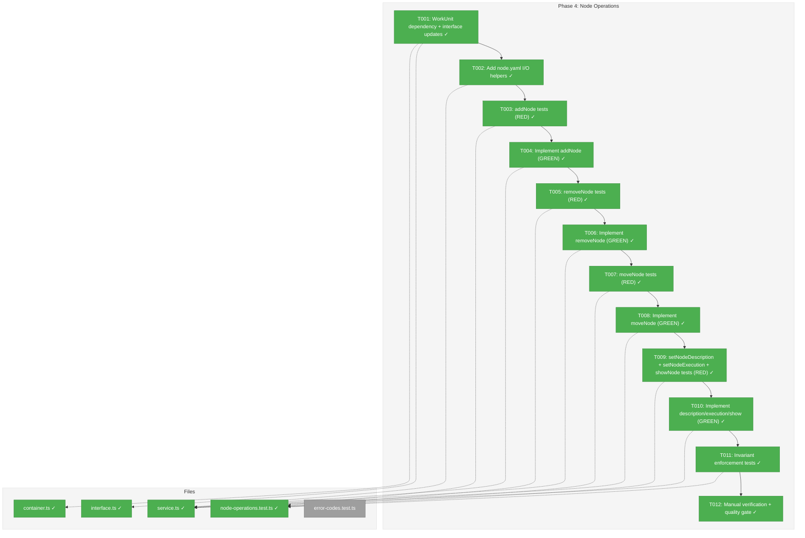
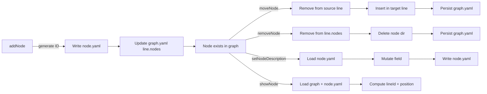
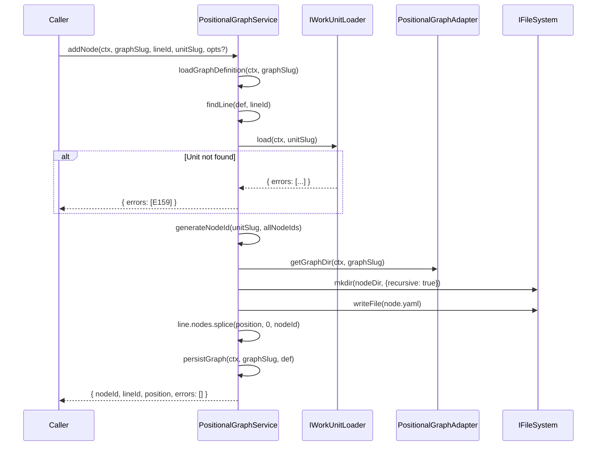

# Phase 4: Node Operations with Positional Invariants — Tasks & Alignment Brief

**Spec**: [../../positional-graph-spec.md](../../positional-graph-spec.md)
**Plan**: [../../positional-graph-plan.md](../../positional-graph-plan.md)
**Date**: 2026-02-01
**Phase Slug**: `phase-4-node-operations-with-positional-invariants`

---

## Executive Briefing

### Purpose
This phase implements the six node-level service methods (`addNode`, `removeNode`, `moveNode`, `setNodeDescription`, `setNodeExecution`, `showNode`) that are currently Phase 4 stubs throwing "Not implemented" in `PositionalGraphService`. Nodes are the leaf-level work items inside lines — each node references a WorkUnit, has an execution mode (serial/parallel), and persists its configuration in a `node.yaml` file.

### What We're Building
Full node lifecycle management on `PositionalGraphService`:
- **addNode**: Append/insert a node in a line, validate the WorkUnit exists (E159 for unit-not-found), generate `<unitSlug>-<hex3>` node ID, write `node.yaml`, update `graph.yaml` line's `nodes[]` array
- **removeNode**: Delete node directory (`nodes/<id>/`), remove from line's `nodes[]`, persist
- **moveNode**: Reposition within a line or move between lines atomically
- **setNodeDescription / setNodeExecution**: Mutate fields in `node.yaml`
- **showNode**: Return node details with line membership and position

### User Value
Users can populate their positional graphs with actual work units — the atoms that get executed. Without nodes, a graph is just empty lines with no operational value. This phase makes graphs useful.

### Example
```
cg wf create my-pipeline          # 1 empty line (Phase 3)
cg wf node add my-pipeline line-a3f sample-coder --description "Generate code"
# → nodeId: sample-coder-b7e, lineId: line-a3f, position: 0

cg wf node add my-pipeline line-a3f research-concept --at 0
# → nodeId: research-concept-c4d, lineId: line-a3f, position: 0
# sample-coder-b7e shifts to position 1

cg wf node show my-pipeline sample-coder-b7e
# → { nodeId, unitSlug, execution: serial, description, lineId, position }
```

---

## Objectives & Scope

### Objective
Implement node operations on `IPositionalGraphService` as specified in the workshop prototype, replacing the Phase 4 stubs with full implementations that maintain all positional invariants.

### Behavior Checklist (from Plan AC)
- [x] Nodes can be added to any line at any position
- [x] Nodes can be removed, cleaning up `node.yaml` and `graph.yaml`
- [x] Nodes can be moved within a line (reposition) and between lines
- [x] Node descriptions can be set via `setNodeDescription`
- [x] Node execution mode can be set via `setNodeExecution` (serial/parallel)
- [x] All positional invariants hold after every operation (unique IDs, no orphans, deterministic ordering)
- [x] WorkUnit existence validated at add time
- [x] Tests pass: `pnpm test --filter @chainglass/positional-graph` — node operation and invariant tests green

### Goals

- ✅ Implement all 6 node service methods (addNode, removeNode, moveNode, setNodeDescription, setNodeExecution, showNode)
- ✅ Persist node configuration in `nodes/<nodeId>/node.yaml` per workshop spec
- ✅ Validate WorkUnit existence at add time (invariant 7)
- ✅ Maintain all 8 positional invariants after every operation
- ✅ Full TDD: RED tests first, then GREEN implementation

### Non-Goals

- ❌ Input wiring (`setInput`, `removeInput`) — Phase 5
- ❌ Status computation (`getNodeStatus`, `getLineStatus`, `getStatus`) — Phase 5
- ❌ `collateInputs` resolution — Phase 5
- ❌ state.json updates for node runtime state — Phase 5
- ❌ CLI commands for node operations — Phase 6
- ❌ WorkUnit input/output validation (only existence check, not I/O compatibility)
- ❌ Consolidating duplicate test helpers across test files (minor debt, not blocking)

---

## Flight Plan

### Summary Table
| File | Action | Origin | Modified By | Recommendation |
|------|--------|--------|-------------|----------------|
| `/home/jak/substrate/026-positional-graph/packages/positional-graph/src/services/positional-graph.service.ts` | Modify | Phase 3 | Phase 3 | keep-as-is |
| `/home/jak/substrate/026-positional-graph/packages/positional-graph/src/interfaces/positional-graph-service.interface.ts` | Modify | Phase 3 | Phase 3 | keep-as-is |
| `/home/jak/substrate/026-positional-graph/packages/positional-graph/src/container.ts` | Modify | Phase 2/3 | Phase 3 | keep-as-is |
| `/home/jak/substrate/026-positional-graph/test/unit/positional-graph/node-operations.test.ts` | Create | New | — | keep-as-is |
| `/home/jak/substrate/026-positional-graph/test/unit/positional-graph/error-codes.test.ts` | Modify | Phase 2 | Phase 3 | keep-as-is |

### Compliance Check
No violations found. All files are plan-scoped within `packages/positional-graph/` or `test/unit/positional-graph/`.

---

## Requirements Traceability

### Coverage Matrix
| AC | Description | Flow Summary | Files in Flow | Tasks | Status |
|----|-------------|-------------|---------------|-------|--------|
| AC-3 | Node operations: add, remove, move within/between lines, set description | service.addNode/removeNode/moveNode/setNodeDescription → loadGraphDefinition → persistGraph + node.yaml I/O | service.ts, node.schema.ts (read), id-generation.ts (use) | T003-T010 | ⏳ Pending |
| AC-4 | Positional invariants hold | unique IDs, no orphans, deterministic ordering, node belongs to exactly one line | service.ts (enforced), node-operations.test.ts (verified) | T011 | ⏳ Pending |
| AC-3 (partial) | WorkUnit existence validated at add time | service.addNode → workunitService.load → E120/E155 | service.ts, container.ts | T001, T003-T004 | ⏳ Pending |

### Gaps Found
No gaps — all acceptance criteria for Phase 4 have complete file coverage.

### Orphan Files
| File | Tasks | Assessment |
|------|-------|------------|
| `error-codes.test.ts` | T002 | Test infrastructure — validates new error factories if any needed |

---

## Architecture Map

### Component Diagram
<!-- Status: grey=pending, orange=in-progress, green=completed, red=blocked -->
<!-- Updated by plan-6 during implementation -->



### Task-to-Component Mapping

<!-- Status: ⬜ Pending | 🟧 In Progress | ✅ Complete | 🔴 Blocked -->

| Task | Component(s) | Files | Status | Comment |
|------|-------------|-------|--------|---------|
| T001 | DI + Interface | interface.ts, container.ts | ✅ Complete | Add IWorkUnitLoader dependency for unit validation |
| T002 | Service helpers | service.ts | ✅ Complete | Private loadNodeConfig/persistNodeConfig/findNode + node dir I/O |
| T003 | Test Suite | node-operations.test.ts | ✅ Complete | RED: addNode tests (8 cases) |
| T004 | Service | service.ts | ✅ Complete | GREEN: addNode implementation |
| T005 | Test Suite | node-operations.test.ts | ✅ Complete | RED: removeNode tests (4 cases) |
| T006 | Service | service.ts | ✅ Complete | GREEN: removeNode implementation |
| T007 | Test Suite | node-operations.test.ts | ✅ Complete | RED: moveNode tests (7 cases) |
| T008 | Service | service.ts | ✅ Complete | GREEN: moveNode implementation |
| T009 | Test Suite | node-operations.test.ts | ✅ Complete | RED: description/execution/show tests (6 cases) |
| T010 | Service | service.ts | ✅ Complete | GREEN: description/execution/show implementation |
| T011 | Test Suite | node-operations.test.ts | ✅ Complete | Invariant enforcement across operations (4 cases) |
| T012 | Manual Verification | (all output files) | ✅ Complete | Rigorous manual inspection of graph.yaml + node.yaml + state.json via service calls + jq |

---

## Tasks

| Status | ID | Task | CS | Type | Dependencies | Absolute Path(s) | Validation | Subtasks | Notes |
|--------|------|------|-----|------|-------------|-------------------|------------|----------|-------|
| [x] | T001 | Add IWorkUnitLoader dependency to PositionalGraphService constructor and DI registration; narrow interface already defined in interfaces file (DYK-P4-I2) | 2 | Setup | – | `/home/jak/substrate/026-positional-graph/packages/positional-graph/src/services/positional-graph.service.ts`, `/home/jak/substrate/026-positional-graph/packages/positional-graph/src/container.ts`, `/home/jak/substrate/026-positional-graph/packages/positional-graph/src/interfaces/positional-graph-service.interface.ts` | Build passes, IWorkUnitLoader in constructor | – | Per DYK-P4-I2: use local IWorkUnitLoader (not @chainglass/workgraph import). Tests provide trivial implementation. Host app DI wires real WorkUnitService. Per CD-05: unified addNode API. Per invariant 7: validate at add time. plan-scoped |
| [x] | T002 | Add private helpers: `loadNodeConfig()`, `persistNodeConfig()`, `findNodeInGraph()`, `getNodeDir()`, `removeNodeDir()` | 2 | Setup | T001 | `/home/jak/substrate/026-positional-graph/packages/positional-graph/src/services/positional-graph.service.ts` | Build passes, helpers compilable | – | Per DYK-P4-I3: `findNodeInGraph(def, nodeId)` returns `{ lineIndex: number; line: LineDefinition; nodePositionInLine: number } | undefined` — rich return mirrors findLine() pattern. `loadNodeConfig` uses discriminated union. `getNodeDir` = adapter.getGraphDir + `/nodes/<nodeId>`. plan-scoped |
| [x] | T003 | Write addNode tests (RED): append to line, insert at position, with description, with execution mode, node ID format (`<unitSlug>-<hex3>`), node.yaml created, WorkUnit not found (E159), line not found (E150), graph not found (E157) | 3 | Test | T002 | `/home/jak/substrate/026-positional-graph/test/unit/positional-graph/node-operations.test.ts` | Tests fail with "Not implemented — Phase 4" | – | ~8 tests. Per DYK-P4-I5: use inline `createFakeUnitLoader(knownSlugs)` — 6-line function returning IWorkUnitLoader, no YAML fixtures needed. plan-scoped |
| [x] | T004 | Implement addNode to pass tests: generate node ID, validate WorkUnit exists, validate line exists, create node dir, write node.yaml, update graph.yaml line nodes[] | 3 | Core | T003 | `/home/jak/substrate/026-positional-graph/packages/positional-graph/src/services/positional-graph.service.ts` | All addNode tests pass (GREEN) | – | Per CD-05: single API for both CLI and UI. Per workshop: node.yaml has id, unit_slug, execution, description, created_at, config, inputs. plan-scoped |
| [x] | T005 | Write removeNode tests (RED): happy path (node dir deleted + graph.yaml updated), node not found (E153), verify line's nodes[] updated, verify node dir cleaned up | 2 | Test | T004 | `/home/jak/substrate/026-positional-graph/test/unit/positional-graph/node-operations.test.ts` | Tests fail | – | ~4 tests. plan-scoped |
| [x] | T006 | Implement removeNode to pass tests: find node in graph, remove from line's nodes[], delete node dir, persist graph.yaml | 2 | Core | T005 | `/home/jak/substrate/026-positional-graph/packages/positional-graph/src/services/positional-graph.service.ts` | All removeNode tests pass (GREEN) | – | plan-scoped |
| [x] | T007 | Write moveNode tests (RED): move within line (reposition), move to another line (append), move to another line at position, source/target line updated, invalid position (E154), node not found (E153), target line not found (E150) | 3 | Test | T006 | `/home/jak/substrate/026-positional-graph/test/unit/positional-graph/node-operations.test.ts` | Tests fail | – | ~6 tests. Atomic: remove from source, add to target. plan-scoped |
| [x] | T008 | Implement moveNode to pass tests: find node, validate target, remove from source line, insert at target position, persist graph.yaml (single write) | 3 | Core | T007 | `/home/jak/substrate/026-positional-graph/packages/positional-graph/src/services/positional-graph.service.ts` | All moveNode tests pass (GREEN) | – | MoveNodeOptions: toPosition? (position in target line), toLineId? (target line; omit = same line). Per DYK-P4-I1: toPositionInLine removed, toPosition serves both same-line and cross-line cases. plan-scoped |
| [x] | T009 | Write tests for setNodeDescription, setNodeExecution, showNode (RED): set description persists in node.yaml, set execution to serial/parallel, show returns full detail with lineId + position, E153 for nonexistent node on all three | 2 | Test | T008 | `/home/jak/substrate/026-positional-graph/test/unit/positional-graph/node-operations.test.ts` | Tests fail | – | ~7 tests. plan-scoped |
| [x] | T010 | Implement setNodeDescription, setNodeExecution, showNode to pass tests | 2 | Core | T009 | `/home/jak/substrate/026-positional-graph/packages/positional-graph/src/services/positional-graph.service.ts` | All tests pass (GREEN) | – | showNode: load graph + node.yaml, compute lineId + position from graph structure. plan-scoped |
| [x] | T011 | Write invariant enforcement tests: unique node IDs across graph after multiple adds, node belongs to exactly one line after move, deterministic ordering after add+remove+move, no orphan node.yaml after remove | 2 | Test | T010 | `/home/jak/substrate/026-positional-graph/test/unit/positional-graph/node-operations.test.ts` | All invariant tests pass | – | ~4 tests. plan-scoped |
| [x] | T012 | Manual verification: write a test-script that exercises the full node lifecycle via the service API, inspect output files (graph.yaml, node.yaml, state.json) with jq/yq, verify structure, run `just check` quality gate | 2 | Verification | T011 | `/home/jak/substrate/026-positional-graph/test/unit/positional-graph/node-operations.test.ts` | All manual inspections pass, `just check` green | – | See § Manual Verification Procedures below. plan-scoped |

---

## Alignment Brief

### Prior Phases Review

#### Phase 1: WorkUnit Type Extraction (Complete)
**Deliverables**: `WorkUnitInput`, `WorkUnitOutput`, `WorkUnit` types extracted to `@chainglass/workflow/interfaces/workunit.types.ts`. Backward-compatible aliases (`InputDeclaration`, `OutputDeclaration`) available via `@chainglass/workflow/interfaces` subpath.

**Key for Phase 4**: The `WorkUnit` type is importable from `@chainglass/workflow`. Phase 4 needs `IWorkUnitLoader.load()` to validate unit existence — this lives in `@chainglass/workgraph` (not extracted).

**Lessons**: Use `WorkUnitInput`/`WorkUnitOutput` names (not the aliases) when importing from workflow's top-level barrel.

#### Phase 2: Schema, Types, and Filesystem Adapter (Complete)
**Deliverables**:
- Zod schemas: `PositionalGraphDefinitionSchema`, `LineDefinitionSchema`, `NodeConfigSchema`, `InputResolutionSchema`, `StateSchema`
- ID generation: `generateLineId(existingIds)`, `generateNodeId(unitSlug, existingIds)`
- Error factories: E150-E156 (structure), E160-E164 (input resolution), E170-E171 (status)
- Adapter: `PositionalGraphAdapter` with `getGraphDir`, `ensureGraphDir`, `listGraphSlugs`, `graphExists`, `removeGraph`
- Atomic writes: `atomicWriteFile(fs, path, content)`
- DI: `registerPositionalGraphServices()`, 2 tokens

**Key for Phase 4**:
- `generateNodeId(unitSlug, existingIds)` — used by addNode
- `NodeConfigSchema` — used for node.yaml validation
- Error factories E153 (node not found), E154 (invalid node position), E155 (duplicate node) — all already defined
- Adapter's `getGraphDir(ctx, slug)` — base for node dir path (`+ /nodes/<nodeId>/`)
- `atomicWriteFile` — for node.yaml writes

**Patterns**: Signpost adapter (path only, no I/O), discriminated union returns, local reimplementation over cross-package imports.

#### Phase 3: Graph and Line CRUD Operations (Complete)
**Deliverables**:
- `IPositionalGraphService` interface with all method signatures (graph + line + node stubs + input stubs)
- `PositionalGraphService` implementing graph CRUD and line operations
- Private helpers: `loadGraphDefinition()` (discriminated union), `persistGraph()`, `findLine()`
- Result types: `GraphCreateResult`, `PGLoadResult`, `PGShowResult`, `PGListResult`, `AddLineResult`
- 138 positional-graph tests across 6 files

**Key for Phase 4**:
- The 6 node method stubs in `PositionalGraphService` (lines 411-485) are the targets — replace with real implementations
- `loadGraphDefinition()` — reuse for all node mutations (same load-mutate-persist pattern)
- `persistGraph()` — reuse for graph.yaml updates after node array changes
- `findLine()` — reuse for validating lineId in addNode/moveNode
- Test helpers `createTestService()` and `createTestContext()` — reuse pattern in new test file

**Discoveries to carry forward**:
1. Discriminated union pattern for type narrowing — use for `loadNodeConfig()` too
2. Single-pass implementation works better than strict RED-GREEN per method — plan for it
3. `state.json` is inert — Phase 4 does NOT update it (same as Phase 3)

### Cumulative Infrastructure
| Phase | Tests | Files | Key APIs |
|-------|-------|-------|----------|
| Phase 2 | 93 | 4 test files | Schemas, ID gen, errors, adapter |
| Phase 3 | 45 | 2 test files | Graph CRUD, line ops |
| **Total** | **138** | **6 test files** | Full graph + line lifecycle |

### Critical Findings Affecting This Phase

| Finding | What It Constrains | Addressed By |
|---------|-------------------|-------------|
| CD-05: Unified Add-Node API | Single `addNode(ctx, graphSlug, lineId, unitSlug, options?)` — no dual API | T003, T004 |
| CD-09: Execution is Per-Node | `execution` field on node.yaml (serial default, parallel opt-out), NOT on line | T003, T004, T009, T010 |
| CD-14: Node ID Generation | `<unitSlug>-<hex3>` pattern via `generateNodeId()` | T003, T004 |
| Invariant 7: Valid Unit Reference | WorkUnit validated at add time, not load time | T001, T003, T004 |
| Invariant 8: Node Config Exists | Every node ID in a line MUST have `nodes/<nodeId>/node.yaml` on disk | T004, T006, T011 |

### ADR Decision Constraints

- **ADR-0004**: DI registration via `useFactory` — adding `IWorkUnitLoader` dep to service constructor follows this pattern. Addressed by T001.
- **ADR-0009**: Module registration function — `registerPositionalGraphServices()` will resolve the new dependency. Addressed by T001.

### PlanPak Placement Rules
- All files are plan-scoped within `packages/positional-graph/` and `test/unit/positional-graph/`
- No cross-cutting or cross-plan changes needed

### Invariants & Guardrails

Per workshop §Invariants, these MUST hold after every node operation:
1. **Unique node IDs**: No two nodes share the same ID
2. **Unique line IDs**: (already enforced by Phase 3)
3. **No orphan nodes**: Every node belongs to exactly one line
4. **Ordered lines**: (already enforced by Phase 3)
5. **Ordered nodes**: Nodes within a line have deterministic order (array position)
6. **At least one line**: (already enforced by Phase 3)
7. **Valid unit reference**: `unit_slug` validated at add time
8. **Node config exists**: Every node ID in `line.nodes[]` has a `nodes/<nodeId>/node.yaml` on disk

### Inputs to Read (Exact Paths)
- Service: `/home/jak/substrate/026-positional-graph/packages/positional-graph/src/services/positional-graph.service.ts`
- Interface: `/home/jak/substrate/026-positional-graph/packages/positional-graph/src/interfaces/positional-graph-service.interface.ts`
- Container: `/home/jak/substrate/026-positional-graph/packages/positional-graph/src/container.ts`
- Node schema: `/home/jak/substrate/026-positional-graph/packages/positional-graph/src/schemas/node.schema.ts`
- ID generation: `/home/jak/substrate/026-positional-graph/packages/positional-graph/src/services/id-generation.ts`
- Error factories: `/home/jak/substrate/026-positional-graph/packages/positional-graph/src/errors/positional-graph-errors.ts`
- Adapter: `/home/jak/substrate/026-positional-graph/packages/positional-graph/src/adapter/positional-graph.adapter.ts`
- Phase 3 test pattern: `/home/jak/substrate/026-positional-graph/test/unit/positional-graph/graph-crud.test.ts`

### Visual Alignment Aids

#### System States — Node Lifecycle Flow


#### Actor Interaction — addNode Sequence


### Test Plan (Full TDD, No Mocks)

**WorkUnit Validation Strategy**: Per DYK-P4-I2, `PositionalGraphService` depends on narrow `IWorkUnitLoader` interface (defined locally in positional-graph). Tests provide a trivial implementation that checks a `Set<string>` of known slugs. No cross-package dependency on `@chainglass/workgraph`.

| Test | Type | What It Proves | Fixtures |
|------|------|---------------|----------|
| addNode — append to line | Contract | Basic node addition works, node.yaml written | Graph with 1 line, WorkUnit fixture |
| addNode — at position | Contract | Insert at specific index works, others shift | Graph with existing nodes |
| addNode — with description + execution | Contract | Options forwarded to node.yaml | WorkUnit fixture |
| addNode — node ID format | Invariant | ID matches `<unitSlug>-<hex3>` pattern | Any WorkUnit |
| addNode — node.yaml on disk | Contract | File exists at `nodes/<id>/node.yaml` with correct schema | Any WorkUnit |
| addNode — WorkUnit not found (E159) | Error | Returns E159 when unit_slug is invalid | No WorkUnit fixture |
| addNode — line not found | Error | E150 returned | Graph exists but lineId wrong |
| addNode — graph not found | Error | E157 returned | No graph |
| removeNode — happy path | Contract | node dir deleted, line updated | Graph with node |
| removeNode — E153 | Error | Node not found | Graph without target node |
| removeNode — graph.yaml updated | Contract | Node removed from line's nodes[] | Graph with node |
| removeNode — node dir cleaned | Contract | nodes/<id>/ directory removed | Graph with node |
| moveNode — within line | Contract | Position changes, same line | Line with 3+ nodes |
| moveNode — to another line (append) | Contract | Node removed from source, appended to target | 2 lines with nodes |
| moveNode — to another line at position | Contract | Node at specific position in target | 2 lines with nodes |
| moveNode — source/target updated | Contract | Both lines' nodes[] correct | 2 lines |
| moveNode — invalid position E154 | Error | Out of bounds position | Line with nodes |
| moveNode — node not found E153 | Error | Nonexistent nodeId | Graph |
| moveNode — target line not found E150 | Error | Invalid toLineId | Graph |
| setNodeDescription — persists | Contract | node.yaml updated with description | Node exists |
| setNodeDescription — E153 | Error | Nonexistent nodeId | Graph |
| setNodeExecution — serial to parallel | Contract | execution field updated in node.yaml | Node exists |
| setNodeExecution — E153 | Error | Nonexistent nodeId | Graph |
| showNode — returns details | Contract | nodeId, unitSlug, execution, description, lineId, position | Node exists |
| showNode — E153 | Error | Nonexistent nodeId | Graph |
| Invariant — unique IDs | Invariant | No duplicates after 10 adds | Multiple adds |
| Invariant — no orphans after remove | Invariant | node.yaml cleaned up | Add then remove |
| Invariant — one line membership after move | Invariant | Node in exactly one line | Move between lines |
| Invariant — deterministic ordering | Invariant | Consistent after add+remove+move | Complex sequence |

### Step-by-Step Implementation Outline

1. **T001**: Add `IWorkUnitLoader` (or narrow interface) to service constructor. Update DI factory in container.ts. Verify build.
2. **T002**: Add private helpers to service — `loadNodeConfig()`, `persistNodeConfig()`, `findNodeInGraph()` (searches all lines for nodeId), `getNodeDir()`. Follow discriminated union pattern.
3. **T003**: Write `node-operations.test.ts` with addNode tests (RED). Use inline `createFakeUnitLoader(knownSlugs)` helper.
4. **T004**: Implement addNode — validate unit, generate ID, write node.yaml, update line, persist.
5. **T005**: Write removeNode tests (RED).
6. **T006**: Implement removeNode — find node, remove from line, delete dir, persist.
7. **T007**: Write moveNode tests (RED).
8. **T008**: Implement moveNode — find node, validate target, atomic move, persist.
9. **T009**: Write setNodeDescription + setNodeExecution + showNode tests (RED).
10. **T010**: Implement all three — load/mutate/persist for setters, load/compute for show.
11. **T011**: Write invariant enforcement tests — unique IDs, no orphans, one-line membership, deterministic ordering.

### Commands to Run
```bash
# Unit tests (Phase 4 specific)
pnpm test -- --run test/unit/positional-graph/node-operations.test.ts

# All positional-graph tests
pnpm test -- --run --reporter=verbose test/unit/positional-graph/

# Full quality gate
just check

# Build only
pnpm build --filter @chainglass/positional-graph

# Lint only
just lint
```

### Risks/Unknowns

| Risk | Severity | Mitigation |
|------|----------|-----------|
| FakeFileSystem doesn't support nested dir operations for node.yaml | Low | Already verified: FakeFileSystem has mkdir/rmdir with recursive option |
| moveNode atomicity (crash between remove and insert) | Low | Both operations are in-memory mutations on the definition object; only one `persistGraph` call at the end |

### Ready Check
- [ ] ADR constraints mapped to tasks (ADR-0004 → T001, ADR-0009 → T001)
- [ ] Critical findings mapped to tasks (CD-05, CD-09, CD-14, Invariants 7-8 → noted in task notes)
- [ ] All 8 positional invariants have corresponding test coverage (T011)
- [ ] WorkUnit validation strategy decided (real service + fixtures preferred)
- [ ] node.yaml schema matches workshop spec (NodeConfigSchema from Phase 2)
- [ ] Error codes E153, E154, E155 already exist (Phase 2)

---

## Phase Footnote Stubs

_Empty — populated by plan-6 during implementation._

| Footnote | Phase | Task(s) | Summary |
|----------|-------|---------|---------|
| | | | |

---

## Evidence Artifacts

Implementation will produce:
- `phase-4-node-operations-with-positional-invariants/execution.log.md` — detailed per-task narrative
- Test results embedded in execution log
- Quality gate output (`just check`) in execution log
- Manual verification output (T012) embedded in execution log

---

## Manual Verification Procedures (T012)

After all tests pass (T011), perform rigorous manual inspection of the actual output files produced by the service. This catches issues that unit tests might miss: malformed YAML, missing fields, incorrect directory structure, stale data.

### Procedure 1: Full Node Lifecycle via Script

Write and execute a vitest test (or inline script) that exercises the full node lifecycle against FakeFileSystem, then dump the raw file contents for inspection:

```
1. create graph "manual-test"
2. addNode to first line: unitSlug="sample-coder", description="Test node"
3. addNode to first line: unitSlug="research-concept", atPosition=0
4. addLine (second line)
5. moveNode: move first node to second line
6. setNodeDescription on remaining node
7. setNodeExecution: set to "parallel"
8. showNode on each node
9. show graph (verify line structure)
10. removeNode one node
11. show graph again (verify cleanup)
```

### Procedure 2: Inspect graph.yaml Structure

After the lifecycle script, read graph.yaml and verify with jq-style inspection:

- [ ] `slug` field matches graph slug
- [ ] `version` is `0.1.0`
- [ ] `lines` array has correct count
- [ ] Each line's `nodes[]` array contains only valid node IDs (no orphans, no duplicates)
- [ ] Node IDs match `<unitSlug>-<hex3>` pattern
- [ ] Line ordering is deterministic and contiguous
- [ ] No node ID appears in more than one line

### Procedure 3: Inspect node.yaml Files

For each node, read its `nodes/<nodeId>/node.yaml` and verify:

- [ ] `id` matches the nodeId in graph.yaml
- [ ] `unit_slug` matches what was passed to addNode
- [ ] `execution` is `serial` (default) or `parallel` (if set)
- [ ] `description` is present when set, absent/undefined when not
- [ ] `created_at` is a valid ISO datetime
- [ ] `config` is `{}` or absent
- [ ] `inputs` is absent (Phase 5 concern)
- [ ] File parses against `NodeConfigSchema` without errors

### Procedure 4: Verify Cleanup After removeNode

- [ ] Removed node's directory (`nodes/<nodeId>/`) no longer exists in FakeFileSystem
- [ ] Removed node's ID no longer appears in any line's `nodes[]` array
- [ ] graph.yaml re-parses against `PositionalGraphDefinitionSchema` cleanly

### Procedure 5: Verify state.json Untouched

- [ ] state.json exists (created by `create`)
- [ ] state.json `graph_status` is still `pending`
- [ ] state.json `nodes` is still `{}` (Phase 5 populates this)
- [ ] state.json `updated_at` matches creation time (not modified by node ops)

### Procedure 6: Quality Gate

```bash
just check
```

- [ ] Lint: 0 errors
- [ ] Typecheck: pass
- [ ] Tests: all pass, 0 failures
- [ ] Build: all packages build

### Verification Output Format

Capture all inspection results in the execution log with:
- Raw file contents (YAML/JSON) dumped inline
- Pass/fail for each checklist item
- Any discrepancies noted with explanation

---

## Discoveries & Learnings

_Populated during implementation by plan-6. Log anything of interest to your future self._

| Date | Task | Type | Discovery | Resolution | References |
|------|------|------|-----------|------------|------------|
| 2026-02-01 | T003-T011 | decision | Single-pass implementation adapted from Phase 3 — tests first (RED), all methods implemented in one pass (GREEN) | Accepted as pragmatic adaptation. All behavior tested. | log#task-t003-t011 |
| 2026-02-01 | T012 | gotcha | Biome `noNonNullAssertion` rejects `result.nodeId!` in tests — `AddNodeResult.nodeId` is `string | undefined` | Created `expectNodeId(result)` helper for proper type narrowing | log#task-t012 |

**Types**: `gotcha` | `research-needed` | `unexpected-behavior` | `workaround` | `decision` | `debt` | `insight`

**What to log**:
- Things that didn't work as expected
- External research that was required
- Implementation troubles and how they were resolved
- Gotchas and edge cases discovered
- Decisions made during implementation
- Technical debt introduced (and why)
- Insights that future phases should know about

_See also: `execution.log.md` for detailed narrative._

---

## Critical Insights Discussion

**Session**: 2026-02-01
**Context**: Phase 4 Tasks Dossier — Node Operations with Positional Invariants
**Analyst**: AI Clarity Agent
**Reviewer**: jak
**Format**: Water Cooler Conversation (5 Critical Insights)

### DYK-P4-I1: MoveNodeOptions ambiguous contract

**Did you know**: `MoveNodeOptions` had three optional fields (`toPosition`, `toLineId`, `toPositionInLine`) with unclear semantics when combined — same "conflicting options" trap as Phase 3's addLine.

**Implications**:
- Two "position" fields with undefined precedence
- Every moveNode test and implementation would need to resolve the ambiguity

**Options Considered**:
- Option A: Two-mode semantics with mutual exclusivity guard
- Option B: Collapse to two fields (`toPosition?`, `toLineId?`)
- Option C: Keep all three, document strictly

**AI Recommendation**: Option B
- Reasoning: `toPosition` always means "position in target line" — simplest mental model

**Decision**: Option B — removed `toPositionInLine`, `toPosition` serves both same-line and cross-line cases

**Affects**: Interface file (updated), T007, T008

---

### DYK-P4-I2: Cross-package dependency on workgraph

**Did you know**: Importing `IWorkUnitService` from `@chainglass/workgraph` creates a new package dependency that could lead to circular imports and pulls in a heavier package.

**Implications**:
- positional-graph → workgraph dependency didn't exist before
- workgraph is the heavier execution package
- Even type-only imports require package.json dependency

**Options Considered**:
- Option A: Import real WorkUnitService from workgraph
- Option B: Define narrow `IWorkUnitLoader` interface locally
- Option C: Check unit.yaml file existence directly

**AI Recommendation**: Option B
- Reasoning: Standard dependency inversion; host app DI wires the real service

**Decision**: Option B — `IWorkUnitLoader` interface added to positional-graph's interfaces file

**Affects**: Interface file (updated), T001, T003, container.ts DI wiring

---

### DYK-P4-I3: findNodeInGraph needs rich return type

**Did you know**: Since nodes are string IDs in `line.nodes[]`, `findNodeInGraph()` must scan all lines — and almost every node operation needs the line object, line index, AND node position.

**Implications**:
- Helper signature directly impacts all 6 node methods
- Getting it wrong means refactoring 6 callers

**Options Considered**:
- Option A: Rich return `{ lineIndex, line, nodePositionInLine } | undefined`
- Option B: Minimal return, callers compute line access

**AI Recommendation**: Option A
- Reasoning: Mirrors `findLine()` pattern, prevents repeated `def.lines[x]` access

**Decision**: Option A — rich return type locked into T002

**Affects**: T002 (helper), T004/T006/T008/T010 (all callers)

---

### DYK-P4-I4: Wrong error code for WorkUnit-not-found

**Did you know**: The dossier mapped WorkUnit-not-found to E153 ("Node not found in graph") — semantically wrong. E155's comment said "Duplicate node / unit not found" but its factory only handles duplicates.

**Implications**:
- E153 for unit-not-found would confuse users
- No clean factory existed for this case

**Options Considered**:
- Option A: Second E155 factory (dual-purpose code)
- Option B: New E159 error code for unit-not-found
- Option C: Pass through upstream E120 as-is

**AI Recommendation**: Option A
- Reasoning: E155 comment anticipated dual purpose

**Decision**: Option B — new E159 `unitNotFoundError` factory. Each code has one meaning.

**Action Items**:
- [x] E159 added to error constants and factory
- [x] Exported from errors/index.ts
- [ ] Add E159 test to error-codes.test.ts during implementation

**Affects**: Error module (updated), T003 (tests reference E159), T004 (implementation)

---

### DYK-P4-I5: Test fixture strategy overcomplicated

**Did you know**: With `IWorkUnitLoader` decided, the test setup is a trivial 6-line inline function — but the dossier still referenced "FakeWorkUnitService", "writeUnitFixture helpers", and a risk about "verbose fixture setup".

**Implications**:
- Stale notes would waste time during T003 implementation
- No YAML fixture files needed at all

**Options Considered**:
- Option A: Update dossier to reflect simplified strategy
- Option B: Leave as-is, figure out during implementation

**AI Recommendation**: Option A
- Reasoning: Stale notes create drag during implementation

**Decision**: Option A — cleaned up T003 notes, removed stale risk entry, updated step-by-step outline

**Affects**: T003 (test setup)

---

## Session Summary

**Insights Surfaced**: 5 critical insights identified and discussed
**Decisions Made**: 5 decisions reached
**Action Items Created**: 1 remaining (E159 test in error-codes.test.ts)
**Updates Applied**: Interface file (2 changes), error module (E159), dossier (6 edits)

**Shared Understanding Achieved**: Yes

**Confidence Level**: High — all ambiguities resolved before implementation begins

**Next Steps**: GO/NO-GO on dossier, then `/plan-6-implement-phase --phase 4`

---

## Directory Layout

```
docs/plans/026-positional-graph/
  ├── positional-graph-plan.md
  ├── positional-graph-spec.md
  └── tasks/
      ├── phase-1-workunit-type-extraction/
      ├── phase-2-schema-types-and-filesystem-adapter/
      ├── phase-3-graph-and-line-crud-operations/
      └── phase-4-node-operations-with-positional-invariants/
          ├── tasks.md              ← this file
          └── execution.log.md     # created by /plan-6
```
