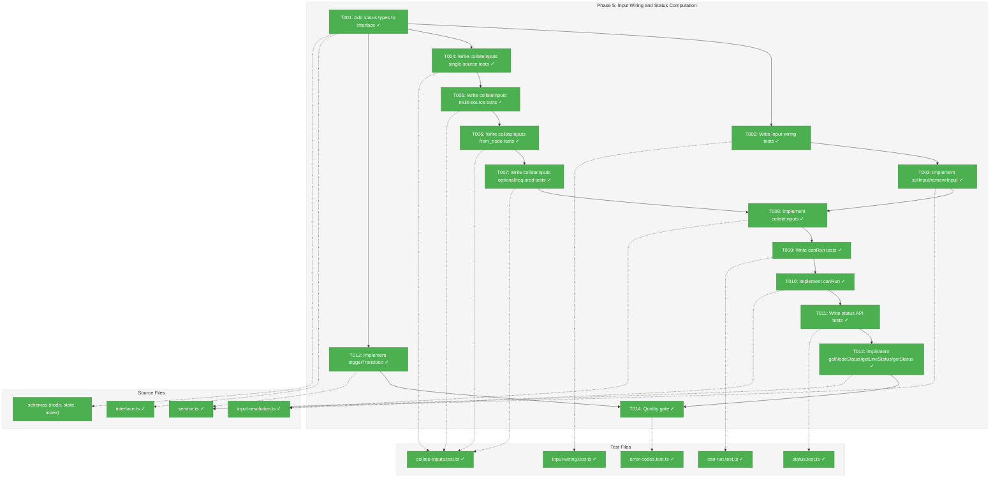
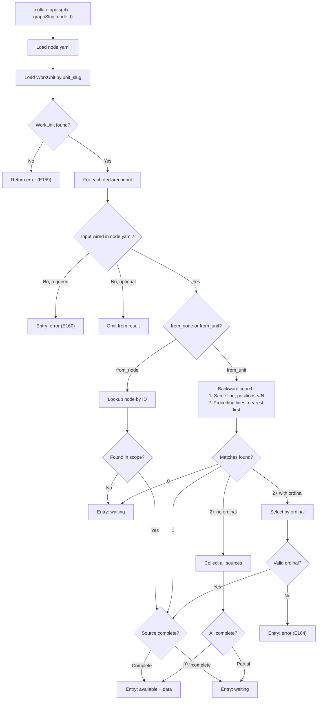
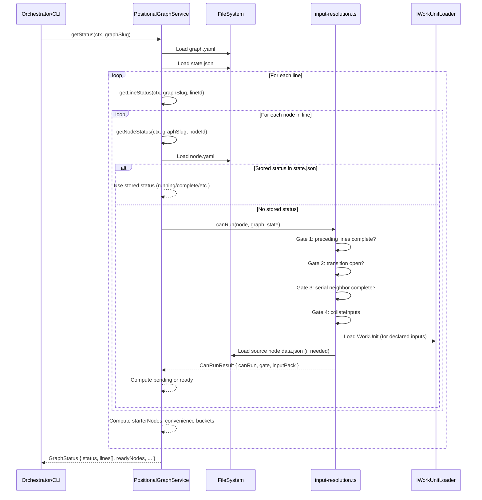

# Phase 5: Input Wiring and Status Computation — Tasks & Alignment Brief

**Spec**: [../../positional-graph-spec.md](../../positional-graph-spec.md)
**Plan**: [../../positional-graph-plan.md](../../positional-graph-plan.md)
**Date**: 2026-02-02
**Testing Approach**: Full TDD (no mocks)

---

## Executive Briefing

### Purpose
This phase implements the core algorithmic heart of the positional graph: input wiring operations, the `collateInputs` resolution algorithm, the `canRun` 4-gate readiness computation, and the three-level status API (`getNodeStatus` / `getLineStatus` / `getStatus`). Without this phase, the positional graph is a structural container only — no data flow, no readiness determination, no execution orchestration surface.

### What We're Building
1. **Input wiring** (`setInput`, `removeInput`) — persist input source references in `node.yaml`
2. **`collateInputs`** — the single traversal that resolves every declared input to `available` / `waiting` / `error`, searching backwards through lines (right-to-left, then up)
3. **`canRun`** — the internal 4-gate readiness algorithm (preceding lines complete, transition gate open, serial left neighbor complete, inputs available)
4. **Status API** — `getNodeStatus`, `getLineStatus`, `getStatus` that compose the above into a self-describing status object at node, line, and graph scope

### User Value
An orchestrator (future CLI command or UI) can call `getStatus(ctx, graphSlug)` and receive a single object describing everything: which nodes are ready, which are blocked and why, what inputs are missing, what transitions need triggering. One call, one object, everything needed to drive execution.

### Example
```
Before Phase 5:
  service.show(ctx, 'my-pipeline')  → structural info only (lines, nodes, counts)

After Phase 5:
  service.getStatus(ctx, 'my-pipeline') → {
    status: 'in_progress',
    totalNodes: 5, completedNodes: 2,
    readyNodes: ['coder-b7e'],
    lines: [{ lineId: 'line-a4f', complete: true, ... }, ...]
  }
```

---

## Objectives & Scope

### Objective
Implement input wiring, `collateInputs`, `canRun`, and the status API as specified in the plan (§ Phase 5) and the execution rules workshop. Satisfy spec acceptance criteria AC-5 through AC-7, plus AC-6 (multi-source inputs, ordinal disambiguation) and the forward-reference-as-waiting rule.

### Behavior Checklist (from Plan)
- [x] `setInput` wires node input to named predecessor or explicit node ID
- [x] `removeInput` removes input wiring
- [x] `collateInputs` resolves each input to available/waiting/error
- [x] Multi-source inputs collect from all matching nodes (deterministic order: same-line L→R, preceding lines nearest-first L→R)
- [x] Two-path resolution only: `from_unit` collects all, `from_node` gets one (no ordinal syntax)
- [x] `getNodeStatus` returns readiness detail (4 gates), input resolution, pending questions, errors
- [x] `getLineStatus` returns per-node status, starter nodes, convenience buckets
- [x] `getStatus` returns graph-wide status (overall state, per-line detail, flat convenience lists)
- [x] Forward references resolve as `waiting` (not an error — no E165)
- [x] Tests pass: `pnpm test --filter @chainglass/positional-graph` — input resolution, collateInputs, canRun, and status tests green

### Goals

- ✅ Implement `setInput` / `removeInput` with node.yaml persistence
- ✅ Implement `collateInputs` with backward search (same-line left-to-right, preceding lines nearest-first)
- ✅ Implement two-path resolution: `from_unit` collects all matches (deterministic order), `from_node` gets one (no ordinal syntax)
- ✅ Implement `canRun` 4-gate algorithm (preceding, transition, serial, inputs)
- ✅ Implement `getNodeStatus` / `getLineStatus` / `getStatus` at three scopes
- ✅ Define `InputPack`, `NodeStatus`, `LineStatus`, `GraphStatus` TypeScript types
- ✅ Define `StarterReadiness` type for chain-starter node identification
- ✅ Handle stored status precedence (state.json overrides computed pending/ready)
- ✅ Handle empty lines as trivially complete
- ✅ Add `collateInputs` and status methods to `IPositionalGraphService` interface

### Non-Goals

- ❌ Execution lifecycle (`start`, `end`, `reset`) — out of scope, orchestrator concern
- ❌ `triggerTransition` command — deferred to Phase 6 CLI (service method signature defined here, but no CLI surface)
- ❌ Performance optimization of `collateInputs` (e.g., caching) — not needed at prototype scale
- ❌ SSE/real-time change notifications — out of scope per spec
- ❌ `graph_status` stored in state.json — compute from node statuses per workshop Q1 (leaning: computed)
- ❌ Consolidation of duplicate test helpers across test files — deferred tech debt
- ❌ UI rendering of status objects — CLI formatting is Phase 6

---

## Flight Plan

### Summary Table

| File | Action | Origin | Modified By | Recommendation |
|------|--------|--------|-------------|----------------|
| `/home/jak/substrate/026-positional-graph/packages/positional-graph/src/services/input-resolution.ts` | Create | New | — | keep-as-is |
| `/home/jak/substrate/026-positional-graph/packages/positional-graph/src/interfaces/positional-graph-service.interface.ts` | Modify | Phase 3 | Phase 4 | keep-as-is |
| `/home/jak/substrate/026-positional-graph/packages/positional-graph/src/services/positional-graph.service.ts` | Modify | Phase 3 | Phase 4 | keep-as-is |
| `/home/jak/substrate/026-positional-graph/packages/positional-graph/src/schemas/node.schema.ts` | Modify | Phase 2 | — | keep-as-is |
| `/home/jak/substrate/026-positional-graph/packages/positional-graph/src/schemas/state.schema.ts` | Modify | Phase 2 | — | keep-as-is |
| `/home/jak/substrate/026-positional-graph/packages/positional-graph/src/schemas/index.ts` | Modify | Phase 2 | — | keep-as-is |
| `/home/jak/substrate/026-positional-graph/packages/positional-graph/src/services/index.ts` | Modify | Phase 2 | — | keep-as-is |
| `/home/jak/substrate/026-positional-graph/packages/positional-graph/src/index.ts` | Modify | Phase 2 | Phase 3 | keep-as-is |
| `/home/jak/substrate/026-positional-graph/test/unit/positional-graph/input-wiring.test.ts` | Create | New | — | keep-as-is |
| `/home/jak/substrate/026-positional-graph/test/unit/positional-graph/collate-inputs.test.ts` | Create | New | — | keep-as-is |
| `/home/jak/substrate/026-positional-graph/test/unit/positional-graph/can-run.test.ts` | Create | New | — | keep-as-is |
| `/home/jak/substrate/026-positional-graph/test/unit/positional-graph/status.test.ts` | Create | New | — | keep-as-is |
| `/home/jak/substrate/026-positional-graph/test/unit/positional-graph/error-codes.test.ts` | Modify | Phase 2 | Phase 3, Phase 4 | keep-as-is |

### Compliance Check
No violations found. All new files follow plan-scoped placement under `packages/positional-graph/`. Error codes E160-E164 are pre-defined from Phase 2 and ready for use. ADR-0004 (DI) and ADR-0009 (module registration) patterns maintained.

---

## Requirements Traceability

### Coverage Matrix

| AC | Description | Flow Summary | Files in Flow | Tasks | Status |
|----|-------------|-------------|---------------|-------|--------|
| AC-5 | Input wiring (setInput, removeInput) | service.ts → loadNodeConfig → mutate inputs → persistNodeConfig | interface, service, node.schema, input-wiring.test | T001, T002, T003 | ✅ Complete |
| AC-6 | Input resolution (collateInputs, multi-source, ordinal) | input-resolution.ts ← service.ts ← WorkUnit loader | input-resolution.ts, service.ts, collate-inputs.test | T004, T005, T006, T007, T008 | ✅ Complete |
| AC-7 | Readiness computation (canRun 4-gate, getNodeStatus/getLineStatus/getStatus) | input-resolution.ts ← state.json + graph.yaml → service status methods | input-resolution.ts, service.ts, state.schema, status.test, can-run.test | T009, T010, T011, T012, T013 | ✅ Complete |
| Forward refs as waiting | Forward references resolve as waiting, not error | collateInputs backward search scope | input-resolution.ts, collate-inputs.test | T005 | ✅ Complete |
| Stored status precedence | state.json status overrides computed pending/ready | getNodeStatus checks state.json first | service.ts, status.test | T011 | ✅ Complete |

### Gaps Found
No gaps — all acceptance criteria have complete file coverage.

### Orphan Files
| File | Tasks | Assessment |
|------|-------|------------|
| `error-codes.test.ts` | T014 | Test infrastructure — validates E160-E164 error factories used by collateInputs |

---

## Architecture Map

### Component Diagram
<!-- Status: grey=pending, orange=in-progress, green=completed, red=blocked -->
<!-- Updated by plan-6 during implementation -->



### Task-to-Component Mapping

<!-- Status: ⬜ Pending | 🟧 In Progress | ✅ Complete | 🔴 Blocked -->

| Task | Component(s) | Files | Status | Comment |
|------|-------------|-------|--------|---------|
| T001 | Interface + Types | interface.ts, schemas | ✅ Complete | Define InputPack, NodeStatus, LineStatus, GraphStatus, StarterReadiness types |
| T002 | Input Wiring Tests | input-wiring.test.ts | ✅ Complete | RED tests for setInput/removeInput |
| T003 | Input Wiring Impl | service.ts | ✅ Complete | GREEN — implement setInput/removeInput |
| T004 | collateInputs Tests (Single) | collate-inputs.test.ts | ✅ Complete | RED tests for single-source resolution |
| T005 | collateInputs Tests (Multi) | collate-inputs.test.ts | ✅ Complete | RED tests for multi-source, forward refs |
| T006 | collateInputs Tests (from_node) | collate-inputs.test.ts | ✅ Complete | RED tests for explicit node ID resolution |
| T007 | collateInputs Tests (optional/required) | collate-inputs.test.ts | ✅ Complete | RED tests for optional vs required input handling |
| T008 | collateInputs Impl | input-resolution.ts | ✅ Complete | GREEN — implement collateInputs |
| T009 | canRun Tests | can-run.test.ts | ✅ Complete | RED tests for 4-gate algorithm |
| T010 | canRun Impl | input-resolution.ts | ✅ Complete | GREEN — implement canRun |
| T011 | Status API Tests | status.test.ts | ✅ Complete | RED tests for getNodeStatus/getLineStatus/getStatus |
| T012 | Status API Impl | service.ts | ✅ Complete | GREEN — implement status methods |
| T013 | triggerTransition | service.ts | ✅ Complete | Implement transition trigger + state.json persistence |
| T014 | Quality Gate | error-codes.test.ts + all | ✅ Complete | run just check — 0 errors |

---

## Tasks

| Status | ID | Task | CS | Type | Dependencies | Absolute Path(s) | Validation | Subtasks | Notes |
|--------|------|------|-----|------|------------|-----------------|-----------|----------|-------|
| [x] | T001 | Add `InputPack`, `NodeStatus`, `LineStatus`, `GraphStatus`, `StarterReadiness`, `CanRunResult` types to interface; add `collateInputs`, `getNodeStatus`, `getLineStatus`, `getStatus`, `triggerTransition` method signatures to `IPositionalGraphService`; extend `IWorkUnitLoader` to return typed `WorkUnit` with inputs/outputs | 2 | Setup | – | `/home/jak/substrate/026-positional-graph/packages/positional-graph/src/interfaces/positional-graph-service.interface.ts`, `/home/jak/substrate/026-positional-graph/packages/positional-graph/src/interfaces/index.ts`, `/home/jak/substrate/026-positional-graph/packages/positional-graph/src/schemas/index.ts`, `/home/jak/substrate/026-positional-graph/packages/positional-graph/src/services/index.ts`, `/home/jak/substrate/026-positional-graph/packages/positional-graph/src/index.ts` | Build passes, types importable from `@chainglass/positional-graph/interfaces` | – | Per workshop §12 — three levels, one pattern. `IWorkUnitLoader.load()` return must include `inputs: WorkUnitInput[]` and `outputs: WorkUnitOutput[]` for collateInputs to check declared inputs and validate output names. |
| [x] | T002 | Write tests for `setInput` and `removeInput` — wire from_unit, wire from_node, remove input, persist in node.yaml, E160 input not declared on WorkUnit, E153 node not found, E157 graph not found | 2 | Test | T001 | `/home/jak/substrate/026-positional-graph/test/unit/positional-graph/input-wiring.test.ts` | Tests fail with "Not implemented — Phase 5" | – | Plan task 5.1. Need `createFakeUnitLoader` that returns WorkUnit with declared inputs. |
| [x] | T003 | Implement `setInput` and `removeInput` to pass tests | 2 | Core | T002 | `/home/jak/substrate/026-positional-graph/packages/positional-graph/src/services/positional-graph.service.ts` | All input wiring tests pass, node.yaml updated | – | Plan task 5.2. Replace Phase 5 stubs at service.ts:741-758. |
| [x] | T004 | Write tests for `collateInputs` — single source resolution: available (source complete with data), waiting (source found but not complete), error (no matching node E161), error (output not declared E163), waiting (forward reference — not an error) | 3 | Test | T001 | `/home/jak/substrate/026-positional-graph/test/unit/positional-graph/collate-inputs.test.ts` | Tests fail with "Not implemented — Phase 5" | – | Plan task 5.3. Forward refs resolve as `waiting`, per workshop §4. Tests need state.json setup via FakeFileSystem. |
| [x] | T005 | Write tests for `collateInputs` — multi-source resolution: multiple nodes matching from_unit (collect all, deterministic order), partial availability (some sources complete, some waiting), deterministic ordering preserved across calls | 2 | Test | T004 | `/home/jak/substrate/026-positional-graph/test/unit/positional-graph/collate-inputs.test.ts` | Tests fail with "Not implemented — Phase 5" | – | Plan task 5.4. Per DYK-P5-I5: two-path resolution only — `from_unit` collects all matches (no ordinals), `from_node` gets one. Ordering is deterministic: same-line left-to-right first, then preceding lines nearest-first left-to-right. No E162, no E164. |
| [x] | T006 | Write tests for `collateInputs` — from_node explicit resolution: direct node ID lookup, node not in preceding lines resolves as waiting (not error), E153 node not found | 2 | Test | T005 | `/home/jak/substrate/026-positional-graph/test/unit/positional-graph/collate-inputs.test.ts` | Tests fail with "Not implemented — Phase 5" | – | Plan task 5.5. |
| [x] | T007 | Write tests for `collateInputs` — optional vs required inputs: optional error doesn't block ok, required error blocks ok, optional waiting doesn't block ok, unwired required input = E160, unwired optional input = omitted | 2 | Test | T006 | `/home/jak/substrate/026-positional-graph/test/unit/positional-graph/collate-inputs.test.ts` | Tests fail with "Not implemented — Phase 5" | – | Plan task 5.6. Per workshop §9: ok = all REQUIRED inputs available. |
| [x] | T008 | Implement `collateInputs` to pass all resolution tests — create `input-resolution.ts` module with the backward search algorithm (same-line left positions first, then preceding lines nearest-first), two-path resolution (`from_unit` collects all matches, `from_node` gets one), three-state InputPack construction, `loadNodeData` private helper for reading data.json | 3 | Core | T003, T007 | `/home/jak/substrate/026-positional-graph/packages/positional-graph/src/services/input-resolution.ts`, `/home/jak/substrate/026-positional-graph/packages/positional-graph/src/services/positional-graph.service.ts` | All collateInputs tests pass | – | Plan task 5.7. Per DYK-P5-I5: no ordinal parsing — `from_unit` always collects all matches in deterministic traversal order, `from_node` does direct ID lookup. E162 and E164 are dead code (not thrown). Per DYK-P5-I2: add `loadNodeData` helper (JSON.parse, no Zod schema — system-written data). Needs access to graph.yaml, node.yaml, state.json, data.json, WorkUnit. |
| [x] | T009 | Write tests for `canRun` (internal 4-gate algorithm): all preceding lines complete → ready, preceding line incomplete → pending, manual transition gate blocks, serial left neighbor incomplete blocks, parallel skips Gate 3, collateInputs ok required, empty line trivially complete, combinations of rules | 3 | Test | T008 | `/home/jak/substrate/026-positional-graph/test/unit/positional-graph/can-run.test.ts` | Tests fail with "Not implemented — Phase 5" | – | Plan task 5.8. Per workshop §5. canRun is internal, exposed via getNodeStatus.readyDetail. |
| [x] | T010 | Implement `canRun` to pass tests — 4 gates: preceding lines complete, transition gate open (check state.json transitions), serial left neighbor complete (Gate 3 skipped for parallel), collateInputs.ok | 3 | Core | T009 | `/home/jak/substrate/026-positional-graph/packages/positional-graph/src/services/input-resolution.ts` | All canRun tests pass | – | Plan task 5.9. Per workshop §5: check gates in order, short-circuit on failure. |
| [x] | T011 | Write tests for `getNodeStatus` / `getLineStatus` / `getStatus`: node status with readyDetail, stored status preserved (running/complete from state.json), line status with starterNodes and convenience buckets, graph status with overall state, mixed statuses across lines, StarterReadiness for chain-starters, empty graph status | 3 | Test | T010 | `/home/jak/substrate/026-positional-graph/test/unit/positional-graph/status.test.ts` | Tests fail with "Not implemented — Phase 5" | – | Plan task 5.10. Per workshop §12: three levels, one pattern. |
| [x] | T012 | Implement `getNodeStatus` / `getLineStatus` / `getStatus` to pass tests — compose canRun + collateInputs + stored state into status objects at each scope | 3 | Core | T011 | `/home/jak/substrate/026-positional-graph/packages/positional-graph/src/services/positional-graph.service.ts` | All status tests pass | – | Plan task 5.11. getStatus calls getLineStatus for each line, which calls getNodeStatus for each node. |
| [x] | T013 | Implement `triggerTransition` — load state.json, set `transitions[lineId].triggered = true`, persist state.json | 2 | Core | T001 | `/home/jak/substrate/026-positional-graph/packages/positional-graph/src/services/positional-graph.service.ts` | Transition trigger persisted in state.json, canRun Gate 2 reflects it | – | Per workshop §7. Needed for canRun Gate 2 tests to exercise both open and closed transition states. |
| [x] | T014 | Quality gate — add any missing E160-E164 error factory tests to error-codes.test.ts, run `just check`, verify 0 lint errors, typecheck pass, all tests pass, build successful | 1 | QA | T012, T013 | `/home/jak/substrate/026-positional-graph/test/unit/positional-graph/error-codes.test.ts` | `just check` passes with 0 errors | – | Verify E160-E164 factories exercised (they were created in Phase 2 but may not all be tested yet). |

---

## Alignment Brief

### Prior Phases Review

#### Phase 1: WorkUnit Type Extraction (Complete)

**Deliverables**: `WorkUnitInput`, `WorkUnitOutput`, `WorkUnit` types extracted to `@chainglass/workflow/interfaces/workunit.types.ts`. Backward-compat aliases `InputDeclaration`/`OutputDeclaration` provided. Workgraph imports from `@chainglass/workflow/interfaces` subpath.

**Relevance to Phase 5**: The `WorkUnit` type defines `inputs: WorkUnitInput[]` (with `name`, `type`, `required` fields) and `outputs: WorkUnitOutput[]` — `collateInputs` needs both. The `IWorkUnitLoader` (from Phase 4) must return these typed fields so collateInputs can determine which inputs are declared/required and validate output names.

**Key constraint**: Use canonical names `WorkUnitInput`/`WorkUnitOutput`, not aliases. Import from `@chainglass/workflow` (top-level).

#### Phase 2: Schema, Types, and Filesystem Adapter (Complete)

**Deliverables**: Zod schemas (`PositionalGraphDefinitionSchema`, `NodeConfigSchema`, `InputResolutionSchema`, `StateSchema`), ID generation (`generateLineId`, `generateNodeId`), error factories (E150-E164, E170-E171), filesystem adapter (`PositionalGraphAdapter`), atomic writes (`atomicWriteFile`), DI registration (`registerPositionalGraphServices`).

**Relevance to Phase 5**:
- `InputResolutionSchema` (from_unit/from_node union) — used by `setInput` validation
- `StateSchema` (`state.json` format) with `NodeStateEntrySchema` and `TransitionEntrySchema` — `canRun` reads stored node statuses and transition triggers from state.json
- Error factories E160-E164 already created: `inputNotDeclaredError` (E160), `predecessorNotFoundError` (E161), `ambiguousPredecessorError` (E162), `outputNotDeclaredError` (E163), `invalidOrdinalError` (E164) — ready for use
- `atomicWriteFile` — for persisting state.json updates
- `PositionalGraphAdapter.getGraphDir()` — for locating state.json and node data directories

**Key discovery**: Signpost adapter pattern (DYK-I1) — adapter provides paths, service does I/O. Phase 5 follows the same pattern for state.json reads/writes.

#### Phase 3: Graph and Line CRUD Operations (Complete)

**Deliverables**: `IPositionalGraphService` interface, `PositionalGraphService` implementation (graph CRUD + line operations), test infrastructure (`createTestService`, `createTestContext`, `FakeFileSystem`/`FakePathResolver`).

**Relevance to Phase 5**:
- Private helpers available: `loadGraphDefinition()` (discriminated union), `persistGraph()`, `findLine()`, `findNodeInGraph()` — Phase 5 composes on top of these
- Discriminated union pattern for load results — reuse for state.json loading
- `PGLoadResult` carries full `PositionalGraphDefinition` — `collateInputs` needs this to walk lines and find nodes by position
- `addLine` with positioning options — tests will create multi-line graphs for collateInputs scenarios

**Key discovery**: show vs load separation (DYK-P3-I2) — `show` is for display, `load` for code. Phase 5's `getStatus` is a third category: runtime computation.

#### Phase 4: Node Operations with Positional Invariants (Complete)

**Deliverables**: 6 node methods (`addNode`, `removeNode`, `moveNode`, `setNodeDescription`, `setNodeExecution`, `showNode`), `IWorkUnitLoader` narrow interface, E159 error code, 7 private helpers (`findNodeInGraph`, `getNodeDir`, `loadNodeConfig`, `persistNodeConfig`, `removeNodeDir`, `getAllNodeIds`).

**Relevance to Phase 5**:
- `loadNodeConfig` / `persistNodeConfig` — Phase 5's `setInput`/`removeInput` mutate `node.yaml`'s `inputs` field via these helpers
- `findNodeInGraph` returns `{ lineIndex, line, nodePositionInLine }` — collateInputs uses lineIndex to determine search scope (preceding lines)
- `IWorkUnitLoader` — needs extension to return typed `WorkUnit` with `inputs`/`outputs` arrays for collateInputs to check declared inputs and validate outputs. Currently returns `{ unit?: unknown; errors }` — must be widened
- `addNode` / `setNodeExecution` — tests will use these to construct test graphs with serial/parallel nodes
- `createFakeUnitLoader(knownSlugs)` test helper — Phase 5 needs a richer version that returns WorkUnit objects with input/output declarations

**Key discovery**: Narrow interface pattern (DYK-P4-I2) — `IWorkUnitLoader` is local to positional-graph, no workgraph import. Phase 5 extends this pattern by widening the return type.

### Cumulative Deliverables Available

| Phase | Key Deliverables for Phase 5 |
|-------|------------------------------|
| Phase 1 | `WorkUnitInput`, `WorkUnitOutput`, `WorkUnit` types |
| Phase 2 | Zod schemas, error factories E160-E164, `StateSchema`, `atomicWriteFile`, adapter |
| Phase 3 | Service class, private helpers, discriminated union pattern, test infrastructure |
| Phase 4 | Node operations, `IWorkUnitLoader`, `loadNodeConfig`/`persistNodeConfig`, `findNodeInGraph` |

### Critical Findings Affecting This Phase

| Finding | What It Constrains | Addressed By |
|---------|-------------------|-------------|
| **CD-07: Named Input Resolution** | `collateInputs` must search preceding lines for nodes matching `from_unit` slug, with ordinal disambiguation | T004-T008 |
| **CD-08: Three-State InputPack** | Single traversal produces InputPack consumed by both canRun and execution | T004-T008 |
| **CD-09: Execution is Per-Node** | Gate 3 (serial left neighbor) operates per-node, not per-line; parallel nodes skip Gate 3 | T009-T010 |
| **CD-16: Stored Status Precedence** | If state.json has a stored status for a node (running/complete/etc.), use it. Only compute pending/ready for unstored nodes | T011-T012 |
| **CD-02: Position IS Topology** | Line ordering defines data flow direction; no explicit edges | All tasks |
| **CD-03: Cycle Detection Eliminated** | Forward references resolve as `waiting`, no cycle error | T005 |
| **CD-04: No Start Node** | Line 0 nodes are naturally ready (no preceding lines) | T009 |

### ADR Decision Constraints

- **ADR-0004 (DI Architecture)**: `useFactory` registration for new services. Phase 5 doesn't add new DI tokens — `collateInputs` and `canRun` are internal to the service, not separately injected.
- **ADR-0009 (Module Registration)**: No new `register*` functions needed. The existing `registerPositionalGraphServices()` is sufficient since the service class gains the new methods directly.

### Invariants & Guardrails

- **InputPack.ok computation**: `ok = true` if and only if every REQUIRED input has status `available`. Optional inputs do not affect `ok`.
- **canRun short-circuit**: Gates evaluated in order (1, 2, 3, 4). First failure stops evaluation and reports which gate failed.
- **No cascading state writes**: `pending` and `ready` are never written to state.json. Only execution lifecycle states (running, waiting-question, blocked-error, complete) are persisted.
- **Empty line is trivially complete**: An empty line never blocks subsequent lines.

### Visual Alignment Aids

#### Flow Diagram: collateInputs Resolution



#### Sequence Diagram: getStatus Composition



### Test Plan (Full TDD, No Mocks)

Tests use the same infrastructure from Phase 3-4: `FakeFileSystem`, `FakePathResolver`, real `YamlParserAdapter`, real `PositionalGraphService`. State.json and data.json are written directly to FakeFileSystem to simulate execution state.

**The `createFakeUnitLoader` must be extended** to return WorkUnit objects with declared `inputs` and `outputs` arrays. This is the key fixture change from Phase 4.

| Test Group | File | Tests (est.) | Key Scenarios |
|------------|------|-------------|---------------|
| Input Wiring | `input-wiring.test.ts` | ~8 | setInput from_unit, setInput from_node, removeInput, persist in node.yaml, E160 (input not on WorkUnit), E153 (node not found), E157 (graph not found), validation of from_output field |
| collateInputs — Single Source | `collate-inputs.test.ts` | ~5 | Available (complete + data), waiting (found but incomplete), error (E161 no match), error (E163 output not declared), waiting (forward reference) |
| collateInputs — Multi Source | `collate-inputs.test.ts` | ~3 | Collect all matching (deterministic order), partial availability (some complete, some waiting), deterministic ordering across calls |
| collateInputs — from_node | `collate-inputs.test.ts` | ~3 | Direct ID lookup, node not in scope = waiting, E153 node not found in graph |
| collateInputs — optional/required | `collate-inputs.test.ts` | ~4 | Optional error → ok, required error → not ok, optional waiting → ok, unwired optional = omit |
| canRun — 4 Gates | `can-run.test.ts` | ~10 | Gate 1 (preceding incomplete), Gate 2 (manual transition blocks), Gate 3 (serial waits, parallel skips), Gate 4 (inputs unavailable), empty line trivially complete, line 0 always eligible (no preceding), combinations: mixed serial/parallel chains |
| Status API | `status.test.ts` | ~10 | NodeStatus with readyDetail, stored status (running), line status with starterNodes, line convenience buckets, graph status overall state, mixed states across lines, empty graph, triggerTransition reflected in status |

**Estimated total: ~45 new tests.**

### Step-by-Step Implementation Outline

1. **T001 (Setup)**: Add types to interface + extend `IWorkUnitLoader` return type
2. **T002-T003 (Input Wiring)**: Tests → Implementation for setInput/removeInput
3. **T004-T007 (collateInputs Tests)**: Write all collateInputs tests in one file, grouped by scenario
4. **T008 (collateInputs Impl)**: Create `input-resolution.ts` with the backward search algorithm
5. **T009-T010 (canRun)**: Tests → Implementation (in input-resolution.ts alongside collateInputs)
6. **T011-T012 (Status API)**: Tests → Implementation (methods on PositionalGraphService, composing collateInputs + canRun)
7. **T013 (triggerTransition)**: Small standalone method — load state.json, update transitions, persist
8. **T014 (Quality Gate)**: Verify E160-E164 test coverage, run `just check`

**Per Phase 3-4 learning**: Tasks T004-T007 can be written as a batch (all RED), then T008 implements in one GREEN pass. Same for T009 (RED) + T010 (GREEN), and T011 (RED) + T012 (GREEN). Single-pass implementation works well when methods share internal helpers.

### Commands to Run

```bash
# Build check (after each implementation task)
pnpm build --filter @chainglass/positional-graph

# Run tests (positional-graph only)
pnpm test --filter @chainglass/positional-graph

# Full quality gate (final validation)
just check

# Quick fix + format + test cycle
just fft
```

### Risks/Unknowns

| Risk | Severity | Mitigation |
|------|----------|------------|
| `IWorkUnitLoader` return type change may break existing tests | Medium | Update `stubWorkUnitLoader` in all 3 existing test files. The stub currently returns `{ errors: [] }` — needs to return `{ unit: { inputs: [], outputs: [], ... }, errors: [] }` |
| collateInputs performance on large graphs | Low | Not a concern at prototype scale. Can optimize later with caching. |
| state.json read/write contention (multiple status queries) | Low | Single-threaded execution in CLI context. No concurrent access. |
| ~~`from_unit` ordinal parsing~~ | ~~Medium~~ | Removed — no ordinal syntax. Two-path resolution only (DYK-P5-I5). |
| `data.json` format for available inputs | Medium | Workshop §8 describes the format. Tests must write realistic data.json via FakeFileSystem. |

### Ready Check

- [x] ADR constraints mapped to tasks — ADR-0004 and ADR-0009 noted; no new DI tokens needed
- [ ] All prior phase deliverables verified as available
- [ ] Workshop execution rules (§4, §5, §9, §12) reviewed
- [ ] Error factories E160-E164 confirmed existing in Phase 2 code
- [ ] `IWorkUnitLoader` widening strategy agreed

---

## Phase Footnote Stubs

_Populated during implementation by plan-6._

| Footnote | Phase | Task(s) | Summary |
|----------|-------|---------|---------|
| [^9] | Phase 5 | T001-T003 | Interface types + input wiring (9 tests) |
| [^10] | Phase 5 | T004-T008 | collateInputs algorithm (15 tests) |
| [^11] | Phase 5 | T009-T010 | canRun 4-gate algorithm (12 tests) |
| [^12] | Phase 5 | T011-T013 | Status API + triggerTransition (10 tests) |
| [^13] | Phase 5 | T014 | Quality gate — 2908 tests, 0 failures |

---

## Evidence Artifacts

Implementation will produce:
- `execution.log.md` — per-task narrative in this directory
- Test output from `pnpm test --filter @chainglass/positional-graph`
- `just check` output confirming full quality gate

---

## Discoveries & Learnings

_Populated during implementation by plan-6. Log anything of interest to your future self._

| Date | Task | Type | Discovery | Resolution | References |
|------|------|------|-----------|------------|------------|
| 2026-02-02 | T001 | gotcha | IWorkUnitLoader widening broke 3 test stubs (DYK-P5-I1) | Added `{ slug, inputs: [], outputs: [] }` to stubWorkUnitLoader in 3 test files | execution.log.md#task-t001 |
| 2026-02-02 | T004-T007 | decision | Batched T004-T007 RED tests into single pass (15 tests) | More efficient than 4 separate test-writing sessions; all share same test file | execution.log.md#task-t004-t007 |
| 2026-02-02 | T008 | insight | loadNodeData uses JSON.parse without Zod schema (DYK-P5-I2) | System-written data.json doesn't need schema validation | execution.log.md#task-t008 |
| 2026-02-02 | T009 | workaround | canRun tests write state.json directly via FakeFileSystem (DYK-P5-I4) | triggerTransition not yet implemented; direct state writes are consistent with test setup pattern | execution.log.md#task-t009 |
| 2026-02-02 | T014 | gotcha | biome import ordering requires alphabetical imports | `canRun` before `collateInputs`, `IPositionalGraphService` before `InputPack` | execution.log.md#task-t014 |

**Types**: `gotcha` | `research-needed` | `unexpected-behavior` | `workaround` | `decision` | `debt` | `insight`

**What to log**:
- Things that didn't work as expected
- External research that was required
- Implementation troubles and how they were resolved
- Gotchas and edge cases discovered
- Decisions made during implementation
- Technical debt introduced (and why)
- Insights that future phases should know about

_See also: `execution.log.md` for detailed narrative._

---

## Critical Insights Discussion

**Session**: 2026-02-02
**Context**: Phase 5 Tasks & Alignment Brief — Input Wiring and Status Computation
**Analyst**: AI Clarity Agent
**Reviewer**: Development Team
**Format**: Water Cooler Conversation (5 Critical Insights)

### Insight 1: IWorkUnitLoader Widening Breaks 3 Existing Test Stubs

**Did you know**: Widening `IWorkUnitLoader.load()` to return typed `WorkUnit` with `inputs`/`outputs` arrays will break every existing `stubWorkUnitLoader` in `graph-crud.test.ts`, `line-operations.test.ts`, and `node-operations.test.ts`.

**Implications**:
- Build breaks between T001 (type change) and whenever test stubs are updated
- Three test files have stubs returning `{ errors: [] }` — missing the typed `unit` field
- The risk table mentions this but no task owns the fix

**Options Considered**:
- Option A: Add test file updates to T001's scope
- Option B: Create a new T001a task for test stub migration
- Option C: Handle as a discovery during implementation

**AI Recommendation**: Option A — update stubs as part of T001 commit
- Reasoning: Keeps build green at every task boundary; trivial 3-line edits

**Discussion Summary**: User preferred Option C — handle it naturally during implementation rather than adding plan overhead for trivial edits.

**Decision**: Handle `stubWorkUnitLoader` updates as a discovery during T001 implementation. The implementer will see the build break and fix the 3 stubs inline.

**Action Items**: None

**Affects**: T001 execution

---

### Insight 2: collateInputs Needs data.json But No Task Defines the Read Pattern

**Did you know**: `collateInputs` must read `data.json` from completed source nodes to populate the `available` detail, but no task specifies the `loadNodeData` helper, data format, or test fixture pattern.

**Implications**:
- No `loadNodeData` private helper exists (unlike `loadNodeConfig` for node.yaml)
- Tests in T004-T007 need to write data.json to FakeFileSystem to simulate completed nodes
- The `data/data.json` path convention isn't codified in any helper
- No Zod schema for data.json (system-written, not user-edited)

**Options Considered**:
- Option A: Add `loadNodeData` helper as part of T008 (collateInputs impl)
- Option B: Create a schema + helper in a separate pre-task
- Option C: Defer data reading — return available status without data payload

**AI Recommendation**: Option A — natural placement within T008
- Reasoning: Follows `loadNodeConfig` pattern; no schema needed for system-written data

**Discussion Summary**: User agreed with Option A.

**Decision**: `loadNodeData` helper created naturally as part of T008. Tests write data.json fixtures directly to FakeFileSystem. No Zod schema — just `JSON.parse`.

**Action Items**: None

**Affects**: T008 implementation, T004-T007 test setup

---

### Insight 3: Workshop NodeStatus Has Fields Unimplementable in Phase 5

**Did you know**: Workshop §12 defines `NodeStatus` with `pendingQuestion` (questionId, text, questionType, options, askedAt) and `error` (code, message, occurredAt) fields that require execution lifecycle data Phase 5 cannot produce?

**Implications**:
- `pendingQuestion` details live outside state.json — no mechanism exists to populate them
- `error` details require execution failure context that `start`/`end` lifecycle provides
- Tests can simulate stored `blocked-error`/`waiting-question` via state.json but can't populate detail fields
- Defining a minimal type now means breaking type changes when Phase 6+ adds execution

**Options Considered**:
- Option A: Define full workshop type, unpopulable fields are optional/undefined
- Option B: Define minimal Phase 5 type, extend later
- Option C: Full type with JSDoc "populated by execution lifecycle (Phase 6+)" annotations

**AI Recommendation**: Option C — full type with documentation
- Reasoning: Forward-compatible, workshop-aligned, optional fields naturally undefined

**Discussion Summary**: User agreed with Option C.

**Decision**: Define the full workshop `NodeStatus` type. Add JSDoc annotations on `pendingQuestion` and `error` marking them as "populated by execution lifecycle (Phase 6+)". Tests verify stored status propagation without asserting on detail fields.

**Action Items**: None

**Affects**: T001 type definitions, T011 test assertions

---

### Insight 4: triggerTransition (T013) Positioned Late But Needed Conceptually by canRun Tests (T009)

**Did you know**: T009 (canRun tests) needs transition state in state.json to test Gate 2, but T013 (triggerTransition impl) is positioned late in the task graph with no dependency path through T009?

**Implications**:
- Gate 2 tests need `{ transitions: { "line-xxx": { triggered: true } } }` in state.json
- `service.triggerTransition()` doesn't exist at T009 time
- Tests must write state.json directly via FakeFileSystem to set up transition state

**Options Considered**:
- Option A: Move T013 earlier — before T009
- Option B: T009 tests write state.json directly (keep current ordering)
- Option C: Merge T013 into T010 (canRun impl)

**AI Recommendation**: Option B — direct FakeFileSystem writes
- Reasoning: Consistent with how all Phase 5 tests set up state.json data (node completion, transitions)

**Discussion Summary**: User agreed with Option B. Direct state.json writes are the established test setup pattern.

**Decision**: T009 canRun tests write state.json directly via FakeFileSystem. Task ordering unchanged.

**Action Items**: None

**Affects**: T009 test implementation

---

### Insight 5: Workshop §4 vs §9 Contradiction on Multi-Source from_unit Semantics

**Did you know**: Workshop §4 says multiple `from_unit` matches without ordinal are "ambiguous" (implying E162 error), while §9 says no ordinal means "collect from ALL matching nodes"?

**Implications**:
- E162 `ambiguousPredecessorError` factory exists but may never fire
- Implementation must choose: collect-all or error-on-ambiguity as the default
- The fan-in pattern (gather all research results) requires collect-all semantics
- Ordinals (`:1`, `:2`) exist for when you want to pick a specific match

**Options Considered**:
- Option A: §9 wins — no ordinal = collect all, E162 is dead code
- Option B: §4 wins — no ordinal + multiple matches = E162 error
- Option C: Hybrid — collect all but E162 for cross-line ambiguity
- Option D: Collect all, keep E162 reserved for future use

**AI Recommendation**: Option A — collect all, E162 unused
- Reasoning: §9 is the detailed later section; fan-in is the natural default

**Discussion Summary**: User workshopped the scenarios — when does this actually happen? Answer: only when same WorkUnit is instantiated multiple times on preceding lines (the explicit fan-in pattern). User's verdict: "We always want them all."

**Decision**: No ordinal means collect all. Further simplified during discussion: **ordinal syntax removed entirely**. Resolution is two paths only: `from_unit` collects all matches, `from_node` gets one specific node. E162 and E164 are both dead code. Results must be deterministic — traversal order (same-line L→R, preceding lines nearest-first L→R) is the stable sort key.

**Action Items**:
- [x] Updated T005 — removed ordinal tests, added deterministic ordering tests
- [x] Updated T008 — removed ordinal parsing, added `loadNodeData` helper note
- [x] Updated behavior checklist — two-path resolution, no ordinals
- [x] Updated goals — removed ordinal disambiguation
- [x] Updated test plan table — reduced multi-source tests from ~5 to ~3
- [x] Updated risks — struck ordinal parsing risk

**Affects**: T005 tests, T008 implementation, overall algorithm simplification

---

## Session Summary

**Insights Surfaced**: 5 critical insights identified and discussed
**Decisions Made**: 5 decisions reached through collaborative discussion
**Action Items Created**: 0 — all decisions are implementation guidance, no dossier structural changes needed
**Areas Requiring Updates**: None — dossier structure is correct; decisions are captured here for implementer reference

**Shared Understanding Achieved**: Yes

**Confidence Level**: High — Key algorithmic ambiguities resolved, test setup patterns clarified, type strategy decided

**Next Steps**:
Proceed with `/plan-6-implement-phase` to begin Phase 5 implementation. The implementer should read this insights section before starting.

**Notes**:
- All 5 decisions favor simplicity and natural handling over plan machinery
- The "collect all" multi-source decision (Insight 5) is the most architecturally significant — it simplifies collateInputs and eliminates the E162 branch
- The data.json read pattern (Insight 2) will need a small helper but follows established patterns

---

## Directory Layout

```
docs/plans/026-positional-graph/
  ├── positional-graph-plan.md
  ├── positional-graph-spec.md
  ├── workshops/
  │   ├── positional-graph-prototype.md
  │   └── workflow-execution-rules.md
  └── tasks/
      ├── phase-1-workunit-type-extraction/
      ├── phase-2-schema-types-and-filesystem-adapter/
      ├── phase-3-graph-and-line-crud-operations/
      ├── phase-4-node-operations-with-positional-invariants/
      └── phase-5-input-wiring-and-status-computation/
          ├── tasks.md              # This file
          └── execution.log.md      # Created by /plan-6
```
