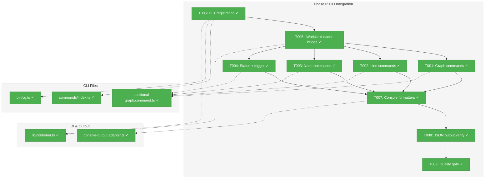
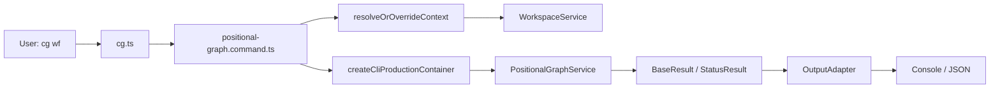
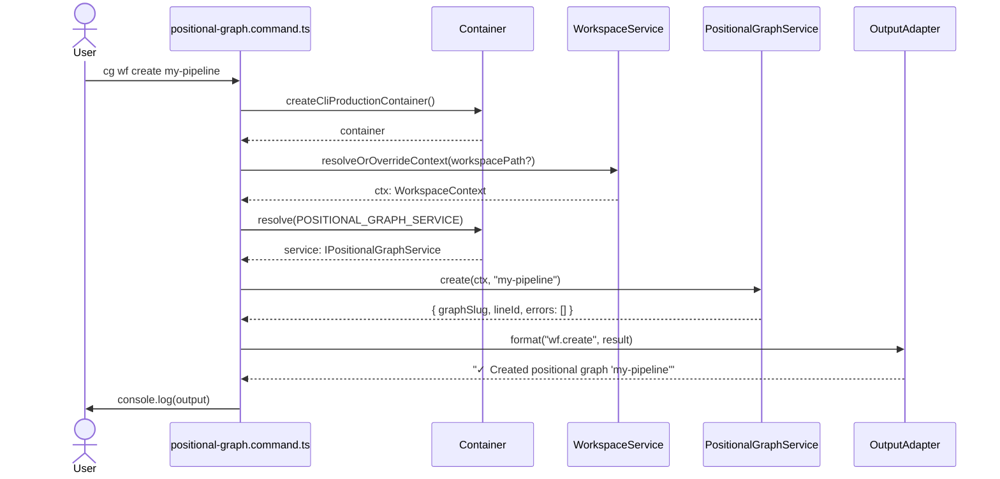

# Phase 6: CLI Integration — Tasks & Alignment Brief

**Spec**: [../../positional-graph-spec.md](../../positional-graph-spec.md)
**Plan**: [../../positional-graph-plan.md](../../positional-graph-plan.md)
**Date**: 2026-02-02

---

## Executive Briefing

### Purpose
This phase wires the fully-implemented `PositionalGraphService` (Phases 1–5 complete, 214 unit tests passing) to CLI commands under `cg wf`, giving users a command-line interface for creating, managing, and inspecting positional graphs. Without this phase, the service layer is functional but inaccessible from the terminal.

### What We're Building
A Commander.js command file (`positional-graph.command.ts`) registering all `cg wf` subcommands:
- **Graph commands**: `cg wf create`, `show`, `status`, `delete`, `list`
- **Line commands**: `cg wf line add`, `remove`, `move`, `set-transition`, `set-label`, `set-description`
- **Node commands**: `cg wf node add`, `remove`, `move`, `show`, `set-description`, `set-execution`, `set-input`, `remove-input`, `collate`
- **Status command**: `cg wf status <slug>` with `--node` and `--line` scope narrowing
- **Transition command**: `cg wf trigger <slug> <lineId>`

Plus DI wiring, command registration, and console output formatting.

### User Value
Users and agents can author positional graphs entirely from the CLI — creating graphs, placing nodes on lines, wiring inputs, inspecting readiness, and viewing status — using the same `cg` tool they already use for workgraphs.

### Example
```
$ cg wf create my-pipeline
✓ Created positional graph 'my-pipeline' (line: line-a4f)

$ cg wf line add my-pipeline --label "Processing"
✓ Added line 'line-b2c' to 'my-pipeline' at index 1

$ cg wf node add my-pipeline line-a4f fetch-data
✓ Added node 'fetch-data-e7a' to line 'line-a4f' at position 0

$ cg wf status my-pipeline --json
{"success":true,"command":"wf.status","timestamp":"...","data":{"graphSlug":"my-pipeline","status":"pending",...}}
```

---

## Objectives & Scope

### Objective
Wire all `IPositionalGraphService` methods to `cg wf` CLI commands, following the established Commander.js patterns from `workgraph.command.ts`. Satisfy plan acceptance criteria for Phase 6 and spec AC-1 through AC-11.

### Goals

- ✅ Graph lifecycle commands: create, show, status, delete, list
- ✅ Line operation commands: add, remove, move, set-transition, set-label, set-description
- ✅ Node operation commands: add, remove, move, show, set-description, set-execution, set-input, remove-input, collate
- ✅ Status command with `--node` and `--line` scope flags
- ✅ Transition trigger command
- ✅ `--json` flag on all commands producing structured JSON output
- ✅ `--workspace-path` override on all commands
- ✅ DI registration of positional-graph services in CLI container
- ✅ `IWorkUnitLoader` bridge wiring (workgraph `IWorkUnitService` → positional-graph `IWorkUnitLoader`)
- ✅ Console output formatters for human-readable display

### Non-Goals

- ❌ Custom per-command console formatters (use generic success/failure + JSON; refine in Phase 7)
- ❌ CLI integration tests (Phase 7 scope — integration and E2E)
- ❌ Documentation (Phase 7 scope — `docs/how/positional-graph/2-cli-usage.md`)
- ❌ Tab completion or shell autocomplete
- ❌ Interactive/TUI modes
- ❌ Changes to existing `cg wg` commands
- ❌ Changes to `IPositionalGraphService` interface or implementation

---

## Flight Plan

### Summary Table

| File | Action | Origin | Modified By | Recommendation |
|------|--------|--------|-------------|----------------|
| `apps/cli/src/commands/command-helpers.ts` | Create | Phase 6 (this phase) | — | Extract shared helpers from workgraph/unit commands; test workspace ctx resolution |
| `test/unit/cli/command-helpers.test.ts` | Create | Phase 6 (this phase) | — | Tests for resolveOrOverrideContext (CWD, override, null), createOutputAdapter, wrapAction |
| `apps/cli/src/commands/positional-graph.command.ts` | Create | Phase 6 (this phase) | — | Import helpers from command-helpers.ts; model structure after workgraph.command.ts |
| `apps/cli/src/commands/workgraph.command.ts` | Modify | Plan 016-017 | Phase 6 | Replace duplicated helpers with imports from command-helpers.ts |
| `apps/cli/src/commands/unit.command.ts` | Modify | Plan 016-017 | Phase 6 | Replace duplicated helpers with imports from command-helpers.ts |
| `apps/cli/src/commands/index.ts` | Modify | Plan 001 | Plan 016-017 (workgraph CLI) | Add 1 export line |
| `apps/cli/src/bin/cg.ts` | Modify | Plan 001 | Plan 015-019 (agent mgr) | Add import + 1 registration call |
| `apps/cli/src/lib/container.ts` | Modify | Plan 001 | Plan 015-019 (agent mgr) | Add positional-graph + IWorkUnitLoader registration |
| `packages/shared/src/adapters/console-output.adapter.ts` | Modify | Plan 002 | Plan 016-017 (workgraph CLI) | Add wf.* format cases + inline types |

### Per-File Detail

#### `apps/cli/src/commands/positional-graph.command.ts` (NEW)
- **Duplication check**: Similar pattern in `workgraph.command.ts` (same structure, different namespace). Not duplication — distinct service, distinct commands.
- **Compliance**: ADR-0004 (DI container), ADR-0006 (CLI orchestration), ADR-0009 (module registration). No violations.

#### `apps/cli/src/lib/container.ts` (MODIFY)
- **Provenance**: Created Plan 001, modified by multiple plans (014, 015-019).
- **Key concern**: Must register both `registerPositionalGraphServices(childContainer)` AND wire `POSITIONAL_GRAPH_DI_TOKENS.WORK_UNIT_LOADER` to the workgraph `IWorkUnitService` (structural compatibility — `WorkUnit` is a superset of `NarrowWorkUnit`).

#### `packages/shared/src/adapters/console-output.adapter.ts` (MODIFY)
- **Provenance**: Created Plan 002, heavily modified by workgraph CLI (Plan 016-017).
- **Pattern**: Uses inline type definitions (not cross-package imports) to avoid circular dependencies. Positional-graph result types will follow the same pattern.
- **Approach**: Add a small set of grouped formatters (graph, line, node, status) plus inline type definitions for result shapes.

### Compliance Check
No violations detected. All files conform to ADR-0004 (DI), ADR-0006 (CLI), ADR-0009 (module registration).

---

## Requirements Traceability

### Coverage Matrix

| AC | Description | Flow Summary | Files in Flow | Tasks | Status |
|----|-------------|-------------|---------------|-------|--------|
| AC-1 | Graph lifecycle (create, show, status, delete, list) | cg.ts → command.ts → resolveCtx → service.create/show/delete/list → adapter | command.ts, container.ts, cg.ts, index.ts, console-output.adapter.ts | T001, T005, T006, T007, T008 | ✅ Complete |
| AC-2 | Line operations (add, remove, move, set) | cg.ts → command.ts → resolveCtx → service.addLine/removeLine/moveLine/setLine* → adapter | command.ts | T002, T007, T008 | ✅ Complete |
| AC-3 | Node operations (add, remove, move, show, set, set-input, remove-input, collate) | cg.ts → command.ts → resolveCtx → service.addNode/removeNode/moveNode/showNode/set*/setInput/removeInput/collateInputs → adapter | command.ts | T003, T007, T008 | ✅ Complete |
| AC-5 | Input wiring (set-input, remove-input) | Part of AC-3 node commands | command.ts | T003 | ✅ Complete |
| AC-8 | Status display with --node/--line flags | cg.ts → command.ts → resolveCtx → service.getStatus/getNodeStatus/getLineStatus → adapter | command.ts | T004, T007, T008 | ✅ Complete |
| AC-9 | Workspace isolation (--workspace-path) | All handlers call resolveOrOverrideContext(options.workspacePath) | command.ts | T001-T004 | ✅ Complete |
| AC-10 | Error codes E150-E171 with messages | Service returns ResultError → adapter formats code + message + action | command.ts, console-output.adapter.ts | T007, T008 | ✅ Complete |
| AC-11 | No regressions to cg wg | Separate registration; wg commands untouched | cg.ts, index.ts | T005, T009 | ✅ Complete |

### Gaps Found
None — all acceptance criteria have complete file coverage.

### Orphan Files
None.

---

## Architecture Map

### Component Diagram
<!-- Status: grey=pending, orange=in-progress, green=completed, red=blocked -->
<!-- Updated by plan-6 during implementation -->



### Task-to-Component Mapping

<!-- Status: ⬜ Pending | 🟧 In Progress | ✅ Complete | 🔴 Blocked -->

| Task | Component(s) | Files | Status | Comment |
|------|-------------|-------|--------|---------|
| T001 | Graph CLI commands | positional-graph.command.ts | ✅ Complete | create, show, delete, list handlers |
| T002 | Line CLI commands | positional-graph.command.ts | ✅ Complete | Nested wf line subcommands |
| T003 | Node CLI commands | positional-graph.command.ts | ✅ Complete | Nested wf node subcommands |
| T004 | Status + trigger commands | positional-graph.command.ts | ✅ Complete | --node/--line scope flags |
| T005 | DI registration + command wiring | container.ts, index.ts, cg.ts | ✅ Complete | registerPositionalGraphServices + exports |
| T006 | IWorkUnitLoader bridge | container.ts | ✅ Complete | Wire IWorkUnitService → IWorkUnitLoader |
| T007 | Console output formatters | console-output.adapter.ts | ✅ Complete | Inline types + format methods |
| T008 | JSON output verification | positional-graph.command.ts | ✅ Complete | --json flag on all commands |
| T009 | Quality gate | (all files) | ✅ Complete | just check passes |
| T010 | Shared CLI helpers | command-helpers.ts, command-helpers.test.ts | ✅ Complete | Extracted + tested + refactored |

---

## Tasks

| Status | ID | Task | CS | Type | Dependencies | Absolute Path(s) | Validation | Subtasks | Notes |
|--------|------|------|-----|------|--------------|-------------------|------------|----------|-------|
| [x] | T001 | Implement graph commands (create, show, delete, list) with `getPositionalGraphService` helper; import shared helpers from command-helpers.ts | 3 | Core | T005, T006, T010 | `/home/jak/substrate/026-positional-graph/apps/cli/src/commands/positional-graph.command.ts` | `cg wf create test && cg wf show test && cg wf list && cg wf delete test` all succeed | – | Per workgraph.command.ts pattern; plan 6.1 |
| [x] | T002 | Implement line commands (add, remove, move, set-transition, set-label, set-description) as nested `wf line` subcommands | 3 | Core | T005, T006, T010 | `/home/jak/substrate/026-positional-graph/apps/cli/src/commands/positional-graph.command.ts` | `cg wf line add <graph> && cg wf line set-transition <graph> <lineId> manual` succeed | – | Parent option inheritance via cmd.parent?.opts(); plan 6.2 |
| [x] | T003 | Implement node commands (add, remove, move, show, set-description, set-execution, set-input, remove-input, collate) as nested `wf node` subcommands | 3 | Core | T005, T006, T010 | `/home/jak/substrate/026-positional-graph/apps/cli/src/commands/positional-graph.command.ts` | `cg wf node add <graph> <line> <unit> && cg wf node show <graph> <node>` succeed | – | set-input takes --from-unit or --from-node + --output; plan 6.3 |
| [x] | T004 | Implement status command with --node/--line scope flags and trigger command | 2 | Core | T005, T006, T010 | `/home/jak/substrate/026-positional-graph/apps/cli/src/commands/positional-graph.command.ts` | `cg wf status <graph>`, `cg wf status <graph> --node <id>`, `cg wf trigger <graph> <lineId>` all succeed | – | Status replaces separate canrun; plan 6.4 |
| [x] | T005 | Register positional-graph services in CLI DI container; add command export to index.ts; register in cg.ts | 2 | Setup | – | `/home/jak/substrate/026-positional-graph/apps/cli/src/lib/container.ts`, `/home/jak/substrate/026-positional-graph/apps/cli/src/commands/index.ts`, `/home/jak/substrate/026-positional-graph/apps/cli/src/bin/cg.ts` | `cg wf --help` shows subcommands; DI resolves IPositionalGraphService | – | Per ADR-0009; plan 6.5 |
| [x] | T006 | Wire IWorkUnitLoader bridge: register POSITIONAL_GRAPH_DI_TOKENS.WORK_UNIT_LOADER in CLI container, mapping workgraph IWorkUnitService to positional-graph IWorkUnitLoader | 2 | Setup | T005 | `/home/jak/substrate/026-positional-graph/apps/cli/src/lib/container.ts` | Service resolves without DI error; `cg wf node add` validates unit slugs | – | WorkUnit ⊇ NarrowWorkUnit structurally |
| [x] | T007 | Add console output formatters for wf.* commands: inline result type definitions + grouped format methods (graph, line, node, status) | 3 | Core | T001, T002, T003, T004 | `/home/jak/substrate/026-positional-graph/packages/shared/src/adapters/console-output.adapter.ts` | Human-readable output for all wf commands; error codes displayed with messages | – | Follow inline type pattern from wg.* formatters |
| [x] | T008 | Verify --json output on all commands produces valid JSON with CommandResponse envelope | 2 | Integration | T007 | `/home/jak/substrate/026-positional-graph/apps/cli/src/commands/positional-graph.command.ts` | `cg wf create test --json \| jq .success` returns true; all commands emit valid JSON | – | JsonOutputAdapter is generic — works automatically; plan 6.6 |
| [x] | T009 | Quality gate: `just check` passes (lint, typecheck, test, build) | 1 | Quality | T008 | (all changed files) | `just check` — 0 lint errors, typecheck pass, all tests pass, build successful | – | Verify no regressions to cg wg commands |
| [x] | T010 | Extract shared CLI command helpers (`createOutputAdapter`, `wrapAction`, `resolveOrOverrideContext`) to `command-helpers.ts`; write tests for workspace context resolution (CWD discovery, --workspace-path override, null-context error); refactor workgraph.command.ts and unit.command.ts to import from shared helpers | 3 | Setup | – | `/home/jak/substrate/026-positional-graph/apps/cli/src/commands/command-helpers.ts`, `/home/jak/substrate/026-positional-graph/test/unit/cli/command-helpers.test.ts`, `/home/jak/substrate/026-positional-graph/apps/cli/src/commands/workgraph.command.ts`, `/home/jak/substrate/026-positional-graph/apps/cli/src/commands/unit.command.ts` | Tests pass for shared helpers; workgraph + unit commands still work (no regressions); `resolveOrOverrideContext` tested with CWD, override path, and missing workspace cases | – | Per DYK-P6-I5; must complete before T001-T004 so positional-graph commands import from shared |

---

## Alignment Brief

### Prior Phases Review

#### Phase-by-Phase Summary

**Phase 1: WorkUnit Type Extraction** — Extracted `WorkUnitInput`, `WorkUnitOutput`, `WorkUnit` types from `@chainglass/workgraph` to `@chainglass/workflow`. Renamed from `InputDeclaration`/`OutputDeclaration` with backward-compat aliases. Key gotcha: top-level barrel excludes alias names due to `InputDeclaration` collision — workgraph imports from `@chainglass/workflow/interfaces` subpath. All 2694 existing tests passed unchanged.

**Phase 2: Schema, Types, and Filesystem Adapter** — Created `packages/positional-graph/` package with Zod schemas (10 schemas, 50 tests), ID generation (10 tests), error codes E150-E171 (18 tests), filesystem adapter as "path signpost" pattern (15 tests), DI tokens (`POSITIONAL_GRAPH_SERVICE`, `POSITIONAL_GRAPH_ADAPTER`, `WORK_UNIT_LOADER`), and container registration function. Key decision: adapter provides paths only (no YAML/JSON I/O). Total: 93 new tests.

**Phase 3: Graph and Line CRUD Operations** — Implemented `PositionalGraphService` with graph CRUD (create, load, show, delete, list) and line operations (addLine, removeLine, moveLine, setLineTransition, setLineLabel, setLineDescription). Established load-mutate-persist pattern with discriminated union returns (`{ ok: true; definition } | { ok: false; errors }`). Key decisions: no cascade on line removal (E151 enforced), mutual exclusivity of positioning options (E152), `state.json` inert in this phase. Total: 41 new tests (15 graph CRUD + 26 line ops).

**Phase 4: Node Operations with Positional Invariants** — Implemented 6 node methods (addNode, removeNode, moveNode, setNodeDescription, setNodeExecution, showNode). Introduced `IWorkUnitLoader` narrow interface for cross-package dependency avoidance, `WORK_UNIT_LOADER` DI token, E159 error code. Collapsed `MoveNodeOptions` from 3 to 2 fields. Key pattern: `findNodeInGraph()` returns rich `{ lineIndex, line, nodePositionInLine }`. Total: 29 new tests.

**Phase 5: Input Wiring and Status Computation** — Implemented the core novelty: `setInput`/`removeInput` (9 tests), `collateInputs` backward search algorithm (15 tests), `canRun` 4-gate readiness (12 tests), three-level status API `getNodeStatus`/`getLineStatus`/`getStatus` (10 tests), `triggerTransition`. Key decisions: two-path resolution only (no ordinals), `loadNodeData` uses JSON.parse without Zod, stored status takes precedence over computed. Total: 46 new tests. Full monorepo: 2908 tests, 0 failures.

#### Cumulative Deliverables Available to Phase 6

**Service methods** (all 24 on `IPositionalGraphService`):
- Graph CRUD: `create`, `load`, `show`, `delete`, `list`
- Line ops: `addLine`, `removeLine`, `moveLine`, `setLineTransition`, `setLineLabel`, `setLineDescription`
- Node ops: `addNode`, `removeNode`, `moveNode`, `setNodeDescription`, `setNodeExecution`, `showNode`
- Input wiring: `setInput`, `removeInput`
- Resolution: `collateInputs`
- Status: `getNodeStatus`, `getLineStatus`, `getStatus`
- Transition: `triggerTransition`

**DI infrastructure**:
- `registerPositionalGraphServices(container)` — registers adapter + service
- `POSITIONAL_GRAPH_DI_TOKENS` — `POSITIONAL_GRAPH_SERVICE`, `POSITIONAL_GRAPH_ADAPTER`, `WORK_UNIT_LOADER`
- Service constructor: `(fs, pathResolver, yamlParser, adapter, workUnitLoader)`

**Result types** (from `@chainglass/positional-graph/interfaces`):
- `GraphCreateResult` (graphSlug, lineId)
- `PGLoadResult` (definition?)
- `PGShowResult` (slug, version, description, createdAt, lines[], totalNodeCount)
- `PGListResult` (slugs[])
- `AddLineResult` (lineId?, index?)
- `AddNodeResult` (nodeId?, lineId?, position?)
- `NodeShowResult` (nodeId, unitSlug, execution, description, lineId, position, inputs)
- `InputPack` (inputs, ok)
- `NodeStatusResult` (nodeId, unitSlug, status, ready, readyDetail, inputPack, ...)
- `LineStatusResult` (lineId, complete, canRun, nodes[], readyNodes[], ...)
- `GraphStatusResult` (graphSlug, status, totalNodes, completedNodes, lines[], readyNodes[], ...)
- `BaseResult` (errors[]) — for all mutation operations

**Error codes**: E150-E159 (structure), E160-E164 (input resolution), E170-E171 (status)

#### Reusable Test Infrastructure
- `FakeFileSystem` + `FakePathResolver` from `@chainglass/shared`
- `createFakeUnitLoader(units: NarrowWorkUnit[])` helper pattern
- `writeNodeData()`, `writeState()` helpers for state simulation
- `expectNodeId(result)` type-safe narrowing helper

#### Architectural Continuity
- **Load-mutate-persist** pattern for all mutations
- **Discriminated union** returns for internal helpers (no non-null assertions)
- **No mocks** — all tests use real implementations or in-memory fakes
- **Adapter = path signpost** — service handles all I/O
- **DI resolution** via `useFactory` per ADR-0004/ADR-0009

### Critical Findings Affecting This Phase

| Finding | Impact on Phase 6 | Addressed By |
|---------|-------------------|-------------|
| CD-15: CLI Parent Options Inheritance | Nested `wf line`, `wf node` commands must extract `--json`/`--workspace-path` from parent via `cmd.parent?.opts()` | T001-T004 |
| CD-10: DI Container Registration | `registerPositionalGraphServices(childContainer)` called in CLI container | T005 |
| ADR-0006: CLI Orchestration | Follow Commander.js `wrapAction` + `resolveOrOverrideContext` patterns from workgraph.command.ts | T001-T004 |
| ADR-0009: Module Registration | Module registration function already exists; CLI container must call it | T005 |

### ADR Decision Constraints

- **ADR-0004** (DI Architecture): Use `createCliProductionContainer()` — never instantiate services directly. Constrains: T005, T006. Addressed by: T005 (container registration), T006 (bridge wiring).
- **ADR-0006** (CLI Orchestration): Commander.js pattern with `wrapAction`, `resolveOrOverrideContext`. Constrains: T001-T004. Addressed by: all command implementations follow workgraph.command.ts reference.
- **ADR-0009** (Module Registration): Call `registerPositionalGraphServices(container)` — don't inline factory registrations. Constrains: T005. Addressed by: single call to existing function.

### Invariants & Guardrails
- `--workspace-path` must override context resolution on every command
- Error codes must propagate from service to CLI output (no swallowing)
- `cg wg` commands must remain completely unaffected
- No service-layer changes — CLI is a thin wrapper

### Visual Alignment: Flow Diagram



### Visual Alignment: Sequence Diagram



### Test Plan

**Testing approach**: Phase 6 is a CLI wiring phase. The service layer is fully tested (214 unit tests). Phase 6 validation is primarily **smoke testing** — verifying that commands resolve DI, call services, and produce output. Full integration/E2E tests are Phase 7 scope.

**Validation strategy**:
1. **Build validation**: `pnpm build` compiles all packages including CLI
2. **Type checking**: `just typecheck` — zero errors
3. **Lint**: `just lint` — zero errors
4. **Existing tests**: `just test` — no regressions (2908+ tests pass)
5. **Manual smoke tests** (T008): Run each command against a real workspace, verify output

No new test files are created in Phase 6. The service layer's 214 tests provide confidence. Phase 7 will add integration tests exercising the full CLI → service → filesystem flow.

### Step-by-Step Implementation Outline

1. **T010**: Extract shared CLI command helpers — create `command-helpers.ts` with `createOutputAdapter`, `wrapAction`, `resolveOrOverrideContext`; write tests (`command-helpers.test.ts`) covering CWD discovery, `--workspace-path` override, and null-context error; refactor `workgraph.command.ts` and `unit.command.ts` to import from shared helpers
2. **T005**: Register DI services — add `registerPositionalGraphServices(childContainer)` to CLI container, add export to `commands/index.ts`, add registration call to `cg.ts`
3. **T006**: Wire `IWorkUnitLoader` bridge — register `POSITIONAL_GRAPH_DI_TOKENS.WORK_UNIT_LOADER` in container via `resolve<IWorkUnitLoader>(WORKGRAPH_DI_TOKENS.WORKUNIT_SERVICE)` (per DYK-P6-I3)
4. **T001**: Implement graph commands — create `positional-graph.command.ts` importing shared helpers + `getPositionalGraphService`; 5 graph command handlers
5. **T002**: Implement line commands — add nested `wf line` subcommands with parent option inheritance
6. **T003**: Implement node commands — add nested `wf node` subcommands (9 commands)
7. **T004**: Implement status + trigger commands — `wf status` with `--node`/`--line` flags, `wf trigger`
8. **T007**: Add console formatters — grouped format methods (per DYK-P6-I4) + inline result types in `console-output.adapter.ts`
9. **T008**: Verify `--json` output — manual smoke tests on all commands
10. **T009**: Quality gate — `just check` passes

### Commands to Run

```bash
# Build (verify compilation)
pnpm build

# Quality checks
just fft                    # Fix, Format, Test
just check                  # Full: lint, typecheck, test, build

# Manual smoke tests
cg wf create test-graph
cg wf show test-graph
cg wf list
cg wf list --json
cg wf line add test-graph
cg wf status test-graph
cg wf status test-graph --json
cg wf delete test-graph

# Regression check
cg wg --help               # Existing commands still work
```

### Risks & Unknowns

| Risk | Severity | Mitigation |
|------|----------|------------|
| `IWorkUnitService` → `IWorkUnitLoader` structural mismatch | Low | `WorkUnit` has `slug`, `inputs`, `outputs` — superset of `NarrowWorkUnit`. TypeScript structural typing handles this. |
| Triple-nested command option inheritance | Medium | Well-documented pattern from workgraph.command.ts. Use `cmd.parent?.opts()` consistently. |
| Console output adapter growing too large | Low | Add grouped formatters (not per-command). Phase 7 can refine. |
| DI resolution order dependency | Low | `registerWorkgraphServices()` called before `registerPositionalGraphServices()` — workgraph's `IWorkUnitService` available for bridge. |

### Ready Check

- [ ] ADR constraints mapped to tasks (ADR-0004 → T005/T006, ADR-0006 → T001-T004, ADR-0009 → T005)
- [ ] Service interface stable — all 24 methods implemented and tested
- [ ] DI tokens defined — `POSITIONAL_GRAPH_DI_TOKENS` in `@chainglass/shared`
- [ ] Reference implementation available — `workgraph.command.ts` patterns documented
- [ ] `IWorkUnitLoader` bridge approach validated — structural type compatibility confirmed

---

## Phase Footnote Stubs

_Populated by plan-6 during implementation. Footnote tags assigned when changes are committed._

| Plan Footnote | Phase Task(s) | Scope | Status |
|---------------|---------------|-------|--------|
| | T005, T006 | DI registration + IWorkUnitLoader bridge | |
| | T001-T004 | Command implementations | |
| | T007 | Console output formatters | |
| | T008, T009 | Verification + quality gate | |

---

## Evidence Artifacts

- **Execution log**: `phase-6-cli-integration/execution.log.md` (created by plan-6 during implementation)
- **Smoke test output**: Captured in execution log under each task entry

---

## Discoveries & Learnings

_Populated during implementation by plan-6. Log anything of interest to your future self._

| Date | Task | Type | Discovery | Resolution | References |
|------|------|------|-----------|------------|------------|
| 2026-02-02 | T005 | debt | YAML_PARSER token coincidence: `registerPositionalGraphServices()` hard-codes `SHARED_DI_TOKENS.YAML_PARSER` while CLI registers under `WORKFLOW_DI_TOKENS.YAML_PARSER`. Both resolve to `'IYamlParser'` today — works by string coincidence. Workgraph solved this properly by accepting the token as a parameter. | Accept for Phase 6 (no service-layer changes). Log as tech debt — future refactor should add `yamlParserToken` parameter to match workgraph pattern. | DYK-P6-I1; container.ts:37; CLI container.ts:198 |
| 2026-02-02 | T001 | insight | `cg wf` namespace confirmed: `cg wg` (workgraph) is being deprecated. `cg wf` becomes the primary graph command namespace for positional graphs. No collision concern — `wf` will be the forward path. | Keep `cg wf` as planned. No changes needed. | DYK-P6-I2 |
| 2026-02-02 | T006 | decision | IWorkUnitLoader bridge wiring: use `resolve<IWorkUnitLoader>(WORKGRAPH_DI_TOKENS.WORKUNIT_SERVICE)` — direct resolve with generic type parameter. Structural compatibility verified: `WorkUnit ⊇ NarrowWorkUnit`, `WorkUnitInput ⊇ NarrowWorkUnitInput`, `WorkUnitOutput ⊇ NarrowWorkUnitOutput`. No adapter wrapper needed. | Option A: direct resolve. Standard pattern — `resolve<T>()` is already a cast. | DYK-P6-I3 |
| 2026-02-02 | T007 | decision | Console formatters: use grouped approach (Option B). ~5-6 format methods: `formatWfMutationSuccess` (all BaseResult-only mutations), `formatWfCreateSuccess`, `formatWfShowSuccess`/`formatWfNodeShowSuccess`, `formatWfListSuccess`, `formatWfStatusSuccess` (all 3 status levels). Inline types only for create, show, list, and status result shapes. Mutation commands use generic "operation succeeded" pattern. | Grouped formatters, ~80-100 lines. Phase 7 can refine per-command output if needed. | DYK-P6-I4 |
| 2026-02-02 | T005 | decision | Extract shared CLI command helpers to `apps/cli/src/commands/command-helpers.ts`: `createOutputAdapter`, `wrapAction`, `resolveOrOverrideContext`. Write tests for the shared module (especially workspace context resolution — CWD discovery + `--workspace-path` override + null-context error). Refactor `workgraph.command.ts` and `unit.command.ts` to import from shared helpers. | Option B: extract + test. Workspace context resolution is critical-path untested code duplicated 3x. New task T010 added. | DYK-P6-I5 |
| | | | | | |

**Types**: `gotcha` | `research-needed` | `unexpected-behavior` | `workaround` | `decision` | `debt` | `insight`

**What to log**:
- Things that didn't work as expected
- External research that was required
- Implementation troubles and how they were resolved
- Gotchas and edge cases discovered
- Decisions made during implementation
- Technical debt introduced (and why)
- Insights that future phases should know about

_See also: `execution.log.md` for detailed narrative._

---

## Directory Layout

```
docs/plans/026-positional-graph/
  ├── positional-graph-plan.md
  ├── positional-graph-spec.md
  └── tasks/
      ├── phase-1-workunit-type-extraction/
      ├── phase-2-schema-types-and-filesystem-adapter/
      ├── phase-3-graph-and-line-crud-operations/
      ├── phase-4-node-operations-with-positional-invariants/
      ├── phase-5-input-wiring-and-status-computation/
      └── phase-6-cli-integration/
          ├── tasks.md              # This file
          └── execution.log.md      # Created by plan-6
```

---

## Critical Insights Discussion

**Session**: 2026-02-02
**Context**: Phase 6: CLI Integration dossier (tasks.md)
**Analyst**: AI Clarity Agent
**Reviewer**: jak
**Format**: Water Cooler Conversation (5 Critical Insights)

### Insight 1: YAML_PARSER Token String Coincidence

**Did you know**: `registerPositionalGraphServices()` hard-codes `SHARED_DI_TOKENS.YAML_PARSER` while the CLI container registers the parser under `WORKFLOW_DI_TOKENS.YAML_PARSER` — both happen to resolve to `'IYamlParser'` today, but the workgraph package recognized this fragility and accepts the token as a parameter.

**Options Considered**:
- Option A: Accept coincidence, document as tech debt
- Option B: Add yamlParserToken parameter (match workgraph pattern)
- Option C: Dual-register YAML parser under both tokens

**AI Recommendation**: Option A — no service-layer changes in Phase 6
**Decision**: Option A. Document as DYK-P6-I1, defer harmonization to future refactor.
**Affects**: T005 (DI registration awareness)

---

### Insight 2: `cg wf` Namespace Clarity

**Did you know**: `cg wf` (workflow) sits alongside `cg wg` (workgraph) with similar abbreviations, plus a `cg workflow` command group already exists.

**Options Considered**:
- Option A: Keep `cg wf` as planned
- Option B: Use `cg pg` (positional-graph)
- Option C: Nest under existing `cg workflow`

**AI Recommendation**: Option A
**Decision**: Option A. `cg wg` is being deprecated — `cg wf` becomes the primary graph command namespace going forward. No collision.
**Affects**: All command tasks (T001-T004)

---

### Insight 3: IWorkUnitLoader Bridge Wiring Approach

**Did you know**: The `IWorkUnitService` → `IWorkUnitLoader` bridge relies on TypeScript structural typing across `WorkUnit`/`NarrowWorkUnit` and their nested input/output types. The DI container `resolve<T>()` generic is already a type assertion, so the wiring approach matters.

**Options Considered**:
- Option A: Direct resolve with `resolve<IWorkUnitLoader>(WORKGRAPH_DI_TOKENS.WORKUNIT_SERVICE)`
- Option B: Thin adapter wrapper object
- Option C: Explicit `as unknown as` cast

**AI Recommendation**: Option A
**Decision**: Option A. Direct resolve — matches existing DI patterns. Structural compatibility verified across all nested types.
**Affects**: T006 (bridge implementation)

---

### Insight 4: Console Output Adapter Scope

**Did you know**: Full per-command formatters would add ~300 lines and 20+ dispatch cases to an already 1847-line file, when most positional-graph mutations return plain `BaseResult` with no extra fields.

**Options Considered**:
- Option A: Full formatters (one per command) — ~300 lines
- Option B: Grouped formatters (5-6 methods) — ~80-100 lines
- Option C: Minimal (generic success + status/show only) — ~40-50 lines
- Option D: JSON-only, defer console to Phase 7

**AI Recommendation**: Option B
**Decision**: Option B. Grouped formatters: one generic mutation formatter, plus custom for create/show/list/status. Phase 7 can refine.
**Affects**: T007 (formatter implementation scope)

---

### Insight 5: Shared CLI Command Helpers

**Did you know**: `createOutputAdapter`, `wrapAction`, and `resolveOrOverrideContext` are copy-pasted identically across `workgraph.command.ts` and `unit.command.ts`, and would be copied a third time. The workspace context resolution logic (CWD discovery + override + null handling) is critical-path code that's never been tested.

**Options Considered**:
- Option A: Duplicate helpers (match existing pattern)
- Option B: Extract to shared module + write tests + refactor existing commands

**AI Recommendation**: Option A (for minimal scope)
**Decision**: Option B (user override). Extract to `command-helpers.ts`, write tests for workspace context resolution, refactor existing commands. Added as T010.
**Action Items**:
- [x] Added T010 to task table
- [x] Updated Flight Plan with new files (command-helpers.ts, command-helpers.test.ts, workgraph.command.ts, unit.command.ts)
- [x] Updated T001-T004 dependencies to include T010
- [x] Updated implementation outline ordering
**Affects**: T010 (new task), T001-T004 (dependency), workgraph.command.ts, unit.command.ts

---

## Session Summary

**Insights Surfaced**: 5 critical insights identified and discussed
**Decisions Made**: 5 decisions reached
**Action Items Created**: 1 new task (T010), 5 DYK entries (P6-I1 through P6-I5)
**Files Updated**: tasks.md (task table, flight plan, implementation outline, discoveries table)

**Shared Understanding Achieved**: Yes

**Confidence Level**: High — key risks identified and mitigated, scope additions are well-bounded.

**Next Steps**: Review updated dossier, then run `/plan-6-implement-phase --phase 6` when ready.
