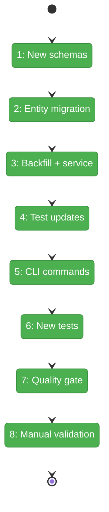
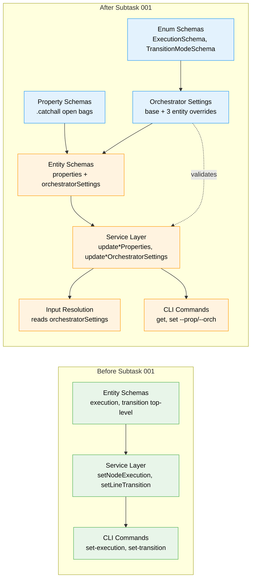

# Flight Plan: Subtask 001 — Property Bags and Orchestrator Settings

**Plan**: [positional-graph-plan.md](../../positional-graph-plan.md)
**Phase**: Phase 7: Integration Tests, E2E, and Documentation (subtask)
**Dossier**: [001-subtask-property-bags-and-orchestrator-settings.md](./001-subtask-property-bags-and-orchestrator-settings.md)
**Generated**: 2026-02-03
**Status**: Landed

---

## Departure -> Destination

**Where we are**: The positional graph system is fully implemented and merged (PR #20). Graphs, lines, and nodes support creation, CRUD, status computation, input resolution, and CLI commands. Execution mode (`serial`/`parallel`) lives as a top-level field on nodes; transition mode (`auto`/`manual`) lives as a top-level field on lines. There is no extensibility mechanism for user metadata or future orchestrator configuration.

**Where we're going**: By the end of this subtask, all three entity types (Graph, Line, Node) carry two new always-present fields: an open `properties` bag for arbitrary user/agent metadata and typed `orchestratorSettings` for execution control. The old top-level `execution` and `transition` fields are absorbed into `orchestratorSettings`. A developer can `cg wf node set my-graph my-node --prop role=coder --orch execution=parallel` and see both fields persisted in YAML and returned by `get`/`show` commands. Old YAML files load transparently via backfill migration.

---

## Flight Status

<!-- Updated by /plan-6: pending -> active -> done. Use blocked for problems/input needed. -->

**Legend**: grey = pending | yellow = active | red = blocked/needs input | green = done

---

## Stages

<!-- Updated by /plan-6 during implementation: [ ] -> [~] -> [x] -->

- [x] **Stage 1: Create new schema files** -- property bag schemas with `.catchall(z.unknown())` and orchestrator settings schemas with `.strict()` and `.extend()` from base (`schemas/properties.schema.ts`, `schemas/orchestrator-settings.schema.ts`, `schemas/enums.schema.ts` -- all new)
- [x] **Stage 2: Migrate entity schemas** -- remove top-level `execution`/`transition`/`config`, add `properties` and `orchestratorSettings` with `.default({})` (`schemas/graph.schema.ts`, `schemas/node.schema.ts`, `schemas/index.ts`)
- [x] **Stage 3: Backfill migration and service refactor** -- pre-parse transforms for old YAML, update all ~12 runtime consumer sites to accessor pattern, refactor write paths, add 6 new update methods (`services/positional-graph.service.ts`, `services/input-resolution.ts`, `interfaces/positional-graph-service.interface.ts`)
- [x] **Stage 4: Update existing tests** -- adapt all test files referencing old field paths and removed methods (`test/unit/positional-graph/*.test.ts`, `test/integration/positional-graph/*.test.ts`)
- [x] **Stage 5: CLI get/set commands** -- kubectl-style `get` (alias for `show`) and `set` with `--prop`/`--orch` repeatable flags, remove old `set-transition`/`set-execution` (`positional-graph.command.ts`)
- [x] **Stage 6: New unit tests** -- 19 tests covering schema validation, round-trips, deep-merge, backfill migration, and defaults (`properties-and-orchestrator.test.ts` -- new)
- [x] **Stage 7: Quality gate** -- `just check` passes: lint 0 errors, typecheck 0 errors, 2959 tests passed, build success
- [x] **Stage 8: Manual CLI validation** -- human-in-the-loop testing with real CLI against a real workspace, verifying data persistence and error handling

---

## Acceptance Criteria

- [x] Graph, Line, and Node schemas include `properties` (open bag) and `orchestratorSettings` (typed, strict)
- [x] `execution` absorbed into `NodeOrchestratorSettings`, `transition` absorbed into `LineOrchestratorSettings`
- [x] Old YAML files with top-level `execution`/`transition` load transparently via backfill migration
- [x] Service provides `update*Properties` and `update*OrchestratorSettings` for all three entity types
- [x] CLI supports `get` and `set` verbs with `--prop key=value` and `--orch key=value` flags
- [x] Unknown `--orch` keys rejected at runtime via Zod validation (error code E170)
- [x] All existing tests pass with updated assertions
- [x] 19 new tests verify round-trip, migration, defaults, and validation
- [x] Manual CLI validation confirms end-to-end behavior with real data

---

## Goals & Non-Goals

**Goals**:
- Property bag schemas (open, extensible) on all three entity types
- Orchestrator settings schemas (strict, typed) with base + entity-specific overrides
- Move `execution` and `transition` into `orchestratorSettings`
- Backfill migration for old YAML format
- kubectl-style `get`/`set` CLI commands with dynamic Zod validation
- Remove old bespoke `setNodeExecution`, `setLineTransition` methods and CLI commands
- Unit tests including migration from old YAML format

**Non-Goals**:
- No changes to state.json schema
- No migration of `description` or `label` fields (stay top-level)
- No orchestrator implementation (just the settings infrastructure)

---

## Architecture: Before & After

**Legend**: existing (green, unchanged) | changed (orange, modified) | new (blue, created)

---

## Checklist

- [x] ST001: Create property bag schemas (CS-1)
- [x] ST002: Create orchestrator settings schemas (CS-2)
- [x] ST003: Migrate graph.schema.ts: add new fields, remove transition (CS-2)
- [x] ST004: Migrate node.schema.ts: add new fields, remove execution (CS-2)
- [x] ST005: Update barrel exports in index.ts (CS-1)
- [x] ST006: Add backfill migration to service load methods (CS-2)
- [x] ST007: Update service: remove old setters, add new methods, update runtime consumers (CS-3)
- [x] ST008: Update existing tests for schema migration (CS-3)
- [x] ST009: Add kubectl-style get CLI commands (CS-2)
- [x] ST010: Add kubectl-style set CLI commands, remove old set-transition/set-execution (CS-3)
- [x] ST011: Write new unit tests for properties and orchestrator settings (CS-2)
- [x] ST012: Final quality gate (CS-1)
- [x] ST013: Manual CLI validation with real data (CS-2)

---

## PlanPak

Active -- files organized under `features/026-positional-graph/`.

---

## Key Design Decisions (DYK Session)

| ID | Decision | Impact |
|----|----------|--------|
| DYK-I1 | Accessor pattern for all runtime consumers | ~12 sites read `orchestratorSettings.execution` instead of top-level `execution` |
| DYK-I2 | Full write-path refactor, no backward-compat shims | `create()`, `addNode()`, `addLine()` and option types refactored |
| DYK-I3 | Flat result types, console-output.adapter.ts untouched | Service flattens from `orchestratorSettings` for display |
| DYK-I4 | `.default({})` not `.optional()` | Zod fills defaults at parse time; TypeScript type always-present; eliminated normalize-during-load, loaded types, optional chaining |
