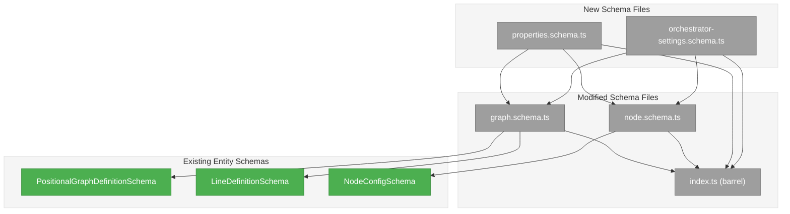
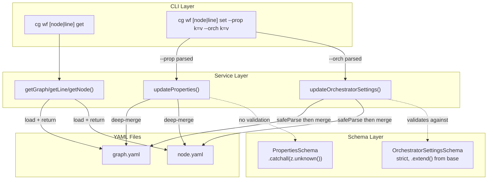
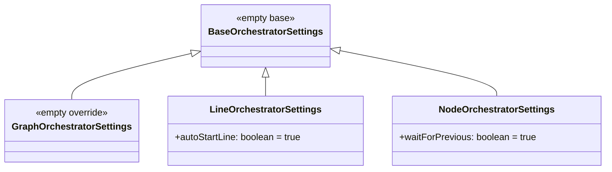
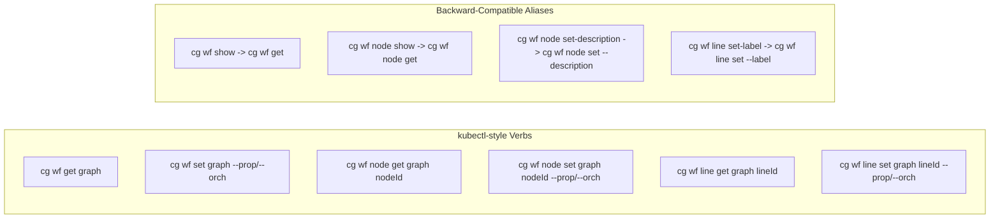

# Subtask 001: Property Bags and Orchestrator Settings

**Parent Plan:** [View Plan](../../positional-graph-plan.md)
**Parent Phase:** Phase 7: Integration Tests, E2E, and Documentation
**Parent Task(s):** Post-completion extension (all T001-T007 complete)
**Plan Task Reference:** [Phase 2: Schema, Types, and Filesystem Adapter](../../positional-graph-plan.md#phase-2-schema-types-and-filesystem-adapter) (schema lineage)

**Why This Subtask:**
Post-completion schema extension. The completed Plan 026 delivered a working positional graph system. This subtask adds two new fields to all three entity types (Graph, Line, Node): an open property bag for user/agent-editable metadata and typed orchestrator settings that orchestrators read to control execution behavior. The original PR (#20) was merged; this work will be a separate PR.

**Created:** 2026-02-03
**Requested By:** User (workshop session)

---

## Executive Briefing

### Purpose
Add extensibility infrastructure to the positional graph schema layer. Two new optional fields on Graph, Line, and Node enable future features without further schema changes: a property bag for arbitrary metadata and typed orchestrator settings for execution rules.

### What We're Building

**Layer 1 — Schemas**: Two new optional fields on all three entity types:

1. **`properties`** — open `Record<string, unknown>` bag (`.catchall(z.unknown())`). Users and agents store arbitrary key-value metadata here.

2. **`orchestratorSettings`** — typed Zod schemas with a shared base and entity-specific overrides:
   - `BaseOrchestratorSettings` — empty base (common fields added later)
   - `GraphOrchestratorSettings` — extends base, empty for now
   - `LineOrchestratorSettings` — extends base, adds `autoStartLine` (default `true`) and absorbs `transition` (default `'auto'`)
   - `NodeOrchestratorSettings` — extends base, adds `waitForPrevious` (default `true`) and absorbs `execution` (default `'serial'`)

**Migration**: `execution` moves from top-level NodeConfig into `orchestratorSettings.execution`. `transition` moves from top-level LineDefinition into `orchestratorSettings.transition`. On load, if old YAML has the top-level field but no `orchestratorSettings`, the service backfills it transparently. New writes always go to `orchestratorSettings`. The old top-level fields are removed from the Zod schemas. **DYK-I2**: All write paths (`create()`, `addNode()`, `addLine()`) and their option types (`AddNodeOptions`, `AddLineOptions`) are refactored to use `orchestratorSettings` — no backward-compat shims on option types.

**Layer 2 — Service methods**: Generic update methods on `IPositionalGraphService` for both `properties` and `orchestratorSettings` on all three entity types. Deep-merge partial updates into existing values.

**Layer 3 — kubectl-style CLI**: Unified `get` and `set` verbs on each entity noun. Everything mutable through one `set` command, everything readable through one `get` command.

```bash
# Get
cg wf get <graph>
cg wf node get <graph> <nodeId>
cg wf line get <graph> <lineId>

# Set — all mutable fields through one command
cg wf set <graph> --prop k=v --orch k=v --description "..."
cg wf node set <graph> <nodeId> --prop k=v --orch k=v
cg wf line set <graph> <lineId> --prop k=v --orch k=v --label "..."

# Examples — execution and transition are now orch settings
cg wf node set my-graph my-node --orch execution=parallel --orch waitForPrevious=false
cg wf line set my-graph my-line --orch transition=manual --orch autoStartLine=false
```

- `--prop key=value` — repeatable, writes to `properties` bag (open, no validation)
- `--orch key=value` — repeatable, writes to `orchestratorSettings` (Zod-validated at runtime — dynamic, no CLI changes when schema fields change)
- No dedicated `--execution` or `--transition` flags — they're just orch keys now

**Layer 4 — Tests**: Unit tests for service methods including migration from old YAML format.

### What This Does NOT Include
- No changes to state.json
- Existing `show` commands remain as aliases for `get`
- Existing `set-description`, `set-label` remain as aliases
- Old `set-transition`, `set-execution` removed (replaced by `set --orch`)

### Unblocks
- Orchestrator implementation (reads `orchestratorSettings` to control execution flow)
- Agent/user property editing (writes to `properties` bag)
- Future CLI extensions (new orchestrator settings fields auto-validate without CLI changes)

---

## Objectives & Scope

### Objective
Add `properties` and `orchestratorSettings` to all three entity types across schemas, service, and CLI with kubectl-style `get`/`set` verbs.

### Goals

- Create property bag schemas (open, `.catchall(z.unknown())`) for all three entity types
- Create orchestrator settings schemas (strict, typed) with base + entity-specific overrides
- Move `execution` from NodeConfig top-level into `NodeOrchestratorSettings`
- Move `transition` from LineDefinition top-level into `LineOrchestratorSettings`
- Add `waitForPrevious` to `NodeOrchestratorSettings` (default `true`)
- Add `autoStartLine` to `LineOrchestratorSettings` (default `true`)
- Backfill migration: old YAML with top-level execution/transition loads transparently into orchestratorSettings
- Wire both `properties` and `orchestratorSettings` into entity schemas as `.default({})` — always present after parse, never optional in the TypeScript type
- Add service methods: `updateProperties`, `updateOrchestratorSettings` for each entity type
- Add kubectl-style `get` and `set` CLI commands for each entity type
- Dynamic `--orch key=value` validated at runtime by Zod (no CLI changes when schema fields change)
- Remove old bespoke `setNodeExecution`, `setLineTransition` service methods and their CLI commands
- Unit tests including migration from old YAML format
- All existing tests updated to match new schema

### Non-Goals

- No changes to state.json schema
- No migration of existing `description` or `label` fields (those stay top-level for now)

---

## Flight Plan

### Summary Table

| File | Action | Origin | Modified By | Recommendation |
|------|--------|--------|-------------|----------------|
| `packages/positional-graph/src/schemas/properties.schema.ts` | Create | New | — | keep-as-is |
| `packages/positional-graph/src/schemas/orchestrator-settings.schema.ts` | Create | New | — | keep-as-is |
| `packages/positional-graph/src/schemas/graph.schema.ts` | Modify | Plan 026 Phase 2 | Phases 2-5 | keep-as-is |
| `packages/positional-graph/src/schemas/node.schema.ts` | Modify | Plan 026 Phase 2 | Phases 2-5 | keep-as-is |
| `packages/positional-graph/src/schemas/index.ts` | Modify | Plan 026 Phase 2 | Phases 2-7 | keep-as-is |
| `packages/positional-graph/src/interfaces/positional-graph-service.interface.ts` | Modify | Plan 026 Phase 2 | Phases 2-6 | keep-as-is |
| `packages/positional-graph/src/services/positional-graph.service.ts` | Modify | Plan 026 Phase 3 | Phases 3-6 | keep-as-is |
| `apps/cli/src/commands/positional-graph.command.ts` | Modify | Plan 026 Phase 6 | Phase 6-7 | keep-as-is |
| `test/unit/positional-graph/properties-and-orchestrator.test.ts` | Create | New | — | keep-as-is |

### Compliance Check

No ADR violations. No architecture violations. Schema files follow `*.schema.ts` convention. Service methods follow existing load-find-mutate-persist pattern. CLI follows existing Commander.js patterns with `wrapAction` and `createOutputAdapter`.

---

## Requirements Traceability

### Coverage Matrix

| AC | Description | Flow Summary | Files in Flow | Tasks | Status |
|----|-------------|-------------|---------------|-------|--------|
| Properties bag on all entities | Graph, Line, Node get `properties: Record<string, unknown>` | properties.schema.ts -> graph.schema.ts + node.schema.ts -> index.ts | 4 | ST001, ST003, ST004, ST005 | Covered |
| Orchestrator settings on all entities | Graph, Line, Node get typed `orchestratorSettings` | orchestrator-settings.schema.ts -> graph.schema.ts + node.schema.ts -> index.ts | 4 | ST002, ST003, ST004, ST005 | Covered |
| Service update methods | Update properties and orch settings on all entities | interface.ts -> service.ts | 2 | ST007, ST008 | Covered |
| kubectl-style get/set CLI | `get` and `set` verbs with `--prop`/`--orch` flags | positional-graph.command.ts | 1 | ST009, ST010 | Covered |
| Dynamic orch validation | `--orch key=value` validated by Zod at runtime | command.ts -> service -> schema.safeParse | 3 | ST008, ST010 | Covered |
| Backward compatibility | Existing YAML files and commands work | All files | All | ST012 | Covered |
| Tests | Service methods round-trip correctly | test file -> service -> schemas | 3 | ST011 | Covered |

### Gaps Found

None — all files are new or have clean provenance from earlier phases.

---

## Architecture Map

### Component Diagram



### Task-to-Component Mapping

| Task | Component(s) | Files | Status | Comment |
|------|-------------|-------|--------|---------|
| ST001 | Property bag schemas | properties.schema.ts | Pending | 3 open-bag Zod schemas |
| ST002 | Orchestrator settings schemas | orchestrator-settings.schema.ts | Pending | Base + 3 entity overrides (absorbs execution + transition) |
| ST003 | Graph + Line schema migration | graph.schema.ts | Pending | Remove transition from LineDefinition, add properties + orchestratorSettings |
| ST004 | Node schema migration | node.schema.ts | Pending | Remove execution + config, add properties + orchestratorSettings |
| ST005 | Barrel exports | index.ts | Pending | Re-export all new schemas + types |
| ST006 | Backfill migration | positional-graph.service.ts | Pending | Pre-parse transform for old YAML format |
| ST007 | Service interface + implementation | interface + service | Pending | Remove old setters, add new update/get methods |
| ST008 | Update existing tests | test/unit/positional-graph/*.test.ts | Pending | Adapt to new schema shape |
| ST009 | CLI get commands | positional-graph.command.ts | Pending | kubectl-style `get` |
| ST010 | CLI set commands | positional-graph.command.ts | Pending | kubectl-style `set` with --prop/--orch |
| ST011 | New unit tests | properties-and-orchestrator.test.ts | Pending | Round-trip + migration tests |
| ST012 | Final quality gate | — | Pending | `just check` passes, all tests green |

---

## Tasks

| Status | ID | Task | CS | Type | Dependencies | Absolute Path(s) | Validation | Subtasks | Notes |
|--------|------|------|-----|------|-------------|-------------------|------------|----------|-------|
| [ ] | ST001 | Create property bag schemas | 1 | Core | — | `/home/jak/substrate/026-positional-graph/packages/positional-graph/src/schemas/properties.schema.ts` | File exports `GraphPropertiesSchema`, `LinePropertiesSchema`, `NodePropertiesSchema` with `.catchall(z.unknown())` | — | S=0,I=0,D=1,N=0,F=0,T=0 |
| [ ] | ST002 | Create orchestrator settings schemas | 2 | Core | — | `/home/jak/substrate/026-positional-graph/packages/positional-graph/src/schemas/orchestrator-settings.schema.ts` | Exports `BaseOrchestratorSettingsSchema` (empty), `GraphOrchestratorSettingsSchema` (empty), `LineOrchestratorSettingsSchema` (`transition: TransitionModeSchema.default('auto')`, `autoStartLine: z.boolean().default(true)`), `NodeOrchestratorSettingsSchema` (`execution: ExecutionSchema.default('serial')`, `waitForPrevious: z.boolean().default(true)`). All use `.extend()` from base. | — | S=0,I=0,D=1,N=1,F=0,T=0 |
| [ ] | ST003 | Migrate graph.schema.ts: add new fields, remove `transition` from LineDefinition | 2 | Core | ST001, ST002 | `/home/jak/substrate/026-positional-graph/packages/positional-graph/src/schemas/graph.schema.ts` | `LineDefinitionSchema`: remove `transition`, add `properties` (`.default({})`) + `orchestratorSettings` (`.default({})`). `PositionalGraphDefinitionSchema`: add `properties` (`.default({})`) + `orchestratorSettings` (`.default({})`). | — | S=0,I=0,D=2,N=0,F=0,T=0. Removing `transition` from LineDefinition is the breaking schema change. |
| [ ] | ST004 | Migrate node.schema.ts: add new fields, remove `execution` from NodeConfig | 2 | Core | ST001, ST002 | `/home/jak/substrate/026-positional-graph/packages/positional-graph/src/schemas/node.schema.ts` | `NodeConfigSchema`: remove `execution`, remove `config` (dead code, subsumed by properties), add `properties` (`.default({})`) + `orchestratorSettings` (`.default({})`). | — | S=0,I=0,D=2,N=0,F=0,T=0. Removing `execution` from NodeConfig is the breaking schema change. |
| [ ] | ST005 | Update barrel exports in index.ts | 1 | Core | ST001, ST002 | `/home/jak/substrate/026-positional-graph/packages/positional-graph/src/schemas/index.ts` | All new schemas and types re-exported. `ExecutionSchema` and `TransitionModeSchema` stay exported (used by orchestrator settings). | — | S=0,I=0,D=0,N=0,F=0,T=0 |
| [ ] | ST006 | Add backfill migration to service load methods | 2 | Core | ST003, ST004 | `/home/jak/substrate/026-positional-graph/packages/positional-graph/src/services/positional-graph.service.ts` | `loadGraphDefinition`: if line has top-level `transition` but no `orchestratorSettings`, move it into `orchestratorSettings.transition` before Zod parse. `loadNodeConfig`: if node has top-level `execution` but no `orchestratorSettings`, move it into `orchestratorSettings.execution`. Old top-level fields stripped after migration. | — | S=1,I=0,D=1,N=0,F=0,T=0. Pre-parse transform on raw YAML object before Zod validation. Backfill moves top-level `execution`/`transition` into `orchestratorSettings` before parse. After parse, `.default({})` on schemas ensures `orchestratorSettings` is always present — no post-parse normalization needed (DYK-I4-revised). |
| [ ] | ST007 | Update service: remove old setters, add new interface methods, update all runtime consumers | 3 | Core | ST006 | `/home/jak/substrate/026-positional-graph/packages/positional-graph/src/interfaces/positional-graph-service.interface.ts`, `/home/jak/substrate/026-positional-graph/packages/positional-graph/src/services/positional-graph.service.ts`, `/home/jak/substrate/026-positional-graph/packages/positional-graph/src/services/input-resolution.ts` | Remove `setNodeExecution`, `setLineTransition` from interface and service. Add: `updateGraphProperties`, `updateLineProperties`, `updateNodeProperties`, `updateGraphOrchestratorSettings`, `updateLineOrchestratorSettings`, `updateNodeOrchestratorSettings`. Add `getLine` (new). Extend `show`/`showNode` result types to include `properties` + `orchestratorSettings`. **DYK-I1 (accessor pattern)**: Update all ~12 runtime comparison sites that read `nodeConfig.execution` or `line.transition` to read from `orchestratorSettings` instead (e.g. `nodeConfig.orchestratorSettings.execution`). No `?.` or `??` needed because DYK-I4 guarantees `orchestratorSettings` is always present after load. Sites: `input-resolution.ts` canRun Gate 3 (~L465), `positional-graph.service.ts` getNodeStatus (~L1006-1017, ~L1095), getLineStatus (~L1064-1089). **DYK-I3 (flat result types)**: `PGShowResult.lines[].transition`, `NodeShowResult.execution`, `NodeStatusResult.execution`, `LineStatusResult.transition` stay as flat fields — service flattens from `orchestratorSettings` when building results. `console-output.adapter.ts` in `packages/shared` requires ZERO changes. New `properties` and `orchestratorSettings` fields added to result types as optional fields for `get` commands. **DYK-I2 (write-path refactor)**: Refactor `create()`, `addNode()`, `addLine()` to write `orchestratorSettings` instead of top-level `transition`/`execution`. Remove `execution` from `AddNodeOptions`, remove `transition` from `AddLineOptions` — callers pass `orchestratorSettings` directly. No backward-compat shims. | — | S=3,I=0,D=1,N=0,F=0,T=0. DYK-I1: Accessor pattern. DYK-I2: Full write-path refactor. DYK-I3: Flat result types, console-output.adapter.ts untouched. Orch update validates via `Schema.partial().safeParse()`. |
| [ ] | ST008 | Update existing tests for schema migration | 3 | Test | ST006, ST007 | `/home/jak/substrate/026-positional-graph/test/unit/positional-graph/*.test.ts`, `/home/jak/substrate/026-positional-graph/test/integration/positional-graph/*.test.ts` | All existing tests that reference top-level `execution` on nodes or `transition` on lines updated to use `orchestratorSettings`. Tests that call `setNodeExecution` or `setLineTransition` updated to use `updateNodeOrchestratorSettings` / `updateLineOrchestratorSettings`. Tests that assert on `nodeConfig.execution` or `line.transition` directly must read from `orchestratorSettings` (DYK-I1 accessor pattern). All tests pass. | — | CS bumped 2->3. S=2,I=0,D=0,N=0,F=0,T=1. DYK-I1: Accessor pattern means test assertions also change. Expect changes in: schemas.test.ts, node-operations.test.ts, line-operations.test.ts, status.test.ts, can-run.test.ts, graph-crud.test.ts, collate-inputs.test.ts, integration tests. |
| [ ] | ST009 | Add kubectl-style `get` CLI commands | 2 | CLI | ST007 | `/home/jak/substrate/026-positional-graph/apps/cli/src/commands/positional-graph.command.ts` | `cg wf get <graph>`, `cg wf node get <graph> <nodeId>`, `cg wf line get <graph> <lineId>`. Return full entity including properties + orchestratorSettings. Existing `show` aliases to `get`. | — | S=1,I=0,D=0,N=0,F=0,T=0 |
| [ ] | ST010 | Add kubectl-style `set` CLI commands, remove old set-transition/set-execution | 3 | CLI | ST007 | `/home/jak/substrate/026-positional-graph/apps/cli/src/commands/positional-graph.command.ts` | `cg wf set <graph> [--prop k=v] [--orch k=v] [--description v]`, `cg wf node set <graph> <nodeId> [--prop k=v] [--orch k=v]`, `cg wf line set <graph> <lineId> [--prop k=v] [--orch k=v] [--label v]`. Remove `set-transition`, `set-execution` commands. `--orch` values parsed with JSON.parse, validated by service via Zod. | — | S=1,I=0,D=0,N=1,F=0,T=0 |
| [ ] | ST011 | Write new unit tests for properties and orchestrator settings | 2 | Test | ST007 | `/home/jak/substrate/026-positional-graph/test/unit/positional-graph/properties-and-orchestrator.test.ts` | Tests: set/get properties round-trip, set/get orch settings round-trip, deep-merge preserves existing keys, Zod rejects unknown orch keys, defaults applied, migration from old YAML format (top-level execution/transition backfilled into orchestratorSettings). | — | S=1,I=0,D=0,N=0,F=0,T=2 |
| [ ] | ST012 | Final quality gate | 1 | Quality | ST008, ST009, ST010, ST011 | — | `just check` passes: lint 0 errors, typecheck pass, all tests pass (existing + new), build succeeds | — | S=0,I=0,D=0,N=0,F=0,T=1 |
| [ ] | ST013 | Manual CLI validation with real data | 2 | Quality | ST012 | — | Using the real CLI against a real workspace: (1) create a graph, add lines and nodes; (2) `set --prop` and `set --orch` on graph, line, and node; (3) `get` on each entity and verify properties + orchestratorSettings appear in output; (4) inspect graph.yaml and node.yaml on disk to confirm data lands in the correct location; (5) verify old-format YAML (top-level execution/transition) loads and displays correctly after backfill; (6) verify Zod rejects unknown --orch keys with a clear error; (7) verify defaults applied when orchestratorSettings omitted from YAML. Human-in-the-loop validation — user reviews CLI output and file contents. | — | S=0,I=0,D=0,N=0,F=0,T=0. Manual validation, not automated. |

---

## Alignment Brief

### Prior Phases Review

All 7 phases are complete. This subtask extends:
- **Schema layer** (Phase 2): New Zod schemas + fields on existing entity schemas
- **Service layer** (Phases 3-5): New update/get methods following load-find-mutate-persist pattern
- **CLI layer** (Phase 6): kubectl-style `get`/`set` verbs replacing bespoke `show`/`set-*` commands
- **Tests** (Phase 7): New unit test file for round-trip verification

### Critical Findings Affecting This Subtask

- **Zod `.extend()` pattern**: Used elsewhere in the codebase for schema inheritance. `BaseOrchestratorSettingsSchema.extend({})` produces a proper Zod schema that inherits base fields.
- **`.catchall(z.unknown())`**: Allows arbitrary additional keys beyond defined fields. Used for property bags.
- **`.default({})` on schema fields (DYK-I4-revised)**: Both `properties` and `orchestratorSettings` use `.default({})` — NOT `.optional()`. Zod fills in defaults at parse time. The TypeScript inferred type has these fields as always-present (not optional). Consumers write `nodeConfig.orchestratorSettings.execution` with no `?.` or `??`. Inner fields like `execution`, `waitForPrevious`, `autoStartLine` use `.default()` so omitted fields get defaults when parsing `{}`.
- **`parseConfig` pattern** (workgraph.command.ts): Existing helper splits `key=value` strings, uses `JSON.parse` for type coercion (`"false"` -> `false`, `"30"` -> `30`). Reuse for `--prop` and `--orch` flags.
- **Dynamic Zod validation for CLI**: The `--orch key=value` CLI flags are parsed generically, then validated at the service layer via `EntityOrchestratorSettingsSchema.partial().safeParse()`. When new fields are added to orchestrator schemas, the CLI requires zero changes — Zod does the validation.
- **Existing show/showNode result types**: `PGShowResult` and `NodeShowResult` need `properties` and `orchestratorSettings` fields added. New `getGraph`/`getNode`/`getLine` service methods can delegate to existing `show`/`showNode` and extend results, or the existing methods can be extended directly.

### ADR Decision Constraints

No ADRs are affected by this change.

### Invariants

1. **Old YAML loads transparently** — backfill migration moves top-level `execution`/`transition` into `orchestratorSettings` on load
2. **New writes use new schema** — `orchestratorSettings` is the single source of truth for execution/transition
3. **Orchestrator settings are strict** — unknown keys rejected (no `.catchall()`)
4. **Property bags are open** — any key accepted (`.catchall(z.unknown())`)
5. **`show` aliases `get`** — existing show commands still work
6. **`set-description`, `set-label` remain** — simple aliases for `set --description`, `set --label`
7. **`set-transition`, `set-execution` removed** — replaced by `set --orch transition=x`, `set --orch execution=x`
8. **Dynamic orch validation** — CLI never hardcodes orchestrator field names

### Inputs to Read

| Input | Path | Why |
|-------|------|-----|
| Plan file (workshopped design) | `/home/jak/.claude/plans/quirky-snacking-rossum.md` | Exact schema shapes agreed in workshop |
| Existing graph schema | `packages/positional-graph/src/schemas/graph.schema.ts` | Schema modification target |
| Existing node schema | `packages/positional-graph/src/schemas/node.schema.ts` | Schema modification target |
| Existing barrel exports | `packages/positional-graph/src/schemas/index.ts` | Barrel modification target |
| Service interface | `packages/positional-graph/src/interfaces/positional-graph-service.interface.ts` | Add new method signatures + result types |
| Service implementation | `packages/positional-graph/src/services/positional-graph.service.ts` | Implement new methods |
| CLI commands | `apps/cli/src/commands/positional-graph.command.ts` | Add get/set commands |
| CLI helpers | `apps/cli/src/commands/command-helpers.ts` | Reuse wrapAction, resolveOrOverrideContext, createOutputAdapter |
| parseConfig pattern | `apps/cli/src/commands/workgraph.command.ts` | Reuse key=value parsing pattern |
| Existing test pattern | `test/unit/positional-graph/graph-crud.test.ts` | Follow DI setup pattern with FakeFileSystem |

### Visual Aids

#### Full Architecture Flow



#### Orchestrator Settings Inheritance



#### CLI Verb Design



### Test Plan

New test file: `test/unit/positional-graph/properties-and-orchestrator.test.ts`

Tests cover:
- Set and get properties on graph, line, and node (round-trip through YAML)
- Set and get orchestrator settings on all three entity types
- Deep-merge: partial update preserves existing keys in properties bag
- Deep-merge: partial update preserves existing orchestrator fields
- Zod validation: orchestrator settings rejects unknown keys with error
- Zod defaults: omitted orchestrator fields get defaults applied
- Backward compatibility: entities created without properties/orch fields still load and show correctly
- Existing 2940+ tests verify no regressions

### Implementation Outline

1. **ST001-ST005**: Schema layer (create new schemas, wire into entities, barrel exports)
2. **ST006**: Schema quality gate — `just check` after schema-only changes
3. **ST007**: Service interface — add method signatures and result types
4. **ST008**: Service implementation — implement update/get methods with Zod validation
5. **ST009**: CLI `get` commands — kubectl-style get, alias existing `show`
6. **ST010**: CLI `set` commands — kubectl-style set with `--prop`/`--orch`, alias existing `set-*`
7. **ST011**: Unit tests — round-trip verification of service methods
8. **ST012**: Final quality gate — `just check` with all changes

### Commands to Run

```bash
# After each major step
just check

# Run just the new tests
pnpm vitest run test/unit/positional-graph/properties-and-orchestrator.test.ts

# Quick CLI smoke test (after ST010)
cg wf node set my-graph my-node --prop name="Coder" --orch waitForPrevious=false
cg wf node get my-graph my-node
```

### Risks & Unknowns

| Risk | Likelihood | Mitigation |
|------|------------|------------|
| Zod `.extend()` doesn't work as expected with `.default()` | Low | Well-documented Zod pattern; test with `just check` |
| Existing tests fail from schema shape change | Very low | All new fields use `.default({})` — Zod fills in defaults for missing fields |
| `JSON.parse` type coercion edge cases (e.g., `"true"` vs `true`) | Low | Existing `parseConfig` pattern handles this; add test cases |
| Deep merge of nested objects in properties bag | Low | Use simple spread for flat merge; document that properties bag is shallow for now |
| Commander.js repeatable option accumulation | Low | Proven pattern in workgraph.command.ts |

### Ready Check

- [x] Plan workshopped and agreed (session 2026-02-03)
- [x] Schema shapes defined (properties: open bag, orchestratorSettings: typed with base/extend)
- [x] Entity-specific fields identified (autoStartLine on Line, waitForPrevious on Node)
- [x] Backward compatibility strategy confirmed (`.default({})` on all new fields — always present after parse)
- [x] CLI design agreed (kubectl-style get/set with --prop/--orch flags)
- [x] Dynamic orch validation strategy confirmed (Zod safeParse at service layer)
- [x] Files to modify identified (9 files: 3 new, 6 modified)
- [ ] Quality gate passes after implementation

---

## Phase Footnote Stubs

_To be populated by plan-6 during implementation._

| Footnote | Description | Files |
|----------|-------------|-------|
| | | |

---

## Evidence Artifacts

- **Execution Log**: `001-subtask-property-bags-and-orchestrator-settings.execution.log.md` (created by plan-6)
- **New schema file**: `packages/positional-graph/src/schemas/properties.schema.ts`
- **New schema file**: `packages/positional-graph/src/schemas/orchestrator-settings.schema.ts`
- **New test file**: `test/unit/positional-graph/properties-and-orchestrator.test.ts`

---

## Discoveries & Learnings

_Populated during implementation by plan-6. Log anything of interest to your future self._

| Date | Task | Type | Discovery | Resolution | References |
|------|------|------|-----------|------------|------------|
| | | | | | |

**Types**: `gotcha` | `research-needed` | `unexpected-behavior` | `workaround` | `decision` | `debt` | `insight`

_See also: `execution.log.md` for detailed narrative._

---

## After Subtask Completion

**This subtask is a post-completion extension for:**
- Plan 026: Positional Graph (COMPLETE)
- Schema lineage: Phase 2 (Schema, Types, and Filesystem Adapter)

**When all ST### tasks complete:**

1. **Record completion** in parent execution log:
   ```
   ### Subtask 001-subtask-property-bags-and-orchestrator-settings Complete

   Added properties (open bag) and orchestratorSettings (typed) to Graph,
   Line, and Node. Includes schemas, service methods, kubectl-style get/set
   CLI commands, and unit tests.
   See detailed log: [subtask execution log](./001-subtask-property-bags-and-orchestrator-settings.execution.log.md)
   ```

2. **Update Subtasks Registry** in plan.md:
   - Find row for `001-subtask-property-bags-and-orchestrator-settings`
   - Update Status: `[ ] Pending` -> `[x] Complete`

3. **Create a new PR** for this work (original PR #20 was merged and branch deleted).

**Quick Links:**
- [Parent Dossier](./tasks.md)
- [Parent Plan](../../positional-graph-plan.md)
- [Parent Execution Log](./execution.log.md)
- [Workshop Plan](/home/jak/.claude/plans/quirky-snacking-rossum.md)

---

## Directory Layout

```
docs/plans/026-positional-graph/tasks/phase-7-integration-tests-e2e-and-documentation/
  tasks.md                                                          # Phase 7 dossier (unchanged)
  execution.log.md                                                  # Phase 7 execution log (unchanged)
  001-subtask-property-bags-and-orchestrator-settings.md            # This file
  001-subtask-property-bags-and-orchestrator-settings.execution.log.md  # Created by plan-6
```

---

## Critical Insights Discussion

**Session**: 2026-02-03
**Context**: Subtask 001 — Property Bags and Orchestrator Settings dossier review
**Analyst**: AI Clarity Agent
**Reviewer**: jak
**Format**: Water Cooler Conversation (5 Critical Insights)

### Insight 1: Runtime consumers read execution/transition from parsed types, not orchestratorSettings

**Did you know**: After removing `execution` from NodeConfigSchema and `transition` from LineDefinitionSchema, ~12 runtime comparison sites in canRun, getNodeStatus, getLineStatus would silently break — comparing `undefined` instead of the enum value.

**Options Considered**:
- Option A: Accessor pattern — update all consumer sites to read from `orchestratorSettings`
- Option B: Computed getter — re-populate top-level field after parse
- Option C: Zod `.transform()` — populate during parse

**AI Recommendation**: Option A (accessor pattern)
- Reasoning: Clean, explicit, no hidden magic. All consumer sites are in code we control.

**Decision**: Option A — accessor pattern. All ~12 sites updated to read `nodeConfig.orchestratorSettings.execution`.

**Affects**: ST007 (expanded to include input-resolution.ts and all service comparison sites), ST008 (CS bumped 2->3)

---

### Insight 2: create(), addNode(), addLine() write old-shape objects — write paths need refactoring too

**Did you know**: The backfill migration (ST006) only handles the load path. The write paths in `create()`, `addNode()`, and `addLine()` hardcode `transition: 'auto'` and `execution: options?.execution ?? 'serial'` on the objects they construct — these break after the schema change.

**Options Considered**:
- Option A: Full refactor — update write paths and option types (`AddNodeOptions`, `AddLineOptions`)
- Option B: Keep old option types, service maps internally

**AI Recommendation**: Option B (keep old options, map internally)
- Reasoning: Less churn, backward-compatible API for callers.

**Decision**: Option A — full refactor. User said "refactor it all." `AddNodeOptions.execution` and `AddLineOptions.transition` removed. Callers pass `orchestratorSettings` directly. No shims.

**Affects**: ST007 (DYK-I2 write-path refactor added)

---

### Insight 3: console-output.adapter.ts lives in packages/shared — cross-package change risk

**Did you know**: The display formatting for execution/transition lives in `packages/shared/src/adapters/console-output.adapter.ts`, not in the positional-graph package. If result types change shape, the shared package needs changes too.

**Options Considered**:
- Option A: Keep result types flat — service flattens from orchestratorSettings, formatter unchanged
- Option B: Result types include orchestratorSettings — formatter reads from there

**AI Recommendation**: Option A (flat result types)
- Reasoning: Result types are a presentation contract. Service already transforms storage->display. Zero changes to shared package.

**Decision**: Option A — flat result types. `console-output.adapter.ts` requires zero changes. New `properties` and `orchestratorSettings` fields added as additional optional fields on result types for `get` commands.

**Affects**: ST007 (console-output.adapter.ts removed from file list)

---

### Insight 4: orchestratorSettings optional on schema means every consumer needs fallback defaults

**Did you know**: With `.optional()`, `orchestratorSettings` can be `undefined`. Every comparison site would need `?.execution ?? 'serial'` — 12+ sites, scattered defaults, easy to miss one.

**Options Considered**:
- Option A: Helper function for each field
- Option B: Normalize during load (ensure always present after parse)
- Option C: Inline `??` at every site

**AI Recommendation**: Option B (normalize during load)

**Decision**: User simplified further — use `.default({})` instead of `.optional()` on the Zod schema. Zod fills in defaults at parse time. TypeScript type has `orchestratorSettings` as always-present (not optional). Inner defaults (execution='serial', waitForPrevious=true) applied by Zod when parsing `{}`. Eliminates normalize-during-load, loaded types, and all optional chaining. Same pattern for `properties`.

**Affects**: ST003, ST004 (`.default({})` not `.optional()`), ST006 (no post-parse normalization needed), all consumer sites (no `?.` or `??`)

---

### Insight 5: canRun takes NodeConfig but type doesn't guarantee orchestratorSettings present

**Did you know**: After the schema change with `.optional()`, the `canRun()` function signature accepts `NodeConfig` where `orchestratorSettings` could be undefined. A future caller could pass un-normalized config and get silent wrong behavior.

**Options Considered**:
- Option A: Separate `LoadedNodeConfig` type
- Option B: Trust convention, document it
- Option C: Assert at function entry

**AI Recommendation**: Option A (loaded type)

**Decision**: Superseded by Insight 4 resolution. With `.default({})`, the base `NodeConfig` type already guarantees `orchestratorSettings` is present. No separate loaded type needed. Issue eliminated by the simpler design.

**Affects**: Nothing — resolved by DYK-I4-revised

---

## Session Summary

**Insights Surfaced**: 5 critical insights identified and discussed
**Decisions Made**: 5 decisions reached (A, A-refactor, A, default-simplification, superseded)
**Action Items Created**: 0 new tasks; existing tasks ST003-ST008 updated with DYK decisions

**Key Simplification**: The `.default({})` decision (Insight 4) collapsed three layers of complexity (normalize-during-load, loaded types, optional chaining) into one Zod primitive. Insights 4 and 5 were resolved simultaneously.

**Shared Understanding Achieved**: yes

**Confidence Level**: High — all runtime consumer sites identified, migration path clear, no cross-package changes needed.

**Next Steps**: Implement subtask via plan-6-implement-phase
