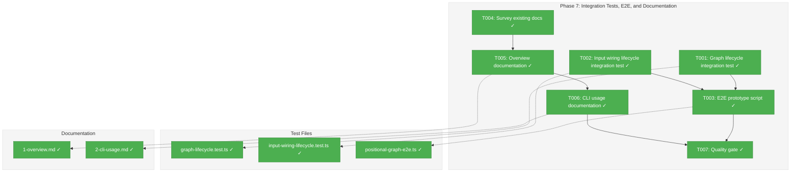
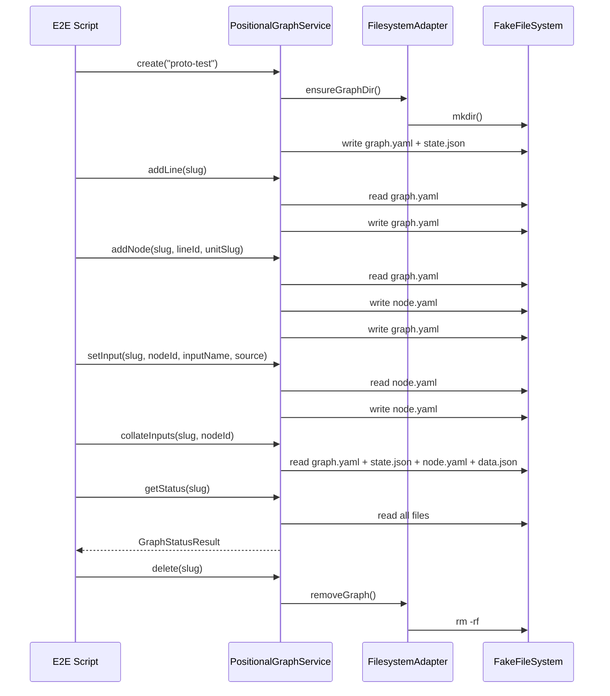

# Phase 7: Integration Tests, E2E, and Documentation — Tasks & Alignment Brief

**Spec**: [../../positional-graph-spec.md](../../positional-graph-spec.md)
**Plan**: [../../positional-graph-plan.md](../../positional-graph-plan.md)
**Date**: 2026-02-02

---

## Executive Briefing

### Purpose
This phase validates the complete positional graph system through integration tests, an E2E prototype script, and user-facing documentation. After 6 phases of incremental construction (types, schemas, CRUD, node ops, input wiring/status, CLI), this phase provides the cross-cutting confidence that the system works end-to-end and is documented for developer consumption.

### What We're Building
Three categories of deliverables:

1. **Integration tests** — Two vitest test files exercising full multi-operation lifecycles against real `PositionalGraphService` with `FakeFileSystem`. These differ from the existing 214 unit tests by testing *sequences* of operations that span multiple service methods and verify cumulative state.

2. **E2E prototype script** — A standalone TypeScript script (runnable via `tsx`) that exercises the complete operational flow from the workshop pseudo-code: graph creation, line/node manipulation, input wiring, status computation, and transition gating. Uses the service API directly (not CLI).

3. **Documentation** — Two markdown files in `docs/how/positional-graph/` covering concepts/data model (for developers extending the system) and CLI usage (for developers using the system).

### User Value
- Integration tests catch bugs that unit tests miss — interaction effects between operations, state accumulation across mutations, filesystem consistency after complex sequences
- E2E script serves as both validation and executable documentation of the complete positional graph workflow
- Documentation enables other developers to understand and use the system without reading source code

### Example
**Integration test scenario**: Create graph → add 3 lines with nodes → wire inputs from line 0 producer to line 2 consumer → verify `collateInputs` resolves as `waiting` (line 0 not complete) → simulate completion → verify resolution flips to `available` → verify `getStatus` shows correct graph-wide state

---

## Objectives & Scope

### Objective
Validate the complete positional graph system with integration tests, an E2E prototype script, and user-facing documentation, satisfying Plan Phase 7 acceptance criteria and Spec AC-12.

### Goals

- ✅ Integration test: full graph lifecycle (create → lines → nodes → move → wire → collate → canRun → status → delete)
- ✅ Integration test: input wiring lifecycle (producer/consumer → wire → resolve → multi-source → ordinal/collect-all)
- ✅ E2E prototype script exercising all operations from workshop §E2E Prototype
- ✅ Documentation: `1-overview.md` covering concepts, data model, DAG comparison
- ✅ Documentation: `2-cli-usage.md` covering all `cg wf` commands with examples
- ✅ Full quality gate: `just check` passes with zero failures

### Non-Goals

- ❌ CLI integration tests (testing Commander.js argument parsing + command dispatch) — that's a separate concern; we test the service layer
- ❌ Performance benchmarks or load testing
- ❌ UI documentation (no UI exists)
- ❌ Execution engine documentation (not implemented)
- ❌ Refactoring duplicate test helpers across unit test files (flagged debt from Phase 4)
- ❌ Cleaning up dead error codes E162/E164 (flagged debt from Phase 5)
- ❌ API reference documentation (source code + type definitions serve this purpose)
- ❌ Migration guide from WorkGraph (not in scope — spec Non-Goal 1)

---

## Flight Plan

### Summary Table

| File | Action | Origin | Modified By | Recommendation |
|------|--------|--------|-------------|----------------|
| `/home/jak/substrate/026-positional-graph/test/integration/positional-graph/graph-lifecycle.test.ts` | Create | New | — | keep-as-is |
| `/home/jak/substrate/026-positional-graph/test/integration/positional-graph/input-wiring-lifecycle.test.ts` | Create | New | — | keep-as-is |
| `/home/jak/substrate/026-positional-graph/test/e2e/positional-graph-e2e.ts` | Create | New | — | keep-as-is |
| `/home/jak/substrate/026-positional-graph/docs/how/positional-graph/1-overview.md` | Create | New | — | keep-as-is |
| `/home/jak/substrate/026-positional-graph/docs/how/positional-graph/2-cli-usage.md` | Create | New | — | keep-as-is |

### Compliance Check
No violations found. All new files follow established patterns:
- Integration tests follow `test/integration/<domain>/<name>.test.ts` pattern (see `test/integration/workgraph/cli-workflow.test.ts`)
- E2E script follows `test/e2e/<name>.ts` pattern (see `docs/how/dev/workgraph-run/e2e-sample-flow.ts` for reference)
- Documentation follows `docs/how/<feature>/<N>-<topic>.md` pattern (see `docs/how/configuration/`, `docs/how/dev/agent-control/`)

---

## Requirements Traceability

### Coverage Matrix

| AC | Description | Flow Summary | Files in Flow | Tasks | Status |
|----|-------------|-------------|---------------|-------|--------|
| P7-AC1 | Integration tests exercise full lifecycle with real filesystem | DI setup → service.create → addLine → addNode → moveNode → setInput → collateInputs → getStatus → delete | 1 (graph-lifecycle.test.ts) | T001 | ✅ Complete |
| P7-AC2 | E2E script validates complete operational flow | DI setup → full 21-step sequence from workshop §E2E → assert at each step → cleanup | 1 (positional-graph-e2e.ts) | T003 | ✅ Complete |
| P7-AC3 | Documentation covers concepts, CLI usage, data model | 1-overview.md + 2-cli-usage.md | 2 | T005, T006 | ✅ Complete |
| P7-AC4 | Full quality gate passes | `just check` → lint + typecheck + test + build | 0 (no files; process check) | T007 | ✅ Complete |
| P7-AC5 | E2E script executes with zero errors | `npx tsx test/e2e/positional-graph-e2e.ts` → success | 1 (positional-graph-e2e.ts) | T003 | ✅ Complete |
| P7-AC6 | No regressions to `cg wg` | Existing workgraph tests pass in `just check` | 0 (no files; regression check) | T007 | ✅ Complete |
| Spec AC-12 | Integration tests + E2E + unit tests | graph-lifecycle.test.ts + input-wiring-lifecycle.test.ts + positional-graph-e2e.ts (unit tests already exist from P1-P5) | 3 | T001, T002, T003 | ✅ Complete |
| Spec AC-1–8 | All cg wf commands documented | 2-cli-usage.md covers all commands with examples | 1 | T006 | ✅ Complete |
| Spec AC-9 | Workspace isolation tested | Integration tests use FakeFileSystem with workspace-scoped paths | 1 (graph-lifecycle.test.ts) | T001 | ✅ Complete |
| Spec AC-10 | Error codes documented | 2-cli-usage.md includes error reference E150-E171 | 1 (2-cli-usage.md) | T006 | ✅ Complete |

### Gaps Found
No gaps — all acceptance criteria have complete file coverage in the task table.

**Flow analysis notes**:
- Integration tests (T001, T002) import from `@chainglass/positional-graph`, `@chainglass/shared`, `@chainglass/workflow`, and `test/helpers/workspace-context.ts`. All these are existing files that require NO modification.
- E2E script (T003) uses direct DI container setup (not CLI). Imports `reflect-metadata`, `tsyringe`, and positional-graph packages. All existing files, no modification needed.
- DI wiring for integration tests follows established pattern from `test/integration/workgraph/cli-workflow.test.ts`: child container → FakeFileSystem + FakePathResolver + YamlParserAdapter → registerPositionalGraphServices → resolve service.
- `IWorkUnitLoader` must be wired in test DI setup — either via `registerWorkgraphServices` + bridge (heavy) or inline stub `createFakeUnitLoader` (light). Both approaches use existing infrastructure.
- `vitest.config.ts` already includes `test/**/*.test.ts` — no changes needed for new integration test paths.

### Orphan Files
| File | Tasks | Assessment |
|------|-------|------------|
| `docs/how/positional-graph/1-overview.md` | T005 | Documentation — enables developer understanding of concepts and data model; maps to Spec AC-12 "documentation" intent and P7-AC3 |

### Orphan Files
| File | Tasks | Assessment |
|------|-------|------------|
| `docs/how/positional-graph/1-overview.md` | T005 | Documentation — enables developer understanding |

---

## Architecture Map

### Component Diagram
<!-- Status: grey=pending, orange=in-progress, green=completed, red=blocked -->
<!-- Updated by plan-6 during implementation -->



### Task-to-Component Mapping

<!-- Status: ⬜ Pending | 🟧 In Progress | ✅ Complete | 🔴 Blocked -->

| Task | Component(s) | Files | Status | Comment |
|------|-------------|-------|--------|---------|
| T001 | Integration Test — Graph Lifecycle | graph-lifecycle.test.ts | ✅ Complete | Full CRUD + line/node ops + status in sequence |
| T002 | Integration Test — Input Wiring | input-wiring-lifecycle.test.ts | ✅ Complete | Wire → resolve → multi-source → status |
| T003 | E2E Prototype Script | positional-graph-e2e.ts | ✅ Complete | Complete operational flow from workshop pseudo-code |
| T004 | Documentation Survey | — | ✅ Complete | Verify no conflicts in docs/how/ |
| T005 | Overview Documentation | 1-overview.md | ✅ Complete | Concepts, data model, DAG comparison |
| T006 | CLI Usage Documentation | 2-cli-usage.md | ✅ Complete | All commands with examples, error reference |
| T007 | Quality Gate | — | ✅ Complete | `just check` passes, no regressions |

---

## Tasks

| Status | ID | Task | CS | Type | Dependencies | Absolute Path(s) | Validation | Subtasks | Notes |
|--------|------|------|-----|------|-------------|-------------------|------------|----------|-------|
| [x] | T001 | Write integration test: full graph lifecycle | 3 | Test | – | `/home/jak/substrate/026-positional-graph/test/integration/positional-graph/graph-lifecycle.test.ts` | Test exercises: create → add lines → add nodes → move nodes between lines → set properties → wire inputs → collate → getNodeStatus → getLineStatus → getStatus → triggerTransition → delete; all assertions pass | – | Follow `cli-workflow.test.ts` DI pattern; use `FakeFileSystem` + `FakePathResolver` + real `YamlParserAdapter` + real `PositionalGraphService`. Create `createTestUnit(slug, {inputs, outputs})` helper factory for IWorkUnitLoader stub — declared outputs MUST match `from_output` in wiring or collateInputs returns E163 (DYK-P7-I4) |
| [x] | T002 | Write integration test: input wiring lifecycle | 3 | Test | – | `/home/jak/substrate/026-positional-graph/test/integration/positional-graph/input-wiring-lifecycle.test.ts` | Test exercises: create graph → add producer/consumer nodes across lines → wire inputs (from_unit + from_node) → verify collateInputs resolution states → test multi-source collection → simulate node completion via state.json → verify resolution flips available → verify getStatus convenience buckets | – | Test forward references resolve as `waiting`; test optional vs required input semantics. Reuse `createTestUnit()` helper from T001 pattern — ensure declared outputs match `from_output` wiring (DYK-P7-I4) |
| [x] | T003 | Create E2E prototype script | 3 | Test | T001, T002 | `/home/jak/substrate/026-positional-graph/test/e2e/positional-graph-e2e.ts` | Script runs via `npx tsx test/e2e/positional-graph-e2e.ts` with zero errors and prints success message; exercises all operations from workshop §E2E Prototype | – | Uses service API directly (not CLI) with **real `NodeFileSystemAdapter`** + real temp directory (DYK-P7-I1); creates `os.tmpdir()` workspace, runs full lifecycle, asserts at each step, cleans up with `fs.rm(tmpDir, {recursive:true})` |
| [x] | T004 | Survey existing docs/how/ and verify no conflicts | 1 | Setup | – | `/home/jak/substrate/026-positional-graph/docs/how/` | No naming or structural conflicts with existing docs; `docs/how/positional-graph/` directory created | – | – |
| [x] | T005 | Create `1-overview.md` — concepts and data model | 2 | Doc | T004 | `/home/jak/substrate/026-positional-graph/docs/how/positional-graph/1-overview.md` | Covers: positional graph concepts (lines, nodes, positions), data model (graph.yaml, state.json, node.yaml), comparison with DAG model, key design decisions (position-as-topology, no cycle detection, no start node) | – | Target audience: developers extending the system |
| [x] | T006 | Create `2-cli-usage.md` — CLI command reference | 2 | Doc | T005 | `/home/jak/substrate/026-positional-graph/docs/how/positional-graph/2-cli-usage.md` | Covers: all `cg wf` commands grouped by category (graph, line, node, status), examples for each command, common workflows (create+populate, wire inputs, check status), error code reference (E150-E171) | – | Matches spec AC-1 through AC-10 |
| [x] | T007 | Run full quality gate | 1 | Quality | T003, T006 | – | `just check` passes: lint 0 errors, typecheck pass, all tests pass (including new integration + E2E), build succeeds; no regressions to `cg wg` commands | – | Final validation |

---

## Alignment Brief

### Prior Phases Review

#### Phase-by-Phase Summary

**Phase 1 — WorkUnit Type Extraction**: Extracted `WorkUnitInput`, `WorkUnitOutput`, `AgentConfig`, `CodeConfig`, `UserInputOption`, `UserInputConfig`, `WorkUnit` from `@chainglass/workgraph` to `@chainglass/workflow`. Introduced rename-with-alias pattern for `InputDeclaration`/`OutputDeclaration` name collision. Two-tier barrel export (top-level excludes collision-prone aliases; `@chainglass/workflow/interfaces` subpath exports all). 2694 existing tests passed unchanged.

**Phase 2 — Schema, Types, and Filesystem Adapter**: Created `packages/positional-graph/` package with Zod schemas (`PositionalGraphDefinitionSchema`, `LineDefinitionSchema`, `NodeConfigSchema`, `InputResolutionSchema`, `StateSchema`), ID generation (`generateLineId`, `generateNodeId` with hex3 pattern), error factories (E150-E171), filesystem adapter (signpost pattern — `getGraphDir` + directory lifecycle, NOT full I/O), `atomicWriteFile`, DI container registration. 93 new tests. Key insight: adapter is path-signpost + lifecycle, service does actual I/O.

**Phase 3 — Graph and Line CRUD**: Implemented `IPositionalGraphService` interface + `PositionalGraphService` with graph CRUD (create, load, show, delete, list) and line operations (add, remove, move, setTransition, setLabel, setDescription). Established load-mutate-persist pattern with discriminated union return types. No cascade on `removeLine` — enforces E151 for non-empty lines. 41 new tests.

**Phase 4 — Node Operations**: Added `addNode`, `removeNode`, `moveNode`, `setNodeDescription`, `setNodeExecution`, `showNode`. Introduced `IWorkUnitLoader` narrow interface for DI boundary (avoids workgraph dependency). Rich `findNodeInGraph` returns `{lineIndex, line, nodePositionInLine}`. Added E159 for unit-not-found. 29 new tests.

**Phase 5 — Input Wiring and Status Computation**: Implemented `setInput`/`removeInput`, `collateInputs` algorithm (backward search, two-path resolution: from_unit collects all, from_node gets one), `canRun` 4-gate algorithm (preceding lines, transition, serial neighbor, inputs), `getNodeStatus`/`getLineStatus`/`getStatus` three-level status composition, `triggerTransition`. Created `input-resolution.ts` as pure algorithm module. Ordinal syntax removed (collect-all is canonical). E162/E164 are dead code. 46 new tests.

**Phase 6 — CLI Integration**: Created `positional-graph.command.ts` with all 21 `cg wf` commands. Extracted shared helpers to `command-helpers.ts` (createOutputAdapter, wrapAction, resolveOrOverrideContext, noContextError). Added DI registration + IWorkUnitLoader bridge in CLI container. Added 12 console formatters. Refactored workgraph.command.ts and unit.command.ts to use shared helpers. 8 new tests. Post-review fixes applied (FIX-001 through FIX-006): enum validation, parseInt NaN checks, log anchors, from-unit/from-node requirement, collate error exit code.

#### Cumulative Deliverables

| Phase | Package/Location | Key Files |
|-------|-----------------|-----------|
| 1 | `packages/workflow/src/interfaces/workunit.types.ts` | WorkUnit types extracted |
| 2 | `packages/positional-graph/src/` | schemas/, services/id-generation.ts, errors/, adapter/, container.ts |
| 2 | `packages/shared/src/di-tokens.ts` | POSITIONAL_GRAPH_DI_TOKENS |
| 3 | `packages/positional-graph/src/interfaces/` | IPositionalGraphService, result types |
| 3 | `packages/positional-graph/src/services/positional-graph.service.ts` | Graph CRUD + line operations |
| 4 | Same service file | Node operations + IWorkUnitLoader |
| 5 | `packages/positional-graph/src/services/input-resolution.ts` | collateInputs, canRun |
| 5 | Same service file | setInput, removeInput, status API, triggerTransition |
| 6 | `apps/cli/src/commands/positional-graph.command.ts` | All 21 CLI commands |
| 6 | `apps/cli/src/commands/command-helpers.ts` | Shared CLI helpers |
| 6 | `packages/shared/src/adapters/console-output.adapter.ts` | 12 wf.* formatters |

#### Cumulative Test Infrastructure

| File | Tests | Phase |
|------|-------|-------|
| `test/unit/positional-graph/schemas.test.ts` | 50 | 2 |
| `test/unit/positional-graph/id-generation.test.ts` | 10 | 2 |
| `test/unit/positional-graph/error-codes.test.ts` | 18 | 2, 4 |
| `test/unit/positional-graph/adapter.test.ts` | 15 | 2 |
| `test/unit/positional-graph/graph-crud.test.ts` | 15 | 3 |
| `test/unit/positional-graph/line-operations.test.ts` | 26 | 3 |
| `test/unit/positional-graph/node-operations.test.ts` | 29 | 4 |
| `test/unit/positional-graph/input-wiring.test.ts` | 9 | 5 |
| `test/unit/positional-graph/collate-inputs.test.ts` | 15 | 5 |
| `test/unit/positional-graph/can-run.test.ts` | 12 | 5 |
| `test/unit/positional-graph/status.test.ts` | 10 | 5 |
| `test/unit/cli/command-helpers.test.ts` | 8 | 6 |
| **Total** | **217** | |

**Test helpers available**:
- `createTestWorkspaceContext(worktreePath)` — in `test/helpers/workspace-context.ts`
- `createFakeUnitLoader(units: NarrowWorkUnit[])` — in Phase 5 test files (typed version)
- `FakeFileSystem` / `FakePathResolver` — from `@chainglass/shared`
- `YamlParserAdapter` — from `@chainglass/workflow`

#### Reusable Infrastructure

- **DI container wiring pattern** from `test/integration/workgraph/cli-workflow.test.ts`: create child container → register FakeFileSystem + FakePathResolver + YamlParserAdapter → register domain services → resolve → test
- **`createTestWorkspaceContext`** from `test/helpers/workspace-context.ts`

#### Known Technical Debt

1. E162 (`ambiguousPredecessorError`) and E164 (`invalidOrdinalError`) are dead code — never thrown
2. Duplicate test helpers across unit test files (`createFakeUnitLoader`, `createTestContext`, `createTestService`)
3. YAML_PARSER token string coincidence between CLI and positional-graph container registration
4. `pendingQuestion` and `error` fields on `NodeStatusResult` are always undefined (no execution lifecycle)
5. Console output adapter growing large (1847+ lines before Phase 6)
6. `collateInputs` calls `loadAllNodeConfigs()` inside `resolveInput()` per-input — O(inputs × nodes) filesystem reads per call (DYK-P7-I2). Fix: lift config loading to top of `collateInputs()` and pass map down.
7. Status API (`getNodeStatus`, `getLineStatus`, `getStatus`) and `collateInputs` are dry-run computations only — no execution engine drives node lifecycle yet. `NodeStatusResult.pendingQuestion` and `.error` are always undefined; `GraphStatusResult.status` never reaches `'failed'`. Will be wired properly when the orchestrator is built (DYK-P7-I5).

### Critical Findings Affecting This Phase

| Finding | What It Constrains | Tasks Affected |
|---------|-------------------|----------------|
| CD-13 (No Mocks) | All tests must use real service + FakeFileSystem — no vi.mock(), no fake services | T001, T002, T003 |
| CD-03 (No Cycle Detection) | Forward references resolve as `waiting` — test this behavior explicitly in T002 | T002 |
| CD-04 (No Start Node) | Line 0 nodes are naturally ready — test this in T001 | T001 |
| CD-07 (Named Input Resolution) | Two-path resolution (from_unit collects all, from_node gets one) — test both paths in T002 | T002 |
| CD-08 (Three-State InputPack) | available/waiting/error states — test all three in T002 | T002 |
| CD-09 (Per-Node Execution) | Serial vs parallel execution modes affect canRun Gate 3 — test in T001 | T001 |

### ADR Decision Constraints

- **ADR-0004 (DI Architecture)**: Integration tests must use `tsyringe` child containers with `useFactory` registration — matches `cli-workflow.test.ts` pattern. Constrains: T001, T002; Addressed by: DI setup in each test file.
- **ADR-0009 (Module Registration)**: Use `registerPositionalGraphServices(container)` for service registration in test setup. Constrains: T001, T002; Addressed by: container setup.

### Invariants & Guardrails

- **No mocks**: Real `PositionalGraphService` with `FakeFileSystem`/`FakePathResolver` (in-memory, not mock objects)
- **Temp dir cleanup**: E2E script must create and clean up its own temp directory
- **No CLI testing**: Integration tests call service methods directly; CLI argument parsing is tested separately in Phase 6 unit tests

### Inputs to Read

- `/home/jak/substrate/026-positional-graph/packages/positional-graph/src/interfaces/positional-graph-service.interface.ts` — all method signatures
- `/home/jak/substrate/026-positional-graph/packages/positional-graph/src/services/positional-graph.service.ts` — implementation details
- `/home/jak/substrate/026-positional-graph/packages/positional-graph/src/services/input-resolution.ts` — collateInputs/canRun algorithms
- `/home/jak/substrate/026-positional-graph/test/integration/workgraph/cli-workflow.test.ts` — DI setup pattern for integration tests
- `/home/jak/substrate/026-positional-graph/test/helpers/workspace-context.ts` — shared test helper
- `/home/jak/substrate/026-positional-graph/docs/plans/026-positional-graph/workshops/positional-graph-prototype.md` §E2E Prototype Script (lines 886-1005) — E2E pseudo-code
- `/home/jak/substrate/026-positional-graph/docs/plans/026-positional-graph/workshops/workflow-execution-rules.md` — execution semantics for status documentation

### Visual Alignment Aids

#### System Flow — Integration Test Lifecycle

```mermaid
flowchart LR
    A[Create Graph] --> B[Add Lines]
    B --> C[Add Nodes]
    C --> D[Move/Reorder]
    D --> E[Wire Inputs]
    E --> F[collateInputs]
    F --> G[getNodeStatus]
    G --> H[getLineStatus]
    H --> I[getStatus]
    I --> J[triggerTransition]
    J --> K[Verify Status Change]
    K --> L[Delete Graph]
```



#### Actor Interaction — E2E Script



> **DYK-P7-I1**: E2E script uses real `NodeFileSystemAdapter` (not FakeFileSystem) to validate actual YAML serialization round-trips, `atomicWriteFile` behavior, and OS-level path resolution. Integration tests (T001/T002) keep FakeFileSystem for speed and isolation.

### Test Plan (Full TDD — No Mocks)

#### T001: Graph Lifecycle Integration Test

| Test | Rationale | Fixtures | Expected |
|------|-----------|----------|----------|
| full graph lifecycle | Verifies all operations work in sequence | `FakeFileSystem` + `createTestWorkspaceContext` | All assertions pass, graph fully exercised and deleted |

Single large test (or 2-3 chunked) exercising: create → verify 1 empty line → add lines (append, insert at index, before/after ID) → add nodes to each line → move node between lines → set line transition to manual → set node execution to parallel → wire input (from_unit) → collateInputs (expect waiting — predecessor not complete) → write state.json to simulate completion → collateInputs (expect available) → getNodeStatus → getLineStatus → getStatus → triggerTransition → verify status reflects triggered transition → delete graph → verify filesystem empty.

#### T002: Input Wiring Lifecycle Integration Test

| Test | Rationale | Fixtures | Expected |
|------|-----------|----------|----------|
| input wiring lifecycle | Verifies named resolution end-to-end | Same as T001 | All input states correctly resolved |

Tests: create 3-line graph → add producer node (line 0) with output → add consumer node (line 2) with input → wire via from_unit → collateInputs returns waiting → simulate producer complete + write data.json → collateInputs returns available with source data → test from_node explicit wiring → test multi-source (2 nodes same unit_slug) collects all → test optional input doesn't block ok → test forward reference resolves as waiting (not error).

#### T003: E2E Prototype Script

Based on workshop pseudo-code (lines 886-1005) but **expanded beyond the 21 steps** (DYK-P7-I3). Uses service API directly with real `NodeFileSystemAdapter`. Creates temp workspace, runs full sequence, asserts at every step, prints status at end.

**Workshop pseudo-code divergences**:
- Ordinal syntax (`research-concept:1`) was removed in Phase 5 — use plain `from_unit` slug
- `pg node set --execution` / `pg line set --transition` → split into `setNodeExecution()` / `setLineTransition()`
- `???` placeholders → replaced with actual IDs captured from prior step results
- `pg status --node` → `getNodeStatus()` direct call

**Additional operations beyond workshop 21 steps**:
- `removeInput` — wire then unwire, verify node.yaml reflects removal
- `showNode` — verify full node detail after mutations
- `getLineStatus` — verify line-level status composition
- `triggerTransition` — trigger manual gate, re-check status flips from pending→ready
- `setLineLabel` / `setLineDescription` — verify metadata round-trips through real YAML
- `list` — verify graph appears in listing after create, disappears after delete

### Step-by-Step Implementation Outline

1. **T001**: Create `test/integration/positional-graph/graph-lifecycle.test.ts`
   - Copy DI setup pattern from `cli-workflow.test.ts`
   - Register `registerPositionalGraphServices(container)` + wire `IWorkUnitLoader` stub
   - Write test exercising full lifecycle with inline assertions
   - Run: `pnpm vitest test/integration/positional-graph/graph-lifecycle.test.ts`

2. **T002**: Create `test/integration/positional-graph/input-wiring-lifecycle.test.ts`
   - Same DI setup as T001
   - Write test exercising input wiring scenarios
   - Run: `pnpm vitest test/integration/positional-graph/input-wiring-lifecycle.test.ts`

3. **T003**: Create `test/e2e/positional-graph-e2e.ts`
   - Script with `main()` function, assert helpers, temp dir setup/cleanup
   - Exercise all operations from workshop §E2E Prototype
   - Run: `npx tsx test/e2e/positional-graph-e2e.ts`

4. **T004**: Survey `docs/how/` for naming conflicts
   - Verify no `positional-graph/` directory exists
   - Create `docs/how/positional-graph/` directory

5. **T005**: Write `1-overview.md`
   - Cover: concepts (lines, nodes, positions), data model (graph.yaml, state.json, node.yaml), comparison with DAG, key design decisions
   - Reference workshop documents for detail

6. **T006**: Write `2-cli-usage.md`
   - Cover: all `cg wf` commands with examples, grouped by category
   - Include common workflows, error code reference (E150-E171)

7. **T007**: Run `just check`
   - Verify: lint 0 errors, typecheck pass, all tests pass, build succeeds
   - Verify: no regressions to `cg wg` commands

### Commands to Run

```bash
# Development
pnpm vitest test/integration/positional-graph/graph-lifecycle.test.ts
pnpm vitest test/integration/positional-graph/input-wiring-lifecycle.test.ts
npx tsx test/e2e/positional-graph-e2e.ts

# Quality gate
just check          # lint + typecheck + test + build
just fft            # fix + format + test (before commit)

# Verify no regressions
pnpm vitest test/integration/workgraph/cli-workflow.test.ts
```

### Risks & Unknowns

| Risk | Severity | Mitigation |
|------|----------|------------|
| E2E script requires DI container setup outside vitest | Medium | Use `tsyringe` directly (no vitest), manually create container and wire dependencies |
| E2E uses real filesystem — temp dir cleanup on failure | Medium | Wrap `main()` in try/finally that always calls `fs.rm(tmpDir, {recursive:true})`; use `os.tmpdir()` + unique prefix |
| Integration test DI wiring for positional-graph differs from workgraph | Low | Follow established `cli-workflow.test.ts` pattern; add `registerPositionalGraphServices()` call |
| FakeFileSystem may not support all filesystem operations needed by E2E | Low | FakeFileSystem is battle-tested across 200+ existing tests; atomic write uses standard mkdir + write + rename |

### Ready Check
- [ ] ADR constraints mapped to tasks (ADR-0004, ADR-0009 noted in T001/T002)
- [ ] Prior phase review complete (all 6 phases reviewed)
- [ ] All acceptance criteria traceable to tasks
- [ ] No blocking dependencies (Phase 6 complete)

---

## Phase Footnote Stubs

_No footnotes created during planning. Plan-6 will add entries during implementation._

| ID | Phase | Task | Note |
|----|-------|------|------|
| | | | |

---

## Evidence Artifacts

Implementation will produce:
- **Execution log**: `docs/plans/026-positional-graph/tasks/phase-7-integration-tests-e2e-and-documentation/execution.log.md`
- **Test results**: Captured in execution log (test counts, pass/fail, coverage)
- **E2E script output**: Captured in execution log (stdout from `tsx` run)
- **Quality gate output**: `just check` results

---

## Discoveries & Learnings

_Populated during implementation by plan-6. Log anything of interest to your future self._

| Date | Task | Type | Discovery | Resolution | References |
|------|------|------|-----------|------------|------------|
| 2026-02-02 | T001 | gotcha | state.json must include `graph_status` + `updated_at` for Zod StateSchema validation — omitting them causes silent fallback to empty default state | Write schema-compliant state.json with all required fields | log#task-t001 |
| 2026-02-02 | T003 | insight | Manual transition on line N only blocks line N+1 nodes, not deeper lines | Fixed assertion to check research line node (line 1) not coder (line 2) | log#task-t003 |
| 2026-02-02 | T007 | insight | Biome `noNonNullAssertion` rule affects all test files — used `unwrap()` helper for E2E and `as string` casts for vitest integration tests | Consistent lint-clean approach for optional result fields | log#task-t007 |

**Types**: `gotcha` | `research-needed` | `unexpected-behavior` | `workaround` | `decision` | `debt` | `insight`

**What to log**:
- Things that didn't work as expected
- External research that was required
- Implementation troubles and how they were resolved
- Gotchas and edge cases discovered
- Decisions made during implementation
- Technical debt introduced (and why)
- Insights that future phases should know about

_See also: `execution.log.md` for detailed narrative._

---

## Directory Layout

```
docs/plans/026-positional-graph/
  ├── positional-graph-plan.md
  ├── positional-graph-spec.md
  └── tasks/phase-7-integration-tests-e2e-and-documentation/
      ├── tasks.md                  # This file
      └── execution.log.md         # Created by /plan-6
```

---

## Critical Insights Discussion

**Session**: 2026-02-02
**Context**: Phase 7: Integration Tests, E2E, and Documentation — Tasks & Alignment Brief
**Analyst**: AI Clarity Agent
**Reviewer**: Development Team
**Format**: Water Cooler Conversation (5 Critical Insights)

### Insight 1: The E2E Script Is Testing the Wrong Boundary

**Did you know**: T003 (E2E script) and T001/T002 (integration tests) would exercise the exact same code path — `PositionalGraphService` + `FakeFileSystem` via DI — providing zero additional code path coverage.

**Implications**:
- E2E with FakeFileSystem is a less-structured duplicate of integration tests
- Real filesystem round-trip validation (YAML serialization, atomicWriteFile, OS path resolution) remains untested
- The actual NodeFileSystemAdapter is never exercised by any test in the plan

**Options Considered**:
- Option A: Real Filesystem E2E (service layer) — CS-3
- Option B: Real Filesystem E2E (CLI layer) — CS-4
- Option C: Keep FakeFileSystem E2E as planned — CS-2
- Option D: Hybrid — real FS for E2E, FakeFS for integration tests — CS-3

**AI Recommendation**: Option D (Hybrid)
- Reasoning: Integration tests stay fast/isolated; E2E proves real I/O works.

**Discussion Summary**: User agreed that FakeFileSystem for E2E misses the point. Hybrid approach selected.

**Decision**: Option D — Real `NodeFileSystemAdapter` + temp dir for T003; FakeFileSystem for T001/T002.

**Action Items**:
- [x] Updated T003 description with real filesystem approach
- [x] Added DYK-P7-I1 note after sequence diagram
- [x] Added temp dir cleanup risk to Risks & Unknowns

**Affects**: T003

---

### Insight 2: collateInputs Loads ALL Node Configs on Every Call

**Did you know**: `collateInputs` calls `loadAllNodeConfigs()` inside `resolveInput()` per-input, meaning a node with 3 inputs reads every node.yaml in the graph 3 times — O(inputs × nodes) filesystem reads per call.

**Implications**:
- Invisible with FakeFileSystem (nanosecond Map lookups)
- Scaling concern for execution engine driving repeated collateInputs calls
- Design smell worth documenting for future optimization

**Options Considered**:
- Option A: Document as tech debt only — CS-1
- Option B: Add performance assertion in T002 — CS-2
- Option C: Fix algorithm (lift config loading) — CS-2 but out of scope

**AI Recommendation**: Option A (Document as tech debt)
- Reasoning: Algorithm is correct; optimization is out of Phase 7 scope.

**Discussion Summary**: User agreed — document, don't fix in a testing phase.

**Decision**: Option A — Added to Known Technical Debt as item 6.

**Action Items**:
- [x] Added DYK-P7-I2 to Known Technical Debt

**Affects**: Known Technical Debt

---

### Insight 3: Workshop Pseudo-Code Doesn't Map 1:1 to Service API

**Did you know**: The workshop's 21-step pseudo-code uses CLI-style calls with removed ordinal syntax (`research-concept:1`), combined `set` commands, and `???` placeholders — none of which translate directly to service method calls.

**Implications**:
- Blindly translating pseudo-code produces broken code
- Ordinal syntax was removed in Phase 5
- `pg node set --execution` / `pg line set --transition` are split into separate service methods
- E2E script needs to be a translation of intent, not a copy

**Options Considered**:
- Option A: Faithful translation of workshop intent — CS-2
- Option B: Expand beyond the 21 steps — CS-3

**AI Recommendation**: Option A (Faithful translation)
- Reasoning: T001/T002 cover the operations pseudo-code misses.

**Discussion Summary**: User chose Option B — since E2E uses real filesystem, maximize coverage while we're there.

**Decision**: Option B — Expanded E2E with additional operations: removeInput, showNode, getLineStatus, triggerTransition, setLineLabel/Description, list.

**Action Items**:
- [x] Updated T003 test plan with expanded scope and divergence notes
- [x] Added DYK-P7-I3 reference

**Affects**: T003

---

### Insight 4: IWorkUnitLoader Stub Can Produce False Greens

**Did you know**: `collateInputs` validates source outputs against WorkUnit declarations — if the fake unit loader returns units without matching output names, tests get cryptic E163 errors instead of the `waiting` → `available` flow being tested.

**Implications**:
- Integration test results are entirely determined by fake unit loader setup
- Mismatched output declarations silently derail input wiring tests
- #1 implementation gotcha for T002

**Options Considered**:
- Option A: Well-documented `createTestUnit()` helper factory — CS-1
- Option B: Real WorkUnitService with FakeFileSystem — CS-3
- Option C: Inline unit definitions per test — CS-1

**AI Recommendation**: Option A (Helper factory)
- Reasoning: Explicit factory makes declared outputs visible at wiring site.

**Discussion Summary**: User agreed — clean and self-documenting.

**Decision**: Option A — `createTestUnit(slug, {inputs, outputs})` factory in each test file.

**Action Items**:
- [x] Updated T001 and T002 notes with factory pattern and DYK-P7-I4 reference

**Affects**: T001, T002

---

### Insight 5: Status API Is Dry-Run Only — No Execution Engine Yet

**Did you know**: `NodeStatusResult.pendingQuestion` and `.error` are always undefined, `GraphStatusResult.status` never reaches `'failed'`, and no command actually drives node lifecycle. Status computation works but nothing drives it.

**Implications**:
- `cg wf status` always shows `pending` for all nodes
- `cg wf node collate` always shows `waiting`
- Documentation and E2E could be misleading without context

**Options Considered**:
- Option A: "Current State" framing in docs — CS-1
- Option B: Include manual simulation workflow in docs — CS-2
- Option C: Skip status/collate from CLI docs entirely — CS-1

**AI Recommendation**: Option A with a touch of B

**Discussion Summary**: User decided to do nothing beyond noting it — the orchestrator will wire this properly later. No special doc framing needed.

**Decision**: Document-only — note in Known Technical Debt for orchestrator work.

**Action Items**:
- [x] Added DYK-P7-I5 to Known Technical Debt (item 7)

**Affects**: Known Technical Debt

---

## Session Summary

**Insights Surfaced**: 5 critical insights identified and discussed
**Decisions Made**: 5 decisions reached through collaborative discussion
**Action Items Created**: 0 remaining (all applied inline)
**Areas Updated**: T001, T002, T003 task descriptions; Known Technical Debt (items 6-7); Risks & Unknowns; Architecture notes

**Shared Understanding Achieved**: ✓

**Confidence Level**: High — Key risks identified and mitigated. E2E boundary corrected to real filesystem. Implementation gotchas documented.

**Next Steps**: `/plan-6-implement-phase --phase "Phase 7: Integration Tests, E2E, and Documentation"`
