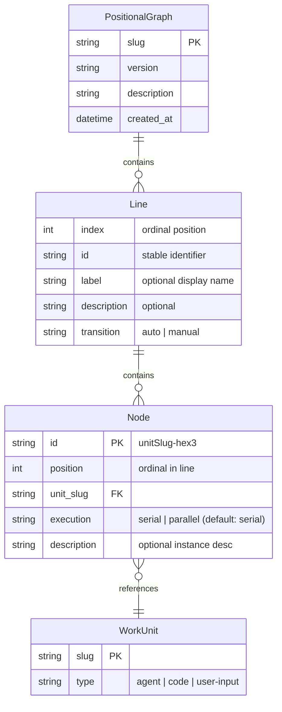

# Workshop: Positional Graph Prototype — Lines, Nodes, and Operations

**Type**: Data Model + CLI Flow
**Plan**: 026-positional-graph
**Spec**: (pre-spec workshop — informing the specification)
**Created**: 2026-01-31
**Status**: Draft

**Related Documents**:
- [Execution Rules Workshop](./workflow-execution-rules.md) — authoritative execution semantics (canRun algorithm, getStatus API, per-node execution)
- [Research Dossier](../research-dossier.md)
- [Existing E2E Sample Flow](../../../../docs/how/dev/workgraph-run/e2e-sample-flow.ts)

---

## Purpose

Workshop the core data model and operations for the Positional Graph prototype. The goal is a concrete, runnable thing — like `e2e-sample-flow.ts` — but starting with just the structural primitives: **Lines** containing **Nodes**, with full CRUD and positional operations. No execution, no agents, no data flow yet. Just the skeleton.

## Key Questions Addressed

- What are the core entities and their relationships?
- What does the YAML schema look like on disk?
- What operations can you perform on Lines and Nodes?
- What does the CLI surface look like?
- What invariants must always hold?
- How do Nodes reference WorkUnits?
- What does ordinal positioning look like in practice?

---

## Vocabulary

| Term | Definition |
|------|-----------|
| **PositionalGraph** (or just "Graph") | Top-level container. An ordered sequence of Lines. |
| **Line** | An ordered row/tier in the graph. Contains zero or more Nodes. Has an ordinal position (0-based). |
| **Node** | A work unit instance placed at a position within a Line. References a WorkUnit by slug. |
| **Position** | A node's ordinal index within its Line (0-based, left-to-right). |
| **Line Index** | A line's ordinal position in the graph (0-based, top-to-bottom). |

**Why "Line"?** Considered: row, bucket, tier, stage, lane, step. "Line" is short, visual (think horizontal line on a canvas), and doesn't collide with existing terms in the codebase (`stage` is CI/CD, `step` is AWS, `tier` is infrastructure, `bucket` is S3). "Line" also pairs well with the visual metaphor: "add a node to line 2."

---

## Conceptual Model

```
PositionalGraph "my-pipeline"
│
├── Line 0:  [ NodeA(sample-input) ]
│
├── Line 1:  [ NodeB(sample-coder),  NodeC(sample-reviewer) ]
│
└── Line 2:  [ NodeD(sample-tester) ]
```

**Rules**:
- Lines are ordered. Line 0 runs first, Line 1 next, etc.
- Nodes within a line have ordinal positions (0, 1, 2...) — left to right.
- A graph always has at least one line (created empty on `graph create`).
- A line can be empty (no nodes). Empty lines are valid.
- A node belongs to exactly one line at one position.



---

## Package & Data Domain

Positional graphs are a **new concept**, not a subtype of WorkGraph. They get their own package and workspace data domain:

- **Package**: `packages/positional-graph/` (new, independent of `packages/workgraph/`)
- **Data domain**: `workflows` (stored under `<worktree>/.chainglass/data/workflows/`)
- **DI tokens**: New `POSITIONAL_GRAPH_DI_TOKENS` (not mixed into `WORKGRAPH_DI_TOKENS`)
- **CLI prefix**: `cg wf` (not `cg wg`)

The positional graph adapter extends `WorkspaceDataAdapterBase` from `packages/workflow` — same storage pattern as `SampleAdapter` and `AgentEventAdapter`, just a new domain.

## On-Disk Storage

```
<worktree>/.chainglass/data/workflows/<slug>/
├── graph.yaml               # Graph definition (lines + node placement)
├── state.json               # Runtime state (node statuses)
├── layout.json              # UI viewport only (positions derived from lines)
└── nodes/<nodeId>/
    ├── node.yaml             # Node config (unit_slug, config, inputs)
    └── data/
        ├── data.json         # Outputs
        └── outputs/<name>.md # File outputs
```

Note: The file is `graph.yaml` (not `work-graph.yaml`) to match the new domain naming.

### graph.yaml — Positional Graph

```yaml
slug: my-pipeline
version: "1.0.0"
created_at: "2026-01-31T00:00:00Z"
description: "Sample code generation pipeline"

lines:
  - id: line-0
    label: "Input"
    description: "Gather requirements and specifications"
    transition: auto
    nodes:
      - sample-input-a3f

  - id: line-1
    label: "Processing"
    description: "Generate and review code in parallel"
    transition: auto
    nodes:
      - sample-coder-b7e
      - sample-reviewer-c4d

  - id: line-2
    label: "Verification"
    description: "Run tests sequentially"
    transition: manual
    nodes:
      - sample-tester-d9a
```

**Key design points**:
- No `edges[]` — topology is implicit from line ordering
- No flat `nodes[]` array — nodes live inside their lines
- No `start` sentinel node — line 0 IS the entry point
- Node `execution` controls whether a node waits for its left neighbor (per-node, not per-line):
  - `serial` (default) — wait for the node at position N-1 to complete before starting
  - `parallel` — start as soon as the line is eligible, regardless of left neighbor
  - A single line can mix serial and parallel nodes to create independent execution chains
- Line `transition` controls what happens when a line completes and the **next** line should begin:
  - `auto` — next line starts automatically when all nodes in this line complete (default)
  - `manual` — next line does NOT auto-start; the orchestrator (or user) must explicitly trigger it
  - (Future: `conditional` — next line starts only if some predicate passes)

**Node ordering within a line matters** for serial execution chains and for ordinal display. Position 0 is leftmost.

See [Execution Rules Workshop](./workflow-execution-rules.md) §1 and §6 for the authoritative definition of per-node execution semantics.

### Transition (Flow Control Between Lines)

The `transition` property on a Line governs the **edge between this line and the next**. Think of it as: "when this line finishes, what happens?"

| Transition | Behavior | Use Case |
|------------|----------|----------|
| `auto` | Next line starts immediately when all nodes on this line complete | Default pipeline flow |
| `manual` | Next line waits for explicit trigger | Review gates, human approval |

This replaces the need for "control nodes" or explicit edge annotations. The flow control is a property of the line itself — which makes sense because the line IS the positional boundary.

**Why on the line, not between lines?** A separate "connector" entity between every pair of lines adds complexity and a new entity type for minimal gain. The line already represents a synchronization point. The `transition` property says "what to do at my synchronization boundary." If we later need per-line-pair control, we can promote it to a separate concept, but for now the simpler model covers the use cases.

---

## Zod Schemas (Proposed)

```typescript
import { z } from 'zod';

// Execution — per-node property controlling left-neighbor dependency
export const ExecutionSchema = z.enum(['serial', 'parallel']);
export type Execution = z.infer<typeof ExecutionSchema>;

// Transition — what happens when this line completes (flow control to next line)
export const TransitionModeSchema = z.enum(['auto', 'manual']);
export type TransitionMode = z.infer<typeof TransitionModeSchema>;

// A line definition (no execution_mode — execution is per-node)
export const LineDefinitionSchema = z.object({
  id: z.string().min(1),
  label: z.string().optional(),
  description: z.string().optional(),
  transition: TransitionModeSchema.default('auto'),
  nodes: z.array(z.string()),  // Node IDs in positional order
});
export type LineDefinition = z.infer<typeof LineDefinitionSchema>;

// The positional graph definition
export const PositionalGraphDefinitionSchema = z.object({
  slug: z.string().regex(/^[a-z][a-z0-9-]*$/),
  version: z.string().regex(/^\d+\.\d+\.\d+$/),
  description: z.string().optional(),
  created_at: z.string().datetime(),
  lines: z.array(LineDefinitionSchema).min(1),  // At least one line
});
export type PositionalGraphDefinition = z.infer<typeof PositionalGraphDefinitionSchema>;
```

### Node descriptions

Nodes carry an instance-level `description` in their `node.yaml`. This is **in addition to** whatever description the linked WorkUnit has — think of it as "why this instance is here" vs "what this unit type does."

```typescript
// In node.yaml schema
export const NodeConfigSchema = z.object({
  id: z.string().min(1),
  unit_slug: z.string().min(1),
  execution: ExecutionSchema.default('serial'),  // Per-node: serial (default) or parallel
  description: z.string().optional(),  // Instance-level description
  created_at: z.string().datetime(),
  config: z.record(z.unknown()).optional(),
});
```

Display example:
```
Line 1 "Research" (auto):
  [0] research-concept-d9a (S) (research-concept:1)
      "Deep-dive into authentication patterns"        ← node instance description
      Unit: research-concept — "Research a concept"   ← workunit description
```

**What stays the same**: `state.json`, `data.json`, `WorkUnit` schemas — all unchanged.

---

## Line IDs

Lines need stable identifiers so that operations like "insert line before line-1" remain unambiguous even as ordinal positions shift. The `id` field serves this purpose.

**Generation**: `line-<hex3>` (e.g., `line-a4f`). Same hex3 pattern as node IDs, prefixed with `line-`.

**Display**: Lines are displayed with their ordinal index (0, 1, 2...) and optionally their label. The `id` is used internally for referencing but the user mostly interacts via ordinal or label.

```
Line 0 (line-a4f) "Input":       [ sample-input-a3f ]
Line 1 (line-b7e) "Processing":  [ sample-coder-c4d, sample-reviewer-d9a ]
Line 2 (line-c8b) "Verification":[ sample-tester-e2f ]
```

---

## Node IDs and Ordinal Disambiguation

Node IDs follow the existing `<unitSlug>-<hex3>` pattern (e.g., `sample-coder-b7e`).

**Same-name nodes**: If multiple nodes reference the same WorkUnit, they share the base slug but have unique hex suffixes. The graph displays them with ordinal markers:

```
Line 1: [ research-concept-a3f (1), research-concept-b7e (2), summarize-c4d ]
```

You can reference a node by:
- **Full ID**: `research-concept-a3f` (always unambiguous)
- **Unit slug**: `research-concept` (if only one instance exists)
- **Unit slug + ordinal**: `research-concept:1`, `research-concept:2` (if multiple exist)

---

## Workspace Context

All `cg wf` commands operate within a workspace context, following the same pattern as `cg wg`:

- **Auto-detect**: By default, resolves workspace from `process.cwd()` — the current directory must be inside a registered workspace
- **Override**: `--workspace-path <path>` flag to explicitly target a different workspace/worktree
- **Resolution**: `WorkspaceService.resolveContext(path)` finds the longest-matching registered workspace, detects git worktree info, and returns a `WorkspaceContext`
- **Storage root**: Data lives under `ctx.worktreePath/.chainglass/data/workflows/` — note this uses `worktreePath` (not `workspacePath`), so each git worktree gets its own positional graph data

```bash
# Auto-detect from cwd (most common)
cg wf create my-pipeline

# Explicit workspace override
cg wf create my-pipeline --workspace-path /home/jak/projects/my-app

# JSON output (all commands)
cg wf show my-pipeline --json
```

The `IPositionalGraphService` interface takes `WorkspaceContext` as the first parameter on every method — same convention as `IWorkGraphService`.

---

## Operations

### Graph Operations

| Operation | Description |
|-----------|-------------|
| `create <slug>` | Create new graph with one empty line |
| `show <slug>` | Display graph structure (lines and nodes) |
| `status <slug>` | Show graph with node execution statuses |
| `delete <slug>` | Remove graph entirely |
| `list` | List all positional graphs in the workspace |

### Line Operations

| Operation | Description |
|-----------|-------------|
| `line add <graph>` | Append a new empty line at the end |
| `line add <graph> --at <index>` | Insert a new empty line at the given ordinal position |
| `line add <graph> --after <lineId>` | Insert a new empty line after the specified line |
| `line add <graph> --before <lineId>` | Insert a new empty line before the specified line |
| `line remove <graph> <lineId>` | Remove a line (must be empty, or use `--cascade`) |
| `line move <graph> <lineId> --to <index>` | Move a line to a new ordinal position |
| `line set <graph> <lineId> --transition <mode>` | Set transition mode (auto/manual) |
| `line set <graph> <lineId> --label <text>` | Set display label |
| `line set <graph> <lineId> --description <text>` | Set line description |

### Node Operations

| Operation | Description |
|-----------|-------------|
| `node add <graph> <lineId> <unitSlug>` | Append node to end of line |
| `node add <graph> <lineId> <unitSlug> --at <pos>` | Insert node at position in line |
| `node add <graph> <lineId> <unitSlug> --description <text>` | Add with instance description |
| `node remove <graph> <nodeId>` | Remove node from its line |
| `node move <graph> <nodeId> --to <pos>` | Move node to new position within same line |
| `node move <graph> <nodeId> --to-line <lineId>` | Move node to another line (appends) |
| `node move <graph> <nodeId> --to-line <lineId> --at <pos>` | Move node to specific position in another line |
| `node show <graph> <nodeId>` | Show node details with resolved inputs |
| `node set <graph> <nodeId> --description <text>` | Set node instance description |
| `node set <graph> <nodeId> --execution <mode>` | Set execution mode (serial/parallel) |

### Input Wiring Operations

| Operation | Description |
|-----------|-------------|
| `node set-input <graph> <nodeId> --input <name> --from-unit <slug> --output <name>` | Wire input from named predecessor |
| `node set-input <graph> <nodeId> --input <name> --from-node <id> --output <name>` | Wire input from explicit node ID |
| `node remove-input <graph> <nodeId> --input <name>` | Remove an input wiring |
| `node collate <graph> <nodeId>` | Run `collateInputs` and show the InputPack (resolved + errors) |

### Status Operations

| Operation | Description |
|-----------|-------------|
| `status <graph>` | Show full graph status (all lines and nodes with computed statuses) |
| `status <graph> --node <nodeId>` | Show detailed status for a specific node |
| `status <graph> --line <lineId>` | Show status for a specific line |

---

## CLI Examples — Building a Graph Step by Step

### 1. Create a graph

```
$ cg wf create my-pipeline
```
```json
{
  "graphSlug": "my-pipeline",
  "lines": 1,
  "errors": []
}
```

On disk:
```yaml
# graph.yaml
slug: my-pipeline
version: "1.0.0"
created_at: "2026-01-31T12:00:00Z"
lines:
  - id: line-a00
    transition: auto
    nodes: []
```

### 2. Add nodes to line 0

```
$ cg wf node add my-pipeline line-a00 sample-input
```
```json
{
  "nodeId": "sample-input-a3f",
  "line": "line-a00",
  "position": 0,
  "errors": []
}
```

### 3. Add a second line

```
$ cg wf line add my-pipeline
```
```json
{
  "lineId": "line-b11",
  "index": 1,
  "errors": []
}
```

### 4. Add nodes to line 1

```
$ cg wf node add my-pipeline line-b11 sample-coder
$ cg wf node add my-pipeline line-b11 sample-reviewer
```

### 5. Show the graph

```
$ cg wf show my-pipeline

my-pipeline (v1.0.0)
═══════════════════════════════════════════

  Line 0 (auto):
    [0] sample-input-a3f (S) (sample-input)

  Line 1 (auto):
    [0] sample-coder-b7e (S) (sample-coder)
    [1] sample-reviewer-c4d (S) (sample-reviewer)
```

### 6. Insert a line between 0 and 1

```
$ cg wf line add my-pipeline --after line-a00 --label "Research"
```
```json
{
  "lineId": "line-c22",
  "index": 1,
  "errors": []
}
```

Now the graph looks like:
```
  Line 0 (auto):
    [0] sample-input-a3f (S) (sample-input)

  Line 1 "Research" (auto):
    (empty)

  Line 2 (auto):
    [0] sample-coder-b7e (S) (sample-coder)
    [1] sample-reviewer-c4d (S) (sample-reviewer)
```

### 7. Move a node between lines

```
$ cg wf node move my-pipeline sample-reviewer-c4d --to-line line-c22
```

```
  Line 0 (auto):
    [0] sample-input-a3f (S) (sample-input)

  Line 1 "Research" (auto):
    [0] sample-reviewer-c4d (S) (sample-reviewer)

  Line 2 (auto):
    [0] sample-coder-b7e (S) (sample-coder)
```

### 8. Set node execution mode

```
$ cg wf node set my-pipeline sample-reviewer-c4d --execution parallel
```

### 9. Reorder nodes within a line

```
$ cg wf node add my-pipeline line-c22 research-concept
$ cg wf node add my-pipeline line-c22 research-concept

  Line 1 "Research" (auto):
    [0] sample-reviewer-c4d (P) (sample-reviewer)
    [1] research-concept-d9a (S) (research-concept:1)
    [2] research-concept-e2f (S) (research-concept:2)
```

```
$ cg wf node move my-pipeline sample-reviewer-c4d --to 2
```

```
  Line 1 "Research" (auto):
    [0] research-concept-d9a (S) (research-concept:1)
    [1] research-concept-e2f (S) (research-concept:2)
    [2] sample-reviewer-c4d (P) (sample-reviewer)
```

---

## CLI Command Prefix: `wf`

Positional graphs are a separate concept from WorkGraphs. The CLI prefix is `cg wf` ("workflow"). The existing `cg wg` commands remain untouched — the two systems coexist independently.

---

## Invariants

These must **always** hold:

1. **Unique node IDs**: No two nodes in a graph share the same ID.
2. **Unique line IDs**: No two lines in a graph share the same ID.
3. **No orphan nodes**: Every node belongs to exactly one line. There are no "floating" or "disconnected" nodes.
4. **Ordered lines**: Lines have a deterministic ordinal order (their position in the `lines[]` array).
5. **Ordered nodes**: Nodes within a line have a deterministic ordinal order (their position in the line's `nodes[]` array).
6. **At least one line**: A graph always has at least one line (can be empty).
7. **Valid unit reference**: A node's `unit_slug` must reference an existing WorkUnit (validated at add time, not at load time).
8. **Node config exists**: Every node ID in a line has a corresponding `nodes/<nodeId>/node.yaml` on disk.

---

## node.yaml — What Changes

In the positional graph, `node.yaml` gains a `description` field and input mappings change their validation rules:

```yaml
# Positional Graph node.yaml
id: sample-coder-b7e
unit_slug: sample-coder
execution: serial                # Per-node: serial (default) or parallel
description: "Generates initial implementation from the spec"   # Instance description
created_at: "2026-01-31T00:00:00Z"
config: {}
inputs:                          # Future phase — not in prototype
  spec:
    from_node: sample-input-a3f
    from_output: spec
```

**Key differences from DAG nodes**:
- **`description`** — instance-level description, complements the WorkUnit's own description
- **Positional input resolution** — inputs reference predecessors by name, resolved positionally (see Input Resolution below)
- Input wiring can be **deferred** — you can add a node without immediately wiring its inputs

---

## Status Computation (canRun)

A node's executability is determined entirely by its position in the graph. No edges to trace — just positional rules.

### Node Statuses

| Status | Meaning |
|--------|---------|
| `pending` | Not yet ready to run |
| `ready` | All prerequisites met, can be executed |
| `running` | Currently executing |
| `waiting-question` | Paused, waiting for user/orchestrator answer |
| `blocked-error` | Execution failed |
| `complete` | Finished, outputs available |

### canRun Rules

A node **can run** when ALL of these hold:

1. **All preceding lines are complete** — every node on every line with a lower index has status `complete`
2. **Line transition gate passed** — if the preceding line has `transition: manual`, the orchestrator must have explicitly triggered this line
3. **Left neighbor complete** (serial nodes only) — if this node has `execution: serial` (the default) and is at position N > 0, the node at position N-1 must be `complete`. Parallel nodes skip this gate.
4. **All required inputs available** — `collateInputs` returns `ok: true`

See [Execution Rules Workshop](./workflow-execution-rules.md) §5 for the authoritative 4-gate canRun algorithm.

```
Line 0 (auto):  [ A(P,complete), B(P,complete) ]
                              ↓ auto transition
Line 1 (auto):  [ C(S,ready), D(S,pending), E(P,ready) ]
                              ↓ auto transition
Line 2 (manual): [ F(P,pending), G(S,pending) ]  ← blocked until manually triggered
```

In this example:
- **C** is `ready` because all of line 0 is complete (auto transition), C is position 0 (no left neighbor), and inputs resolve
- **D** is `pending` because C hasn't completed yet (serial: must wait for left neighbor)
- **E** is `ready` because it's parallel (skips Gate 3) — E and C can start at the same time
- **F** and **G** are `pending` because line 1 has `transition: manual` — even when line 1 completes, line 2 won't start until triggered

### collateInputs — The Core Resolution Method

The key insight: resolving inputs and checking readiness are the same traversal. `collateInputs` does the work once, and both `canRun` and execution consume the result.

```typescript
collateInputs(ctx: WorkspaceContext, graphSlug: string, nodeId: string): Promise<InputPack>;
```

`collateInputs` does:
1. Load the node's input declarations (from `node.yaml` + WorkUnit's declared inputs)
2. For each declared input, resolve the source — find the predecessor node by `from_unit` slug (positional search) or `from_node` ID (direct)
3. Check if the source node is `complete`
4. If complete, read the output data (from `data.json` or file outputs)
5. Package everything into an `InputPack`

```typescript
interface InputPack {
  /** Per-input results — every declared input gets an entry */
  inputs: Record<string, InputEntry>;
  /** True when every required input is 'available' */
  ok: boolean;
}

/** Three states for an input */
type InputEntry =
  | { status: 'available'; detail: AvailableInput }
  | { status: 'waiting';   detail: WaitingInput }
  | { status: 'error';     detail: ErrorInput };

/** All source nodes resolved and complete — data is here */
interface AvailableInput {
  inputName: string;
  required: boolean;
  sources: SourceData[];      // One or more nodes that provided data
}

interface SourceData {
  sourceNodeId: string;       // Which node provided it
  sourceOutput: string;       // Output name on that node
  type: 'data' | 'file';
  data?: unknown;             // The actual value (data inputs)
  filePath?: string;          // Path to file (file inputs)
}

/** Source node(s) found, wired correctly, but not all have produced output yet */
interface WaitingInput {
  inputName: string;
  required: boolean;
  available: SourceData[];    // Sources that ARE complete (partial progress)
  waiting: string[];          // Node IDs that aren't done yet
}

/** Can't resolve to a valid source node — structural wiring problem */
interface ErrorInput {
  inputName: string;
  code: string;               // E160-E164
  message: string;
  required: boolean;
}
```

### Separation of concerns

| Concern | Who handles it |
|---------|---------------|
| "Do I have this input's data?" | `InputPack` — `available` entries |
| "What am I waiting on?" | `InputPack` — `waiting` entries (includes source node ID) |
| "What's broken?" | `InputPack` — `error` entries (includes error code + message) |
| "Can this node execute?" | `canRun` — checks `pack.ok` + positional/transition gates |

The `InputPack` tells you everything about this node's inputs without leaking the status of other nodes. `waiting` says "I found the source, it's not done" — it doesn't say *what* the source is doing. That's the source node's business.

### Three states, clear actions

Each input tells the consumer exactly what's going on and what to do about it:

| Status | Meaning | Action |
|--------|---------|--------|
| `available` | Data is here | Use it |
| `waiting` | Source exists, not done yet | Wait — will resolve on its own |
| `error` | Can't find a valid source | Fix wiring — needs user intervention |

```
Example: Node D has 3 inputs, "research" resolves to 2 source nodes

  inputs:
    spec:
      status: 'available'
      detail:
        sources: [{ sourceNodeId: 'input-a3f', data: '...' }]    ← single source

    research:
      status: 'waiting'
      detail:
        available: [{ sourceNodeId: 'research-concept-d9a', data: '...' }]   ← :1 is done
        waiting: ['research-concept-e2f']                                     ← :2 is not

    config:
      status: 'error'
      detail: { code: 'E161', message: 'No node matching "setup" in preceding lines' }

  ok: false    ← 'research' is required + waiting, 'config' is required + error
```

`ok` is `true` only when every required input is `available` (all its sources complete). Optional inputs that are `waiting` or `error` don't block.

**Single vs multiple sources**: Most inputs resolve to one source node. But when `from_unit: research-concept` matches multiple nodes (no ordinal specified), the input collects data from all of them. The entry is `available` only when *every* matched source is complete. `waiting` means at least one isn't done yet — but `available` within the waiting detail shows partial progress (sources that are already complete).

**Two consumers, one traversal:**

- **`canRun`** calls `collateInputs`, checks `pack.ok` plus positional/transition gates
- **Execution** calls `collateInputs`, extracts all `available` entries to feed data into the node
- **Orchestrator diagnostics**: `waiting` entries tell it which nodes to watch. `error` entries tell it what to surface to the user. No need to cross-reference graph status separately — the pack has enough.

**Note**: `canRun` is an **internal algorithm** (the 4-gate check). The **public API** is `getNodeStatus`/`getLineStatus`/`getStatus` — readiness is a field on the status object, not a separate method. See [Execution Rules Workshop](./workflow-execution-rules.md) §12 for the canonical `getStatus` API.

```typescript
// Internal algorithm (consumed by getNodeStatus, not exposed directly)
canRun(graphSlug: string, nodeId: string): CanRunResult;

interface CanRunResult {
  canRun: boolean;
  reason?: string;
  gate?: 'preceding' | 'transition' | 'serial' | 'inputs';
  inputPack: InputPack;              // The full collation result
  blockingNodes?: BlockingNode[];    // Nodes in preceding lines that aren't complete
  waitingForTransition?: boolean;    // True if blocked by a manual transition gate
  waitingForSerial?: string;         // Node ID of the serial predecessor that's not done
}
```

### Status Computation (Derived)

Node status can be **computed** from the graph state rather than stored:
- `pending` = default, canRun is false
- `ready` = canRun is true, not yet started
- `running` / `waiting-question` / `blocked-error` / `complete` = set by execution lifecycle

The `status` command computes this for all nodes and displays it.

---

## Input Resolution (Positional Data Flow)

This is the key conceptual shift from the DAG model. In the DAG, inputs are wired to specific node IDs via edges. In the positional model, **WorkUnits request data from named predecessors**, and the graph resolves those names positionally.

### How It Works

A WorkUnit declares its inputs as before — name, type, required:

```yaml
# unit.yaml (unchanged)
slug: sample-coder
inputs:
  - name: spec
    type: data
    data_type: text
    required: true
outputs:
  - name: code
    type: data
    data_type: text
    required: true
```

But the **node instance** declares where to get its inputs using **named predecessor references** instead of explicit node IDs:

```yaml
# node.yaml — NEW: positional input resolution
id: sample-coder-b7e
unit_slug: sample-coder
description: "Generate code from the input spec"
created_at: "2026-01-31T00:00:00Z"
config: {}
inputs:
  spec:
    from_unit: sample-input        # WorkUnit slug, not node ID
    from_output: spec              # Output name on that unit
```

### Resolution Rules

When node `sample-coder-b7e` on line 2 requests data `from_unit: sample-input`:

1. **Search preceding lines** — scan lines 0, 1 (everything before line 2) for nodes whose `unit_slug` matches `sample-input`
2. **Nearest-first** — if multiple matches exist, prefer the one on the highest-indexed preceding line (closest predecessor)
3. **Ordinal disambiguation** — if multiple nodes on the same line match, use ordinal syntax: `from_unit: sample-input:2` (second instance)
4. **Same-line resolution** — any node at position N can reference a node at position < N on the same line, regardless of execution mode (the `execution` flag controls when a node starts, not what it can see)
5. **Explicit node ID fallback** — `from_node: sample-input-a3f` bypasses name resolution and targets a specific node directly

```yaml
# Ordinal disambiguation
inputs:
  primary_research:
    from_unit: research-concept:1    # First instance of research-concept
    from_output: summary
  secondary_research:
    from_unit: research-concept:2    # Second instance
    from_output: summary
```

```yaml
# Explicit node ID (escape hatch)
inputs:
  spec:
    from_node: sample-input-a3f      # Direct reference, skips name resolution
    from_output: spec
```

### Schema Update

```typescript
export const InputResolutionSchema = z.union([
  // Named predecessor (preferred — positional resolution)
  z.object({
    from_unit: z.string().min(1),     // WorkUnit slug, optionally with :ordinal
    from_output: z.string().min(1),
  }),
  // Explicit node ID (escape hatch)
  z.object({
    from_node: z.string().min(1),     // Specific node ID
    from_output: z.string().min(1),
  }),
]);

export const NodeConfigSchema = z.object({
  id: z.string().min(1),
  unit_slug: z.string().min(1),
  execution: ExecutionSchema.default('serial'),  // Per-node: serial (default) or parallel
  description: z.string().optional(),
  created_at: z.string().datetime(),
  config: z.record(z.unknown()).optional(),
  inputs: z.record(InputResolutionSchema).optional(),  // Named map of input resolutions
});
```

### Validation

Input resolution is validated at **execution time** (when canRun is checked), not at add time:
- The referenced `from_unit` must exist in a preceding line (or earlier position on the same line)
- The referenced `from_output` must be a declared output of that WorkUnit
- If the source node hasn't completed, the requesting node can't run yet

This means you can build the graph structure first, wire inputs later, and validation only fires when you try to execute.

### Why This Matters

In the DAG model, `add-after` simultaneously creates a structural edge AND an implicit data dependency. You can't have one without the other. In the positional model:
- **Structure** (which line a node is on) and **data flow** (which outputs it consumes) are independent
- You can reorganize lines without breaking input wiring (as long as the named predecessor is still "before" you)
- Multiple nodes can consume the same predecessor's output without diamond-dependency edge gymnastics

---

## Prototype Scope (What We Build First)

The prototype covers structure, status computation, and input resolution — enough to validate the positional model end-to-end.

### In scope:
- `PositionalGraphDefinition` schema and types
- `graph.yaml` read/write with new schema
- Graph CRUD: create, load, show, delete, list
- Line operations: add, remove, move, set mode/label/description/transition
- Node operations: add to line, remove, move within line, move between lines
- `node.yaml` with `unit_slug`, `description`, `config`, and `inputs`
- Status computation: `canRun` based on positional rules + transition gates
- Input resolution: `from_unit` named lookup + `from_node` explicit fallback
- CLI commands under `cg wf`
- Workspace-aware storage (`workflows` domain)
- Basic contract tests with fakes

### Out of scope (future phases):
- Execution lifecycle (start, end, output saving)
- Agent integration
- UI/React Flow visualization
- SSE real-time updates
- Migration from DAG graphs

---

## E2E Prototype Script — What It Looks Like

The end state is a runnable TypeScript script similar to `e2e-sample-flow.ts`, exercising structure, status computation, and input resolution:

```typescript
#!/usr/bin/env npx tsx
/**
 * Positional Graph Prototype — E2E Test
 *
 * Validates:
 * - Graph creation with initial empty line
 * - Adding lines at various positions
 * - Adding nodes to lines
 * - Moving nodes between lines
 * - Reordering nodes and lines
 * - Removing nodes and lines
 * - Status computation (canRun based on position)
 * - Input resolution (from_unit named lookup)
 * - Transition gates (manual lines block until triggered)
 * - Show/status command output
 */

const GRAPH = 'proto-test';

async function main() {
  console.log('=== Positional Graph Prototype E2E ===\n');

  // 1. Create graph
  await run('pg create', GRAPH);
  // Expect: 1 empty line

  // 2. Add nodes to line 0
  const input = await run('pg node add', GRAPH, 'line-???', 'sample-input');
  // Expect: line 0 has [sample-input-xxx]

  // 3. Add line 1
  const line1 = await run('pg line add', GRAPH);
  // Expect: 2 lines, line 1 empty

  // 4. Add nodes to line 1
  const coder = await run('pg node add', GRAPH, line1.lineId, 'sample-coder');
  const reviewer = await run('pg node add', GRAPH, line1.lineId, 'sample-reviewer');
  // Expect: line 1 has [sample-coder-xxx, sample-reviewer-xxx]

  // 5. Insert line between 0 and 1
  const research = await run('pg line add', GRAPH, '--after', 'line-???', '--label', 'Research');
  // Expect: 3 lines, new line at index 1, old line 1 is now index 2

  // 6. Move reviewer to research line
  await run('pg node move', GRAPH, reviewer.nodeId, '--to-line', research.lineId);
  // Expect: research line has [sample-reviewer-xxx]

  // 7. Add research nodes
  const r1 = await run('pg node add', GRAPH, research.lineId, 'research-concept');
  const r2 = await run('pg node add', GRAPH, research.lineId, 'research-concept');
  // Expect: research line has [reviewer, research-concept:1, research-concept:2]

  // 8. Reorder: move reviewer to end
  await run('pg node move', GRAPH, reviewer.nodeId, '--to', '2');
  // Expect: research line has [research-concept:1, research-concept:2, reviewer]

  // 9. Set node execution mode (e.g., make reviewer parallel)
  await run('pg node set', GRAPH, reviewer.nodeId, '--execution', 'parallel');

  // 10. Show structure
  await run('pg show', GRAPH);
  // Expect:
  //   Line 0 (auto):      [sample-input-xxx (S)]
  //   Line 1 "Research" (auto): [research-concept:1 (S), research-concept:2 (S), reviewer (P)]
  //   Line 2 (auto):      [sample-coder-xxx (S)]

  // 11. Move line 2 to position 1 (swap research and processing)
  await run('pg line move', GRAPH, '???', '--to', '1');

  // 12. Remove a node
  await run('pg node remove', GRAPH, r2.nodeId);

  // 13. Remove empty line (add one, verify it's empty, remove it)
  const temp = await run('pg line add', GRAPH);
  await run('pg line remove', GRAPH, temp.lineId);

  // === STATUS COMPUTATION ===

  // 14. Check status on line 0 nodes (should be ready — no predecessors)
  const statusInput = await run('pg status', GRAPH, '--node', input.nodeId);
  // Expect: { status: 'ready', ready: true }

  // 15. Check status on line 1 nodes (should be pending — line 0 not complete)
  const statusCoder = await run('pg status', GRAPH, '--node', coder.nodeId);
  // Expect: { status: 'pending', ready: false, readyDetail: { precedingLinesComplete: false } }

  // 16. Set a manual transition gate
  await run('pg line set', GRAPH, research.lineId, '--transition', 'manual');
  // Now even when line 1 completes, line 2 won't auto-start

  // 17. Status shows computed states
  await run('pg status', GRAPH);
  // Expect: line 0 nodes = ready, line 1+ = pending

  // === INPUT RESOLUTION ===

  // 18. Wire inputs by named predecessor
  await run('pg node set-input', GRAPH, coder.nodeId,
    '--input', 'spec', '--from-unit', 'sample-input', '--output', 'spec');
  // Expect: coder's node.yaml now has inputs.spec.from_unit = "sample-input"

  // 19. Wire inputs with ordinal disambiguation
  await run('pg node set-input', GRAPH, reviewer.nodeId,
    '--input', 'research', '--from-unit', 'research-concept:1', '--output', 'summary');

  // 20. Verify input resolution
  const resolved = await run('pg node show', GRAPH, coder.nodeId);
  // Expect: inputs.spec resolves to sample-input-a3f on line 0

  // 21. Final show
  await run('pg show', GRAPH);

  console.log('\n=== ALL PROTOTYPE OPERATIONS VERIFIED ===');
}
```

This is pseudo-code — the real script will use `runCli()` from the existing harness and parse JSON responses.

---

## Service Interface — Canonical `IPositionalGraphService`

This is the **canonical** `IPositionalGraphService` definition. The execution rules workshop defines the algorithms (canRun gates, collateInputs traversal, status computation rules); this section defines the API surface.

```typescript
export interface IPositionalGraphService {
  // Graph CRUD
  create(ctx: WorkspaceContext, slug: string): Promise<GraphCreateResult>;
  load(ctx: WorkspaceContext, slug: string): Promise<PGLoadResult>;
  show(ctx: WorkspaceContext, slug: string): Promise<PGShowResult>;
  delete(ctx: WorkspaceContext, slug: string): Promise<BaseResult>;
  list(ctx: WorkspaceContext): Promise<PGListResult>;

  // Line operations
  addLine(ctx: WorkspaceContext, graphSlug: string, options?: AddLineOptions): Promise<AddLineResult>;
  removeLine(ctx: WorkspaceContext, graphSlug: string, lineId: string, options?: RemoveLineOptions): Promise<BaseResult>;
  moveLine(ctx: WorkspaceContext, graphSlug: string, lineId: string, toIndex: number): Promise<BaseResult>;
  setLineTransition(ctx: WorkspaceContext, graphSlug: string, lineId: string, transition: TransitionMode): Promise<BaseResult>;
  setLineLabel(ctx: WorkspaceContext, graphSlug: string, lineId: string, label: string): Promise<BaseResult>;
  setLineDescription(ctx: WorkspaceContext, graphSlug: string, lineId: string, description: string): Promise<BaseResult>;

  // Node operations
  addNode(ctx: WorkspaceContext, graphSlug: string, lineId: string, unitSlug: string, options?: AddNodeOptions): Promise<AddNodeResult>;
  removeNode(ctx: WorkspaceContext, graphSlug: string, nodeId: string): Promise<BaseResult>;
  moveNode(ctx: WorkspaceContext, graphSlug: string, nodeId: string, options: MoveNodeOptions): Promise<BaseResult>;
  setNodeDescription(ctx: WorkspaceContext, graphSlug: string, nodeId: string, description: string): Promise<BaseResult>;
  setNodeExecution(ctx: WorkspaceContext, graphSlug: string, nodeId: string, execution: Execution): Promise<BaseResult>;
  showNode(ctx: WorkspaceContext, graphSlug: string, nodeId: string): Promise<NodeShowResult>;

  // Input wiring
  setInput(ctx: WorkspaceContext, graphSlug: string, nodeId: string, inputName: string, source: InputResolution): Promise<BaseResult>;
  removeInput(ctx: WorkspaceContext, graphSlug: string, nodeId: string, inputName: string): Promise<BaseResult>;

  // Input resolution (core internal method — consumed by getNodeStatus)
  collateInputs(ctx: WorkspaceContext, graphSlug: string, nodeId: string): Promise<InputPack>;

  // Status API — three levels, one pattern
  // See execution rules workshop §12 for algorithm details
  getNodeStatus(ctx: WorkspaceContext, graphSlug: string, nodeId: string): Promise<NodeStatus>;
  getLineStatus(ctx: WorkspaceContext, graphSlug: string, lineId: string): Promise<LineStatus>;
  getStatus(ctx: WorkspaceContext, graphSlug: string): Promise<GraphStatus>;

  // Transition trigger
  triggerTransition(ctx: WorkspaceContext, graphSlug: string, lineId: string): Promise<BaseResult>;
}

// --- Options ---

interface AddLineOptions {
  afterLineId?: string;
  beforeLineId?: string;
  atIndex?: number;
  label?: string;
  description?: string;
  transition?: TransitionMode;
}

interface RemoveLineOptions {
  cascade?: boolean;  // Remove line even if it has nodes (removes them too)
}

interface AddNodeOptions {
  atPosition?: number;      // Insert at specific position (default: append)
  description?: string;     // Instance-level description
  execution?: Execution;    // Per-node execution mode (default: serial)
}

interface MoveNodeOptions {
  toPosition?: number;       // New position within current line
  toLineId?: string;         // Move to different line
  toPositionInLine?: number; // Position in target line (default: append)
}

// Input resolution — how a node declares where its data comes from
type InputResolution =
  | { from_unit: string; from_output: string }   // Named predecessor lookup
  | { from_node: string; from_output: string };   // Explicit node ID

// --- CRUD Result Types ---

interface AddLineResult extends BaseResult {
  lineId: string;
  index: number;
}

interface AddNodeResult extends BaseResult {
  nodeId: string;
  lineId: string;
  position: number;
}

interface NodeShowResult extends BaseResult {
  nodeId: string;
  unitSlug: string;
  execution: Execution;
  description?: string;
  lineId: string;
  position: number;
  inputs: Record<string, InputResolution>;
  inputPack: InputPack;  // Live collation result
}

// --- Status Types (from execution rules workshop §12) ---

type ExecutionStatus = 'pending' | 'ready' | 'running' | 'waiting-question' | 'blocked-error' | 'complete';

interface NodeStatus {
  nodeId: string;
  unitSlug: string;
  execution: Execution;
  lineId: string;
  position: number;

  // Current state (computed or stored)
  status: ExecutionStatus;

  // Readiness (always computed, even if node is already running/complete)
  ready: boolean;
  readyDetail: {
    precedingLinesComplete: boolean;
    transitionOpen: boolean;
    serialNeighborComplete: boolean;  // true if parallel (n/a), true if pos 0
    inputsAvailable: boolean;         // collateInputs.ok
    unitFound: boolean;               // false if WorkUnit no longer exists
    reason?: string;                  // Human-readable summary of first failing condition
  };

  // Input resolution (always resolved)
  inputPack: InputPack;

  // Present when status is 'waiting-question'
  pendingQuestion?: {
    questionId: string;
    text: string;
    questionType: 'text' | 'single' | 'multi' | 'confirm';
    options?: { key: string; label: string }[];
    askedAt: string;
  };

  // Present when status is 'blocked-error'
  error?: {
    code: string;
    message: string;
    occurredAt: string;
  };

  // Timing
  startedAt?: string;
  completedAt?: string;
}

interface LineStatus {
  lineId: string;
  label?: string;
  index: number;
  transition: TransitionMode;
  transitionTriggered: boolean;

  // Line-level state
  complete: boolean;
  empty: boolean;

  // Line-level readiness
  canRun: boolean;
  precedingLinesComplete: boolean;
  transitionOpen: boolean;
  starterNodes: StarterReadiness[];

  // Per-node status
  nodes: NodeStatus[];

  // Convenience buckets
  readyNodes: string[];
  runningNodes: string[];
  waitingQuestionNodes: string[];
  blockedNodes: string[];
  completedNodes: string[];
}

/** A chain-starter is position 0, or any parallel node that breaks a serial chain */
interface StarterReadiness {
  nodeId: string;
  position: number;
  ready: boolean;
  reason?: string;
}

interface GraphStatus {
  graphSlug: string;
  version: string;
  description?: string;

  // Overall state
  status: 'pending' | 'in_progress' | 'complete' | 'failed';
  totalNodes: number;
  completedNodes: number;

  // Per-line status (in line order)
  lines: LineStatus[];

  // Convenience: flat lists across all lines
  readyNodes: string[];
  runningNodes: string[];
  waitingQuestionNodes: string[];
  blockedNodes: string[];
  completedNodeIds: string[];
}
```

---

## Error Codes (New Range: E150-E179)

| Code | Message | Trigger |
|------|---------|---------|
| **Structure** | | |
| E150 | Line not found | Line ID doesn't exist in graph |
| E151 | Line not empty | Trying to remove a line that has nodes (without `--cascade`) |
| E152 | Invalid line index | Index out of bounds for line move/insert |
| E153 | Node not found in graph | Node ID doesn't exist |
| E154 | Invalid node position | Position out of bounds within line |
| E155 | Duplicate node in line | Node already exists (shouldn't happen with generated IDs) |
| E156 | Cannot remove last line | Graph must have at least one line |
| **Input Resolution** | | |
| E160 | Input not declared | Input name doesn't exist on the WorkUnit |
| E161 | Predecessor not found | `from_unit` slug doesn't match any node in preceding lines |
| E162 | Ambiguous predecessor | Multiple nodes match `from_unit` and no ordinal specified |
| E163 | Output not declared | `from_output` doesn't exist on the resolved source WorkUnit |
| E164 | Invalid ordinal | `from_unit` ordinal (e.g., `:3`) exceeds number of matching nodes |
| **Status** | | |
| E170 | Node not ready | Attempt to start a node that can't run yet |
| E171 | Transition blocked | Line waiting for manual trigger |

Existing error codes from the shared range still apply: E074 (no workspace context), E120 (unit not found).

---

## Open Questions

### Q1: Should empty lines be auto-cleaned?

**OPEN**: When a node is moved out of a line, should the line be auto-removed if it becomes empty?

- **Option A: No** — empty lines are valid, user removes them explicitly. Simpler, predictable.
- **Option B: Yes** — clean up empty lines automatically. Less clutter, but surprising behavior.
- **Leaning**: Option A. Keep it explicit.

### Q2: Line ID vs Line Index — which does the user primarily interact with?

**OPEN**: CLI commands need to reference lines. Options:

- **Option A: By ID** (`line-a4f`) — stable, unambiguous, but opaque
- **Option B: By index** (`0`, `1`, `2`) — human-friendly, but shifts on insert/remove
- **Option C: Both** — accept either, resolve internally
- **Leaning**: Option C. Accept both `line-a4f` and `0`/`1`/`2`. The `show` command displays both.

### Q3: Should `node add` auto-create a line if graph is empty?

**OPEN**: If graph has one empty line (default), `node add` should just work without needing the line ID.

- **Option A**: Always require line ID — explicit, no magic
- **Option B**: If exactly one line exists and no line ID given, use it — convenience
- **Leaning**: Option B. The common case of "create graph, add first node" shouldn't require looking up the line ID.

### Q4: How does `line add` position work when using `--after`/`--before` with index vs ID?

**RESOLVED**: `--after` and `--before` take line IDs (stable). `--at` takes an index (positional). They are mutually exclusive. If none specified, append to end.

### Q5: Do we need a "staging area" for disconnected nodes?

**RESOLVED**: No. Every node belongs to a line. If you want to experiment, add nodes to a line and move them later. This eliminates the "disconnected" status entirely for the positional model.

---

## Comparison: DAG WorkGraph vs Positional Graph

### Adding 3 nodes to a pipeline

**WorkGraph (DAG, `cg wg`)**:
```bash
cg wg create my-pipeline
cg wg node add-after my-pipeline start sample-input
cg wg node add-after my-pipeline sample-input-a3f sample-coder
cg wg node add-after my-pipeline sample-coder-b7e sample-tester
```

**Positional Graph (`cg wf`)**:
```bash
cg wf create my-pipeline
cg wf node add my-pipeline line-a00 sample-input
cg wf line add my-pipeline
cg wf node add my-pipeline line-b11 sample-coder
cg wf line add my-pipeline
cg wf node add my-pipeline line-c22 sample-tester
```

More lines of CLI? Yes. But the tradeoff: no edge wiring, no cycle detection, no `start` node, and you can later add parallel nodes to any line trivially:

```bash
cg wf node add my-pipeline line-b11 sample-reviewer
# => line 1 now runs coder AND reviewer in parallel
```

In the DAG model, adding a parallel reviewer after the same input requires reasoning about edge topology. In the positional model, you just drop it in the same line.

---

## Next Steps

1. **Review this workshop** — refine naming, operations, and open questions
2. **Run /plan-1b-specify** — create formal specification from this workshop
3. **Implement prototype** — `IPositionalGraphService` with tests
4. **Build E2E script** — `positional-graph-e2e.ts` exercising all structural operations
5. **Later**: Add input wiring, status computation, execution lifecycle, CLI integration, UI

---

**Workshop Complete**: 2026-01-31
**Location**: docs/plans/026-positional-graph/workshops/positional-graph-prototype.md
