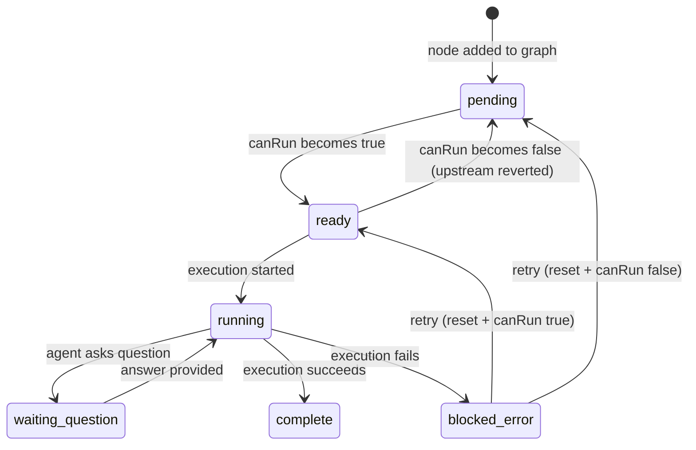

# Workshop: Workflow Execution Rules

**Type**: State Machine + Data Model
**Plan**: 026-positional-graph
**Spec**: [positional-graph-spec.md](../positional-graph-spec.md)
**Created**: 2026-02-01
**Status**: Draft

**Related Documents**:
- [Prototype Workshop](./positional-graph-prototype.md) — core data model, operations, schemas
- [Research Dossier](../research-dossier.md) — existing system analysis

---

## Purpose

Define the precise rules governing workflow execution in the positional graph model: how nodes discover their dependencies, when nodes can execute, how parallel and serial execution modes work, when auto-execution fires, and where all runtime state is persisted. This is the authoritative reference for implementing `canRun`, `collateInputs`, and the execution lifecycle.

## Key Questions Addressed

- How does a node discover its dependencies (the right-to-left, then up traversal)?
- How does dependency resolution work end-to-end?
- When can a node execute in parallel with other nodes?
- When does auto-execute fire on a line or a node?
- Where is all node and line runtime data stored?
- What is the complete state machine for node lifecycle?

---

## 1. The Graph Model Recap

A positional graph is an ordered sequence of **lines**, each containing an ordered sequence of **nodes**. Topology is implicit from position — no edges.

```
Line 0 (auto):    [ A(P) ]
Line 1 (auto):    [ B(P),  C(P) ]
Line 2 (manual):  [ D(S),  E(S),  F(P),  G(S) ]
Line 3 (auto):    [ H(P) ]
```

Execution behavior is controlled by two properties at different levels:

| Property | Lives On | Values | Controls |
|----------|----------|--------|----------|
| `transition` | **Line** | `auto` (default), `manual` | What happens when this line completes — does the **next** line start automatically? |
| `execution` | **Node** | `serial` (default), `parallel` | Whether this node waits for its left neighbor to complete before starting |

**Serial** (the default) means: "wait for the node at position N-1 in my line to finish before I can start." **Parallel** means: "I can start as soon as the line itself is eligible — don't wait for my left neighbor."

This is a per-node property, not per-line. A single line can mix serial and parallel nodes to create independent execution chains within the same line. By default, nodes execute left-to-right in sequence. Mark a node as `parallel` to opt it out of the chain and start it independently.

---

## 2. Where Compositional Data Lives

Before diving into execution rules, here's where the structural definitions — the lines and nodes themselves — are stored.

### Line definitions → `graph.yaml`

All line data lives in the `lines[]` array in `graph.yaml`. Each entry stores:

| Field | Purpose |
|-------|---------|
| `id` | Stable identifier (`line-a4f`) — survives reordering |
| `label` | Optional display name ("Research", "Verification") |
| `description` | Optional description of the line's purpose |
| `transition` | `auto` or `manual` — flow control to the next line |
| `nodes` | Ordered array of node IDs — defines node placement and position |

The **ordering** of lines in the `lines[]` array IS their execution order (line index 0, 1, 2...). The **ordering** of node IDs in each line's `nodes[]` array IS the node position (0, 1, 2... left to right).

There is no separate "line table" or "node placement table." The YAML array order is the source of truth for topology.

### Node definitions → `nodes/<nodeId>/node.yaml`

Each node gets its own directory under `nodes/`. Every node **references** a WorkUnit by slug — the WorkUnit is the reusable template that defines the node's type (`agent`, `code`, or `user-input`), its declared inputs/outputs, and its execution behavior (prompt, code, or question). The node carries its own config, input wiring, and positioning.

The `node.yaml` file stores:

| Field | Purpose |
|-------|---------|
| `id` | Node identifier (`sample-coder-b7e`) |
| `unit_slug` | **Required.** Which WorkUnit this node references (e.g., `sample-coder`, `research-concept`) |
| `execution` | `serial` (default) or `parallel` — whether to wait for left neighbor |
| `description` | Optional node-level description ("Generate auth module code") |
| `created_at` | Creation timestamp |
| `config` | Runtime config overrides (key-value) |
| `inputs` | Input wiring map — where each input comes from (`from_unit`/`from_node` + `from_output`) |

The `unit_slug` must reference a valid WorkUnit in the workspace's `units/` directory. This is validated at node-add time (error E120 if not found) **and** re-validated during readiness checks. A WorkUnit could be deleted or renamed after a node was added — the ready check must detect this and surface it as an error rather than silently failing. Multiple nodes can reference the same WorkUnit — each is an independent node with its own config, wiring, and outputs.

**The split**: `graph.yaml` knows **where** a node sits (which line, what position). `node.yaml` knows **what** a node is (which unit, what inputs, what config). The WorkUnit knows **how** the node executes (agent prompt, code timeout, user question). Neither `graph.yaml` nor `node.yaml` contains runtime state.

### Node outputs → `nodes/<nodeId>/data/`

When a node completes execution, its outputs are written here:
- `data.json` — key-value data outputs
- `outputs/<name>.md` — file outputs

### Runtime state → `state.json`

Execution lifecycle states (`running`, `complete`, etc.) and transition triggers. See [Section 8](#8-data-storage-where-everything-lives) for full details.

### Full directory tree (template)

```
<worktree>/.chainglass/data/workflows/<slug>/
├── graph.yaml                    # Line definitions + node placement (composition)
├── state.json                    # Runtime execution state
├── layout.json                   # UI viewport (future)
└── nodes/
    └── <nodeId>/
        ├── node.yaml             # Node definition (unit, config, input wiring)
        └── data/
            ├── data.json         # Output data (written on completion)
            └── outputs/          # File outputs
```

### Concrete example: a 3-line workflow

For the graph from [Section 10](#10-complete-execution-walkthrough):

```
Line 0 (auto):   [ input-a3f(P) ]
Line 1 (auto):   [ coder-c4d(P), reviewer-d9a(P) ]
Line 2 (manual): [ tester-e2f(S), deployer-f1b(S) ]
```

```
.chainglass/data/workflows/my-pipeline/
├── graph.yaml                              # 3 lines, 5 node IDs
├── state.json                              # statuses + transition triggers
├── layout.json                             # UI only (future)
│
└── nodes/
    ├── sample-input-a3f/
    │   ├── node.yaml                       # unit_slug: sample-input, execution: parallel
    │   └── data/
    │       └── data.json                   # { "spec": { type: "data", value: "..." } }
    │
    ├── sample-coder-c4d/
    │   ├── node.yaml                       # unit_slug: sample-coder, inputs.spec → sample-input
    │   └── data/
    │       ├── data.json                   # { "code": { type: "data", value: "..." } }
    │       └── outputs/
    │           └── code.ts                 # file output
    │
    ├── sample-reviewer-d9a/
    │   ├── node.yaml                       # unit_slug: sample-reviewer, inputs.spec → sample-input
    │   └── data/
    │       └── data.json
    │
    ├── sample-tester-e2f/
    │   ├── node.yaml                       # unit_slug: sample-tester, execution: serial
    │   └── data/
    │       └── data.json
    │
    └── sample-deployer-f1b/
        ├── node.yaml                       # unit_slug: sample-deployer, execution: serial
        └── data/
            └── data.json
```

**What lives where**:
- `graph.yaml` has the 3 line definitions and the 5 node IDs in positional order — it knows the **structure**
- Each `node.yaml` has the unit slug, execution mode, input wiring, and description — it knows the **identity and config**
- Each `data/` folder has outputs written at completion — it holds the **results**
- `state.json` has execution lifecycle entries for nodes that have started/completed — it tracks the **runtime**

---

## 3. Node Lifecycle State Machine



### Status Categories

| Status | Stored? | Meaning |
|--------|---------|---------|
| `pending` | No (computed) | Not ready — upstream incomplete, transition gate closed, or serial left neighbor not done |
| `ready` | No (computed) | All prerequisites met, can be executed |
| `disconnected` | No (computed) | **Removed in positional model** — every node belongs to a line, no orphans possible |
| `running` | Yes (state.json) | Execution in progress |
| `waiting-question` | Yes (state.json) | Paused — agent asked a question, awaiting answer |
| `blocked-error` | Yes (state.json) | Execution failed — needs intervention or retry |
| `complete` | Yes (state.json) | Finished — outputs available |

**Key insight**: `pending` and `ready` are **computed at query time** from the graph structure and stored states of other nodes. They are never written to `state.json`. Only the execution lifecycle states (`running`, `waiting-question`, `blocked-error`, `complete`) are persisted.

**Why?** If node A completes and that makes node B ready, we don't want to update B's state. We just re-compute B's status next time someone asks. This avoids cascading writes and keeps the state file simple.

---

## 4. Dependency Discovery: The Positional Traversal

This is the core conceptual shift from the DAG model. In the DAG, dependencies are explicit edges. In the positional model, **a node's dependencies are every node on preceding lines** — discovered by position, not by edge lookup.

### The Rule

> A node on line N depends on **all nodes on lines 0 through N-1**.

There is no selective dependency. If you're on line 2, you implicitly depend on everything on lines 0 and 1 being complete before you can run. This is the fundamental simplification — no need to trace edges, detect cycles, or validate connection topology.

### Input Resolution: Right-to-Left, Then Up

When a node needs to find a specific input source (not just "am I ready?" but "where does my `spec` input come from?"), it searches **backward through the graph**:

```
Search order for node D on line 2, position 1:

  Line 2:    [ C,  D*, E ]   ← D is here. Search positions < D first (just C).
  Line 1:    [ A,  B ]       ← then preceding line (nearest)
  Line 0:    [ Z ]           ← then earlier lines
```

**The traversal for `from_unit: sample-input`:**

1. **Same line first**: Check positions to the LEFT of D (lower positions on the same line). Walk backwards from position N-1 toward 0, looking for nodes whose `unit_slug` matches. This works the same regardless of whether D is serial or parallel — the `execution` flag controls *when D starts*, not *what D can see*.

2. **Preceding lines, nearest first**: If no match found on the same line, scan line 1, then line 0. On each line, find all nodes whose `unit_slug` matches `sample-input`.

3. **Nearest match wins**: If matches exist on line 1 AND line 0, prefer line 1 (closest predecessor). This is the "nearest-first" rule.

4. **Multiple matches on same line**: If line 1 has two nodes with `unit_slug: sample-input`, this is ambiguous — use ordinal syntax (`from_unit: sample-input:1`) to disambiguate, or collect from all.

### Resolution Examples

```
Graph:
  Line 0: [ input-a3f(sample-input) ]
  Line 1: [ research-d9a(research-concept), research-e2f(research-concept) ]
  Line 2: [ coder-b7e(sample-coder) ]
```

**Example 1: Single source**
```yaml
# coder-b7e's node.yaml
inputs:
  spec:
    from_unit: sample-input    # matches input-a3f on line 0
    from_output: spec
```
Resolution: `input-a3f` on line 0. One match, unambiguous.

**Example 2: Ordinal disambiguation**
```yaml
inputs:
  primary_research:
    from_unit: research-concept:1    # first instance → research-d9a
    from_output: summary
  secondary_research:
    from_unit: research-concept:2    # second instance → research-e2f
    from_output: summary
```
Resolution: Ordinal `:1` and `:2` refer to positional order within line 1 (left to right).

**Example 3: Multi-source (collect all)**
```yaml
inputs:
  all_research:
    from_unit: research-concept     # no ordinal → collect from ALL matching nodes
    from_output: summary
```
Resolution: Collects from BOTH `research-d9a` AND `research-e2f`. Input is `available` only when both are `complete`.

**Example 4: Explicit node ID (escape hatch)**
```yaml
inputs:
  spec:
    from_node: input-a3f           # bypass name resolution, target directly
    from_output: spec
```
Resolution: Direct lookup by node ID. The node must exist in a preceding line or at an earlier position on the same line.

### Same-Line Resolution

Any node at position N can reference a node at position < N on the same line. The search walks backwards from N-1 toward 0, same matching rules as cross-line resolution. The node's `execution` flag (serial/parallel) is irrelevant here — it controls *execution ordering*, not *input visibility*.

```
Line 1: [ analyzer-a3f(S), coder-b7e(S), reviewer-c4d(P), summarizer-e2f(P) ]
           pos 0             pos 1          pos 2            pos 3
```

```yaml
# coder-b7e (position 1) references analyzer-a3f (position 0)
inputs:
  analysis:
    from_unit: analyzer
    from_output: report
```

```yaml
# summarizer-e2f (position 3, parallel) references analyzer-a3f (position 0)
# This is valid — same-line resolution walks backwards regardless of execution mode
inputs:
  analysis:
    from_unit: analyzer
    from_output: report
```

**Important distinction**: A parallel node at position 3 can *reference* a node at position 0 for input data. It just doesn't *wait* for position 2 to finish before starting (that's the execution flag). If the referenced node at position 0 hasn't completed yet, `collateInputs` returns `waiting` — the data isn't available, but the wiring is valid.

### References to Later Nodes

There is no concept of a "forward reference error." If a node wires an input to a unit slug that only exists on a later line or later position, the backward search simply won't find it — the input resolves as `waiting` (source not found in search scope) rather than a structural error. This is by design:

- The referenced unit might be moved to a preceding line later — the wiring becomes valid without changes
- The graph can be built incrementally — wire everything, rearrange later
- No special error code needed — the input just doesn't resolve yet

---

## 5. The canRun Algorithm

`canRun` determines whether a node is eligible to execute. It checks three gates in order:

```
canRun(node) =
  Gate 1: All preceding lines complete?
  AND Gate 2: Transition gate open?
  AND Gate 3: Left neighbor complete? (serial nodes only)
  AND Gate 4: All required inputs available? (collateInputs.ok)
```

### Gate 1: Preceding Lines Complete

Every node on every line with index < this node's line index must have status `complete`.

```
Line 0:  [ A(complete), B(complete) ]     ← all complete ✓
Line 1:  [ C(complete), D(running)  ]     ← D is not complete ✗
Line 2:  [ E(pending) ]                    ← Gate 1 FAILS for E
```

Node E cannot run because line 1 is not fully complete (D is still running).

**Empty lines**: An empty line (no nodes) is trivially complete. It never blocks.

### Gate 2: Transition Gate

If the **immediately preceding** line has `transition: manual`, this line is blocked until the transition is explicitly triggered.

```
Line 0 (auto):    [ A(complete) ]           ← auto: line 1 starts automatically
Line 1 (manual):  [ B(complete), C(complete) ] ← manual: line 2 waits for trigger
Line 2 (auto):    [ D(pending) ]             ← Gate 2 FAILS — line 1 is manual
```

**Triggering manual transitions**: The orchestrator (CLI command or future UI) calls a `triggerTransition` method that marks the transition as cleared. This is persisted in `state.json`:

```json
{
  "transitions": {
    "line-b7e": { "triggered": true, "triggered_at": "2026-02-01T..." }
  }
}
```

**Edge cases**:
- Line 0 has no preceding line — Gate 2 always passes for line 0.
- Multiple manual lines in sequence: each must be triggered independently.
- The transition gate is on the **preceding** line, not the current line. Line 1's `transition: manual` blocks line **2**, not line 1 itself.

### Gate 3: Left Neighbor Complete (Serial Nodes Only)

If this node has `execution: serial` (the default), the node at position N-1 in the same line must be `complete`. If this node has `execution: parallel`, Gate 3 is skipped.

```
Line 1:  [ C(S,complete), D(S,ready), E(P,pending), F(S,pending) ]
           pos 0           pos 1       pos 2         pos 3
```

- C (pos 0, serial): No left neighbor — Gate 3 passes (position 0 always eligible)
- D (pos 1, serial): Left neighbor C is complete — Gate 3 passes
- E (pos 2, parallel): Gate 3 **skipped** — E doesn't wait for D
- F (pos 3, serial): Left neighbor E is NOT complete — Gate 3 FAILS

This creates two independent chains within the same line: `(C → D)` runs sequentially while `(E → F)` is a separate chain. C and E start at the same time.

**The general pattern**: A parallel node "breaks the chain" — it starts a new independent execution track. A serial node continues the chain from its left neighbor.

```
Example: [S, S, P, S]
  Node 0 (S): starts when line starts (pos 0, no left neighbor)
  Node 1 (S): waits for Node 0
  Node 2 (P): starts when line starts (parallel — ignores Node 1)
  Node 3 (S): waits for Node 2

Timeline:
  t0: Line eligible → Node 0 starts, Node 2 starts (both independently)
  t1: Node 0 done   → Node 1 starts
  t2: Node 2 done   → Node 3 starts
  t3: Node 1 done
  t4: Node 3 done   → line complete (all 4 done)
```

### Gate 4: Input Availability

After gates 1-3 pass, `collateInputs` runs to check if the node's declared inputs can be resolved. The `ok` field on the resulting `InputPack` must be `true`.

This is where the actual data dependencies matter:

```
Line 0: [ input-a3f(complete) ]
Line 1: [ coder-b7e(ready?) ]
```

Even though Gate 1 passes (line 0 complete), if `coder-b7e` has an input wired to a non-existent unit (`from_unit: nonexistent`), `collateInputs` returns `ok: false` with an `error` entry. Gate 4 fails.

### canRun Result

```typescript
interface CanRunResult {
  canRun: boolean;
  reason?: string;                    // Human-readable explanation when false
  gate?: 'preceding' | 'transition' | 'serial' | 'inputs';  // Which gate failed
  inputPack: InputPack;              // Full collation result
  blockingNodes?: BlockingNode[];    // Nodes not yet complete (Gate 1)
  waitingForTransition?: boolean;    // True if Gate 2 blocks
  waitingForSerial?: string;         // Node ID of left neighbor that's not done (Gate 3)
}
```

### Full canRun Walkthrough

```
Graph:
  Line 0 (auto):     [ A(P,complete), B(P,complete) ]
  Line 1 (auto):     [ C(S,complete), D(S,ready), E(P,pending) ]
  Line 2 (manual):   [ F(P,pending), G(S,pending) ]
  Line 3 (auto):     [ H(P,pending) ]

Legend: S=serial, P=parallel
```

| Node | Exec | Gate 1 | Gate 2 | Gate 3 | Gate 4 | Result |
|------|------|--------|--------|--------|--------|--------|
| A | P | n/a (line 0) | n/a | skip (parallel) | ✓ | **complete** |
| B | P | n/a (line 0) | n/a | skip (parallel) | ✓ | **complete** |
| C | S | ✓ (line 0 done) | ✓ (line 0 auto) | ✓ (pos 0) | ✓ | **complete** |
| D | S | ✓ (line 0 done) | ✓ (line 0 auto) | ✓ (C complete) | ✓ | **ready** |
| E | P | ✓ (line 0 done) | ✓ (line 0 auto) | skip (parallel) | ✓ | **ready** |
| F | P | ✗ (line 1 not done) | — | — | — | **pending** |
| G | S | ✗ (line 1 not done) | — | — | — | **pending** |
| H | P | ✗ (line 2 not done) | — | — | — | **pending** |

Note: D and E are both ready at the same time — D is serial (waits for C, which is done), E is parallel (skips Gate 3). They form independent chains: `(C → D)` and `(E)`.

After D and E complete (line 1 fully done):

| Node | Exec | Gate 1 | Gate 2 | Gate 3 | Gate 4 | Result |
|------|------|--------|--------|--------|--------|--------|
| F | P | ✓ (lines 0,1 done) | ✗ (line 1 manual) | — | — | **pending** (transition gate) |
| G | S | ✓ (lines 0,1 done) | ✗ (line 1 manual) | — | — | **pending** (transition gate) |

After manual trigger on line 1:

| Node | Exec | Gate 1 | Gate 2 | Gate 3 | Gate 4 | Result |
|------|------|--------|--------|--------|--------|--------|
| F | P | ✓ | ✓ (triggered) | skip (parallel) | ✓ | **ready** |
| G | S | ✓ | ✓ (triggered) | ✗ (F not done) | — | **pending** (serial wait) |

F starts first. G waits for F (its left neighbor) because G is serial. After F completes, G becomes ready.

### How This Surfaces to the Orchestrator

The 4-gate algorithm above is internal. The orchestrator calls `getStatus` at whatever scope it needs — node, line, or graph — and gets back everything: readiness, execution state, pending questions, errors, input resolution. Readiness is a field on the result, not a separate method.

See [Section 12: Service Commands](#12-service-commands) for the full `getNodeStatus` / `getLineStatus` / `getStatus` API.

---

## 6. Parallel and Serial Execution Rules

### Per-Node Execution Mode

Execution mode is a property on each **node**, not on the line. This allows mixing serial and parallel nodes within a single line to create independent execution chains.

| Node `execution` | Behavior |
|-------------------|----------|
| `parallel` | Starts as soon as the line is eligible (gates 1-2 pass). Does not wait for left neighbor. |
| `serial` (default) | Waits for the node at position N-1 to complete before starting. Creates a dependency chain. |

### Execution Chains Within a Line

A **parallel node breaks the chain** — it starts a new independent execution track. A **serial node continues the chain** from its left neighbor. Position 0 always starts when the line is eligible, regardless of its execution mode (there's no left neighbor to wait for).

```
Line: [ A(S), B(S), C(P), D(S) ]

Chain 1: A → B       (serial sequence)
Chain 2: C → D       (C starts independently, D waits for C)

Both chains start at the same time when the line becomes eligible.
```

### All-Parallel Line (Every Node is P)

When every node is parallel, all become `ready` simultaneously:

```
Line: [ A(P), B(P), C(P) ]

  t0: Line eligible → A(ready), B(ready), C(ready)
  t1: All start     → A(running), B(running), C(running)
  t2: B finishes    → A(running), B(complete), C(running)
  t3: A, C finish   → A(complete), B(complete), C(complete) ← LINE COMPLETE
```

### All-Serial Line (Every Node is S)

When every node is serial, they execute left-to-right one at a time:

```
Line: [ D(S), E(S), F(S) ]

  t0: Line eligible → D(ready), E(pending), F(pending)
  t1: D starts      → D(running), E(pending), F(pending)
  t2: D finishes    → D(complete), E(ready), F(pending)
  t3: E starts      → D(complete), E(running), F(pending)
  t4: E finishes    → D(complete), E(complete), F(ready)
  t5: F starts      → D(complete), E(complete), F(running)
  t6: F finishes    → D(complete), E(complete), F(complete) ← LINE COMPLETE
```

### Mixed Line: [S, S, P, S]

The most interesting case — two independent chains running concurrently within one line:

```
Line: [ A(S), B(S), C(P), D(S) ]

  t0: Line eligible → A(ready), B(pending), C(ready), D(pending)
                       ↑ pos 0, no left     ↑ parallel, skips B
  t1: A, C start    → A(running), B(pending), C(running), D(pending)
  t2: A finishes    → A(complete), B(ready), C(running), D(pending)
  t3: C finishes    → A(complete), B(ready), C(complete), D(ready)
  t4: B, D start    → A(complete), B(running), C(complete), D(running)
  t5: B finishes    → A(complete), B(complete), C(complete), D(running)
  t6: D finishes    → ALL COMPLETE ← LINE COMPLETE
```

### Cross-Line Parallelism (Not Possible)

Nodes on different lines CANNOT run in parallel. Line N+1 cannot start until line N is fully complete. Lines are strict synchronization barriers.

```
Line 0: [ A(P), B(P) ]     ← A and B can run in parallel
Line 1: [ C(P), D(P) ]     ← C and D must wait for BOTH A and B to complete
```

### Line Completion

A line is "complete" when ALL nodes on that line are `complete`, regardless of their execution mode. If any node has failed (`blocked-error`), the line is NOT complete.

### Error in a Serial Chain

If a serial node fails, subsequent serial nodes in the same chain are stuck:

```
Line: [ A(S), B(S), C(P), D(S) ]

  t2: A fails → A(blocked-error), B(pending), C(running), D(pending)
```

B is stuck (serial, waiting on A). But C is unaffected (parallel, independent chain). D is still pending (serial, waiting on C). When C completes, D becomes ready — the `(C → D)` chain is independent of the `(A → B)` chain.

### Error in a Parallel Node

A failed parallel node doesn't block other parallel nodes — only serial nodes that depend on it:

```
Line: [ A(P), B(P), C(S) ]

  t2: A fails → A(blocked-error), B(running), C(pending)
```

B continues independently. C waits for B (serial, left neighbor). C does NOT depend on A — the serial dependency is only on the immediate left neighbor.

---

## 7. Transition Semantics (auto vs manual)

The `transition` property on a line controls **eligibility**, not execution. No execution engine or orchestrator is in scope — this section clarifies what the property means for the graph model.

### What "auto" Means

> When this line completes, the next line's nodes **become eligible** (Gate 2 opens).

`auto` does not mean nodes start running. It means the readiness gate opens — `getLineStatus` for the next line will show `transitionOpen: true`. What happens with that information is the orchestrator's concern (future scope).

### What "manual" Means

> When this line completes, the next line's nodes **stay ineligible** until the transition is explicitly triggered.

`manual` keeps Gate 2 closed. `getLineStatus` shows `transitionOpen: false`. A `triggerTransition` call opens it, persisted in `state.json`.

### Summary

| Transition | Gate 2 behavior | Trigger needed? |
|------------|----------------|-----------------|
| `auto` | Opens when line completes | No |
| `manual` | Stays closed until triggered | Yes — `triggerTransition(lineId)` |

Execution, orchestration, and auto-run policies are out of scope for the graph model. The graph defines structure, readiness, and state — an external system decides what to do with that information.

---

## 8. Data Storage: Where Everything Lives

### Directory Structure

```
<worktree>/.chainglass/data/workflows/<slug>/
├── graph.yaml                    # Graph definition (lines + node placement)
├── state.json                    # Runtime state (node statuses, transitions)
├── layout.json                   # UI viewport only (future)
└── nodes/
    ├── <nodeId>/
    │   ├── node.yaml             # Node config (unit_slug, inputs, description)
    │   └── data/
    │       ├── data.json         # Output data (key-value)
    │       └── outputs/
    │           └── <name>.md     # File outputs
    └── <nodeId>/
        ├── node.yaml
        └── data/
            └── ...
```

### graph.yaml — Structure Only

Contains the graph structure: lines, their ordering, their properties, and which node IDs belong to each line. **No runtime state.**

```yaml
slug: my-pipeline
version: "1.0.0"
created_at: "2026-01-31T00:00:00Z"
description: "Sample code generation pipeline"

lines:
  - id: line-a4f
    label: "Input"
    transition: auto
    nodes:
      - sample-input-a3f

  - id: line-b7e
    label: "Processing"
    transition: auto
    nodes:
      - sample-coder-c4d
      - sample-reviewer-d9a

  - id: line-c8b
    label: "Verification"
    transition: manual
    nodes:
      - sample-tester-e2f
```

**What's stored here**: Structural relationships only — which nodes are on which lines, in what order, with what line properties. Node execution mode (serial/parallel) is stored in each node's `node.yaml`, not here.

**What's NOT here**: Node statuses, execution timestamps, output data, transition trigger state.

### state.json — Runtime State

Contains the execution lifecycle state. Only entries for nodes that have entered the execution lifecycle (running, waiting-question, blocked-error, complete).

```json
{
  "graph_status": "in_progress",
  "updated_at": "2026-02-01T10:30:00Z",
  "nodes": {
    "sample-input-a3f": {
      "status": "complete",
      "started_at": "2026-02-01T10:00:00Z",
      "completed_at": "2026-02-01T10:05:00Z"
    },
    "sample-coder-c4d": {
      "status": "running",
      "started_at": "2026-02-01T10:06:00Z"
    }
  },
  "transitions": {
    "line-c8b": {
      "triggered": false
    }
  }
}
```

**Key rules**:
- Nodes NOT in `state.json.nodes` have no stored state — their status is computed (`pending` or `ready`)
- `graph_status` is derived: `pending` (nothing started), `in_progress` (any node running/complete), `complete` (all nodes complete), `failed` (any node blocked-error and graph stuck)
- `transitions` tracks manual transition trigger state — only lines with `transition: manual` appear here

### node.yaml — Node Configuration

Per-node configuration including input wiring. Static after wiring — not modified during execution.

```yaml
id: sample-coder-c4d
unit_slug: sample-coder
execution: serial                # serial (default) or parallel
description: "Generate code from the input spec"
created_at: "2026-02-01T10:00:00Z"
config: {}
inputs:
  spec:
    from_unit: sample-input
    from_output: spec
  research:
    from_unit: research-concept
    from_output: summary
```

### data.json — Node Outputs

Written when a node completes execution. Contains the output data keyed by output name.

```json
{
  "code": {
    "type": "data",
    "dataType": "text",
    "value": "function hello() { ... }"
  }
}
```

File outputs go in `outputs/<name>.md` (or other extensions) alongside `data.json`.

### What's Computed vs Stored

| Data | Location | When Written |
|------|----------|--------------|
| Graph structure (lines, node placement) | `graph.yaml` | Structural operations (add, remove, move) |
| Line properties (transition, label) | `graph.yaml` | `line set` commands |
| Node config (unit_slug, execution, description) | `node.yaml` | Node creation, `node set` |
| Input wiring | `node.yaml` | `set-input` / `remove-input` |
| Node execution status | `state.json` | `start()`, `end()`, error handling |
| Transition triggers | `state.json` | Manual trigger command |
| Node outputs | `data.json` + `outputs/` | `end()` on successful execution |
| `pending`/`ready` status | **Nowhere** (computed) | Derived from graph structure + state.json |
| `canRun` result | **Nowhere** (computed) | Derived from all 4 gates |
| Line completion | **Nowhere** (computed) | All nodes on line are `complete` |

---

## 9. collateInputs — The Core Method

`collateInputs` is the single method that resolves all of a node's inputs. Both `canRun` and execution consume its result.

### Algorithm

```
collateInputs(graphSlug, nodeId):
  1. Load node.yaml for nodeId → get input declarations
  2. Load WorkUnit definition by unit_slug → get declared inputs with required/optional
     - If WorkUnit not found: early return with error (E120 "Unit not found")
  3. For each declared input:
     a. Read the input wiring from node.yaml (from_unit or from_node)
     b. If no wiring exists:
        - If required: error entry (E160 "Input not wired")
        - If optional: skip (not in result)
     c. Resolve the source:
        - from_node: direct lookup by ID
        - from_unit: positional search (same-line positions < N first, then preceding lines nearest-first)
     d. If source not found (no match in backward search): waiting entry (source not yet in scope)
     e. If ambiguous (multiple matches, no ordinal): error entry (E162)
     f. Check each matched source node's status:
        - All complete → available (include data)
        - Some complete, some not → waiting (include partial data + waiting list)
        - None complete → waiting (no data, all in waiting list)
  4. Return InputPack with ok = (all required inputs are available)
```

### InputPack Structure

```typescript
interface InputPack {
  inputs: Record<string, InputEntry>;
  ok: boolean;  // true when every REQUIRED input is 'available'
}

type InputEntry =
  | { status: 'available'; detail: AvailableInput }
  | { status: 'waiting';   detail: WaitingInput }
  | { status: 'error';     detail: ErrorInput };
```

### The Three States in Practice

```
Node: coder-b7e (line 2)
WorkUnit inputs: spec (required), research (required), config (optional)

Scenario: input-a3f complete, research-d9a complete, research-e2f running

collateInputs result:
  inputs:
    spec:
      status: available
      detail:
        inputName: "spec"
        required: true
        sources:
          - sourceNodeId: "input-a3f"
            sourceOutput: "spec"
            type: "data"
            data: "The specification text..."

    research:
      status: waiting
      detail:
        inputName: "research"
        required: true
        available:
          - sourceNodeId: "research-d9a"
            sourceOutput: "summary"
            type: "data"
            data: "First research findings..."
        waiting: ["research-e2f"]

    config:
      status: waiting
      detail:
        inputName: "config"
        required: false
        available: []
        waiting: []              ← no matching node found in backward search
        hint: "No node matching 'setup-config' found in scope"

  ok: false  ← research is required + waiting
```

When `research-e2f` completes, calling `collateInputs` again yields:

```
  research:
    status: available
    detail:
      sources:
        - sourceNodeId: "research-d9a" ...
        - sourceNodeId: "research-e2f" ...

  ok: true   ← config is still waiting, but it's optional — spec + research are available
```

### Optional vs Required

- **Required input** that is `waiting` → `ok: false`
- **Optional input** that is `waiting` → `ok: true` (doesn't block)
- **Required input** with no wiring → `waiting` entry (no source in scope) → `ok: false`
- **Optional input** with no wiring → omitted from result (not an error)

---

## 10. Complete Execution Walkthrough

Here's a full execution of a three-line graph to show everything working together.

### Setup

```
Graph: my-pipeline
  Line 0 (auto):   [ input-a3f(P, sample-input) ]
  Line 1 (auto):   [ coder-b7e(P, sample-coder), reviewer-c4d(P, sample-reviewer) ]
  Line 2 (manual): [ tester-d9a(S, sample-tester), deployer-e2f(S, sample-deployer) ]

Legend: P=parallel, S=serial

Input wiring:
  coder-b7e.inputs.spec    → from_unit: sample-input, from_output: spec
  reviewer-c4d.inputs.spec → from_unit: sample-input, from_output: spec
  tester-d9a.inputs.code   → from_unit: sample-coder, from_output: code
  deployer-e2f.inputs.code → from_unit: sample-coder, from_output: code
```

### Step-by-step

**Initial state** (state.json is empty):
```
status():
  Line 0: input-a3f     = ready    (no preceding lines, no inputs needed)
  Line 1: coder-b7e     = pending  (line 0 not complete)
          reviewer-c4d   = pending  (line 0 not complete)
  Line 2: tester-d9a    = pending  (lines 0,1 not complete)
          deployer-e2f   = pending  (lines 0,1 not complete)
```

**Orchestrator starts input-a3f:**
```
start(input-a3f) → state.json: { nodes: { "input-a3f": { status: "running" } } }
```

**input-a3f completes:**
```
end(input-a3f, outputs) → state.json: { nodes: { "input-a3f": { status: "complete" } } }

status():
  Line 0: input-a3f     = complete
  Line 1: coder-b7e     = ready    ← Gate 1: line 0 done ✓, Gate 2: auto ✓, Gate 4: spec available ✓
          reviewer-c4d   = ready    ← Same gates pass
  Line 2: tester-d9a    = pending  ← Gate 1: line 1 not done
          deployer-e2f   = pending
```

**Orchestrator starts BOTH coder and reviewer (both are parallel nodes):**
```
start(coder-b7e)   → running
start(reviewer-c4d) → running
```

**coder-b7e completes, reviewer-c4d still running:**
```
end(coder-b7e, outputs)

status():
  Line 1: coder-b7e     = complete
          reviewer-c4d   = running   ← line 1 NOT complete yet
  Line 2: tester-d9a    = pending   ← still waiting on line 1
```

**reviewer-c4d completes:**
```
end(reviewer-c4d, outputs)

status():
  Line 1: coder-b7e     = complete
          reviewer-c4d   = complete  ← line 1 COMPLETE
  Line 2: tester-d9a    = pending   ← Gate 1 ✓, Gate 2 FAILS (line 1 transition is manual)
          deployer-e2f   = pending   ← Same
```

**Orchestrator triggers manual transition on line 1:**
```
triggerTransition(line-b7e) → state.json.transitions: { "line-b7e": { triggered: true } }

status():
  Line 2: tester-d9a    = ready    ← Gate 2 ✓ (triggered), Gate 3 ✓ (pos 0, serial but no left neighbor), Gate 4 ✓
          deployer-e2f   = pending  ← Gate 3 FAILS (serial: left neighbor tester not done)
```

**tester-d9a starts and completes (serial node, position 0 — no left neighbor):**
```
start(tester-d9a) → running → end(tester-d9a) → complete

status():
  Line 2: tester-d9a    = complete
          deployer-e2f   = ready   ← Gate 3 ✓ (serial, left neighbor tester complete)
```

**deployer-e2f starts and completes:**
```
start(deployer-e2f) → running → end(deployer-e2f) → complete

status():
  ALL NODES COMPLETE → graph_status: "complete"
```

---

## 11. Edge Cases and Error Scenarios

### Empty Lines

An empty line (no nodes) is trivially complete. It does NOT block subsequent lines.

```
Line 0: [ A(complete) ]
Line 1: (empty)           ← trivially complete
Line 2: [ B(ready) ]      ← Gate 1 passes (lines 0, 1 both complete)
```

### Node Failure Mid-Line

```
Line 1: [ B(P, blocked-error), C(P, complete) ]
Line 2: [ D(P, pending) ]    ← Gate 1 FAILS (line 1 not complete — B failed)
```

Line 1 is NOT complete because B failed. C ran independently (parallel). Options:
1. Retry B → if it succeeds, line 1 completes → D becomes ready
2. Remove B from line 1 → line 1 has only C (complete) → D becomes ready

### Circular from_unit References

Not possible. `from_unit` only resolves in earlier positions on the same line or preceding lines. The positional model makes cycles structurally impossible.

### Node Moved After Wiring

If you move a node from line 0 to line 2, any node on line 1 that referenced it via `from_unit` will no longer find it in the backward search — the input resolves as `waiting` (source not in scope). The wiring in `node.yaml` is unchanged; if the node is moved back to a preceding position, the input resolves again automatically.

This is by design — moves are always allowed, and the readiness check reflects the current reality without special errors.

### Re-running a Completed Node

Not currently supported. Once `complete`, a node stays complete. Future: a "reset" operation that clears a node's state back to computed (`pending`/`ready`), removes its outputs, and may cascade to downstream dependents.

---

## 12. Service Commands

The service API is layered: **primitives** at the bottom, a single **graph-level snapshot** that composes them, and **helpers** that query the snapshot for common questions.

### Design: Three Levels, One Pattern

The API has one verb — `getStatus` — at three scopes. Each level returns everything about that scope. No separate `canRun` or `canExecute` methods — readiness is a field on the status object. Pending questions, errors, input resolution — it's all there.

```
getNodeStatus(ctx, graphSlug, nodeId)  → NodeStatus
getLineStatus(ctx, graphSlug, lineId)  → LineStatus
getStatus(ctx, graphSlug)              → GraphStatus (calls getLineStatus for each line)
```

The consumer reads the status and decides what to do. The status object is self-describing — you don't need to cross-reference anything else.

---

### `getNodeStatus`

Everything about a single node.

```typescript
getNodeStatus(ctx, graphSlug, nodeId): Promise<NodeStatus>

interface NodeStatus {
  nodeId: string;
  unitSlug: string;
  execution: 'serial' | 'parallel';
  lineId: string;
  position: number;

  // Current state (computed or stored)
  status: ExecutionStatus;     // pending | ready | running | waiting-question | blocked-error | complete

  // Readiness (always computed, even if node is already running/complete)
  ready: boolean;
  readyDetail: {
    precedingLinesComplete: boolean;
    transitionOpen: boolean;
    serialNeighborComplete: boolean;  // true if parallel (n/a), true if pos 0, else left neighbor status
    inputsAvailable: boolean;         // collateInputs.ok
    unitFound: boolean;               // false if WorkUnit no longer exists (E120)
    reason?: string;                  // Human-readable summary of first failing condition
  };

  // Input resolution (always resolved)
  inputPack: InputPack;

  // Present when status is 'waiting-question'
  pendingQuestion?: {
    questionId: string;
    text: string;
    questionType: 'text' | 'single' | 'multi' | 'confirm';
    options?: { key: string; label: string }[];
    askedAt: string;
  };

  // Present when status is 'blocked-error'
  error?: {
    code: string;
    message: string;
    occurredAt: string;
  };

  // Timing
  startedAt?: string;
  completedAt?: string;
}
```

**Key points**:
- `readyDetail` is always populated, not just when `ready` is true. The orchestrator can see exactly which conditions are met and which aren't.
- `pendingQuestion` carries the full question so the UI or orchestrator can present it without a separate lookup.
- `error` carries the failure details for `blocked-error` nodes.
- A node that's `running` still has `ready: true` in `readyDetail` (it was ready when it started). A `complete` node also shows its readiness snapshot — useful for diagnostics.

---

### `getLineStatus`

Everything about a single line. Calls `getNodeStatus` for every node on the line.

```typescript
getLineStatus(ctx, graphSlug, lineId): Promise<LineStatus>

interface LineStatus {
  lineId: string;
  label?: string;
  index: number;
  transition: 'auto' | 'manual';
  transitionTriggered: boolean;

  // Line-level state
  complete: boolean;               // All nodes complete?
  empty: boolean;                  // No nodes? (trivially complete)

  // Line-level readiness — always fully resolved, never short-circuits
  canRun: boolean;                 // preceding complete + transition open + ≥1 starter ready
  precedingLinesComplete: boolean;
  transitionOpen: boolean;         // Reported even if preceding lines aren't complete
  starterNodes: StarterReadiness[];  // Always populated regardless of other conditions

  // Per-node status (all nodes)
  nodes: NodeStatus[];

  // Convenience buckets (node IDs grouped by state)
  readyNodes: string[];
  runningNodes: string[];
  waitingQuestionNodes: string[];  // Nodes with pending questions needing answers
  blockedNodes: string[];          // Nodes with blocked-error
  completedNodes: string[];
}

/** A chain-starter is position 0, or any parallel node that breaks a serial chain */
interface StarterReadiness {
  nodeId: string;
  position: number;
  ready: boolean;
  reason?: string;
}
```

**What is a chain-starter?** Any node that would begin executing immediately when the line becomes eligible — it doesn't wait for a left neighbor. Specifically:

- Position 0 (always a starter, whether serial or parallel)
- Any parallel node (breaks the chain, starts a new independent track)

Nodes to the right of a serial node are **not** starters — they wait for their left neighbor and get rechecked as nodes complete.

```
Line: [ A(S), B(S), C(P), D(S) ]
         ↑                ↑
       starter           starter
       (pos 0)           (parallel, breaks chain)

B and D are NOT starters — they wait for A and C respectively.
```

**`canRun` for a line** is true when ALL of:
1. All preceding lines are complete
2. Transition gate is open
3. **At least one** chain-starter node can start (its inputs resolve, its WorkUnit exists)

**No short-circuiting**: Even if the transition gate is closed or preceding lines aren't complete, starters are still fully resolved. The orchestrator sees the complete picture — "if I trigger this transition, starters A and C are ready to go, starter B is waiting on inputs." Everything is always computed; nothing is hidden behind a gate.

If starter A's inputs don't resolve yet but starter C's do, `canRun` is true — the line can begin useful work on the `(C → D)` chain. When A's inputs become available later, the orchestrator picks it up on the next poll.

---

### `getStatus` (Graph Level)

Everything about the entire graph. Calls `getLineStatus` for every line and summarizes.

```typescript
getStatus(ctx, graphSlug): Promise<GraphStatus>

interface GraphStatus {
  graphSlug: string;
  version: string;
  description?: string;

  // Overall state (computed from line/node states)
  status: 'pending' | 'in_progress' | 'complete' | 'failed';
  totalNodes: number;
  completedNodes: number;

  // Per-line status (in line order)
  lines: LineStatus[];

  // Convenience: flat lists across all lines
  readyNodes: string[];
  runningNodes: string[];
  waitingQuestionNodes: string[];
  blockedNodes: string[];
  completedNodeIds: string[];
}
```

**What `getStatus` does internally:**

```
getStatus(ctx, graphSlug):
  1. Load graph.yaml → get lines and node placement
  2. Load state.json → get stored statuses and transition triggers
  3. For each line (in order):
     a. getLineStatus(ctx, graphSlug, lineId)
        → which calls getNodeStatus for each node
        → which calls collateInputs for each node
        → which loads WorkUnit definitions and checks inputs
  4. Compute overall status from the line statuses
  5. Flatten convenience lists across all lines
  6. Return the full GraphStatus
```

One call, one object, everything you need.

---

### Future: How an Orchestrator Would Use This

Execution is out of scope, but the `getStatus` API is designed so a future orchestrator's job is trivial — call `getStatus`, read the fields, act:

```typescript
// Future orchestrator sketch (OOS — illustrates API design intent)
const graph = await service.getStatus(ctx, graphSlug);

graph.readyNodes            // → start these
graph.waitingQuestionNodes  // → present these questions to the user
graph.blockedNodes          // → surface these errors
graph.status                // → 'complete' means done
```

One call, one object, everything the consumer needs.

---

## 13. Summary: Key Design Decisions

| Decision | Choice | Rationale |
|----------|--------|-----------|
| Dependencies | Positional (implicit from line ordering) | Eliminates edges, cycles, connection bugs |
| Readiness check | 4 gates (preceding, transition, serial, inputs) | Clear, debuggable, each gate has a distinct concern |
| Status API | `getStatus` at node/line/graph scope | One verb, three levels, everything in one object |
| Status storage | Hybrid: execution states stored, readiness computed | Avoids cascading writes, state.json stays small |
| Auto-execution | Not built in — orchestrator responsibility | Different execution contexts need different policies |
| Input resolution | Named predecessor search (nearest-first, right-to-left then up) | Stable across line reordering, natural multi-source |
| Serial/parallel | Per-node property (serial default), not per-line | Enables mixed chains within a single line; safe default |
| Transition control | Property on the line | No extra entity; line IS the synchronization boundary |
| collateInputs | Single traversal for both readiness and data | No duplicate work, consistent view |

---

## Open Questions

### Q1: Should `graph_status` be computed or stored?

**OPEN**: The existing workgraph stores `graph_status` in state.json. But it could be computed from node statuses (all complete → complete, any running → in_progress, any error and nothing running → failed, else pending).

- **Option A: Computed** — derive from node statuses, never store. Simpler, always consistent.
- **Option B: Stored** — write on each state change. Faster reads, but can drift.
- **Leaning**: Option A. Keep it computed.

### Q2: Reset/retry semantics for completed or failed nodes?

**DEFERRED**: Not in scope for prototype. Document for future: a reset operation that clears node state and optionally cascades to downstream nodes.

### Q3: Transition trigger persistence — state.json or separate file?

**RESOLVED**: In `state.json` under a `transitions` key. Keeps all runtime state in one file with atomic writes.

---

**Workshop Complete**: 2026-02-01
**Location**: docs/plans/026-positional-graph/workshops/workflow-execution-rules.md
