# Research Report: Central Domain Event Notification System

**Generated**: 2026-02-02T00:00:00Z
**Research Query**: "Central notification hub with domain event notifiers, adapters, SSE delivery, workgraph as first consumer"
**Mode**: Plan-Associated (branch 027-central-notify-events)
**Location**: docs/plans/027-central-notify-events/research-dossier.md
**FlowSpace**: Available
**Findings**: 65+ across 7 subagents

## Executive Summary

### What Exists
The codebase has a well-designed but **incompletely wired** notification system built across Plans 006, 012, 019, 022, and 023. The `CentralWatcherService` (Plan 023) watches filesystem changes and dispatches to adapter plugins. The `SSEManager` broadcasts real-time events to browsers. The `useWorkGraphSSE` hook receives `graph-updated` events and triggers `router.refresh()`. **The gap**: no runtime path connects filesystem changes to SSE broadcast.

### Business Purpose
Enable real-time UI updates when external processes (CLI agents, manual file edits) modify workspace data. The workgraph "refresh from server" use case is the first consumer -- a filesystem change to `state.json` should automatically trigger a UI refresh with a toast notification.

### Key Insights
1. **The wiring gap is the only blocker** -- all components exist (watcher, adapters, SSE manager, client hooks), they just aren't connected at runtime
2. **Two parallel notification systems coexist** -- agents (fully wired via Plan 019) and workgraphs (partially wired) -- unifying them under a domain event abstraction is the goal
3. **The notification-fetch pattern (ADR-0007)** is canonical -- SSE carries only IDs, clients fetch via REST

### Quick Stats
- **Components**: ~15 core files across `packages/workflow` and `apps/web`
- **Dependencies**: 6 internal interfaces, 2 external (chokidar, tsyringe)
- **Test Coverage**: ~90+ tests (unit, integration, contract), good coverage
- **Complexity**: Low for the wiring work, Medium for the abstraction layer
- **Prior Learnings**: 15 relevant discoveries from previous implementations

## How It Currently Works

### Entry Points

| Entry Point | Type | Location | Purpose |
|------------|------|----------|---------|
| `CentralWatcherService.start()` | Service lifecycle | `packages/workflow/src/features/023-central-watcher-notifications/central-watcher.service.ts` | Starts filesystem watching |
| `broadcastGraphUpdated()` | SSE helper | `apps/web/src/features/022-workgraph-ui/sse-broadcast.ts` | Broadcasts graph-updated SSE event |
| `GET /api/events/[channel]` | HTTP SSE | `apps/web/app/api/events/[channel]/route.ts` | SSE streaming endpoint |
| `useWorkGraphSSE()` | React hook | `apps/web/src/features/022-workgraph-ui/use-workgraph-sse.ts` | Client-side SSE subscription |
| `AgentNotifierService` | Domain notifier | `apps/web/src/features/019-agent-manager-refactor/agent-notifier.service.ts` | Agent event SSE broadcast |
| Refresh button | UI action | `apps/web/app/(dashboard)/workspaces/[slug]/workgraphs/[graphSlug]/workgraph-detail-client.tsx` | Manual workgraph refresh |

### Core Execution Flow (Current -- Web Mutations Only)

```
User edits graph in UI
  -> API route handler (POST /api/.../nodes, edges)
    -> WorkGraphService mutation
      -> broadcastGraphUpdated(graphSlug)
        -> sseManager.broadcast('workgraphs', 'graph-updated', {graphSlug})
          -> SSE Route /api/events/workgraphs
            -> EventSource in browser
              -> useWorkGraphSSE filters by graphSlug
                -> instance.refresh() -> router.refresh()
```

### Incomplete Flow (Filesystem Changes -- THE GAP)

```
File change on disk (CLI agent writes state.json)
  -> chokidar detects change (via CentralWatcherService) [EXISTS but NOT STARTED]
    -> WorkGraphWatcherAdapter self-filters [EXISTS but NOT REGISTERED]
      -> onGraphChanged callback fires [EXISTS but NOT SUBSCRIBED]
        -> ??? [MISSING BRIDGE]
          -> broadcastGraphUpdated(graphSlug) [EXISTS]
            -> SSE -> browser [EXISTS]
```

### Data Flow

```mermaid
graph LR
    A[File Change] --> B[chokidar/CentralWatcherService]
    B --> C[WorkGraphWatcherAdapter]
    C --> D[WorkGraphChangedEvent]
    D -.->|MISSING| E[broadcastGraphUpdated]
    E --> F[SSEManager]
    F --> G[SSE Route]
    G --> H[useWorkGraphSSE]
    H --> I[router.refresh + toast]
```



### The Refresh Button (Current Manual Workaround)

`workgraph-detail-client.tsx` has a manual refresh button using `useTransition` + `router.refresh()`. The SSE hook creates a minimal `sseInstance` that delegates to the same `router.refresh()`. A green/gray connection indicator shows SSE status.

## Architecture & Design

### Component Map

#### Server-Side (packages/workflow)
- **CentralWatcherService** -- Domain-agnostic filesystem watcher for `<worktree>/.chainglass/data/`
  - File: `packages/workflow/src/features/023-central-watcher-notifications/central-watcher.service.ts`
  - Dependencies: `IWorkspaceRegistryAdapter`, `IGitWorktreeResolver`, `IFileSystem`, `IFileWatcherFactory`
- **WorkGraphWatcherAdapter** -- Self-filtering adapter for workgraph `state.json` changes
  - File: `packages/workflow/src/features/023-central-watcher-notifications/workgraph-watcher.adapter.ts`
  - Pattern: regex `/work-graphs\/([^/]+)\/state\.json$/`, callback Set

#### Server-Side (apps/web)
- **SSEManager** -- Singleton connection manager (globalThis for HMR survival)
  - File: `apps/web/src/lib/sse-manager.ts`
  - API: `addConnection()`, `removeConnection()`, `broadcast()`, `sendHeartbeat()`
- **SSE Route Handler** -- Dynamic channel-based SSE endpoint
  - File: `apps/web/app/api/events/[channel]/route.ts`
  - Config: `force-dynamic`, 30s heartbeat, abort cleanup
- **broadcastGraphUpdated()** -- Thin wrapper for workgraph SSE broadcasts
  - File: `apps/web/src/features/022-workgraph-ui/sse-broadcast.ts`
- **AgentNotifierService** -- Domain notifier for agent events (reference pattern)
  - File: `apps/web/src/features/019-agent-manager-refactor/agent-notifier.service.ts`
  - Pattern: accepts `ISSEBroadcaster`, broadcasts to `agents` channel

#### Client-Side (apps/web)
- **useSSE** -- Generic SSE hook with reconnection and Zod validation
  - File: `apps/web/src/hooks/useSSE.ts`
- **useWorkGraphSSE** -- Domain-specific hook filtering for `graph-updated` events
  - File: `apps/web/src/features/022-workgraph-ui/use-workgraph-sse.ts`
  - Pattern: notification-fetch, polling fallback

### Design Patterns Identified

1. **Receive All, Self-Filter** (ADR-02 seed): CentralWatcherService dispatches all events to all adapters; adapters own filtering logic
2. **Notification-Fetch** (ADR-0007): SSE carries only IDs (`{graphSlug}`), client fetches data via REST
3. **Storage-First Broadcasting**: Persist event before broadcasting (PL-01)
4. **Callback-Set** (not EventEmitter): All subscriptions use `Set<Callback>` with `onX() -> unsubscribe` pattern
5. **Decorator-Free DI** (ADR-0004): `useFactory` registration, child container isolation
6. **Fakes Over Mocks**: Every interface has a matching Fake for testing
7. **globalThis Singleton**: SSEManager survives HMR via `globalThis` pattern

### System Boundaries

- **Internal**: `packages/workflow` (watcher + adapters) -> `apps/web` (SSE + hooks)
- **External**: chokidar (filesystem), browser EventSource (SSE client)
- **DI Boundary**: Watcher is NOT in DI container yet -- token reserved at `WORKSPACE_DI_TOKENS.CENTRAL_WATCHER_SERVICE`

## Dependencies & Integration

### What CentralWatcherService Depends On

| Dependency | Type | Purpose | Risk if Changed |
|------------|------|---------|-----------------|
| `IWorkspaceRegistryAdapter` | Required | Discovers workspaces | Medium -- changes workspace discovery |
| `IGitWorktreeResolver` | Required | Detects worktrees per workspace | Medium -- changes multi-worktree behavior |
| `IFileSystem` | Required | Checks data directory existence | Low -- stable interface |
| `IFileWatcherFactory` | Required | Creates chokidar watchers | Low -- well-abstracted |
| `registryPath: string` | Config | Path to workspace registry | Low -- simple string |
| `ILogger` | Optional | Logging | None |

### What Depends On CentralWatcherService

| Consumer | Type | Status |
|----------|------|--------|
| `WorkGraphWatcherAdapter` | Adapter | Implemented, not wired |
| `FakeCentralWatcherService` | Test double | Implemented |
| Unit tests (24 tests) | Tests | Complete |
| Integration tests (4 tests) | Tests | Complete |
| **Web DI container** | **Runtime** | **NOT YET WIRED** |
| **instrumentation.ts** | **Boot** | **NOT YET CREATED** |

### External Library Dependencies

| Library | Purpose | Location |
|---------|---------|----------|
| chokidar v5.0 | Filesystem watching | `packages/workflow/src/adapters/chokidar-file-watcher.adapter.ts` |
| tsyringe | DI container | All `container.ts` files |
| zod | SSE message validation | `apps/web/src/lib/schemas/sse-events.schema.ts` |

### Factory Patterns

1. **IFileWatcherFactory** -> `IFileWatcher` (chokidar abstraction)
2. **EventSourceFactory** -> `EventSource` (client-side, injectable for tests)
3. **DI container factories** -> `useFactory` registrations

## Quality & Testing

### Current Test Coverage

| Area | Unit | Integration | Contract | Total |
|------|------|-------------|----------|-------|
| CentralWatcherService | 19 | 4 | - | 23 |
| FakeCentralWatcherService | 9 | - | - | 9 |
| WorkGraphWatcherAdapter | 13 | - | - | 13 |
| FakeWatcherAdapter | 4 | - | - | 4 |
| SSEManager | 9 | 4 | - | 13 |
| SSE Events | - | - | 9 | 9 |
| AgentNotifier | - | - | 19 | 19 |
| **Total** | **54** | **8** | **28** | **~90** |

### Test Strategy

- **Fakes over mocks** -- no `vi.mock()` (one exception in `sse-emission.test.ts`)
- **Contract tests** ensure fake/real parity
- **Integration tests** use real chokidar + real filesystem in temp dirs
- **TDD RED-GREEN** with structured test documentation

### Known Gaps

- No debounce tests at the CentralWatcher layer (relies on chokidar's `awaitWriteFinish`)
- No performance benchmarks for SSE broadcast under load
- No end-to-end test connecting filesystem change -> SSE -> browser refresh
- The `WorkGraphWatcherAdapter` has no adapter-level debounce for rapid `state.json` changes

## Modification Considerations

### Safe to Modify
1. **DI container registration** (`apps/web/src/lib/di-container.ts`) -- adding new service registrations is standard practice
2. **SSE broadcast helpers** -- adding new `broadcastXxx()` functions follows existing pattern
3. **Client-side hooks** -- the `useWorkGraphSSE` hook already has `onExternalChange` callback for toast integration

### Modify with Caution
1. **CentralWatcherService dispatch loop** -- any changes affect all adapters
2. **SSEManager singleton** -- globalThis pattern is fragile during testing
3. **SSE route handler** -- the generic `/api/events/[channel]` route serves all domains

### Extension Points
1. **New IWatcherAdapter implementations** -- register with `centralWatcher.registerAdapter()`
2. **New SSE channels** -- just use a new channel name with `sseManager.broadcast()`
3. **New domain notifier services** -- follow `AgentNotifierService` pattern with `ISSEBroadcaster`
4. **DI token `CENTRAL_WATCHER_SERVICE`** -- reserved, ready to be registered

## Prior Learnings (From Previous Implementations)

### PL-01: Notification-Fetch is Canonical
**Source**: Plan 015 Phase 3
**Type**: decision
> "Notification-fetch > full-payload SSE. Storage is truth, SSE is hint."
**Action**: SSE messages must carry only identifying info (`graphSlug`), not full payloads.

### PL-02: Storable vs Streaming Events
**Source**: Plan 015 Phase 3
**Type**: decision
> "Storable events use notification, streaming uses direct broadcast. text_delta needs <500ms latency."
**Action**: File change events are storable -- use notification-fetch pattern.

### PL-03: SSE Event Type Hyphens
**Source**: Plan 022 Phase 4 Subtask 003
**Type**: gotcha
> "SSE event type validation rejects hyphens. Updated regex to `/^[a-zA-Z0-9_-]+$/`"
**Action**: Verify regex still allows hyphens before adding new event types.

### PL-04: Chokidar Init Delay
**Source**: Plan 022 Phase 4 Subtask 001
**Type**: insight
> "chokidar needs ~200ms init time before detecting changes"
**Action**: Integration tests must sleep ~200ms after `start()`.

### PL-05: ignoreInitial Requires Pre-existing File
**Source**: Plan 023 Phase 4
**Type**: gotcha
> "chokidar `ignoreInitial=true` requires existing file for `change` events"
**Action**: Test setup must pre-create target files for `change` event testing.

### PL-06: Rescan Serialization Pattern
**Source**: Plan 023 Phase 2
**Type**: insight
> "`isRescanning` + `rescanQueued` pattern handles rapid registry changes cleanly"
**Action**: Consider similar dedup if domain events fire rapidly.

### PL-07: Domain-Agnostic Error Handling
**Source**: Plan 023 Phase 2
**Type**: insight
> "`const + .catch()` avoids `noImplicitAnyLet` without domain imports"
**Action**: Use this pattern in domain-agnostic services.

### PL-08: SSE Route Requirements
**Source**: Plan 019 Phase 4
**Type**: decision
> "`force-dynamic`, ReadableStream, text/event-stream, no-cache, keep-alive, heartbeat, abort cleanup"
**Action**: No new SSE routes needed -- reuse `/api/events/[channel]`.

### PL-09: Dynamic Route Supports Any Channel
**Source**: Plan 022 Phase 4
**Type**: insight
> "No additional work needed -- channel routing works via dynamic route."
**Action**: Domain events use existing channel infrastructure.

### PL-10: ISSEBroadcaster for Testing
**Source**: Plan 019 Phase 2
**Type**: decision
> "`ISSEBroadcaster` abstraction enables contract tests"
**Action**: New notifier services must inject `ISSEBroadcaster`, not call `sseManager` directly.

### PL-11: Stale tsbuildinfo After Deletions
**Source**: Plan 023 Phase 5
**Type**: gotcha
> "`just clean` doesn't remove `tsconfig.tsbuildinfo`; stale info causes empty `dist/`"
**Action**: After file deletions, clear tsbuildinfo and turbo cache.

### PL-12: Barrel Exports Before TDD GREEN
**Source**: Plan 023 Phase 1
**Type**: gotcha
> "TDD GREEN requires barrel + main re-exports before tests can pass"
**Action**: Wire barrel exports when creating new implementations.

### PL-13: DI Token Placement
**Source**: Plan 014 Phase 4
**Type**: decision
> "Use `WORKSPACE_DI_TOKENS` (not `WORKFLOW_DI_TOKENS`)"
**Action**: New tokens go in `WORKSPACE_DI_TOKENS`.

### PL-14: Container Access in Routes
**Source**: Plan 019 Phase 4
**Type**: gotcha
> "Routes use `getContainer()` from `bootstrap-singleton` (per DYK-05)"
**Action**: Resolve services via `getContainer()`, not direct container imports.

### PL-15: Integration Test Timing Model
**Source**: Plan 023 Phase 4
**Type**: insight
> "200ms init, 200-300ms awaitWriteFinish, 5s timeout. Promise-bridge pattern works reliably."
**Action**: Use promise-bridge pattern for event capture in integration tests.

### Prior Learnings Summary

| ID | Type | Source Plan | Key Insight | Action |
|----|------|-------------|-------------|--------|
| PL-01 | decision | 015 | Notification-fetch is canonical | SSE = IDs only |
| PL-02 | decision | 015 | Storable vs streaming events | File changes use notification-fetch |
| PL-03 | gotcha | 022 | SSE hyphens allowed after fix | Verify regex |
| PL-04 | insight | 022 | Chokidar 200ms init | Sleep in tests |
| PL-05 | gotcha | 023 | ignoreInitial needs existing file | Pre-create in tests |
| PL-06 | insight | 023 | Rescan dedup pattern | Consider for rapid events |
| PL-09 | insight | 022 | Dynamic route = any channel | No new SSE routes |
| PL-10 | decision | 019 | ISSEBroadcaster for testing | Inject, don't call directly |
| PL-13 | decision | 014 | WORKSPACE_DI_TOKENS | New tokens here |
| PL-14 | gotcha | 019 | getContainer() from bootstrap-singleton | Use for route service resolution |

## Critical Discoveries

### Critical Finding 01: The Wiring Gap is Small and Well-Defined
**Impact**: Critical
**Source**: IA-07, DC-02, DE-02
**What**: Every component exists. The only missing pieces are:
1. DI container registration for `CentralWatcherService` + `WorkGraphWatcherAdapter`
2. A bridge subscription: `workGraphAdapter.onGraphChanged(event => broadcastGraphUpdated(event.graphSlug))`
3. Bootstrap/instrumentation code to start the watcher at server boot
**Required Action**: Wire these three things. This is the core of Plan 027.

### Critical Finding 02: The AgentNotifierService is the Reference Pattern
**Impact**: High
**Source**: PS-02, IC-07, DE-03
**What**: The agent notification system (Plan 019) is the fully-wired reference:
- `IAgentNotifierService` interface in `packages/shared`
- `AgentNotifierService` implementation in `apps/web` (accepts `ISSEBroadcaster`)
- DI-registered with `SHARED_DI_TOKENS.AGENT_NOTIFIER_SERVICE`
- Contract tests ensuring fake/real parity
**Required Action**: New domain event notifiers should follow this exact pattern.

### Critical Finding 03: No Domain Enum Exists
**Impact**: Medium
**Source**: PS-07, PS-10
**What**: Workspace data domains (`samples`, `agents`, `workgraphs`) are identified by scattered string constants in adapter classes (`readonly domain = 'samples'`). No centralized `WorkspaceDomain` enum or constant set exists.
**Required Action**: Consider introducing a domain enum to support factory-based adapter retrieval by domain name.

### Critical Finding 04: useWorkGraphSSE Already Has `onExternalChange` Callback
**Impact**: High (simplifies toast integration)
**Source**: IA-08, IC-09
**What**: The `useWorkGraphSSE` hook already accepts an `onExternalChange?: () => void` callback that fires after a successful `instance.refresh()` triggered by an SSE event. The workgraph detail page just needs to pass a toast callback here.
**Required Action**: Pass `onExternalChange: () => toast('Graph refreshed from server')` to the hook.

### Critical Finding 05: Debounce for UI-Initiated Changes Needs Design
**Impact**: Medium
**Source**: IA-03, IA-07
**What**: When the UI saves a workgraph change, the API route calls `broadcastGraphUpdated()`. If CentralWatcherService is also watching, the filesystem write will trigger a *second* notification. The user's spec says "debounce to know if change was from UI". The `useWorkGraphSSE` hook has `isRefreshing` guard but no source-aware debounce.
**Required Action**: Design a debounce mechanism -- either server-side (suppress watcher events for N ms after a web mutation) or client-side (ignore SSE events for N ms after own save).

## Supporting Documentation

### Related ADRs
- **ADR-0004**: DI Container Architecture -- `useFactory` pattern, child containers
- **ADR-0007**: SSE Single-Channel Routing -- one channel per domain, notification-fetch
- **ADR-0008**: Workspace Split Storage -- global registry + per-worktree data
- **ADR-0009a**: Module Registration Function -- `registerXxxServices()` for DI composition
- **ADR-0009b** (SEED): Workspace-Scoped SSE Hooks -- layered hook pattern

### Related Plans
- **Plan 023**: Central Watcher Notifications -- CentralWatcherService + adapters (completed)
- **Plan 022**: WorkGraph UI -- Phase 4 real-time updates, SSE hooks (completed)
- **Plan 019**: Agent Manager Refactor -- AgentNotifierService, ISSEBroadcaster (completed)
- **Plan 015**: Better Agents -- Phase 3 SSE broadcast integration (completed)
- **Plan 006**: Web Extras -- Phase 5 SSE infrastructure (completed)

### Key Code References
| File | Purpose | Lines |
|------|---------|-------|
| `packages/workflow/src/features/023-central-watcher-notifications/central-watcher.service.ts` | CentralWatcherService | 320 |
| `packages/workflow/src/features/023-central-watcher-notifications/workgraph-watcher.adapter.ts` | WorkGraphWatcherAdapter | 89 |
| `packages/workflow/src/features/023-central-watcher-notifications/watcher-adapter.interface.ts` | IWatcherAdapter + WatcherEvent | 55 |
| `apps/web/src/lib/sse-manager.ts` | SSEManager singleton | 140 |
| `apps/web/src/features/022-workgraph-ui/sse-broadcast.ts` | broadcastGraphUpdated() | ~20 |
| `apps/web/src/features/022-workgraph-ui/use-workgraph-sse.ts` | useWorkGraphSSE hook | 168 |
| `apps/web/src/features/019-agent-manager-refactor/agent-notifier.service.ts` | AgentNotifierService (reference) | 97 |
| `packages/shared/src/features/019-agent-manager-refactor/sse-broadcaster.interface.ts` | ISSEBroadcaster | ~15 |
| `apps/web/src/lib/di-container.ts` | Web DI container | ~200 |
| `apps/web/src/lib/bootstrap-singleton.ts` | Container access pattern | ~30 |
| `packages/shared/src/di-tokens.ts` | DI tokens (WORKSPACE_DI_TOKENS) | ~120 |
| `apps/web/app/(dashboard)/workspaces/[slug]/workgraphs/[graphSlug]/workgraph-detail-client.tsx` | Refresh button + SSE indicator | 189 |

## Recommendations

### If Implementing the Domain Event System (Plan 027)
1. **Wire CentralWatcherService into web DI** -- register in `createProductionContainer()` with `WORKSPACE_DI_TOKENS.CENTRAL_WATCHER_SERVICE`
2. **Create a domain event notifier** following `AgentNotifierService` pattern -- accepts `ISSEBroadcaster`, broadcasts to appropriate channel
3. **Add bootstrap code** to start watcher at server boot (investigate `instrumentation.ts` or bootstrap-singleton)
4. **Add debounce** for UI-initiated changes -- suppress watcher events briefly after API mutations
5. **Pass `onExternalChange` callback** to `useWorkGraphSSE` for toast notifications
6. **Consider domain enum** for factory-based adapter retrieval

### What to Keep Simple (Per User Spec)
The user explicitly wants this to be **extremely simple**:
- Any FS change to a workgraph not initiated from UI -> send `graph-updated` SSE event with `graphSlug`
- UI shows toast and refreshes if viewing that workgraph
- Debounce to distinguish UI-initiated vs external changes
- No complex event payloads, no event history, no replay

## External Research Opportunities

No external research gaps were identified. The codebase has comprehensive documentation and all patterns are well-established through prior implementations. The work is primarily wiring and integration, not novel architecture.

## Next Steps

- Run `/plan-1b-specify` to create a specification for the domain event notification system
- The spec should focus on: DI wiring, domain event notifier pattern, debounce mechanism, toast integration
- Keep scope minimal per user's "extremely simple" requirement

---

**Research Complete**: 2026-02-02
**Report Location**: docs/plans/027-central-notify-events/research-dossier.md
