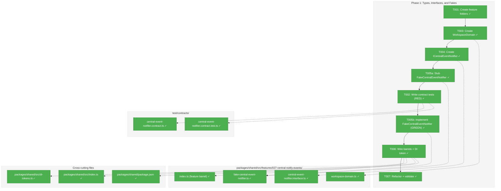
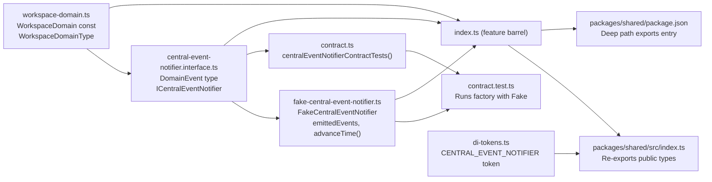
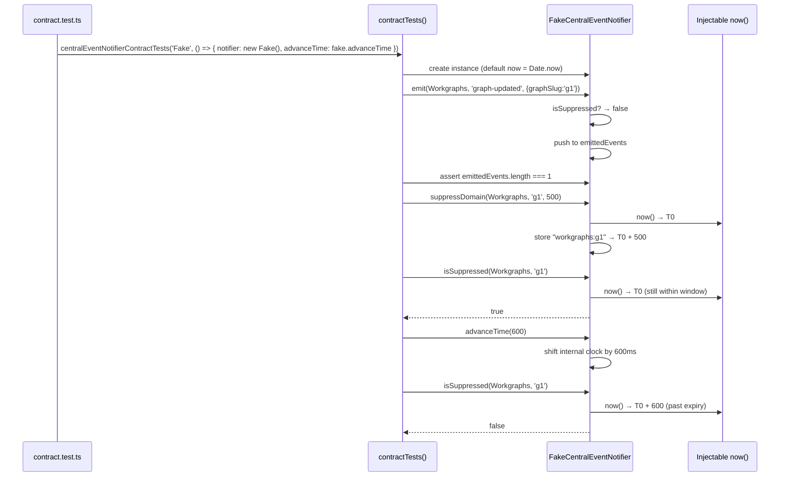

# Phase 1: Types, Interfaces, and Fakes — Tasks & Alignment Brief

**Spec**: [../../central-notify-events-spec.md](../../central-notify-events-spec.md)
**Plan**: [../../central-notify-events-plan.md](../../central-notify-events-plan.md)
**Date**: 2026-02-02
**Phase Slug**: `phase-1-types-interfaces-and-fakes`

---

## Executive Briefing

### Purpose
This phase creates the foundational type system for the central domain event notification system. All subsequent phases depend on these types, interfaces, and fakes — nothing can be wired, tested, or integrated without them. Getting the interface right here prevents churn in Phases 2–4.

### What We're Building
A set of shared types and contracts in `packages/shared`:
- **`WorkspaceDomain`**: A const object (`{ Workgraphs: 'workgraphs', Agents: 'agents' } as const`) that gives workspace data domains a first-class identity, replacing scattered string constants
- **`ICentralEventNotifier`**: The core interface with `emit()`, `suppressDomain()`, and `isSuppressed()` — this is the single entry point for all domain event notifications
- **`DomainEvent`**: A lightweight type describing domain events (domain + eventType + data)
- **`FakeCentralEventNotifier`**: A test double with inspectable state and deterministic time control via `advanceTime(ms)`
- **Contract tests**: A factory-based contract test suite that both the fake (Phase 1) and real service (Phase 2) will pass

### User Value
No direct user-facing change in this phase. This establishes the type foundation that enables Phase 3's end-to-end feature: automatic UI refresh with toast when external tools modify workgraph files.

### Example
```typescript
// After Phase 1, consumers can write:
import { WorkspaceDomain } from '@chainglass/shared';
import type { ICentralEventNotifier, DomainEvent } from '@chainglass/shared';

// WorkspaceDomain.Workgraphs === 'workgraphs'
// WorkspaceDomain.Agents === 'agents'

// Interface contract:
const notifier: ICentralEventNotifier = /* ... */;
notifier.emit(WorkspaceDomain.Workgraphs, 'graph-updated', { graphSlug: 'my-graph' });
notifier.suppressDomain(WorkspaceDomain.Workgraphs, 'my-graph', 500);
notifier.isSuppressed(WorkspaceDomain.Workgraphs, 'my-graph'); // true within 500ms
```

---

## Objectives & Scope

### Objective
Define the domain event model types, `ICentralEventNotifier` interface, and `FakeCentralEventNotifier` with contract tests — all in `packages/shared`. Establish barrel exports and DI token so Phases 2–4 can consume without barrel rewiring.

**Behavior checklist**:
- [x] `WorkspaceDomain` const has `Workgraphs` and `Agents` members (AC-01 partial)
- [x] `ICentralEventNotifier` interface defines `emit()`, `suppressDomain()`, `isSuppressed()` (AC-02 partial)
- [x] `FakeCentralEventNotifier` passes all contract tests (AC-02, AC-12)
- [x] All contract tests have Test Doc comments
- [x] DI token `CENTRAL_EVENT_NOTIFIER` added to `WORKSPACE_DI_TOKENS`
- [x] `pnpm build` and `pnpm test` pass (AC-11)

### Goals

- ✅ Create `WorkspaceDomain` const object and `WorkspaceDomainType` type
- ✅ Create `ICentralEventNotifier` interface with `emit()`, `suppressDomain()`, `isSuppressed()`
- ✅ Create `DomainEvent` type for structured event data
- ✅ Create `FakeCentralEventNotifier` with inspectable state and `advanceTime(ms)`
- ✅ Create contract test factory for `ICentralEventNotifier`
- ✅ Wire feature barrel, shared barrel re-export, `package.json` exports map, and DI token
- ✅ Validate full build + test suite passes

### Non-Goals

- ❌ Service implementation (`CentralEventNotifierService`) — Phase 2
- ❌ DI registration of services — Phase 2
- ❌ Watcher wiring or adapter implementations — Phase 2/3
- ❌ Factory function for retrieving adapters by domain name — Phase 2/3 (AC-01 partial deferral)
- ❌ SSE delivery — Phase 2 (AC-02 partial deferral)
- ❌ Any API route changes or UI changes — Phase 3
- ❌ Deprecation markers — Phase 4
- ❌ Adding additional domains beyond `Workgraphs` and `Agents`

---

## Flight Plan

### Summary Table

| File | Action | Origin | Modified By | Recommendation |
|------|--------|--------|-------------|----------------|
| `packages/shared/src/features/027-central-notify-events/` (dir) | Create | Plan 027 | — | keep-as-is |
| `apps/web/src/features/027-central-notify-events/` (dir) | Create | Plan 027 | — | keep-as-is |
| `packages/shared/src/features/027-central-notify-events/workspace-domain.ts` | Create | Plan 027 | — | keep-as-is |
| `packages/shared/src/features/027-central-notify-events/central-event-notifier.interface.ts` | Create | Plan 027 | — | keep-as-is |
| `packages/shared/src/features/027-central-notify-events/fake-central-event-notifier.ts` | Create | Plan 027 | — | keep-as-is |
| `packages/shared/src/features/027-central-notify-events/index.ts` | Create | Plan 027 | — | keep-as-is |
| `packages/shared/src/di-tokens.ts` | Modify | Plan 004 | Plans 007,010,014,016–019,021,023 | keep-as-is |
| `packages/shared/src/index.ts` | Modify | Plan 001 | Plans 002,006,007,010,014,016–019 | keep-as-is |
| `packages/shared/package.json` | Modify | Plan 001 | Plans 019 | keep-as-is |
| `test/contracts/central-event-notifier.contract.ts` | Create | Plan 027 | — | keep-as-is |
| `test/contracts/central-event-notifier.contract.test.ts` | Create | Plan 027 | — | keep-as-is |

### Per-File Detail

#### `packages/shared/src/di-tokens.ts`
- **Provenance**: Created Plan 004, modified by 8+ subsequent plans
- **Compliance**: Adding `CENTRAL_EVENT_NOTIFIER: 'ICentralEventNotifier'` to `WORKSPACE_DI_TOKENS` follows PL-13 and ADR-0004 IMP-006

#### `packages/shared/src/index.ts`
- **Provenance**: Created Plan 001, modified by many plans. The 019 feature is NOT re-exported here — it uses `package.json` deep path exports only
- **Compliance**: Plan's test examples use `import { WorkspaceDomain } from '@chainglass/shared'`, requiring main barrel re-export. This is additive and does not conflict with 019 pattern. Both barrel re-export AND `package.json` exports entry will be wired for maximum flexibility

#### `packages/shared/package.json`
- **Provenance**: Created Plan 001, modified by Plan 019 (added deep path export for 019 feature)
- **Compliance**: Must add `"./features/027-central-notify-events"` exports entry following 019 pattern (lines 28-31)
- **Note**: This file was NOT in the original plan's File Placement Manifest but is required per PL-12 and the established 019 convention

### Compliance Check
No violations found. All files follow PlanPak conventions, ADR-0004 (DI token naming), and ADR-0007 (minimal event payloads).

---

## Requirements Traceability

### Coverage Matrix

| AC | Description | Flow Summary | Files in Flow | Tasks | Status |
|----|-------------|--------------|---------------|-------|--------|
| AC-01 (partial) | `WorkspaceDomain` with `Workgraphs` + `Agents` | `workspace-domain.ts` → feature barrel → shared barrel/package.json → consumer | 4 files | T003, T006 | ✅ Complete |
| AC-02 (partial) | `ICentralEventNotifier` interface + fake | interface.ts → fake.ts → feature barrel → shared barrel → contract tests | 7 files | T002, T004, T005, T006 | ✅ Complete |
| AC-11 | All existing tests pass | Additive changes only; `pnpm build` + `pnpm test` in T007 | All existing | T007 | ✅ Complete |
| AC-12 | New code has fakes, no `vi.mock()` | Contract tests use `FakeCentralEventNotifier` directly | 3 files | T002, T005 | ✅ Complete |

### Gaps Found

**GAP-1 (resolved)**: `packages/shared/package.json` was not in the original plan task table. Added to T006 as a fourth file. Required for deep path exports following the 019 convention.

### Orphan Files

| File | Tasks | Assessment |
|------|-------|------------|
| `apps/web/src/features/027-central-notify-events/` (dir) | T001 | Infrastructure — empty directory created now for Phase 2. Valid. |

---

## Architecture Map

### Component Diagram
<!-- Status: grey=pending, orange=in-progress, green=completed, red=blocked -->
<!-- Updated by plan-6 during implementation -->



### Task-to-Component Mapping

<!-- Status: ⬜ Pending | 🟧 In Progress | ✅ Complete | 🔴 Blocked -->

| Task | Component(s) | Files | Status | Comment |
|------|-------------|-------|--------|---------|
| T001 | Feature directories | `packages/shared/src/features/027-*/`, `apps/web/src/features/027-*/` | ✅ Complete | Create PlanPak feature folder structure |
| T002 | Contract tests | `test/contracts/central-event-notifier.contract.ts`, `test/contracts/central-event-notifier.contract.test.ts` | ✅ Complete | TDD RED: 9 fail, 2 pass (C10/C11) |
| T003 | WorkspaceDomain | `packages/shared/src/features/027-*/workspace-domain.ts` | ✅ Complete | Const object + type for domain identity |
| T004 | ICentralEventNotifier | `packages/shared/src/features/027-*/central-event-notifier.interface.ts` | ✅ Complete | Interface + DomainEvent type |
| T005a | Stub FakeCentralEventNotifier | `packages/shared/src/features/027-*/fake-central-event-notifier.ts` | ✅ Complete | Stub enables true TDD RED (DYK-05) |
| T005b | FakeCentralEventNotifier | `packages/shared/src/features/027-*/fake-central-event-notifier.ts` | ✅ Complete | TDD GREEN: 11/11 pass |
| T006 | Barrel exports + DI | feature `index.ts`, shared `index.ts`, `di-tokens.ts`, `package.json` | ✅ Complete | Wire all export paths + DI token |
| T007 | Validation | All above | ✅ Complete | 2722 tests pass, typecheck clean, build clean |

---

## Tasks

| Status | ID | Task | CS | Type | Dependencies | Absolute Path(s) | Validation | Subtasks | Notes |
|--------|------|------|-----|------|--------------|-------------------|------------|----------|-------|
| [x] | T001 | Create PlanPak feature folder structure: `packages/shared/src/features/027-central-notify-events/` and `apps/web/src/features/027-central-notify-events/` | CS-1 | Setup | – | `/home/jak/substrate/027-central-notify-events/packages/shared/src/features/027-central-notify-events/`, `/home/jak/substrate/027-central-notify-events/apps/web/src/features/027-central-notify-events/` | Directories exist | – | plan-scoped; maps to plan task 1.0 |
| [x] | T002 | Write contract test factory `centralEventNotifierContractTests()` and test runner. Factory signature: `createNotifier: () => { notifier: ICentralEventNotifier; advanceTime?: (ms: number) => void }` (DYK-02: time control protocol). Tests cover: `emit()` records event, `suppressDomain()` prevents emission within window, `isSuppressed()` returns false after expiry (conditional on `advanceTime`), multiple domains independent, edge cases (empty data, 0ms duration, exact expiry). Time-sensitive tests (C05) use `describe.runIf(advanceTime)` or guard with `if (!advanceTime) return`. All tests must FAIL (RED). Follow `agent-notifier.contract.ts` pattern | CS-2 | Test | T001 | `/home/jak/substrate/027-central-notify-events/test/contracts/central-event-notifier.contract.ts`, `/home/jak/substrate/027-central-notify-events/test/contracts/central-event-notifier.contract.test.ts` | Tests exist and fail with "not implemented" or import errors; Test Doc on every `it()` block | – | plan-scoped; maps to plan task 1.1. Note: contract.test.ts initially runs only the Fake (Phase 2 adds real). Per DYK-02: factory returns `{ notifier, advanceTime? }` |
| [x] | T003 | Create `WorkspaceDomain` const object and `WorkspaceDomainType` type. Pattern: `const WorkspaceDomain = { Workgraphs: 'workgraphs', Agents: 'agents' } as const; type WorkspaceDomainType = (typeof WorkspaceDomain)[keyof typeof WorkspaceDomain];`. JSDoc on each member: values double as SSE channel names and must match existing channel constants (DYK-03). This is the canonical single source of truth for domain identity — Phase 3/4 will migrate hardcoded channel strings to import from here | CS-1 | Core | T001 | `/home/jak/substrate/027-central-notify-events/packages/shared/src/features/027-central-notify-events/workspace-domain.ts` | `WorkspaceDomain.Workgraphs === 'workgraphs'`, `WorkspaceDomain.Agents === 'agents'`, type exported, JSDoc documents SSE channel name invariant | – | plan-scoped; maps to plan task 1.2. Per DYK-03: values are SSE channel names |
| [x] | T004 | Create `DomainEvent` type and `ICentralEventNotifier` interface. `DomainEvent = { domain: WorkspaceDomainType; eventType: string; data: Record<string, unknown> }` — JSDoc: "Shape of a recorded domain event, used by fakes for test inspection and by integration tests for assertion" (DYK-04). Interface: `emit(domain, eventType, data)`, `suppressDomain(domain, key, durationMs)`, `isSuppressed(domain, key): boolean`. Per Discovery 04. `emit()` JSDoc must state it internally checks suppression — callers never need to call `isSuppressed()` before `emit()` (DYK-01) | CS-2 | Core | T003 | `/home/jak/substrate/027-central-notify-events/packages/shared/src/features/027-central-notify-events/central-event-notifier.interface.ts` | Interface compiles, all three methods typed, JSDoc on each method, `emit()` JSDoc documents internal suppression check, `DomainEvent` JSDoc clarifies its role | – | plan-scoped; maps to plan task 1.3. Per ADR-0007: minimal data payloads. Per DYK-01: emit() owns suppression. Per DYK-04: DomainEvent role clarified |
| [x] | T005a | Create stub `FakeCentralEventNotifier` — implements `ICentralEventNotifier`, all methods throw `new Error('Not implemented')`. Exposes empty `emittedEvents: DomainEvent[]`. This enables T002 contract tests to RUN and FAIL with assertion errors (true TDD RED), not module resolution errors (DYK-05) | CS-1 | Setup | T004 | `/home/jak/substrate/027-central-notify-events/packages/shared/src/features/027-central-notify-events/fake-central-event-notifier.ts` | File exists, class compiles, contract tests from T002 run and FAIL with assertion/throw errors (not import errors) | – | plan-scoped; DYK-05: stub enables true RED phase |
| [x] | T005b | Fill in `FakeCentralEventNotifier` implementation. Exposes `emittedEvents: DomainEvent[]` for inspection. Stores suppressions as `Map<string, number>` of `"domain:key" → expiryTimestamp`. Uses injectable `now()` function (default `Date.now()`) for time source. Exposes `advanceTime(ms)` that shifts the internal clock forward. `emit()` checks `isSuppressed()` before recording (DYK-01). Per Deviation Ledger: no `setTimeout`, only `Date.now()` comparison | CS-2 | Core | T005a, T002 | `/home/jak/substrate/027-central-notify-events/packages/shared/src/features/027-central-notify-events/fake-central-event-notifier.ts` | Fake passes all contract tests from T002 (GREEN). `emittedEvents` inspectable. `advanceTime(ms)` shifts clock deterministically | – | plan-scoped; maps to plan task 1.4 |
| [x] | T006 | Wire barrel exports and DI token: (1) Create feature barrel `index.ts` exporting `WorkspaceDomain`, `WorkspaceDomainType`, `ICentralEventNotifier`, `DomainEvent`, `FakeCentralEventNotifier`. (2) Add re-exports to `packages/shared/src/index.ts` for public types. (3) Add `"./features/027-central-notify-events"` entry to `packages/shared/package.json` exports map (following 019 pattern at lines 28-31). (4) Add `CENTRAL_EVENT_NOTIFIER: 'ICentralEventNotifier'` to `WORKSPACE_DI_TOKENS` in `di-tokens.ts` after `CENTRAL_WATCHER_SERVICE`. Run `pnpm build` to verify | CS-1 | Setup | T005b | `/home/jak/substrate/027-central-notify-events/packages/shared/src/features/027-central-notify-events/index.ts`, `/home/jak/substrate/027-central-notify-events/packages/shared/src/index.ts`, `/home/jak/substrate/027-central-notify-events/packages/shared/src/di-tokens.ts`, `/home/jak/substrate/027-central-notify-events/packages/shared/package.json` | Feature barrel exports all types. Main barrel re-exports key public types. `package.json` has exports map entry. DI token resolvable. `pnpm build` succeeds | – | cross-cutting; maps to plan task 1.5. PL-12: wire barrels before consumers |
| [x] | T007 | Refactor and validate: Run `pnpm typecheck`, `pnpm build`, `pnpm test`. All contract tests pass (GREEN). All 2711+ existing tests pass. Clean up any code quality issues | CS-1 | Validation | T006 | All files from T001–T006 | `pnpm typecheck` clean, `pnpm build` clean, `pnpm test` passes all existing + new tests | – | maps to plan task 1.6 |

---

## Alignment Brief

### Critical Findings Affecting This Phase

| # | Finding | Constraint/Requirement | Tasks |
|---|---------|----------------------|-------|
| Discovery 01 | Phase Ordering and Package Placement | Types in `packages/shared` must compile and export before `apps/web` can import. Feature folders at `packages/shared/src/features/027-central-notify-events/` | T001, T003, T004, T005, T006 |
| Discovery 04 | Central Notifier API with Integrated Debounce | `ICentralEventNotifier` must include `emit()`, `suppressDomain()`, `isSuppressed()`. Debounce via `Map<string, number>` with `Date.now()` comparison | T004, T005 |
| Discovery 06 | Barrel Export Strategy | Four barrel touch points: feature barrel, shared barrel, `package.json` exports map, DI token. PL-12: wire before consumers. PL-11: clear `.tsbuildinfo` if phantom errors | T006 |
| Discovery 07 | Testing Strategy with Existing Fakes | Contract tests for `ICentralEventNotifier` (fake in Phase 1, real in Phase 2). Reuse `FakeSSEBroadcaster` in Phase 2 | T002 |
| Discovery 08 | PlanPak Feature Folder Structure | Two feature folders; cross-package imports via barrel exports only | T001, T006 |
| Deviation Ledger | Timer-based debounce | `FakeCentralEventNotifier` uses injectable `now()` + `advanceTime(ms)`. No `setTimeout` in production or test. `Date.now()` comparison at `isSuppressed()` call time | T005 |

### ADR Decision Constraints

- **ADR-0004**: Decorator-free DI with `useFactory`, child container isolation, token naming convention (`value = interface name`). Constrains: DI token format. Addressed by: T006
- **ADR-0007**: Notification-fetch pattern. SSE carries only domain identifiers (e.g., `{graphSlug}`). Constrains: `DomainEvent.data` type should be `Record<string, unknown>` not rich objects. Addressed by: T004

### PlanPak Placement Rules

- **Plan-scoped**: All new files in `features/027-central-notify-events/` — `workspace-domain.ts`, `central-event-notifier.interface.ts`, `fake-central-event-notifier.ts`, `index.ts`
- **Cross-cutting**: `di-tokens.ts`, `packages/shared/src/index.ts`, `packages/shared/package.json`
- **Plan-scoped tests**: `test/contracts/central-event-notifier.contract.ts`, `test/contracts/central-event-notifier.contract.test.ts`
- Dependency direction: plans → shared (allowed), shared → plans (never)

### Invariants & Guardrails

- No runtime dependencies added (types/interfaces only)
- No `vi.mock()` or `vi.spyOn()` anywhere
- Every `it()` block has a 5-field Test Doc comment
- `emit()` owns suppression enforcement — both fake and real service check `isSuppressed()` internally before recording/broadcasting. Callers (adapters) do NOT need to check `isSuppressed()` before calling `emit()`. This is the single enforcement point (DYK-01)

### Inputs to Read

| File | Purpose |
|------|---------|
| `/home/jak/substrate/027-central-notify-events/packages/shared/src/features/019-agent-manager-refactor/agent-notifier.interface.ts` | Reference pattern for interface design |
| `/home/jak/substrate/027-central-notify-events/packages/shared/src/features/019-agent-manager-refactor/fake-sse-broadcaster.ts` | Reference pattern for fake with inspectable state |
| `/home/jak/substrate/027-central-notify-events/packages/shared/src/features/019-agent-manager-refactor/index.ts` | Reference pattern for feature barrel |
| `/home/jak/substrate/027-central-notify-events/test/contracts/agent-notifier.contract.ts` | Reference pattern for contract test factory |
| `/home/jak/substrate/027-central-notify-events/test/contracts/agent-notifier.contract.test.ts` | Reference pattern for contract test runner |
| `/home/jak/substrate/027-central-notify-events/packages/shared/src/di-tokens.ts` | Add `CENTRAL_EVENT_NOTIFIER` after line 87 |
| `/home/jak/substrate/027-central-notify-events/packages/shared/src/index.ts` | Add re-exports for 027 types |
| `/home/jak/substrate/027-central-notify-events/packages/shared/package.json` | Add exports map entry (lines 28-31 pattern) |

### Visual Alignment Aids

#### Flow Diagram: Type System Dependencies



#### Sequence Diagram: Contract Test Execution



### Test Plan (Full TDD — Fakes Only)

#### Contract Tests (`test/contracts/central-event-notifier.contract.ts`)

| # | Test Name | Rationale | Expected Output |
|---|-----------|-----------|-----------------|
| C01 | `should emit domain events` | Core contract — `emit()` must record/broadcast | `emittedEvents` contains the event |
| C02 | `should suppress events after suppressDomain()` | Debounce contract (AC-07 foundation) | `isSuppressed()` returns `true` within window |
| C03 | `should not suppress events for different keys` | Suppression is per `(domain, key)` pair | `isSuppressed()` returns `false` for other keys |
| C04 | `should not suppress events for different domains` | Cross-domain independence | `isSuppressed()` returns `false` for other domains |
| C05 | `should allow events after suppression expires` | Expiry semantics | After `advanceTime(600)`, `isSuppressed()` returns `false` for 500ms suppression |
| C06 | `should emit with empty data object` | Edge case | `emit()` succeeds, event recorded |
| C07 | `should handle 0ms suppression duration` | Edge case — immediate expiry | `isSuppressed()` returns `false` immediately |
| C08 | `should not emit when suppressed` | Integration of `emit()` + `isSuppressed()` | `emit()` after `suppressDomain()` does NOT add to `emittedEvents` |
| C09 | `should track multiple emissions in order` | Ordering invariant | `emittedEvents` preserves insertion order |
| C10 | `WorkspaceDomain.Workgraphs should equal 'workgraphs'` | SSE channel name invariant (DYK-03) | Exact string match — prevents silent channel mismatch |
| C11 | `WorkspaceDomain.Agents should equal 'agents'` | SSE channel name invariant (DYK-03) | Exact string match |

#### Contract Test Runner (`test/contracts/central-event-notifier.contract.test.ts`)

Phase 1: Runs factory against `FakeCentralEventNotifier` only.
Phase 2: Will add `CentralEventNotifierService` (real) to the runner.

### Step-by-Step Implementation Outline

1. **T001**: `mkdir -p` for both feature directories
2. **T003**: Write `workspace-domain.ts` — const object + type export, JSDoc documents SSE channel name invariant (DYK-03)
3. **T004**: Write `central-event-notifier.interface.ts` — `DomainEvent` type (with role JSDoc, DYK-04) + `ICentralEventNotifier` interface (with `emit()` suppression JSDoc, DYK-01)
4. **T005a**: Write stub `FakeCentralEventNotifier` — all methods throw `new Error('Not implemented')`. This enables true TDD RED (DYK-05)
5. **T002**: Write contract test factory + runner. Factory returns `{ notifier, advanceTime? }` (DYK-02). Run tests — they FAIL with assertion/throw errors (RED). Verify failures are meaningful, not import errors
6. **T005b**: Fill in `FakeCentralEventNotifier` — injectable `now()`, `advanceTime(ms)`, `Map<string, number>` suppressions, `emittedEvents: DomainEvent[]`. Run contract tests — all pass (GREEN)
7. **T006**: Wire barrels: (a) feature `index.ts`, (b) `packages/shared/src/index.ts` re-exports, (c) `package.json` exports map entry, (d) DI token in `di-tokens.ts`. Run `pnpm build`
8. **T007**: Run `pnpm typecheck`, `pnpm build`, `pnpm test`. Verify all 2711+ existing tests pass. Refactor if needed

### Commands to Run

```bash
# Setup
mkdir -p packages/shared/src/features/027-central-notify-events
mkdir -p apps/web/src/features/027-central-notify-events

# After writing types/interface/fake (T003-T005)
pnpm -F @chainglass/shared build    # Verify types compile

# After wiring barrels (T006)
pnpm build                           # Full monorepo build
pnpm typecheck                       # TypeScript strict check

# Run contract tests only (fast feedback)
pnpm -F @chainglass/shared test -- test/contracts/central-event-notifier.contract.test.ts

# Full validation (T007)
just check                           # lint + typecheck + test
# or individually:
just lint
just typecheck
just test
```

### Risks / Unknowns

| Risk | Severity | Mitigation |
|------|----------|------------|
| Barrel re-export breaks downstream build | Medium | Run `pnpm build` immediately after T006. Clear `.tsbuildinfo` if phantom errors (PL-11) |
| Contract test import path resolution | Low | Use both main barrel and `package.json` deep path exports; verify imports compile |
| `advanceTime()` design doesn't work for contract tests shared with real service | Low | Real service in Phase 2 will use `FakeSSEBroadcaster` for inspection; contract factory takes a creation function that controls time source per implementation |

### Ready Check

- [ ] ADR constraints mapped to tasks: ADR-0004 → T006, ADR-0007 → T004
- [ ] Critical findings addressed: Discovery 01 → T001/T006, Discovery 04 → T004/T005, Discovery 06 → T006, Discovery 07 → T002
- [ ] PlanPak placement verified: all files classified as plan-scoped or cross-cutting
- [ ] No time estimates in any task
- [ ] All tasks have absolute paths
- [ ] Test plan uses fakes only, no `vi.mock()`

---

## Phase Footnote Stubs

_Reserved for plan-6 to add entries during implementation._

| Footnote | Task | Description | Date |
|----------|------|-------------|------|
| | | | |

---

## Evidence Artifacts

- **Execution log**: `docs/plans/027-central-notify-events/tasks/phase-1-types-interfaces-and-fakes/execution.log.md` (created by plan-6)
- **Contract test output**: Captured in execution log
- **Build output**: Captured in execution log

---

## Discoveries & Learnings

_Populated during implementation by plan-6. Log anything of interest to your future self._

| Date | Task | Type | Discovery | Resolution | References |
|------|------|------|-----------|------------|------------|
| 2026-02-02 | T002 | decision | DYK-02: Contract test factory needs a time control protocol. C05 ("should allow events after suppression expires") requires `advanceTime(ms)` which only the fake supports. Rather than defer to Phase 2, design the factory signature now: `createNotifier: () => { notifier: ICentralEventNotifier; advanceTime?: (ms: number) => void }`. Time-sensitive tests guard on `advanceTime` availability. Phase 2 real service returns `{ notifier, advanceTime: undefined }` and time-sensitive tests gracefully skip. | Resolved: Option A (time control protocol). Factory returns `{ notifier, advanceTime? }`. C05 conditionally runs. Both implementations participate in the full contract without sleeping or injecting clocks into production code. Supersedes original "deferred to Phase 2" decision. | DYK Insight #2, Requirements flow analysis §Design Finding |
| 2026-02-02 | T002 | decision | DYK-03: `WorkspaceDomain` values are SSE channel names. `WorkspaceDomain.Workgraphs` MUST equal `'workgraphs'` exactly — it matches the hardcoded `WORKGRAPHS_CHANNEL` in `sse-broadcast.ts:13` and the client subscription path `/api/events/workgraphs` in `use-workgraph-sse.ts`. A typo means silent failure (events go to wrong channel, client never receives them). Added contract tests C10/C11 as assertions. Phase 3/4 should migrate all hardcoded channel strings (`WORKGRAPHS_CHANNEL`, `'workgraphs'` in `use-workgraph-sse.ts`) to import from `WorkspaceDomain` — making it the single source of truth for domain/channel identity. | Resolved: Add C10/C11 assertion tests in Phase 1. Phase 3/4 migrates existing hardcoded strings to use `WorkspaceDomain.Workgraphs` instead of independent literals. | DYK Insight #3, Discovery 05 |
| 2026-02-02 | T005a | decision | DYK-05: TDD RED phase requires a stub, not a missing file. If the contract test runner imports a non-existent `FakeCentralEventNotifier`, Vitest reports a module resolution error — not a test failure. Tests never execute, so you can't verify assertions are correct. Split T005 into T005a (stub with `throw new Error('Not implemented')`) and T005b (real implementation). T005a → T002 (RED) → T005b (GREEN) gives a proper RED-GREEN cycle. | Resolved: Split T005 into stub (T005a) + implementation (T005b). Sequence: T004 → T005a → T002 (RED) → T005b (GREEN) → T006. | DYK Insight #5 |
| 2026-02-02 | T004 | insight | DYK-04: `DomainEvent` type is primarily a test inspection shape, not a domain transfer object. `emit()` takes three separate args (matching `ISSEBroadcaster.broadcast()` pattern), not a `DomainEvent` object. The type exists to name the shape of `FakeCentralEventNotifier.emittedEvents` entries and for integration test assertions. JSDoc should clarify this role to prevent future developers from treating it as a first-class message type to construct and pass around. | Keep exported with clarifying JSDoc. No interface change needed. | DYK Insight #4 |
| 2026-02-02 | T004 | decision | DYK-01: `emit()` owns suppression enforcement. Callers (adapters) never need to check `isSuppressed()` before calling `emit()`. The notifier is the single enforcement point. This simplifies adapter code and prevents future adapters from accidentally bypassing suppression. `isSuppressed()` remains public for observability/debugging but is not required before `emit()`. | Option A chosen: callee responsibility. `emit()` JSDoc must document this. Contract test C08 stays as a core contract. Phase 3 adapter becomes simpler (just calls `emit()` for every watcher event). | DYK Insight #1 |

**Types**: `gotcha` | `research-needed` | `unexpected-behavior` | `workaround` | `decision` | `debt` | `insight`

**What to log**:
- Things that didn't work as expected
- External research that was required
- Implementation troubles and how they were resolved
- Gotchas and edge cases discovered
- Decisions made during implementation
- Technical debt introduced (and why)
- Insights that future phases should know about

_See also: `execution.log.md` for detailed narrative._

---

## Critical Insights Discussion

**Session**: 2026-02-02
**Context**: Phase 1 Tasks & Alignment Brief — Central Domain Event Notification System
**Analyst**: AI Clarity Agent
**Reviewer**: jak
**Format**: Water Cooler Conversation (5 Critical Insights)

### Insight 1: Suppression Enforcement Ownership (DYK-01)

**Did you know**: `emit()` checking `isSuppressed()` internally means the interface has two possible behavioral contracts — caller vs callee responsibility for suppression. The plan mixed both.

**Implications**:
- Double-checking creates confusion about where suppression "really" lives
- Future adapters might forget the external check if it's supposed to be caller-owned
- Contract test C08 is either a core contract or an adapter concern depending on the answer

**Options Considered**:
- Option A: emit() owns suppression (callee responsibility) — single enforcement point
- Option B: Caller owns suppression — emit() is pure pass-through
- Option C: Belt and suspenders — keep both checks

**AI Recommendation**: Option A — centralized enforcement in `emit()`
- Reasoning: Suppression map lives inside the notifier, so the notifier should enforce it. Prevents future adapters from bypassing suppression.

**Discussion Summary**: Quick agreement — centralized enforcement is cleaner.

**Decision**: `emit()` owns suppression. Callers never need to call `isSuppressed()` before `emit()`. `isSuppressed()` remains public for observability.

**Action Items**:
- [x] Updated T004 with DYK-01 JSDoc requirement
- [x] Updated Invariants section
- [x] Added DYK-01 to Discoveries table

**Affects**: T004 (interface JSDoc), T005b (fake behavior), Phase 3 (adapter simplification)

---

### Insight 2: Contract Test Factory Time Control Protocol (DYK-02)

**Did you know**: The contract test factory signature `createNotifier: () => ICentralEventNotifier` won't survive Phase 2 — time-sensitive tests can't run against the real service without a time control mechanism.

**Implications**:
- C05 (expiry test) requires `advanceTime()` which only the fake has
- Phase 2 would need to either skip C05, inject clocks into production, or sleep in tests
- Designing the protocol now costs nothing; retrofitting it later means refactoring contracts

**Options Considered**:
- Option A: Time control protocol — factory returns `{ notifier, advanceTime? }`
- Option B: Split time tests out of shared contract
- Option C: Defer to Phase 2

**AI Recommendation**: Option A — design it now
- Reasoning: Trivial cost (one type alias + conditional check), prevents Phase 2 from refactoring contracts.

**Discussion Summary**: Quick agreement — forward-compatible design is worth the tiny cost.

**Decision**: Factory returns `{ notifier: ICentralEventNotifier; advanceTime?: (ms: number) => void }`. Time-sensitive tests guard on `advanceTime` availability.

**Action Items**:
- [x] Updated T002 with new factory signature
- [x] Superseded deferred decision in Discoveries table
- [x] Updated sequence diagram

**Affects**: T002 (factory signature), Phase 2 (clean integration)

---

### Insight 3: WorkspaceDomain Values Are SSE Channel Names (DYK-03)

**Did you know**: `WorkspaceDomain.Workgraphs` must exactly equal `'workgraphs'` — it matches the hardcoded SSE channel name in `sse-broadcast.ts` and the client subscription path. A typo means silent failure.

**Implications**:
- Three-phase gap between creating the const (Phase 1) and using it for SSE (Phase 3)
- No automated protection against string mismatch
- Existing code has independent string literals that should all reference the same source

**Options Considered**:
- Option A: Add string-literal assertions to contract tests + make WorkspaceDomain the canonical source
- Option B: JSDoc comment only
- Option C: Import from sse-broadcast.ts (violates dependency direction)

**AI Recommendation**: Option A — assertions + single source of truth
- Reasoning: Trivial assertions catch the most likely failure mode; centralizing is the whole point.

**Discussion Summary**: User agreed and extended the decision — WorkspaceDomain should be THE central location, and all existing hardcoded channel strings should migrate to use it.

**Decision**: Add C10/C11 assertions. Phase 3/4 migrates existing hardcoded strings to import from `WorkspaceDomain`.

**Action Items**:
- [x] Added C10/C11 to test plan
- [x] Updated T003 with JSDoc requirement
- [x] Added DYK-03 with Phase 3/4 migration note

**Affects**: T002 (new tests), T003 (JSDoc), Phase 3/4 (string migration)

---

### Insight 4: DomainEvent Type Role Clarification (DYK-04)

**Did you know**: `DomainEvent` is only used as the element type of `FakeCentralEventNotifier.emittedEvents` — it's a test inspection shape, not a domain transfer object. `emit()` takes three separate args.

**Implications**:
- Future developers might construct `DomainEvent` objects thinking they should pass them around
- The type is useful for naming the shape but its role should be clear

**Options Considered**:
- Option A: Keep exported with clarifying JSDoc
- Option B: Make internal to fake only
- Option C: Redesign `emit()` to accept `DomainEvent`

**AI Recommendation**: Option A — export with clear JSDoc
- Reasoning: Useful for readability and test assertions. JSDoc prevents misuse.

**Discussion Summary**: Quick agreement.

**Decision**: Export `DomainEvent` with JSDoc clarifying it's a recorded event shape for test inspection.

**Action Items**:
- [x] Updated T004 with DYK-04 JSDoc requirement
- [x] Added DYK-04 to Discoveries table

**Affects**: T004 (JSDoc)

---

### Insight 5: TDD RED Phase Requires a Stub (DYK-05)

**Did you know**: The TDD RED step wouldn't actually be "red" — it would be a module resolution error. Tests that can't import `FakeCentralEventNotifier` never execute, so you can't verify assertions are correct.

**Implications**:
- Module errors mask test quality issues (typos in assertions go undetected)
- The RED phase exists to prove tests assert the right things
- Proper RED needs the class to exist but not work

**Options Considered**:
- Option A: Write stub first (all methods throw), then tests (RED), then real implementation (GREEN)
- Option B: Accept import errors as "red enough"
- Option C: Write tests and fake together per-test

**AI Recommendation**: Option A — stub enables true RED
- Reasoning: Writing a stub takes seconds and gives genuine RED where every assertion executes and fails.

**Discussion Summary**: Quick agreement — proper TDD cycle is worth the micro-step.

**Decision**: Split T005 into T005a (stub) and T005b (implementation). Sequence: T005a → T002 (RED) → T005b (GREEN).

**Action Items**:
- [x] Split T005 into T005a and T005b in task table
- [x] Updated architecture diagram
- [x] Updated step-by-step outline
- [x] Fixed dependency chain (T006 depends on T005b)
- [x] Added DYK-05 to Discoveries table

**Affects**: T005a, T005b, T002, T006 (dependencies), architecture diagram

---

## Session Summary

**Insights Surfaced**: 5 critical insights identified and discussed
**Decisions Made**: 5 decisions reached
**Action Items Created**: 0 remaining (all applied inline)
**Areas Updated**:
- Task table: T002, T003, T004, T005→T005a+T005b, T006 dependencies
- Test plan: C10, C11 added
- Architecture diagram: T005a/T005b split
- Step-by-step outline: resequenced with DYK references
- Invariants: suppression ownership clarified
- Discoveries table: 5 DYK entries added

**Shared Understanding Achieved**: ✓

**Confidence Level**: High — all design ambiguities in Phase 1 are resolved. The interface contract, factory protocol, and TDD sequence are well-defined.

**Next Steps**: Run `/plan-6-implement-phase` for Phase 1.

---

## Directory Layout

```
docs/plans/027-central-notify-events/
  ├── central-notify-events-spec.md
  ├── central-notify-events-plan.md
  ├── research-dossier.md
  └── tasks/
      └── phase-1-types-interfaces-and-fakes/
          ├── tasks.md              # This file
          └── execution.log.md      # Created by /plan-6
```
