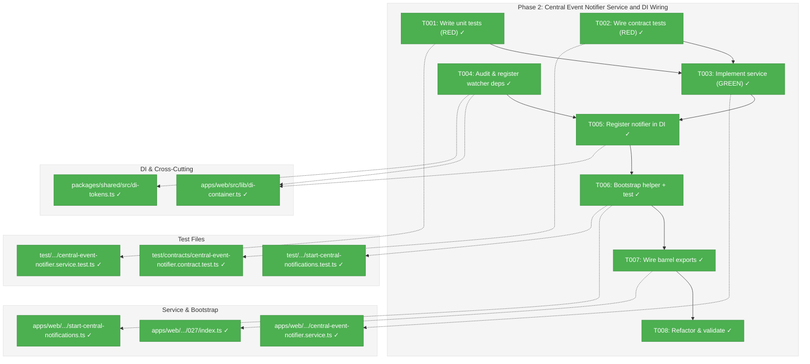
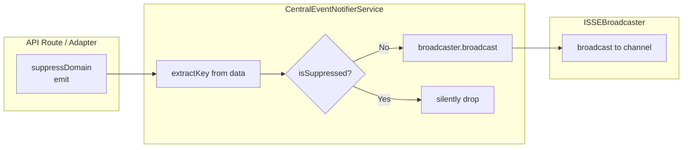
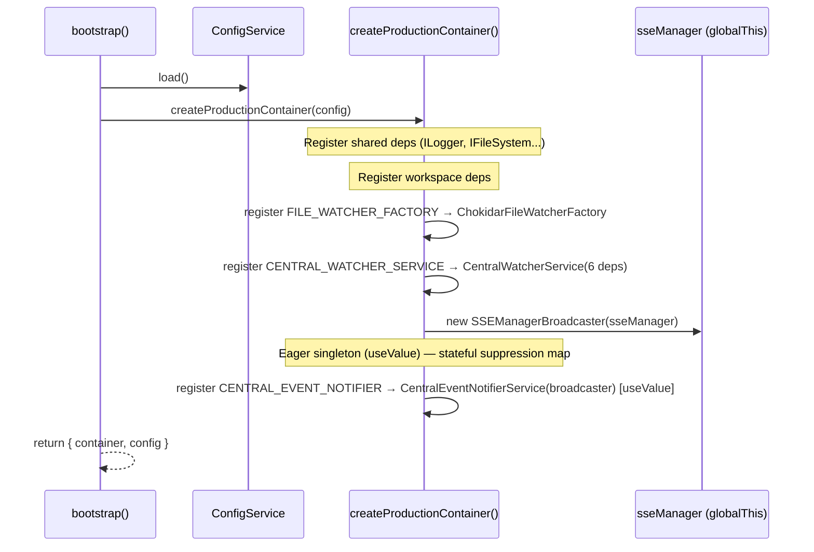

# Phase 2: Central Event Notifier Service and DI Wiring — Tasks & Alignment Brief

**Spec**: [../../central-notify-events-spec.md](../../central-notify-events-spec.md)
**Plan**: [../../central-notify-events-plan.md](../../central-notify-events-plan.md)
**Date**: 2026-02-02

---

## Executive Briefing

### Purpose
This phase creates the real `CentralEventNotifierService` that wraps `ISSEBroadcaster` with domain-aware routing and time-based suppression, registers it and all `CentralWatcherService` dependencies in the web DI container, and prepares the async bootstrap helper for Phase 3 watcher activation.

### What We're Building
A `CentralEventNotifierService` class that:
- Implements `ICentralEventNotifier` (defined in Phase 1)
- Delegates `emit()` to `ISSEBroadcaster.broadcast()` with `WorkspaceDomain` values as channel names
- Manages suppression via `Map<string, number>` with `Date.now()` comparison (no setTimeout)
- Passes all 11 contract tests from Phase 1 (with time-sensitive C05 skipped)

Plus DI wiring that:
- Registers `CentralEventNotifierService` in production container, `FakeCentralEventNotifier` in test container
- Registers all 6 `CentralWatcherService` constructor dependencies (adding missing `IFileWatcherFactory`)
- Registers `CentralWatcherService` itself (construction only — Phase 3 starts it)

Plus a bootstrap helper `startCentralNotificationSystem()` that:
- Resolves watcher + notifier from DI via `getContainer()`
- Gates with `globalThis` flag to prevent double-start across HMR
- Phase 3 will call this from `instrumentation.ts`

### User Value
No direct user-facing change. This phase builds the production infrastructure that Phase 3 will activate to deliver automatic UI refresh when workgraphs change externally.

### Example
```typescript
// Phase 2 delivers:
const notifier = container.resolve<ICentralEventNotifier>(WORKSPACE_DI_TOKENS.CENTRAL_EVENT_NOTIFIER);
notifier.emit(WorkspaceDomain.Workgraphs, 'graph-updated', { graphSlug: 'my-graph' });
// → broadcaster.broadcast('workgraphs', 'graph-updated', { graphSlug: 'my-graph' })

notifier.suppressDomain(WorkspaceDomain.Workgraphs, 'my-graph', 500);
notifier.emit(WorkspaceDomain.Workgraphs, 'graph-updated', { graphSlug: 'my-graph' });
// → silently dropped (within suppression window)
```

---

## Objectives & Scope

### Objective
Implement `CentralEventNotifierService`, register it in DI alongside `CentralWatcherService`, and prepare the bootstrap helper — satisfying AC-02 (service passes contract tests), AC-03 (DI registration), AC-04 partial (watcher registered but not started), AC-07 partial (suppression works), AC-11 (all tests pass), AC-12 (ADR-0004 compliance).

### Behavior Checklist
- [x] `CentralEventNotifierService.emit()` calls `ISSEBroadcaster.broadcast()` with domain as channel
- [x] `CentralEventNotifierService.suppressDomain()` sets time-bounded suppression
- [x] `CentralEventNotifierService.emit()` silently drops suppressed events (DYK-01)
- [x] `CentralEventNotifierService.isSuppressed()` returns false after expiry
- [x] `CentralEventNotifierService` passes all 11 contract tests (C05 skipped for real service; C01/C06/C08/C09 vacuous — companion B01-B04 provide actual broadcast assertions per DYK Insight #5)
- [x] `CentralWatcherService` resolvable from DI without throwing
- [x] `startCentralNotificationSystem()` is idempotent (double-call safe)
- [x] DI registrations use `useFactory` pattern (ADR-0004), except `CentralEventNotifierService` which uses `useValue` singleton (DYK Insight #2 — stateful suppression map requires identity stability)

### Goals

- ✅ Implement `CentralEventNotifierService` with SSE broadcasting and suppression
- ✅ Pass all contract tests from Phase 1 against the real service
- ✅ Register `CentralEventNotifierService` in production and test DI containers
- ✅ Audit and register all 6 `CentralWatcherService` dependencies
- ✅ Register `CentralWatcherService` in DI (construction only)
- ✅ Write `startCentralNotificationSystem()` bootstrap helper with `globalThis` gating
- ✅ Wire `apps/web` feature barrel exports

### Non-Goals

- ❌ Starting the watcher (Phase 3 — `instrumentation.ts` calls the bootstrap helper)
- ❌ Wiring adapters to the watcher (Phase 3 — `WorkgraphDomainEventAdapter`)
- ❌ Adding `suppressDomain()` calls to API routes (Phase 3)
- ❌ Toast UI notifications (Phase 3)
- ❌ Deprecation markers (Phase 4)
- ❌ `registerCentralNotificationServices()` module function (not warranted per ADR-0009 — services are apps/web-local, matching `AgentNotifierService` inline registration pattern)
- ❌ Refactoring contract test factory to use assertion callbacks (current `instanceof` branching is acceptable; the real service runner in T002 adds its own assertion blocks)

---

## Flight Plan

### Summary Table

| File | Action | Origin | Modified By | Recommendation |
|------|--------|--------|-------------|----------------|
| `apps/web/src/features/027-central-notify-events/central-event-notifier.service.ts` | Create | Plan 027 P2 | — | keep-as-is |
| `apps/web/src/features/027-central-notify-events/start-central-notifications.ts` | Create | Plan 027 P2 | — | keep-as-is |
| `apps/web/src/features/027-central-notify-events/index.ts` | Create | Plan 027 P2 | — | keep-as-is |
| `test/unit/web/027-central-notify-events/central-event-notifier.service.test.ts` | Create | Plan 027 P2 | — | keep-as-is |
| `test/unit/web/027-central-notify-events/start-central-notifications.test.ts` | Create | Plan 027 P2 | — | keep-as-is |
| `apps/web/src/lib/di-container.ts` | Modify | Plan 001 | Plans 014,018,019,022,027 | cross-plan-edit |
| `packages/shared/src/di-tokens.ts` | Modify | Plan 004 | Plans 019,023,027-P1 | cross-plan-edit |
| `test/contracts/central-event-notifier.contract.test.ts` | Modify | Plan 027 P1 | Plan 027 P2 | keep-as-is |

### Per-File Detail

#### `apps/web/src/features/027-central-notify-events/central-event-notifier.service.ts` (CREATE)
- **Duplication check**: Closest analog is `AgentNotifierService` — intentionally separate; this is the domain-agnostic replacement (AgentNotifierService marked for deprecation in Phase 4).
- **Compliance**: ADR-0004 (constructor injection of `ISSEBroadcaster` interface), ADR-0007 (minimal SSE payloads). Follows `AgentNotifierService` structural pattern.

#### `apps/web/src/lib/di-container.ts` (MODIFY)
- **Provenance**: Created Plan 001, modified by Plans 014/018/019/022. Plan 027 adds 3 new registrations.
- **Compliance**: Must use `useFactory` (ADR-0004). `CentralWatcherService` has 6 deps — all must be resolvable (Discovery 03).
- **Note**: Logger token `DI_TOKENS.LOGGER` and `SHARED_DI_TOKENS.LOGGER` both resolve to `'ILogger'` string — functionally identical, no issue.

### Compliance Summary

| Severity | File | Rule/ADR | Issue | Suggested Fix |
|----------|------|----------|-------|---------------|
| Medium | `contract.test.ts` | — | Contract tests C01/C06/C08/C09 use `instanceof FakeCentralEventNotifier` — real service branch has no assertions | T002 will add `CentralEventNotifierService`-specific assertion blocks using `FakeSSEBroadcaster.getBroadcasts()` in a separate describe block |
| Low | Plan test examples | — | Plan examples reference `broadcaster.broadcasts` but API is `getBroadcasts()` | Use `getBroadcasts()` in actual implementation |

---

## Requirements Traceability

### Coverage Matrix

| AC | Description | Flow Summary | Files in Flow | Tasks | Status |
|----|-------------|--------------|---------------|-------|--------|
| AC-02 | Service passes contract tests | contract.test.ts → contract.ts factory → CentralEventNotifierService → FakeSSEBroadcaster | 6 (3 read-only Phase 1) | T001, T002, T003 | ✅ Verified |
| AC-03 | Service in web DI | bootstrap.ts → createProductionContainer() → SSEManagerBroadcaster(sseManager) → CentralEventNotifierService | 5 (3 read-only) | T003, T005 | ✅ Verified |
| AC-04 partial | Watcher in web DI (not started) | createProductionContainer() → ChokidarFileWatcherFactory + 5 existing deps → CentralWatcherService | 7 (5 read-only) | T004 | ✅ Verified |
| AC-07 partial | Suppression prevents emission | emit() → extractSuppressionKey(data) → isSuppressed() → Map check → drop or broadcast | 3 (1 read-only) | T001, T003 | ✅ Verified |
| AC-11 | All tests pass | pnpm test — 2749 passed (was 2722, +27 new) | All | T008 | ✅ Verified |
| AC-12 | ADR-0004 compliance | useFactory in di-container.ts (useValue exception for CentralEventNotifierService — justified) | 1 | T004, T005 | ✅ Verified |

### Gaps Found

No gaps — all acceptance criteria have complete file coverage.

**Verified potential gap areas:**
- `FILE_WATCHER_FACTORY` token: Explicitly addressed by T004
- `ChokidarFileWatcherFactory`, `FakeCentralWatcherService`, `FakeFileWatcherFactory`: All confirmed exported from `@chainglass/workflow` barrel (`packages/workflow/src/index.ts` lines 384-402)
- `registryPath` computation: `di-container.ts` already imports `os` and `path` — T004 factory computes `path.join(os.homedir(), '.config', 'chainglass', 'workspaces.json')`
- `SSEManagerBroadcaster` + `sseManager`: Already imported in `di-container.ts` for AgentNotifierService — T005 reuses
- `getContainer()`: Already exported from `bootstrap-singleton.ts` — T006 imports

### Orphan Files
| File | Tasks | Assessment |
|------|-------|------------|
| `start-central-notifications.ts` | T006 | Valid infrastructure — prepared for Phase 3 `instrumentation.ts` invocation. Not called in Phase 2 (correct per non-goals). |
| `start-central-notifications.test.ts` | T006 | Valid test infrastructure — validates `globalThis` gating before Phase 3 wiring. |
| `index.ts` (apps/web barrel) | T007 | Valid barrel — PL-12 requires wiring before consumers. Phase 3 imports from this barrel. |

### Flow Details

#### AC-03 + AC-04: DI Registration Flow

```
createProductionContainer(config):
  [EXISTING] IWorkspaceRegistryAdapter → WorkspaceRegistryAdapter
  [EXISTING] IGitWorktreeResolver → GitWorktreeResolver
  [EXISTING] IFileSystem → NodeFileSystemAdapter
  [EXISTING] ILogger → PinoLoggerAdapter
  [NEW T004] IFileWatcherFactory → ChokidarFileWatcherFactory
  [NEW T004] ICentralWatcherService → CentralWatcherService(6 deps)
  [NEW T005] ICentralEventNotifier → CentralEventNotifierService(SSEManagerBroadcaster)

createTestContainer():
  [NEW T004] IFileWatcherFactory → FakeFileWatcherFactory
  [NEW T004] ICentralWatcherService → FakeCentralWatcherService
  [NEW T005] ICentralEventNotifier → FakeCentralEventNotifier
```

#### AC-07: Suppression Flow (within CentralEventNotifierService)

```
suppressDomain('workgraphs', 'my-graph', 500)
  → Map.set("workgraphs:my-graph", Date.now() + 500)

emit('workgraphs', 'graph-updated', { graphSlug: 'my-graph' })
  → extractKey({ graphSlug: 'my-graph' }) → 'my-graph'
  → isSuppressed('workgraphs', 'my-graph') → true (within window)
  → return (silently dropped, no broadcast)
```

---

## Architecture Map

### Component Diagram
<!-- Status: grey=pending, orange=in-progress, green=completed, red=blocked -->
<!-- Updated by plan-6 during implementation -->



### Task-to-Component Mapping

<!-- Status: ⬜ Pending | 🟧 In Progress | ✅ Complete | 🔴 Blocked -->

| Task | Component(s) | Files | Status | Comment |
|------|-------------|-------|--------|---------|
| T001 | Unit Tests (RED) | `test/unit/web/027-central-notify-events/central-event-notifier.service.test.ts` | ✅ Complete | Tests emit→broadcast, suppression, expiry using FakeSSEBroadcaster |
| T002 | Contract Tests (RED) | `test/contracts/central-event-notifier.contract.test.ts` | ✅ Complete | Wire real service into contract factory; add broadcaster assertion blocks |
| T003 | Service Implementation (GREEN) | `apps/web/src/features/027-central-notify-events/central-event-notifier.service.ts` | ✅ Complete | Implement CentralEventNotifierService with suppression |
| T004 | DI Dependencies | `apps/web/src/lib/di-container.ts`, `packages/shared/src/di-tokens.ts` | ✅ Complete | Add FILE_WATCHER_FACTORY token; register all CentralWatcherService deps |
| T005 | DI Registration | `apps/web/src/lib/di-container.ts` | ✅ Complete | Register CentralEventNotifierService (prod + test) |
| T006 | Bootstrap Helper | `apps/web/src/features/027-central-notify-events/start-central-notifications.ts`, `test/unit/web/027-central-notify-events/start-central-notifications.test.ts` | ✅ Complete | Async bootstrap with globalThis gating; idempotency test |
| T007 | Barrel Exports | `apps/web/src/features/027-central-notify-events/index.ts` | ✅ Complete | Export service + bootstrap from feature barrel |
| T008 | Validation | All files | ✅ Complete | Typecheck, build, test suite |

---

## Tasks

| Status | ID | Task | CS | Type | Dependencies | Absolute Path(s) | Validation | Subtasks | Notes |
|--------|------|------|-----|------|-------------|-------------------|------------|----------|-------|
| [x] | T001 | Write unit tests for `CentralEventNotifierService` (RED). Tests: (1) `emit()` calls `broadcaster.broadcast()` with domain as channel, eventType, and data; (2) `suppressDomain()` prevents `emit()` for same key within window; (3) expiry allows subsequent events; (4) different keys/domains independent; (5) `extractKey()` convention matches fake. Use `FakeSSEBroadcaster` — assert via `getBroadcasts()` | CS-2 | Test | – | `/home/jak/substrate/027-central-notify-events/test/unit/web/027-central-notify-events/central-event-notifier.service.test.ts` | All tests fail (RED) — service not yet implemented | – | Plan 2.1. Uses `FakeSSEBroadcaster.getBroadcasts()` API |
| [x] | T002 | Wire contract tests against `CentralEventNotifierService` (RED). Add second `centralEventNotifierContractTests()` call in the runner, passing `CentralEventNotifierService(new FakeSSEBroadcaster())`. The contract factory's `instanceof FakeCentralEventNotifier` branches will be skipped — add a companion describe block with broadcaster-based assertions (B01-B04) for C01/C06/C08/C09 to verify emit→broadcast mapping. **DYK Insight #5**: Document clearly that C01/C06/C08/C09 are vacuous for real service (pass with no assertions); B01-B04 companion tests provide the actual broadcast verification | CS-2 | Test | – | `/home/jak/substrate/027-central-notify-events/test/contracts/central-event-notifier.contract.test.ts` | All contract tests fail (RED) — service not yet implemented. Broadcaster assertions B01-B04 cover the C01/C06/C08/C09 gap | – | Plan 2.2. `advanceTime` is `undefined` for real service (C05 skipped). 7 of 11 contract tests make real assertions; 4 are vacuous (covered by B01-B04) |
| [x] | T003 | Implement `CentralEventNotifierService`. Constructor takes `ISSEBroadcaster`. `emit()` uses shared `extractSuppressionKey()` from `packages/shared` (DYK Insight #1), checks `isSuppressed()`, then calls `broadcaster.broadcast(domain, eventType, data)`. `suppressDomain()` stores `"domain:key" → Date.now() + durationMs`. `isSuppressed()` with lazy cleanup. No `setTimeout` — only `Date.now()` comparison. **Also**: (a) Create `extract-suppression-key.ts` in `packages/shared/src/features/027-central-notify-events/` with the shared pure function, (b) refactor `FakeCentralEventNotifier` to import it, (c) add barrel export, (d) verify all Phase 1 contract tests still pass | CS-3 | Core | T001, T002 | `/home/jak/substrate/027-central-notify-events/apps/web/src/features/027-central-notify-events/central-event-notifier.service.ts`, `/home/jak/substrate/027-central-notify-events/packages/shared/src/features/027-central-notify-events/extract-suppression-key.ts` | All T001 unit tests pass (GREEN). All T002 contract tests pass (GREEN). Phase 1 contract tests still pass after fake refactor | – | Plan 2.3. Follows `AgentNotifierService` structural pattern. Per DYK-01: emit owns suppression. Per DYK Insight #1: shared extractSuppressionKey() eliminates divergence risk |
| [x] | T004 | Audit and register `CentralWatcherService` DI dependencies. (1) Add `FILE_WATCHER_FACTORY: 'IFileWatcherFactory'` to `WORKSPACE_DI_TOKENS` in `di-tokens.ts`. (2) In `createProductionContainer()`: register `IFileWatcherFactory` → `ChokidarFileWatcherFactory`, compute `registryPath` from config, register `CentralWatcherService` with all 6 deps resolved. (3) In `createTestContainer()`: register `FakeFileWatcherFactory`, `FakeCentralWatcherService`. (4) Verify resolution doesn't throw | CS-3 | Core | – | `/home/jak/substrate/027-central-notify-events/packages/shared/src/di-tokens.ts`, `/home/jak/substrate/027-central-notify-events/apps/web/src/lib/di-container.ts` | `container.resolve(WORKSPACE_DI_TOKENS.CENTRAL_WATCHER_SERVICE)` succeeds without throwing | – | Plan 2.4. Discovery 03: 6 deps. cross-cutting |
| [x] | T005 | Register `CentralEventNotifierService` in DI. Production: **`useValue` with eagerly-constructed singleton** (DYK Insight #2 — service is stateful with suppression Map, must be singleton). Construct `new CentralEventNotifierService(new SSEManagerBroadcaster(sseManager))` once, register with `useValue`. Test: register `FakeCentralEventNotifier` with `useValue`. Both containers resolvable by `WORKSPACE_DI_TOKENS.CENTRAL_EVENT_NOTIFIER` | CS-2 | Core | T003, T004 | `/home/jak/substrate/027-central-notify-events/apps/web/src/lib/di-container.ts` | `container.resolve(WORKSPACE_DI_TOKENS.CENTRAL_EVENT_NOTIFIER)` returns same instance on multiple resolves | – | Plan 2.5. Deviates from `useFactory` (ADR-0004) — justified because stateful singleton. cross-cutting |
| [x] | T006 | Write `startCentralNotificationSystem()` minimal skeleton and unit test. Function: (1) checks `globalThis.__centralNotificationsStarted`, returns early if true; (2) sets flag to `true`; (3) body is a placeholder comment marking where Phase 3 fills in DI resolution, adapter creation, and watcher activation (DYK Insight #3 — no fake bootstrap needed, no Phase 3 code in Phase 2). Unit test: verify double-call is idempotent (flag set, no error on second call) | CS-1 | Core | T005 | `/home/jak/substrate/027-central-notify-events/apps/web/src/features/027-central-notify-events/start-central-notifications.ts`, `/home/jak/substrate/027-central-notify-events/test/unit/web/027-central-notify-events/start-central-notifications.test.ts` | Test confirms double-call doesn't throw and flag is set once | – | Plan 2.6. Discovery 02: globalThis pattern. Downgraded to CS-1 per DYK Insight #3 (minimal skeleton). plan-scoped |
| [x] | T007 | Wire barrel exports for `apps/web` feature. Create `index.ts` exporting `CentralEventNotifierService` and `startCentralNotificationSystem`. Run `pnpm build` to verify | CS-1 | Setup | T006 | `/home/jak/substrate/027-central-notify-events/apps/web/src/features/027-central-notify-events/index.ts` | `pnpm build` succeeds | – | Plan 2.7. PL-12: wire before consumers. plan-scoped |
| [x] | T008 | Refactor and validate. Run `just format`, `just lint`, `pnpm tsc --noEmit`, `pnpm test`. Verify all existing + new tests pass, no type errors, no lint errors | CS-1 | Validation | T007 | All files | `pnpm tsc --noEmit` clean, `pnpm test` all pass, `just lint` clean | – | Plan 2.8 |

---

## Alignment Brief

### Prior Phase Review: Phase 1 (Types, Interfaces, and Fakes)

#### Deliverables Created
| File | Purpose |
|------|---------|
| `packages/shared/src/features/027-central-notify-events/workspace-domain.ts` | `WorkspaceDomain` const, `WorkspaceDomainType` union |
| `packages/shared/src/features/027-central-notify-events/central-event-notifier.interface.ts` | `DomainEvent`, `ICentralEventNotifier` interface |
| `packages/shared/src/features/027-central-notify-events/fake-central-event-notifier.ts` | `FakeCentralEventNotifier` with `emittedEvents`, `advanceTime()` |
| `packages/shared/src/features/027-central-notify-events/index.ts` | Feature barrel |
| `test/contracts/central-event-notifier.contract.ts` | Contract test factory (11 tests C01-C11) |
| `test/contracts/central-event-notifier.contract.test.ts` | Contract runner (fake only — Phase 2 adds real) |

#### Dependencies Exported for This Phase
- `ICentralEventNotifier` interface — service must implement this
- `FakeCentralEventNotifier` — test container registration
- `WORKSPACE_DI_TOKENS.CENTRAL_EVENT_NOTIFIER` — DI token (already exists)
- `centralEventNotifierContractTests()` factory — Phase 2 adds second runner
- `NotifierTestHarness` — `{ notifier, advanceTime? }` — real service provides `advanceTime: undefined`
- `WorkspaceDomain`, `WorkspaceDomainType`, `DomainEvent` — types for service

#### Architectural Patterns Established
1. **Callee-owned suppression (DYK-01)**: `emit()` internally enforces suppression. Adapters just call `emit()`.
2. **Composite key pattern**: `"domain:key"` strings in `Map<string, number>`.
3. **Injectable time via offset**: `Date.now() + clockOffset` pattern (fake only). Real service uses `Date.now()` directly.
4. **Contract test factory with optional capabilities**: `advanceTime?` in harness.
5. **`extractKey()` convention**: Checks `graphSlug`, `agentId`, `key` fields in priority order. Real service **must replicate** this.

#### Technical Debt from Phase 1
- Contract tests C01/C06/C08/C09 use `instanceof FakeCentralEventNotifier` — real service branch has no assertions. T002 addresses this.
- ~~`extractKey()` convention is implicit (not enforced by interface). Real service must match.~~ **Resolved by DYK Insight #1**: T003 extracts `extractSuppressionKey()` to a shared pure function in `packages/shared`, imported by both fake and real service.

#### Test Infrastructure Available
- 11 contract tests (C01-C11) with Test Doc comments
- `FakeSSEBroadcaster` from `@chainglass/shared` — `getBroadcasts()`, `getLastBroadcast()`, `getBroadcastsByChannel()`, `reset()`
- `FakeCentralWatcherService`, `FakeFileWatcherFactory` from `@chainglass/workflow`

### Critical Findings Affecting This Phase

| Finding | Constraint | Tasks |
|---------|-----------|-------|
| Discovery 02 (Async Start + HMR) | `startCentralNotificationSystem()` must gate with `globalThis` flag; watcher construction is sync (in DI), activation is async (post-bootstrap) | T006 |
| Discovery 03 (DI Resolution Chain) | 6 constructor deps for `CentralWatcherService` — `IFileWatcherFactory` NOT registered, needs new token + `ChokidarFileWatcherFactory` | T004 |
| Discovery 04 (Notifier API + Debounce) | `Map<string, number>` of `"domain:key" → expiryTimestamp`; lazy cleanup in `isSuppressed()` | T003 |
| Discovery 06 (Barrel Exports) | Wire `apps/web` feature barrel after creating implementations (PL-12) | T007 |
| Discovery 07 (Testing with Fakes) | `CentralEventNotifierService` tested with `FakeSSEBroadcaster`; no `vi.mock()` | T001, T002 |

### ADR Decision Constraints

| ADR | Decision | Constrains | Addressed By |
|-----|----------|-----------|-------------|
| ADR-0004 | Decorator-free DI with `useFactory` | All registrations in `di-container.ts` must use `useFactory` callback, no `@injectable()`. **Exception**: `CentralEventNotifierService` uses `useValue` — stateful singleton requires identity stability (DYK Insight #2) | T004, T005 |
| ADR-0007 | Notification-fetch pattern | SSE carries only domain identifiers; `WorkspaceDomain` value IS the channel name | T003 |
| ADR-0008 | Module registration pattern | Inline registration acceptable for apps/web-local services (matches `AgentNotifierService` precedent) | T004, T005 |

### PlanPak Placement Rules
- **Plan-scoped**: `central-event-notifier.service.ts`, `start-central-notifications.ts`, `index.ts` → `apps/web/src/features/027-central-notify-events/`
- **Cross-cutting**: `di-container.ts`, `di-tokens.ts` → traditional shared locations
- **Test files**: `test/unit/web/027-central-notify-events/`, `test/contracts/`
- **Symlinks**: After creating/modifying files, symlink back to `docs/plans/027-central-notify-events/files/` (plan-scoped) or `otherfiles/` (cross-cutting/cross-plan)

### Invariants & Guardrails
- No `setTimeout` anywhere — suppression uses `Date.now()` comparison only
- No `vi.mock()` or `vi.spyOn()` — fakes only (Constitution Principle 4)
- Domain value = SSE channel name (DYK-03): `WorkspaceDomain.Workgraphs` → channel `'workgraphs'`
- `emit()` owns suppression (DYK-01): callers never check `isSuppressed()` before `emit()`
- `extractSuppressionKey()` is a shared pure function in `packages/shared` — both fake and real service import it (DYK Session Insight #1)

### Visual Alignment: System Flow



### Visual Alignment: DI Registration Sequence



### Test Plan (Full TDD)

#### Unit Tests: `central-event-notifier.service.test.ts`

| Test | Assertion Style | Validates |
|------|----------------|-----------|
| U01: `emit()` broadcasts to correct SSE channel | `getBroadcasts()[0].channel === 'workgraphs'` | AC-02 core delivery |
| U02: `emit()` passes eventType and data through | `getBroadcasts()[0].eventType`, `.data` | AC-02 payload integrity |
| U03: `emit()` on agents domain broadcasts to `'agents'` channel | `getBroadcasts()[0].channel === 'agents'` | Multi-domain routing |
| U04: `suppressDomain()` + `emit()` → no broadcast | `getBroadcasts().length === 0` | AC-07 suppression |
| U05: Different key is not suppressed | `getBroadcasts().length === 1` | Key isolation |
| U06: Different domain is not suppressed | `getBroadcasts().length === 1` | Domain isolation |
| U07: `isSuppressed()` returns true within window | Direct method call | AC-07 query |
| U08: `isSuppressed()` returns false after expiry | Wait or use injectable time | Expiry semantics |
| U09: `emit()` with empty data → broadcasts | `getBroadcasts().length === 1` | Edge case |
| U10: Multiple rapid suppression extends window | Second `suppressDomain()` overwrites | Window extension |

#### Contract Tests: `central-event-notifier.contract.test.ts` (additions)

| Test | Strategy | Validates |
|------|---------|-----------|
| C01-C11 via factory | Real service runner with `advanceTime: undefined` (C05 skipped) | Contract parity |
| B01: Broadcaster receives correct channel | `getBroadcasts()[0].channel` in companion describe | Broadcast mapping |
| B02: Broadcaster receives correct data | `getBroadcasts()[0].data` in companion describe | Data passthrough |
| B03: Suppressed emit produces no broadcast | `getBroadcasts().length === 0` | Suppression → broadcast gate |
| B04: Multiple emissions produce ordered broadcasts | `getBroadcasts()` order | Ordering |

#### Bootstrap Test: `start-central-notifications.test.ts`

| Test | Strategy | Validates |
|------|---------|-----------|
| S01: First call sets globalThis flag | Check `globalThis.__centralNotificationsStarted` after call | Single-start |
| S02: Second call is no-op | Call twice, no error thrown | Idempotency |

> **DYK Insight #3**: Minimal skeleton — no DI resolution or adapter creation in Phase 2. Function body is just the `globalThis` guard + flag set + placeholder comment for Phase 3. No fake bootstrap setup needed in tests.

### Implementation Steps (mapped to tasks)

1. **T001**: Create `test/unit/web/027-central-notify-events/central-event-notifier.service.test.ts` with U01-U10 tests. Import `FakeSSEBroadcaster` from `@chainglass/shared`. Construct `CentralEventNotifierService(broadcaster)`. Tests must fail (RED) — service doesn't exist yet.

2. **T002**: In `test/contracts/central-event-notifier.contract.test.ts`, add second `centralEventNotifierContractTests()` call. Add companion describe block with broadcaster-based assertions for C01/C06/C08/C09. Tests must fail (RED).

3. **T003**: Create `apps/web/src/features/027-central-notify-events/central-event-notifier.service.ts`. Implement `ICentralEventNotifier` with `ISSEBroadcaster` delegation and suppression. All T001 + T002 tests pass (GREEN).

4. **T004**: Add `FILE_WATCHER_FACTORY` token to `WORKSPACE_DI_TOKENS`. Register `ChokidarFileWatcherFactory`, `CentralWatcherService` in production container. Register fakes in test container.

5. **T005**: Register `CentralEventNotifierService` in production container (via `SSEManagerBroadcaster`). Register `FakeCentralEventNotifier` in test container.

6. **T006**: Create `start-central-notifications.ts` as minimal skeleton — `globalThis` guard + flag set + Phase 3 placeholder comment. Write idempotency test (no DI/bootstrap needed).

7. **T007**: Create `apps/web/src/features/027-central-notify-events/index.ts` barrel. Run `pnpm build`.

8. **T008**: Run `just format`, `just lint`, typecheck, full test suite.

### Commands to Run

```bash
# Run specific test file (RED phase)
pnpm exec vitest run test/unit/web/027-central-notify-events/central-event-notifier.service.test.ts

# Run contract tests
pnpm exec vitest run test/contracts/central-event-notifier.contract.test.ts

# Build after barrel changes
pnpm build

# Full quality gate
just fft
```

### Risks / Unknowns

| Risk | Severity | Mitigation |
|------|----------|------------|
| `CentralWatcherService` missing dep at runtime | High | T004 audits all 6 deps before registration; test verifies resolution |
| ~~`extractKey()` convention diverges between fake and real~~ | ~~Medium~~ | **Eliminated** by DYK Insight #1: shared `extractSuppressionKey()` function |
| `FakeSSEBroadcaster.getBroadcasts()` returns copies (spread) | Low | Test ordering assertions must account for this |
| Import paths for `@chainglass/workflow` types in `di-container.ts` | Low | Check barrel exports from `packages/workflow/src/index.ts` |
| SSEManager rejects eventType not matching `/^[a-zA-Z0-9_-]+$/` | Low | Document constraint in interface JSDoc. All current event types are valid. FakeSSEBroadcaster has no such validation — divergence is acceptable (DYK Insight #4) |

### Ready Check
- [x] ADR constraints mapped to tasks (ADR-0004 → T004/T005, ADR-0007 → T003, ADR-0008 → T004/T005)
- [x] Phase 1 deliverables available (types, fakes, contract tests, DI token)
- [x] DI dependency audit complete (Discovery 03 addressed in T004)
- [x] Test plan covers all ACs
- [x] PlanPak symlinks created

---

## Phase Footnote Stubs

| Footnote | Task | Description |
|----------|------|-------------|
| [^1] | T001/T002 | Unit tests and contract tests |
| [^2] | T003 | CentralEventNotifierService + shared extractSuppressionKey |
| [^3] | T004/T005 | DI wiring (tokens + container registrations) |
| [^4] | T006/T007 | Bootstrap helper + barrel exports |

[^1]: Phase 2 T001/T002 - Unit tests and contract tests
  - `file:test/unit/web/027-central-notify-events/central-event-notifier.service.test.ts`
  - `file:test/contracts/central-event-notifier.contract.test.ts`

[^2]: Phase 2 T003 - CentralEventNotifierService + shared extractSuppressionKey
  - `class:apps/web/src/features/027-central-notify-events/central-event-notifier.service.ts:CentralEventNotifierService`
  - `function:packages/shared/src/features/027-central-notify-events/extract-suppression-key.ts:extractSuppressionKey`

[^3]: Phase 2 T004/T005 - DI wiring (tokens + container registrations)
  - `file:packages/shared/src/di-tokens.ts`
  - `file:apps/web/src/lib/di-container.ts`

[^4]: Phase 2 T006/T007 - Bootstrap helper + barrel exports
  - `function:apps/web/src/features/027-central-notify-events/start-central-notifications.ts:startCentralNotificationSystem`
  - `file:apps/web/src/features/027-central-notify-events/index.ts`

---

## Evidence Artifacts

- **Execution Log**: `docs/plans/027-central-notify-events/tasks/phase-2-central-event-notifier-service-and-di-wiring/execution.log.md` — created by `/plan-6`
- **Test Output**: RED/GREEN evidence captured in execution log per task
- **Build Output**: `pnpm build` results in T007/T008 entries

---

## Discoveries & Learnings

_Populated during implementation by plan-6. Log anything of interest to your future self._

| Date | Task | Type | Discovery | Resolution | References |
|------|------|------|-----------|------------|------------|
| | | | | | |

**Types**: `gotcha` | `research-needed` | `unexpected-behavior` | `workaround` | `decision` | `debt` | `insight`

---

## Critical Insights Discussion

**Session**: 2026-02-02
**Context**: Phase 2 Tasks & Alignment Brief — Central Event Notifier Service and DI Wiring
**Analyst**: AI Clarity Agent
**Reviewer**: jak
**Format**: Water Cooler Conversation (5 Critical Insights)

### Insight 1: extractKey() Silent Contract Violation Risk

**Did you know**: The `extractKey()` logic that derives suppression keys from event data exists as duplicated private methods in the fake and (planned) real service, with no shared implementation or interface constraint — creating a silent divergence risk.

**Implications**:
- Future domains could cause suppression to silently fail if only one implementation is updated
- Contract tests don't explicitly test key extraction convention
- The convention is implicit knowledge, not enforced by types

**Options Considered**:
- Option A: Extract to shared pure function — single source of truth
- Option B: Add contract tests for key extraction — catches divergence at test time
- Option C: Keep as-is, document convention — relies on discipline
- Option D: Options A + B combined — maximum safety

**AI Recommendation**: Option A (shared pure function)
- Reasoning: Eliminates divergence risk entirely with a trivially small shared function. Both implementations already live in/import from `packages/shared`.

**Discussion Summary**: Immediate agreement on Option A. The function is ~5 lines and the shared module pattern is already established.

**Decision**: Extract `extractSuppressionKey()` to `packages/shared/src/features/027-central-notify-events/extract-suppression-key.ts`. Both fake and real service import it.

**Action Items**:
- [x] Updated T003 to include creating shared function, refactoring fake, adding barrel export
- [x] Marked Technical Debt item as resolved
- [x] Updated risk table — divergence risk eliminated

**Affects**: T003 (implementation), fake-central-event-notifier.ts (refactor), barrel exports

---

### Insight 2: useFactory Creates Multiple Instances — Breaks Stateful Suppression

**Did you know**: The existing `AgentNotifierService` DI pattern uses `useFactory` which creates a new instance per `container.resolve()`. If `CentralEventNotifierService` follows this pattern, API routes and watcher adapters would get different instances with independent suppression maps — making suppression silently ineffective.

**Implications**:
- AC-07 (suppression) would fail in production while all tests pass (tests use singleton fakes)
- `suppressDomain()` on one instance has no effect on `emit()` from another instance
- Bug would only manifest under real production DI resolution

**Options Considered**:
- Option A: `useValue` with eagerly-constructed singleton
- Option B: `useFactory` with container-scoped singleton lifecycle
- Option C: Module-level static suppression map

**AI Recommendation**: Option A (useValue singleton)
- Reasoning: Service is inherently stateful. `useValue` is already used in test containers. Simplest correct solution.

**Discussion Summary**: Immediate agreement. The stateful nature of the suppression map mandates singleton semantics.

**Decision**: Register `CentralEventNotifierService` with `useValue` (eagerly constructed), not `useFactory`. Justified deviation from ADR-0004.

**Action Items**:
- [x] Updated T005 to specify `useValue` registration
- [x] Updated ADR-0004 constraint table with justified exception
- [x] Updated behavior checklist and sequence diagram

**Affects**: T005 (DI registration), ADR-0004 compliance notes

---

### Insight 3: Bootstrap Helper Is a Dead Function in Phase 2

**Did you know**: T006's `startCentralNotificationSystem()` can't do anything meaningful in Phase 2 — `WorkgraphDomainEventAdapter` doesn't exist (Phase 3), watcher activation is a non-goal, and testing real DI resolution requires faking the entire bootstrap.

**Implications**:
- Writing a full function body with Phase 3 code would be over-engineering
- Testing requires either `vi.mock()` (violates Constitution) or full bootstrap in unit test
- A minimal skeleton with only the `globalThis` guard is honest about Phase 2 scope

**Options Considered**:
- Option A: Minimal skeleton — just globalThis guard + type signature
- Option B: Full body with Phase 3 lines commented out
- Option C: Full body with runtime Phase 3 guard
- Option D: Defer T006 to Phase 3 entirely

**AI Recommendation**: Option A (minimal skeleton)
- Reasoning: Honest scope, simple test, no fake bootstrap needed. Phase 3 fills in the body.

**Discussion Summary**: Immediate agreement. Skeleton approach avoids premature Phase 3 code.

**Decision**: T006 creates minimal skeleton (guard + flag + placeholder comment). Downgraded from CS-2 to CS-1.

**Action Items**:
- [x] Updated T006 description and complexity score
- [x] Updated bootstrap test plan with rationale note
- [x] Updated implementation step 6

**Affects**: T006 (bootstrap helper), test plan

---

### Insight 4: SSEManager eventType Regex Validation

**Did you know**: `SSEManager.broadcast()` throws if `eventType` doesn't match `/^[a-zA-Z0-9_-]+$/`, but `FakeSSEBroadcaster` has no such validation — meaning tests pass with invalid event types that would crash production.

**Implications**:
- Risk is low — all current event types are hardcoded valid strings
- Future adapters could introduce invalid types without test-time detection
- Adding validation would duplicate SSEManager logic unnecessarily

**Options Considered**:
- Option A: Accept risk, document constraint in interface JSDoc
- Option B: Add eventType validation in service
- Option C: Add contract test for eventType format

**AI Recommendation**: Option A (document it)
- Reasoning: Risk is genuinely low with hardcoded strings. Defensive coding against impossible current scenario.

**Discussion Summary**: Immediate agreement. Documentation is proportionate to the risk.

**Decision**: Document the `/^[a-zA-Z0-9_-]+$/` constraint in risk table. JSDoc addition during T003 implementation.

**Action Items**:
- [x] Added to risks table with DYK Insight #4 reference

**Affects**: T003 (JSDoc), risk documentation

---

### Insight 5: Contract Test Vacuous Assertions for Real Service

**Did you know**: 4 of 11 contract tests (C01/C06/C08/C09) pass vacuously for the real service — they execute `emit()` but make zero assertions because the `instanceof FakeCentralEventNotifier` check is false. "All 11 contract tests pass" is technically true but misleading.

**Implications**:
- AC-02 claim is weaker than it appears without companion tests
- T002's companion describe block (B01-B04) provides actual broadcast verification
- Total coverage is complete but split across two describe blocks

**Options Considered**:
- Option A: Accept and document clearly
- Option B: Refactor contract factory to accept assertion callbacks
- Option C: Add broadcaster parameter to contract factory harness

**AI Recommendation**: Option A (accept and document)
- Reasoning: Companion B01-B04 tests provide complete coverage. Refactoring Phase 1 factory is over-engineering.

**Discussion Summary**: Immediate agreement. Documentation makes the "7+4 vacuous + 4 companion" reality explicit.

**Decision**: Document vacuous test reality in T002 description and behavior checklist. No factory refactoring.

**Action Items**:
- [x] Updated T002 with explicit vacuous test documentation
- [x] Updated behavior checklist annotation

**Affects**: T002 (contract test wiring), AC-02 documentation

---

## Session Summary

**Insights Surfaced**: 5 critical insights identified and discussed
**Decisions Made**: 5 decisions reached
**Action Items Created**: 0 remaining (all applied immediately)
**Areas Requiring Updates**: All updates applied during session

**Shared Understanding Achieved**: Yes

**Confidence Level**: High — all risks identified, mitigated, and documented. Phase 2 dossier is tighter for the analysis.

**Next Steps**: Proceed with `/plan-6-implement-phase --phase 2` to implement the phase.

**Notes**:
- Insight #1 (shared `extractSuppressionKey()`) adds a small new file but eliminates a medium-severity divergence risk
- Insight #2 (`useValue` singleton) is the most impactful — would have been a production-only suppression failure
- Insights #3-5 are documentation/scope refinements that reduce implementation confusion

**What to log**:
- Things that didn't work as expected
- External research that was required
- Implementation troubles and how they were resolved
- Gotchas and edge cases discovered
- Decisions made during implementation
- Technical debt introduced (and why)
- Insights that future phases should know about

_See also: `execution.log.md` for detailed narrative._

---

## Directory Layout

```
docs/plans/027-central-notify-events/
  ├── central-notify-events-plan.md
  ├── central-notify-events-spec.md
  └── tasks/
      ├── phase-1-types-interfaces-and-fakes/
      │   ├── tasks.md
      │   └── execution.log.md
      └── phase-2-central-event-notifier-service-and-di-wiring/
          ├── tasks.md            ← this file
          └── execution.log.md    # created by /plan-6
```
