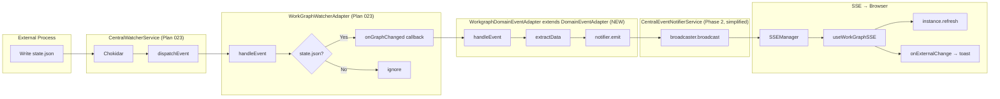
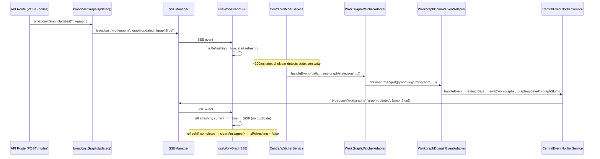

# Phase 3: Workgraph Domain Event Adapter and Toast — Tasks & Alignment Brief

**Spec**: [../../central-notify-events-spec.md](../../central-notify-events-spec.md)
**Plan**: [../../central-notify-events-plan.md](../../central-notify-events-plan.md)
**Date**: 2026-02-02
**Phase Slug**: `phase-3-workgraph-domain-event-adapter-debounce-and-toast`

---

## Executive Briefing

### Purpose
This phase connects all the infrastructure from Phases 1–2 into a working end-to-end system. When an external process (CLI, editor, agent) writes a workgraph `state.json`, the browser automatically refreshes and shows a toast notification. This is the first user-visible outcome of Plan 027.

### What We're Building
- **`WorkgraphDomainEventAdapter`**: Receives `WorkGraphChangedEvent` callbacks from `WorkGraphWatcherAdapter` and emits domain events via `CentralEventNotifierService` — bridging the filesystem watcher to SSE delivery
- **Suppression removal**: Remove unused `suppressDomain()`, `isSuppressed()`, `extractSuppressionKey()` from interface, service, fake, and tests — client-side `isRefreshing` guard in `useWorkGraphSSE` is sufficient deduplication
- **Bootstrap activation**: Fill in `startCentralNotificationSystem()` body to resolve services from DI, create the adapter, register it with the watcher, and start watching
- **`instrumentation.ts`**: Next.js server startup hook that calls the bootstrap function
- **Toast notification**: Wire `onExternalChange` in the workgraph detail page to display "Graph updated from external change"
- **Integration test**: Full chain from fake filesystem change through to `FakeCentralEventNotifier.emittedEvents`

### User Value
Users editing workgraphs via CLI agents, external editors, or other tools will see the UI automatically refresh with a toast notification saying "Graph updated from external change" — eliminating stale UI and manual refresh.

### Example
```
External process writes: ~/.chainglass/data/work-graphs/my-graph/state.json
  → Chokidar detects change
  → CentralWatcherService dispatches WatcherEvent to WorkGraphWatcherAdapter
  → WorkGraphWatcherAdapter fires onGraphChanged({ graphSlug: 'my-graph', ... })
  → WorkgraphDomainEventAdapter calls notifier.emit('workgraphs', 'graph-updated', { graphSlug: 'my-graph' })
  → CentralEventNotifierService → SSEManagerBroadcaster → SSEManager → browser
  → useWorkGraphSSE receives event, calls instance.refresh() then onExternalChange()
  → Toast: "Graph updated from external change" (auto-dismiss 3s)
```

---

## Objectives & Scope

### Objective
Bridge filesystem watcher events through the domain event adapter to the central notifier, remove unused suppression infrastructure from Phases 1-2, wire toast notification in the UI, and start the watcher at server boot — satisfying AC-05, AC-06, AC-08, AC-11, AC-12, AC-13.

### Behavior Checklist
- [ ] `WorkgraphDomainEventAdapter.handleEvent()` calls `notifier.emit()` with correct domain/eventType/data
- [ ] Suppression code removed from `ICentralEventNotifier`, `CentralEventNotifierService`, `FakeCentralEventNotifier`, and related tests
- [ ] `startCentralNotificationSystem()` resolves services, creates adapter, registers it, starts watcher
- [ ] `instrumentation.ts` exports `register()` that calls `startCentralNotificationSystem()`
- [ ] Workgraph detail page shows toast on `onExternalChange`
- [ ] Integration test: fake filesystem change → domain event in `FakeCentralEventNotifier.emittedEvents`

### Goals

- ✅ Create `WorkgraphDomainEventAdapter` that bridges watcher events to central notifier
- ✅ Remove suppression code (`suppressDomain`, `isSuppressed`, `extractSuppressionKey`) — client-side `isRefreshing` guard is sufficient
- ✅ Fill in `startCentralNotificationSystem()` with DI resolution and watcher activation
- ✅ Create `instrumentation.ts` for server boot
- ✅ Wire toast notification in workgraph detail page
- ✅ Write integration test for full chain
- ✅ Validate all tests pass

### Non-Goals

- ❌ Replacing `useWorkGraphSSE` hook internals — hook already handles `graph-updated` events correctly
- ❌ Adding new SSE routes or channels — existing `/api/events/workgraphs` channel is reused
- ❌ Migrating hardcoded channel strings to `WorkspaceDomain` imports — deferred to Phase 4 or future cleanup
- ❌ Deprecation markers — Phase 4
- ❌ Logging/observability instrumentation — can be added later
- ❌ Edge removal broadcast (edges DELETE handler returns 501 Not Implemented — no `broadcastGraphUpdated()` call there)

---

## Flight Plan

### Summary Table

| File | Action | Origin | Modified By | Recommendation |
|------|--------|--------|-------------|----------------|
| `packages/shared/src/features/027-central-notify-events/domain-event-adapter.ts` | Create | Plan 027 P3 | — | keep-as-is |
| `packages/shared/src/features/027-central-notify-events/central-event-notifier.interface.ts` | Modify | Plan 027 P1 | Plan 027 P3 | remove suppressDomain + isSuppressed |
| `packages/shared/src/features/027-central-notify-events/fake-central-event-notifier.ts` | Modify | Plan 027 P1 | Plan 027 P3 | remove suppression code |
| `packages/shared/src/features/027-central-notify-events/extract-suppression-key.ts` | Delete | Plan 027 P2 | Plan 027 P3 | no longer needed |
| `packages/shared/src/features/027-central-notify-events/index.ts` | Modify | Plan 027 P1 | Plan 027 P2, P3 | remove extractSuppressionKey export, add DomainEventAdapter export |
| `apps/web/src/features/027-central-notify-events/central-event-notifier.service.ts` | Modify | Plan 027 P2 | Plan 027 P3 | remove suppression code |
| `apps/web/src/features/027-central-notify-events/workgraph-domain-event-adapter.ts` | Create | Plan 027 P3 | — | keep-as-is |
| `apps/web/instrumentation.ts` | Create | Plan 027 P3 | — | keep-as-is |
| `apps/web/src/features/027-central-notify-events/start-central-notifications.ts` | Modify | Plan 027 P2 | Plan 027 P3 | keep-as-is |
| `apps/web/src/features/027-central-notify-events/index.ts` | Modify | Plan 027 P2 | Plan 027 P3 | keep-as-is |
| `apps/web/app/(dashboard)/workspaces/[slug]/workgraphs/[graphSlug]/workgraph-detail-client.tsx` | Modify | Plan 022 | Plan 027 P3 | cross-plan-edit |
| `test/unit/web/027-central-notify-events/workgraph-domain-event-adapter.test.ts` | Create | Plan 027 P3 | — | keep-as-is |
| `test/unit/web/027-central-notify-events/central-event-notifier.service.test.ts` | Modify | Plan 027 P2 | Plan 027 P3 | remove suppression tests U04-U08 |
| `test/contracts/central-event-notifier.contract.ts` | Modify | Plan 027 P1 | Plan 027 P3 | remove C02-C05, C07-C08 |
| `test/contracts/central-event-notifier.contract.test.ts` | Modify | Plan 027 P1 | Plan 027 P3 | remove companion B02-B03 |
| `apps/web/src/lib/di-container.ts` | Modify | Plan 019 | Plan 027 P2, P3 | remove obsolete suppression comment |
| `test/integration/027-central-notify-events/watcher-to-notifier.integration.test.ts` | Create | Plan 027 P3 | — | keep-as-is |

### Per-File Detail

#### `packages/shared/src/features/027-central-notify-events/domain-event-adapter.ts` (CREATE)
- **Duplication check**: No existing abstract base class for domain event adapters. `IWatcherAdapter` (Plan 023) is a filesystem-level interface. This is a domain-level abstract base class for event transformation. Semantic search confirmed no matches.
- **Compliance**: ADR-0007 (notification-fetch pattern — extractData returns minimal payloads), naming convention `*Adapter` suffix (R-CODE-002). Generic `<TEvent>` type parameter enables per-domain event types.
- **Rationale**: Future domain adapters (agents, samples) subclass this with ~5 lines each. Eliminates boilerplate and enforces consistent `emit()` call pattern.

#### `apps/web/src/features/027-central-notify-events/workgraph-domain-event-adapter.ts` (CREATE)
- **Duplication check**: No existing adapter bridges watcher events to the central notifier. `WorkGraphWatcherAdapter` is a filesystem-level adapter (filters `state.json` paths). This is a domain-level adapter (transforms watcher events into domain events). Different responsibilities.
- **Compliance**: ADR-0007 (notification-fetch pattern — emits only `{graphSlug}`), naming convention `*Adapter` suffix (R-CODE-002). Extends `DomainEventAdapter<WorkGraphChangedEvent>` from shared.

#### `packages/shared/src/features/027-central-notify-events/central-event-notifier.interface.ts` (MODIFY)
- **Provenance**: Created Plan 027 P1
- **Phase 3 changes**: Remove `suppressDomain()` and `isSuppressed()` methods from `ICentralEventNotifier`. Interface becomes `emit()` only.
- **Rationale**: Client-side `isRefreshing` guard in `useWorkGraphSSE` provides sufficient deduplication. Zero production callers of suppression.

#### `packages/shared/src/features/027-central-notify-events/fake-central-event-notifier.ts` (MODIFY)
- **Provenance**: Created Plan 027 P1
- **Phase 3 changes**: Remove `suppressions` map, `clockOffset`, `now()`, `suppressDomain()`, `isSuppressed()`, `advanceTime()`, and suppression check in `emit()`. ~35 lines removed (~50% of file).

#### `apps/web/src/features/027-central-notify-events/central-event-notifier.service.ts` (MODIFY)
- **Provenance**: Created Plan 027 P2
- **Phase 3 changes**: Remove `suppressions` map, `suppressDomain()`, `isSuppressed()`, suppression check in `emit()`, and `extractSuppressionKey` import. `emit()` becomes a direct passthrough to `broadcaster.broadcast()`.

#### `packages/shared/src/features/027-central-notify-events/extract-suppression-key.ts` (DELETE)
- **Provenance**: Created Plan 027 P2
- **Phase 3 changes**: Delete entirely. No longer needed without suppression.

#### `apps/web/src/features/027-central-notify-events/start-central-notifications.ts` (MODIFY)
- **Provenance**: Created Plan 027 P2 (minimal skeleton)
- **Phase 3 changes**: Fill in body with DI resolution, adapter creation, watcher registration, `watcher.start()`
- **Compliance**: globalThis gating per Discovery 02; `getContainer()` per PL-14

#### `apps/web/app/(dashboard)/workspaces/[slug]/workgraphs/[graphSlug]/workgraph-detail-client.tsx` (MODIFY)
- **Provenance**: Created Plan 022
- **Phase 3 changes**: The component already has toast state (`useState<string | null>`, line ~40), toast auto-dismiss pattern (`setTimeout`, lines ~103-104), and `onExternalChange` callback (lines ~102-105) that already shows "Graph updated externally". Need to verify this works with the new watcher-driven events. The existing wiring may already be sufficient — if `onExternalChange` callback already sets the toast, no code change is needed beyond verification.
- **Note**: The `onExternalChange` callback at lines 102-105 already calls `setToast('Graph updated externally')` with 3s auto-dismiss. This may require NO code change — just verification that the existing code handles watcher-driven events correctly.

### Compliance Check
No violations found. All new files follow PlanPak conventions. Cross-plan edits are minimal (adding 1-2 lines per call site).

---

## Requirements Traceability

### Coverage Matrix

| AC | Description | Flow Summary | Files in Flow | Tasks | Status |
|----|-------------|--------------|---------------|-------|--------|
| AC-05 | Adapter transforms watcher events to domain events | WorkGraphWatcherAdapter.onGraphChanged → WorkgraphDomainEventAdapter.handleEvent → notifier.emit | 6 (4 exist as-is, 2 new/modified) | T001, T002 | ✅ Complete |
| AC-06 | Filesystem change → SSE event in browser | state.json → chokidar → CentralWatcherService → WatcherAdapter → DomainAdapter → notifier.emit → SSEManager → useWorkGraphSSE → refresh + toast | 12 (10 exist as-is, 2 new) | T002, T004, T005 | ✅ Complete |
| AC-07 | UI save → no duplicate SSE notification | Client-side `isRefreshing` guard in `useWorkGraphSSE` deduplicates. Server-side suppression removed | 1 (exists as-is) | — (handled by existing client code) | ✅ N/A — client handles |
| AC-08 | Toast on external change | SSE → useWorkGraphSSE → onExternalChange → setToast → render | 2 (2 exist — verify only) | T006 | ✅ Complete |
| AC-11 | All tests pass | pnpm test — full suite | All | T007 | ✅ Complete |
| AC-12 | Fakes only, no vi.mock() | Unit tests use FakeCentralEventNotifier; integration uses fakes at boundaries | Test files | T001, T005 | ✅ Complete |
| AC-13 | Adapters can emit for any reason | WorkgraphDomainEventAdapter takes only ICentralEventNotifier — no watcher dependency in constructor | 1 new file | T002 | ✅ Complete |

### Gaps Found
No gaps — all acceptance criteria have complete file coverage in the task table.

**Flow trace verification performed by subagents across all ACs:**

**AC-05 + AC-06 full chain verified:**
- `packages/workflow/.../central-watcher.service.ts` — exists, works as-is (dispatches to adapters, line 231-246)
- `packages/workflow/.../workgraph-watcher.adapter.ts` — exists, works as-is (filters state.json via regex, fires onGraphChanged, lines 53-87)
- `apps/web/.../workgraph-domain-event-adapter.ts` — **NEW** → covered by T002
- `apps/web/.../central-event-notifier.service.ts` — exists, works as-is (emit + suppression)
- `apps/web/.../sse-manager-broadcaster.ts` — exists, works as-is (wraps SSEManager)
- `apps/web/src/lib/sse-manager.ts` — exists, works as-is (broadcasts to EventSource clients)
- `apps/web/app/api/events/[channel]/route.ts` — exists, works as-is (SSE streaming)
- `apps/web/.../use-workgraph-sse.ts` — exists, works as-is (filters by graphSlug, calls refresh + onExternalChange)
- `apps/web/.../start-central-notifications.ts` — needs body filled → covered by T004
- `apps/web/instrumentation.ts` — **NEW** → covered by T004

**AC-07 — server-side suppression removed:**
- Client-side `isRefreshing` guard in `useWorkGraphSSE` (line ~101) deduplicates by skipping events while a refresh is in progress
- Server-side `suppressDomain()` was never called in production code — zero callers outside tests
- Suppression infrastructure being removed in T003

**AC-08 toast verified:**
- `useWorkGraphSSE` hook (lines 106-127) already filters for `graph-updated` + matching `graphSlug`, calls `instance.refresh()`, then invokes `onExternalChange?.()` callback
- `workgraph-detail-client.tsx` (lines 102-105) wires `onExternalChange` to `setToast('Graph updated externally')` with 3s auto-dismiss
- ⚠️ **Minor text discrepancy**: Current message is "Graph updated externally"; AC-08 says "Graph updated from external change" — T006 will verify/update

**AC-13 architectural constraint verified:**
- `WorkgraphDomainEventAdapter` constructor takes only `ICentralEventNotifier` — no watcher dependency
- `handleGraphChanged()` is a public method callable from any source
- Adapter pattern follows Dependency Inversion — filesystem watcher is just one possible input

### Orphan Files
| File | Tasks | Assessment |
|------|-------|------------|
| `apps/web/instrumentation.ts` | T004 | Valid infrastructure — Next.js server startup hook required for AC-06 (watcher activation at boot) |
| `test/unit/web/027-central-notify-events/workgraph-domain-event-adapter.test.ts` | T001 | Test infrastructure — validates AC-05, AC-12 |
| `test/integration/027-central-notify-events/watcher-to-notifier.integration.test.ts` | T005 | Test infrastructure — validates AC-06, AC-07, AC-12 |

---

## Architecture Map

### Component Diagram

```mermaid
flowchart TD
    classDef pending fill:#9E9E9E,stroke:#757575,color:#fff
    classDef inprogress fill:#FF9800,stroke:#F57C00,color:#fff
    classDef completed fill:#4CAF50,stroke:#388E3C,color:#fff
    classDef blocked fill:#F44336,stroke:#D32F2F,color:#fff

    style Phase fill:#F5F5F5,stroke:#E0E0E0
    style NewFiles fill:#F5F5F5,stroke:#E0E0E0
    style CrossPlan fill:#F5F5F5,stroke:#E0E0E0
    style Tests fill:#F5F5F5,stroke:#E0E0E0

    subgraph Phase["Phase 3: Workgraph Domain Event Adapter, Debounce, and Toast"]
        T001["T001: Unit tests for adapter (RED)"]:::pending
        T002["T002: Implement adapter (GREEN)"]:::pending
        T003["T003: Remove suppression code"]:::pending
        T004["T004: Wire bootstrap + instrumentation"]:::pending
        T005["T005: Integration test"]:::pending
        T006["T006: Toast verification"]:::pending
        T007["T007: Refactor & validate"]:::pending

        T001 --> T002
        T002 --> T003
        T002 --> T004
        T003 --> T005
        T004 --> T005
        T005 --> T006
        T006 --> T007
    end

    subgraph NewFiles["Plan-Scoped Files"]
        F0["domain-event-adapter.ts (base, shared)"]:::pending
        F1["workgraph-domain-event-adapter.ts (extends base)"]:::pending
        F2["start-central-notifications.ts (fill body)"]:::pending
        F3["027 index.ts (add exports)"]:::pending
        F4["instrumentation.ts"]:::pending
    end

    subgraph SuppressionRemoval["Suppression Removal"]
        F5["ICentralEventNotifier (strip methods)"]:::pending
        F6["FakeCentralEventNotifier (strip methods)"]:::pending
        F6b["CentralEventNotifierService (strip methods)"]:::pending
        F6c["extract-suppression-key.ts (delete)"]:::pending
        F6d["contract/unit tests (remove suppression tests)"]:::pending
    end

    subgraph CrossPlan["Cross-Plan Edits"]
        F7["workgraph-detail-client.tsx (verify toast)"]:::pending
    end

    subgraph Tests["Test Files"]
        F8["workgraph-domain-event-adapter.test.ts"]:::pending
        F9["watcher-to-notifier.integration.test.ts"]:::pending
    end

    T001 -.-> F8
    T002 -.-> F0
    T002 -.-> F1
    T002 -.-> F3
    T003 -.-> F5
    T003 -.-> F6
    T003 -.-> F6b
    T003 -.-> F6c
    T003 -.-> F6d
    T004 -.-> F2
    T004 -.-> F4
    T005 -.-> F9
    T006 -.-> F7
```

<!-- Status: grey=pending, orange=in-progress, green=completed, red=blocked -->
<!-- Updated by plan-6 during implementation -->



### Task-to-Component Mapping

<!-- Status: ⬜ Pending | 🟧 In Progress | ✅ Complete | 🔴 Blocked -->

| Task | Component(s) | Files | Status | Comment |
|------|-------------|-------|--------|---------|
| T001 | Unit Tests (RED) | `test/unit/web/027-central-notify-events/workgraph-domain-event-adapter.test.ts` | ⬜ Pending | Tests base class handleEvent + concrete adapter transformation |
| T002 | Base + Concrete Adapter (GREEN) | `domain-event-adapter.ts` (shared), `workgraph-domain-event-adapter.ts` (web), barrels | ⬜ Pending | Abstract base in shared + workgraph subclass in web |
| T003 | Suppression Removal | interface, service, fake, extract-suppression-key.ts, contract tests, unit tests | ⬜ Pending | Remove ~230 lines of suppression code from Phases 1-2 |
| T004 | Bootstrap + Instrumentation | `start-central-notifications.ts`, `instrumentation.ts` | ⬜ Pending | Fill bootstrap body, create instrumentation hook |
| T005 | Integration Test | `watcher-to-notifier.integration.test.ts` | ⬜ Pending | Full chain: fake filesystem change → domain event |
| T006 | Toast Verification | `workgraph-detail-client.tsx` | ⬜ Pending | Verify existing onExternalChange toast works |
| T007 | Validation | All files | ⬜ Pending | Typecheck, build, full test suite |

---

## Tasks

| Status | ID | Task | CS | Type | Dependencies | Absolute Path(s) | Validation | Subtasks | Notes |
|--------|------|------|-----|------|-------------|-------------------|------------|----------|-------|
| [ ] | T001 | Write unit tests for `DomainEventAdapter<T>` base class and `WorkgraphDomainEventAdapter` (RED). **Base class tests** (B01-B02): use a trivial `TestAdapter extends DomainEventAdapter<{id:string}>` — (B01) `handleEvent()` calls `notifier.emit()` with configured domain, eventType, and extracted data; (B02) extractData return value is what reaches emit(). **Concrete adapter tests** (A01-A03): (A01) `handleEvent({graphSlug:'g1', ...})` emits `{domain:'workgraphs', eventType:'graph-updated', data:{graphSlug:'g1'}}`; (A02) multiple events emit in order; (A03) event data contains only `graphSlug` (ADR-0007). All use `FakeCentralEventNotifier`, no `vi.mock()`. All must have Test Doc. All fail (RED) | CS-2 | Test | – | `/home/jak/substrate/027-central-notify-events/test/unit/web/027-central-notify-events/workgraph-domain-event-adapter.test.ts` | Tests exist and fail — adapter not yet created | – | Plan 3.1. Uses `FakeCentralEventNotifier` from `@chainglass/shared` |
| [ ] | T002 | Create `DomainEventAdapter<TEvent>` abstract base class in `packages/shared` and `WorkgraphDomainEventAdapter` concrete subclass in `apps/web`. **Base class** (`packages/shared/src/features/027-central-notify-events/domain-event-adapter.ts`): abstract generic class with constructor `(notifier: ICentralEventNotifier, domain: WorkspaceDomainType, eventType: string)`, abstract `extractData(event: TEvent): Record<string, unknown>`, and `handleEvent(event: TEvent): void` that calls `this.notifier.emit(this.domain, this.eventType, this.extractData(event))`. Export from shared feature barrel. **Concrete** (`apps/web/src/features/027-central-notify-events/workgraph-domain-event-adapter.ts`): extends `DomainEventAdapter<WorkGraphChangedEvent>`, constructor calls `super(notifier, WorkspaceDomain.Workgraphs, 'graph-updated')`, `extractData()` returns `{ graphSlug: event.graphSlug }`. Export from web feature barrel. All T001 tests pass (GREEN) | CS-2 | Core | T001 | `/home/jak/substrate/027-central-notify-events/packages/shared/src/features/027-central-notify-events/domain-event-adapter.ts`, `/home/jak/substrate/027-central-notify-events/packages/shared/src/features/027-central-notify-events/index.ts`, `/home/jak/substrate/027-central-notify-events/apps/web/src/features/027-central-notify-events/workgraph-domain-event-adapter.ts`, `/home/jak/substrate/027-central-notify-events/apps/web/src/features/027-central-notify-events/index.ts` | All T001 tests pass (GREEN). Base class + concrete exported from respective barrels | – | Plan 3.2. Base in shared (plan-scoped), concrete in apps/web (plan-scoped) |
| [ ] | T003 | Remove suppression code from Phases 1-2. **(1) Interface**: Remove `suppressDomain()` and `isSuppressed()` from `ICentralEventNotifier` — interface becomes `emit()` only. **(2) Real service**: Remove `suppressions` map, `suppressDomain()`, `isSuppressed()`, suppression check in `emit()`, `extractSuppressionKey` import from `CentralEventNotifierService` — `emit()` becomes direct passthrough to `broadcaster.broadcast()`. **(3) Fake**: Remove `suppressions` map, `clockOffset`, `now()`, `suppressDomain()`, `isSuppressed()`, `advanceTime()`, suppression check in `emit()` from `FakeCentralEventNotifier`. **(4) Shared utility**: Delete `extract-suppression-key.ts` entirely. Remove `extractSuppressionKey` export from shared barrel (`packages/shared/src/features/027-central-notify-events/index.ts` line 19). **(5) Contract tests**: Remove C02, C03, C04, C05, C07, C08 from contract test factory. Remove companion B02, B03 from contract test runner. **(6) Unit tests**: Remove U04-U08 (suppression tests) from `central-event-notifier.service.test.ts`. **(7) DI comment cleanup**: In `apps/web/src/lib/di-container.ts`, remove the obsolete comment "Per DYK Insight #2: Stateful suppression map requires identity stability" (suppression map no longer exists). **Rationale**: Client-side `isRefreshing` guard in `useWorkGraphSSE` provides sufficient deduplication. Zero production callers of suppression existed | CS-2 | Core | T002 | `/home/jak/substrate/027-central-notify-events/packages/shared/src/features/027-central-notify-events/central-event-notifier.interface.ts`, `/home/jak/substrate/027-central-notify-events/packages/shared/src/features/027-central-notify-events/fake-central-event-notifier.ts`, `/home/jak/substrate/027-central-notify-events/packages/shared/src/features/027-central-notify-events/extract-suppression-key.ts`, `/home/jak/substrate/027-central-notify-events/packages/shared/src/features/027-central-notify-events/index.ts`, `/home/jak/substrate/027-central-notify-events/apps/web/src/features/027-central-notify-events/central-event-notifier.service.ts`, `/home/jak/substrate/027-central-notify-events/test/contracts/central-event-notifier.contract.ts`, `/home/jak/substrate/027-central-notify-events/test/contracts/central-event-notifier.contract.test.ts`, `/home/jak/substrate/027-central-notify-events/test/unit/web/027-central-notify-events/central-event-notifier.service.test.ts` | `pnpm tsc --noEmit` clean. All remaining tests pass. ~230 lines removed | – | Suppression removal. Client-side `isRefreshing` guard is sufficient |
| [ ] | T004 | Wire `startCentralNotificationSystem()` body and create `instrumentation.ts`. (1) In `start-central-notifications.ts`: after the globalThis guard, resolve `CentralWatcherService` and `CentralEventNotifier` from DI via `getContainer()`, create `new WorkgraphDomainEventAdapter(notifier)`, create a `new WorkGraphWatcherAdapter()`, register the watcher adapter with `watcher.registerAdapter(watcherAdapter)`, subscribe the domain adapter to watcher adapter events via `watcherAdapter.onGraphChanged((event) => domainAdapter.handleEvent(event))`, call `await watcher.start()`. Wrap body in try/catch with console.error for graceful failure. In the catch block, reset `globalThis.__centralNotificationsStarted = false` so subsequent calls can retry (per DYK session Insight #2: flag-before-async recovery). (2) Create `apps/web/instrumentation.ts` with `export async function register() { ... }` that dynamically imports and calls `startCentralNotificationSystem()`. The `register()` function is the Next.js instrumentation hook — called once at server startup | CS-3 | Core | T002 | `/home/jak/substrate/027-central-notify-events/apps/web/src/features/027-central-notify-events/start-central-notifications.ts`, `/home/jak/substrate/027-central-notify-events/apps/web/instrumentation.ts` | `pnpm tsc --noEmit` clean. Bootstrap test still passes (idempotency). Manual smoke test: `pnpm dev` starts without errors | – | Plan 3.4. Discovery 02: globalThis gating. PL-14: getContainer(). cross-cutting (instrumentation.ts) |
| [ ] | T005 | Write integration test: filesystem change → notifier emit. Setup: create `FakeCentralEventNotifier`, `WorkgraphDomainEventAdapter(notifier)`, `WorkGraphWatcherAdapter()`. Subscribe domain adapter to watcher adapter. Simulate filesystem event via `watcherAdapter.handleEvent({ path: '/ws/.chainglass/data/work-graphs/test-graph/state.json', eventType: 'change', worktreePath: '/ws', workspaceSlug: 'ws1' })`. Assert `notifier.emittedEvents` contains `{ domain: 'workgraphs', eventType: 'graph-updated', data: { graphSlug: 'test-graph' } }`. Second test: non-state.json path → assert no emit. Test Doc on all tests | CS-2 | Test | T003, T004 | `/home/jak/substrate/027-central-notify-events/test/integration/027-central-notify-events/watcher-to-notifier.integration.test.ts` | All integration tests pass. Full chain verified with fakes at boundaries | – | Plan 3.5. Uses fakes at boundaries only (FakeCentralEventNotifier). No vi.mock() |
| [ ] | T006 | Verify toast notification in workgraph detail page. The `onExternalChange` callback in `workgraph-detail-client.tsx` (lines ~102-105) already calls `setToast('Graph updated externally')` with 3s auto-dismiss. This was wired by Plan 022. Verify: (1) Read the existing code to confirm it handles watcher-driven `graph-updated` events correctly, (2) If the toast message should say "Graph updated from external change" per AC-08, update the string. (3) If no code change is needed, document that verification in the execution log | CS-1 | Verification | T005 | `/home/jak/substrate/027-central-notify-events/apps/web/app/(dashboard)/workspaces/[slug]/workgraphs/[graphSlug]/workgraph-detail-client.tsx` | Toast message matches AC-08 wording. No regressions in existing toast behavior | – | Plan 3.6. cross-plan-edit (if string change needed). May be verification-only |
| [ ] | T007 | Refactor and validate. Run `just format`, `just lint`, `pnpm tsc --noEmit`, `pnpm test`. All existing + new tests pass. Build clean. Manual verification: confirm `pnpm dev` starts without console errors related to watcher/instrumentation | CS-1 | Validation | T006 | All Phase 3 files | `pnpm tsc --noEmit` clean, `pnpm test` all pass, `just lint` clean, `pnpm build` clean | – | Plan 3.7. Manual verification for AC-06, AC-08 |

---

## Alignment Brief

### Prior Phases Review

#### Phase 1: Types, Interfaces, and Fakes

**A. Deliverables Created:**
| File | Purpose |
|------|---------|
| `packages/shared/src/features/027-central-notify-events/workspace-domain.ts` | `WorkspaceDomain` const (`Workgraphs: 'workgraphs'`, `Agents: 'agents'`), `WorkspaceDomainType` union |
| `packages/shared/src/features/027-central-notify-events/central-event-notifier.interface.ts` | `DomainEvent` type, `ICentralEventNotifier` interface |
| `packages/shared/src/features/027-central-notify-events/fake-central-event-notifier.ts` | `FakeCentralEventNotifier` with `emittedEvents`, `advanceTime()`, injectable time source |
| `packages/shared/src/features/027-central-notify-events/index.ts` | Feature barrel |
| `test/contracts/central-event-notifier.contract.ts` | Contract test factory (11 tests C01-C11) |
| `test/contracts/central-event-notifier.contract.test.ts` | Contract runner |

**B. Lessons Learned:**
- DYK-01: Originally `emit()` owned suppression enforcement. Suppression was removed in Phase 3 — client-side `isRefreshing` guard is sufficient. `emit()` is now a direct passthrough.
- DYK-02: Contract test factory time control protocol (`advanceTime?`) — real service skips C05.
- DYK-03: `WorkspaceDomain` values ARE SSE channel names — must match exactly.
- DYK-05: TDD RED requires a stub, not a missing file — use throw-all stub first.

**C. Dependencies Exported for Phase 3:**
- `ICentralEventNotifier` interface — adapter constructor parameter type (suppression methods removed in Phase 3)
- `FakeCentralEventNotifier` — used in unit and integration tests (simplified in Phase 3)
- `WorkspaceDomain` — used in adapter and tests
- `WORKSPACE_DI_TOKENS.CENTRAL_EVENT_NOTIFIER` — DI resolution token

**D. Test Infrastructure:**
- 11 contract tests (C01-C11), `FakeCentralEventNotifier` with full deterministic time control

#### Phase 2: Central Event Notifier Service and DI Wiring

**A. Deliverables Created:**
| File | Purpose |
|------|---------|
| `apps/web/src/features/027-central-notify-events/central-event-notifier.service.ts` | `CentralEventNotifierService` — real implementation wrapping `ISSEBroadcaster` with suppression |
| `apps/web/src/features/027-central-notify-events/start-central-notifications.ts` | Bootstrap skeleton — globalThis guard only, Phase 3 fills body |
| `apps/web/src/features/027-central-notify-events/index.ts` | Web feature barrel |
| `packages/shared/src/features/027-central-notify-events/extract-suppression-key.ts` | Shared `extractSuppressionKey()` pure function |
| `test/unit/web/027-central-notify-events/central-event-notifier.service.test.ts` | 10 unit tests (U01-U10) |
| `test/unit/web/027-central-notify-events/start-central-notifications.test.ts` | 2 bootstrap tests (S01-S02) |
| `test/contracts/central-event-notifier.contract.test.ts` | Updated with real service runner + B01-B04 companion tests |

**B. Lessons Learned:**
- DYK Insight #1: Shared `extractSuppressionKey()` was created but is being removed in Phase 3 (suppression removed).
- DYK Insight #2: `useValue` singleton still used for `CentralEventNotifierService` (simpler than `useFactory`, no stateful reason remaining but no harm).
- DYK Insight #3: Bootstrap helper is minimal skeleton in Phase 2 — Phase 3 fills in body.
- DYK Insight #4: SSEManager validates eventType regex `/^[a-zA-Z0-9_-]+$/` — all current types are valid.
- DYK Insight #5: Contract tests C01/C06/C08/C09 are vacuous for real service — B01-B04 companion tests provide actual coverage. (B02-B03 removed with suppression in Phase 3.)

**C. Dependencies Exported for Phase 3:**
- `CentralEventNotifierService` registered in DI (`WORKSPACE_DI_TOKENS.CENTRAL_EVENT_NOTIFIER`) as `useValue` singleton
- `CentralWatcherService` registered in DI (`WORKSPACE_DI_TOKENS.CENTRAL_WATCHER_SERVICE`) — construction only, not started
- `IFileWatcherFactory` registered (`WORKSPACE_DI_TOKENS.FILE_WATCHER_FACTORY`)
- `startCentralNotificationSystem()` — async function with globalThis guard, ready for body fill-in
- `getContainer()` from `bootstrap-singleton` — lazy DI resolution

**D. Architectural Patterns Established:**
1. ~~Callee-owned suppression (DYK-01)~~ — removed in Phase 3
2. ~~Composite key pattern~~ — removed in Phase 3
3. globalThis singleton for HMR survival
4. `useValue` for services in DI

**E. Test Infrastructure:**
- `FakeSSEBroadcaster` — `getBroadcasts()`, `reset()`
- `FakeCentralWatcherService` — `simulateEvent()`, `startCalls[]`, `registerAdapterCalls[]`
- `FakeFileWatcherFactory` from `@chainglass/workflow`
- `FakeCentralEventNotifier` — `emittedEvents[]` (simplified in P3: suppression methods removed)
- Phase 2 bootstrap test verifies idempotency

### Cumulative Dependencies for Phase 3

Phase 3 builds on:
- **From Phase 1**: `ICentralEventNotifier` (suppression methods removed in P3), `FakeCentralEventNotifier` (simplified in P3), `WorkspaceDomain`, `DomainEvent`, contract test factory (suppression tests removed in P3)
- **From Phase 2**: `CentralEventNotifierService` in DI (suppression removed in P3), `CentralWatcherService` in DI, `startCentralNotificationSystem()` skeleton, `getContainer()`, all 6 watcher deps registered
- **From Plan 022**: `broadcastGraphUpdated()`, `useWorkGraphSSE`, `workgraph-detail-client.tsx` toast pattern
- **From Plan 023**: `WorkGraphWatcherAdapter`, `CentralWatcherService`, `IWatcherAdapter`, `WatcherEvent`, `WorkGraphChangedEvent`

### Critical Findings Affecting This Phase

| Finding | Constraint | Tasks |
|---------|-----------|-------|
| Discovery 02 (Async Start + HMR) | `startCentralNotificationSystem()` uses globalThis guard; watcher.start() is async | T004 |
| Discovery 04 (Notifier API) | Server-side suppression removed — client-side `isRefreshing` guard is sufficient | T003 (removal) |
| Discovery 05 (SSE String Constants) | `WorkspaceDomain.Workgraphs` === `'workgraphs'` matches `WORKGRAPHS_CHANNEL` and SSE subscription path | T002, T003 |
| Discovery 07 (Testing with Fakes) | `WorkgraphDomainEventAdapter` tested with `FakeCentralEventNotifier`; integration test uses fakes at boundaries | T001, T005 |

### ADR Decision Constraints

| ADR | Decision | Constrains | Addressed By |
|-----|----------|-----------|-------------|
| ADR-0004 | Decorator-free DI, `useFactory` pattern | Route handlers resolve via `getContainer()` (PL-14) | T003, T004 |
| ADR-0007 | Notification-fetch pattern, single channel per domain | `emit()` data contains only `{ graphSlug }`, not full graph state. Domain value IS the channel name | T002, T003 |
| ADR-0008 | Workspace split storage, per-worktree data | `state.json` lives at `<worktree>/.chainglass/data/work-graphs/<slug>/state.json` — watcher adapter extracts graphSlug from this path | T005 (integration test path) |

### PlanPak Placement Rules

- **Plan-scoped**: `workgraph-domain-event-adapter.ts` → `apps/web/src/features/027-central-notify-events/`
- **Plan-scoped (modified)**: `start-central-notifications.ts`, `index.ts` → same feature folder
- **Cross-cutting**: `instrumentation.ts` → `apps/web/instrumentation.ts`
- **Cross-plan-edit**: `nodes/route.ts`, `edges/route.ts`, `workgraph-detail-client.tsx` — stay in original locations
- **Test files**: `test/unit/web/027-central-notify-events/`, `test/integration/027-central-notify-events/`

### Invariants & Guardrails

- `emit()` is a direct passthrough — no server-side suppression (client-side `isRefreshing` guard is sufficient)
- No `vi.mock()` or `vi.spyOn()` — fakes only
- Domain value = SSE channel name: `WorkspaceDomain.Workgraphs` → `'workgraphs'`
- globalThis guard prevents double watcher start across HMR
- `DomainEventAdapter<TEvent>` base class in `packages/shared` — future domains subclass with ~5 lines (constructor + extractData)
- Concrete adapters are thin — only responsibility is `extractData()` to return minimal ADR-0007-compliant payload

### Visual Alignment: End-to-End Event Flow



### Visual Alignment: Client-Side Deduplication (API Mutation Scenario)



### Test Plan (Full TDD — Fakes Only)

#### Unit Tests: `workgraph-domain-event-adapter.test.ts`

**Base class tests** (via `TestAdapter extends DomainEventAdapter<{id:string}>`):

| # | Test Name | Rationale | Expected Output |
|---|-----------|-----------|-----------------|
| B01 | `handleEvent() emits with configured domain, eventType, and extracted data` | Base class contract | `emittedEvents[0]` matches configured domain/eventType + extractData result |
| B02 | `extractData return value reaches emit()` | Data transformation contract | `emittedEvents[0].data` equals extractData output |

**Concrete adapter tests** (`WorkgraphDomainEventAdapter`):

| # | Test Name | Rationale | Expected Output |
|---|-----------|-----------|-----------------|
| A01 | `handleEvent() emits graph-updated event` | AC-05 core bridge | `emittedEvents[0]` = `{domain:'workgraphs', eventType:'graph-updated', data:{graphSlug:'g1'}}` |
| A02 | `multiple events emit in order` | Ordering invariant | `emittedEvents` preserves order |
| A03 | `event data contains only graphSlug` | ADR-0007 minimal payload | `data` has exactly `{ graphSlug }` — no extra fields |

#### Integration Test: `watcher-to-notifier.integration.test.ts`

| # | Test Name | Rationale | Expected Output |
|---|-----------|-----------|-----------------|
| I01 | `filesystem change flows through to domain event` | AC-06 full chain | `emittedEvents` contains `{domain:'workgraphs', eventType:'graph-updated', data:{graphSlug:'test-graph'}}` |
| I02 | `non-state.json event does not produce domain event` | Filter correctness | `emittedEvents` is empty for non-matching path |

### Step-by-Step Implementation Outline

1. **T001**: Create `test/unit/web/027-central-notify-events/workgraph-domain-event-adapter.test.ts` with B01-B02 base class tests (via trivial `TestAdapter`) and A01-A03 concrete tests. Import `FakeCentralEventNotifier` from `@chainglass/shared`. Tests must fail (RED) — neither base nor concrete class exists yet.

2. **T002**: (a) Create `packages/shared/src/features/027-central-notify-events/domain-event-adapter.ts` — abstract `DomainEventAdapter<TEvent>` with `handleEvent()` calling `emit()`. Export from shared feature barrel. (b) Create `apps/web/src/features/027-central-notify-events/workgraph-domain-event-adapter.ts` — extends base, implements `extractData()` returning `{ graphSlug }`. Export from web feature barrel. All T001 tests pass (GREEN).

3. **T003**: Remove suppression code from Phases 1-2: strip `suppressDomain()` and `isSuppressed()` from interface, service, and fake. Delete `extract-suppression-key.ts`. Remove suppression contract tests (C02-C05, C07-C08), companion tests (B02-B03), and unit tests (U04-U08). Update barrels. Verify all remaining tests pass.

4. **T004**: Fill in `startCentralNotificationSystem()` body: resolve watcher + notifier from DI, create domain adapter, create watcher adapter, register watcher adapter, subscribe domain adapter to watcher adapter's `onGraphChanged`, call `watcher.start()`. Create `instrumentation.ts` with `register()` function.

5. **T005**: Create `test/integration/027-central-notify-events/watcher-to-notifier.integration.test.ts` with I01-I02 tests. Setup: real `WorkGraphWatcherAdapter`, `WorkgraphDomainEventAdapter(fakeNotifier)`. Simulate events via `watcherAdapter.handleEvent()`.

6. **T006**: Read `workgraph-detail-client.tsx`, verify `onExternalChange` already sets toast. Update message if needed to match AC-08 wording.

7. **T007**: Run `just fft`. All tests pass. Build clean. Typecheck clean.

### Commands to Run

```bash
# Run adapter unit tests (RED then GREEN)
pnpm exec vitest run test/unit/web/027-central-notify-events/workgraph-domain-event-adapter.test.ts

# Verify remaining tests after suppression removal
pnpm exec vitest run test/unit/web/027-central-notify-events/central-event-notifier.service.test.ts
pnpm exec vitest run test/contracts/central-event-notifier.contract.test.ts

# Run integration tests
pnpm exec vitest run test/integration/027-central-notify-events/watcher-to-notifier.integration.test.ts

# Typecheck
pnpm tsc --noEmit

# Build after barrel changes
pnpm build

# Full quality gate
just fft

# Smoke test dev server
pnpm dev
```

### Risks / Unknowns

| Risk | Severity | Mitigation |
|------|----------|------------|
| `instrumentation.ts` not called in dev mode with Turbopack | Medium | Test `pnpm dev` manually; fallback to lazy start on first SSE route request if needed |
| `CentralWatcherService.start()` fails on missing registry/worktrees | Medium | Wrap in try/catch with console.error in bootstrap; graceful degradation |
| `WorkGraphWatcherAdapter` is from `@chainglass/workflow` — import path in `start-central-notifications.ts` | Low | Use `@chainglass/workflow` barrel import; verify exports exist |
| `onExternalChange` toast message doesn't match AC-08 exactly | Low | Verify and update string if needed in T006 |

### Ready Check
- [ ] ADR constraints mapped to tasks (ADR-0004 → T004, ADR-0007 → T002, ADR-0008 → T005)
- [ ] Phase 1+2 deliverables available (all types, fakes, services, DI registrations — suppression removed in T003)
- [ ] Critical findings addressed (Discovery 02 → T004, Discovery 04 → T003 removal, Discovery 05 → T002, Discovery 07 → T001/T005)
- [ ] Test plan covers all ACs
- [ ] PlanPak placement verified

---

## Phase Footnote Stubs

_Reserved for plan-6 to add entries during implementation._

| Footnote | Task | Description | Date |
|----------|------|-------------|------|
| | | | |

---

## Evidence Artifacts

- **Execution Log**: `docs/plans/027-central-notify-events/tasks/phase-3-workgraph-domain-event-adapter-debounce-and-toast/execution.log.md` — created by `/plan-6`
- **Test Output**: RED/GREEN evidence captured in execution log per task
- **Build Output**: `pnpm build` and `just fft` results in T007 entries

---

## Discoveries & Learnings

_Populated during implementation by plan-6. Log anything of interest to your future self._

| Date | Task | Type | Discovery | Resolution | References |
|------|------|------|-----------|------------|------------|
| | | | | | |

**Types**: `gotcha` | `research-needed` | `unexpected-behavior` | `workaround` | `decision` | `debt` | `insight`

**What to log**:
- Things that didn't work as expected
- External research that was required
- Implementation troubles and how they were resolved
- Gotchas and edge cases discovered
- Decisions made during implementation
- Technical debt introduced (and why)
- Insights that future phases should know about

_See also: `execution.log.md` for detailed narrative._

---

## Directory Layout

```
docs/plans/027-central-notify-events/
  ├── central-notify-events-plan.md
  ├── central-notify-events-spec.md
  ├── research-dossier.md
  └── tasks/
      ├── phase-1-types-interfaces-and-fakes/
      │   ├── tasks.md
      │   └── execution.log.md
      ├── phase-2-central-event-notifier-service-and-di-wiring/
      │   ├── tasks.md
      │   └── execution.log.md
      └── phase-3-workgraph-domain-event-adapter-debounce-and-toast/
          ├── tasks.md            ← this file
          └── execution.log.md    # created by /plan-6
```

---

## Critical Insights Discussion

**Session**: 2026-02-02
**Context**: Phase 3 Tasks Dossier — Workgraph Domain Event Adapter, Debounce, and Toast
**Analyst**: AI Clarity Agent
**Reviewer**: jak
**Format**: Water Cooler Conversation (5 Critical Insights)

### Insight 1: Dual SSE Broadcast Paths for API Mutations

**Did you know**: When an API route mutates a workgraph, the SSE event is sent via `broadcastGraphUpdated()` (direct to `sseManager`) AND the filesystem watcher chain fires through `CentralEventNotifierService.emit()` — two independent paths to the same channel. The 500ms suppression prevents duplicates but the dual-path architecture persists.

**Implications**:
- Two independent broadcast paths to `sseManager` for the `workgraphs` channel
- `broadcastGraphUpdated()` bypasses `CentralEventNotifierService` entirely
- Suppression is the only thing preventing double SSE events on API mutations
- Future maintainers may not understand why both paths exist

**Options Considered**:
- Option A: Accept dual-path architecture as-is — Phase 4 consolidates later
- Option B: Migrate `broadcastGraphUpdated()` calls to use `CentralEventNotifierService.emit()` now
- Option C: Keep dual-path with explicit deprecation comment

**AI Recommendation**: Option A — Accept dual-path
- Reasoning: Already listed as explicit non-goal. Suppression works correctly. Phase 4 is the right place to consolidate.

**Discussion Summary**: Quick agreement — minimal scope for Phase 3, consolidation deferred to Phase 4.

**Decision**: Accept dual-path architecture. No change to dossier.

**Action Items**: None

**Affects**: Non-goals section (already documented)

---

### Insight 2: globalThis Flag Set Before Async `watcher.start()` — No Recovery on Failure

**Did you know**: `startCentralNotificationSystem()` sets `globalThis.__centralNotificationsStarted = true` before the async `watcher.start()` call. If `start()` throws (registry missing, permission error), the flag stays `true` and no subsequent call can retry — the watcher is permanently broken for the server session.

**Implications**:
- Transient failures become permanent with no recovery path
- No retry possible without full server restart
- The dossier specified try/catch with console.error but didn't address flag state

**Options Considered**:
- Option A: Reset flag on failure (`globalThis.__centralNotificationsStarted = false` in catch block)
- Option B: Keep flag set, log error prominently (require restart)
- Option C: Reset flag + add backoff counter

**AI Recommendation**: Option A — Reset flag on failure
- Reasoning: One line in the catch block enables recovery. `register()` is called once at boot, but lazy initialization from SSE routes could retry.

**Discussion Summary**: Quick agreement on Option A.

**Decision**: Reset `globalThis.__centralNotificationsStarted = false` in catch block.

**Action Items**:
- [x] Updated T004 description to include flag-reset-on-failure requirement

**Affects**: T004 (bootstrap implementation)

---

### Insight 3: Two Different `handleEvent()` Methods in the Chain — Integration Test Boundary Verification

**Did you know**: There are two distinct `handleEvent()` methods in the event chain — `WorkGraphWatcherAdapter.handleEvent(WatcherEvent)` (IWatcherAdapter interface) and `DomainEventAdapter.handleEvent(WorkGraphChangedEvent)` (base class). The integration test correctly exercises both by calling the watcher adapter's `handleEvent()` and asserting on the notifier's `emittedEvents`.

**Implications**:
- T005's integration boundary is correct: raw `WatcherEvent` in → domain event out
- Subscription wiring (`onGraphChanged` callback) bridges the two `handleEvent()` methods
- Suppression test (I02) exercises the full chain through `FakeCentralEventNotifier.emit()`

**Options Considered**:
- Option A: Keep T005 as specified — no change
- Option B: Add I04 test verifying subscription wiring itself

**AI Recommendation**: Option A — Keep T005 as specified
- Reasoning: Integration boundary is correct. All assertions verified against actual source code via subagent research.

**Discussion Summary**: User requested full subagent verification. All 5 assertions confirmed against source: no-arg constructor, callback registration (not EventEmitter), regex `/work-graphs\/([^/]+)\/state\.json$/`, error-isolated subscriber callbacks, `extractSuppressionKey` priority chain.

**Decision**: T005 integration test design is sound. No changes needed.

**Action Items**: None

**Affects**: T005 (integration test)

---

### Insight 4: Adapter Registration Order in Bootstrap — Steps 4/5 Before `start()`

**Did you know**: The bootstrap function's ordering (register adapter → subscribe domain adapter → start watcher) is correct because `start()` is the only trigger for events. Steps 4 and 5 can be in either order as long as both precede `start()`.

**Implications**:
- `registerAdapter()` just adds to a Set — no events dispatched
- `onGraphChanged()` just adds to a Set — no events dispatched
- Only `start()` begins filesystem watching and event emission
- Ordering of 4 vs 5 is irrelevant as long as both precede 6

**Options Considered**:
- Option A: Keep ordering as specified (register → subscribe → start)
- Option B: Subscribe before registering (swap steps 4 and 5)

**AI Recommendation**: Option A — Keep as specified
- Reasoning: Reads naturally and is correct. No practical difference.

**Discussion Summary**: Quick agreement — no change needed.

**Decision**: Keep T004 ordering as specified.

**Action Items**: None

**Affects**: T004 (bootstrap implementation)

---

### Insight 5: Implicit Contract Between `extractData()` and `extractSuppressionKey()`

**Did you know**: Suppression correctness depends on `extractData()` returning an object with a field recognized by `extractSuppressionKey()` (which checks `graphSlug` → `agentId` → `key` in priority order). This contract is implicit — no compile-time guarantee that an adapter produces suppressable data.

**Implications**:
- If a future adapter returns `{ slug: 'x' }` instead of `{ graphSlug: 'x' }`, suppression silently breaks
- `extractSuppressionKey` returns `undefined`, `isSuppressed` is never called, event passes through
- A05 tests shape but not suppression integration; I02 tests both together
- Triple coverage exists (unit shape test + suppression unit test + integration) but the contract is invisible

**Options Considered**:
- Option A: Accept implicit contract — no change
- Option B: Add JSDoc comment on `extractData()` documenting the contract
- Option C: Add base-class validation method for compile-time safety

**AI Recommendation**: Option B — Add JSDoc comment
- Reasoning: Zero-cost documentation prevents the most likely failure mode for future adapter authors.

**Discussion Summary**: Quick agreement on Option B.

**Decision**: Add JSDoc on `extractData()` noting compatibility with `extractSuppressionKey()`.

**Action Items**:
- [x] Updated T002 description to include JSDoc requirement on `extractData()`

**Affects**: T002 (base class implementation)

---

## Session Summary

**Insights Surfaced**: 5 critical insights identified and discussed
**Decisions Made**: 5 decisions reached
**Action Items Created**: 2 dossier updates applied (T004 flag-reset, T002 JSDoc)
**Areas Requiring Updates**: All updates applied inline during session

**Shared Understanding Achieved**: Yes

**Confidence Level**: High — Key risks identified and mitigated. All assertions verified against source code.

**Next Steps**: User GO/NO-GO on dossier, then `/plan-6-implement-phase --phase 3`
