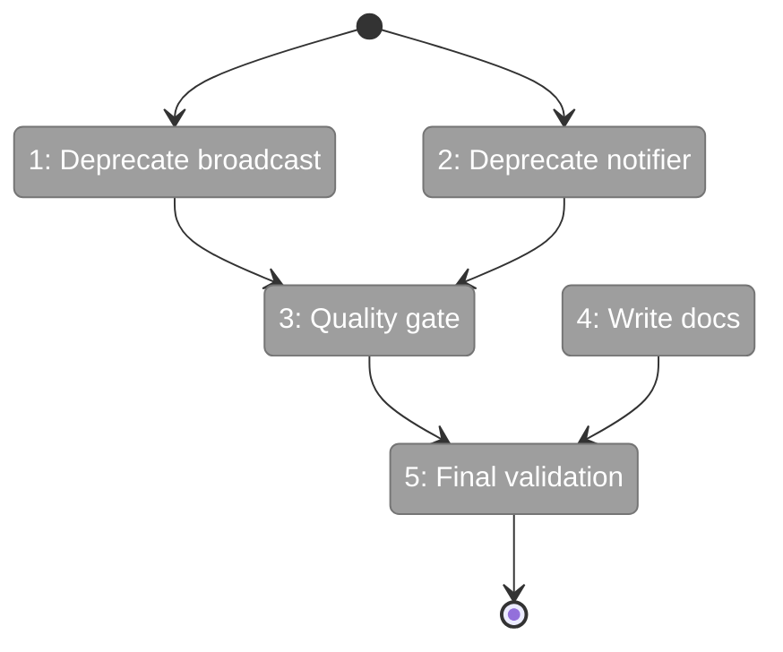
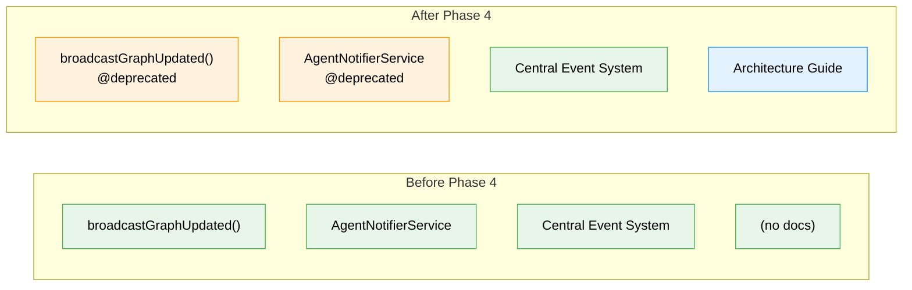

# Flight Plan: Phase 4 — Deprecation Markers and Validation

**Plan**: [central-notify-events-plan.md](../../central-notify-events-plan.md)
**Phase**: Phase 4: Deprecation Markers and Validation
**Generated**: 2026-02-03
**Status**: Ready for takeoff

---

## Departure → Destination

**Where we are**: The central domain event notification system is fully operational. Filesystem changes to workgraph `state.json` files flow through `CentralWatcherService` → `WorkgraphDomainEventAdapter` → `CentralEventNotifierService` → SSE → browser toast. The old ad-hoc notification functions (`broadcastGraphUpdated()` and `AgentNotifierService`) still exist and work, but the new central system runs alongside them without any deprecation signals to developers.

**Where we're going**: By the end of this phase, both legacy notification entry points carry `@deprecated` JSDoc tags directing developers to the central system. A documentation guide explains the architecture and walks through adding a new domain adapter. The full quality gate passes, and Plan 027 is complete. A developer encountering `broadcastGraphUpdated()` in their editor will see a strikethrough and know exactly where to look instead.

---

## Flight Status

<!-- Updated by /plan-6: pending → active → done. Use blocked for problems/input needed. -->

**Legend**: grey = pending | yellow = active | red = blocked/needs input | green = done

---

## Stages

<!-- Updated by /plan-6 during implementation: [ ] → [~] → [x] -->

- [ ] **Stage 1: Mark `broadcastGraphUpdated()` as deprecated** — add `@deprecated` JSDoc pointing to `WorkgraphDomainEventAdapter` via `CentralEventNotifierService` (`features/022-workgraph-ui/sse-broadcast.ts`)
- [ ] **Stage 2: Mark `AgentNotifierService` as deprecated** — add `@deprecated` JSDoc noting future migration to domain event adapters (`features/019-agent-manager-refactor/agent-notifier.service.ts`)
- [ ] **Stage 3: Run the full quality gate** — `just check` to verify lint, typecheck, and all tests still pass after annotations
- [ ] **Stage 4: Write the architecture guide** — create system overview, adapter walkthrough, and SSE conventions (`docs/how/central-events/1-architecture.md` — new file)
- [ ] **Stage 5: Final end-to-end validation** — edit `state.json` from terminal, confirm browser toast appears, mark plan complete

---

## Acceptance Criteria

- [ ] `broadcastGraphUpdated()` marked `@deprecated` with JSDoc pointing to domain event adapter replacement (AC-09)
- [ ] `AgentNotifierService` marked `@deprecated` with JSDoc noting future migration (AC-10)
- [ ] All existing tests continue to pass (AC-11)
- [ ] External `state.json` write produces browser toast within ~2 seconds (AC-06, AC-08)
- [ ] Documentation guide created in `docs/how/central-events/`

---

## Goals & Non-Goals

**Goals**:
- Add `@deprecated` JSDoc to `broadcastGraphUpdated()` with migration pointer
- Add `@deprecated` JSDoc to `AgentNotifierService` class with migration pointer
- Run `just check` — all pass (lint, typecheck, test)
- Create architecture guide in `docs/how/central-events/1-architecture.md`
- Final manual e2e validation of filesystem change -> toast flow

**Non-Goals**:
- Remove or rename deprecated functions (advisory only)
- Migrate existing callers of `broadcastGraphUpdated()` to the new system
- Add new domain adapters (docs explain how, but no new adapters in this phase)
- Fix 3 pre-existing test failures from commit `2e6e40d` (unrelated to Plan 027)

---

## Architecture: Before & After

**Legend**: existing (green, unchanged) | changed (orange, modified) | new (blue, created)

---

## Checklist

- [ ] T001: Add `@deprecated` to `broadcastGraphUpdated()` (CS-1)
- [ ] T002: Add `@deprecated` to `AgentNotifierService` (CS-1)
- [ ] T003: Run full quality gate (CS-1)
- [ ] T004: Create documentation guide (CS-2)
- [ ] T005: Final e2e validation and plan completion (CS-1)

---

## PlanPak

Active — files organized under `features/027-central-notify-events/`. Phase 4 modifies files in `features/022-workgraph-ui/` and `features/019-agent-manager-refactor/` (cross-plan edits for deprecation annotations only) and creates documentation in `docs/how/central-events/`.
