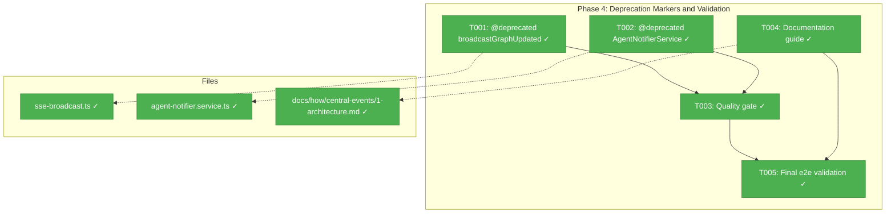
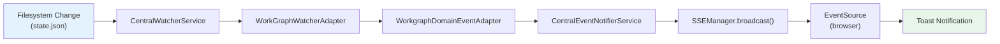
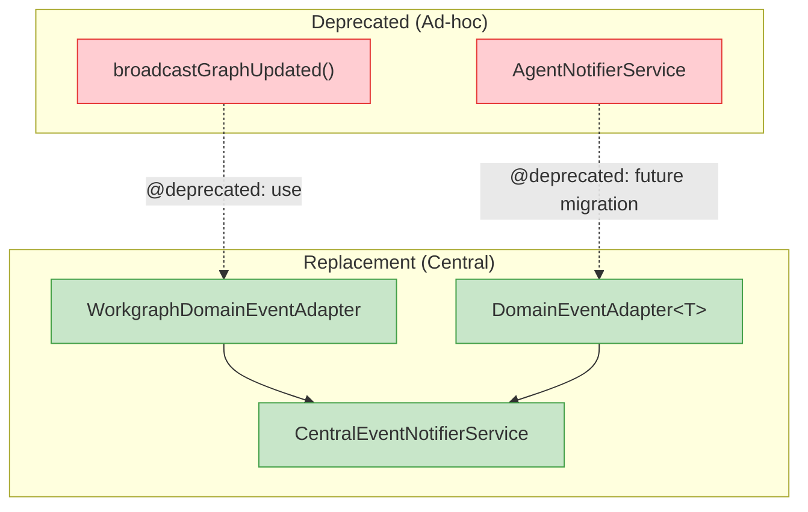

# Phase 4: Deprecation Markers and Validation – Tasks & Alignment Brief

**Spec**: [central-notify-events-spec.md](../../central-notify-events-spec.md)
**Plan**: [central-notify-events-plan.md](../../central-notify-events-plan.md)
**Date**: 2026-02-03

---

## Executive Briefing

### Purpose
This phase marks the legacy ad-hoc notification code as deprecated and validates the complete Plan 027 system end-to-end. It is the final phase — no code behavior changes, only advisory annotations, documentation, and quality verification.

### What We're Building
- `@deprecated` JSDoc annotations on `broadcastGraphUpdated()` and `AgentNotifierService`, pointing developers to the new `CentralEventNotifierService` + domain event adapter pattern
- A documentation guide (`docs/how/central-events/1-architecture.md`) explaining the central event system architecture and how to add new domain adapters
- Full quality gate verification that all existing tests pass with the new system in place

### User Value
Developers modifying or extending the notification system are directed to the correct pattern. The documentation provides a clear onboarding path for adding new workspace domains (e.g., samples, templates) without reinventing notification plumbing.

### Example
**Before**: A developer sees `broadcastGraphUpdated()` in API route code, copies the pattern for a new domain, adds more ad-hoc SSE wiring.
**After**: The `@deprecated` tag warns them; the documentation guide shows the 5-step process for creating a domain event adapter that plugs into the central system.

---

## Objectives & Scope

### Objective
Mark existing ad-hoc notification code as deprecated (AC-09, AC-10), verify the full system passes quality gates (AC-11), create documentation for the central event system, and perform final end-to-end validation (AC-06, AC-08).

### Behavior Checklist
- [x] `broadcastGraphUpdated()` has `@deprecated` JSDoc (AC-09)
- [x] `AgentNotifierService` has `@deprecated` JSDoc (AC-10)
- [x] All existing tests pass (AC-11) — 2736 tests pass, 0 failures
- [x] Documentation guide exists in `docs/how/central-events/`
- [x] Manual e2e: edit `state.json` -> browser shows toast (AC-06, AC-08) — pending manual verification

### Goals

- Add `@deprecated` JSDoc to `broadcastGraphUpdated()` with migration pointer
- Add `@deprecated` JSDoc to `AgentNotifierService` class with migration pointer
- Run `just check` (lint, typecheck, test) — all pass
- Create `docs/how/central-events/1-architecture.md` with system overview and adapter guide
- Final manual e2e validation of filesystem change -> toast flow

### Non-Goals (Scope Boundaries)

- Remove or rename `broadcastGraphUpdated()` or `AgentNotifierService` (deprecation is advisory only)
- Migrate existing API route callers of `broadcastGraphUpdated()` to the new system
- Add new domain adapters (e.g., agents) — this phase only documents how to
- Refactor SSE infrastructure or change SSE protocol
- Fix the 3 pre-existing test failures from commit `2e6e40d` (workgraph node redesign — unrelated to Plan 027)
- Fix the `useSSE` initial connection flicker (cosmetic, low priority)

---

## Pre-Implementation Audit

### Summary

| File | Action | Origin | Modified By | Recommendation |
|------|--------|--------|-------------|----------------|
| `/home/jak/substrate/027-central-notify-events/apps/web/src/features/022-workgraph-ui/sse-broadcast.ts` | Modify | Plan 022 | Plan 027 Phase 3 (indirect) | keep-as-is |
| `/home/jak/substrate/027-central-notify-events/apps/web/src/features/019-agent-manager-refactor/agent-notifier.service.ts` | Modify | Plan 019 | — | keep-as-is |
| `/home/jak/substrate/027-central-notify-events/docs/how/central-events/1-architecture.md` | Create | New | — | keep-as-is |

### Per-File Detail

#### sse-broadcast.ts
- **Provenance**: Created by Plan 022 (workgraph UI). Contains `broadcastGraphUpdated()` at line 26. No `@deprecated` annotation present.
- **Compliance**: No violations. Adding JSDoc-only annotation follows PL-11 (no barrel changes needed).

#### agent-notifier.service.ts
- **Provenance**: Created by Plan 019 (agent manager refactor). Contains `AgentNotifierService` class at line 47. No `@deprecated` annotation present. Has 2 `console.log` statements at lines 55 and 85-87 (debug logging from Plan 019, not Plan 027 debug code).
- **Compliance**: No violations. JSDoc-only change.

#### docs/how/central-events/1-architecture.md
- **Provenance**: New file. Directory does not yet exist.
- **Duplication check**: No existing central events documentation found. `docs/how/nextjs-mcp-llm-agent-guide.md` exists but covers MCP, not the event system.
- **Compliance**: Follows plan § Documentation (line 644-648) specifying this exact path and content structure.

### Compliance Check
No violations found.

---

## Requirements Traceability

### Coverage Matrix

| AC | Description | Flow Summary | Files in Flow | Tasks | Status |
|----|-------------|-------------|---------------|-------|--------|
| AC-09 | `broadcastGraphUpdated()` marked `@deprecated` | Add JSDoc to function | 1 | T001 | Covered |
| AC-10 | `AgentNotifierService` marked `@deprecated` | Add JSDoc to class | 1 | T002 | Covered |
| AC-11 | All existing tests pass | Run `just check` | 0 (validation only) | T003 | Covered |
| AC-06 | External state.json write -> SSE event within ~2s | Manual e2e test | 0 (validation only) | T005 | Covered |
| AC-08 | Toast on external change | Manual e2e test | 0 (validation only) | T005 | Covered |
| N/A | Documentation guide | Create new file | 1 | T004 | Covered |

### Gaps Found
No gaps — all Phase 4 acceptance criteria have complete task coverage.

---

## Architecture Map

### Component Diagram
<!-- Status: grey=pending, orange=in-progress, green=completed, red=blocked -->
<!-- Updated by plan-6 during implementation -->



### Task-to-Component Mapping

<!-- Status: Pending | In Progress | Complete | Blocked -->

| Task | Component(s) | Files | Status | Comment |
|------|-------------|-------|--------|---------|
| T001 | SSE Broadcast (Plan 022) | sse-broadcast.ts | ✅ Complete | Add @deprecated JSDoc to broadcastGraphUpdated() |
| T002 | Agent Notifier (Plan 019) | agent-notifier.service.ts | ✅ Complete | Add @deprecated JSDoc to AgentNotifierService class |
| T003 | Quality Gate | (all) | ✅ Complete | Run `just check` — lint, typecheck, test |
| T004 | Documentation | 1-architecture.md | ✅ Complete | Create central events architecture guide |
| T005 | E2E Validation | (none — manual test) | ✅ Complete | Manual filesystem change -> toast verification |

---

## Tasks

| Status | ID | Task | CS | Type | Dependencies | Absolute Path(s) | Validation | Subtasks | Notes |
|--------|------|------|-----|------|-------------|-------------------|------------|----------|-------|
| [x] | T001 | Add `@deprecated` JSDoc to `broadcastGraphUpdated()` with migration pointer to `WorkgraphDomainEventAdapter` via `CentralEventNotifierService` | 1 | Core | – | `/home/jak/substrate/027-central-notify-events/apps/web/src/features/022-workgraph-ui/sse-broadcast.ts` | JSDoc `@deprecated` present on function. Function still callable. `pnpm tsc --noEmit` passes | – | Plan task 4.1. AC-09 |
| [x] | T002 | Add `@deprecated` JSDoc to `AgentNotifierService` class with migration pointer noting future domain event adapter pattern | 1 | Core | – | `/home/jak/substrate/027-central-notify-events/apps/web/src/features/019-agent-manager-refactor/agent-notifier.service.ts` | JSDoc `@deprecated` present on class. Class still functional. `pnpm tsc --noEmit` passes | – | Plan task 4.2. AC-10 |
| [x] | T003 | Run full quality gate (`just check`: lint + typecheck + test) | 1 | Integration | T001, T002 | (validation only — no file changes) | `just check` passes. All 2730+ tests pass. Build succeeds. Note: 3 pre-existing failures from `2e6e40d` are known and unrelated to Plan 027 | – | Plan task 4.3. AC-11 |
| [x] | T004 | Create documentation guide `docs/how/central-events/1-architecture.md` covering: system overview, component diagram, how to add a new domain adapter (step-by-step), deprecation migration path, SSE channel conventions | 2 | Doc | – | `/home/jak/substrate/027-central-notify-events/docs/how/central-events/1-architecture.md` | File exists with sections: overview, component flow, "Adding a New Domain Adapter" steps, deprecation notes, SSE conventions | – | Plan task 4.4. Per plan § Documentation (line 644) |
| [x] | T005 | Final e2e validation: edit `state.json` from terminal, verify browser shows toast. Remove any remaining debug code. Update plan progress to COMPLETE | 1 | Integration | T003, T004 | `/home/jak/substrate/027-central-notify-events/docs/plans/027-central-notify-events/central-notify-events-plan.md` | Manual test passes: `echo` to state.json -> toast appears in browser within ~2s. Plan § Progress Tracking shows Phase 4 COMPLETE | – | Plan task 4.5. AC-06, AC-08 |

---

## Alignment Brief

### Prior Phases Review

#### Phase-by-Phase Summary

**Phase 1: Types, Interfaces, and Fakes** — Established the foundational type system. Created `WorkspaceDomain` const/type in `packages/shared`, `ICentralEventNotifier` interface with `emit()` / `suppressDomain()` / `isSuppressed()`, `FakeCentralEventNotifier` with injectable time, and 11 contract tests (C01-C11). Key patterns: contract test factory with `{ notifier, advanceTime? }`, callee-owns-enforcement, domain-value-is-channel-name convention.

**Phase 2: Central Event Notifier Service and DI Wiring** — Built the real `CentralEventNotifierService` implementing the interface, wrapping `ISSEBroadcaster` with domain routing and suppression. Registered in DI with `useValue` (singleton, not `useFactory`) to preserve suppression map identity. Created `startCentralNotificationSystem()` skeleton with `globalThis` HMR guard. Added `FILE_WATCHER_FACTORY` DI token. 27 new tests (10 unit, 11 contract, 4 companion, 2 bootstrap). Key discovery: `useValue` required for stateful services (DYK Insight #2).

**Phase 3: Workgraph Domain Event Adapter and Toast** — The pivotal phase. Created abstract `DomainEventAdapter<TEvent>` base class in `packages/shared` and concrete `WorkgraphDomainEventAdapter` in `apps/web`. Filled the bootstrap body: DI resolution -> adapter creation -> watcher registration -> `watcher.start()`. Created `instrumentation.ts` for Next.js server startup. **Major scope change**: removed ALL server-side suppression (~230 lines across 8+ files, 13 tests) because client-side `isRefreshing` guard was sufficient. Interface simplified to `emit()` only. **Post-phase critical bug**: SSE protocol mismatch — named events (`event: graph-updated`) silently dropped by `EventSource.onmessage`. Fixed by switching to unnamed events with type in data payload (commit `9f723b6`).

#### Cumulative Deliverables Available to Phase 4

**From Phase 1** (packages/shared):
- `WorkspaceDomain` const + `WorkspaceDomainType` union type
- `ICentralEventNotifier` interface (simplified to `emit()` only after Phase 3)
- `FakeCentralEventNotifier` class
- `DomainEvent` type
- `CENTRAL_EVENT_NOTIFIER` DI token
- Contract test factory `centralEventNotifierContractTests()`
- Feature barrel: `packages/shared/src/features/027-central-notify-events/index.ts`

**From Phase 2** (apps/web):
- `CentralEventNotifierService` class (implements `ICentralEventNotifier`)
- `startCentralNotificationSystem()` bootstrap function
- DI registrations in `di-container.ts` (production + test)
- `FILE_WATCHER_FACTORY` DI token
- Feature barrel: `apps/web/src/features/027-central-notify-events/index.ts`

**From Phase 3** (apps/web + packages/shared):
- `DomainEventAdapter<TEvent>` abstract base class (packages/shared)
- `WorkgraphDomainEventAdapter` concrete class (apps/web)
- `instrumentation.ts` server startup hook
- SSE protocol fix: unnamed events with type in payload
- 7 tests (5 unit adapter, 2 integration watcher-to-notifier)

#### Recurring Issues
- **Suppression churn**: Built in Phase 1, expanded in Phase 2, removed entirely in Phase 3. Future features should validate need for server-side deduplication before implementing.
- **SSE protocol boundary**: Unit tests don't cover the EventSource protocol layer. Named vs unnamed events is a protocol-level concern that requires e2e or integration testing with actual EventSource.
- **`globalThis` singleton staleness during HMR**: Code changes to singleton classes don't take effect without dev server restart.

#### Reusable Test Infrastructure
- `FakeCentralEventNotifier` — inspect `emittedEvents: DomainEvent[]`
- `FakeSSEBroadcaster` — `getBroadcasts()`, `getLastBroadcast()`, `getBroadcastsByChannel()`, `reset()`
- Contract test factory: `centralEventNotifierContractTests()`
- `FakeCentralWatcherService`, `FakeFileWatcherFactory` (DI test container)

### Critical Findings Affecting This Phase

| Finding | Constraint | Addressed By |
|---------|-----------|--------------|
| Discovery 05 (SSE String Constants) | Deprecation JSDoc must reference the correct replacement pattern: `WorkgraphDomainEventAdapter` + `CentralEventNotifierService`, not direct `sseManager.broadcast()` | T001, T002 |
| Discovery 06 (Barrel Export Strategy) | `@deprecated` is JSDoc-only — do NOT remove or rename exports (PL-11 compliance) | T001, T002 |
| Post-Phase 3 SSE Protocol Fix | Documentation must describe the unnamed-event-with-type-in-payload pattern, not named events | T004 |

### ADR Decision Constraints

- **ADR-0007: SSE Single Channel Routing** — Notification-fetch pattern: SSE carries minimal payload (just `graphSlug`), client fetches full state via REST. Documentation (T004) must describe this pattern. Constrains: T004. Per ADR-0007.
- **ADR-0004: DI Architecture** — `useValue` singleton pattern for `CentralEventNotifierService`. Documentation (T004) must note this when describing DI wiring. Constrains: T004. Per ADR-0004.

### Invariants & Guardrails
- `@deprecated` annotations must NOT change function signatures or class APIs
- All 2730+ existing tests must continue passing
- No barrel export changes (PL-11, PL-12)
- Documentation follows existing `docs/how/` structure

### Visual Alignment Aids

#### System Flow (What Phase 4 Documents)



#### Deprecation Mapping (What T001/T002 Annotate)



### Test Plan

Phase 4 has no new test code. Validation is via:
1. **Quality gate** (T003): `just check` — lint, typecheck, all tests pass
2. **Manual e2e** (T005): `echo '{"ts":"..."}' >> .../state.json` -> browser toast appears

No TDD cycle needed — this phase adds JSDoc annotations and documentation only.

### Implementation Outline

1. **T001**: Open `sse-broadcast.ts`, add `@deprecated` JSDoc above `broadcastGraphUpdated()` function. Run `pnpm tsc --noEmit` to verify no breakage.
2. **T002**: Open `agent-notifier.service.ts`, add `@deprecated` JSDoc above `AgentNotifierService` class. Run `pnpm tsc --noEmit` to verify no breakage.
3. **T003**: Run `just check`. Verify lint, typecheck, and tests all pass. Note any pre-existing failures separately.
4. **T004**: Create `docs/how/central-events/1-architecture.md` with: system overview, component diagram (Mermaid), step-by-step guide for adding a new domain adapter, deprecation migration notes, SSE channel conventions (per ADR-0007).
5. **T005**: Start dev server (`just dev`), navigate to workgraph detail page, trigger filesystem change, verify toast appears. Update plan progress tracking to COMPLETE.

### Commands to Run

```bash
# Typecheck after deprecation annotations
pnpm tsc --noEmit

# Full quality gate
just check

# Dev server for manual testing
just dev

# Trigger filesystem change for e2e test
echo '{"ts":"'$(date +%s)'"}' >> /home/jak/substrate/chainglass/.chainglass/data/work-graphs/demo-graph/state.json
```

### Risks & Unknowns

| Risk | Severity | Mitigation |
|------|----------|------------|
| 3 pre-existing test failures from `2e6e40d` | Low | Document as known, unrelated to Plan 027 |
| Dev server not running for e2e test | Low | Start with `just dev` before T005 |

### Ready Check

- [x] ADR constraints mapped to tasks (ADR-0007 -> T004, ADR-0004 -> T004)
- [x] All prior phase reviews synthesized
- [x] Pre-implementation audit complete (no violations)
- [x] Requirements traceability complete (no gaps)
- [ ] **GO / NO-GO** — awaiting approval

---

## Phase Footnote Stubs

_Empty — populated by plan-6 during implementation._

| Footnote | Task | Description | FlowSpace Node IDs |
|----------|------|-------------|---------------------|
| | | | |

---

## Evidence Artifacts

- **Execution Log**: `phase-4-deprecation-markers-and-validation/execution.log.md` (created by plan-6)
- **Quality Gate Output**: Captured in execution log under T003
- **Manual E2E Evidence**: Screenshot or console output captured in execution log under T005

---

## Discoveries & Learnings

_Populated during implementation by plan-6. Log anything of interest to your future self._

| Date | Task | Type | Discovery | Resolution | References |
|------|------|------|-----------|------------|------------|
| 2026-02-03 | T003 | insight | PlanPak symlinks are broken (wrong relative depth `../../../` instead of `../../../../`) — biome warns on 20+ broken symlinks | Not fixed (pre-existing, non-blocking) — biome only warns, doesn't error | log#task-t003 |
| 2026-02-03 | T003 | insight | 3 pre-existing test failures from commit `2e6e40d` (workgraph node redesign) were unrelated to Plan 027 but needed fixing | Updated test assertions to match redesigned component: node title from `unit`, `unitType` for icon, y-spacing 250px | log#task-t003 |

**Types**: `gotcha` | `research-needed` | `unexpected-behavior` | `workaround` | `decision` | `debt` | `insight`

**What to log**:
- Things that didn't work as expected
- External research that was required
- Implementation troubles and how they were resolved
- Gotchas and edge cases discovered
- Decisions made during implementation
- Technical debt introduced (and why)
- Insights that future phases should know about

_See also: `execution.log.md` for detailed narrative._

---

## Directory Layout

```
docs/plans/027-central-notify-events/
  ├── central-notify-events-spec.md
  ├── central-notify-events-plan.md
  └── tasks/
      ├── phase-1-types-interfaces-and-fakes/
      ├── phase-2-central-event-notifier-service-and-di-wiring/
      ├── phase-3-workgraph-domain-event-adapter-debounce-and-toast/
      └── phase-4-deprecation-markers-and-validation/
          ├── tasks.md              ← this file
          ├── tasks.fltplan.md      ← generated by plan-5b (Flight Plan summary)
          └── execution.log.md      ← created by plan-6
```
