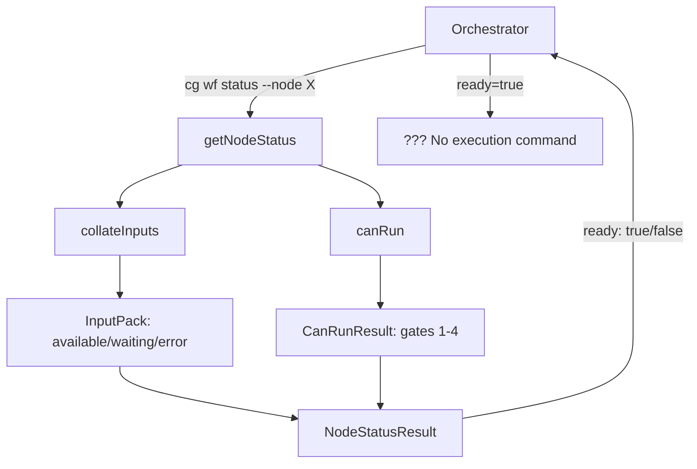

# Research Report: Positional Graph Execution Lifecycle Commands

**Generated**: 2026-02-03T10:45:00Z
**Research Query**: "Position graph agentic commands - Execution Lifecycle for Positional Graph"
**Mode**: Plan-Associated (branch: 028-pos-agentic-cli)
**Location**: `docs/plans/028-pos-agentic-cli/research-dossier.md`
**FlowSpace**: Available
**Findings**: 65 total (IA:10, DC:10, PS:10, QT:10, IC:10, DE:10, PL:15)

---

## Executive Summary

### What It Does

The positional graph system (Plan 026) provides a workflow definition and status computation layer for agent-driven pipelines. It defines graphs with ordered lines containing nodes, computes node readiness via a 4-gate algorithm, and resolves inputs from upstream nodes. However, it **does not implement execution lifecycle commands** — agents cannot start/stop nodes, ask questions, or save outputs.

### Business Purpose

Enable LLM agents to execute multi-step workflows with orchestrator handoff. The positional graph represents the workflow structure; the execution lifecycle commands provide the runtime control plane for agents to:
1. Transition nodes through execution states (pending → running → complete)
2. Pause for human/orchestrator input via question/answer protocol
3. Read resolved inputs from upstream nodes
4. Save outputs for downstream consumers

### Key Insights

1. **Gap is well-defined**: The data model already supports execution states (`running`, `waiting-question`, `blocked-error`, `complete`) but no commands drive these transitions
2. **Reference implementation exists**: Legacy WorkGraph (`cg wg`) has full execution lifecycle that can be ported
3. **External orchestration model**: The service computes readiness; an external orchestrator drives execution (no auto-execution)

### Quick Stats

| Metric | Value |
|--------|-------|
| **Components** | 20 source files, 1,399 LOC service code |
| **Dependencies** | 5 DI tokens, 3 external packages |
| **Test Coverage** | 12 test files, ~65-75% estimated |
| **Complexity** | Medium (well-documented patterns to follow) |
| **Prior Learnings** | 15 relevant discoveries from previous implementations |

---

## How It Currently Works

### Entry Points

| Entry Point | Type | Location | Purpose |
|-------------|------|----------|---------|
| `cg wf status` | CLI | `positional-graph.command.ts:handleWfStatus` | Query node/line/graph status |
| `cg wf trigger` | CLI | `positional-graph.command.ts:handleWfTrigger` | Trigger manual line transitions |
| `getNodeStatus()` | Service | `positional-graph.service.ts:933-1051` | Compute node readiness and status |
| `collateInputs()` | Algorithm | `input-resolution.ts:30-101` | Resolve declared inputs from upstream |
| `canRun()` | Algorithm | `input-resolution.ts:396-498` | 4-gate readiness check |

### Core Execution Flow (Current - Read-Only)



**Current capability**: The system can tell you IF a node is ready to run, but cannot actually run it.

### 4-Gate Readiness Algorithm

The `canRun()` algorithm checks these gates in order:

| Gate | Name | Check | Blocks If |
|------|------|-------|-----------|
| 1 | Preceding Lines | All nodes in lines 0..N-1 complete | Any predecessor incomplete |
| 2 | Transition | Line N-1 transition triggered (if manual) | Manual gate not triggered |
| 3 | Serial Neighbor | Left sibling complete (if serial mode) | Sibling still running |
| 4 | Inputs | All required inputs available | Any input waiting/error |

### Input Resolution Pipeline

```typescript
// collateInputs returns InputPack with per-input status
interface InputPack {
  inputs: Record<string, InputEntry>;  // keyed by input name
  ok: boolean;  // true if all required inputs available
}

type InputEntry =
  | { status: 'available'; detail: AvailableInput }  // Source complete, data ready
  | { status: 'waiting'; detail: WaitingInput }      // Source not complete yet
  | { status: 'error'; detail: ErrorInput }          // Invalid wiring
```

### State Management

**Three persistence files per graph:**

| File | Content | Mutations |
|------|---------|-----------|
| `graph.yaml` | Structure (lines, node positions) | CRUD operations |
| `nodes/<id>/node.yaml` | Node config (unit, inputs, settings) | Input wiring, settings |
| `state.json` | Runtime state (node status, transitions) | Status changes, triggers |

**State schema:**
```typescript
interface State {
  graph_status: 'pending' | 'in_progress' | 'complete' | 'failed';
  updated_at: string;  // ISO timestamp
  nodes?: Record<string, NodeStateEntry>;
  transitions?: Record<string, TransitionEntry>;
}

interface NodeStateEntry {
  status: 'running' | 'waiting-question' | 'blocked-error' | 'complete';
  started_at?: string;
  completed_at?: string;
}
```

---

## Architecture & Design

### Component Map

```
packages/positional-graph/
├── src/
│   ├── services/
│   │   ├── positional-graph.service.ts  (1,399 LOC - main service)
│   │   ├── input-resolution.ts          (500 LOC - collateInputs, canRun)
│   │   └── atomic-file.ts               (30 LOC - atomic writes)
│   ├── schemas/
│   │   ├── graph.schema.ts              (Zod: graph definition)
│   │   ├── node.schema.ts               (Zod: node config)
│   │   ├── state.schema.ts              (Zod: runtime state)
│   │   └── orchestrator-settings.schema.ts
│   ├── interfaces/
│   │   └── positional-graph-service.interface.ts  (28 methods)
│   ├── adapter/
│   │   └── positional-graph.adapter.ts  (filesystem paths)
│   ├── errors/
│   │   └── positional-graph-errors.ts   (E150-E171 codes)
│   └── container.ts                     (DI registration)

apps/cli/src/commands/
└── positional-graph.command.ts          (CLI handlers)
```

### Design Patterns Identified

| Pattern | Where Used | Why |
|---------|------------|-----|
| **Service Interface** | `IPositionalGraphService` | Contract-first design, testable |
| **Result Types** | `BaseResult`, `NodeStatusResult` | No exceptions, explicit errors |
| **Error Codes** | E150-E171 | Machine-readable, actionable |
| **Atomic Writes** | `atomicWriteFile()` | Prevent corruption |
| **DI Container** | `registerPositionalGraphServices()` | Testability, flexibility |
| **Adapter Pattern** | `PositionalGraphAdapter` | Filesystem abstraction |

### System Boundaries

**What positional-graph owns:**
- Graph/line/node structure definitions
- Input wiring configuration
- Status computation (readiness gates)
- State persistence (state.json)

**What positional-graph does NOT own:**
- Agent invocation (belongs to orchestrator)
- Output storage (to be added in this plan)
- Question/answer protocol (to be added in this plan)
- Execution triggering (external orchestrator)

---

## The Gap: Missing Execution Lifecycle

### Current Service Interface (28 methods, structure-only)

```typescript
interface IPositionalGraphService {
  // Graph CRUD ✓
  create, load, show, delete, list

  // Line operations ✓
  addLine, removeLine, moveLine, setLineLabel, setLineDescription

  // Node operations ✓
  addNode, removeNode, moveNode, setNodeDescription, showNode

  // Input wiring ✓
  setInput, removeInput, collateInputs

  // Status API ✓
  getNodeStatus, getLineStatus, getStatus

  // Transition control ✓
  triggerTransition

  // Properties/Settings ✓
  updateGraphProperties, updateLineProperties, updateNodeProperties
  updateGraphOrchestratorSettings, updateLineOrchestratorSettings, updateNodeOrchestratorSettings

  // MISSING: Execution lifecycle
  // startNode, endNode, canEnd
  // askQuestion, answerQuestion, getAnswer
  // saveOutputData, saveOutputFile, getOutputData, getOutputFile
  // getInputData, getInputFile
}
```

### Required Additions (from E2E Reference)

**Node Lifecycle (3 methods):**
```typescript
startNode(ctx, graphSlug, nodeId): Promise<BaseResult>
  // Transition: pending/ready → running
  // Persists: { status: 'running', started_at: ISO }

endNode(ctx, graphSlug, nodeId): Promise<BaseResult>
  // Transition: running → complete
  // Validates: all required outputs present
  // Persists: { status: 'complete', completed_at: ISO }

canEnd(ctx, graphSlug, nodeId): Promise<CanEndResult>
  // Query-only: checks if all required outputs present
  // Returns: { canEnd: boolean, missingOutputs: string[] }
```

**Question/Answer (3 methods):**
```typescript
askQuestion(ctx, graphSlug, nodeId, question): Promise<AskQuestionResult>
  // Transition: running → waiting-question
  // Persists: question to state, pendingQuestion field
  // Returns: { questionId }

answerQuestion(ctx, graphSlug, nodeId, questionId, answer): Promise<BaseResult>
  // Transition: waiting-question → running
  // Persists: answer to state

getAnswer(ctx, graphSlug, nodeId, questionId): Promise<GetAnswerResult>
  // Query-only: retrieves stored answer
  // Returns: { answer?, answered: boolean, answeredAt? }
```

**Output Storage (4 methods):**
```typescript
saveOutputData(ctx, graphSlug, nodeId, outputName, value): Promise<BaseResult>
  // Persists: value to nodes/<nodeId>/data.json

saveOutputFile(ctx, graphSlug, nodeId, outputName, filePath): Promise<BaseResult>
  // Copies: file to nodes/<nodeId>/files/<name>.<ext>
  // Persists: relative path to data.json

getOutputData(ctx, graphSlug, nodeId, outputName): Promise<GetOutputResult>
  // Reads: from data.json

getOutputFile(ctx, graphSlug, nodeId, outputName): Promise<GetOutputFileResult>
  // Returns: file path from data.json
```

**Input Retrieval (2 methods):**
```typescript
getInputData(ctx, graphSlug, nodeId, inputName): Promise<GetInputResult>
  // Resolves: single input via collateInputs
  // Returns: resolved value from source node

getInputFile(ctx, graphSlug, nodeId, inputName): Promise<GetInputFileResult>
  // Resolves: single file input
  // Returns: file path from source node
```

### Required CLI Commands

```bash
# Node lifecycle
cg wf node start <slug> <nodeId>
cg wf node end <slug> <nodeId>
cg wf node can-end <slug> <nodeId>

# Question/answer
cg wf node ask <slug> <nodeId> --type <type> --text <text> [--options ...]
cg wf node answer <slug> <nodeId> <questionId> <answer>
cg wf node get-answer <slug> <nodeId> <questionId>

# Output storage
cg wf node save-output-data <slug> <nodeId> <outputName> <value>
cg wf node save-output-file <slug> <nodeId> <outputName> <filePath>
cg wf node get-output-data <slug> <nodeId> <outputName>
cg wf node get-output-file <slug> <nodeId> <outputName>

# Input retrieval
cg wf node get-input-data <slug> <nodeId> <inputName>
cg wf node get-input-file <slug> <nodeId> <inputName>
```

---

## Dependencies & Integration

### What Positional Graph Depends On

| Dependency | Type | Purpose | Risk if Changed |
|------------|------|---------|-----------------|
| `@chainglass/shared` | Required | IFileSystem, IPathResolver, IYamlParser, BaseResult | High - core abstractions |
| `@chainglass/workflow` | Required | WorkspaceContext, WorkspaceDataAdapterBase | Medium - context pattern |
| `zod` | Required | Schema validation | Low - stable API |
| `IWorkUnitLoader` | DI Token | Load WorkUnit I/O declarations | Medium - interface contract |

### What Depends on Positional Graph

| Consumer | How It Uses | Breaking Changes |
|----------|-------------|------------------|
| CLI (`cg wf`) | All service methods | Any method signature change |
| Future: Web UI | Status queries | NodeStatusResult shape |
| Future: Orchestrator | Execution lifecycle | New methods to implement |

### Output Storage Architecture (from WorkGraph)

```
.chainglass/data/workflows/{graph-slug}/
├── graph.yaml                    # Definition
├── state.json                    # Runtime state
└── nodes/
    └── {nodeId}/
        ├── node.yaml             # Config
        ├── data.json             # Output values
        └── files/                # Output files
            └── {outputName}.ext
```

---

## Quality & Testing

### Current Test Coverage

| Test Type | Files | Coverage |
|-----------|-------|----------|
| Unit | `graph-crud.test.ts` | Graph CRUD, error codes |
| Integration | `graph-lifecycle.test.ts` | 15-step lifecycle |
| E2E | `positional-graph-e2e.ts` | 33 steps with real FS |

### Testing Patterns to Follow

1. **No mocks** - Use FakeFileSystem/FakePathResolver for unit tests
2. **Real filesystem** - E2E tests use temp directories
3. **Atomic write verification** - Test persistence patterns
4. **Error code coverage** - Test each E-code path
5. **State machine coverage** - Test all transitions

### Test Gaps to Address

- No tests for execution state transitions
- No tests for question/answer flow
- No tests for output storage/retrieval
- No concurrent access testing

---

## Prior Learnings (From Previous Implementations)

### Critical Learnings to Apply

| ID | Type | Key Insight | Action |
|----|------|-------------|--------|
| **PL-01** | Design | Per-node execution mode (serial/parallel) | Check `orchestratorSettings.execution` in Gate 3 |
| **PL-02** | Algorithm | `collateInputs` is single authoritative traversal | Never duplicate input resolution logic |
| **PL-03** | Algorithm | 4 sequential gates in exact order | Implement canRun gates 1→2→3→4 |
| **PL-05** | Pattern | Stored status overrides computed | Check state.json first, then compute |
| **PL-06** | State | 5-state machine: pending→ready→running→complete | Support all transitions including error states |
| **PL-07** | Flow | Manual transitions block next line | Gate 2 checks preceding line's transition |

### Gotchas to Avoid

| ID | Gotcha | Mitigation |
|----|--------|------------|
| **PL-04** | Forward references are NOT errors | Return `waiting` status, not error |
| **PL-09** | Path traversal in node IDs | Validate IDs before filesystem ops |
| **PL-12** | Race conditions in event handlers | Validate existence before state mutations |
| **PL-14** | Extends vs intersection for types | Use `&` for extending discriminated unions |

### Patterns to Reuse

| ID | Pattern | How to Apply |
|----|---------|--------------|
| **PL-08** | Timestamp-based event IDs | `2026-02-03T10:30:45.123Z_<hex>` for question IDs |
| **PL-10** | Dual-layer testing | Fake service for unit, real for integration |
| **PL-11** | Storage-first events | Persist state.json before any notifications |
| **PL-13** | Zod-first schemas | Define schemas before TypeScript types |
| **PL-15** | Workspace-scoped paths | All paths via `ctx.worktreePath` |

---

## Critical Discoveries

### Discovery 01: Service Interface Gap is Exact

**Impact**: Critical
**Source**: IA-06, IA-07

The missing methods are precisely defined by comparing `IPositionalGraphService` (current) with `IWorkNodeService` (legacy). The 12 missing methods fall into 4 categories: lifecycle (3), question/answer (3), output (4), input (2).

**Required Action**: Implement all 12 methods following the exact signatures from WorkGraph, adapted to positional graph patterns.

### Discovery 02: E2E Reference is Complete Specification

**Impact**: Critical
**Source**: IA-08, DE-02

The `e2e-sample-flow.ts` file (720 lines) demonstrates the complete agent execution pattern:
1. Direct output nodes (skip start, go straight to end)
2. Agent nodes with question/answer handoff
3. Input retrieval from upstream nodes
4. Output propagation to downstream nodes

**Required Action**: Port E2E flow from `cg wg` to `cg wf` commands as acceptance test.

### Discovery 03: State Machine is Already Designed

**Impact**: High
**Source**: PL-06, IC-04

The 5-state execution lifecycle is already defined in the schema:
- `pending` (computed, not stored)
- `ready` (computed, not stored)
- `running` (stored)
- `waiting-question` (stored)
- `blocked-error` (stored)
- `complete` (stored)

**Required Action**: Implement state transitions that write to state.json, following the hybrid computed/stored pattern.

### Discovery 04: Output Storage Pattern Exists

**Impact**: High
**Source**: IA-10, DC-03

Legacy WorkGraph stores outputs in `nodes/<nodeId>/data.json` for values and `nodes/<nodeId>/files/` for files. This pattern should be adopted directly.

**Required Action**: Implement `saveOutputData`/`saveOutputFile` using same directory structure.

### Discovery 05: Error Code Range Reserved

**Impact**: Medium
**Source**: IC-07, PS-02

Error codes E150-E171 are defined. Execution lifecycle errors should use E172-E179:
- E172: Node not in running state (for end)
- E173: Question not found
- E174: Output already saved
- E175: Output not found
- E176: Invalid state transition

**Required Action**: Define new error codes in positional-graph-errors.ts.

---

## Modification Considerations

### Safe to Modify

| Area | Why Safe |
|------|----------|
| `IPositionalGraphService` interface | Adding new methods is backward compatible |
| `positional-graph.command.ts` | Adding new CLI commands |
| `state.schema.ts` | Extending with question/output fields |
| Error codes | New E172+ codes don't affect existing |

### Modify with Caution

| Area | Risk | Mitigation |
|------|------|------------|
| `NodeStatusResult` | UI may depend on shape | Add fields, don't remove |
| `state.json` structure | Existing graphs have state | Migration path for new fields |
| `canRun` algorithm | Core readiness logic | Extensive test coverage first |

### Danger Zones

| Area | Why Dangerous | Alternative |
|------|---------------|-------------|
| `collateInputs` logic | Input resolution is complex | Reuse for getInputData, don't duplicate |
| Atomic write pattern | Corruption risk | Use existing atomicWriteFile |
| WorkUnit loader interface | External contract | Don't change IWorkUnitLoader |

---

## Recommendations

### Implementation Order

1. **Phase 1: Service Methods** - Add 12 methods to `IPositionalGraphService` and implement in service
2. **Phase 2: State Schema** - Extend state.json for questions and outputs
3. **Phase 3: CLI Commands** - Add 12 CLI commands
4. **Phase 4: Tests** - Unit tests for each method, integration for flows
5. **Phase 5: E2E Port** - Port e2e-sample-flow.ts to use `cg wf`

### Key Design Decisions Needed

| Decision | Options | Recommendation |
|----------|---------|----------------|
| State file structure | Extend state.json vs separate execution.json | Extend state.json (simpler) |
| Output storage | Inline in state vs separate data.json | Separate data.json (cleaner) |
| Question ID format | UUID vs hex3 vs timestamp | Timestamp-based (PL-08 pattern) |
| File output handling | Copy vs store path | Copy to graph dir (isolation) |
| Validation timing | At save vs at end | At end (allows incremental saves) |

### Error Handling Strategy

```typescript
// Recommended error code assignments
E172: 'node-not-running'      // endNode when not in running state
E173: 'question-not-found'    // getAnswer with invalid questionId
E174: 'output-already-saved'  // saveOutput with same name twice
E175: 'output-not-found'      // getOutput with invalid name
E176: 'invalid-transition'    // State machine violation
E177: 'node-not-waiting'      // answerQuestion when not waiting
E178: 'input-not-available'   // getInputData when source incomplete
E179: 'file-not-found'        // saveOutputFile with invalid path
```

---

## External Research Opportunities

No external research gaps identified during codebase exploration. All required patterns and implementations exist within the codebase (legacy WorkGraph) or are well-documented in Plan 026 materials.

---

## Appendix: File Inventory

### Core Files to Modify

| File | Lines | Purpose |
|------|-------|---------|
| `positional-graph-service.interface.ts` | 472 | Add 12 method signatures |
| `positional-graph.service.ts` | 1,399 | Implement 12 methods |
| `positional-graph.command.ts` | 1,178 | Add 12 CLI commands |
| `state.schema.ts` | 34 | Extend for questions/outputs |
| `positional-graph-errors.ts` | 31 | Add E172-E179 codes |

### Reference Files

| File | Purpose |
|------|---------|
| `e2e-sample-flow.ts` | Execution pattern reference |
| `worknode-service.interface.ts` | Method signatures to port |
| `workgraph.command.ts` | CLI patterns to port |

### Test Files to Create

| File | Purpose |
|------|---------|
| `execution-lifecycle.test.ts` | Unit tests for state transitions |
| `question-answer.test.ts` | Unit tests for Q&A flow |
| `output-storage.test.ts` | Unit tests for output methods |
| `positional-graph-execution-e2e.test.ts` | Full E2E with execution |

---

## Next Steps

1. Run `/plan-1b-specify` to create formal specification from this research
2. Consider workshop for state machine edge cases
3. Plan phases aligned with implementation order above

---

**Research Complete**: 2026-02-03T10:45:00Z
**Report Location**: `docs/plans/028-pos-agentic-cli/research-dossier.md`
