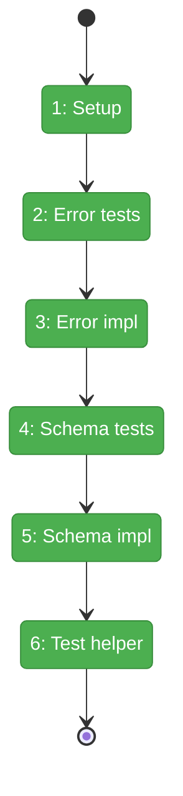
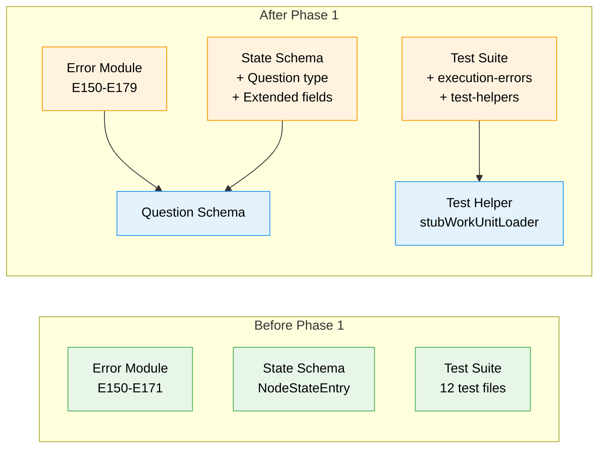

# Flight Plan: Phase 1 — Foundation - Error Codes and Schemas

**Plan**: [../../pos-agentic-cli-plan.md](../../pos-agentic-cli-plan.md)
**Phase**: Phase 1: Foundation - Error Codes and Schemas
**Generated**: 2026-02-03
**Status**: Landed

---

## Departure → Destination

**Where we are**: The positional graph system (Plan 026) provides graph structure with ordered lines and positioned nodes, status computation via the 4-gate readiness algorithm, and input resolution via `collateInputs`. However, agents cannot participate in workflows because there are no commands to signal state transitions, report outputs, retrieve inputs, or request orchestrator input. The error code range E150-E171 exists for structure and input resolution errors, but execution lifecycle errors are undefined.

**Where we're going**: By the end of this phase, the codebase will have 7 new error codes (E172-E179) for execution lifecycle operations, a Question schema for storing orchestrator handoff state, and extended NodeStateEntry fields for tracking pending questions and errors. A developer implementing Phase 2-6 service methods can import these error factories and schemas immediately. The test infrastructure will include `stubWorkUnitLoader` for mocking WorkUnit I/O declarations.

---

## Flight Status

<!-- Updated by /plan-6: pending → active → done. Use blocked for problems/input needed. -->

**Legend**: grey = pending | yellow = active | red = blocked/needs input | green = done

---

## Stages

<!-- Updated by /plan-6 during implementation: [ ] → [~] → [x] -->

- [x] **Stage 1: Create PlanPak folder structure** — establish the organizational container for plan-scoped files (`packages/positional-graph/src/features/028-pos-agentic-cli/` — new folder)
- [x] **Stage 2: Write error code tests** — TDD RED phase for 7 error factory functions covering E172-E179 (`test/unit/positional-graph/execution-errors.test.ts` — new file)
- [x] **Stage 3: Implement error codes** — TDD GREEN phase adding error factories to errors module, then export (`errors/positional-graph-errors.ts`, `errors/index.ts`)
- [x] **Stage 4: Write schema tests** — TDD RED phase for Question schema and NodeStateEntry extensions (`test/unit/positional-graph/schemas.test.ts` — extend existing)
- [x] **Stage 5: Implement schema extensions** — TDD GREEN phase adding Question type and optional fields, then export (`schemas/state.schema.ts`, `schemas/index.ts`)
- [x] **Stage 6: Create test helper** — provide `stubWorkUnitLoader` with configurable I/O declarations for downstream phase testing (`test/unit/positional-graph/test-helpers.ts` — new file)

---

## Acceptance Criteria

- [x] Invalid state transitions return appropriate error codes (E172)
- [x] Missing outputs on `end` returns E175 with list of missing output names
- [x] Invalid question ID returns E173
- [x] All new error codes (E172-E179, excluding E174) have factory functions with tests
- [x] Question schema validates question_id, node_id, type, text, options, asked_at, answer, answered_at
- [x] NodeStateEntry extended with optional pending_question_id and error fields
- [x] StateSchema extended with optional questions array
- [x] Test helper stubWorkUnitLoader available for downstream phases
- [x] Existing tests still pass (no regression)

---

## Goals & Non-Goals

**Goals**:
- Define error codes E172-E179 (excluding E174) with factory functions
- Create Question schema for question/answer protocol persistence
- Extend NodeStateEntry with pending_question_id and error fields
- Create test helper stubWorkUnitLoader for downstream phase testing
- Export all new types from package entry points
- Maintain backward compatibility with existing state.json files

**Non-Goals**:
- Service method implementations (Phase 2-5)
- CLI command handlers (Phase 2-5)
- E2E test script (Phase 6)
- Documentation (Phase 6)
- Refactoring existing test files to use new test-helpers.ts (technical debt, defer)
- E174 OutputAlreadySaved error code (removed per spec clarification Q5)

---

## Architecture: Before & After

**Legend**: existing (green, unchanged) | changed (orange, modified) | new (blue, created)

---

## Checklist

- [x] T001: Create PlanPak feature folder structure (CS-1)
- [x] T002: Write tests for E172-E179 error factory functions (CS-2)
- [x] T003: Implement E172-E179 error codes and factory functions (CS-2)
- [x] T004: Export new error codes and factories from errors/index.ts (CS-1)
- [x] T005: Write tests for Question schema validation (CS-2)
- [x] T006: Write tests for extended NodeStateEntry fields (CS-2)
- [x] T007: Extend StateSchema with Question type and NodeStateEntry fields (CS-2)
- [x] T008: Export Question and QuestionSchema from schemas/index.ts (CS-1)
- [x] T009: Create test helper stubWorkUnitLoader with configurable I/O declarations (CS-2)

---

## PlanPak

Active — files organized under `packages/positional-graph/src/features/028-pos-agentic-cli/`
