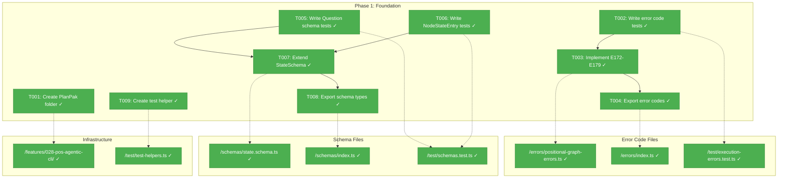
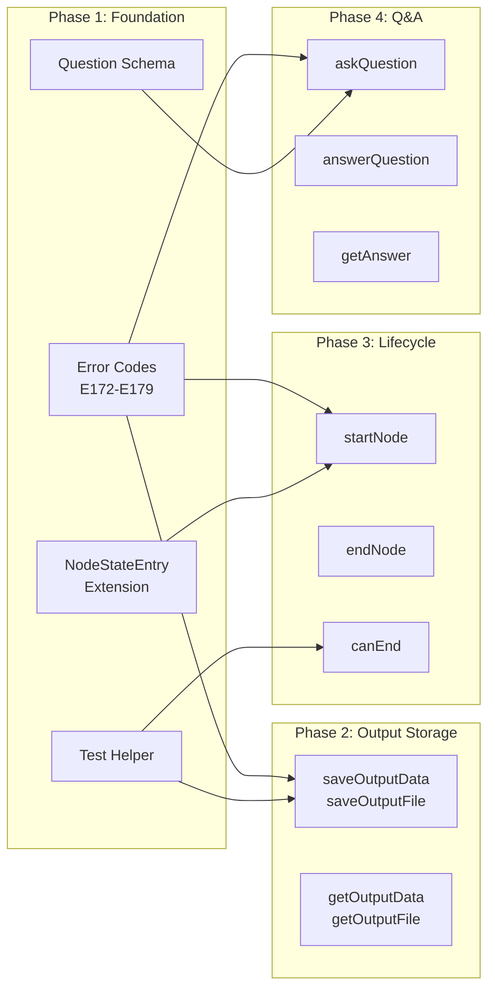
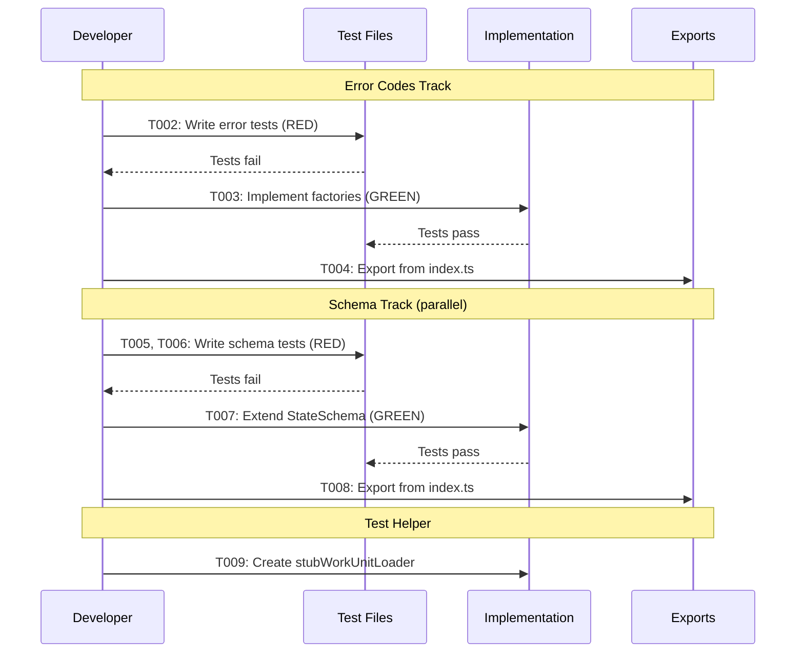

# Phase 1: Foundation - Error Codes and Schemas – Tasks & Alignment Brief

**Spec**: [../../pos-agentic-cli-spec.md](../../pos-agentic-cli-spec.md)
**Plan**: [../../pos-agentic-cli-plan.md](../../pos-agentic-cli-plan.md)
**Date**: 2026-02-03

---

## Executive Briefing

### Purpose
This phase establishes the foundational infrastructure required by all subsequent phases: error codes for execution lifecycle operations and schema extensions for question/answer state tracking. Without these foundations, Phases 2-6 cannot be implemented.

### What We're Building
- **7 new error codes** (E172-E179, excluding E174) with factory functions for execution lifecycle errors
- **Question schema** for storing question/answer protocol state in `state.json`
- **NodeStateEntry extensions** for tracking pending questions and error details
- **Test helper** (`stubWorkUnitLoader`) for mocking WorkUnit I/O declarations in subsequent phases

### User Value
Agents executing workflows will receive structured, actionable error messages when state transitions fail, outputs are missing, or questions cannot be resolved. This enables debugging and error recovery in orchestrated pipelines.

### Example
**Before**: Agent calls `cg wf node end` on a node missing required outputs → generic error
**After**: Agent receives `E175 OutputNotFound: Missing required outputs: [script, language]` → can fix and retry

---

## Objectives & Scope

### Objective
Establish error codes and schema extensions per plan acceptance criteria AC-16, AC-17, AC-18, enabling downstream phases to implement execution lifecycle methods.

### Goals

- ✅ Define error codes E172-E179 (excluding E174) with factory functions
- ✅ Create Question schema for question/answer protocol persistence
- ✅ Extend NodeStateEntry with pending_question_id and error fields
- ✅ Create test helper stubWorkUnitLoader for downstream phase testing
- ✅ Export all new types from package entry points
- ✅ Maintain backward compatibility with existing state.json files

### Non-Goals

- ❌ Service method implementations (Phase 2-5)
- ❌ CLI command handlers (Phase 2-5)
- ❌ E2E test script (Phase 6)
- ❌ Documentation (Phase 6)
- ❌ Refactoring existing test files to use new test-helpers.ts (technical debt, defer)
- ❌ E174 OutputAlreadySaved error code (removed per spec clarification Q5)

---

## Pre-Implementation Audit

### Summary
| File | Action | Origin | Modified By | Recommendation |
|------|--------|--------|-------------|----------------|
| /home/jak/substrate/028-pos-agentic-cli/packages/positional-graph/src/features/028-pos-agentic-cli/ | Create | Plan 028 | — | keep-as-is |
| /home/jak/substrate/028-pos-agentic-cli/test/unit/positional-graph/execution-errors.test.ts | Create | Plan 028 | — | keep-as-is |
| /home/jak/substrate/028-pos-agentic-cli/packages/positional-graph/src/errors/positional-graph-errors.ts | Modify | Plan 026 | — | keep-as-is |
| /home/jak/substrate/028-pos-agentic-cli/packages/positional-graph/src/errors/index.ts | Modify | Plan 026 | — | keep-as-is |
| /home/jak/substrate/028-pos-agentic-cli/test/unit/positional-graph/schemas.test.ts | Modify | Plan 026 | — | keep-as-is |
| /home/jak/substrate/028-pos-agentic-cli/packages/positional-graph/src/schemas/state.schema.ts | Modify | Plan 026 | — | keep-as-is |
| /home/jak/substrate/028-pos-agentic-cli/packages/positional-graph/src/schemas/index.ts | Modify | Plan 026 | — | keep-as-is |
| /home/jak/substrate/028-pos-agentic-cli/test/unit/positional-graph/test-helpers.ts | Create | Plan 028 | — | keep-as-is |

### Per-File Detail

#### /home/jak/substrate/028-pos-agentic-cli/test/unit/positional-graph/test-helpers.ts
- **Duplication check**: Similar helper patterns exist inline in 9 existing test files (createTestContext, createFakeUnitLoader, createTestService). This new file centralizes helpers for Phase 028 and future use.
- **Provenance**: New file for Plan 028
- **Compliance**: No violations

#### /home/jak/substrate/028-pos-agentic-cli/packages/positional-graph/src/errors/positional-graph-errors.ts
- **Duplication check**: None
- **Provenance**: Created Plan 026 Phase 2; modified Plan 026 Phase 3. Currently defines E150-E171.
- **Compliance**: No violations. Extends with E172-E179 following existing pattern.

### Compliance Check
No violations found.

---

## Requirements Traceability

### Coverage Matrix
| AC | Description | Flow Summary | Files in Flow | Tasks | Status |
|----|-------------|--------------|---------------|-------|--------|
| AC-16 | Invalid state transitions return E172 | Test → Factory → Export | errors.ts, errors/index.ts, execution-errors.test.ts | T002, T003, T004 | ✅ Complete |
| AC-17 | Missing outputs returns E175 with list | Test → Factory → Export | errors.ts, errors/index.ts, execution-errors.test.ts | T002, T003, T004 | ✅ Complete |
| AC-18 | Invalid question ID returns E173 | Test → Factory → Export + Question Schema | errors.ts, state.schema.ts, schemas/index.ts | T002-T008 | ✅ Complete |

### Gaps Found
No gaps — all acceptance criteria have complete file coverage.

### Orphan Files
| File | Tasks | Assessment |
|------|-------|------------|
| test-helpers.ts | T009 | Test infrastructure — enables downstream phase testing |
| features/028-pos-agentic-cli/ | T001 | Organizational infrastructure — PlanPak convention |

---

## Architecture Map

### Component Diagram
<!-- Status: grey=pending, orange=in-progress, green=completed, red=blocked -->
<!-- Updated by plan-6 during implementation -->



### Task-to-Component Mapping

<!-- Status: ⬜ Pending | 🟧 In Progress | ✅ Complete | 🔴 Blocked -->

| Task | Component(s) | Files | Status | Comment |
|------|-------------|-------|--------|---------|
| T001 | PlanPak Structure | /packages/positional-graph/src/features/028-pos-agentic-cli/ | ✅ Complete | Organizational folder per PlanPak convention |
| T002 | Error Tests | /test/unit/positional-graph/execution-errors.test.ts | ✅ Complete | TDD RED: tests for E172-E179 factory functions |
| T003 | Error Implementation | /packages/positional-graph/src/errors/positional-graph-errors.ts | ✅ Complete | TDD GREEN: 7 error factory functions |
| T004 | Error Exports | /packages/positional-graph/src/errors/index.ts | ✅ Complete | Export new factories and error codes |
| T005 | Question Tests | /test/unit/positional-graph/schemas.test.ts | ✅ Complete | TDD RED: Question schema validation tests |
| T006 | NodeStateEntry Tests | /test/unit/positional-graph/schemas.test.ts | ✅ Complete | TDD RED: Extended field tests |
| T007 | Schema Implementation | /packages/positional-graph/src/schemas/state.schema.ts | ✅ Complete | TDD GREEN: Question type + NodeStateEntry extension |
| T008 | Schema Exports | /packages/positional-graph/src/schemas/index.ts | ✅ Complete | Export Question, QuestionSchema |
| T009 | Test Helper | /test/unit/positional-graph/test-helpers.ts | ✅ Complete | stubWorkUnitLoader for downstream phases |

---

## Tasks

| Status | ID | Task | CS | Type | Dependencies | Absolute Path(s) | Validation | Subtasks | Notes |
|--------|------|------|-----|------|--------------|------------------|------------|----------|-------|
| [x] | T001 | Create PlanPak feature folder structure | 1 | Setup | – | /home/jak/substrate/028-pos-agentic-cli/packages/positional-graph/src/features/028-pos-agentic-cli/ | Directory exists | – | plan-scoped |
| [x] | T002 | Write tests for E172-E179 error factory functions | 2 | Test | – | /home/jak/substrate/028-pos-agentic-cli/test/unit/positional-graph/execution-errors.test.ts | Tests exist, fail (RED), verify error code, message format, details | – | Per plan task 1.1 |
| [x] | T003 | Implement E172-E179 error codes and factory functions | 2 | Core | T002 | /home/jak/substrate/028-pos-agentic-cli/packages/positional-graph/src/errors/positional-graph-errors.ts | All tests from T002 pass (GREEN); 7 factories created | – | Per plan task 1.2 |
| [x] | T004 | Export new error codes and factories from errors/index.ts | 1 | Core | T003 | /home/jak/substrate/028-pos-agentic-cli/packages/positional-graph/src/errors/index.ts | TypeScript compiles; imports work from @chainglass/positional-graph/errors | – | cross-cutting |
| [x] | T005 | Write tests for Question schema validation | 2 | Test | – | /home/jak/substrate/028-pos-agentic-cli/test/unit/positional-graph/schemas.test.ts | Tests exist, fail (RED); validate question_id, node_id, type, text, options, default, asked_at, answer, answered_at | – | Extend existing file |
| [x] | T006 | Write tests for extended NodeStateEntry fields | 2 | Test | – | /home/jak/substrate/028-pos-agentic-cli/test/unit/positional-graph/schemas.test.ts | Tests exist, fail (RED); validate pending_question_id, error object (code, message, details) | – | Extend existing file |
| [x] | T007 | Extend StateSchema with Question type and NodeStateEntry fields | 2 | Core | T005, T006 | /home/jak/substrate/028-pos-agentic-cli/packages/positional-graph/src/schemas/state.schema.ts | All tests from T005, T006 pass (GREEN); backward compatible with existing state.json | – | Per plan task 1.5 |
| [x] | T008 | Export Question and QuestionSchema from schemas/index.ts | 1 | Core | T007 | /home/jak/substrate/028-pos-agentic-cli/packages/positional-graph/src/schemas/index.ts | TypeScript compiles; imports work from @chainglass/positional-graph/schemas | – | cross-cutting |
| [x] | T009 | Create test helper stubWorkUnitLoader with configurable I/O declarations | 2 | Setup | – | /home/jak/substrate/028-pos-agentic-cli/test/unit/positional-graph/test-helpers.ts | Helper function exported; returns IWorkUnitLoader with configurable inputs/outputs | – | plan-scoped; enables Phase 2-6 testing |

---

## Alignment Brief

### Critical Findings Affecting This Phase

| # | Finding | Impact | Addressed By |
|---|---------|--------|--------------|
| 01 | Schema foundation must come first | StateSchema extension required before service methods | T005, T006, T007, T008 |
| 06 | Error codes must precede service methods | E172-E179 needed by Phases 2-5 | T002, T003, T004 |
| 15 | Test infrastructure setup before implementation | stubWorkUnitLoader needed for Phase 2-6 tests | T009 |

### ADR Decision Constraints

| ADR | Status | Constraint | Addressed By |
|-----|--------|------------|--------------|
| ADR-0006 | Accepted | CLI-based orchestration pattern; error codes enable agent error handling | T002-T004 |
| ADR-0008 | Accepted | Workspace split storage; state.json schema must remain backward compatible | T007 (optional fields only) |

### PlanPak Placement Rules

- **Plan-scoped files**: T001 (features folder), T002 (execution-errors.test.ts), T009 (test-helpers.ts)
- **Cross-cutting files**: T003, T004, T007, T008 (extend existing modules)

### Invariants & Guardrails

1. **Backward Compatibility**: New fields in NodeStateEntry MUST be optional (`z.string().optional()`)
2. **Error Code Range**: E172-E179 verified unused in existing codebase
3. **Test Pattern**: Follow existing error-codes.test.ts and schemas.test.ts patterns

### Inputs to Read

| File | Purpose |
|------|---------|
| `/packages/positional-graph/src/errors/positional-graph-errors.ts` | Existing error factory pattern |
| `/packages/positional-graph/src/schemas/state.schema.ts` | Existing schema structure |
| `/test/unit/positional-graph/error-codes.test.ts` | Test pattern for error factories |
| `/test/unit/positional-graph/schemas.test.ts` | Test pattern for schema validation |
| `/docs/plans/028-pos-agentic-cli/workshops/cli-and-e2e-flow.md` | Error code definitions (E172-E179) |

### Visual Alignment Aids

#### System Flow Diagram



#### Implementation Sequence



### Test Plan (Full TDD)

**Testing Approach**: Full TDD per spec
**Mock Usage**: Avoid mocks — use FakeFileSystem/FakePathResolver per existing patterns

| Test | Type | Purpose | Expected Output |
|------|------|---------|-----------------|
| E172 InvalidStateTransition includes from/to states | Unit | Verify error context | Error contains from state, to state, node ID |
| E173 QuestionNotFound includes question ID | Unit | Verify error context | Error contains questionId |
| E175 OutputNotFound includes output names | Unit | Verify error context | Error contains missing output names array |
| E176 NodeNotRunning includes node ID | Unit | Verify error context | Error contains nodeId |
| E177 NodeNotWaiting includes node ID | Unit | Verify error context | Error contains nodeId |
| E178 InputNotAvailable includes input name | Unit | Verify error context | Error contains inputName, reason |
| E179 FileNotFound includes path | Unit | Verify error context | Error contains sourcePath |
| QuestionSchema validates all fields | Unit | Schema validation | Zod parse succeeds/fails correctly |
| QuestionSchema rejects invalid type | Unit | Enum validation | Zod rejects non-enum type values |
| QuestionSchema validates optional default field | Unit | Schema validation | Accepts string or boolean default |
| NodeStateEntry accepts optional pending_question_id | Unit | Backward compatibility | Existing state.json parses successfully |
| NodeStateEntry accepts optional error object | Unit | Nested schema | Error with code, message, details parses |
| StateSchema accepts questions array | Unit | Schema extension | State with questions array parses |

### Step-by-Step Implementation Outline

1. **T001**: `mkdir -p packages/positional-graph/src/features/028-pos-agentic-cli/`
2. **T002**: Create `test/unit/positional-graph/execution-errors.test.ts`:
   - Import test helpers from existing error-codes.test.ts pattern
   - Write 7 test cases for E172-E179 (excluding E174)
   - Each test verifies: error code, message contains context, action hint present
3. **T003**: Extend `packages/positional-graph/src/errors/positional-graph-errors.ts`:
   - Add E172-E179 to POSITIONAL_GRAPH_ERROR_CODES constant
   - Create 7 factory functions following existing pattern
4. **T004**: Update `packages/positional-graph/src/errors/index.ts`:
   - Export new error codes and factory functions
5. **T005-T006**: Extend `test/unit/positional-graph/schemas.test.ts`:
   - Add QuestionSchema describe block with validation tests
   - Add NodeStateEntry extension tests for optional fields
6. **T007**: Extend `packages/positional-graph/src/schemas/state.schema.ts`:
   - Add QuestionTypeSchema enum: `'text' | 'single' | 'multi' | 'confirm'`
   - Add QuestionSchema with fields: question_id, node_id, type, text, options?, default?, asked_at, answer?, answered_at?
   - Add NodeStateEntryErrorSchema: `{ code: string, message: string, details?: unknown }`
   - Extend NodeStateEntrySchema with optional pending_question_id, error (nested object)
   - Add questions array to StateSchema
   - Note: `undefined` node entry means "pending" status (implicit convention — document in comments)
7. **T008**: Update `packages/positional-graph/src/schemas/index.ts`:
   - Export QuestionSchema, Question, QuestionType
8. **T009**: Create `test/unit/positional-graph/test-helpers.ts`:
   - Export stubWorkUnitLoader function accepting inputs/outputs config
   - Function returns IWorkUnitLoader compatible mock

### Commands to Run

```bash
# Environment setup
cd /home/jak/substrate/028-pos-agentic-cli
pnpm install

# Run tests (should fail initially - RED)
pnpm test test/unit/positional-graph/execution-errors.test.ts
pnpm test test/unit/positional-graph/schemas.test.ts

# Type check
pnpm typecheck

# Lint
pnpm lint

# Full quality check
just check
```

### Risks & Unknowns

| Risk | Severity | Mitigation |
|------|----------|------------|
| Schema backward incompatibility | Medium | All new fields are optional; test loading existing state.json |
| Error code collision | Low | E172-E179 range verified unused in research |
| Test helper pattern mismatch | Low | Follow existing inline helper patterns from can-run.test.ts |

### Ready Check

- [x] All inputs read and understood
- [x] Test patterns from existing files documented
- [x] Error code range E172-E179 verified unused
- [x] Schema extension approach (optional fields) confirmed
- [x] ADR constraints mapped to tasks (ADR-0006, ADR-0008)

---

## Phase Footnote Stubs

| Footnote | Task | Description |
|----------|------|-------------|
| [^1] | T002-T004 | Error codes E172-E179 implementation (7 factories, 16 tests) |
| [^2] | T005-T008 | Question schema and NodeStateEntry extensions (22 tests) |
| [^3] | T009 | Test helper stubWorkUnitLoader |

---

## Evidence Artifacts

**Execution Log**: `./execution.log.md` (created by plan-6)

**Supporting Files**:
- Test results from `pnpm test`
- TypeScript compilation output
- Lint results

---

## Discoveries & Learnings

_Populated during implementation by plan-6. Log anything of interest to your future self._

| Date | Task | Type | Discovery | Resolution | References |
|------|------|------|-----------|------------|------------|
| | | | | | |

**Types**: `gotcha` | `research-needed` | `unexpected-behavior` | `workaround` | `decision` | `debt` | `insight`

**What to log**:
- Things that didn't work as expected
- External research that was required
- Implementation troubles and how they were resolved
- Gotchas and edge cases discovered
- Decisions made during implementation
- Technical debt introduced (and why)
- Insights that future phases should know about

_See also: `execution.log.md` for detailed narrative._

---

## Directory Layout

```
docs/plans/028-pos-agentic-cli/
├── pos-agentic-cli-spec.md
├── pos-agentic-cli-plan.md
├── research-dossier.md
├── workshops/
│   └── cli-and-e2e-flow.md
└── tasks/
    └── phase-1-foundation-error-codes-and-schemas/
        ├── tasks.md              # This file
        ├── tasks.fltplan.md      # Generated by /plan-5b
        └── execution.log.md      # Created by /plan-6
```

---

## Critical Insights (2026-02-03)

| # | Insight | Decision |
|---|---------|----------|
| 1 | NodeExecutionStatusSchema has no `pending` — nodes without state entry are implicitly pending | Document as convention in schema comments |
| 2 | Workshop defines `Question.default` field not in original task scope | Add `default?: string \| boolean` to T005/T007 |
| 3 | `NodeStateEntry.error` needs explicit nested structure definition | Define as `{ code, message, details? }` per workshop |
| 4 | T009 references `IWorkUnitLoader` — already exists in positional-graph | No new interface needed, implement existing one |
| 5 | T002-T004 and T005-T008 shown as parallel tracks | Execute sequentially, no parallel RED phases |

Action items: None — all decisions incorporated into task scope above.
