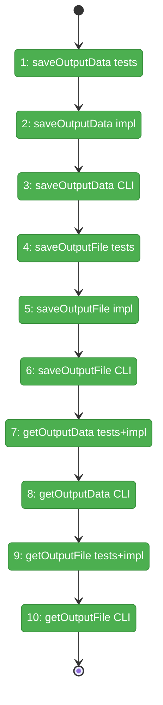
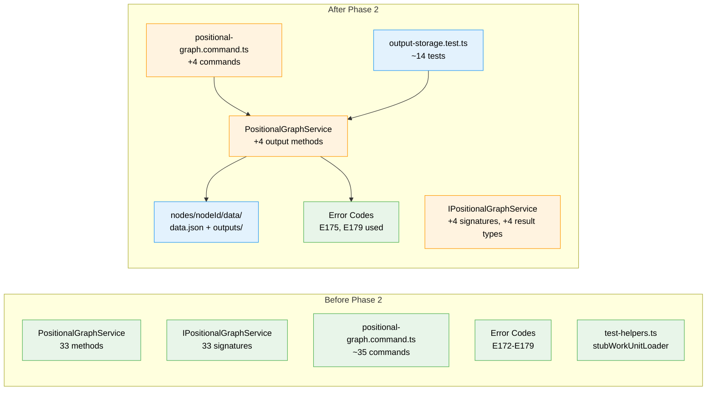

# Flight Plan: Phase 2 — Output Storage

**Plan**: [../../pos-agentic-cli-plan.md](../../pos-agentic-cli-plan.md)
**Phase**: Phase 2: Output Storage
**Generated**: 2026-02-03
**Status**: Landed

---

## Departure → Destination

**Where we are**: Phase 1 established the foundation — 7 error codes (E172-E179), Question schema, NodeStateEntry extensions, and test helpers (`stubWorkUnitLoader`). The positional graph service has 33 methods for graph/line/node operations and status computation. However, agents cannot save their outputs or retrieve them — no implementation exists for the output storage pattern.

**Where we're going**: By the end of this phase, agents can save output data values (`cg wf node save-output-data`) and files (`cg wf node save-output-file`), then retrieve them via `get-output-data` and `get-output-file`. A developer running `cg wf node save-output-data sample-e2e node-1 spec '"hello"'` will see the value persisted to `nodes/node-1/data/data.json` as `{ "outputs": { "spec": "hello" } }`, and `cg wf node get-output-data sample-e2e node-1 spec` will return `"hello"`.

**DYK Alignment Complete**: Directory structure uses `data/` subdirectory (WorkGraph pattern), `{ "outputs": {...} }` wrapper in data.json, file paths tracked in data.json for flexibility, path traversal prevention via rejection + containment check.

---

## Flight Status

<!-- Updated by /plan-6: pending → active → done. Use blocked for problems/input needed. -->

**Legend**: grey = pending | yellow = active | red = blocked/needs input | green = done

---

## Stages

<!-- Updated by /plan-6 during implementation: [ ] → [~] → [x] -->

- [x] **Stage 1: Write saveOutputData tests** — TDD RED phase for data value persistence (`output-storage.test.ts` — new file)
- [x] **Stage 2: Implement saveOutputData** — Add interface signature and service method using atomic write pattern (`positional-graph-service.interface.ts`, `positional-graph.service.ts`)
- [x] **Stage 3: Add save-output-data CLI** — Register command handler with JSON output (`positional-graph.command.ts`)
- [x] **Stage 4: Write saveOutputFile tests** — Tests included in Stage 1 (`output-storage.test.ts`)
- [x] **Stage 5: Implement saveOutputFile** — Implemented with Stage 2 (`positional-graph.service.ts`)
- [x] **Stage 6: Add save-output-file CLI** — Register command handler with JSON output (`positional-graph.command.ts`)
- [x] **Stage 7: Write getOutputData tests and implement** — Tests in Stage 1, service in Stage 2 (`output-storage.test.ts`, `positional-graph.service.ts`)
- [x] **Stage 8: Add get-output-data CLI** — Register command handler with JSON output (`positional-graph.command.ts`)
- [x] **Stage 9: Write getOutputFile tests and implement** — Tests in Stage 1, service in Stage 2 (`output-storage.test.ts`, `positional-graph.service.ts`)
- [x] **Stage 10: Add get-output-file CLI** — Register command handler with JSON output (`positional-graph.command.ts`)

---

## Acceptance Criteria

- [x] AC-8: `cg wf node save-output-data` persists value to `nodes/<nodeId>/data/data.json`
- [x] AC-9: `cg wf node save-output-file` copies file to `nodes/<nodeId>/data/outputs/` and records path in data.json
- [x] AC-10: `cg wf node get-output-data` returns stored value from data.json
- [x] AC-11: `cg wf node get-output-file` returns absolute file path (stored as relative, returned as absolute)

---

## Goals & Non-Goals

**Goals**:
- Implement `saveOutputData` service method with atomic write pattern
- Implement `saveOutputFile` service method with path traversal prevention
- Implement `getOutputData` service method with E175 error handling
- Implement `getOutputFile` service method returning absolute paths
- Add 4 CLI commands with JSON output support
- Full TDD coverage for all methods

**Non-Goals**:
- Node lifecycle transitions (`startNode`, `endNode`, `canEnd`) — Phase 3
- Question/answer protocol — Phase 4
- Input retrieval (`getInputData`/`getInputFile`) — Phase 5
- WorkUnit output validation in save methods — happens in `canEnd` (Phase 3)
- Output overwrite prevention — overwrites allowed per spec Q5

---

## Architecture: Before & After

**Legend**: existing (green, unchanged) | changed (orange, modified) | new (blue, created)

---

## Checklist

- [x] T001: Write tests for all output storage methods (CS-2)
- [x] T002: Add all result types and interface signatures (CS-1)
- [x] T003: Implement `saveOutputData` in service (CS-2)
- [x] T004: Add CLI command `cg wf node save-output-data` (CS-2)
- [x] T005: Write tests for `saveOutputFile` — included in T001 (CS-3)
- [x] T006: Add `SaveOutputFileResult` type — included in T002 (CS-1)
- [x] T007: Implement `saveOutputFile` in service (CS-3)
- [x] T008: Add CLI command `cg wf node save-output-file` (CS-2)
- [x] T009: Write tests for `getOutputData` — included in T001 (CS-2)
- [x] T010: Implement `getOutputData` in service (CS-2)
- [x] T011: Add CLI command `cg wf node get-output-data` (CS-2)
- [x] T012: Write tests for `getOutputFile` — included in T001 (CS-2)
- [x] T013: Implement `getOutputFile` in service (CS-2)
- [x] T014: Add CLI command `cg wf node get-output-file` (CS-2)

---

## PlanPak

Active — files organized under `packages/positional-graph/src/features/028-pos-agentic-cli/`
