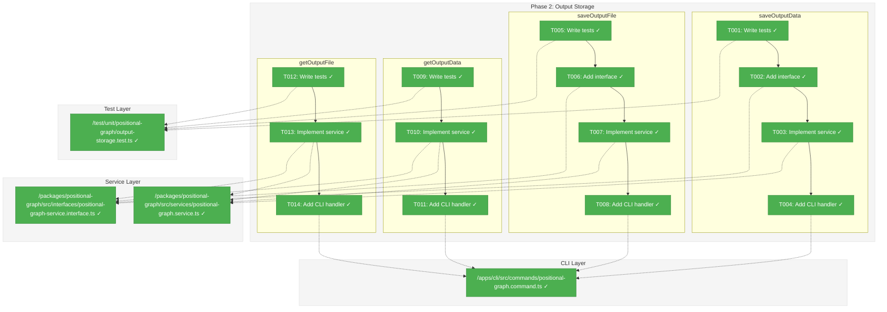
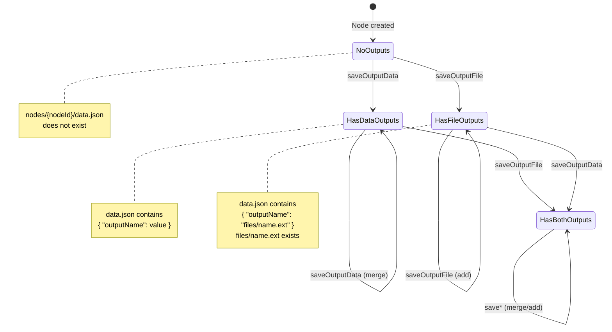
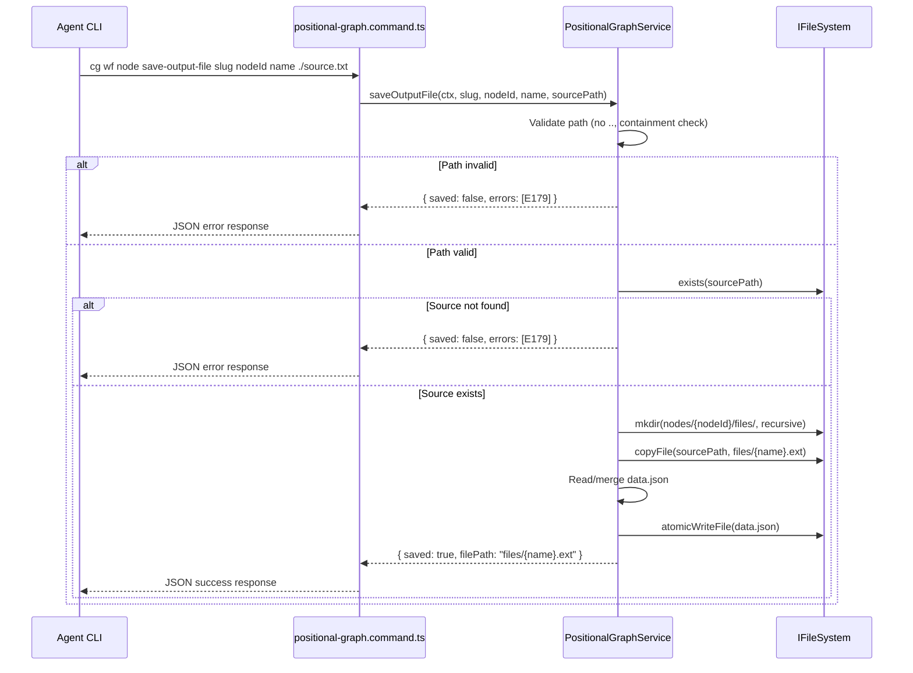

# Phase 2: Output Storage – Tasks & Alignment Brief

**Spec**: [../../pos-agentic-cli-spec.md](../../pos-agentic-cli-spec.md)
**Plan**: [../../pos-agentic-cli-plan.md](../../pos-agentic-cli-plan.md)
**Date**: 2026-02-03

---

## Executive Briefing

### Purpose

This phase implements the output storage methods that enable data flow between workflow nodes. Without output storage, agents cannot save their work results for downstream consumption, making the execution lifecycle incomplete.

### What We're Building

Four service methods and four CLI commands for output storage:
- `saveOutputData` / `cg wf node save-output-data` — Persist a JSON value to a node's data store
- `saveOutputFile` / `cg wf node save-output-file` — Copy a file to a node's output directory
- `getOutputData` / `cg wf node get-output-data` — Retrieve a stored JSON value
- `getOutputFile` / `cg wf node get-output-file` — Get the absolute path to a stored file

### User Value

Agents executing workflow nodes can save their outputs (data values and files) so that downstream nodes can retrieve them as inputs. This enables the complete data flow through a multi-node pipeline.

### Example

**Before (node 1 agent saves output):**
```bash
$ cg wf node save-output-data sample-e2e sample-coder-a7b language '"bash"'
{
  "nodeId": "sample-coder-a7b",
  "outputName": "language",
  "saved": true,
  "errors": []
}
```

**After (node 2 agent retrieves input via Phase 5):**
```bash
$ cg wf node get-input-data sample-e2e sample-tester-c8d language
{
  "inputName": "language",
  "sourceNodeId": "sample-coder-a7b",
  "value": "bash",
  "errors": []
}
```

---

## Objectives & Scope

### Objective

Implement output storage methods that persist node outputs to `nodes/<nodeId>/data/data.json` and `nodes/<nodeId>/data/outputs/`, enabling data flow between pipeline nodes as specified in AC-8 through AC-11.

### Goals

- ✅ Implement `saveOutputData` service method with atomic write pattern
- ✅ Implement `saveOutputFile` service method with path traversal prevention
- ✅ Implement `getOutputData` service method with E175 error handling
- ✅ Implement `getOutputFile` service method returning absolute paths
- ✅ Add 4 CLI commands with JSON output support
- ✅ Add 4 interface signatures with result types
- ✅ Full TDD coverage for all methods

### Non-Goals

- ❌ Node lifecycle transitions (Phase 3) — `startNode`, `endNode`, `canEnd` are separate
- ❌ Question/answer protocol (Phase 4) — Q&A methods not in this phase
- ❌ Input retrieval (Phase 5) — `getInputData`/`getInputFile` build on this phase but are separate
- ❌ WorkUnit output validation in save methods — validation happens in `canEnd` (Phase 3)
- ❌ Output overwrite prevention — overwrites are allowed (per spec clarification Q5)
- ❌ File streaming for large files — simple copy is sufficient for MVP

---

## Pre-Implementation Audit

### Summary

| File | Action | Origin | Modified By | Recommendation |
|------|--------|--------|-------------|----------------|
| `/home/jak/substrate/028-pos-agentic-cli/packages/positional-graph/src/services/positional-graph.service.ts` | Modify | Plan 026 | Plan 022 | keep-as-is |
| `/home/jak/substrate/028-pos-agentic-cli/packages/positional-graph/src/interfaces/positional-graph-service.interface.ts` | Modify | Plan 026 | Plan 022 | keep-as-is |
| `/home/jak/substrate/028-pos-agentic-cli/apps/cli/src/commands/positional-graph.command.ts` | Modify | Plan 026 | Plan 022 | keep-as-is |
| `/home/jak/substrate/028-pos-agentic-cli/test/unit/positional-graph/output-storage.test.ts` | Create | Phase 2 | — | create-per-plan |

### Per-File Detail

#### `positional-graph.service.ts`
- **Provenance**: Created by Plan 026 Phase 3, extended through Plan 022 Phase 4
- **Current state**: 1,399 lines, 33 public methods, no output storage methods
- **Integration points**: Atomic write pattern via `atomicWriteFile()` already in place
- **Compliance**: No violations — follows DI, interface-first patterns

#### `positional-graph-service.interface.ts`
- **Provenance**: Created by Plan 026 Phase 3, extended through Plan 022 Phase 4
- **Current state**: 472 lines, `IPositionalGraphService` with 33 methods
- **Missing**: 4 result types and 4 method signatures for output storage
- **Compliance**: No violations — follows BaseResult pattern

#### `positional-graph.command.ts`
- **Provenance**: Created by Plan 026 Phase 6, extended through Plan 022 Phase 4
- **Current state**: 1,178 lines, ~35 subcommands
- **Missing**: 4 command handlers for output storage
- **Compliance**: No violations — follows DI container pattern

#### `output-storage.test.ts`
- **Status**: New file to be created
- **Location**: Correct per centralized test strategy
- **Infrastructure**: test-helpers.ts from Phase 1 available

### Compliance Check

No violations found. All files follow project rules and ADR constraints.

---

## Requirements Traceability

### Coverage Matrix

| AC | Description | Flow Summary | Files in Flow | Tasks | Status |
|----|-------------|--------------|---------------|-------|--------|
| AC-8 | `save-output-data` persists to data.json | CLI → service → atomicWriteFile | 4 files | T001-T004 | ⏳ Pending |
| AC-9 | `save-output-file` copies file to files/ | CLI → service → path validation → fs.copy → atomicWriteFile | 4 files | T005-T008 | ⏳ Pending |
| AC-10 | `get-output-data` returns stored value | CLI → service → read data.json → E175 if missing | 4 files | T009-T011 | ⏳ Pending |
| AC-11 | `get-output-file` returns absolute path | CLI → service → read data.json → resolve path → E175/E179 | 4 files | T012-T014 | ⏳ Pending |

### Gaps Found

None — all acceptance criteria have complete file coverage in the task table.

### Orphan Files

None — all 4 files are directly required by the acceptance criteria.

---

## Architecture Map

### Component Diagram

<!-- Status: grey=pending, orange=in-progress, green=completed, red=blocked -->
<!-- Updated by plan-6 during implementation -->



### Task-to-Component Mapping

<!-- Status: ⬜ Pending | 🟧 In Progress | ✅ Complete | 🔴 Blocked -->

| Task | Component(s) | Files | Status | Comment |
|------|-------------|-------|--------|---------|
| T001 | Test Suite | output-storage.test.ts | ✅ Complete | TDD RED: all 21 tests for 4 methods |
| T002 | Interface | positional-graph-service.interface.ts | ✅ Complete | All 4 result types + method signatures |
| T003 | Service | positional-graph.service.ts | ✅ Complete | Implemented saveOutputData with atomic write |
| T004 | CLI | positional-graph.command.ts | ✅ Complete | save-output-data command handler |
| T005 | Test Suite | output-storage.test.ts | ✅ Complete | Tests included in T001 |
| T006 | Interface | positional-graph-service.interface.ts | ✅ Complete | Interface included in T002 |
| T007 | Service | positional-graph.service.ts | ✅ Complete | Implemented saveOutputFile with path containment |
| T008 | CLI | positional-graph.command.ts | ✅ Complete | save-output-file command handler |
| T009 | Test Suite | output-storage.test.ts | ✅ Complete | Tests included in T001 |
| T010 | Service + Interface | Both | ✅ Complete | Implemented getOutputData (interface in T002) |
| T011 | CLI | positional-graph.command.ts | ✅ Complete | get-output-data command handler |
| T012 | Test Suite | output-storage.test.ts | ✅ Complete | Tests included in T001 |
| T013 | Service + Interface | Both | ✅ Complete | Implemented getOutputFile (interface in T002) |
| T014 | CLI | positional-graph.command.ts | ✅ Complete | get-output-file command handler |

---

## Tasks

| Status | ID | Task | CS | Type | Dependencies | Absolute Path(s) | Validation | Subtasks | Notes |
|--------|------|------|-----|------|--------------|------------------|------------|----------|-------|
| [x] | T001 | Write tests for all output storage methods | 2 | Test | – | `/home/jak/substrate/028-pos-agentic-cli/test/unit/positional-graph/output-storage.test.ts` | Tests pass (21 tests) | – | TDD: all 4 methods with comprehensive coverage |
| [x] | T002 | Add all result types and interface signatures | 1 | Interface | T001 | `/home/jak/substrate/028-pos-agentic-cli/packages/positional-graph/src/interfaces/positional-graph-service.interface.ts` | TypeScript compiles | – | 4 result types, 4 method signatures |
| [x] | T003 | Implement `saveOutputData` in service | 2 | Core | T002 | `/home/jak/substrate/028-pos-agentic-cli/packages/positional-graph/src/services/positional-graph.service.ts` | Tests pass | – | Reuse `getNodeDir()` + `atomicWriteFile` |
| [x] | T004 | Add CLI command `cg wf node save-output-data` | 2 | CLI | T003 | `/home/jak/substrate/028-pos-agentic-cli/apps/cli/src/commands/positional-graph.command.ts` | CLI builds, help shows | – | JSON value parsing + service call |
| [x] | T005 | Write tests for `saveOutputFile` with path validation | 3 | Test | T001 | `/home/jak/substrate/028-pos-agentic-cli/test/unit/positional-graph/output-storage.test.ts` | Tests pass | – | Included in T001 |
| [x] | T006 | Add `SaveOutputFileResult` type and interface signature | 1 | Interface | T005 | `/home/jak/substrate/028-pos-agentic-cli/packages/positional-graph/src/interfaces/positional-graph-service.interface.ts` | TypeScript compiles | – | Included in T002 |
| [x] | T007 | Implement `saveOutputFile` in service with path containment check | 3 | Core | T006 | `/home/jak/substrate/028-pos-agentic-cli/packages/positional-graph/src/services/positional-graph.service.ts` | Tests pass; path traversal rejected | – | Implemented with T003 |
| [x] | T008 | Add CLI command `cg wf node save-output-file` | 2 | CLI | T007 | `/home/jak/substrate/028-pos-agentic-cli/apps/cli/src/commands/positional-graph.command.ts` | CLI builds, help shows | – | Source path + service call |
| [x] | T009 | Write tests for `getOutputData` | 2 | Test | T003 | `/home/jak/substrate/028-pos-agentic-cli/test/unit/positional-graph/output-storage.test.ts` | Tests pass | – | Included in T001 |
| [x] | T010 | Implement `getOutputData` in service + add interface signature | 2 | Core | T009 | `/home/jak/substrate/028-pos-agentic-cli/packages/positional-graph/src/services/positional-graph.service.ts`, `/home/jak/substrate/028-pos-agentic-cli/packages/positional-graph/src/interfaces/positional-graph-service.interface.ts` | Tests pass | – | Implemented with T003 |
| [x] | T011 | Add CLI command `cg wf node get-output-data` | 2 | CLI | T010 | `/home/jak/substrate/028-pos-agentic-cli/apps/cli/src/commands/positional-graph.command.ts` | CLI builds, help shows | – | Service call returns value |
| [x] | T012 | Write tests for `getOutputFile` | 2 | Test | T007 | `/home/jak/substrate/028-pos-agentic-cli/test/unit/positional-graph/output-storage.test.ts` | Tests pass | – | Included in T001 |
| [x] | T013 | Implement `getOutputFile` in service + add interface signature | 2 | Core | T012 | `/home/jak/substrate/028-pos-agentic-cli/packages/positional-graph/src/services/positional-graph.service.ts`, `/home/jak/substrate/028-pos-agentic-cli/packages/positional-graph/src/interfaces/positional-graph-service.interface.ts` | Tests pass | – | Implemented with T003 |
| [x] | T014 | Add CLI command `cg wf node get-output-file` | 2 | CLI | T013 | `/home/jak/substrate/028-pos-agentic-cli/apps/cli/src/commands/positional-graph.command.ts` | CLI builds, help shows | – | Service call returns path |

---

## Alignment Brief

### Prior Phases Review

#### Phase 1: Foundation - Error Codes and Schemas (Complete)

**Deliverables Created:**
- 7 error codes (E172-E179, excluding E174) with factory functions in `positional-graph-errors.ts`
- `QuestionSchema`, `QuestionTypeSchema`, `NodeStateEntryErrorSchema` in `state.schema.ts`
- Extended `NodeStateEntrySchema` with `pending_question_id` and `error` fields
- Extended `StateSchema` with `questions` array
- Test helper module: `stubWorkUnitLoader`, `createWorkUnit`, `testFixtures`

**Dependencies Exported for Phase 2:**
| Export | Type | Usage in Phase 2 |
|--------|------|------------------|
| `outputNotFoundError` (E175) | Error factory | When output is missing during `getOutputData`/`getOutputFile` |
| `fileNotFoundError` (E179) | Error factory | When source file doesn't exist in `saveOutputFile` |
| `stubWorkUnitLoader` | Test helper | Mock WorkUnit loader for Phase 2 tests |

**Patterns Established:**
- Error factory pattern: Each factory returns `ResultError` with `code`, `message`, `action`
- Schema extension pattern: Optional fields for backward compatibility
- TDD cycle: RED → GREEN → verify no regression

**Key Log References:**
- [execution.log.md#task-t003-t004](../phase-1-foundation-error-codes-and-schemas/execution.log.md#task-t003-t004) — Error code implementation
- [execution.log.md#task-t009](../phase-1-foundation-error-codes-and-schemas/execution.log.md#task-t009) — Test helper creation

### Critical Findings Affecting This Phase

| Finding | Constraint | Tasks Addressing |
|---------|-----------|------------------|
| #02: Output storage infrastructure before output methods | Implement save methods before get methods | T001-T008 before T009-T014 |
| #03: Path traversal is critical security risk | Validate paths using `path.resolve()` + containment check; reject `..` in output names | T005, T007 |

### ADR Decision Constraints

| ADR | Requirement | Constraint | Addressed By |
|-----|-------------|-----------|--------------|
| ADR-0006 | CLI-based orchestration | Commands are the interface for agents | T004, T008, T011, T014 |
| ADR-0008 | Workspace split storage | Data in `.chainglass/data/workflows/` | T003, T007, T010, T013 |

### PlanPak Placement Rules

- **Plan-scoped files**: Test file `output-storage.test.ts` → `test/unit/positional-graph/`
- **Cross-cutting files**: Service/interface/CLI are shared → traditional locations
- **Classification tags not needed** — files follow established project conventions

### Data Structure (Adopted from WorkGraph)

**Directory Structure** (adopted from WorkGraph):
```
nodes/{nodeId}/
├── node.yaml           # Node config (existing)
└── data/
    ├── data.json       # Output values: { "outputs": {...} }
    └── outputs/        # File storage directory
        └── {outputName}.ext
```

**data.json Schema**:
```json
{
  "outputs": {
    "language": "bash",
    "script": ".chainglass/data/workflows/{slug}/nodes/{nodeId}/data/outputs/script.sh"
  }
}
```

**Rules**:
- Wrapper object `{ "outputs": {...} }` — not flat top-level (enables future `questions` extension in Phase 4)
- Data outputs: actual JSON values (string, number, boolean, object, array, null)
- File outputs: **relative paths** stored for git portability, returned as **absolute** to callers
- Files stored in: `nodes/{nodeId}/data/outputs/{outputName}.ext`

> **Note**: Workshop doc (`cli-and-e2e-flow.md`) shows simplified paths — update in Phase 6 documentation.

### Invariants & Guardrails

1. **Path containment**: All file operations must verify resolved path is within `nodes/<nodeId>/` directory
2. **Atomic writes**: All JSON writes use `atomicWriteFile` pattern (no partial writes)
3. **Relative paths for files**: Store relative in data.json, return absolute to callers
4. **Error codes**: Use E175 for missing outputs, E179 for missing files, E153 for missing nodes

### Existing Infrastructure to Reuse

| Helper | Location | Usage |
|--------|----------|-------|
| `getNodeDir(ctx, graphSlug, nodeId)` | positional-graph.service.ts:190 | Get node directory path |
| `atomicWriteFile(fs, path, content)` | atomic-file.ts | Write JSON atomically |
| `loadNodeConfig()` | positional-graph.service.ts:199 | Validate node exists |
| `pathResolver.join()` | Injected dependency | Build paths safely |

**Pattern**: Follow existing service methods (e.g., `setInput`, `showNode`) for load-validate-mutate-persist flow.

### Inputs to Read

| File | Purpose |
|------|---------|
| `packages/positional-graph/src/services/positional-graph.service.ts` | Existing service methods and patterns |
| `packages/positional-graph/src/services/atomic-file.ts` | Atomic write helper |
| `test/unit/positional-graph/test-helpers.ts` | Test infrastructure from Phase 1 |
| `docs/plans/028-pos-agentic-cli/workshops/cli-and-e2e-flow.md` | JSON output schemas for CLI commands |

### Visual Alignment Aids

#### State Machine: Output Storage Flow



#### Sequence Diagram: saveOutputFile Flow



### Test Plan (Full TDD)

#### saveOutputData Tests (T001)

| Test | Purpose | Fixture | Expected |
|------|---------|---------|----------|
| saves value to data.json | Basic write | `{ slug, nodeId, name: "spec", value: "hello" }` | data.json contains `{ "outputs": { "spec": "hello" } }` |
| merges with existing outputs | Non-destructive | Existing `{ "outputs": { "a": 1 } }`, save `{ "b": 2 }` | `{ "outputs": { "a": 1, "b": 2 } }` |
| handles JSON types | Type coercion | string, number, boolean, object, array, null | All stored correctly |
| overwrites existing output | Per spec Q5 | Existing `{ "outputs": { "spec": "old" } }`, save new | `{ "outputs": { "spec": "new" } }` |
| returns E153 for unknown node | Error path | Invalid nodeId | `errors: [{ code: "E153" }]` |

#### saveOutputFile Tests (T005)

| Test | Purpose | Fixture | Expected |
|------|---------|---------|----------|
| copies file to files/ directory | Basic copy | Valid source path | File copied, data.json updated |
| rejects path traversal in source | Security | `../../../etc/passwd` | `errors: [{ code: "E179" }]` |
| rejects path traversal in output name | Security | name: `../malicious` | Error returned |
| returns E179 for missing source | Error path | Non-existent source | `errors: [{ code: "E179" }]` |
| creates files/ directory if missing | Setup | No files/ dir exists | Directory created |
| preserves file extension | Naming | `add.sh` → `files/script.sh` | Extension preserved |

#### getOutputData Tests (T009)

| Test | Purpose | Fixture | Expected |
|------|---------|---------|----------|
| reads value from data.json | Basic read | data.json with `{ "outputs": { "spec": "hello" } }` | `{ value: "hello" }` |
| returns E175 for missing output | Error path | data.json without requested key | `errors: [{ code: "E175" }]` |
| returns E175 if data.json missing | Error path | No data.json file | `errors: [{ code: "E175" }]` |
| returns E153 for unknown node | Error path | Invalid nodeId | `errors: [{ code: "E153" }]` |

#### getOutputFile Tests (T012)

| Test | Purpose | Fixture | Expected |
|------|---------|---------|----------|
| returns absolute path | Path resolution | data.json with `{ "outputs": { "script": "...relative/path..." } }` | Absolute path returned |
| returns E175 for missing output | Error path | data.json without requested key | `errors: [{ code: "E175" }]` |
| returns E175 if data.json missing | Error path | No data.json file | `errors: [{ code: "E175" }]` |

### Step-by-Step Implementation Outline

1. **T001**: Create `output-storage.test.ts`, write saveOutputData tests (RED)
2. **T002**: Add `SaveOutputDataResult` type to interface, add method signature
3. **T003**: Implement `saveOutputData()` in service using atomic write (GREEN)
4. **T004**: Add CLI handler for `save-output-data`, register command
5. **T005**: Add saveOutputFile tests with path validation tests (RED)
6. **T006**: Add `SaveOutputFileResult` type to interface, add method signature
7. **T007**: Implement `saveOutputFile()` with path containment check (GREEN)
8. **T008**: Add CLI handler for `save-output-file`, register command
9. **T009**: Add getOutputData tests (RED)
10. **T010**: Implement `getOutputData()` + interface (GREEN)
11. **T011**: Add CLI handler for `get-output-data`, register command
12. **T012**: Add getOutputFile tests (RED)
13. **T013**: Implement `getOutputFile()` + interface (GREEN)
14. **T014**: Add CLI handler for `get-output-file`, register command

### Commands to Run

```bash
# Run tests during TDD
pnpm test test/unit/positional-graph/output-storage.test.ts

# Run all positional-graph tests (no regression)
pnpm test test/unit/positional-graph/

# Type checking
pnpm typecheck

# Linting
pnpm lint

# Full quality check
just check

# Build to verify compilation
pnpm build
```

### Risks/Unknowns

| Risk | Severity | Mitigation |
|------|----------|------------|
| Path traversal attack via source path | High | Validate with `path.resolve()` + containment check; test exhaustively |
| Atomic write failure leaves partial state | Medium | Use existing `atomicWriteFile` pattern; write to temp then rename |
| Large file memory issues | Low | Copy files via streams, not loading into memory |

### Ready Check

- [x] Phase 1 complete (error codes E175, E179 available)
- [x] Test infrastructure from Phase 1 available (`stubWorkUnitLoader`)
- [x] Workshop JSON schemas reviewed for CLI output format
- [x] Critical Finding #03 (path traversal) understood and test cases planned
- [x] DYK session complete — 5 critical insights aligned
- [ ] ADR constraints mapped to tasks (IDs noted in Notes column) - N/A for this phase

---

## Phase Footnote Stubs

| Footnote | Task | Description |
|----------|------|-------------|
| | | |

_Populated by plan-6 during implementation._

---

## Evidence Artifacts

- **Execution log**: `./execution.log.md` — Written by plan-6 during implementation
- **Test output**: `test/unit/positional-graph/output-storage.test.ts` — TDD artifacts

---

## Did You Know (DYK) Session Findings

_Pre-implementation alignment session findings — decisions that clarify ambiguities before coding begins._

| # | Topic | Decision | Rationale |
|---|-------|----------|-----------|
| 1 | data.json structure | Adopt WorkGraph's `{ "outputs": {...} }` wrapper | Proven pattern; enables future `questions` extension in Phase 4 |
| 2 | Directory structure | Use `data/` subdirectory: `nodes/{nodeId}/data/data.json` and `data/outputs/` | Cleaner than flat `files/`; aligns with WorkGraph |
| 3 | Infrastructure reuse | Use existing `getNodeDir()`, `atomicWriteFile`, `loadNodeConfig()` | DRY; proven patterns already in service |
| 4 | File output tracking | Track file paths in `data.json`, not just filesystem presence | Allows saving extra files not declared in WorkUnit; flexibility > strictness |
| 5 | Path traversal prevention | Reject `..` in paths AND verify containment after `path.resolve()` | Critical security gate (CF-03); belt-and-suspenders approach |

---

## Discoveries & Learnings

_Populated during implementation by plan-6. Log anything of interest to your future self._

| Date | Task | Type | Discovery | Resolution | References |
|------|------|------|-----------|------------|------------|
| | | | | | |

**Types**: `gotcha` | `research-needed` | `unexpected-behavior` | `workaround` | `decision` | `debt` | `insight`

**What to log**:
- Things that didn't work as expected
- External research that was required
- Implementation troubles and how they were resolved
- Gotchas and edge cases discovered
- Decisions made during implementation
- Technical debt introduced (and why)
- Insights that future phases should know about

_See also: `execution.log.md` for detailed narrative._

---

## Directory Layout

```
docs/plans/028-pos-agentic-cli/
├── pos-agentic-cli-plan.md
├── pos-agentic-cli-spec.md
├── workshops/
│   └── cli-and-e2e-flow.md
└── tasks/
    ├── phase-1-foundation-error-codes-and-schemas/
    │   ├── tasks.md
    │   ├── tasks.fltplan.md
    │   └── execution.log.md
    └── phase-2-output-storage/
        ├── tasks.md              # This file
        ├── tasks.fltplan.md      # Generated by /plan-5b
        └── execution.log.md      # Created by /plan-6
```
